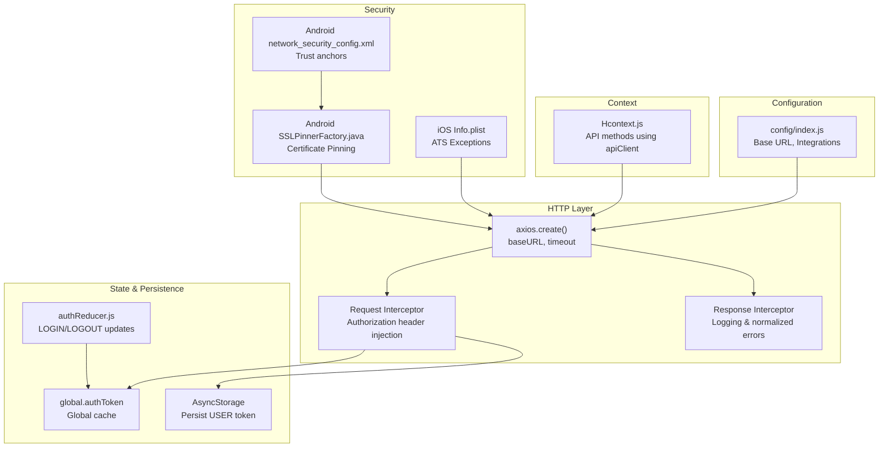
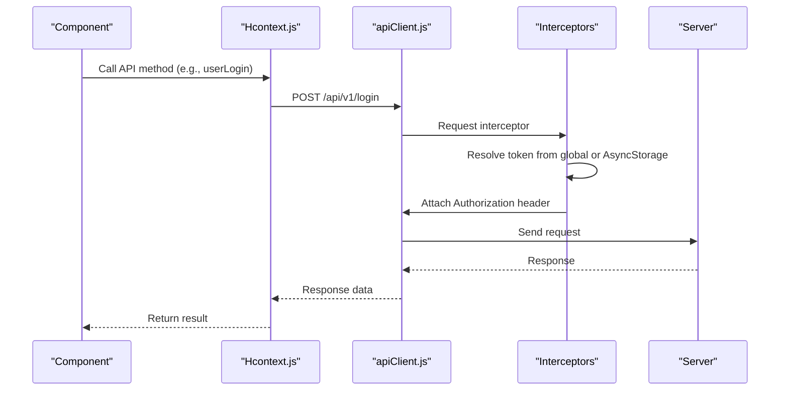
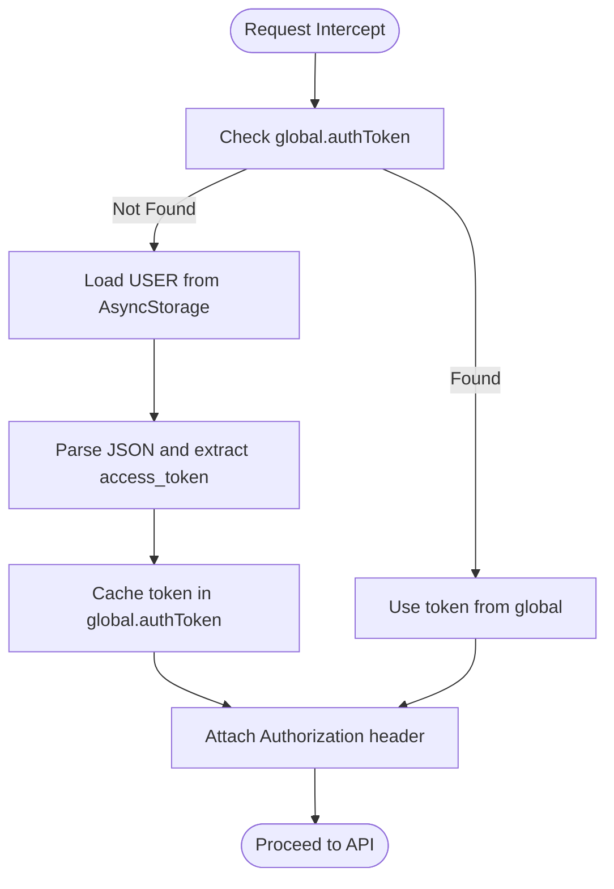
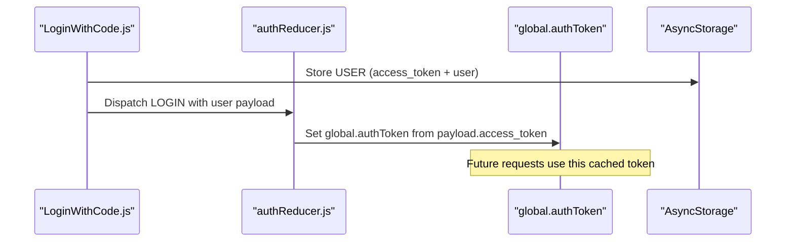
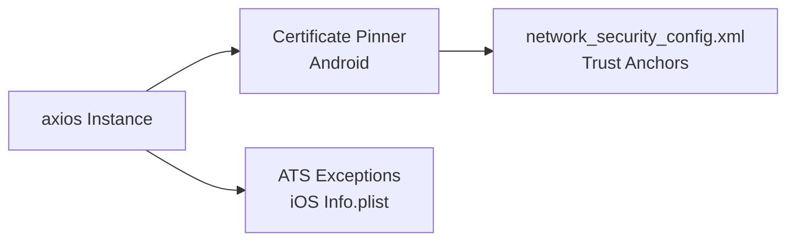
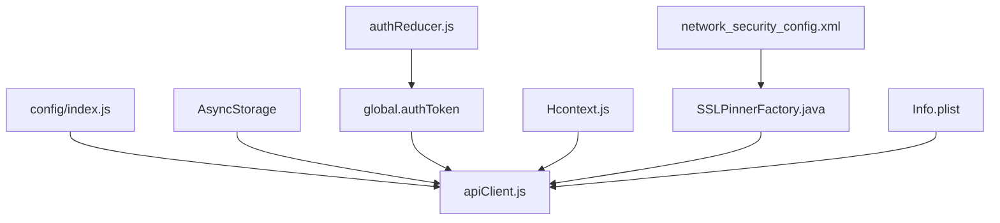

# API Configuration & Security

<cite>
**Referenced Files in This Document**
- [apiClient.js](file://src/context/apiClient.js)
- [index.js](file://src/config/index.js)
- [Hcontext.js](file://src/context/Hcontext.js)
- [authReducer.js](file://src/context/reducers/authReducer.js)
- [LoginWithCode.js](file://src/screens/Auth/LoginWithCode.js)
- [SSLPinnerFactory.java](file://android/app/src/main/java/com/happimynd/SSLPinnerFactory.java)
- [network_security_config.xml](file://android/app/src/main/res/xml/network_security_config.xml)
- [Info.plist](file://ios/HappiMynd/Info.plist)
- [test_endpoints.js](file://test_endpoints.js)
</cite>

## Table of Contents
1. [Introduction](#introduction)
2. [Project Structure](#project-structure)
3. [Core Components](#core-components)
4. [Architecture Overview](#architecture-overview)
5. [Detailed Component Analysis](#detailed-component-analysis)
6. [Dependency Analysis](#dependency-analysis)
7. [Performance Considerations](#performance-considerations)
8. [Troubleshooting Guide](#troubleshooting-guide)
9. [Conclusion](#conclusion)

## Introduction
This document explains the HappiMynd API client configuration, security measures, and utility functions. It covers axios configuration (base URL, timeouts, interceptors), authentication token injection, global state management, AsyncStorage persistence, error handling/logging, security hardening (certificate pinning), environment configuration, and practical troubleshooting steps for connectivity and security issues.

## Project Structure
The API configuration centers around a shared axios instance with request/response interceptors, a centralized configuration module, and React context for state management. Security is enforced through certificate pinning on Android and ATS exceptions on iOS, with token persistence via AsyncStorage.

**Diagram sources**
- [apiClient.js:1-58](file://src/context/apiClient.js#L1-L58)
- [index.js:1-13](file://src/config/index.js#L1-L13)
- [Hcontext.js:129-145](file://src/context/Hcontext.js#L129-L145)
- [authReducer.js:17-78](file://src/context/reducers/authReducer.js#L17-L78)
- [SSLPinnerFactory.java:1-22](file://android/app/src/main/java/com/happimynd/SSLPinnerFactory.java#L1-L22)
- [network_security_config.xml:1-10](file://android/app/src/main/res/xml/network_security_config.xml#L1-L10)
- [Info.plist:37-61](file://ios/HappiMynd/Info.plist#L37-L61)

**Section sources**
- [apiClient.js:1-58](file://src/context/apiClient.js#L1-L58)
- [index.js:1-13](file://src/config/index.js#L1-L13)
- [Hcontext.js:129-145](file://src/context/Hcontext.js#L129-L145)
- [authReducer.js:17-78](file://src/context/reducers/authReducer.js#L17-L78)
- [SSLPinnerFactory.java:1-22](file://android/app/src/main/java/com/happimynd/SSLPinnerFactory.java#L1-L22)
- [network_security_config.xml:1-10](file://android/app/src/main/res/xml/network_security_config.xml#L1-L10)
- [Info.plist:37-61](file://ios/HappiMynd/Info.plist#L37-L61)

## Core Components
- Axios client with base URL and timeout
- Request interceptor for automatic Authorization header injection
- Response interceptor for standardized error reporting
- Centralized configuration for base URLs and third-party integrations
- Authentication reducer and global token cache
- AsyncStorage-backed persistence for tokens
- Android certificate pinning and iOS ATS exceptions
- Example endpoint tests for validation

**Section sources**
- [apiClient.js:1-58](file://src/context/apiClient.js#L1-L58)
- [index.js:1-13](file://src/config/index.js#L1-L13)
- [authReducer.js:17-78](file://src/context/reducers/authReducer.js#L17-L78)
- [SSLPinnerFactory.java:1-22](file://android/app/src/main/java/com/happimynd/SSLPinnerFactory.java#L1-L22)
- [Info.plist:37-61](file://ios/HappiMynd/Info.plist#L37-L61)
- [test_endpoints.js:1-70](file://test_endpoints.js#L1-L70)

## Architecture Overview
The HTTP layer is encapsulated in a single axios instance with interceptors. API methods in the context layer use this instance. Tokens are injected automatically from either a global cache or AsyncStorage. Security is enforced via certificate pinning on Android and ATS exceptions on iOS. Configuration is centralized.

**Diagram sources**
- [Hcontext.js:129-145](file://src/context/Hcontext.js#L129-L145)
- [apiClient.js:11-44](file://src/context/apiClient.js#L11-L44)

## Detailed Component Analysis

### Axios Client Configuration
- Base URL: Resolved from centralized config
- Timeout: 15 seconds to prevent hanging requests
- Interceptors:
  - Request: Injects Authorization header using Bearer token
  - Response: Logs and normalizes error payloads

**Diagram sources**
- [apiClient.js:12-42](file://src/context/apiClient.js#L12-L42)

**Section sources**
- [apiClient.js:6-9](file://src/context/apiClient.js#L6-L9)
- [apiClient.js:12-44](file://src/context/apiClient.js#L12-L44)
- [apiClient.js:47-56](file://src/context/apiClient.js#L47-L56)

### Authentication Token Injection Mechanism
- Priority order: global.authToken → AsyncStorage USER → fallback
- On successful login, token is persisted to AsyncStorage and cached globally
- LOGOUT clears the global token

**Diagram sources**
- [LoginWithCode.js:64-73](file://src/screens/Auth/LoginWithCode.js#L64-L73)
- [authReducer.js:19-30](file://src/context/reducers/authReducer.js#L19-L30)
- [authReducer.js:65-74](file://src/context/reducers/authReducer.js#L65-L74)

**Section sources**
- [LoginWithCode.js:64-73](file://src/screens/Auth/LoginWithCode.js#L64-L73)
- [authReducer.js:19-30](file://src/context/reducers/authReducer.js#L19-L30)
- [authReducer.js:65-74](file://src/context/reducers/authReducer.js#L65-L74)

### Global State Management and AsyncStorage Integration
- AsyncStorage stores the serialized USER object containing access_token
- Global cache avoids repeated AsyncStorage reads
- LOGOUT clears the global token to prevent stale usage

**Section sources**
- [apiClient.js:18-32](file://src/context/apiClient.js#L18-L32)
- [LoginWithCode.js:70](file://src/screens/Auth/LoginWithCode.js#L70)
- [authReducer.js:65-74](file://src/context/reducers/authReducer.js#L65-L74)

### Error Handling Strategies and Logging
- Response interceptor logs error responses and normalizes to a standard shape
- Many API methods also log locally and dispatch snack notifications
- Example endpoint tester demonstrates consistent error/status handling

**Section sources**
- [apiClient.js:47-56](file://src/context/apiClient.js#L47-L56)
- [Hcontext.js:138-144](file://src/context/Hcontext.js#L138-L144)
- [test_endpoints.js:36-46](file://test_endpoints.js#L36-L46)

### Security Measures
- Android certificate pinning for the production domain
- iOS ATS exceptions configured for development and staging domains
- Trust anchors allowing system and user certificates on Android

**Diagram sources**
- [SSLPinnerFactory.java:10-21](file://android/app/src/main/java/com/happimynd/SSLPinnerFactory.java#L10-L21)
- [Info.plist:37-61](file://ios/HappiMynd/Info.plist#L37-L61)
- [network_security_config.xml:1-10](file://android/app/src/main/res/xml/network_security_config.xml#L1-L10)

**Section sources**
- [SSLPinnerFactory.java:10-21](file://android/app/src/main/java/com/happimynd/SSLPinnerFactory.java#L10-L21)
- [Info.plist:37-61](file://ios/HappiMynd/Info.plist#L37-L61)
- [network_security_config.xml:1-10](file://android/app/src/main/res/xml/network_security_config.xml#L1-L10)

### Configuration Options for Environments
- Centralized BASE_URL and integration endpoints
- Example test script demonstrates endpoint coverage and token propagation
- Consider adding environment-specific overrides for staging/production

**Section sources**
- [index.js:1-13](file://src/config/index.js#L1-L13)
- [test_endpoints.js:3-11](file://test_endpoints.js#L3-L11)

### Proxy Settings and Network Optimization
- No explicit proxy configuration detected in the analyzed files
- Consider adding axios proxy configuration or platform-specific networking stacks if needed
- Network optimization techniques (e.g., retry/backoff, deduplication) are not present in the current implementation

**Section sources**
- [apiClient.js:6-9](file://src/context/apiClient.js#L6-L9)

### API Performance Monitoring, Caching, and Rate Limiting
- No built-in performance monitoring, caching, or rate limiting observed in the analyzed files
- Suggested enhancements:
  - Centralized request/response metrics
  - Retry/backoff policies
  - Request deduplication
  - Local caching for read-heavy endpoints

**Section sources**
- [apiClient.js:11-56](file://src/context/apiClient.js#L11-L56)

## Dependency Analysis
The HTTP client depends on configuration and AsyncStorage. The context layer orchestrates API calls and state updates. Security is enforced at the platform level.

**Diagram sources**
- [index.js:1-13](file://src/config/index.js#L1-L13)
- [apiClient.js:1-58](file://src/context/apiClient.js#L1-L58)
- [authReducer.js:17-78](file://src/context/reducers/authReducer.js#L17-L78)
- [Hcontext.js:129-145](file://src/context/Hcontext.js#L129-L145)
- [SSLPinnerFactory.java:1-22](file://android/app/src/main/java/com/happimynd/SSLPinnerFactory.java#L1-L22)
- [network_security_config.xml:1-10](file://android/app/src/main/res/xml/network_security_config.xml#L1-L10)
- [Info.plist:37-61](file://ios/HappiMynd/Info.plist#L37-L61)

**Section sources**
- [apiClient.js:1-58](file://src/context/apiClient.js#L1-L58)
- [Hcontext.js:129-145](file://src/context/Hcontext.js#L129-L145)

## Performance Considerations
- Current implementation lacks explicit caching or retry logic
- Consider adding:
  - Request deduplication to avoid duplicate network calls
  - Retry with exponential backoff for transient failures
  - Local caching for read-heavy endpoints
  - Metrics collection for latency and failure rates

[No sources needed since this section provides general guidance]

## Troubleshooting Guide
Common issues and resolutions:
- Missing Authorization header
  - Ensure token is stored in AsyncStorage and global cache after login
  - Verify request interceptor resolves token from global or AsyncStorage
- Stale token errors
  - Confirm LOGOUT clears global token
  - Re-authenticate and re-store USER
- SSL/TLS errors on Android
  - Validate certificate pinning matches production certificate
  - Confirm trust anchors allow system/user certs
- ATS errors on iOS
  - Review ATS exceptions for allowed domains
  - Avoid unnecessary exceptions; keep them minimal
- Network timeouts
  - Adjust axios timeout if needed
  - Validate server availability and DNS resolution
- Endpoint test failures
  - Use the provided test script to validate endpoints and token propagation

**Section sources**
- [apiClient.js:12-42](file://src/context/apiClient.js#L12-L42)
- [authReducer.js:65-74](file://src/context/reducers/authReducer.js#L65-L74)
- [SSLPinnerFactory.java:10-21](file://android/app/src/main/java/com/happimynd/SSLPinnerFactory.java#L10-L21)
- [Info.plist:37-61](file://ios/HappiMynd/Info.plist#L37-L61)
- [test_endpoints.js:36-46](file://test_endpoints.js#L36-L46)

## Conclusion
HappiMynd’s API layer is centered on a robust axios client with automatic token injection, centralized configuration, and platform-level security. While the current implementation provides a solid foundation, enhancements in caching, retries, metrics, and environment-specific configurations would further improve reliability and maintainability.