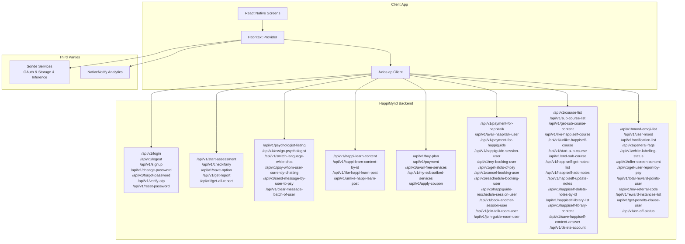
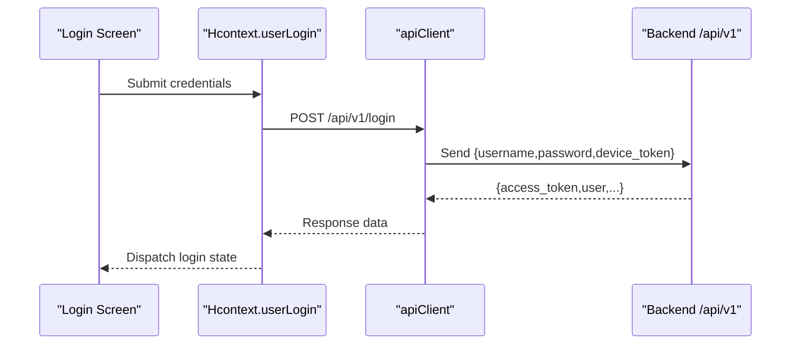
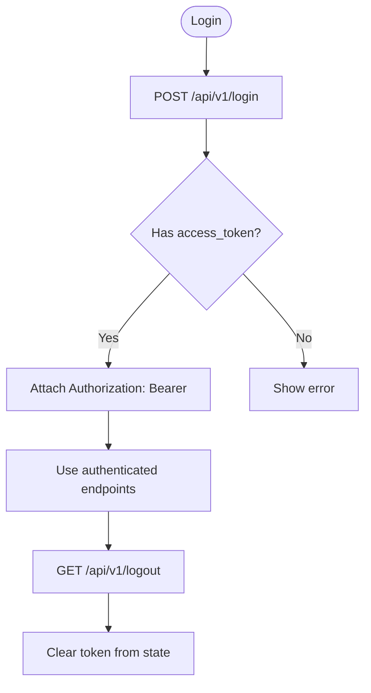
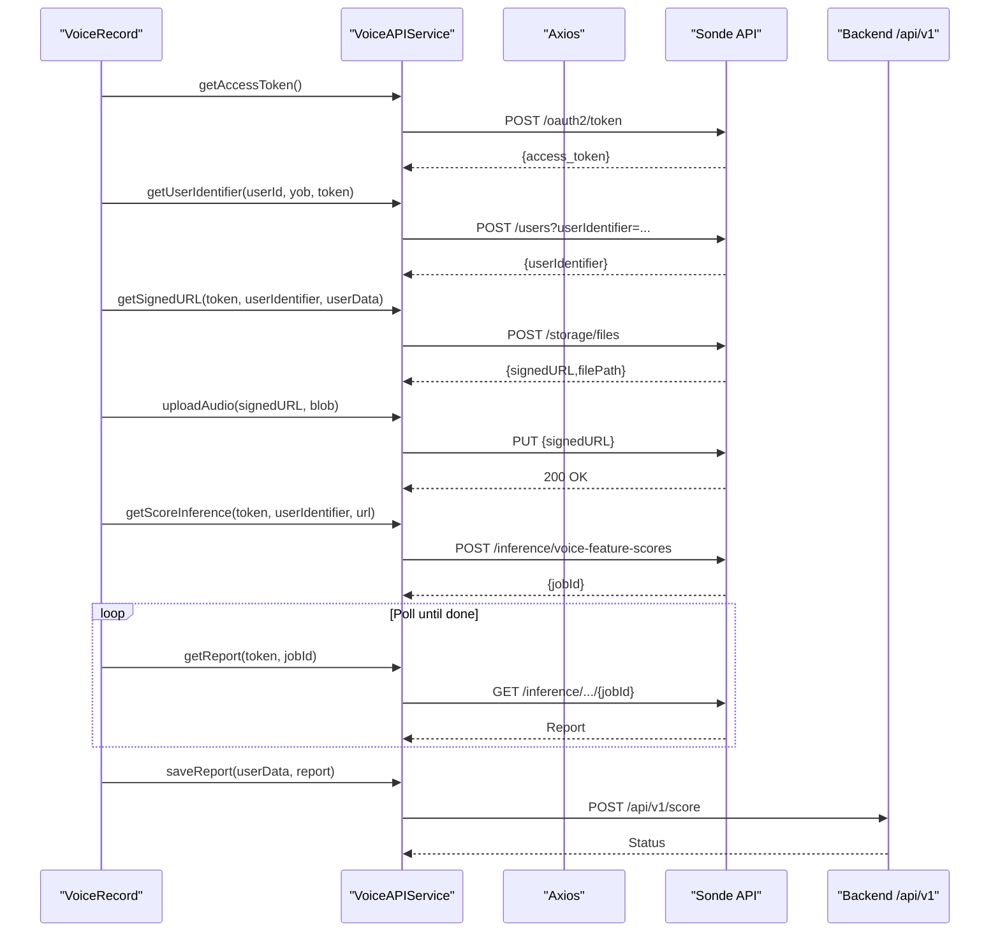
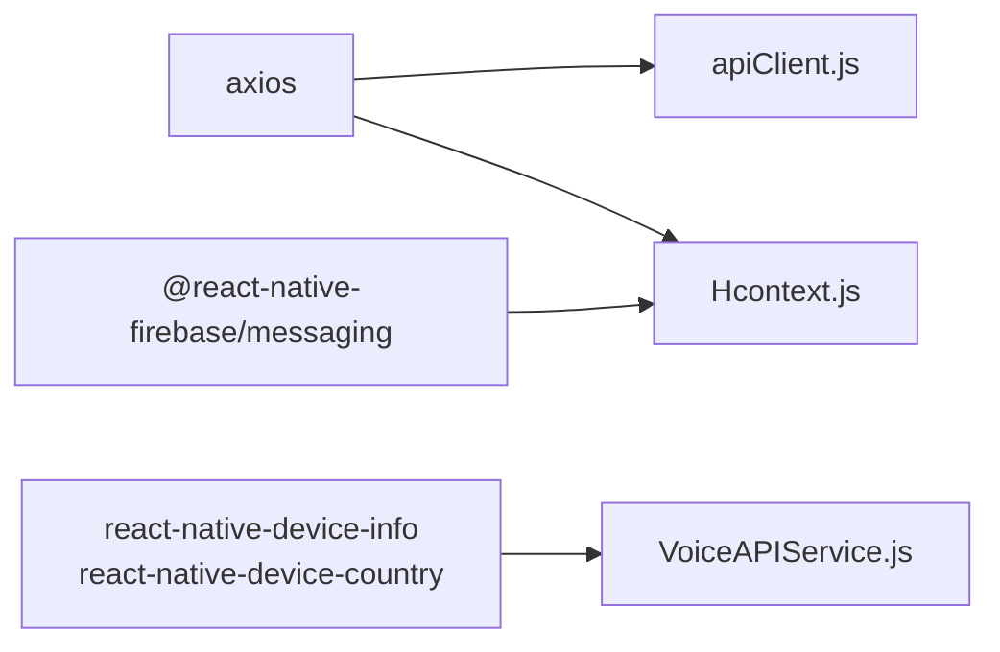

# API Reference

<cite>
**Referenced Files in This Document**
- [apiClient.js](file://src/context/apiClient.js)
- [config.js](file://src/config/index.js)
- [Hcontext.js](file://src/context/Hcontext.js)
- [test_endpoints.js](file://test_endpoints.js)
- [VoiceAPIService.js](file://src/screens/HappiVOICE/VoiceAPIService.js)
- [VoiceRecord.js](file://src/screens/HappiVOICE/VoiceRecord.js)
- [Login.js](file://src/screens/Auth/Login.js)
- [package.json](file://package.json)
</cite>

## Table of Contents
1. [Introduction](#introduction)
2. [Project Structure](#project-structure)
3. [Core Components](#core-components)
4. [Architecture Overview](#architecture-overview)
5. [Detailed Component Analysis](#detailed-component-analysis)
6. [Dependency Analysis](#dependency-analysis)
7. [Performance Considerations](#performance-considerations)
8. [Troubleshooting Guide](#troubleshooting-guide)
9. [Conclusion](#conclusion)
10. [Appendices](#appendices)

## Introduction
This document provides comprehensive API documentation for HappiMynd’s RESTful API and service integrations. It covers:
- API versioning strategy and base URLs
- Authentication mechanisms and token lifecycle
- Public and authenticated endpoints with HTTP methods, URL patterns, and request/response considerations
- Rate limiting and error response formats
- API client configuration (base URLs, timeouts, interceptors)
- Third-party integrations (payment processing, voice analysis via Sonde, analytics)
- Webhook integration patterns and real-time notifications
- Performance optimization, caching, and monitoring approaches

## Project Structure
HappiMynd is a cross-platform React Native application. API interactions are primarily handled via:
- A centralized Axios client configured with interceptors
- A context provider that orchestrates authenticated and public API calls
- Voice analysis workflows integrated with external Sonde services
- Payment and booking flows integrated with HappiMynd backend endpoints

**Diagram sources**
- [apiClient.js:1-58](file://src/context/apiClient.js#L1-L58)
- [Hcontext.js:129-145](file://src/context/Hcontext.js#L129-L145)
- [config.js:1-13](file://src/config/index.js#L1-L13)
- [VoiceAPIService.js:26-50](file://src/screens/HappiVOICE/VoiceAPIService.js#L26-L50)

**Section sources**
- [apiClient.js:1-58](file://src/context/apiClient.js#L1-L58)
- [config.js:1-13](file://src/config/index.js#L1-L13)
- [Hcontext.js:129-145](file://src/context/Hcontext.js#L129-L145)

## Core Components
- API Client
  - Base URL: https://happimynd.com
  - Timeout: 15000 ms
  - Interceptors:
    - Request: attaches Authorization Bearer token if present
    - Response: logs errors and rejects with structured error payload
- Configuration
  - BASE_URL: https://happimynd.com
  - SONDE_URL: https://api.sondeservices.com
  - NativeNotify Analytics: https://app.nativenotify.com/api/analytics
- Context Provider
  - Centralizes authenticated endpoints and orchestrates flows (login, assessments, bookings, payments, voice analysis)
- Voice Analysis Service
  - Sonde OAuth, user registration, signed URL generation, audio upload, inference, and report retrieval
- Payment Integrations
  - Plans, coupons, free services, and module-specific payments (HappiTalk, HappiGUIDE, iOS)

**Section sources**
- [apiClient.js:1-58](file://src/context/apiClient.js#L1-L58)
- [config.js:1-13](file://src/config/index.js#L1-L13)
- [Hcontext.js:619-637](file://src/context/Hcontext.js#L619-L637)
- [VoiceAPIService.js:26-50](file://src/screens/HappiVOICE/VoiceAPIService.js#L26-L50)

## Architecture Overview
The client authenticates via the backend and stores tokens for subsequent requests. The context provider exposes methods that wrap Axios calls to backend endpoints. Voice analysis integrates with Sonde services using OAuth and signed URLs. Payments integrate with backend endpoints for plan selection and coupon application.

**Diagram sources**
- [Login.js:44-74](file://src/screens/Auth/Login.js#L44-L74)
- [Hcontext.js:129-145](file://src/context/Hcontext.js#L129-L145)
- [apiClient.js:12-44](file://src/context/apiClient.js#L12-L44)

## Detailed Component Analysis

### API Versioning Strategy
- All endpoints in the client code use the /api/v1 path prefix.
- Example usage: POST /api/v1/login, GET /api/v1/mood-emoji-list, POST /api/v1/payment.

**Section sources**
- [Hcontext.js:129-145](file://src/context/Hcontext.js#L129-L145)
- [Hcontext.js:619-637](file://src/context/Hcontext.js#L619-L637)
- [test_endpoints.js:7-11](file://test_endpoints.js#L7-L11)

### Authentication and Token Management
- Token acquisition: POST /api/v1/login with device_token included.
- Token propagation: Request interceptor attaches Authorization: Bearer <token>.
- Token persistence: Stored in global state and AsyncStorage; global cache avoids repeated reads.
- Logout: GET /api/v1/logout.

**Diagram sources**
- [apiClient.js:12-44](file://src/context/apiClient.js#L12-L44)
- [Hcontext.js:129-145](file://src/context/Hcontext.js#L129-L145)
- [Hcontext.js:164-172](file://src/context/Hcontext.js#L164-L172)

**Section sources**
- [apiClient.js:12-44](file://src/context/apiClient.js#L12-L44)
- [Hcontext.js:129-145](file://src/context/Hcontext.js#L129-L145)
- [Hcontext.js:164-172](file://src/context/Hcontext.js#L164-L172)

### Public Endpoints
- POST /api/v1/login
  - Purpose: Authenticate user and receive access token.
  - Request: { username, password, device_token }
  - Response: { access_token, user info, status }
- POST /api/v1/forgot-password
  - Purpose: Initiate password reset via email/mobile.
  - Request: { email or mobile, type }
  - Response: Generic success message.
- POST /api/v1/verify-otp
  - Purpose: Verify OTP for password reset.
  - Request: { email or mobile, otp }
  - Response: Generic success message.
- POST /api/v1/reset-password
  - Purpose: Set new password after verification.
  - Request: { password, confirm_password, email or mobile }
  - Response: Generic success message.
- GET /api/v1/mood-emoji-list
  - Purpose: Retrieve emoji list for mood selection.
  - Response: Array of emoji items.
- GET /api/v1/general-faqs
  - Purpose: Fetch general FAQs.
  - Response: FAQ content.
- GET /api/v1/offer-screen-content
  - Purpose: Retrieve promotional content.
  - Response: Offer content.
- GET /api/v1/white-labelling-status
  - Purpose: Check white-labeling status.
  - Response: Status indicator.

**Section sources**
- [Hcontext.js:129-145](file://src/context/Hcontext.js#L129-L145)
- [Hcontext.js:325-341](file://src/context/Hcontext.js#L325-L341)
- [Hcontext.js:343-359](file://src/context/Hcontext.js#L343-L359)
- [Hcontext.js:366-380](file://src/context/Hcontext.js#L366-L380)
- [Hcontext.js:1281-1289](file://src/context/Hcontext.js#L1281-L1289)
- [Hcontext.js:869-877](file://src/context/Hcontext.js#L869-L877)
- [Hcontext.js:1344-1352](file://src/context/Hcontext.js#L1344-L1352)
- [Hcontext.js:859-867](file://src/context/Hcontext.js#L859-L867)

### Authenticated Endpoints
- POST /api/v1/logout
- POST /api/v1/change-password
- POST /api/v1/signup
- POST /api/v1/start-assessment
- POST /api/v1/checkifany
- POST /api/v1/save-option
- GET /api/v1/get-report
- GET /api/v1/get-all-report
- POST /api/v1/assign-psychologist
- POST /api/v1/switch-language-while-chat
- GET /api/v1/psy-whom-user-currently-chatting
- POST /api/v1/send-message-by-user-to-psy
- POST /api/v1/clear-message-batch-of-user
- POST /api/v1/happi-learn-content
- POST /api/v1/happi-learn-content-by-id
- POST /api/v1/like-happi-learn-post
- POST /api/v1/unlike-happi-learn-post
- GET /api/v1/buy-plan
- POST /api/v1/payment
- POST /api/v1/avail-free-services
- GET /api/v1/my-subscribed-services
- POST /api/v1/apply-coupon
- POST /api/v1/payment-for-happitalk
- POST /api/v1/avail-haapitalk-user
- POST /api/v1/payment-for-happiguide
- POST /api/v1/happiguide-session-user
- POST /api/v1/my-booking-user
- POST /api/v1/get-slots-of-psy
- POST /api/v1/cancel-booking-user
- POST /api/v1/reschedule-booking-user
- POST /api/v1/happiguide-reschedule-session-user
- POST /api/v1/book-another-session-user
- POST /api/v1/join-talk-room-user
- POST /api/v1/join-guide-room-user
- GET /api/v1/course-list
- POST /api/v1/sub-course-list
- POST /api/v1/get-sub-course-content
- POST /api/v1/like-happiself-course
- POST /api/v1/unlike-happiself-course
- POST /api/v1/start-sub-course
- POST /api/v1/end-sub-course
- GET /api/v1/happiself-get-notes-list
- POST /api/v1/happiself-add-notes
- POST /api/v1/happiself-update-notes
- POST /api/v1/happiself-delete-notes-by-id
- GET /api/v1/happiself-library-list
- POST /api/v1/happiself-library-content
- POST /api/v1/save-happiself-content-answer
- POST /api/v1/delete-account
- GET /api/v1/notification-list
- GET /api/v1/total-reward-points-user
- GET /api/v1/my-referral-code
- GET /api/v1/reward-instances-list
- GET /api/v1/get-user-report-by-psy
- POST /api/v1/avail-happiguide-user
- POST /api/v1/save-email
- GET /api/v1/get-penalty-clause-user
- GET /api/v1/on-off-status

**Section sources**
- [Hcontext.js:164-172](file://src/context/Hcontext.js#L164-L172)
- [Hcontext.js:303-323](file://src/context/Hcontext.js#L303-L323)
- [Hcontext.js:239-264](file://src/context/Hcontext.js#L239-L264)
- [Hcontext.js:382-401](file://src/context/Hcontext.js#L382-L401)
- [Hcontext.js:403-414](file://src/context/Hcontext.js#L403-L414)
- [Hcontext.js:416-427](file://src/context/Hcontext.js#L416-L427)
- [Hcontext.js:429-451](file://src/context/Hcontext.js#L429-L451)
- [Hcontext.js:486-520](file://src/context/Hcontext.js#L486-L520)
- [Hcontext.js:522-545](file://src/context/Hcontext.js#L522-L545)
- [Hcontext.js:547-581](file://src/context/Hcontext.js#L547-L581)
- [Hcontext.js:619-637](file://src/context/Hcontext.js#L619-L637)
- [Hcontext.js:639-647](file://src/context/Hcontext.js#L639-L647)
- [Hcontext.js:649-665](file://src/context/Hcontext.js#L649-L665)
- [Hcontext.js:1143-1170](file://src/context/Hcontext.js#L1143-L1170)
- [Hcontext.js:1239-1262](file://src/context/Hcontext.js#L1239-L1262)
- [Hcontext.js:1263-1280](file://src/context/Hcontext.js#L1263-L1280)
- [Hcontext.js:1117-1128](file://src/context/Hcontext.js#L1117-L1128)
- [Hcontext.js:1172-1184](file://src/context/Hcontext.js#L1172-L1184)
- [Hcontext.js:1211-1224](file://src/context/Hcontext.js#L1211-L1224)
- [Hcontext.js:1225-1238](file://src/context/Hcontext.js#L1225-L1238)
- [Hcontext.js:1196-1210](file://src/context/Hcontext.js#L1196-L1210)
- [Hcontext.js:1079-1090](file://src/context/Hcontext.js#L1079-L1090)
- [Hcontext.js:1091-1102](file://src/context/Hcontext.js#L1091-L1102)
- [Hcontext.js:879-900](file://src/context/Hcontext.js#L879-L900)
- [Hcontext.js:889-913](file://src/context/Hcontext.js#L889-L913)
- [Hcontext.js:902-913](file://src/context/Hcontext.js#L902-L913)
- [Hcontext.js:915-938](file://src/context/Hcontext.js#L915-L938)
- [Hcontext.js:939-962](file://src/context/Hcontext.js#L939-L962)
- [Hcontext.js:964-1010](file://src/context/Hcontext.js#L964-L1010)
- [Hcontext.js:1011-1031](file://src/context/Hcontext.js#L1011-L1031)
- [Hcontext.js:1032-1040](file://src/context/Hcontext.js#L1032-L1040)
- [Hcontext.js:1042-1054](file://src/context/Hcontext.js#L1042-L1054)
- [Hcontext.js:777-785](file://src/context/Hcontext.js#L777-L785)
- [Hcontext.js:1303-1311](file://src/context/Hcontext.js#L1303-L1311)
- [Hcontext.js:1312-1320](file://src/context/Hcontext.js#L1312-L1320)
- [Hcontext.js:1335-1343](file://src/context/Hcontext.js#L1335-L1343)
- [Hcontext.js:1353-1364](file://src/context/Hcontext.js#L1353-L1364)
- [Hcontext.js:1365-1379](file://src/context/Hcontext.js#L1365-L1379)
- [Hcontext.js:1380-1388](file://src/context/Hcontext.js#L1380-L1388)
- [Hcontext.js:1389-1397](file://src/context/Hcontext.js#L1389-L1397)
- [Hcontext.js:1398-1406](file://src/context/Hcontext.js#L1398-L1406)

### Payment Processing Endpoints
- POST /api/v1/payment
  - Purpose: Process paid plans.
  - Request: { plan_id, amount, coupon_id }
  - Response: Payment result (link or status).
- POST /api/v1/avail-free-services
  - Purpose: Avail free services.
  - Request: { plan_id, coupon_id }
  - Response: Free service activation result.
- GET /api/v1/buy-plan
  - Purpose: List available plans.
  - Response: Plan catalog.
- POST /api/v1/apply-coupon
  - Purpose: Apply coupon to plan.
  - Request: { plan_id, coupon }
  - Response: Discount details.
- POST /api/v1/payment-for-happitalk
  - Purpose: Book HappiTalk sessions.
  - Request: { psychologist_id, plan_id, amount, date, time, session, user_recording_permission, coupon_id }
  - Response: Payment result (link/status).
- POST /api/v1/avail-haapitalk-user
  - Purpose: Avail HappiTalk session (free).
  - Request: { psychologist_id, session, date, time, user_recording_permission, coupon_id }
  - Response: Booking confirmation.
- POST /api/v1/payment-for-happiguide
  - Purpose: Book HappiGUIDE sessions.
  - Request: { plan_id, amount, date, time, coupon_id }
  - Response: Payment result (link/status).
- POST /api/v1/happiguide-session-user
  - Purpose: Start HappiGUIDE session.
  - Request: {}
  - Response: Session details.
- GET /api/v1/my-subscribed-services
  - Purpose: List active subscriptions.
  - Response: Subscriptions list.

**Section sources**
- [Hcontext.js:619-637](file://src/context/Hcontext.js#L619-L637)
- [Hcontext.js:639-647](file://src/context/Hcontext.js#L639-L647)
- [Hcontext.js:649-665](file://src/context/Hcontext.js#L649-L665)
- [Hcontext.js:1143-1170](file://src/context/Hcontext.js#L1143-L1170)
- [Hcontext.js:1239-1262](file://src/context/Hcontext.js#L1239-L1262)
- [Hcontext.js:1263-1280](file://src/context/Hcontext.js#L1263-L1280)
- [Hcontext.js:1272-1280](file://src/context/Hcontext.js#L1272-L1280)

### Voice Analysis Integration (Sonde)
- OAuth Access Token
  - POST https://api.sondeservices.com/platform/v1/oauth2/token
  - Headers: Authorization (Basic), Content-Type: application/x-www-form-urlencoded
  - Request: { grant_type: "client_credentials", scope: "...scores scopes..." }
  - Response: { access_token }
- User Registration
  - POST https://api.sondeservices.com/platform/v2/users?userIdentifier={userId}
  - Headers: Authorization: Bearer {sonde_access_token}, Content-Type: application/json
  - Request: { yearOfBirth, gender, language, device: { type, manufacturer }, diseases: [] }
  - Response: { userIdentifier }
- Signed URL Generation
  - POST https://api.sondeservices.com/platform/v1/storage/files
  - Headers: Authorization: Bearer {sonde_access_token}, Content-Type: application/json
  - Request: { fileType: "wav", countryCode, userIdentifier, audioMetaInfo: { os, device, deviceModel } }
  - Response: { signedURL, filePath }
- Audio Upload
  - PUT {signedURL} with Blob/WAV
  - Headers: Content-Type: audio/wav
  - Response: HTTP 200 on success
- Inference Trigger
  - POST https://api.sondeservices.com/platform/async/v1/inference/voice-feature-scores
  - Headers: Authorization: Bearer {sonde_access_token}, Content-Type: application/json
  - Request: { infer: [{ type: "Acoustic", version: "v4" }], userIdentifier, filePath, measureName: "mental-fitness" }
  - Response: { jobId }
- Report Retrieval
  - GET https://api.sondeservices.com/platform/async/v1/inference/voice-feature-scores/{jobId}
  - Headers: Authorization: Bearer {sonde_access_token}
  - Response: Inference result
- Save Report Locally
  - POST https://happimynd.com/api/v1/score
  - Headers: Content-Type: application/json
  - Request: { user_id, result, score, features..., inferred_at }
  - Response: Status

**Diagram sources**
- [VoiceAPIService.js:26-50](file://src/screens/HappiVOICE/VoiceAPIService.js#L26-L50)
- [VoiceAPIService.js:52-88](file://src/screens/HappiVOICE/VoiceAPIService.js#L52-L88)
- [VoiceAPIService.js:89-126](file://src/screens/HappiVOICE/VoiceAPIService.js#L89-L126)
- [VoiceAPIService.js:129-151](file://src/screens/HappiVOICE/VoiceAPIService.js#L129-L151)
- [VoiceAPIService.js:154-201](file://src/screens/HappiVOICE/VoiceAPIService.js#L154-L201)
- [VoiceAPIService.js:204-259](file://src/screens/HappiVOICE/VoiceAPIService.js#L204-L259)
- [VoiceRecord.js:104-127](file://src/screens/HappiVOICE/VoiceRecord.js#L104-L127)

**Section sources**
- [VoiceAPIService.js:26-50](file://src/screens/HappiVOICE/VoiceAPIService.js#L26-L50)
- [VoiceAPIService.js:52-88](file://src/screens/HappiVOICE/VoiceAPIService.js#L52-L88)
- [VoiceAPIService.js:89-126](file://src/screens/HappiVOICE/VoiceAPIService.js#L89-L126)
- [VoiceAPIService.js:129-151](file://src/screens/HappiVOICE/VoiceAPIService.js#L129-L151)
- [VoiceAPIService.js:154-201](file://src/screens/HappiVOICE/VoiceAPIService.js#L154-L201)
- [VoiceAPIService.js:204-259](file://src/screens/HappiVOICE/VoiceAPIService.js#L204-L259)
- [VoiceRecord.js:104-127](file://src/screens/HappiVOICE/VoiceRecord.js#L104-L127)

### Analytics Integration
- NativeNotify Analytics
  - POST https://app.nativenotify.com/api/analytics
  - Request: { app_id, app_token, screenName }
  - Response: Analytics acknowledgment

**Section sources**
- [config.js:8-12](file://src/config/index.js#L8-L12)
- [Hcontext.js:1321-1334](file://src/context/Hcontext.js#L1321-L1334)

### API Client Configuration
- Base URL: https://happimynd.com
- Timeout: 15000 ms
- Interceptors:
  - Request: attach Authorization Bearer token if available
  - Response: log and reject with structured error payload

**Section sources**
- [apiClient.js:6-9](file://src/context/apiClient.js#L6-L9)
- [apiClient.js:12-44](file://src/context/apiClient.js#L12-L44)
- [apiClient.js:47-56](file://src/context/apiClient.js#L47-L56)

### Rate Limiting Policies
- No explicit rate-limit headers or policies are defined in the client code. Implement client-side throttling or exponential backoff for retries if encountering 429 responses.

[No sources needed since this section provides general guidance]

### Error Response Formats
- Response interceptor rejects with either:
  - error.response.data if available
  - fallback object { message: "Something went wrong" }

**Section sources**
- [apiClient.js:47-56](file://src/context/apiClient.js#L47-L56)

### Webhook Integration Patterns
- Real-time notifications:
  - Push notifications via Firebase Cloud Messaging (FCM) token registration
  - Expo push notifications endpoint for chat notifications
- Webhooks:
  - No explicit webhook endpoints are invoked in the client code. Payment callbacks and session events are handled via backend endpoints and push notifications.

**Section sources**
- [Hcontext.js:80-127](file://src/context/Hcontext.js#L80-L127)
- [Hcontext.js:787-834](file://src/context/Hcontext.js#L787-L834)

### Security Measures
- Token Authentication:
  - Authorization: Bearer <access_token> header
  - Token stored in AsyncStorage and cached globally
- Request Signing:
  - Not implemented in the client code
- Data Encryption:
  - Audio uploads use HTTPS; no client-side encryption of payloads is evident

**Section sources**
- [apiClient.js:34-39](file://src/context/apiClient.js#L34-L39)
- [VoiceAPIService.js:129-151](file://src/screens/HappiVOICE/VoiceAPIService.js#L129-L151)

### Monitoring Approaches
- Screen traffic analytics via NativeNotify
- Firebase Messaging for push notifications
- Logging in request/response interceptors

**Section sources**
- [Hcontext.js:1321-1334](file://src/context/Hcontext.js#L1321-L1334)
- [apiClient.js:12-44](file://src/context/apiClient.js#L12-L44)

## Dependency Analysis
- Axios is the primary HTTP client used across the app.
- React Native Firebase provides FCM token management and push notification delivery.
- Sonde SDKs and libraries are used for device metadata and audio capture.

**Diagram sources**
- [package.json:24](file://package.json#L24)
- [package.json:17-18](file://package.json#L17-L18)
- [VoiceAPIService.js:6-8](file://src/screens/HappiVOICE/VoiceAPIService.js#L6-L8)

**Section sources**
- [package.json:13-94](file://package.json#L13-L94)
- [VoiceAPIService.js:6-8](file://src/screens/HappiVOICE/VoiceAPIService.js#L6-L8)

## Performance Considerations
- Use connection pooling and keep-alive where supported by the backend.
- Implement client-side caching for static lists (e.g., mood emojis, FAQs).
- Debounce frequent polling for voice analysis job completion.
- Optimize image and media assets; leverage CDN-backed analytics endpoints.

[No sources needed since this section provides general guidance]

## Troubleshooting Guide
- Authentication failures:
  - Ensure device_token is included in login requests.
  - Verify token presence in AsyncStorage/global state before requests.
- Network errors:
  - Inspect response interceptor logs for error payloads.
  - Confirm BASE_URL and timeouts align with backend availability.
- Voice analysis issues:
  - Validate OAuth token acquisition and user registration steps.
  - Confirm signed URL validity and audio upload completes successfully.
  - Poll inference endpoint until completion and handle transient errors.

**Section sources**
- [apiClient.js:12-44](file://src/context/apiClient.js#L12-L44)
- [apiClient.js:47-56](file://src/context/apiClient.js#L47-L56)
- [VoiceAPIService.js:26-50](file://src/screens/HappiVOICE/VoiceAPIService.js#L26-L50)
- [VoiceAPIService.js:52-88](file://src/screens/HappiVOICE/VoiceAPIService.js#L52-L88)
- [VoiceAPIService.js:89-126](file://src/screens/HappiVOICE/VoiceAPIService.js#L89-L126)
- [VoiceAPIService.js:129-151](file://src/screens/HappiVOICE/VoiceAPIService.js#L129-L151)
- [VoiceAPIService.js:154-201](file://src/screens/HappiVOICE/VoiceAPIService.js#L154-L201)

## Conclusion
HappiMynd’s API layer centers around a versioned /api/v1 surface, robust token management via interceptors, and clear separation between public and authenticated flows. Voice analysis and payments integrate with third-party services through dedicated flows. The client leverages Firebase for notifications and NativeNotify for analytics. For production hardening, consider adding explicit rate-limit handling, request signing, and end-to-end encryption for sensitive payloads.

## Appendices

### Endpoint Catalog (Public)
- POST /api/v1/login
- POST /api/v1/forgot-password
- POST /api/v1/verify-otp
- POST /api/v1/reset-password
- GET /api/v1/mood-emoji-list
- GET /api/v1/general-faqs
- GET /api/v1/offer-screen-content
- GET /api/v1/white-labelling-status

**Section sources**
- [Hcontext.js:129-145](file://src/context/Hcontext.js#L129-L145)
- [Hcontext.js:325-341](file://src/context/Hcontext.js#L325-L341)
- [Hcontext.js:343-359](file://src/context/Hcontext.js#L343-L359)
- [Hcontext.js:366-380](file://src/context/Hcontext.js#L366-L380)
- [Hcontext.js:1281-1289](file://src/context/Hcontext.js#L1281-L1289)
- [Hcontext.js:869-877](file://src/context/Hcontext.js#L869-L877)
- [Hcontext.js:1344-1352](file://src/context/Hcontext.js#L1344-L1352)
- [Hcontext.js:859-867](file://src/context/Hcontext.js#L859-L867)

### Endpoint Catalog (Authenticated)
- POST /api/v1/logout
- POST /api/v1/change-password
- POST /api/v1/signup
- POST /api/v1/start-assessment
- POST /api/v1/checkifany
- POST /api/v1/save-option
- GET /api/v1/get-report
- GET /api/v1/get-all-report
- POST /api/v1/assign-psychologist
- POST /api/v1/switch-language-while-chat
- GET /api/v1/psy-whom-user-currently-chatting
- POST /api/v1/send-message-by-user-to-psy
- POST /api/v1/clear-message-batch-of-user
- POST /api/v1/happi-learn-content
- POST /api/v1/happi-learn-content-by-id
- POST /api/v1/like-happi-learn-post
- POST /api/v1/unlike-happi-learn-post
- GET /api/v1/buy-plan
- POST /api/v1/payment
- POST /api/v1/avail-free-services
- GET /api/v1/my-subscribed-services
- POST /api/v1/apply-coupon
- POST /api/v1/payment-for-happitalk
- POST /api/v1/avail-haapitalk-user
- POST /api/v1/payment-for-happiguide
- POST /api/v1/happiguide-session-user
- POST /api/v1/my-booking-user
- POST /api/v1/get-slots-of-psy
- POST /api/v1/cancel-booking-user
- POST /api/v1/reschedule-booking-user
- POST /api/v1/happiguide-reschedule-session-user
- POST /api/v1/book-another-session-user
- POST /api/v1/join-talk-room-user
- POST /api/v1/join-guide-room-user
- GET /api/v1/course-list
- POST /api/v1/sub-course-list
- POST /api/v1/get-sub-course-content
- POST /api/v1/like-happiself-course
- POST /api/v1/unlike-happiself-course
- POST /api/v1/start-sub-course
- POST /api/v1/end-sub-course
- GET /api/v1/happiself-get-notes-list
- POST /api/v1/happiself-add-notes
- POST /api/v1/happiself-update-notes
- POST /api/v1/happiself-delete-notes-by-id
- GET /api/v1/happiself-library-list
- POST /api/v1/happiself-library-content
- POST /api/v1/save-happiself-content-answer
- POST /api/v1/delete-account
- GET /api/v1/notification-list
- GET /api/v1/total-reward-points-user
- GET /api/v1/my-referral-code
- GET /api/v1/reward-instances-list
- GET /api/v1/get-user-report-by-psy
- POST /api/v1/avail-happiguide-user
- POST /api/v1/save-email
- GET /api/v1/get-penalty-clause-user
- GET /api/v1/on-off-status

**Section sources**
- [Hcontext.js:164-172](file://src/context/Hcontext.js#L164-L172)
- [Hcontext.js:303-323](file://src/context/Hcontext.js#L303-L323)
- [Hcontext.js:239-264](file://src/context/Hcontext.js#L239-L264)
- [Hcontext.js:382-401](file://src/context/Hcontext.js#L382-L401)
- [Hcontext.js:403-414](file://src/context/Hcontext.js#L403-L414)
- [Hcontext.js:416-427](file://src/context/Hcontext.js#L416-L427)
- [Hcontext.js:429-451](file://src/context/Hcontext.js#L429-L451)
- [Hcontext.js:486-520](file://src/context/Hcontext.js#L486-L520)
- [Hcontext.js:522-545](file://src/context/Hcontext.js#L522-L545)
- [Hcontext.js:547-581](file://src/context/Hcontext.js#L547-L581)
- [Hcontext.js:619-637](file://src/context/Hcontext.js#L619-L637)
- [Hcontext.js:639-647](file://src/context/Hcontext.js#L639-L647)
- [Hcontext.js:649-665](file://src/context/Hcontext.js#L649-L665)
- [Hcontext.js:1143-1170](file://src/context/Hcontext.js#L1143-L1170)
- [Hcontext.js:1239-1262](file://src/context/Hcontext.js#L1239-L1262)
- [Hcontext.js:1263-1280](file://src/context/Hcontext.js#L1263-L1280)
- [Hcontext.js:1117-1128](file://src/context/Hcontext.js#L1117-L1128)
- [Hcontext.js:1172-1184](file://src/context/Hcontext.js#L1172-L1184)
- [Hcontext.js:1211-1224](file://src/context/Hcontext.js#L1211-L1224)
- [Hcontext.js:1225-1238](file://src/context/Hcontext.js#L1225-L1238)
- [Hcontext.js:1196-1210](file://src/context/Hcontext.js#L1196-L1210)
- [Hcontext.js:1079-1090](file://src/context/Hcontext.js#L1079-L1090)
- [Hcontext.js:1091-1102](file://src/context/Hcontext.js#L1091-L1102)
- [Hcontext.js:879-900](file://src/context/Hcontext.js#L879-L900)
- [Hcontext.js:889-913](file://src/context/Hcontext.js#L889-L913)
- [Hcontext.js:902-913](file://src/context/Hcontext.js#L902-L913)
- [Hcontext.js:915-938](file://src/context/Hcontext.js#L915-L938)
- [Hcontext.js:939-962](file://src/context/Hcontext.js#L939-L962)
- [Hcontext.js:964-1010](file://src/context/Hcontext.js#L964-L1010)
- [Hcontext.js:1011-1031](file://src/context/Hcontext.js#L1011-L1031)
- [Hcontext.js:1032-1040](file://src/context/Hcontext.js#L1032-L1040)
- [Hcontext.js:1042-1054](file://src/context/Hcontext.js#L1042-L1054)
- [Hcontext.js:777-785](file://src/context/Hcontext.js#L777-L785)
- [Hcontext.js:1303-1311](file://src/context/Hcontext.js#L1303-L1311)
- [Hcontext.js:1312-1320](file://src/context/Hcontext.js#L1312-L1320)
- [Hcontext.js:1335-1343](file://src/context/Hcontext.js#L1335-L1343)
- [Hcontext.js:1353-1364](file://src/context/Hcontext.js#L1353-L1364)
- [Hcontext.js:1365-1379](file://src/context/Hcontext.js#L1365-L1379)
- [Hcontext.js:1380-1388](file://src/context/Hcontext.js#L1380-L1388)
- [Hcontext.js:1389-1397](file://src/context/Hcontext.js#L1389-L1397)
- [Hcontext.js:1398-1406](file://src/context/Hcontext.js#L1398-L1406)

### Test Endpoints
- Example test runner demonstrates:
  - POST /api/v1/start-assessment
  - GET /api/v1/mood-emoji-list
  - POST /api/v1/psychologist-listing
  - POST /api/v1/login

**Section sources**
- [test_endpoints.js:6-11](file://test_endpoints.js#L6-L11)