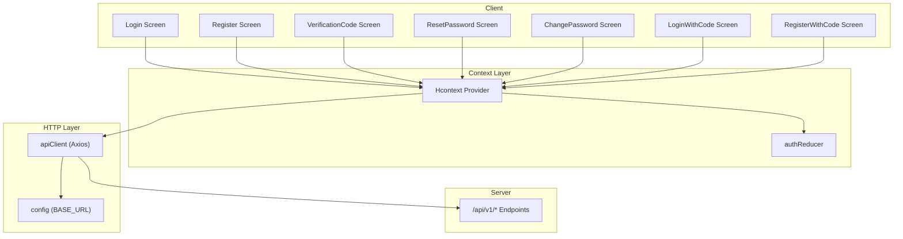
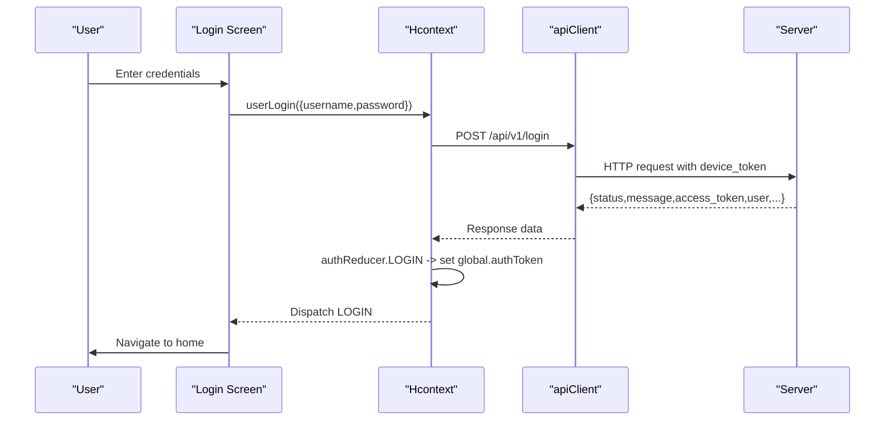
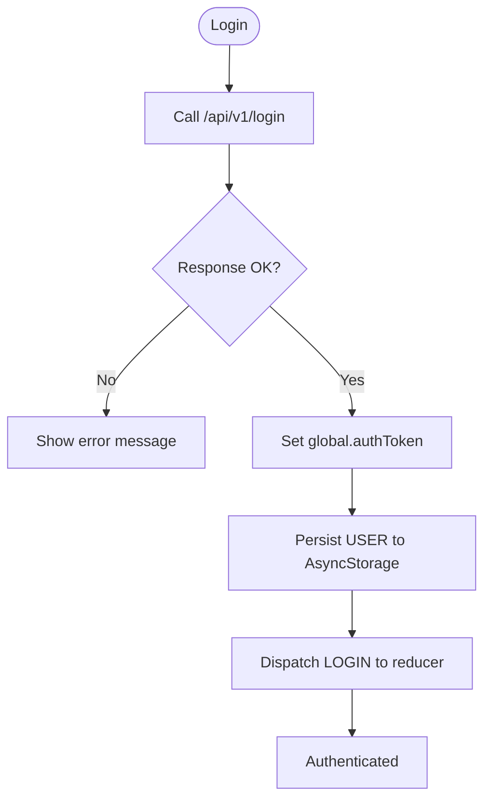
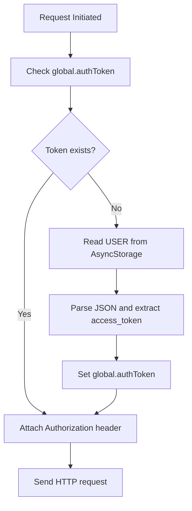
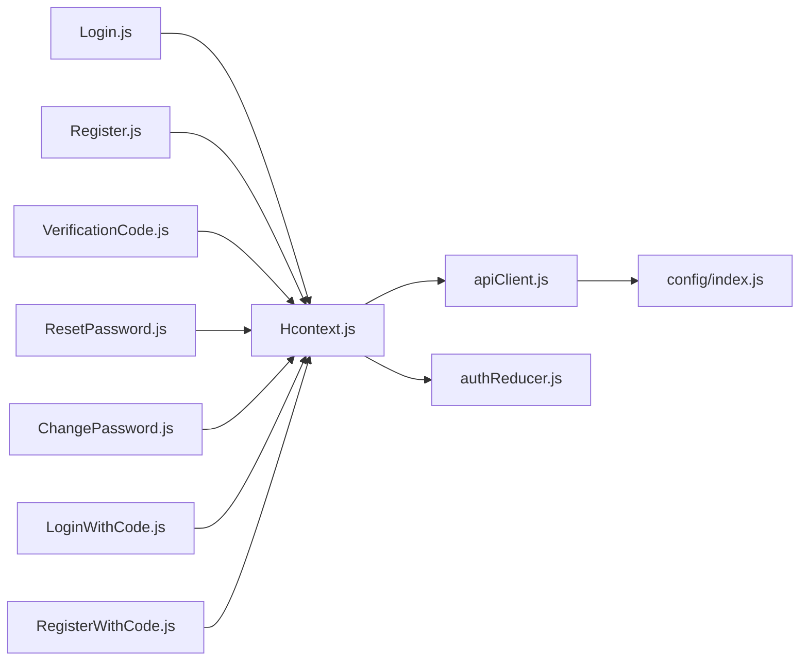

# Authentication API

<cite>
**Referenced Files in This Document**
- [apiClient.js](file://src/context/apiClient.js)
- [Hcontext.js](file://src/context/Hcontext.js)
- [authReducer.js](file://src/context/reducers/authReducer.js)
- [index.js](file://src/config/index.js)
- [Login.js](file://src/screens/Auth/Login.js)
- [LoginWithCode.js](file://src/screens/Auth/LoginWithCode.js)
- [Register.js](file://src/screens/Auth/Register.js)
- [RegisterWithCode.js](file://src/screens/Auth/RegisterWithCode.js)
- [ForgotPassword.js](file://src/screens/Auth/ForgotPassword.js)
- [VerificationCode.js](file://src/screens/Auth/VerificationCode.js)
- [ResetPassword.js](file://src/screens/Auth/ResetPassword.js)
- [ChangePassword.js](file://src/screens/Setting/ChangePassword.js)
- [LogoutModal.js](file://src/components/Modals/LogoutModal.js)
- [AuthStackScreen.js](file://src/routes/AuthStack/AuthStackScreen.js)
- [test_endpoints.js](file://test_endpoints.js)
</cite>

## Table of Contents
1. [Introduction](#introduction)
2. [Project Structure](#project-structure)
3. [Core Components](#core-components)
4. [Architecture Overview](#architecture-overview)
5. [Detailed Component Analysis](#detailed-component-analysis)
6. [Dependency Analysis](#dependency-analysis)
7. [Performance Considerations](#performance-considerations)
8. [Troubleshooting Guide](#troubleshooting-guide)
9. [Conclusion](#conclusion)

## Introduction
This document provides comprehensive API documentation for HappiMynd’s authentication endpoints and the client-side integration that powers them. It covers login, registration, verification, and password management flows, along with the JWT-based authentication system, token acquisition, persistence, and lifecycle handling. It also documents request/response schemas, validation rules, error handling, and security considerations.

## Project Structure
Authentication-related functionality is implemented across:
- API client with interceptors for token injection and error normalization
- Context provider exposing authentication actions and state
- Screens orchestrating user journeys (login, registration, verification, password reset)
- Reducer managing local authentication state and global token caching
- Configuration for base URLs and environment-specific settings

**Diagram sources**
- [apiClient.js:1-58](file://src/context/apiClient.js#L1-L58)
- [Hcontext.js:129-380](file://src/context/Hcontext.js#L129-L380)
- [authReducer.js:1-79](file://src/context/reducers/authReducer.js#L1-L79)
- [index.js:1-13](file://src/config/index.js#L1-L13)

**Section sources**
- [apiClient.js:1-58](file://src/context/apiClient.js#L1-L58)
- [Hcontext.js:129-380](file://src/context/Hcontext.js#L129-L380)
- [authReducer.js:1-79](file://src/context/reducers/authReducer.js#L1-L79)
- [index.js:1-13](file://src/config/index.js#L1-L13)

## Core Components
- apiClient: Axios instance with request/response interceptors for automatic Authorization header injection and error normalization.
- Hcontext: Centralized authentication actions (login, logout, signup, password reset, OTP verification, profile retrieval) and state management.
- authReducer: Manages local auth state and global token caching via a global variable.
- Screens: UI orchestration for each authentication flow.
- Configuration: Base URL for API endpoints.

Key behaviors:
- Token acquisition: login and code-login endpoints return a JWT access token.
- Token persistence: AsyncStorage stores user payload; apiClient reads token from AsyncStorage if not in global cache.
- Token propagation: apiClient attaches Authorization: Bearer <token> to all authenticated requests.
- Token invalidation: logout clears AsyncStorage and resets global token.

**Section sources**
- [apiClient.js:12-44](file://src/context/apiClient.js#L12-L44)
- [Hcontext.js:129-172](file://src/context/Hcontext.js#L129-L172)
- [authReducer.js:17-77](file://src/context/reducers/authReducer.js#L17-L77)
- [index.js:1-13](file://src/config/index.js#L1-L13)

## Architecture Overview
The authentication flow integrates UI screens, the context provider, the HTTP client, and the backend API.

**Diagram sources**
- [Login.js:45-74](file://src/screens/Auth/Login.js#L45-L74)
- [Hcontext.js:129-145](file://src/context/Hcontext.js#L129-L145)
- [apiClient.js:12-44](file://src/context/apiClient.js#L12-L44)

## Detailed Component Analysis

### JWT Authentication System
- Token acquisition: login and login-with-code endpoints return an access token and user profile data.
- Token caching: global.authToken is set upon login and used for subsequent requests.
- Token persistence: user payload is stored in AsyncStorage; apiClient reads it to populate global.authToken if missing.
- Token usage: Authorization header is automatically added to all requests via the request interceptor.
- Token invalidation: logout clears AsyncStorage and resets global.authToken.

**Diagram sources**
- [Hcontext.js:129-145](file://src/context/Hcontext.js#L129-L145)
- [apiClient.js:12-44](file://src/context/apiClient.js#L12-L44)
- [authReducer.js:19-30](file://src/context/reducers/authReducer.js#L19-L30)

**Section sources**
- [apiClient.js:12-44](file://src/context/apiClient.js#L12-L44)
- [authReducer.js:19-30](file://src/context/reducers/authReducer.js#L19-L30)
- [LogoutModal.js:35-52](file://src/components/Modals/LogoutModal.js#L35-L52)

### Login Endpoints
- Method: POST
- URL: /api/v1/login
- Request body:
  - username: string
  - password: string
  - device_token: string
- Response:
  - status: string ("success" or "error")
  - message: string
  - access_token: string
  - user: object (profile)
- Authentication requirement: None
- Validation rules:
  - Required fields: username, password
  - device_token defaults to a test value if not present
- Error handling:
  - Shows snack messages for failures
  - Throws errors for downstream handling

Example request path:
- [Hcontext.js:131-135](file://src/context/Hcontext.js#L131-L135)

Example response path:
- [Login.js:56-70](file://src/screens/Auth/Login.js#L56-L70)

**Section sources**
- [Hcontext.js:129-145](file://src/context/Hcontext.js#L129-L145)
- [Login.js:45-74](file://src/screens/Auth/Login.js#L45-L74)

### Registration Endpoints
- Method: POST
- URL: /api/v1/signup
- Request body:
  - nickname: string
  - user_profile_id: number
  - age: number (optional)
  - gender: string ("male","female","other")
  - username: string
  - password: string
  - confirm_password: string
  - signup_type: string ("individual" or "organization")
  - happimyndCode: string (optional)
  - language: number
  - device_token: string
  - referral_code: string (optional)
- Response:
  - status: string ("success" or "error")
  - message: string
  - user: object (profile)
- Authentication requirement: None
- Validation rules:
  - Required: nickname, user_profile_id, username, password, confirm_password
  - Password length >= 6
  - Passwords must match
  - Terms agreement required
- Error handling:
  - Shows snack messages for validation and API errors

Example request path:
- [Hcontext.js:241-254](file://src/context/Hcontext.js#L241-L254)

Example response path:
- [Register.js:165-184](file://src/screens/Auth/Register.js#L165-L184)

**Section sources**
- [Hcontext.js:239-264](file://src/context/Hcontext.js#L239-L264)
- [Register.js:87-184](file://src/screens/Auth/Register.js#L87-L184)

### Email/Phone Verification Endpoints
- Forgot Password (initiate):
  - Method: POST
  - URL: /api/v1/forgot-password
  - Request body:
    - email: string (optional)
    - mobile: string (optional)
    - type: string ("email" or "mobile")
  - Response:
    - status: string ("success" or "error")
    - message: string
  - Authentication requirement: None
  - Validation rules:
    - At least one of email or mobile must be provided

- Verify OTP:
  - Method: POST
  - URL: /api/v1/verify-otp
  - Request body:
    - email: string (optional)
    - mobile: string (optional)
    - otp: string
  - Response:
    - status: string ("success" or "error")
    - message: string
  - Authentication requirement: None
  - Validation rules:
    - OTP required

- Reset Password:
  - Method: POST
  - URL: /api/v1/reset-password
  - Request body:
    - password: string
    - confirm_password: string
    - email: string (optional)
    - mobile: string (optional)
  - Response:
    - status: string ("success" or "error")
    - message: string
  - Authentication requirement: None
  - Validation rules:
    - Passwords must match

Example request paths:
- [Hcontext.js:327-331](file://src/context/Hcontext.js#L327-L331)
- [Hcontext.js:345-349](file://src/context/Hcontext.js#L345-L349)
- [Hcontext.js:368-373](file://src/context/Hcontext.js#L368-L373)

Example response paths:
- [ForgotPassword.js:31-52](file://src/screens/Auth/ForgotPassword.js#L31-L52)
- [VerificationCode.js:35-58](file://src/screens/Auth/VerificationCode.js#L35-L58)
- [ResetPassword.js:36-72](file://src/screens/Auth/ResetPassword.js#L36-L72)

**Section sources**
- [Hcontext.js:325-380](file://src/context/Hcontext.js#L325-L380)
- [ForgotPassword.js:31-52](file://src/screens/Auth/ForgotPassword.js#L31-L52)
- [VerificationCode.js:35-72](file://src/screens/Auth/VerificationCode.js#L35-L72)
- [ResetPassword.js:36-72](file://src/screens/Auth/ResetPassword.js#L36-L72)

### Password Management Endpoints
- Change Password (authenticated):
  - Method: POST
  - URL: /api/v1/change-password
  - Headers: Authorization: Bearer <access_token>
  - Request body:
    - old_password: string
    - new_password: string
    - confirm_password: string
  - Response:
    - status: string ("success" or "error")
    - message: string
  - Authentication requirement: Requires valid access token
  - Validation rules:
    - New passwords must match

Example request path:
- [Hcontext.js:309-313](file://src/context/Hcontext.js#L309-L313)

Example response path:
- [ChangePassword.js:32-68](file://src/screens/Setting/ChangePassword.js#L32-L68)

**Section sources**
- [Hcontext.js:303-323](file://src/context/Hcontext.js#L303-L323)
- [ChangePassword.js:32-68](file://src/screens/Setting/ChangePassword.js#L32-L68)

### Login With Code Endpoints
- Method: POST
- URL: /api/v1/login-with-code
- Request body:
  - happimynd_code: string
  - device_token: string
- Response:
  - status: string ("success" or "error")
  - message: string
  - access_token: string
  - user: object (profile)
- Authentication requirement: None
- Validation rules:
  - Required: happimynd_code

Example request path:
- [Hcontext.js:149-152](file://src/context/Hcontext.js#L149-L152)

Example response path:
- [LoginWithCode.js:43-78](file://src/screens/Auth/LoginWithCode.js#L43-L78)

**Section sources**
- [Hcontext.js:147-162](file://src/context/Hcontext.js#L147-L162)
- [LoginWithCode.js:43-78](file://src/screens/Auth/LoginWithCode.js#L43-L78)

### Logout Endpoints
- Method: GET
- URL: /api/v1/logout
- Headers: Authorization: Bearer <access_token>
- Response:
  - status: string ("success" or "error")
  - message: string
- Authentication requirement: Requires valid access token
- Behavior:
  - Clears AsyncStorage entries for USER and chatBotMessages
  - Dispatches LOGOUT to reducer, clearing global.authToken

Example request path:
- [Hcontext.js:166](file://src/context/Hcontext.js#L166)

Example response path:
- [LogoutModal.js:35-52](file://src/components/Modals/LogoutModal.js#L35-L52)

**Section sources**
- [Hcontext.js:164-172](file://src/context/Hcontext.js#L164-L172)
- [LogoutModal.js:35-52](file://src/components/Modals/LogoutModal.js#L35-L52)

### Token Persistence and Global Caching
- AsyncStorage storage key: USER
- apiClient reads token from AsyncStorage if not present in global.authToken
- authReducer sets global.authToken on LOGIN and clears on LOGOUT
- Subsequent requests automatically attach Authorization header

**Diagram sources**
- [apiClient.js:12-44](file://src/context/apiClient.js#L12-L44)
- [authReducer.js:19-30](file://src/context/reducers/authReducer.js#L19-L30)

**Section sources**
- [apiClient.js:12-44](file://src/context/apiClient.js#L12-L44)
- [authReducer.js:19-30](file://src/context/reducers/authReducer.js#L19-L30)

### Error Response Formats and Validation Rules
- Standardized error shape:
  - Response interceptor normalizes errors to a consistent object with a message field.
- Validation rules observed in screens:
  - Login: username and password required
  - Registration: nickname, profile type, username, password, confirm_password required; password length >= 6; passwords must match; terms required
  - Verification: OTP required
  - Password reset: passwords must match
  - Change password: all fields required; new passwords must match

**Section sources**
- [apiClient.js:47-56](file://src/context/apiClient.js#L47-L56)
- [Login.js:48-54](file://src/screens/Auth/Login.js#L48-L54)
- [Register.js:90-134](file://src/screens/Auth/Register.js#L90-L134)
- [VerificationCode.js:38-44](file://src/screens/Auth/VerificationCode.js#L38-L44)
- [ResetPassword.js:40-54](file://src/screens/Auth/ResetPassword.js#L40-L54)
- [ChangePassword.js:36-50](file://src/screens/Setting/ChangePassword.js#L36-L50)

### Security Considerations
- Token exposure: Authorization header is attached to all requests; ensure HTTPS is enforced by the base URL.
- Device token: Sent during login and code login for device association.
- OTP-based flows: Email/phone verification and reset-password require OTP verification before changes take effect.
- Local storage: USER payload stored in AsyncStorage; sensitive data should be handled carefully; consider secure storage options in production.

**Section sources**
- [index.js:1-13](file://src/config/index.js#L1-L13)
- [Hcontext.js:131-135](file://src/context/Hcontext.js#L131-L135)
- [Hcontext.js:149-152](file://src/context/Hcontext.js#L149-L152)

## Dependency Analysis
Authentication depends on:
- apiClient for HTTP communication and token injection
- Hcontext for business logic and dispatching actions
- authReducer for state transitions and global token caching
- AsyncStorage for persistent token storage
- Configuration for base URL

**Diagram sources**
- [Login.js:31-74](file://src/screens/Auth/Login.js#L31-L74)
- [Register.js:35-184](file://src/screens/Auth/Register.js#L35-L184)
- [VerificationCode.js:19-72](file://src/screens/Auth/VerificationCode.js#L19-L72)
- [ResetPassword.js:19-72](file://src/screens/Auth/ResetPassword.js#L19-L72)
- [ChangePassword.js:19-68](file://src/screens/Setting/ChangePassword.js#L19-L68)
- [LoginWithCode.js:30-78](file://src/screens/Auth/LoginWithCode.js#L30-L78)
- [RegisterWithCode.js:29-104](file://src/screens/Auth/RegisterWithCode.js#L29-L104)
- [Hcontext.js:129-380](file://src/context/Hcontext.js#L129-L380)
- [apiClient.js:1-58](file://src/context/apiClient.js#L1-L58)
- [authReducer.js:1-79](file://src/context/reducers/authReducer.js#L1-L79)
- [index.js:1-13](file://src/config/index.js#L1-L13)

**Section sources**
- [Hcontext.js:129-380](file://src/context/Hcontext.js#L129-L380)
- [apiClient.js:1-58](file://src/context/apiClient.js#L1-L58)
- [authReducer.js:1-79](file://src/context/reducers/authReducer.js#L1-L79)
- [index.js:1-13](file://src/config/index.js#L1-L13)

## Performance Considerations
- Timeout: apiClient sets a 15-second timeout to prevent hanging requests.
- Global caching: global.authToken avoids repeated AsyncStorage reads.
- Batched flows: OTP verification and password reset minimize redundant network calls by validating locally first.

[No sources needed since this section provides general guidance]

## Troubleshooting Guide
Common issues and resolutions:
- Login fails:
  - Verify username/password and device_token presence.
  - Check snack messages for explicit errors.
  - Inspect response status and message.
- Registration validation errors:
  - Ensure all required fields are filled and passwords match.
  - Respect minimum password length.
- OTP verification failures:
  - Confirm OTP input and resend if needed.
  - Ensure email/mobile pairing matches the original request.
- Password reset failures:
  - Ensure passwords match and the correct email/mobile is used.
- Token not applied:
  - Confirm AsyncStorage contains USER and global.authToken is set after login.
  - Check request interceptor logs for Authorization header attachment.

**Section sources**
- [apiClient.js:12-44](file://src/context/apiClient.js#L12-L44)
- [Login.js:48-63](file://src/screens/Auth/Login.js#L48-L63)
- [Register.js:90-134](file://src/screens/Auth/Register.js#L90-L134)
- [VerificationCode.js:38-58](file://src/screens/Auth/VerificationCode.js#L38-L58)
- [ResetPassword.js:40-72](file://src/screens/Auth/ResetPassword.js#L40-L72)
- [ChangePassword.js:36-68](file://src/screens/Setting/ChangePassword.js#L36-L68)

## Conclusion
HappiMynd’s authentication system integrates a centralized context provider, a robust HTTP client with automatic token injection, and UI-driven flows for login, registration, verification, and password management. The design leverages AsyncStorage for persistence and a global token cache for efficient request handling. Adhering to the documented endpoints, validation rules, and error handling patterns ensures reliable and secure authentication experiences.