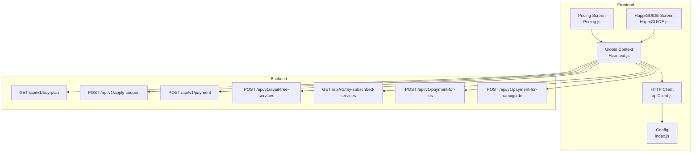
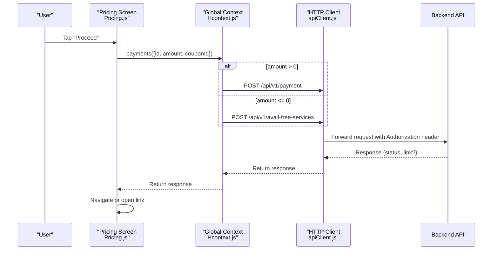
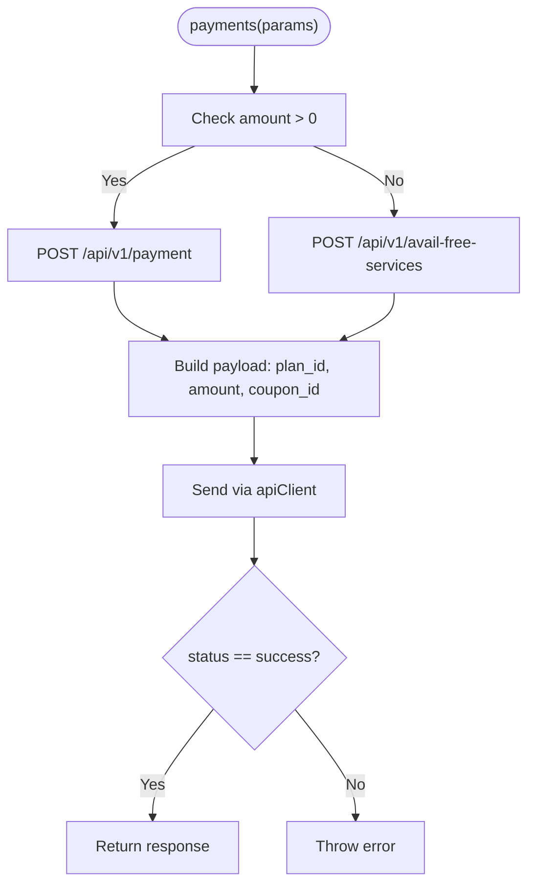
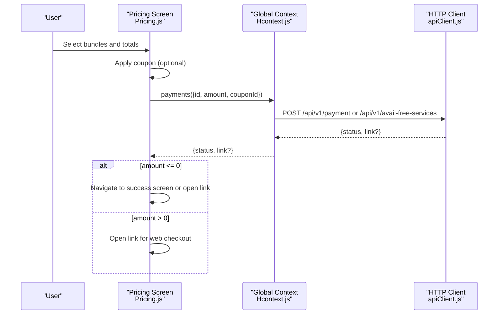
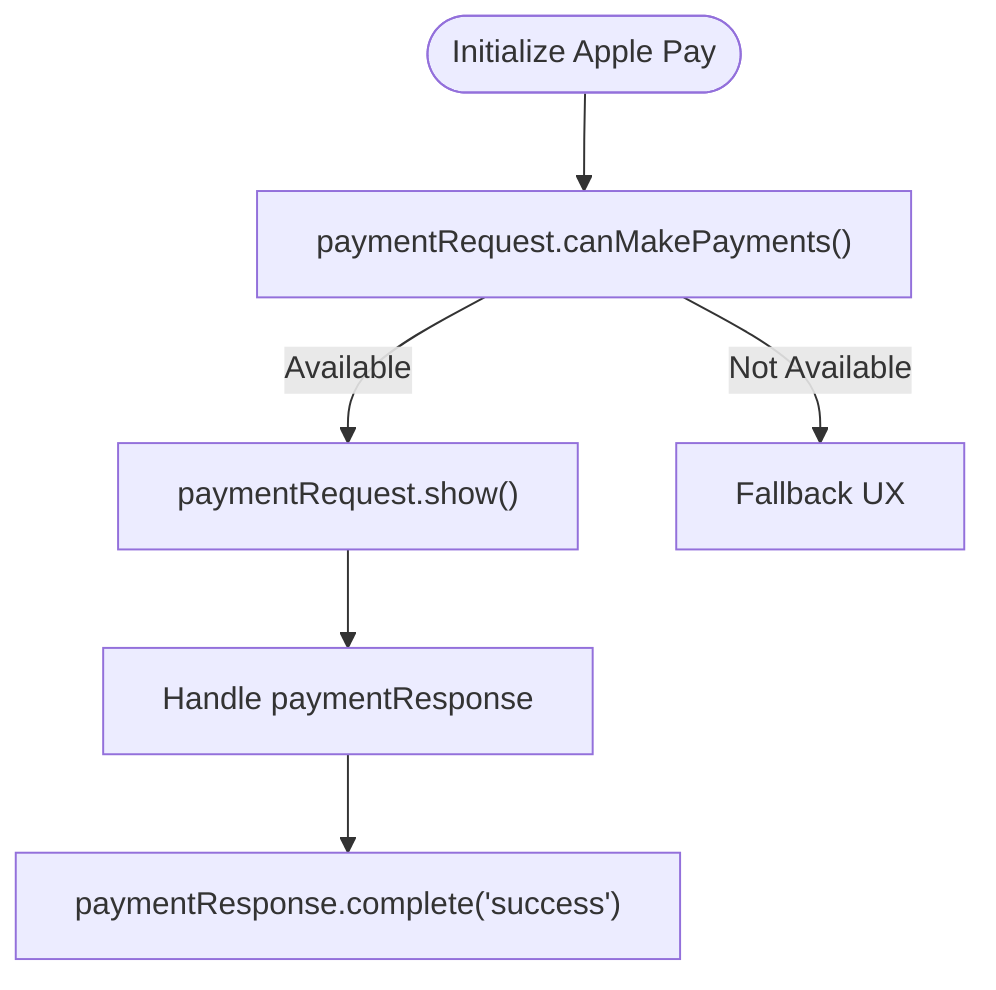
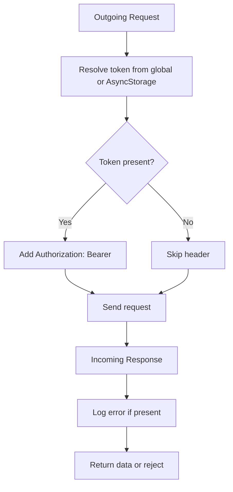
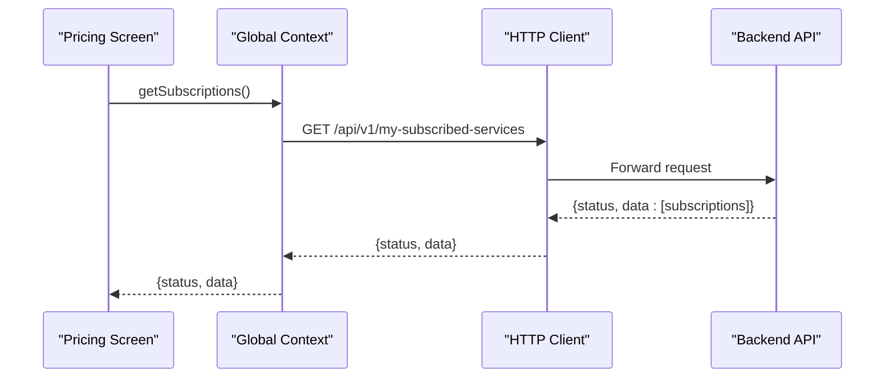
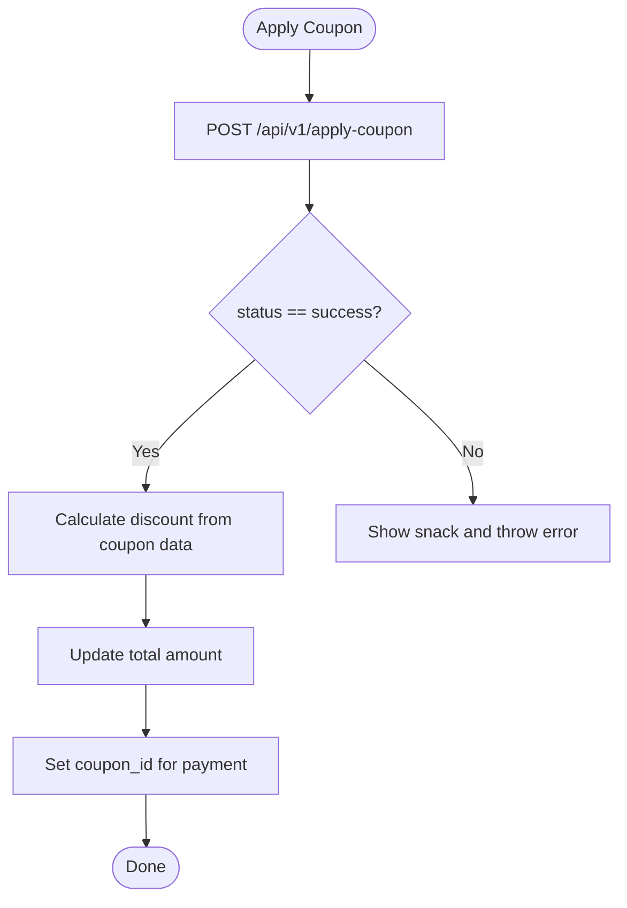
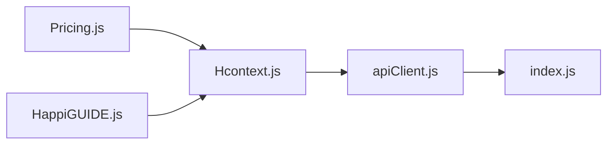

# Payment Integration API

<cite>
**Referenced Files in This Document**
- [Hcontext.js](file://src/context/Hcontext.js)
- [Pricing.js](file://src/screens/Individual/Pricing.js)
- [apiClient.js](file://src/context/apiClient.js)
- [index.js](file://src/config/index.js)
- [HappiGUIDE.js](file://src/screens/HappiGUIDE/HappiGUIDE.js)
- [Terms.js](file://src/screens/shared/Terms.js)
</cite>

## Table of Contents
1. [Introduction](#introduction)
2. [Project Structure](#project-structure)
3. [Core Components](#core-components)
4. [Architecture Overview](#architecture-overview)
5. [Detailed Component Analysis](#detailed-component-analysis)
6. [Dependency Analysis](#dependency-analysis)
7. [Performance Considerations](#performance-considerations)
8. [Troubleshooting Guide](#troubleshooting-guide)
9. [Conclusion](#conclusion)

## Introduction
This document describes the payment processing APIs and integrations used by the HappiMynd mobile application. It covers subscription management, credit purchases, transaction processing, coupon/discount application, and checkout flows. It also outlines how the frontend interacts with backend endpoints, handles payment confirmation, and integrates with Apple Pay via the Apple Pay Web API. Security and PCI compliance considerations, fraud prevention mechanisms, retry logic, and refund processing workflows are addressed.

## Project Structure
The payment flow spans three primary areas:
- Frontend API client and interceptors
- Payment orchestration in the global context
- Pricing and checkout UI handling

**Diagram sources**
- [Pricing.js:389-902](file://src/screens/Individual/Pricing.js#L389-L902)
- [HappiGUIDE.js:112-200](file://src/screens/HappiGUIDE/HappiGUIDE.js#L112-L200)
- [Hcontext.js:609-665](file://src/context/Hcontext.js#L609-L665)
- [apiClient.js:1-58](file://src/context/apiClient.js#L1-L58)
- [index.js:1-13](file://src/config/index.js#L1-L13)

**Section sources**
- [Pricing.js:389-902](file://src/screens/Individual/Pricing.js#L389-L902)
- [Hcontext.js:609-665](file://src/context/Hcontext.js#L609-L665)
- [apiClient.js:1-58](file://src/context/apiClient.js#L1-L58)
- [index.js:1-13](file://src/config/index.js#L1-L13)

## Core Components
- Payment orchestration and endpoints:
  - Buy plans listing: GET /api/v1/buy-plan
  - Apply coupon: POST /api/v1/apply-coupon
  - Standard payment: POST /api/v1/payment
  - Free service access: POST /api/v1/avail-free-services
  - My subscriptions: GET /api/v1/my-subscribed-services
  - Apple Pay (iOS): POST /api/v1/payment-for-ios
  - HappiGUIDE payment: POST /api/v1/payment-for-happiguide
- HTTP client with automatic bearer token injection and error handling
- Pricing screen orchestrating cart, coupons, and payment initiation
- Apple Pay Web API integration points (commented out in HappiGUIDE)

Key behaviors:
- Amount-driven endpoint selection: zero or negative amounts route to free service endpoint; otherwise standard payment endpoint is used.
- Coupon application updates total amount and may set coupon identifiers for subsequent payment calls.
- Subscription retrieval supports UI state and eligibility checks.
- Apple Pay flow uses Apple Pay Web API methods (currently commented out in the code).

**Section sources**
- [Hcontext.js:609-665](file://src/context/Hcontext.js#L609-L665)
- [Hcontext.js:1056-1077](file://src/context/Hcontext.js#L1056-L1077)
- [Hcontext.js:1263-1271](file://src/context/Hcontext.js#L1263-L1271)
- [Pricing.js:859-902](file://src/screens/Individual/Pricing.js#L859-L902)
- [HappiGUIDE.js:28-87](file://src/screens/HappiGUIDE/HappiGUIDE.js#L28-L87)

## Architecture Overview
The payment architecture follows a layered pattern:
- UI initiates payment actions
- Global context coordinates endpoint calls and state
- HTTP client injects auth and handles errors
- Backend returns payment links or status for web redirection

**Diagram sources**
- [Pricing.js:859-902](file://src/screens/Individual/Pricing.js#L859-L902)
- [Hcontext.js:619-637](file://src/context/Hcontext.js#L619-L637)
- [apiClient.js:11-44](file://src/context/apiClient.js#L11-L44)

## Detailed Component Analysis

### Payment Orchestration in Global Context
The global context exposes payment functions that encapsulate endpoint selection and request construction. It also provides subscription retrieval and coupon application.

**Diagram sources**
- [Hcontext.js:619-637](file://src/context/Hcontext.js#L619-L637)

**Section sources**
- [Hcontext.js:619-637](file://src/context/Hcontext.js#L619-L637)

### Pricing Screen Checkout Flow
The pricing screen manages:
- Cart composition (bundles)
- Coupon application and discount calculation
- Payment initiation and redirection to web checkout
- Navigation after payment completion

**Diagram sources**
- [Pricing.js:859-902](file://src/screens/Individual/Pricing.js#L859-L902)
- [Hcontext.js:619-637](file://src/context/Hcontext.js#L619-L637)
- [apiClient.js:11-44](file://src/context/apiClient.js#L11-L44)

**Section sources**
- [Pricing.js:375-387](file://src/screens/Individual/Pricing.js#L375-L387)
- [Pricing.js:859-902](file://src/screens/Individual/Pricing.js#L859-L902)

### Apple Pay Integration (Web API)
The HappiGUIDE screen contains commented Apple Pay Web API integration points. These demonstrate how Apple Pay could be invoked using the PaymentRequest interface and related events.

**Diagram sources**
- [HappiGUIDE.js:28-87](file://src/screens/HappiGUIDE/HappiGUIDE.js#L28-L87)

**Section sources**
- [HappiGUIDE.js:28-87](file://src/screens/HappiGUIDE/HappiGUIDE.js#L28-L87)

### HTTP Client and Authentication
The HTTP client automatically attaches a bearer token from global state or AsyncStorage and logs requests for debugging. It forwards backend errors to callers.

**Diagram sources**
- [apiClient.js:11-56](file://src/context/apiClient.js#L11-L56)

**Section sources**
- [apiClient.js:1-58](file://src/context/apiClient.js#L1-L58)
- [index.js:1-13](file://src/config/index.js#L1-L13)

### Subscription Management
Subscription retrieval is used to:
- Determine current subscriptions
- Adjust UI state and eligibility for free services
- Map product names for iOS-specific handling

**Diagram sources**
- [Hcontext.js:639-647](file://src/context/Hcontext.js#L639-L647)

**Section sources**
- [Hcontext.js:639-647](file://src/context/Hcontext.js#L639-L647)
- [Pricing.js:475-496](file://src/screens/Individual/Pricing.js#L475-L496)

### Coupon Application and Discount Calculation
Coupon application updates the total amount and sets a coupon identifier for payment submission. Discount calculation is performed client-side based on coupon data.

**Diagram sources**
- [Hcontext.js:649-665](file://src/context/Hcontext.js#L649-L665)
- [Pricing.js:225-271](file://src/screens/Individual/Pricing.js#L225-L271)

**Section sources**
- [Hcontext.js:649-665](file://src/context/Hcontext.js#L649-L665)
- [Pricing.js:225-281](file://src/screens/Individual/Pricing.js#L225-L281)

### Refund and Cancellation Policies
Refund and cancellation policies are documented in the Terms screen. Key points:
- Refunds are processed within 14 days.
- Session credits can be issued under certain conditions.
- Users may claim refunds or rebook sessions depending on circumstances.

**Section sources**
- [Terms.js:99-109](file://src/screens/shared/Terms.js#L99-L109)

## Dependency Analysis
- Pricing screen depends on global context for payment orchestration and on HTTP client for backend communication.
- Global context depends on HTTP client and configuration for base URL and interceptors.
- Apple Pay Web API integration is present as commented code in HappiGUIDE.

**Diagram sources**
- [Pricing.js:389-902](file://src/screens/Individual/Pricing.js#L389-L902)
- [HappiGUIDE.js:112-200](file://src/screens/HappiGUIDE/HappiGUIDE.js#L112-L200)
- [Hcontext.js:609-665](file://src/context/Hcontext.js#L609-L665)
- [apiClient.js:1-58](file://src/context/apiClient.js#L1-L58)
- [index.js:1-13](file://src/config/index.js#L1-L13)

**Section sources**
- [Pricing.js:389-902](file://src/screens/Individual/Pricing.js#L389-L902)
- [HappiGUIDE.js:112-200](file://src/screens/HappiGUIDE/HappiGUIDE.js#L112-L200)
- [Hcontext.js:609-665](file://src/context/Hcontext.js#L609-L665)
- [apiClient.js:1-58](file://src/context/apiClient.js#L1-L58)
- [index.js:1-13](file://src/config/index.js#L1-L13)

## Performance Considerations
- Endpoint selection based on amount avoids unnecessary network calls.
- Token resolution from global state reduces repeated AsyncStorage reads.
- Asynchronous operations are awaited to prevent race conditions during payment initiation.
- Consider caching buy-plan listings to reduce latency on repeated visits.

## Troubleshooting Guide
Common issues and resolutions:
- Authentication failures: Ensure the bearer token is present in global state or AsyncStorage; the HTTP client logs missing tokens.
- Payment link not opening: Verify the returned response contains a valid link and that the app can open URLs.
- Coupon application errors: Confirm coupon eligibility and plan compatibility; the context dispatches snack messages on failure.
- Apple Pay availability: The Apple Pay Web API code is commented; ensure proper merchant configuration if enabling.

**Section sources**
- [apiClient.js:11-56](file://src/context/apiClient.js#L11-L56)
- [Hcontext.js:649-665](file://src/context/Hcontext.js#L649-L665)
- [Pricing.js:859-902](file://src/screens/Individual/Pricing.js#L859-L902)
- [HappiGUIDE.js:28-87](file://src/screens/HappiGUIDE/HappiGUIDE.js#L28-L87)

## Conclusion
The HappiMynd payment system integrates a clean separation of concerns: UI handles cart and checkout, the global context orchestrates endpoint calls and state, and the HTTP client manages authentication and error propagation. The system supports standard payments, free service access, coupon discounts, and subscription management. Apple Pay integration exists conceptually via the Apple Pay Web API. Security is enforced through bearer tokens and HTTPS, with potential PCI compliance considerations noted below.