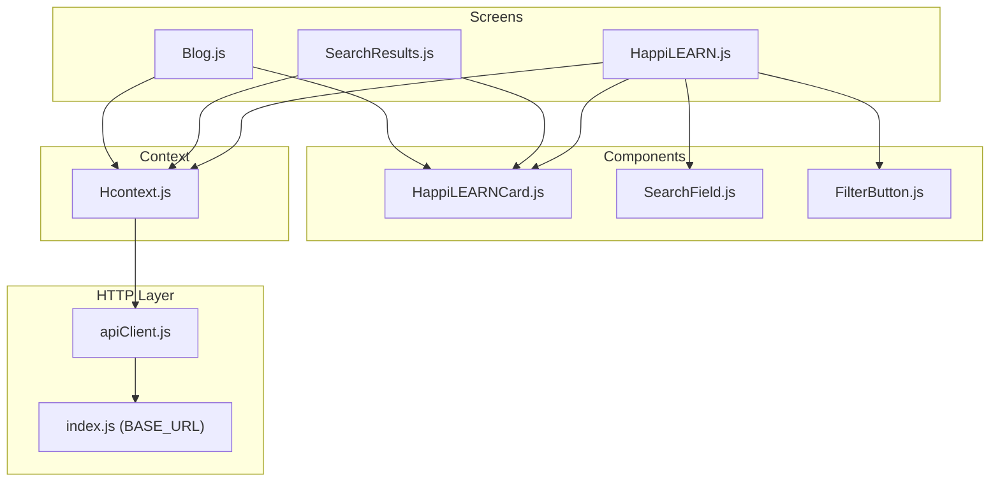
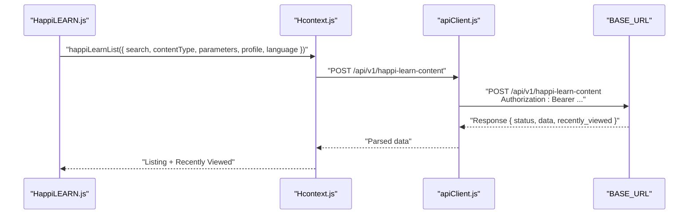
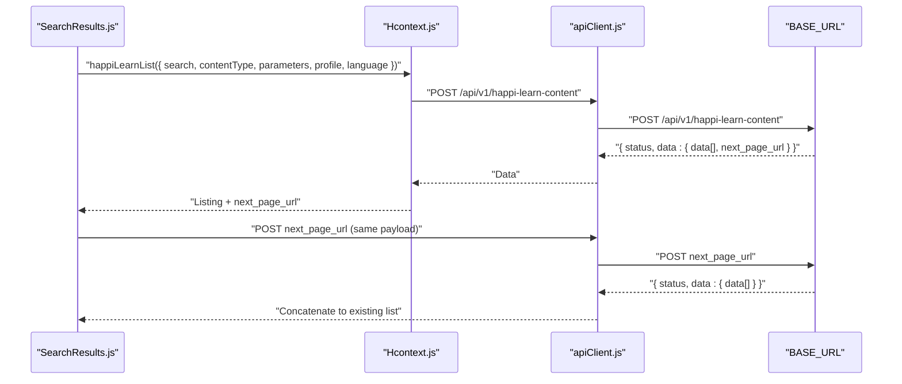
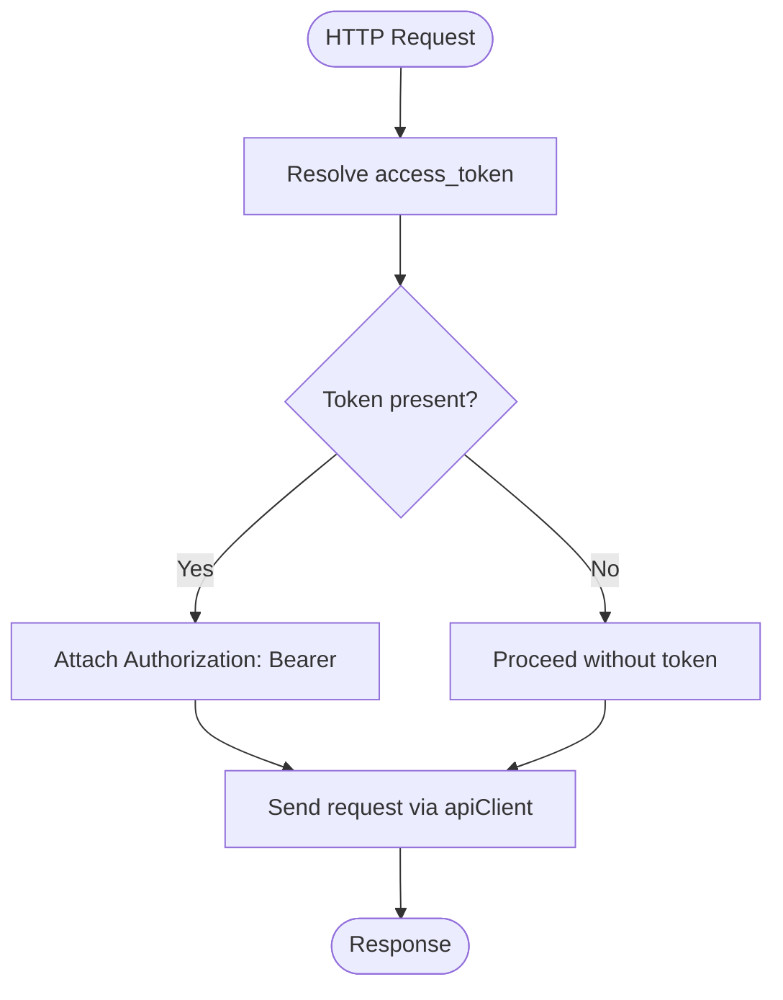
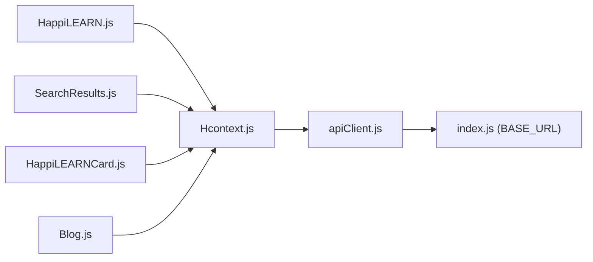

# HappiLEARN Education API

<cite>
**Referenced Files in This Document**
- [HappiLEARN.js](file://src/screens/HappiLEARN/HappiLEARN.js)
- [SearchResults.js](file://src/screens/HappiLEARN/SearchResults.js)
- [HappiLEARNCard.js](file://src/components/cards/HappiLEARNCard.js)
- [Hcontext.js](file://src/context/Hcontext.js)
- [apiClient.js](file://src/context/apiClient.js)
- [index.js](file://src/config/index.js)
- [SearchField.js](file://src/components/input/SearchField.js)
- [FilterButton.js](file://src/components/buttons/FilterButton.js)
- [Blog.js](file://src/screens/Individual/Blog.js)
</cite>

## Table of Contents
1. [Introduction](#introduction)
2. [Project Structure](#project-structure)
3. [Core Components](#core-components)
4. [Architecture Overview](#architecture-overview)
5. [Detailed Component Analysis](#detailed-component-analysis)
6. [Dependency Analysis](#dependency-analysis)
7. [Performance Considerations](#performance-considerations)
8. [Troubleshooting Guide](#troubleshooting-guide)
9. [Conclusion](#conclusion)
10. [Appendices](#appendices)

## Introduction
This document describes the HappiLEARN educational content service API endpoints and client-side integration patterns implemented in the repository. It focuses on:
- Content catalog retrieval and search
- Filtering and pagination
- Content consumption and engagement (likes)
- Authentication and authorization via bearer tokens
- Content metadata schemas and query parameters
- Recommendations, favorites, and completion tracking integration points

The documentation is derived from the HappiLEARN screens, context provider, and supporting components.

## Project Structure
The HappiLEARN feature spans UI screens, a shared context provider, and HTTP client utilities:
- Screens: HappiLEARN home, search results, and content detail
- Context: API methods for HappiLEARN content, likes, and analytics
- HTTP client: Axios instance with automatic bearer token injection
- UI components: Cards, search field, and filter button

**Diagram sources**
- [HappiLEARN.js:1-262](file://src/screens/HappiLEARN/HappiLEARN.js#L1-L262)
- [SearchResults.js:1-270](file://src/screens/HappiLEARN/SearchResults.js#L1-L270)
- [Blog.js:199-250](file://src/screens/Individual/Blog.js#L199-L250)
- [HappiLEARNCard.js:1-192](file://src/components/cards/HappiLEARNCard.js#L1-L192)
- [SearchField.js:1-82](file://src/components/input/SearchField.js#L1-L82)
- [FilterButton.js:1-61](file://src/components/buttons/FilterButton.js#L1-L61)
- [Hcontext.js:547-607](file://src/context/Hcontext.js#L547-L607)
- [apiClient.js:1-58](file://src/context/apiClient.js#L1-L58)
- [index.js:1-13](file://src/config/index.js#L1-L13)

**Section sources**
- [HappiLEARN.js:1-262](file://src/screens/HappiLEARN/HappiLEARN.js#L1-L262)
- [SearchResults.js:1-270](file://src/screens/HappiLEARN/SearchResults.js#L1-L270)
- [HappiLEARNCard.js:1-192](file://src/components/cards/HappiLEARNCard.js#L1-L192)
- [Hcontext.js:547-607](file://src/context/Hcontext.js#L547-L607)
- [apiClient.js:1-58](file://src/context/apiClient.js#L1-L58)
- [index.js:1-13](file://src/config/index.js#L1-L13)

## Core Components
- HappiLEARN content listing and search:
  - HappiLEARN home screen fetches content and displays “Most Relevant” and “Recently Viewed.”
  - SearchResults screen supports search term, content type, parameters, profile, and language filters.
- Engagement and consumption:
  - HappiLEARNCard handles like/unlike actions and navigates to content detail.
  - Content detail screen loads content by ID and exposes suggested content.
- Authentication and analytics:
  - apiClient injects Authorization: Bearer token automatically.
  - screenTrafficAnalytics posts screen events to an external analytics endpoint.

**Section sources**
- [HappiLEARN.js:66-115](file://src/screens/HappiLEARN/HappiLEARN.js#L66-L115)
- [SearchResults.js:67-127](file://src/screens/HappiLEARN/SearchResults.js#L67-L127)
- [HappiLEARNCard.js:21-78](file://src/components/cards/HappiLEARNCard.js#L21-L78)
- [Blog.js:199-250](file://src/screens/Individual/Blog.js#L199-L250)
- [apiClient.js:11-44](file://src/context/apiClient.js#L11-L44)
- [Hcontext.js:1321-1334](file://src/context/Hcontext.js#L1321-L1334)

## Architecture Overview
The HappiLEARN feature follows a layered pattern:
- UI screens orchestrate user actions (search, filter, like).
- Context provider encapsulates API calls and state.
- HTTP client adds authentication and performs requests against the base URL.

**Diagram sources**
- [HappiLEARN.js:97-110](file://src/screens/HappiLEARN/HappiLEARN.js#L97-L110)
- [Hcontext.js:547-568](file://src/context/Hcontext.js#L547-L568)
- [apiClient.js:6-9](file://src/context/apiClient.js#L6-L9)
- [index.js:3](file://src/config/index.js#L3)

## Detailed Component Analysis

### Content Catalog Retrieval API
- Endpoint: POST /api/v1/happi-learn-content
- Purpose: Fetch content catalog with optional filters and pagination support.
- Request payload fields:
  - search: string
  - content_type: string
  - parameters: string
  - profile: string
  - language: string
- Response shape:
  - status: string
  - data: object
    - data: array of content items
    - next_page_url: string|null
  - recently_viewed: object
    - data: array of recent items

Usage locations:
- HappiLEARN home screen passes search term.
- SearchResults screen composes a filtered payload and stores next_page_url for pagination.

**Section sources**
- [Hcontext.js:547-568](file://src/context/Hcontext.js#L547-L568)
- [HappiLEARN.js:97-110](file://src/screens/HappiLEARN/HappiLEARN.js#L97-L110)
- [SearchResults.js:94-127](file://src/screens/HappiLEARN/SearchResults.js#L94-L127)

### Content Search API
- Endpoint: POST /api/v1/happi-learn-content
- Query parameters:
  - search: string
  - content_type: string
  - parameters: string
  - profile: string
  - language: string
- Pagination:
  - next_page_url returned in response; client can POST to that URL with the same payload to fetch more items.

**Diagram sources**
- [SearchResults.js:94-159](file://src/screens/HappiLEARN/SearchResults.js#L94-L159)
- [Hcontext.js:547-568](file://src/context/Hcontext.js#L547-L568)
- [apiClient.js:6-9](file://src/context/apiClient.js#L6-L9)
- [index.js:3](file://src/config/index.js#L3)

**Section sources**
- [SearchResults.js:94-159](file://src/screens/HappiLEARN/SearchResults.js#L94-L159)
- [Hcontext.js:547-568](file://src/context/Hcontext.js#L547-L568)

### Content Detail API
- Endpoint: POST /api/v1/happi-learn-content-by-id
- Request payload:
  - content_id: string|number
- Response includes:
  - title, type, summary, keywords, profile, credit
  - is_likes, likes_count
  - suggested_content: array

Integration:
- HappiLEARNCard navigates to content detail screen.
- Content detail screen calls happiLearnContent and sets UI state.

**Section sources**
- [Hcontext.js:570-581](file://src/context/Hcontext.js#L570-L581)
- [Blog.js:199-250](file://src/screens/Individual/Blog.js#L199-L250)

### Engagement APIs
- Like content:
  - Endpoint: POST /api/v1/like-happi-learn-post
  - Payload: happi_learn_content_id
- Unlike content:
  - Endpoint: POST /api/v1/unlike-happi-learn-post
  - Payload: happi_learn_content_id

Integration:
- HappiLEARNCard toggles like state and updates counts locally after successful API responses.

**Section sources**
- [Hcontext.js:583-607](file://src/context/Hcontext.js#L583-L607)
- [HappiLEARNCard.js:48-78](file://src/components/cards/HappiLEARNCard.js#L48-L78)

### Authentication and Authorization
- Bearer token injection:
  - apiClient attaches Authorization: Bearer <token> to outgoing requests.
  - Token is sourced from global.authToken or AsyncStorage USER payload.
- Login/logout endpoints (for context):
  - POST /api/v1/login
  - POST /api/v1/login-with-code
  - GET /api/v1/logout

**Diagram sources**
- [apiClient.js:12-42](file://src/context/apiClient.js#L12-L42)
- [Hcontext.js:129-172](file://src/context/Hcontext.js#L129-L172)

**Section sources**
- [apiClient.js:12-42](file://src/context/apiClient.js#L12-L42)
- [Hcontext.js:129-172](file://src/context/Hcontext.js#L129-L172)

### Content Metadata Schema
Fields returned by content listing and detail endpoints:
- id: number|string
- title: string
- type: string
- credit: string
- thumbnail: string
- likes_count: number
- is_likes: "yes"|"no"
- link: string
- suggested_content: array of content items (detail response)

These fields are consumed by HappiLEARNCard to render cards and by content detail screens to populate UI.

**Section sources**
- [HappiLEARNCard.js:24-36](file://src/components/cards/HappiLEARNCard.js#L24-L36)
- [Blog.js:206-221](file://src/screens/Individual/Blog.js#L206-L221)

### Search Query Parameter Specifications
Supported filters for POST /api/v1/happi-learn-content:
- search: string
- content_type: string
- parameters: string
- profile: string
- language: string

UI integration:
- HappiLEARN home screen passes search term.
- SearchResults screen builds a payload from current filter state and triggers pagination.

**Section sources**
- [HappiLEARN.js:97-110](file://src/screens/HappiLEARN/HappiLEARN.js#L97-L110)
- [SearchResults.js:94-127](file://src/screens/HappiLEARN/SearchResults.js#L94-L127)

### Recommendations, Favorites, and Completion Tracking
- Recommendations:
  - Content detail response includes suggested_content for recommendation rendering.
- Favorites:
  - The repository does not expose explicit favorite toggling endpoints in the HappiLEARN context; favoriting is not implemented for HappiLEARN content in the analyzed files.
- Completion tracking:
  - The repository includes course completion endpoints under HappiSELF (start/end course), not HappiLEARN content. There is no HappiLEARN-specific completion endpoint in the analyzed files.

**Section sources**
- [Blog.js:220](file://src/screens/Individual/Blog.js#L220)
- [Hcontext.js:889-962](file://src/context/Hcontext.js#L889-L962)

## Dependency Analysis
Key dependencies and relationships:
- HappiLEARN screens depend on Hcontext for API calls.
- Hcontext depends on apiClient for HTTP transport.
- apiClient depends on config.BASE_URL and AsyncStorage/global token cache.
- UI components (SearchField, FilterButton) support user-driven filtering.

**Diagram sources**
- [HappiLEARN.js:70-78](file://src/screens/HappiLEARN/HappiLEARN.js#L70-L78)
- [SearchResults.js:71-81](file://src/screens/HappiLEARN/SearchResults.js#L71-L81)
- [HappiLEARNCard.js:24-41](file://src/components/cards/HappiLEARNCard.js#L24-L41)
- [Blog.js:204](file://src/screens/Individual/Blog.js#L204)
- [Hcontext.js:547-581](file://src/context/Hcontext.js#L547-L581)
- [apiClient.js:6](file://src/context/apiClient.js#L6)
- [index.js:3](file://src/config/index.js#L3)

**Section sources**
- [HappiLEARN.js:70-78](file://src/screens/HappiLEARN/HappiLEARN.js#L70-L78)
- [SearchResults.js:71-81](file://src/screens/HappiLEARN/SearchResults.js#L71-L81)
- [HappiLEARNCard.js:24-41](file://src/components/cards/HappiLEARNCard.js#L24-L41)
- [Blog.js:204](file://src/screens/Individual/Blog.js#L204)
- [Hcontext.js:547-581](file://src/context/Hcontext.js#L547-L581)
- [apiClient.js:6](file://src/context/apiClient.js#L6)
- [index.js:3](file://src/config/index.js#L3)

## Performance Considerations
- Pagination: Use next_page_url to incrementally load content and avoid large payloads.
- Token caching: apiClient caches tokens globally to reduce repeated AsyncStorage reads.
- UI responsiveness: Prefer FlatList for long lists and debounce search input to limit API calls.

## Troubleshooting Guide
Common issues and resolutions:
- Missing Authorization header:
  - Ensure a valid access_token is present in global.authToken or AsyncStorage USER payload.
- Network errors:
  - apiClient logs error responses; check BASE_URL and connectivity.
- Pagination failures:
  - Verify next_page_url is a valid POST endpoint and pass the same payload used for the initial request.

**Section sources**
- [apiClient.js:12-42](file://src/context/apiClient.js#L12-L42)
- [SearchResults.js:129-159](file://src/screens/HappiLEARN/SearchResults.js#L129-L159)

## Conclusion
The HappiLEARN feature integrates content listing, search, and engagement through a clean separation of concerns:
- UI screens orchestrate user interactions.
- Hcontext encapsulates API calls and state.
- apiClient manages authentication and transport.
The repository provides robust search and pagination patterns, content metadata consumption, and engagement toggles. Recommendation rendering is supported via suggested_content, while explicit favorites and HappiLEARN completion endpoints are not exposed in the analyzed files.

## Appendices

### API Summary Reference
- POST /api/v1/happi-learn-content
  - Payload: { search, content_type, parameters, profile, language }
  - Response: { status, data: { data[], next_page_url }, recently_viewed }
- POST /api/v1/happi-learn-content-by-id
  - Payload: { content_id }
  - Response: { status, data: { title, type, summary, keywords, profile, credit, is_likes, likes_count, suggested_content } }
- POST /api/v1/like-happi-learn-post
  - Payload: { happi_learn_content_id }
- POST /api/v1/unlike-happi-learn-post
  - Payload: { happi_learn_content_id }
- GET /api/v1/language-list
  - Headers: Authorization: Bearer <token>
- POST /api/v1/login
  - Payload: { username, password, device_token }
- POST /api/v1/login-with-code
  - Payload: { happimynd_code, device_token }
- GET /api/v1/logout
  - No payload

**Section sources**
- [Hcontext.js:547-607](file://src/context/Hcontext.js#L547-L607)
- [Hcontext.js:453-484](file://src/context/Hcontext.js#L453-L484)
- [Hcontext.js:129-172](file://src/context/Hcontext.js#L129-L172)