# HappiLIFE Screening API

<cite>
**Referenced Files in This Document**
- [HappiLIFEScreening.js](file://src/screens/HappiLIFE/HappiLIFEScreening.js)
- [AssessmentComplete.js](file://src/screens/HappiLIFE/AssessmentComplete.js)
- [ContactVerification.js](file://src/screens/HappiLIFE/ContactVerification.js)
- [AllReports.js](file://src/screens/HappiLIFE/AllReports.js)
- [ScreeningCard.js](file://src/components/cards/ScreeningCard.js)
- [ReportGenConfirmModal.js](file://src/components/Modals/ReportGenConfirmModal.js)
- [Hcontext.js](file://src/context/Hcontext.js)
- [apiClient.js](file://src/context/apiClient.js)
- [config/index.js](file://src/config/index.js)
- [Home.js](file://src/screens/Home/Home.js)
- [SubscribedServices.js](file://src/screens/Individual/SubscribedServices.js)
- [test_endpoints.js](file://test_endpoints.js)
</cite>

## Table of Contents
1. [Introduction](#introduction)
2. [Project Structure](#project-structure)
3. [Core Components](#core-components)
4. [Architecture Overview](#architecture-overview)
5. [Detailed Component Analysis](#detailed-component-analysis)
6. [Authentication and Security](#authentication-and-security)
7. [API Endpoints Reference](#api-endpoints-reference)
8. [Data Validation Rules](#data-validation-rules)
9. [Response Schemas](#response-schemas)
10. [Integration with Subscription Management](#integration-with-subscription-management)
11. [Analytics and Reporting](#analytics-and-reporting)
12. [Performance Considerations](#performance-considerations)
13. [Troubleshooting Guide](#troubleshooting-guide)
14. [Conclusion](#conclusion)

## Introduction

The HappiLIFE Screening API provides a comprehensive mental wellness assessment system that enables users to evaluate their emotional wellbeing through an interactive questionnaire interface. This documentation covers the complete screening workflow including assessment creation, scoring algorithms, report generation, contact verification, and report download mechanisms.

The system integrates seamlessly with HappiMynd's subscription management platform, allowing users to access screening reports based on their subscription status. The API follows modern authentication patterns using bearer tokens and provides robust error handling and analytics tracking capabilities.

## Project Structure

The HappiLIFE screening service is built using React Native and follows a modular architecture pattern:

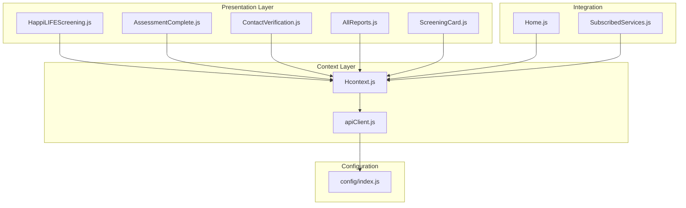

**Diagram sources**
- [HappiLIFEScreening.js:1-264](file://src/screens/HappiLIFE/HappiLIFEScreening.js#L1-L264)
- [Hcontext.js:1-1551](file://src/context/Hcontext.js#L1-L1551)
- [apiClient.js:1-58](file://src/context/apiClient.js#L1-L58)

**Section sources**
- [HappiLIFEScreening.js:1-264](file://src/screens/HappiLIFE/HappiLIFEScreening.js#L1-L264)
- [Hcontext.js:1-800](file://src/context/Hcontext.js#L1-L800)

## Core Components

### Assessment Workflow Components

The screening system consists of several interconnected components that work together to provide a seamless user experience:

1. **HappiLIFEScreening**: Main assessment interface that displays questions and handles user interactions
2. **ScreeningCard**: Individual question card component with answer selection functionality
3. **AssessmentComplete**: Completion screen that appears after questionnaire completion
4. **ContactVerification**: Verification screen for collecting user contact information
5. **AllReports**: Report management interface for accessing previous assessments

### Context Provider Architecture

The Hcontext.js file serves as the central data management hub, providing:

- Authentication state management
- API client configuration
- Assessment workflow orchestration
- Analytics tracking
- Subscription integration

**Section sources**
- [ScreeningCard.js:1-177](file://src/components/cards/ScreeningCard.js#L1-L177)
- [Hcontext.js:800-1551](file://src/context/Hcontext.js#L800-L1551)

## Architecture Overview

The HappiLIFE Screening API follows a client-server architecture with the following key components:

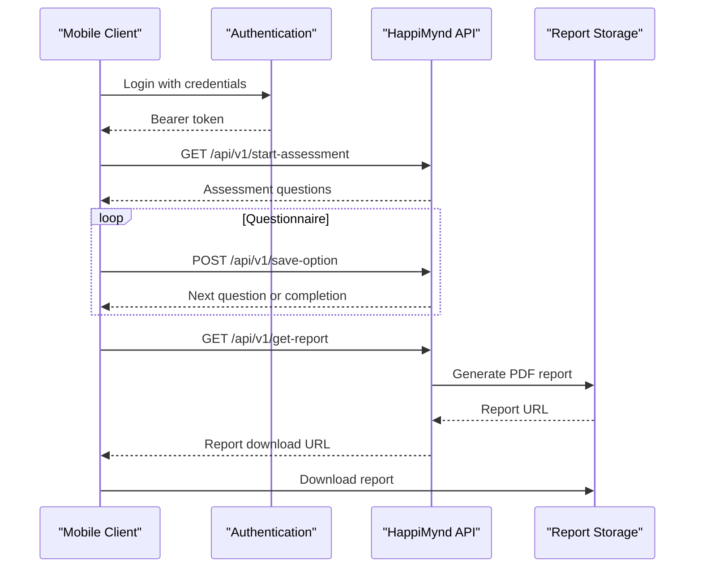

**Diagram sources**
- [Hcontext.js:382-451](file://src/context/Hcontext.js#L382-L451)
- [apiClient.js:12-44](file://src/context/apiClient.js#L12-L44)

## Detailed Component Analysis

### Assessment Creation Workflow

The assessment creation process involves several coordinated steps:

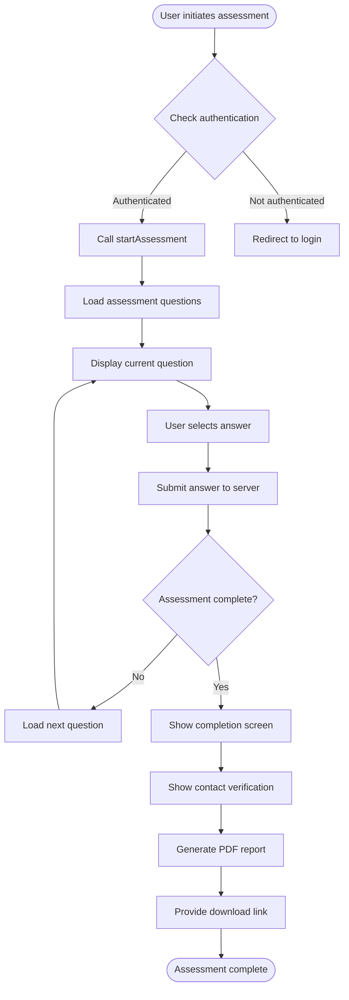

**Diagram sources**
- [HappiLIFEScreening.js:102-151](file://src/screens/HappiLIFE/HappiLIFEScreening.js#L102-L151)
- [ScreeningCard.js:44-97](file://src/components/cards/ScreeningCard.js#L44-L97)

#### Questionnaire Submission Process

The questionnaire submission mechanism operates through the following sequence:

1. **Question Loading**: The system loads assessment questions from the `/api/v1/start-assessment` endpoint
2. **Answer Processing**: User selections are sent to `/api/v1/save-option` with the selected option ID
3. **Progress Tracking**: The system maintains question order and progression state
4. **Completion Detection**: The server responds with "completed" status when assessment finishes

**Section sources**
- [HappiLIFEScreening.js:120-151](file://src/screens/HappiLIFE/HappiLIFEScreening.js#L120-L151)
- [ScreeningCard.js:44-97](file://src/components/cards/ScreeningCard.js#L44-L97)

### Scoring Algorithms

The scoring mechanism follows a straightforward approach:

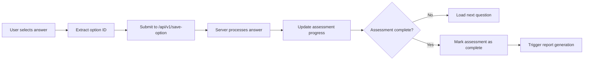

**Diagram sources**
- [Hcontext.js:416-427](file://src/context/Hcontext.js#L416-L427)

### Report Generation and Download

The report generation system provides multiple access methods:

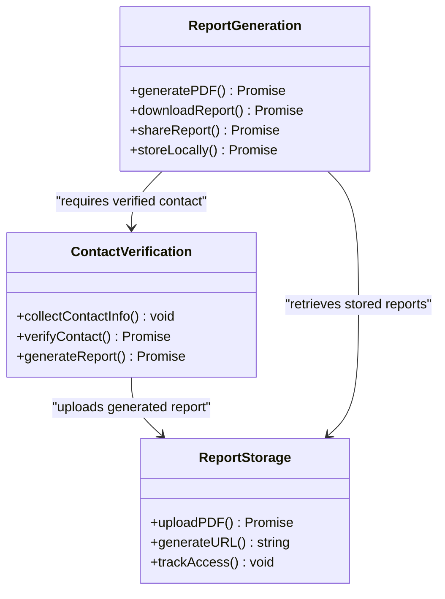

**Diagram sources**
- [AllReports.js:118-173](file://src/screens/HappiLIFE/AllReports.js#L118-L173)
- [ContactVerification.js:173-222](file://src/screens/HappiLIFE/ContactVerification.js#L173-L222)

**Section sources**
- [AllReports.js:118-173](file://src/screens/HappiLIFE/AllReports.js#L118-L173)
- [ContactVerification.js:173-222](file://src/screens/HappiLIFE/ContactVerification.js#L173-L222)

### Contact Verification APIs

The contact verification system implements a two-factor approach:

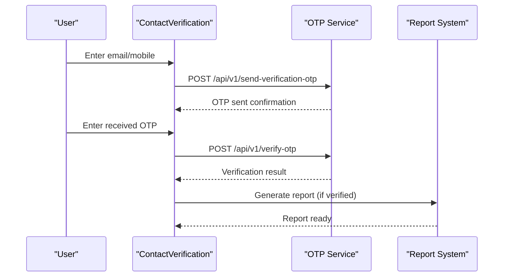

**Diagram sources**
- [ContactVerification.js:119-172](file://src/screens/HappiLIFE/ContactVerification.js#L119-L172)
- [Hcontext.js:667-698](file://src/context/Hcontext.js#L667-L698)

**Section sources**
- [ContactVerification.js:119-172](file://src/screens/HappiLIFE/ContactVerification.js#L119-L172)
- [Hcontext.js:343-359](file://src/context/Hcontext.js#L343-L359)

## Authentication and Security

### Authentication Requirements

The HappiLIFE Screening API requires bearer token authentication for all protected endpoints:

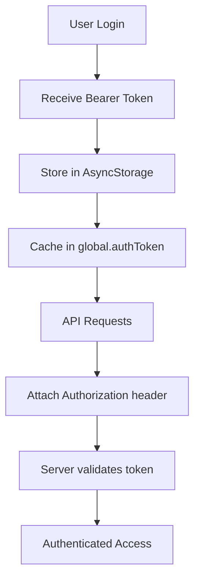

**Diagram sources**
- [apiClient.js:12-44](file://src/context/apiClient.js#L12-L44)

### Token Management

The authentication system implements multiple token retrieval strategies:

1. **Global Cache**: Checks `global.authToken` first
2. **Context State**: Falls back to `global.authState.user.access_token`
3. **AsyncStorage**: Last resort using `"USER"` key
4. **Automatic Attachment**: All requests automatically include Authorization header

**Section sources**
- [apiClient.js:12-44](file://src/context/apiClient.js#L12-L44)
- [config/index.js:1-13](file://src/config/index.js#L1-L13)

## API Endpoints Reference

### Assessment Endpoints

| Endpoint | Method | Description | Authentication |
|----------|--------|-------------|----------------|
| `/api/v1/start-assessment` | POST | Initialize new assessment session | Required |
| `/api/v1/save-option` | POST | Submit answer choice | Required |
| `/api/v1/checkifany` | POST | Check for existing assessment | Required |

### Report Endpoints

| Endpoint | Method | Description | Authentication |
|----------|--------|-------------|----------------|
| `/api/v1/get-report` | GET | Retrieve latest assessment report | Required |
| `/api/v1/get-all-report` | GET | Retrieve all assessment reports | Required |

### Verification Endpoints

| Endpoint | Method | Description | Authentication |
|----------|--------|-------------|----------------|
| `/api/v1/send-verification-otp` | POST | Send verification OTP | Required |
| `/api/v1/verify-otp` | POST | Verify OTP code | Required |

### User Management Endpoints

| Endpoint | Method | Description | Authentication |
|----------|--------|-------------|----------------|
| `/api/v1/get-profile` | GET | Retrieve user profile | Required |
| `/api/v1/my-subscribed-services` | GET | Get user subscriptions | Required |

**Section sources**
- [Hcontext.js:382-451](file://src/context/Hcontext.js#L382-L451)
- [Hcontext.js:667-698](file://src/context/Hcontext.js#L667-L698)

## Data Validation Rules

### Assessment Response Validation

The system implements comprehensive validation for assessment responses:

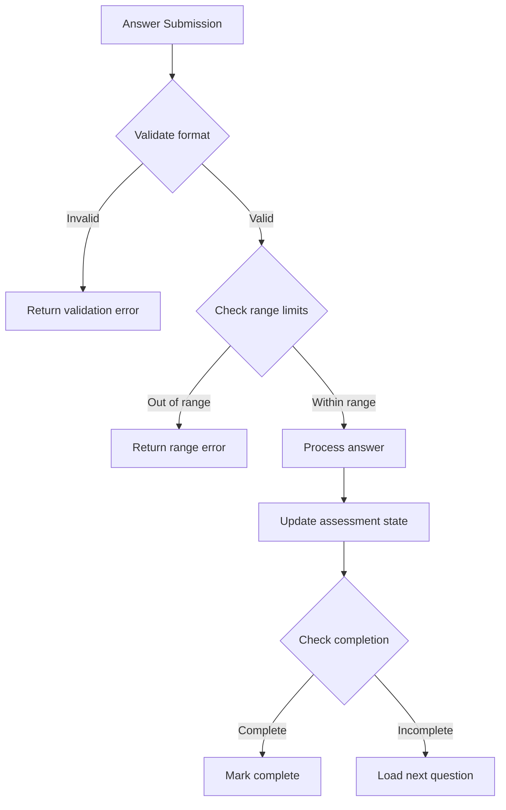

### Contact Information Validation

Contact verification implements strict validation rules:

1. **Email Validation**: Optional field with format validation
2. **Phone Validation**: Required field with country code support
3. **OTP Validation**: 6-digit numeric code verification
4. **Terms Agreement**: Mandatory checkbox for terms acceptance

**Section sources**
- [ContactVerification.js:145-171](file://src/screens/HappiLIFE/ContactVerification.js#L145-L171)
- [ScreeningCard.js:44-97](file://src/components/cards/ScreeningCard.js#L44-L97)

## Response Schemas

### Assessment Response Schema

```javascript
{
  "status": "success",
  "data": {
    "assessment_id": "string",
    "questions": [
      {
        "id": "string",
        "question": "string",
        "options": [
          {
            "id": "string",
            "option": "string",
            "score": "number"
          }
        ]
      }
    ]
  }
}
```

### Report Response Schema

```javascript
{
  "status": "success",
  "data": {
    "report_id": "string",
    "assessment_id": "string",
    "created_at": "datetime",
    "report": "string", // PDF URL
    "summary": {
      "overall_score": "number",
      "categories": [
        {
          "name": "string",
          "score": "number",
          "recommendations": ["string"]
        }
      ]
    }
  }
}
```

### Subscription Response Schema

```javascript
{
  "status": "success",
  "data": [
    {
      "id": "number",
      "name": "string",
      "description": "string",
      "subscribed": "boolean",
      "expires_at": "datetime"
    }
  ]
}
```

**Section sources**
- [Hcontext.js:441-451](file://src/context/Hcontext.js#L441-L451)
- [SubscribedServices.js:131-212](file://src/screens/Individual/SubscribedServices.js#L131-L212)

## Integration with Subscription Management

### Subscription-Based Access Control

The HappiLIFE screening system integrates with the subscription management platform to control report access:

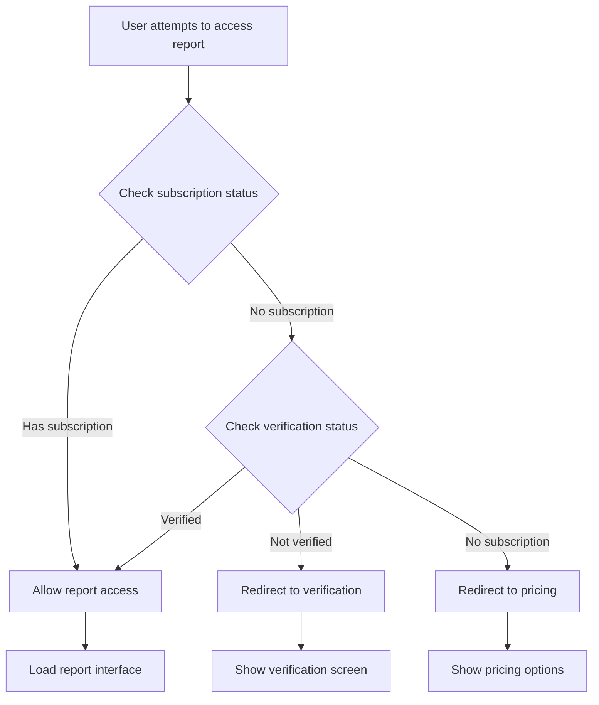

**Diagram sources**
- [Home.js:281-316](file://src/screens/Home/Home.js#L281-L316)
- [SubscribedServices.js:131-212](file://src/screens/Individual/SubscribedServices.js#L131-L212)

### Subscription Types and Features

| Subscription Type | Access Level | Features |
|-------------------|--------------|----------|
| HappiLIFE Screening | Basic | Full assessment access |
| HappiLIFE Summary Reading | Enhanced | Access to detailed summaries |
| HappiGUIDE | Premium | Expert consultation sessions |
| HappiLEARN | Premium | Self-help content access |

**Section sources**
- [SubscribedServices.js:136-193](file://src/screens/Individual/SubscribedServices.js#L136-L193)
- [Home.js:281-316](file://src/screens/Home/Home.js#L281-L316)

## Analytics and Reporting

### Screen Traffic Analytics

The system implements comprehensive analytics tracking:

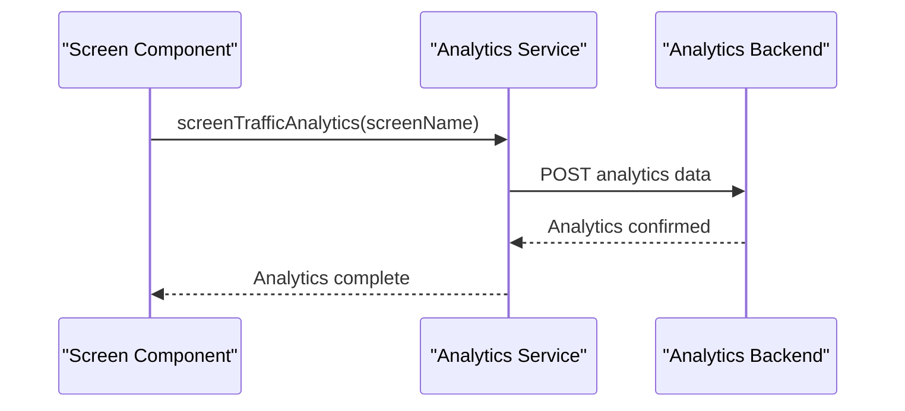

**Diagram sources**
- [Hcontext.js:1321-1334](file://src/context/Hcontext.js#L1321-L1334)

### Engagement Metrics Tracking

The analytics system tracks:

1. **Screen Views**: Individual screen visit counts
2. **Assessment Completion**: Completion rate per assessment
3. **Feature Usage**: Time spent on each screen
4. **User Journey**: Navigation flow analysis

**Section sources**
- [Hcontext.js:1321-1334](file://src/context/Hcontext.js#L1321-L1334)
- [HappiLIFEScreening.js:111](file://src/screens/HappiLIFE/HappiLIFEScreening.js#L111)

## Performance Considerations

### API Request Optimization

The system implements several performance optimization strategies:

1. **Token Caching**: Automatic bearer token caching reduces authentication overhead
2. **Request Interception**: Centralized request handling for consistent headers
3. **Timeout Management**: 15-second timeout prevents hanging requests
4. **Error Recovery**: Graceful error handling with user feedback

### Mobile-Specific Optimizations

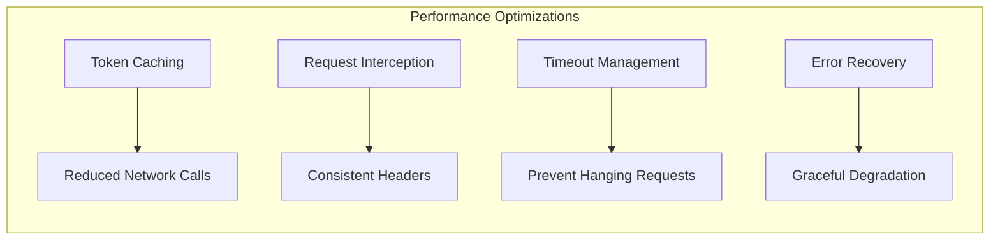

**Section sources**
- [apiClient.js:6-58](file://src/context/apiClient.js#L6-L58)

## Troubleshooting Guide

### Common Authentication Issues

| Issue | Symptoms | Solution |
|-------|----------|----------|
| Token Expired | 401 Unauthorized errors | Force user to re-authenticate |
| Network Timeout | Request hangs for 15+ seconds | Check internet connection |
| Invalid Credentials | Login fails repeatedly | Verify username/password |
| Storage Corruption | Token not found in AsyncStorage | Clear app cache and reinstall |

### Assessment Workflow Issues

| Issue | Symptoms | Solution |
|-------|----------|----------|
| Questions Not Loading | Blank assessment screen | Check network connectivity |
| Answer Submission Failing | No response after selection | Verify internet connection |
| Assessment Stuck | Cannot proceed to next question | Restart assessment session |
| Report Generation Failed | Error generating PDF | Check storage permissions |

### Contact Verification Problems

| Issue | Symptoms | Solution |
|-------|----------|----------|
| OTP Not Received | Empty OTP field | Verify phone/email format |
| OTP Verification Fails | Error message on submit | Check OTP validity period |
| Report Access Denied | Cannot download report | Complete verification process |
| Terms Agreement Error | Button disabled | Accept terms and conditions |

**Section sources**
- [apiClient.js:47-56](file://src/context/apiClient.js#L47-L56)
- [HappiLIFEScreening.js:142-149](file://src/screens/HappiLIFE/HappiLIFEScreening.js#L142-L149)

## Conclusion

The HappiLIFE Screening API provides a robust, scalable solution for mental wellness assessment and reporting. The system's architecture supports seamless user experiences while maintaining strong security and performance standards.

Key strengths of the implementation include:

- **Comprehensive Authentication**: Multi-layered token management ensures secure access
- **Flexible Reporting**: Multiple access methods accommodate different user needs
- **Subscription Integration**: Seamless integration with HappiMynd's subscription platform
- **Analytics Support**: Built-in tracking enables continuous improvement
- **Mobile Optimization**: Performance considerations tailored for mobile environments

The API's modular design allows for easy maintenance and future enhancements while providing a solid foundation for expanding mental health assessment capabilities.