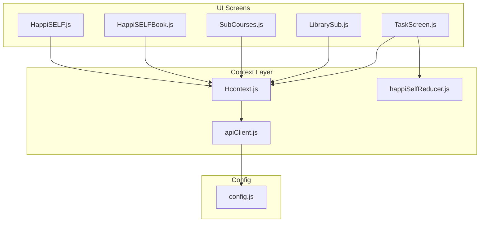
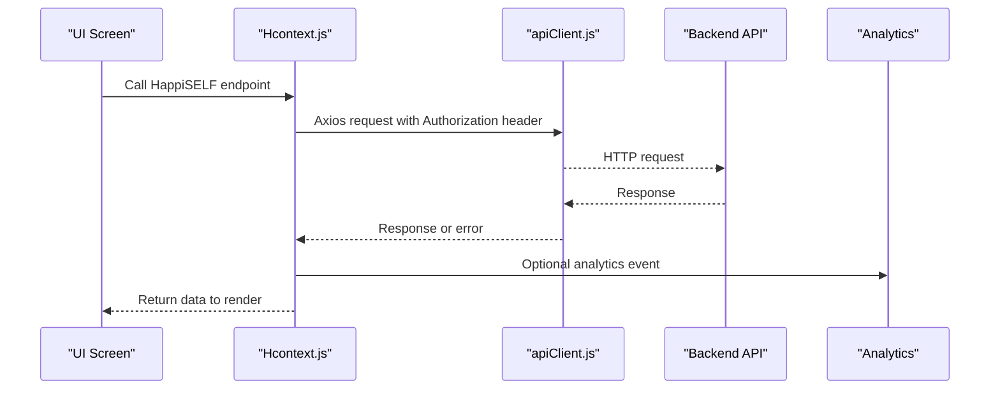
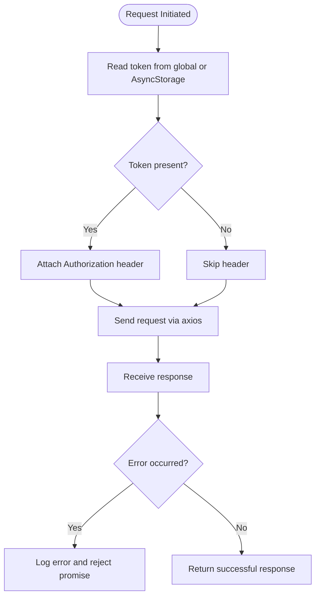
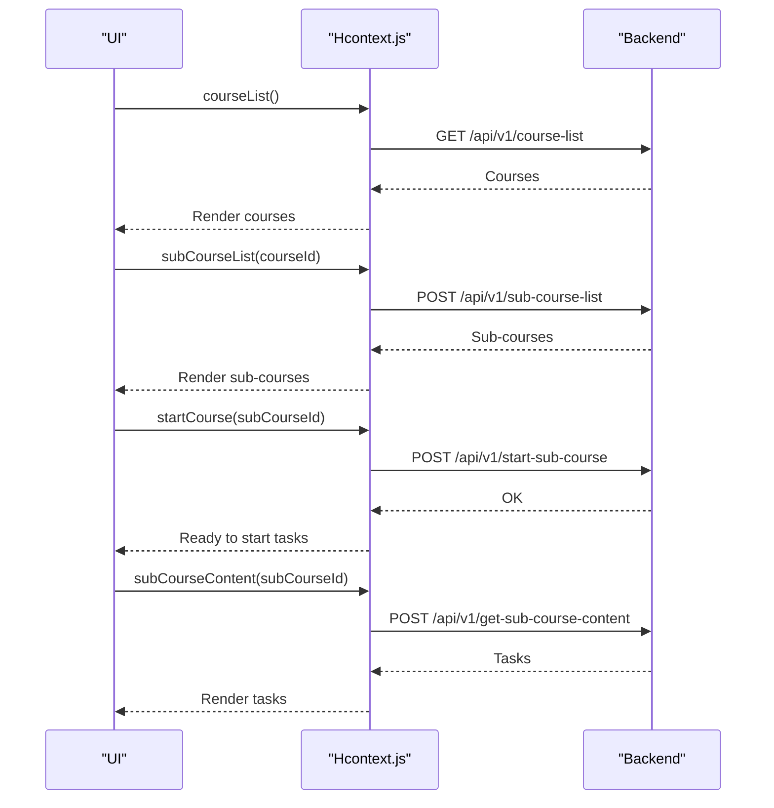
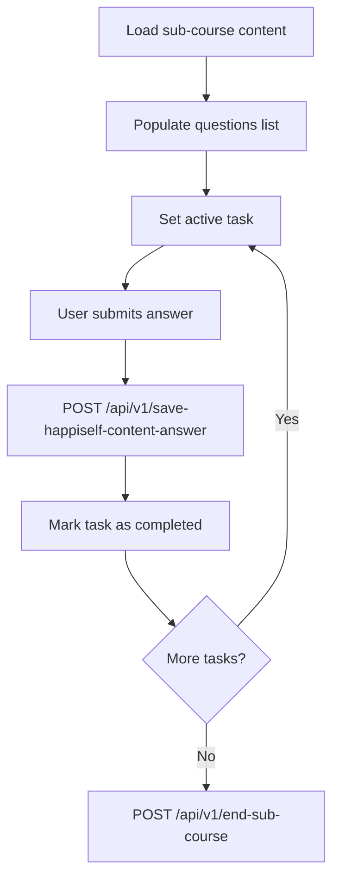
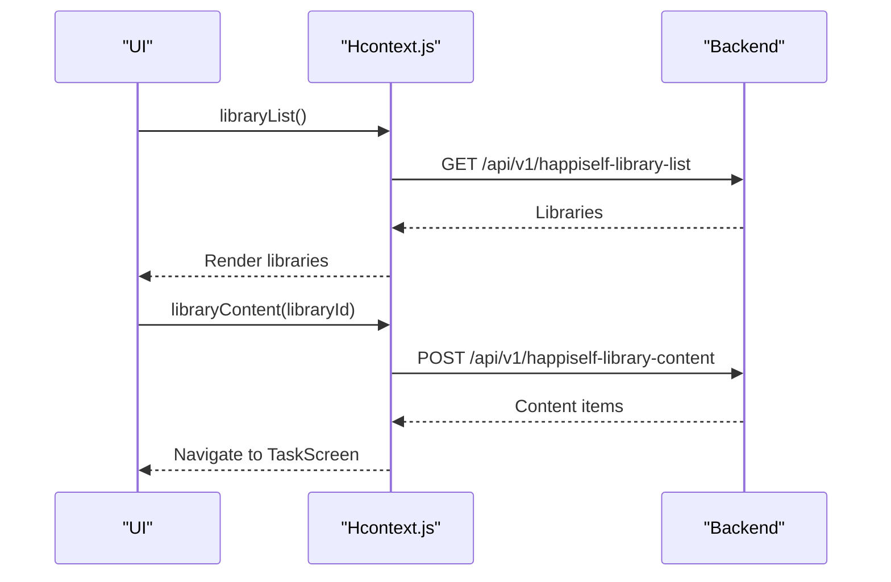
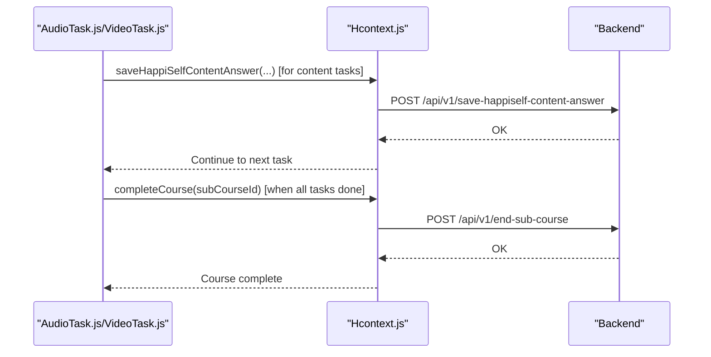
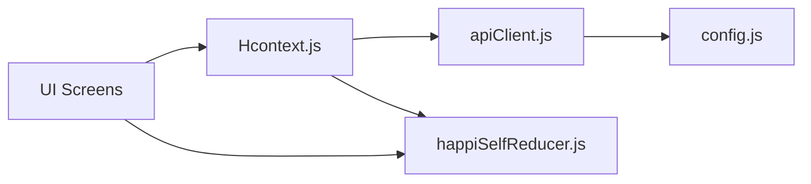

# HappiSELF Self-Help API

<cite>
**Referenced Files in This Document**
- [apiClient.js](file://src/context/apiClient.js)
- [Hcontext.js](file://src/context/Hcontext.js)
- [happiSelfReducer.js](file://src/context/reducers/happiSelfReducer.js)
- [config.js](file://src/config/index.js)
- [HappiSELF.js](file://src/screens/HappiSELF/HappiSELF.js)
- [HappiSELFBook.js](file://src/screens/HappiSELF/HappiSELFBook.js)
- [SubCourses.js](file://src/screens/HappiSELF/SubCourses.js)
- [LibrarySub.js](file://src/screens/HappiSELF/LibrarySub.js)
- [TaskScreen.js](file://src/screens/HappiSELF/TaskScreen.js)
- [AudioTask.js](file://src/screens/HappiSELF/Tasks/AudioTask.js)
- [VideoTask.js](file://src/screens/HappiSELF/Tasks/VideoTask.js)
</cite>

## Table of Contents
1. [Introduction](#introduction)
2. [Project Structure](#project-structure)
3. [Core Components](#core-components)
4. [Architecture Overview](#architecture-overview)
5. [Detailed Component Analysis](#detailed-component-analysis)
6. [Dependency Analysis](#dependency-analysis)
7. [Performance Considerations](#performance-considerations)
8. [Troubleshooting Guide](#troubleshooting-guide)
9. [Conclusion](#conclusion)

## Introduction
This document provides comprehensive API documentation for the HappiSELF self-help service endpoints integrated within the HappiMynd mobile application. It covers task management APIs (assignment, progress tracking, completion validation), course enrollment and sub-course workflows, library subscription endpoints, task scheduling mechanisms, authentication requirements, response validation schemas, progress update endpoints, and integrations with meditation timers, audio task playback, video content delivery, and analytics.

## Project Structure
The HappiSELF feature is implemented as part of the React Native application under the src/screens/HappiSELF directory. The API layer is centralized via a shared HTTP client and a context provider that exposes HappiSELF-specific endpoints. Configuration defines base URLs for the primary backend and analytics services.

**Diagram sources**
- [HappiSELF.js:25-42](file://src/screens/HappiSELF/HappiSELF.js#L25-L42)
- [HappiSELFBook.js:39-115](file://src/screens/HappiSELF/HappiSELFBook.js#L39-L115)
- [SubCourses.js:33-146](file://src/screens/HappiSELF/SubCourses.js#L33-L146)
- [LibrarySub.js:23-102](file://src/screens/HappiSELF/LibrarySub.js#L23-L102)
- [TaskScreen.js:27-226](file://src/screens/HappiSELF/TaskScreen.js#L27-L226)
- [Hcontext.js:886-1061](file://src/context/Hcontext.js#L886-L1061)
- [happiSelfReducer.js:1-45](file://src/context/reducers/happiSelfReducer.js#L1-L45)
- [apiClient.js:1-58](file://src/context/apiClient.js#L1-L58)
- [config.js:1-13](file://src/config/index.js#L1-L13)

**Section sources**
- [HappiSELF.js:25-42](file://src/screens/HappiSELF/HappiSELF.js#L25-L42)
- [HappiSELFBook.js:39-115](file://src/screens/HappiSELF/HappiSELFBook.js#L39-L115)
- [SubCourses.js:33-146](file://src/screens/HappiSELF/SubCourses.js#L33-L146)
- [LibrarySub.js:23-102](file://src/screens/HappiSELF/LibrarySub.js#L23-L102)
- [TaskScreen.js:27-226](file://src/screens/HappiSELF/TaskScreen.js#L27-L226)
- [Hcontext.js:886-1061](file://src/context/Hcontext.js#L886-L1061)
- [happiSelfReducer.js:1-45](file://src/context/reducers/happiSelfReducer.js#L1-L45)
- [apiClient.js:1-58](file://src/context/apiClient.js#L1-L58)
- [config.js:1-13](file://src/config/index.js#L1-L13)

## Core Components
- Authentication and HTTP client
  - The HTTP client attaches a Bearer token from global state or AsyncStorage to all outgoing requests. It also logs errors and responses for debugging.
- HappiSELF context provider
  - Exposes endpoints for course enrollment, sub-course content retrieval, task completion, notes management, library content, and analytics.
- UI screens orchestrating HappiSELF workflows
  - Screens coordinate navigation, subscription checks, course selection, and task execution.

Key HappiSELF endpoints exposed by the context:
- Course and sub-course management
  - GET /api/v1/course-list
  - POST /api/v1/sub-course-list
  - POST /api/v1/get-sub-course-content
  - POST /api/v1/start-sub-course
  - POST /api/v1/end-sub-course
- Notes management
  - GET /api/v1/happiself-get-notes-list
  - POST /api/v1/happiself-add-notes
  - POST /api/v1/happiself-update-notes
  - POST /api/v1/happiself-delete-notes-by-id
- Library content
  - GET /api/v1/happiself-library-list
  - POST /api/v1/happiself-library-content
- Task answers
  - POST /api/v1/save-happiself-content-answer
- Analytics
  - POST https://app.nativenotify.com/api/analytics (screen traffic)

**Section sources**
- [apiClient.js:12-44](file://src/context/apiClient.js#L12-L44)
- [Hcontext.js:886-1061](file://src/context/Hcontext.js#L886-L1061)
- [config.js:1-13](file://src/config/index.js#L1-L13)

## Architecture Overview
The HappiSELF feature follows a layered architecture:
- UI layer: React Native screens orchestrate user interactions.
- Context layer: Hcontext.js centralizes API calls and state management for HappiSELF.
- HTTP client: apiClient.js handles authentication headers and error interception.
- Configuration: config.js defines base URLs for the backend and analytics.

**Diagram sources**
- [Hcontext.js:886-1061](file://src/context/Hcontext.js#L886-L1061)
- [apiClient.js:12-44](file://src/context/apiClient.js#L12-L44)
- [config.js:8-12](file://src/config/index.js#L8-L12)

## Detailed Component Analysis

### Authentication and HTTP Client
- Purpose: Centralize HTTP requests with automatic Bearer token injection and standardized error handling.
- Behavior:
  - Reads token from global auth state or AsyncStorage.
  - Attaches Authorization: Bearer header for authenticated endpoints.
  - Intercepts responses to surface meaningful errors.

**Diagram sources**
- [apiClient.js:12-44](file://src/context/apiClient.js#L12-L44)
- [apiClient.js:47-56](file://src/context/apiClient.js#L47-L56)

**Section sources**
- [apiClient.js:12-44](file://src/context/apiClient.js#L12-L44)
- [apiClient.js:47-56](file://src/context/apiClient.js#L47-L56)

### Course Enrollment and Sub-Course Management
- Workflow:
  - Fetch course list.
  - Select a course and fetch sub-courses.
  - Start a sub-course to initialize progress.
  - Retrieve sub-course content for tasks.
  - Complete a sub-course upon finishing all tasks.

Endpoints used:
- GET /api/v1/course-list
- POST /api/v1/sub-course-list
- POST /api/v1/get-sub-course-content
- POST /api/v1/start-sub-course
- POST /api/v1/end-sub-course

**Diagram sources**
- [Hcontext.js:886-969](file://src/context/Hcontext.js#L886-L969)

**Section sources**
- [Hcontext.js:886-969](file://src/context/Hcontext.js#L886-L969)
- [SubCourses.js:58-87](file://src/screens/HappiSELF/SubCourses.js#L58-L87)
- [TaskScreen.js:92-119](file://src/screens/HappiSELF/TaskScreen.js#L92-L119)

### Task Management APIs
- Task assignment and scheduling:
  - Retrieve sub-course content to populate the task queue.
  - Maintain active task state and track completion per task.
- Progress tracking:
  - Update local state to mark tasks as completed.
  - Save answers for content-based tasks.
- Completion validation:
  - Submit answers and mark tasks complete.
  - Complete sub-course when all tasks are finished.

Endpoints used:
- POST /api/v1/save-happiself-content-answer
- POST /api/v1/end-sub-course

**Diagram sources**
- [Hcontext.js:1049-1061](file://src/context/Hcontext.js#L1049-L1061)
- [Hcontext.js:958-969](file://src/context/Hcontext.js#L958-L969)
- [TaskScreen.js:121-146](file://src/screens/HappiSELF/TaskScreen.js#L121-L146)

**Section sources**
- [TaskScreen.js:27-226](file://src/screens/HappiSELF/TaskScreen.js#L27-L226)
- [Hcontext.js:1049-1061](file://src/context/Hcontext.js#L1049-L1061)
- [Hcontext.js:958-969](file://src/context/Hcontext.js#L958-L969)
- [happiSelfReducer.js:1-45](file://src/context/reducers/happiSelfReducer.js#L1-L45)

### Library Subscription Endpoints
- Retrieve library lists and content for self-help resources.
- Navigate to task screens for library items similarly to sub-courses.

Endpoints used:
- GET /api/v1/happiself-library-list
- POST /api/v1/happiself-library-content

**Diagram sources**
- [Hcontext.js:1018-1038](file://src/context/Hcontext.js#L1018-L1038)
- [LibrarySub.js:43-55](file://src/screens/HappiSELF/LibrarySub.js#L43-L55)

**Section sources**
- [Hcontext.js:1018-1038](file://src/context/Hcontext.js#L1018-L1038)
- [LibrarySub.js:23-102](file://src/screens/HappiSELF/LibrarySub.js#L23-L102)

### Notes Management Endpoints
- CRUD operations for user notes within the HappiSELF module.

Endpoints used:
- GET /api/v1/happiself-get-notes-list
- POST /api/v1/happiself-add-notes
- POST /api/v1/happiself-update-notes
- POST /api/v1/happiself-delete-notes-by-id

**Section sources**
- [Hcontext.js:971-1017](file://src/context/Hcontext.js#L971-L1017)

### Analytics Endpoints
- Screen traffic analytics via NativeNotify.

Endpoint used:
- POST https://app.nativenotify.com/api/analytics

**Section sources**
- [Hcontext.js:1328-1341](file://src/context/Hcontext.js#L1328-L1341)
- [config.js:8-12](file://src/config/index.js#L8-L12)

### Audio and Video Task Integrations
- Audio playback:
  - Uses expo-av to stream audio content and manage playback controls.
  - Automatically marks tasks complete upon playback finish (non-library items).
- Video playback:
  - Uses expo-av to stream video content and marks tasks complete upon finish.

**Diagram sources**
- [AudioTask.js:88-121](file://src/screens/HappiSELF/Tasks/AudioTask.js#L88-L121)
- [VideoTask.js:103-122](file://src/screens/HappiSELF/Tasks/VideoTask.js#L103-L122)
- [Hcontext.js:1049-1061](file://src/context/Hcontext.js#L1049-L1061)
- [Hcontext.js:958-969](file://src/context/Hcontext.js#L958-L969)

**Section sources**
- [AudioTask.js:28-184](file://src/screens/HappiSELF/Tasks/AudioTask.js#L28-L184)
- [VideoTask.js:26-173](file://src/screens/HappiSELF/Tasks/VideoTask.js#L26-L173)
- [Hcontext.js:1049-1061](file://src/context/Hcontext.js#L1049-L1061)
- [Hcontext.js:958-969](file://src/context/Hcontext.js#L958-L969)

## Dependency Analysis
- UI screens depend on Hcontext for API calls and state updates.
- Hcontext depends on apiClient for HTTP communication and config for base URLs.
- Task screens rely on the HappiSELF reducer to maintain task state locally.

**Diagram sources**
- [HappiSELF.js:30-31](file://src/screens/HappiSELF/HappiSELF.js#L30-L31)
- [SubCourses.js:39-40](file://src/screens/HappiSELF/SubCourses.js#L39-L40)
- [TaskScreen.js:33-39](file://src/screens/HappiSELF/TaskScreen.js#L33-L39)
- [Hcontext.js:1416-1552](file://src/context/Hcontext.js#L1416-L1552)
- [apiClient.js:1-58](file://src/context/apiClient.js#L1-L58)
- [happiSelfReducer.js:1-45](file://src/context/reducers/happiSelfReducer.js#L1-L45)
- [config.js:1-13](file://src/config/index.js#L1-L13)

**Section sources**
- [HappiSELF.js:30-31](file://src/screens/HappiSELF/HappiSELF.js#L30-L31)
- [SubCourses.js:39-40](file://src/screens/HappiSELF/SubCourses.js#L39-L40)
- [TaskScreen.js:33-39](file://src/screens/HappiSELF/TaskScreen.js#L33-L39)
- [Hcontext.js:1416-1552](file://src/context/Hcontext.js#L1416-L1552)
- [apiClient.js:1-58](file://src/context/apiClient.js#L1-L58)
- [happiSelfReducer.js:1-45](file://src/context/reducers/happiSelfReducer.js#L1-L45)
- [config.js:1-13](file://src/config/index.js#L1-L13)

## Performance Considerations
- Token caching: The HTTP client caches tokens in global state to reduce repeated AsyncStorage reads.
- Timeout configuration: Requests are configured with a 15-second timeout to prevent hanging.
- Local state management: Task queues and active tasks are maintained in memory to minimize redundant network calls.
- Media playback: Audio/video playback is managed locally; ensure proper cleanup to free resources.

[No sources needed since this section provides general guidance]

## Troubleshooting Guide
- Authentication failures
  - Ensure a valid access token is present in global auth state or AsyncStorage.
  - Confirm Authorization header is attached to requests.
- Network timeouts
  - Review request timeout configuration and retry logic.
- Analytics events
  - Verify analytics endpoint configuration and credentials.

**Section sources**
- [apiClient.js:12-44](file://src/context/apiClient.js#L12-L44)
- [apiClient.js:47-56](file://src/context/apiClient.js#L47-L56)
- [config.js:8-12](file://src/config/index.js#L8-L12)

## Conclusion
The HappiSELF feature integrates seamlessly with the application’s context and HTTP client to deliver a robust self-help experience. The documented endpoints support course enrollment, task management, library access, notes, and analytics. Proper authentication and local state management enable smooth user interactions, while media playback components enhance engagement with audio and video content.