# HappiTALK Therapy API

<cite>
**Referenced Files in This Document**
- [apiClient.js](file://src/context/apiClient.js)
- [config.js](file://src/config/index.js)
- [Hcontext.js](file://src/context/Hcontext.js)
- [HappiTALK.js](file://src/screens/HappiTALK/HappiTALK.js)
- [HappiTALKBook.js](file://src/screens/HappiTALK/HappiTALKBook.js)
- [ManageBookings.js](file://src/screens/HappiTALK/ManageBookings.js)
- [MakeBooking.js](file://src/screens/HappiTALK/MakeBooking.js)
- [Credits.js](file://src/screens/HappiTALK/Credits.js)
- [VideoCall.js](file://src/screens/HappiTALK/VideoCall.js)
- [CancelBookingModal.js](file://src/components/Modals/CancelBookingModal.js)
- [TimeSlot.js](file://src/components/Modals/TimeSlot.js)
</cite>

## Table of Contents
1. [Introduction](#introduction)
2. [Project Structure](#project-structure)
3. [Core Components](#core-components)
4. [Architecture Overview](#architecture-overview)
5. [Detailed Component Analysis](#detailed-component-analysis)
6. [Dependency Analysis](#dependency-analysis)
7. [Performance Considerations](#performance-considerations)
8. [Troubleshooting Guide](#troubleshooting-guide)
9. [Conclusion](#conclusion)

## Introduction
This document provides comprehensive API documentation for the HappiTALK therapy service endpoints implemented in the client application. It covers booking management APIs (therapist availability, appointment scheduling, and cancellation), video call initiation, payment processing integrations, session management, authentication requirements, validation rules, real-time communication endpoints, credit system APIs, and session feedback collection mechanisms. The documentation is structured to be accessible to both technical and non-technical readers.

## Project Structure
The HappiTALK therapy feature is organized around React Native screens and a centralized context provider that encapsulates API interactions. The key components include:
- Authentication and API client configuration
- Booking management screens (listing, managing, and scheduling)
- Payment and coupon application flows
- Video call initiation and real-time communication
- Credit balance retrieval
- Feedback submission

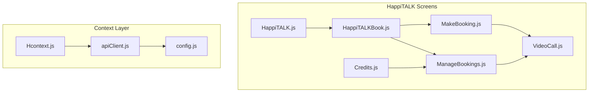

**Diagram sources**
- [HappiTALK.js:1-202](file://src/screens/HappiTALK/HappiTALK.js#L1-L202)
- [HappiTALKBook.js:1-233](file://src/screens/HappiTALK/HappiTALKBook.js#L1-L233)
- [ManageBookings.js:1-674](file://src/screens/HappiTALK/ManageBookings.js#L1-L674)
- [MakeBooking.js:1-945](file://src/screens/HappiTALK/MakeBooking.js#L1-L945)
- [Credits.js:1-114](file://src/screens/HappiTALK/Credits.js#L1-L114)
- [VideoCall.js:1-431](file://src/screens/HappiTALK/VideoCall.js#L1-L431)
- [Hcontext.js:1-1568](file://src/context/Hcontext.js#L1-L1568)
- [apiClient.js:1-58](file://src/context/apiClient.js#L1-L58)
- [config.js:1-13](file://src/config/index.js#L1-L13)

**Section sources**
- [HappiTALK.js:1-202](file://src/screens/HappiTALK/HappiTALK.js#L1-L202)
- [HappiTALKBook.js:1-233](file://src/screens/HappiTALK/HappiTALKBook.js#L1-L233)
- [ManageBookings.js:1-674](file://src/screens/HappiTALK/ManageBookings.js#L1-L674)
- [MakeBooking.js:1-945](file://src/screens/HappiTALK/MakeBooking.js#L1-L945)
- [Credits.js:1-114](file://src/screens/HappiTALK/Credits.js#L1-L114)
- [VideoCall.js:1-431](file://src/screens/HappiTALK/VideoCall.js#L1-L431)
- [Hcontext.js:1-1568](file://src/context/Hcontext.js#L1-L1568)
- [apiClient.js:1-58](file://src/context/apiClient.js#L1-L58)
- [config.js:1-13](file://src/config/index.js#L1-L13)

## Core Components
- Authentication and API Client
  - Centralized Axios client with automatic bearer token injection from global state or AsyncStorage.
  - Base URL configured for production server.
- Context Provider (Hcontext)
  - Encapsulates all therapy-related API endpoints including booking, payments, sessions, feedback, and real-time communication.
  - Provides state management for auth, snack notifications, and white-label configurations.
- HappiTALK Screens
  - Navigation and orchestration for therapy services, including booking, credits, and video call initiation.

Key responsibilities:
- Authentication: Token retrieval and Authorization header injection.
- Booking Management: Availability, scheduling, rescheduling, cancellation, and status transitions.
- Payments: Coupon application, payment initiation, and plan selection.
- Sessions: Real-time video call access and participant management.
- Credits: Listing and balance tracking.
- Feedback: Post-session feedback submission.

**Section sources**
- [apiClient.js:1-58](file://src/context/apiClient.js#L1-L58)
- [config.js:1-13](file://src/config/index.js#L1-L13)
- [Hcontext.js:1-1568](file://src/context/Hcontext.js#L1-L1568)

## Architecture Overview
The architecture follows a layered pattern:
- UI Screens: Render therapy features and collect user inputs.
- Context Provider: Exposes API methods and manages global state.
- API Client: Handles HTTP requests with interceptors for authentication and error handling.
- Backend Services: Hosted at the configured base URL with endpoints for therapy operations.

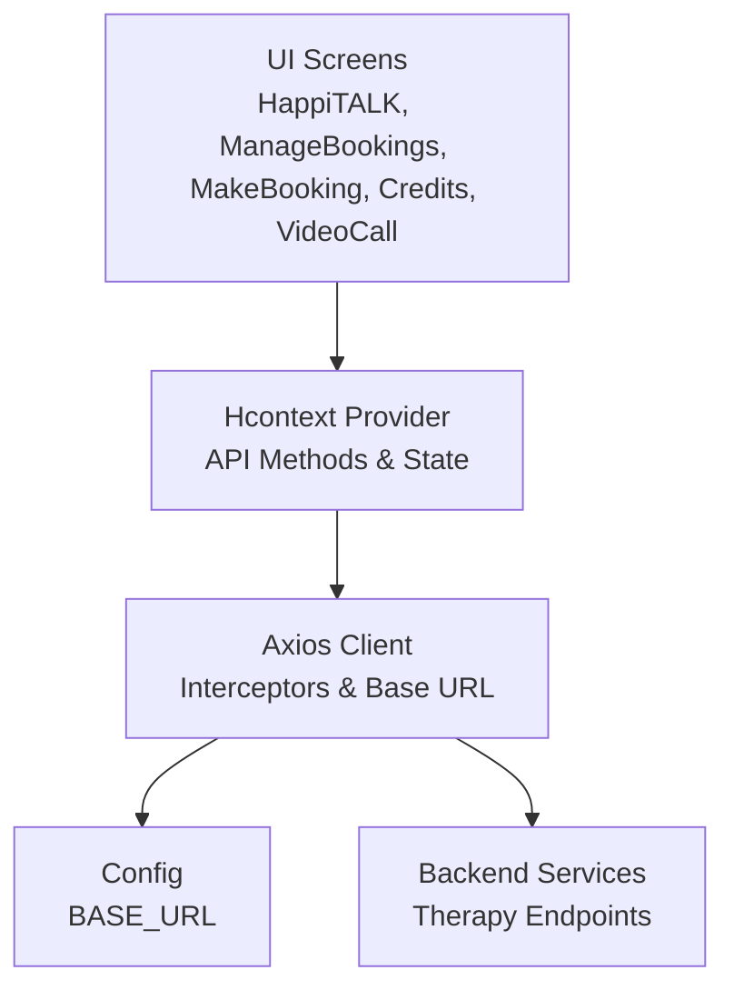

**Diagram sources**
- [Hcontext.js:1-1568](file://src/context/Hcontext.js#L1-L1568)
- [apiClient.js:1-58](file://src/context/apiClient.js#L1-L58)
- [config.js:1-13](file://src/config/index.js#L1-L13)

## Detailed Component Analysis

### Authentication and API Client
- Automatic bearer token injection from global auth state or AsyncStorage.
- Timeout and error response normalization for consistent handling.

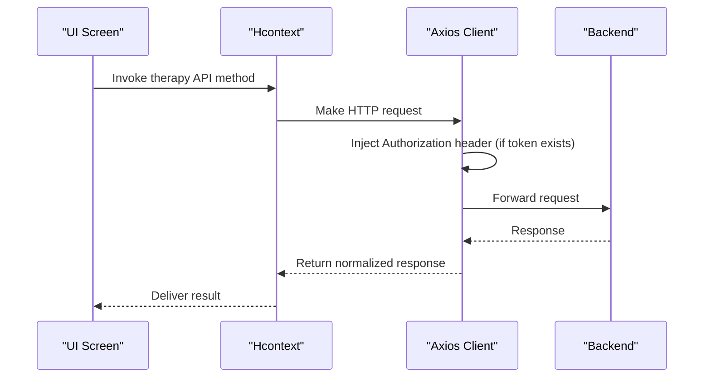

**Diagram sources**
- [apiClient.js:11-44](file://src/context/apiClient.js#L11-L44)
- [Hcontext.js:146-189](file://src/context/Hcontext.js#L146-L189)

**Section sources**
- [apiClient.js:1-58](file://src/context/apiClient.js#L1-L58)
- [Hcontext.js:146-189](file://src/context/Hcontext.js#L146-L189)

### Booking Management APIs
- Availability and Scheduling
  - Fetch therapist availability by date and time slots.
  - Schedule sessions with date, time, therapist ID, and optional coupon.
- Rescheduling and Cancellation
  - Reschedule existing sessions with new date/time.
  - Cancel bookings with reason and penalty clause retrieval.
- Status Validation
  - Join call only during the scheduled time window.
  - Disable actions based on booking status (pending, accepted, completed, cancelled).

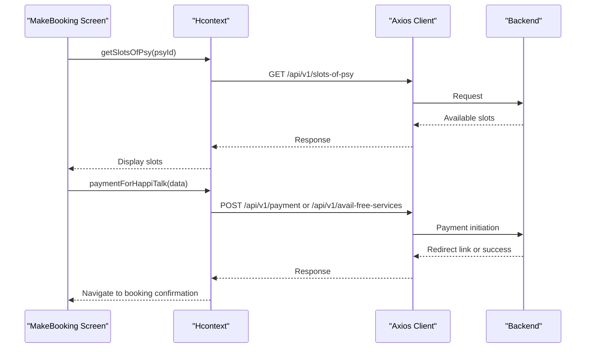

**Diagram sources**
- [MakeBooking.js:234-325](file://src/screens/HappiTALK/MakeBooking.js#L234-L325)
- [Hcontext.js:626-654](file://src/context/Hcontext.js#L626-L654)

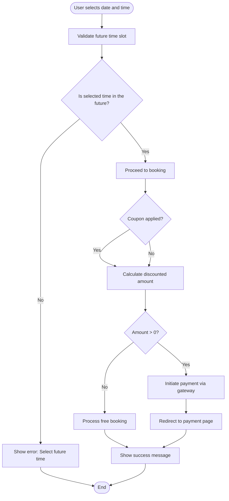

**Diagram sources**
- [MakeBooking.js:494-541](file://src/screens/HappiTALK/MakeBooking.js#L494-L541)
- [MakeBooking.js:159-202](file://src/screens/HappiTALK/MakeBooking.js#L159-L202)
- [MakeBooking.js:259-325](file://src/screens/HappiTALK/MakeBooking.js#L259-L325)

**Section sources**
- [MakeBooking.js:234-325](file://src/screens/HappiTALK/MakeBooking.js#L234-L325)
- [ManageBookings.js:127-153](file://src/screens/HappiTALK/ManageBookings.js#L127-L153)
- [CancelBookingModal.js:50-70](file://src/components/Modals/CancelBookingModal.js#L50-L70)

### Cancellation Workflow
- Retrieve penalty clause based on user type.
- Require cancellation reason before submitting.
- Update booking status and notify user.

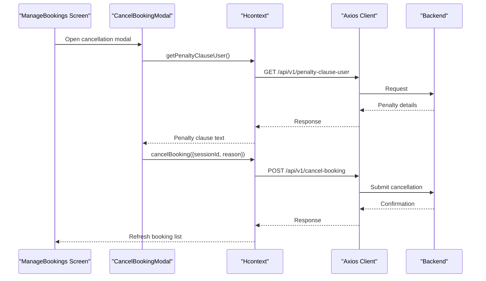

**Diagram sources**
- [ManageBookings.js:127-153](file://src/screens/HappiTALK/ManageBookings.js#L127-L153)
- [CancelBookingModal.js:50-70](file://src/components/Modals/CancelBookingModal.js#L50-L70)
- [Hcontext.js:1-1568](file://src/context/Hcontext.js#L1-L1568)

**Section sources**
- [ManageBookings.js:127-153](file://src/screens/HappiTALK/ManageBookings.js#L127-L153)
- [CancelBookingModal.js:50-70](file://src/components/Modals/CancelBookingModal.js#L50-L70)

### Video Call Initiation and Real-Time Communication
- Permission handling for camera and microphone.
- Room access token retrieval and connection to Twilio Video.
- Local and remote participant views with controls for mute, flip camera, and video toggle.

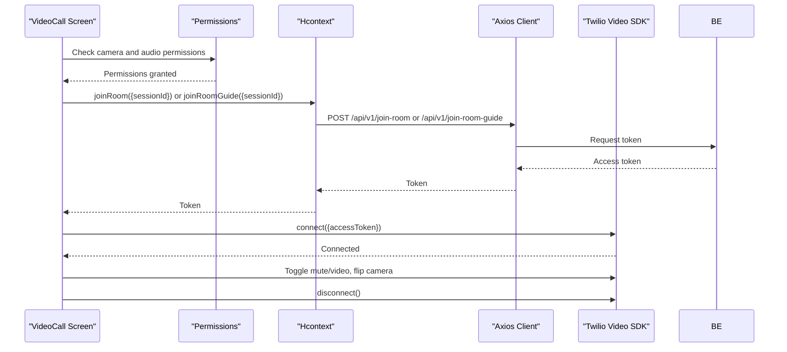

**Diagram sources**
- [VideoCall.js:105-127](file://src/screens/HappiTALK/VideoCall.js#L105-L127)
- [VideoCall.js:130-201](file://src/screens/HappiTALK/VideoCall.js#L130-L201)
- [Hcontext.js:1-1568](file://src/context/Hcontext.js#L1-L1568)

**Section sources**
- [VideoCall.js:105-127](file://src/screens/HappiTALK/VideoCall.js#L105-L127)
- [VideoCall.js:130-201](file://src/screens/HappiTALK/VideoCall.js#L130-L201)

### Payment Processing Integrations
- Plan selection and coupon application.
- Payment initiation with gateway redirection.
- Handling zero-amount bookings for free services.

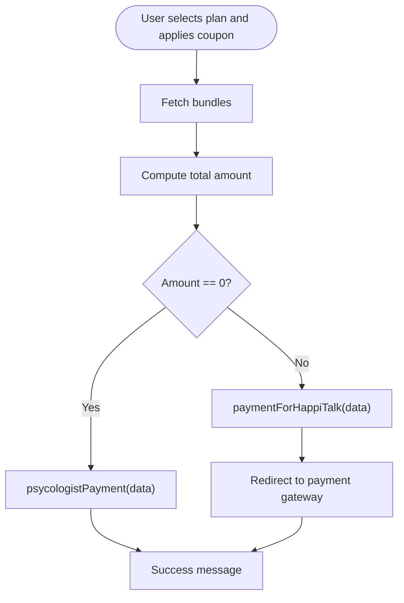

**Diagram sources**
- [MakeBooking.js:205-231](file://src/screens/HappiTALK/MakeBooking.js#L205-L231)
- [MakeBooking.js:159-202](file://src/screens/HappiTALK/MakeBooking.js#L159-L202)
- [MakeBooking.js:259-325](file://src/screens/HappiTALK/MakeBooking.js#L259-L325)

**Section sources**
- [MakeBooking.js:205-231](file://src/screens/HappiTALK/MakeBooking.js#L205-L231)
- [MakeBooking.js:159-202](file://src/screens/HappiTALK/MakeBooking.js#L159-L202)
- [MakeBooking.js:259-325](file://src/screens/HappiTALK/MakeBooking.js#L259-L325)

### Session Management Systems
- Booking status transitions: pending, accepted, rejected, completed, cancelled.
- Join call validation against scheduled time window.
- Rescheduling and cancellation actions disabled based on status.

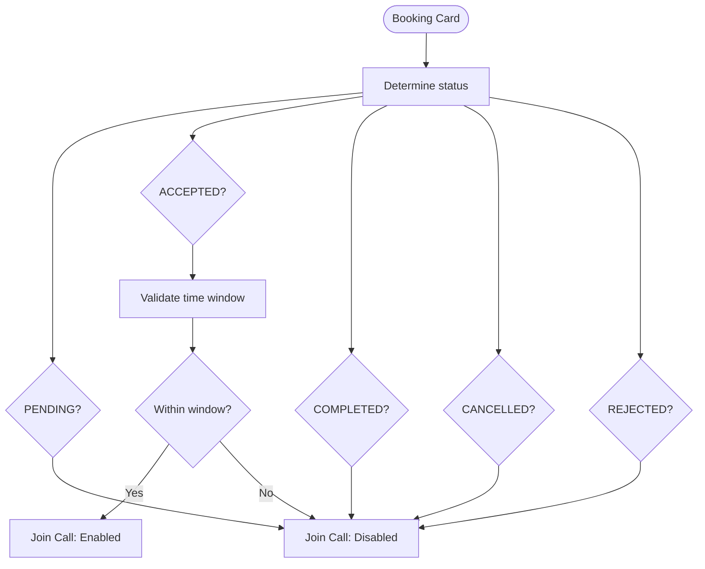

**Diagram sources**
- [ManageBookings.js:105-125](file://src/screens/HappiTALK/ManageBookings.js#L105-L125)
- [ManageBookings.js:317-327](file://src/screens/HappiTALK/ManageBookings.js#L317-L327)

**Section sources**
- [ManageBookings.js:105-125](file://src/screens/HappiTALK/ManageBookings.js#L105-L125)
- [ManageBookings.js:317-327](file://src/screens/HappiTALK/ManageBookings.js#L317-L327)

### Credit System APIs
- Retrieve session credits and booking details.
- Display available credits and manage balances.

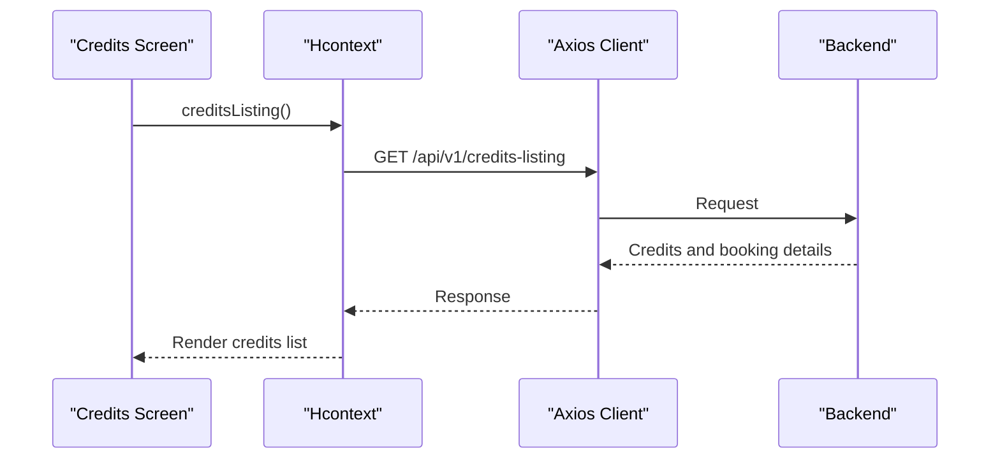

**Diagram sources**
- [Credits.js:42-54](file://src/screens/HappiTALK/Credits.js#L42-L54)
- [Hcontext.js:1-1568](file://src/context/Hcontext.js#L1-L1568)

**Section sources**
- [Credits.js:42-54](file://src/screens/HappiTALK/Credits.js#L42-L54)

### Session Feedback Collection Mechanisms
- Post-session feedback submission with emoji rating and comments.
- Module-specific endpoints for therapy and guide sessions.

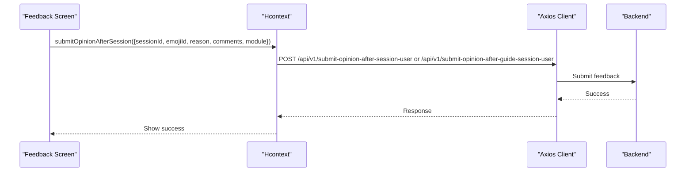

**Diagram sources**
- [Hcontext.js:773-792](file://src/context/Hcontext.js#L773-L792)

**Section sources**
- [Hcontext.js:773-792](file://src/context/Hcontext.js#L773-L792)

### Analytics Endpoints
- NativeNotify Analytics integration for tracking user engagement and session attendance.
- Configuration includes URLs and app credentials.

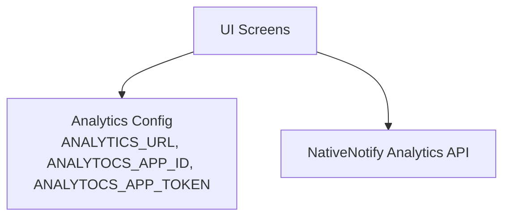

**Diagram sources**
- [config.js:8-12](file://src/config/index.js#L8-L12)

**Section sources**
- [config.js:8-12](file://src/config/index.js#L8-L12)

## Dependency Analysis
- UI Screens depend on the Hcontext provider for API methods and state.
- Hcontext depends on the Axios client for HTTP requests.
- Axios client depends on the configuration for base URL and timeouts.
- Real-time communication relies on the Twilio Video SDK and backend room endpoints.

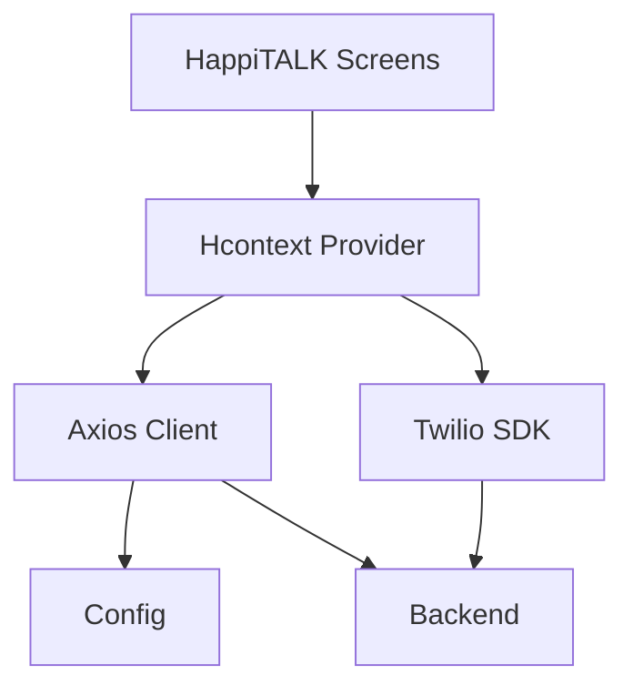

**Diagram sources**
- [Hcontext.js:1-1568](file://src/context/Hcontext.js#L1-L1568)
- [apiClient.js:1-58](file://src/context/apiClient.js#L1-L58)
- [config.js:1-13](file://src/config/index.js#L1-L13)
- [VideoCall.js:17-21](file://src/screens/HappiTALK/VideoCall.js#L17-L21)

**Section sources**
- [Hcontext.js:1-1568](file://src/context/Hcontext.js#L1-L1568)
- [apiClient.js:1-58](file://src/context/apiClient.js#L1-L58)
- [config.js:1-13](file://src/config/index.js#L1-L13)
- [VideoCall.js:17-21](file://src/screens/HappiTALK/VideoCall.js#L17-L21)

## Performance Considerations
- Network timeouts are configured at the Axios client level to prevent hanging requests.
- Token caching reduces repeated storage reads and improves responsiveness.
- Conditional UI updates and disabled states prevent invalid operations and reduce unnecessary API calls.
- Real-time video calls should handle permission prompts efficiently to minimize connection delays.

## Troubleshooting Guide
- Authentication failures: Ensure the bearer token is present in global state or AsyncStorage. Check interceptor logs for missing tokens.
- Payment errors: Validate coupon applicability and amount calculation. Confirm gateway redirection and plan selection.
- Booking validation: Verify future time slot selection and status transitions. Use snack notifications for user feedback.
- Video call issues: Confirm camera and microphone permissions are granted. Check room token retrieval and connection callbacks.

**Section sources**
- [apiClient.js:11-44](file://src/context/apiClient.js#L11-L44)
- [MakeBooking.js:494-541](file://src/screens/HappiTALK/MakeBooking.js#L494-L541)
- [ManageBookings.js:127-153](file://src/screens/HappiTALK/ManageBookings.js#L127-L153)
- [VideoCall.js:105-127](file://src/screens/HappiTALK/VideoCall.js#L105-L127)

## Conclusion
The HappiTALK therapy service integrates booking, payment, real-time communication, and feedback collection through a well-structured context provider and Axios client. The documented endpoints and flows provide a clear blueprint for implementing and extending therapy session management capabilities while maintaining consistent authentication, validation, and user experience.