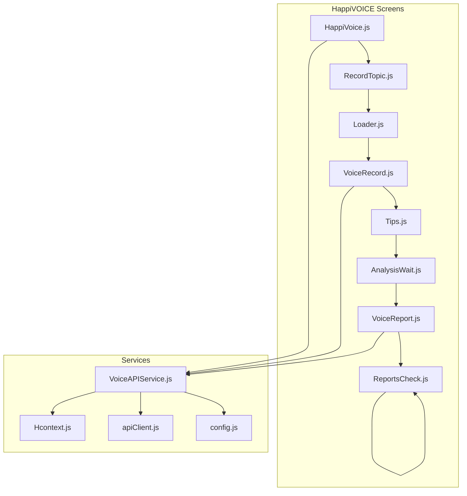
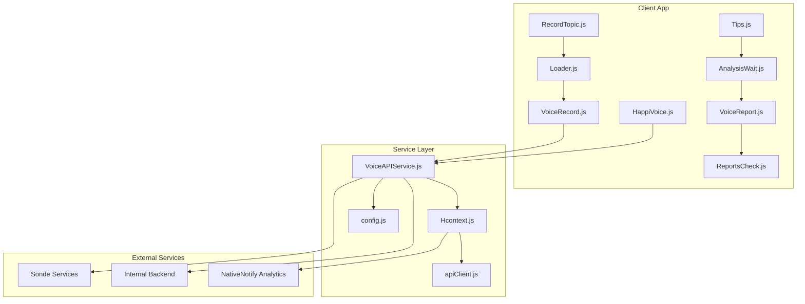
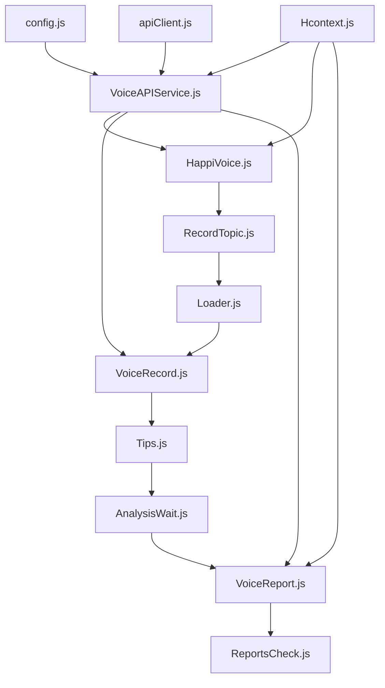

# HappiVOICE Voice Analysis API

<cite>
**Referenced Files in This Document**
- [VoiceAPIService.js](file://src/screens/HappiVOICE/VoiceAPIService.js)
- [HappiVoice.js](file://src/screens/HappiVOICE/HappiVoice.js)
- [VoiceRecord.js](file://src/screens/HappiVOICE/VoiceRecord.js)
- [RecordTopic.js](file://src/screens/HappiVOICE/RecordTopic.js)
- [Loader.js](file://src/screens/HappiVOICE/Loader.js)
- [AnalysisWait.js](file://src/screens/HappiVOICE/AnalysisWait.js)
- [Tips.js](file://src/screens/HappiVOICE/Tips.js)
- [VoiceReport.js](file://src/screens/HappiVOICE/VoiceReport.js)
- [ReportsCheck.js](file://src/screens/HappiVOICE/ReportsCheck.js)
- [Hcontext.js](file://src/context/Hcontext.js)
- [apiClient.js](file://src/context/apiClient.js)
- [config.js](file://src/config/index.js)
</cite>

## Table of Contents
1. [Introduction](#introduction)
2. [Project Structure](#project-structure)
3. [Core Components](#core-components)
4. [Architecture Overview](#architecture-overview)
5. [Detailed Component Analysis](#detailed-component-analysis)
6. [Dependency Analysis](#dependency-analysis)
7. [Performance Considerations](#performance-considerations)
8. [Troubleshooting Guide](#troubleshooting-guide)
9. [Conclusion](#conclusion)

## Introduction
This document provides comprehensive API documentation for the HappiVOICE voice analysis service. It covers the voice recording upload workflow, audio processing via external voice analysis services, asynchronous result retrieval, report generation, and analytics integration. It also documents authentication requirements, audio validation rules, processing queue management, real-time status updates, and result interpretation endpoints.

## Project Structure
The HappiVOICE feature is implemented as a React Native module under src/screens/HappiVOICE. It integrates with:
- Authentication and user profile services via Hcontext
- External voice analysis via Sonde Services
- Localized UI flows for recording, waiting, and reporting

**Diagram sources**
- [HappiVoice.js:19-179](file://src/screens/HappiVOICE/HappiVoice.js#L19-L179)
- [RecordTopic.js:21-163](file://src/screens/HappiVOICE/RecordTopic.js#L21-L163)
- [Loader.js:24-99](file://src/screens/HappiVOICE/Loader.js#L24-L99)
- [VoiceRecord.js:20-198](file://src/screens/HappiVOICE/VoiceRecord.js#L20-L198)
- [Tips.js:15-74](file://src/screens/HappiVOICE/Tips.js#L15-L74)
- [AnalysisWait.js:17-70](file://src/screens/HappiVOICE/AnalysisWait.js#L17-L70)
- [VoiceReport.js:27-246](file://src/screens/HappiVOICE/VoiceReport.js#L27-L246)
- [ReportsCheck.js:14-282](file://src/screens/HappiVOICE/ReportsCheck.js#L14-L282)
- [VoiceAPIService.js:11-264](file://src/screens/HappiVOICE/VoiceAPIService.js#L11-L264)
- [Hcontext.js:26-800](file://src/context/Hcontext.js#L26-L800)
- [apiClient.js:1-58](file://src/context/apiClient.js#L1-L58)
- [config.js:1-13](file://src/config/index.js#L1-L13)

**Section sources**
- [HappiVoice.js:19-179](file://src/screens/HappiVOICE/HappiVoice.js#L19-L179)
- [VoiceAPIService.js:11-264](file://src/screens/HappiVOICE/VoiceAPIService.js#L11-L264)
- [Hcontext.js:26-800](file://src/context/Hcontext.js#L26-L800)
- [apiClient.js:1-58](file://src/context/apiClient.js#L1-L58)
- [config.js:1-13](file://src/config/index.js#L1-L13)

## Core Components
- VoiceAPIService: Orchestrates authentication, user identification, signed URL generation, audio upload, inference initiation, and report retrieval.
- HappiVoice: Entry point for voice assessment; manages subscription checks and navigation to topic selection.
- RecordTopic: Presents prompts and captures user-selected topic.
- Loader: Provides pre-recording countdown.
- VoiceRecord: Handles audio recording, binary conversion, upload, and inference initiation.
- Tips: Displays tips during analysis wait.
- AnalysisWait: Manages wait timer before report retrieval.
- VoiceReport: Retrieves analysis results, saves locally, and navigates to reports.
- ReportsCheck: Renders detailed feature scores and interpretations.
- Hcontext: Centralizes authentication, user profile, analytics, and state for HappiVOICE.
- apiClient: Axios wrapper with automatic bearer token injection.
- config: Base URLs for internal and external services.

**Section sources**
- [VoiceAPIService.js:11-264](file://src/screens/HappiVOICE/VoiceAPIService.js#L11-L264)
- [HappiVoice.js:19-179](file://src/screens/HappiVOICE/HappiVoice.js#L19-L179)
- [RecordTopic.js:21-163](file://src/screens/HappiVOICE/RecordTopic.js#L21-L163)
- [Loader.js:24-99](file://src/screens/HappiVOICE/Loader.js#L24-L99)
- [VoiceRecord.js:20-198](file://src/screens/HappiVOICE/VoiceRecord.js#L20-L198)
- [Tips.js:15-74](file://src/screens/HappiVOICE/Tips.js#L15-L74)
- [AnalysisWait.js:17-70](file://src/screens/HappiVOICE/AnalysisWait.js#L17-L70)
- [VoiceReport.js:27-246](file://src/screens/HappiVOICE/VoiceReport.js#L27-L246)
- [ReportsCheck.js:14-282](file://src/screens/HappiVOICE/ReportsCheck.js#L14-L282)
- [Hcontext.js:26-800](file://src/context/Hcontext.js#L26-L800)
- [apiClient.js:1-58](file://src/context/apiClient.js#L1-L58)
- [config.js:1-13](file://src/config/index.js#L1-L13)

## Architecture Overview
The HappiVOICE workflow integrates local UI flows with external voice analysis services and internal backend endpoints. Authentication is handled via bearer tokens for internal endpoints and OAuth2 for external services.

```mermaid
sequenceDiagram
participant User as "User"
participant HV as "HappiVoice.js"
participant APIService as "VoiceAPIService.js"
participant Sonde as "Sonde Services"
participant Internal as "Internal Backend"
User->>HV : "Start Assessment"
HV->>APIService : "getAccessToken()"
APIService->>Sonde : "POST /platform/v1/oauth2/token"
Sonde-->>APIService : "access_token"
HV->>APIService : "getUserIdentifier(userData, yob, token)"
APIService->>Sonde : "POST /platform/v2/users"
Sonde-->>APIService : "userIdentifier"
HV->>APIService : "getSignedURL(token, identifier, userData)"
APIService->>Sonde : "POST /platform/v1/storage/files"
Sonde-->>APIService : "signedURL, filePath"
HV->>User : "Navigate to RecordTopic"
User->>User : "Select topic and start recording"
User->>APIService : "uploadAudio(signedURL, blob)"
APIService->>Sonde : "PUT audio file"
Sonde-->>APIService : "OK"
APIService->>Sonde : "POST /platform/async/v1/inference/voice-feature-scores"
Sonde-->>APIService : "jobId"
User->>User : "Tips and AnalysisWait"
User->>APIService : "getReport(token, jobId)"
APIService->>Sonde : "GET /platform/async/v1/inference/voice-feature-scores/{jobId}"
Sonde-->>APIService : "report"
APIService->>Internal : "POST /api/v1/score"
Internal-->>APIService : "status"
User->>User : "Navigate to ReportsCheck"
```

**Diagram sources**
- [HappiVoice.js:115-165](file://src/screens/HappiVOICE/HappiVoice.js#L115-L165)
- [VoiceAPIService.js:26-50](file://src/screens/HappiVOICE/VoiceAPIService.js#L26-L50)
- [VoiceAPIService.js:52-88](file://src/screens/HappiVOICE/VoiceAPIService.js#L52-L88)
- [VoiceAPIService.js:89-126](file://src/screens/HappiVOICE/VoiceAPIService.js#L89-L126)
- [VoiceAPIService.js:129-151](file://src/screens/HappiVOICE/VoiceAPIService.js#L129-L151)
- [VoiceAPIService.js:154-185](file://src/screens/HappiVOICE/VoiceAPIService.js#L154-L185)
- [VoiceAPIService.js:187-201](file://src/screens/HappiVOICE/VoiceAPIService.js#L187-L201)
- [VoiceAPIService.js:204-259](file://src/screens/HappiVOICE/VoiceAPIService.js#L204-L259)

## Detailed Component Analysis

### Authentication and Access Control
- Internal authentication: The apiClient injects a Bearer token for internal endpoints. Tokens are sourced from global state or AsyncStorage.
- External authentication: OAuth2 client credentials grant is used to obtain an access token for Sonde Services.
- User identity: A user identifier is created on Sonde Services using demographic and device metadata.

Key behaviors:
- Bearer token injection for internal endpoints.
- OAuth2 token acquisition with predefined client credentials.
- User profile and verification status used to gate downstream flows.

**Section sources**
- [apiClient.js:12-44](file://src/context/apiClient.js#L12-L44)
- [VoiceAPIService.js:26-50](file://src/screens/HappiVOICE/VoiceAPIService.js#L26-L50)
- [VoiceAPIService.js:52-88](file://src/screens/HappiVOICE/VoiceAPIService.js#L52-L88)
- [HappiVoice.js:59-80](file://src/screens/HappiVOICE/HappiVoice.js#L59-L80)

### Voice Recording Upload Workflow
- Topic selection: Users choose a standardized prompt or enter a custom topic.
- Pre-recording loader: Countdown before recording begins.
- Recording: Audio recorded with specific codec and sample rate, saved to device.
- Binary conversion: WAV file converted to Blob for upload.
- Signed URL: Presigned URL generated for secure upload to storage.
- Upload: PUT request uploads the Blob to the signed URL.
- Inference initiation: POST to Sonde Services starts asynchronous voice feature scoring.

Validation rules observed:
- Audio format: WAV.
- Sampling configuration: sampleRate, channels, bitsPerSample, audioSource.
- Device metadata included in user identifier creation.

**Section sources**
- [RecordTopic.js:21-163](file://src/screens/HappiVOICE/RecordTopic.js#L21-L163)
- [Loader.js:24-99](file://src/screens/HappiVOICE/Loader.js#L24-L99)
- [VoiceRecord.js:55-102](file://src/screens/HappiVOICE/VoiceRecord.js#L55-L102)
- [VoiceAPIService.js:89-126](file://src/screens/HappiVOICE/VoiceAPIService.js#L89-L126)
- [VoiceAPIService.js:129-151](file://src/screens/HappiVOICE/VoiceAPIService.js#L129-L151)
- [VoiceAPIService.js:154-185](file://src/screens/HappiVOICE/VoiceAPIService.js#L154-L185)

### Audio Processing and Queue Management
- Asynchronous processing: Inference job is initiated and polled until completion.
- Job status polling: GET request to Sonde Services using jobId.
- Wait state: Tips and AnalysisWait screens provide user feedback during processing.
- Result availability: Once DONE, report is retrieved and saved internally.

Processing characteristics:
- Async inference endpoint with jobId.
- Status polling with fixed intervals.
- Conditional navigation based on verification and subscription status.

**Section sources**
- [VoiceAPIService.js:154-185](file://src/screens/HappiVOICE/VoiceAPIService.js#L154-L185)
- [VoiceAPIService.js:187-201](file://src/screens/HappiVOICE/VoiceAPIService.js#L187-L201)
- [Tips.js:15-74](file://src/screens/HappiVOICE/Tips.js#L15-L74)
- [AnalysisWait.js:17-70](file://src/screens/HappiVOICE/AnalysisWait.js#L17-L70)
- [VoiceReport.js:117-155](file://src/screens/HappiVOICE/VoiceReport.js#L117-L155)

### Report Generation and Interpretation
- Report retrieval: GET by jobId returns structured inference results.
- Local saving: POST to internal /api/v1/score persists normalized scores and features.
- UI rendering: ReportsCheck displays overall score, date, and per-feature metrics with thresholds.
- Navigation gating: Subscription and verification status determine next steps.

Interpretation logic:
- Overall result classification based on score thresholds.
- Feature-specific ranges indicate healthy vs. needs attention.

**Section sources**
- [VoiceAPIService.js:187-201](file://src/screens/HappiVOICE/VoiceAPIService.js#L187-L201)
- [VoiceAPIService.js:204-259](file://src/screens/HappiVOICE/VoiceAPIService.js#L204-L259)
- [ReportsCheck.js:14-282](file://src/screens/HappiVOICE/ReportsCheck.js#L14-L282)
- [VoiceReport.js:117-155](file://src/screens/HappiVOICE/VoiceReport.js#L117-L155)

### Analytics Integration
- Screen traffic analytics: NativeNotify analytics endpoint is called with screenName.
- Usage tracking: Analytics invoked on key screen transitions.

**Section sources**
- [Hcontext.js:1321-1334](file://src/context/Hcontext.js#L1321-L1334)

### API Endpoints Summary

- Internal endpoints (BASE_URL):
  - POST /api/v1/login
  - POST /api/v1/login-with-code
  - GET /api/v1/logout
  - GET /api/v1/get-profile
  - POST /api/v1/start-assessment
  - POST /api/v1/checkifany
  - POST /api/v1/save-option
  - GET /api/v1/get-report
  - GET /api/v1/get-all-report
  - GET /api/v1/language-list
  - POST /api/v1/assign-psychologist
  - POST /api/v1/switch-language-while-chat
  - GET /api/v1/psy-whom-user-currently-chatting
  - POST /api/v1/send-message-by-user-to-psy
  - POST /api/v1/clear-message-batch-of-user
  - POST /api/v1/happi-learn-content
  - POST /api/v1/happi-learn-content-by-id
  - POST /api/v1/like-happi-learn-post
  - POST /api/v1/unlike-happi-learn-post
  - GET /api/v1/buy-plan
  - POST /api/v1/payment
  - GET /api/v1/my-subscribed-services
  - POST /api/v1/apply-coupon
  - POST /api/v1/send-verification-otp
  - GET /api/v1/emoji-list
  - POST /api/v1/submit-rating
  - POST /api/v1/raise-query-app
  - POST /api/v1/feedback
  - POST /api/v1/submit-opinion-after-session-user
  - POST /api/v1/submit-opinion-after-guide-session-user
  - GET /api/v1/notification-list
  - POST /api/v1/get-user-report-by-psy
  - GET /api/v1/total-reward-points-user
  - GET /api/v1/my-referral-code
  - POST /api/v1/get-user-report-by-psy
  - POST /api/v1/avail-happiguide-user
  - POST /api/v1/score

- External endpoints (SONDE_URL):
  - POST /platform/v1/oauth2/token
  - POST /platform/v2/users
  - POST /platform/v1/storage/files
  - PUT {signedURL}
  - POST /platform/async/v1/inference/voice-feature-scores
  - GET /platform/async/v1/inference/voice-feature-scores/{jobId}

Authentication:
- Internal: Bearer token injected automatically for authenticated endpoints.
- External: OAuth2 client_credentials grant; Authorization header with Basic auth.

**Section sources**
- [apiClient.js:12-44](file://src/context/apiClient.js#L12-L44)
- [VoiceAPIService.js:26-50](file://src/screens/HappiVOICE/VoiceAPIService.js#L26-L50)
- [VoiceAPIService.js:52-88](file://src/screens/HappiVOICE/VoiceAPIService.js#L52-L88)
- [VoiceAPIService.js:89-126](file://src/screens/HappiVOICE/VoiceAPIService.js#L89-L126)
- [VoiceAPIService.js:129-151](file://src/screens/HappiVOICE/VoiceAPIService.js#L129-L151)
- [VoiceAPIService.js:154-185](file://src/screens/HappiVOICE/VoiceAPIService.js#L154-L185)
- [VoiceAPIService.js:187-201](file://src/screens/HappiVOICE/VoiceAPIService.js#L187-L201)
- [VoiceAPIService.js:204-259](file://src/screens/HappiVOICE/VoiceAPIService.js#L204-L259)
- [config.js:1-13](file://src/config/index.js#L1-L13)

## Architecture Overview

**Diagram sources**
- [HappiVoice.js:19-179](file://src/screens/HappiVOICE/HappiVoice.js#L19-L179)
- [VoiceAPIService.js:11-264](file://src/screens/HappiVOICE/VoiceAPIService.js#L11-L264)
- [Hcontext.js:26-800](file://src/context/Hcontext.js#L26-L800)
- [apiClient.js:1-58](file://src/context/apiClient.js#L1-L58)
- [config.js:1-13](file://src/config/index.js#L1-L13)

## Detailed Component Analysis

### VoiceAPIService.js
Responsibilities:
- OAuth2 token acquisition for Sonde Services.
- User identity creation on Sonde Services.
- Signed URL generation for secure audio upload.
- Audio upload via presigned URL.
- Initiation of asynchronous voice feature scoring.
- Polling for job completion and retrieval of results.
- Saving normalized report to internal backend.

Key functions and flows:
- getAccessToken: OAuth2 client_credentials grant.
- getUserIdentifier: Creates user on Sonde with demographics and device info.
- getSignedURL: Requests presigned URL and file metadata.
- uploadAudio: PUTs WAV Blob to signed URL.
- getScoreInference: Starts async inference job.
- getReport: Polls for job completion.
- saveReport: Posts normalized results to internal /api/v1/score.

**Section sources**
- [VoiceAPIService.js:26-50](file://src/screens/HappiVOICE/VoiceAPIService.js#L26-L50)
- [VoiceAPIService.js:52-88](file://src/screens/HappiVOICE/VoiceAPIService.js#L52-L88)
- [VoiceAPIService.js:89-126](file://src/screens/HappiVOICE/VoiceAPIService.js#L89-L126)
- [VoiceAPIService.js:129-151](file://src/screens/HappiVOICE/VoiceAPIService.js#L129-L151)
- [VoiceAPIService.js:154-185](file://src/screens/HappiVOICE/VoiceAPIService.js#L154-L185)
- [VoiceAPIService.js:187-201](file://src/screens/HappiVOICE/VoiceAPIService.js#L187-L201)
- [VoiceAPIService.js:204-259](file://src/screens/HappiVOICE/VoiceAPIService.js#L204-L259)

### HappiVoice.js
Responsibilities:
- Validates user authentication and verification status.
- Initiates OAuth2 flow and user identity creation.
- Generates signed URL and navigates to topic selection.

Integration points:
- getAccessToken, getUserIdentifier, getSignedURL, getTopics.

**Section sources**
- [HappiVoice.js:115-165](file://src/screens/HappiVOICE/HappiVoice.js#L115-L165)

### VoiceRecord.js
Responsibilities:
- Manages recording lifecycle (permissions, start, stop).
- Converts recorded file to Blob and uploads to storage.
- Initiates inference and navigates to tips/wait/report screens.

**Section sources**
- [VoiceRecord.js:55-102](file://src/screens/HappiVOICE/VoiceRecord.js#L55-L102)
- [VoiceRecord.js:104-127](file://src/screens/HappiVOICE/VoiceRecord.js#L104-L127)

### VoiceReport.js
Responsibilities:
- Retrieves final report after async processing.
- Saves normalized report to internal backend.
- Enforces subscription and verification checks before proceeding.

**Section sources**
- [VoiceReport.js:117-155](file://src/screens/HappiVOICE/VoiceReport.js#L117-L155)

### ReportsCheck.js
Responsibilities:
- Renders overall score and per-feature metrics.
- Highlights ranges indicating health status.

**Section sources**
- [ReportsCheck.js:14-282](file://src/screens/HappiVOICE/ReportsCheck.js#L14-L282)

### Hcontext.js
Responsibilities:
- Authentication state management and API wrappers.
- Analytics integration for screen traffic.
- Subscription and profile checks used to gate flows.

**Section sources**
- [Hcontext.js:1321-1334](file://src/context/Hcontext.js#L1321-L1334)

### apiClient.js
Responsibilities:
- Automatic bearer token injection for internal endpoints.
- Unified request/response handling.

**Section sources**
- [apiClient.js:12-44](file://src/context/apiClient.js#L12-L44)

### config.js
Responsibilities:
- Defines base URLs for internal and external services.

**Section sources**
- [config.js:1-13](file://src/config/index.js#L1-L13)

## Dependency Analysis

**Diagram sources**
- [config.js:1-13](file://src/config/index.js#L1-L13)
- [apiClient.js:1-58](file://src/context/apiClient.js#L1-L58)
- [Hcontext.js:26-800](file://src/context/Hcontext.js#L26-L800)
- [VoiceAPIService.js:11-264](file://src/screens/HappiVOICE/VoiceAPIService.js#L11-L264)
- [HappiVoice.js:19-179](file://src/screens/HappiVOICE/HappiVoice.js#L19-L179)
- [RecordTopic.js:21-163](file://src/screens/HappiVOICE/RecordTopic.js#L21-L163)
- [Loader.js:24-99](file://src/screens/HappiVOICE/Loader.js#L24-L99)
- [VoiceRecord.js:20-198](file://src/screens/HappiVOICE/VoiceRecord.js#L20-L198)
- [Tips.js:15-74](file://src/screens/HappiVOICE/Tips.js#L15-L74)
- [AnalysisWait.js:17-70](file://src/screens/HappiVOICE/AnalysisWait.js#L17-L70)
- [VoiceReport.js:27-246](file://src/screens/HappiVOICE/VoiceReport.js#L27-L246)
- [ReportsCheck.js:14-282](file://src/screens/HappiVOICE/ReportsCheck.js#L14-L282)

**Section sources**
- [config.js:1-13](file://src/config/index.js#L1-L13)
- [apiClient.js:1-58](file://src/context/apiClient.js#L1-L58)
- [Hcontext.js:26-800](file://src/context/Hcontext.js#L26-L800)
- [VoiceAPIService.js:11-264](file://src/screens/HappiVOICE/VoiceAPIService.js#L11-L264)
- [HappiVoice.js:19-179](file://src/screens/HappiVOICE/HappiVoice.js#L19-L179)
- [RecordTopic.js:21-163](file://src/screens/HappiVOICE/RecordTopic.js#L21-L163)
- [Loader.js:24-99](file://src/screens/HappiVOICE/Loader.js#L24-L99)
- [VoiceRecord.js:20-198](file://src/screens/HappiVOICE/VoiceRecord.js#L20-L198)
- [Tips.js:15-74](file://src/screens/HappiVOICE/Tips.js#L15-L74)
- [AnalysisWait.js:17-70](file://src/screens/HappiVOICE/AnalysisWait.js#L17-L70)
- [VoiceReport.js:27-246](file://src/screens/HappiVOICE/VoiceReport.js#L27-L246)
- [ReportsCheck.js:14-282](file://src/screens/HappiVOICE/ReportsCheck.js#L14-L282)

## Performance Considerations
- Asynchronous processing: Inference jobs are long-running; avoid blocking UI threads.
- Network timeouts: apiClient sets a 15-second timeout for internal requests.
- Audio upload: Ensure Blob conversion is efficient; consider chunked uploads for large files.
- Polling intervals: Keep polling intervals reasonable to balance responsiveness and cost.
- Analytics calls: Batch or throttle analytics events to reduce overhead.

[No sources needed since this section provides general guidance]

## Troubleshooting Guide
Common issues and resolutions:
- Authentication failures:
  - Verify bearer token presence for internal endpoints.
  - Confirm OAuth2 client credentials and scopes for external endpoints.
- Audio upload errors:
  - Ensure signed URL validity and correct Content-Type.
  - Validate WAV format and sampling configuration.
- Inference polling:
  - Confirm jobId is present and accessible.
  - Handle transient network errors with retries.
- Report retrieval:
  - Check status field for DONE before attempting to parse results.
- Analytics:
  - Ensure analytics endpoint is reachable and screenName is provided.

**Section sources**
- [apiClient.js:12-44](file://src/context/apiClient.js#L12-L44)
- [VoiceAPIService.js:129-151](file://src/screens/HappiVOICE/VoiceAPIService.js#L129-L151)
- [VoiceAPIService.js:187-201](file://src/screens/HappiVOICE/VoiceAPIService.js#L187-L201)
- [VoiceReport.js:117-155](file://src/screens/HappiVOICE/VoiceReport.js#L117-L155)

## Conclusion
The HappiVOICE voice analysis service integrates seamlessly with Sonde Services for asynchronous audio processing and with internal backend endpoints for user-centric reporting. The modular UI ensures a smooth user experience from authentication to result interpretation, while robust authentication and analytics integrations support operational insights and compliance.