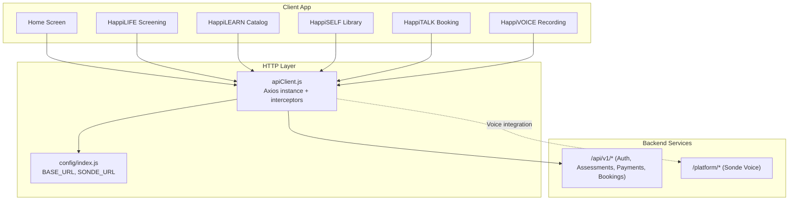
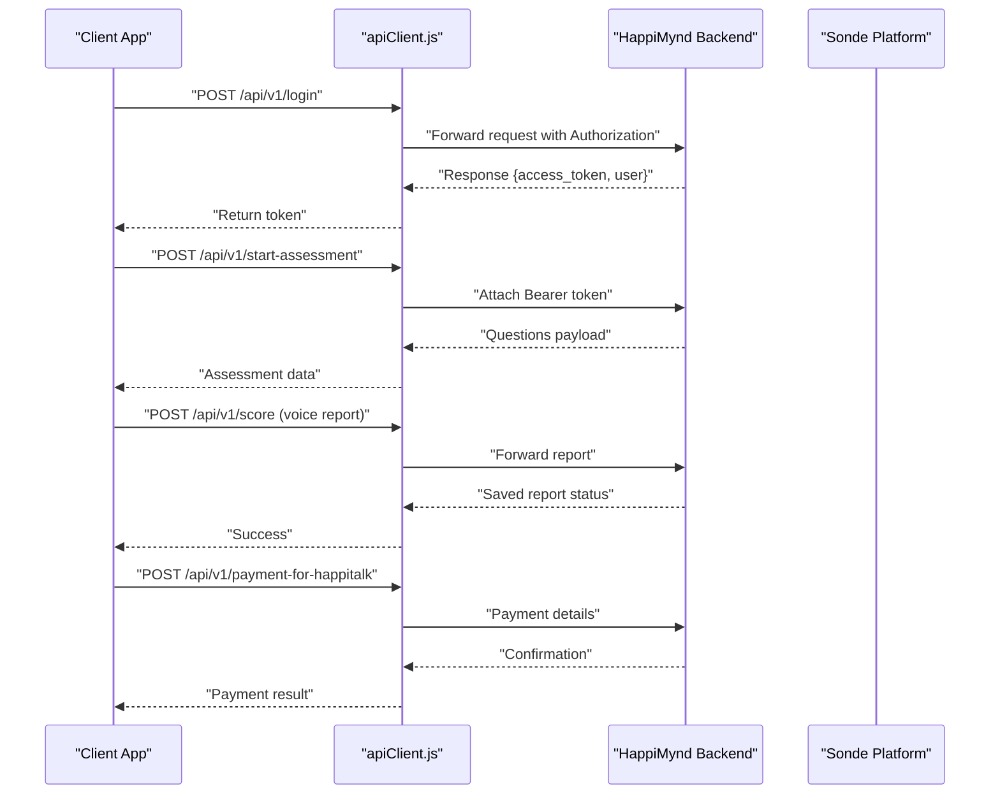
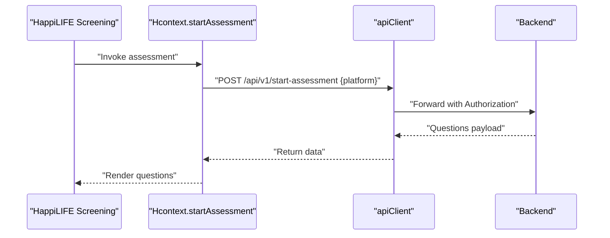
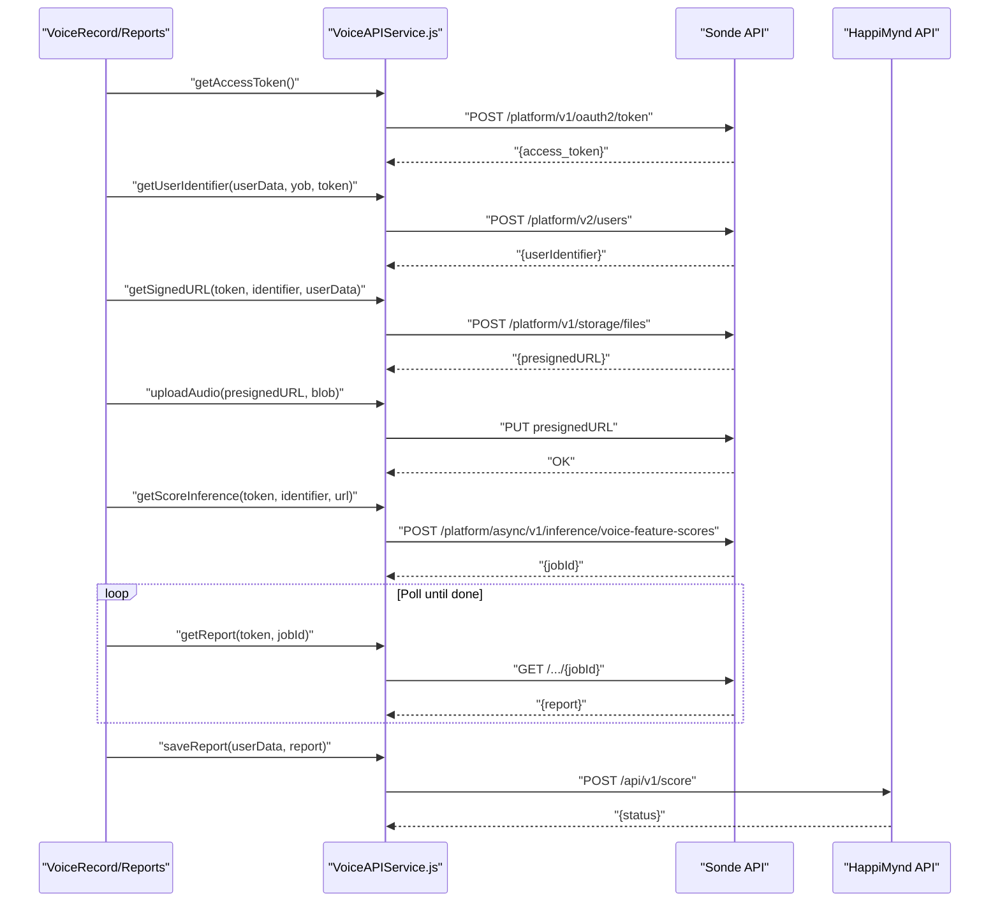
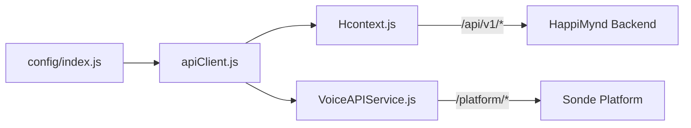

# Service Modules API

<cite>
**Referenced Files in This Document**
- [apiClient.js](file://src/context/apiClient.js)
- [Hcontext.js](file://src/context/Hcontext.js)
- [VoiceAPIService.js](file://src/screens/HappiVOICE/VoiceAPIService.js)
- [HappiLIFEScreening.js](file://src/screens/HappiLIFE/HappiLIFEScreening.js)
- [HappiLEARN.js](file://src/screens/HappiLEARN/HappiLEARN.js)
- [HappiLEARNDescription.js](file://src/screens/HappiLEARN/HappiLEARNDescription.js)
- [HappiSELF.js](file://src/screens/HappiSELF/HappiSELF.js)
- [HappiTALK.js](file://src/screens/HappiTALK/HappiTALK.js)
- [HappiTALKBook.js](file://src/screens/HappiTALK/HappiTALKBook.js)
- [VoiceRecord.js](file://src/screens/HappiVOICE/VoiceRecord.js)
- [VoiceReport.js](file://src/screens/HappiVOICE/VoiceReport.js)
- [index.js](file://src/config/index.js)
- [test_endpoints.js](file://test_endpoints.js)
</cite>

## Table of Contents
1. [Introduction](#introduction)
2. [Project Structure](#project-structure)
3. [Core Components](#core-components)
4. [Architecture Overview](#architecture-overview)
5. [Detailed Component Analysis](#detailed-component-analysis)
6. [Dependency Analysis](#dependency-analysis)
7. [Performance Considerations](#performance-considerations)
8. [Troubleshooting Guide](#troubleshooting-guide)
9. [Conclusion](#conclusion)
10. [Appendices](#appendices)

## Introduction
This document provides comprehensive API documentation for HappiMynd’s service modules: HappiLIFE screening, HappiLEARN education, HappiSELF self-help, HappiTALK therapy, and HappiVOICE voice analysis. It covers authentication, request validation, response formatting, and integration patterns across modules to enable seamless user experiences. The documentation focuses on the endpoints used by the client application and how they interact with backend services.

## Project Structure
The API surface is primarily exposed via a shared HTTP client and context hooks that encapsulate service-specific operations. Authentication tokens are injected automatically into outgoing requests. Some endpoints integrate with external services (e.g., voice analysis via Sonde).

**Diagram sources**
- [apiClient.js:1-58](file://src/context/apiClient.js#L1-L58)
- [index.js:1-13](file://src/config/index.js#L1-L13)

**Section sources**
- [apiClient.js:1-58](file://src/context/apiClient.js#L1-L58)
- [index.js:1-13](file://src/config/index.js#L1-L13)

## Core Components
- Shared HTTP client with automatic bearer token injection and standardized error handling.
- Context hooks that expose typed operations for each service module.
- Voice analysis service integration with Sonde platform.

Key responsibilities:
- Authentication and authorization via Bearer token.
- Centralized request/response logging and error propagation.
- Module-specific CRUD operations for assessments, content, bookings, and voice reports.

**Section sources**
- [apiClient.js:11-56](file://src/context/apiClient.js#L11-L56)
- [Hcontext.js:129-202](file://src/context/Hcontext.js#L129-L202)

## Architecture Overview
The client integrates with two primary API surfaces:
- HappiMynd backend under /api/v1/.
- Sonde Voice platform under /platform/ for voice feature scoring.

**Diagram sources**
- [apiClient.js:11-56](file://src/context/apiClient.js#L11-L56)
- [Hcontext.js:1143-1255](file://src/context/Hcontext.js#L1143-L1255)
- [VoiceAPIService.js:26-50](file://src/screens/HappiVOICE/VoiceAPIService.js#L26-L50)

## Detailed Component Analysis

### Authentication and Authorization
- Automatic bearer token injection from global state or persisted storage.
- Standardized error handling logs and normalized error responses.

Endpoints:
- POST /api/v1/login
- POST /api/v1/login-with-code
- GET /api/v1/logout
- POST /api/v1/guardian-verification
- POST /api/v1/verify-guardian-otp

Validation rules:
- Username/password must be present for login.
- Device token must be included in login requests.
- Code-based login requires a valid code.

Response formatting:
- Successful responses include user and access token.
- Errors return structured messages.

**Section sources**
- [apiClient.js:11-56](file://src/context/apiClient.js#L11-L56)
- [Hcontext.js:129-202](file://src/context/Hcontext.js#L129-L202)
- [test_endpoints.js:10-11](file://test_endpoints.js#L10-L11)

### HappiLIFE Screening (Assessment)
Purpose:
- Present screening questionnaires and manage assessment lifecycle.

Endpoints:
- POST /api/v1/start-assessment
- POST /api/v1/mood-emoji-list (used by chat bot)
- GET /api/v1/any-assessment (check completion)

Request validation:
- Platform parameter required for start-assessment.
- Pagination and filters handled by backend.

Response formatting:
- Assessment payload includes questions array with metadata.
- Completion detection via message field.

Integration pattern:
- Screen loads questions, renders cards, and navigates to results upon completion.

**Diagram sources**
- [HappiLIFEScreening.js:120-151](file://src/screens/HappiLIFE/HappiLIFEScreening.js#L120-L151)
- [Hcontext.js:129-202](file://src/context/Hcontext.js#L129-L202)

**Section sources**
- [HappiLIFEScreening.js:120-151](file://src/screens/HappiLIFE/HappiLIFEScreening.js#L120-L151)
- [Hcontext.js:129-202](file://src/context/Hcontext.js#L129-L202)
- [test_endpoints.js:7](file://test_endpoints.js#L7)

### HappiLEARN Education (Content Catalog)
Purpose:
- Browse and consume curated self-help content.

Endpoints:
- GET /api/v1/happi-learn-list
- POST /api/v1/happi-learn-content-by-id
- POST /api/v1/like-happi-learn-post
- POST /api/v1/unlike-happi-learn-post
- GET /api/v1/buy-plan
- POST /api/v1/payment
- POST /api/v1/avail-free-services

Request validation:
- Content ID required for content-by-id.
- Like/Unlike requires content ID.

Response formatting:
- Lists include paginated data and recently viewed items.
- Payment endpoints return confirmation objects.

Integration pattern:
- Screen fetches lists on focus, supports search and navigation to content.

**Section sources**
- [Hcontext.js:563-624](file://src/context/Hcontext.js#L563-L624)
- [HappiLEARN.js:97-115](file://src/screens/HappiLEARN/HappiLEARN.js#L97-L115)
- [HappiLEARNDescription.js:42-70](file://src/screens/HappiLEARN/HappiLEARNDescription.js#L42-L70)

### HappiSELF Self-Help (Tasks and Notes)
Purpose:
- Engage with interactive tasks, track progress, and manage notes.

Endpoints:
- GET /api/v1/happiself-library-list
- POST /api/v1/happiself-library-content
- POST /api/v1/save-happiself-content-answer
- GET /api/v1/happiself-get-notes-list
- POST /api/v1/happiself-add-notes
- POST /api/v1/happiself-update-notes
- POST /api/v1/happiself-delete-notes-by-id
- POST /api/v1/start-sub-course
- POST /api/v1/end-sub-course

Request validation:
- Content ID required for saving answers.
- Note operations require IDs for update/delete.

Response formatting:
- Library content returns structured tasks.
- Answers saved with content ID and answer payload.

Integration pattern:
- Tasks rendered in sequence; answers persisted per task.

**Section sources**
- [Hcontext.js:1011-1054](file://src/context/Hcontext.js#L1011-L1054)
- [Hcontext.js:1042-1054](file://src/context/Hcontext.js#L1042-L1054)
- [HappiSELF.js:44-70](file://src/screens/HappiSELF/HappiSELF.js#L44-L70)

### HappiTALK Therapy (Booking Management)
Purpose:
- Discover psychologists, manage bookings, and handle payments.

Endpoints:
- POST /api/v1/psychologist-listing
- POST /api/v1/my-booking-user
- POST /api/v1/get-slots-of-psy
- POST /api/v1/payment-for-happitalk
- POST /api/v1/cancel-booking-user
- GET /api/v1/list-to-book-another-session-user
- POST /api/v1/book-another-session-user
- POST /api/v1/reschedule-booking-user
- POST /api/v1/join-talk-room-user
- POST /api/v1/avail-haapitalk-user

Request validation:
- Psychologist ID and plan ID required for payment.
- Date/time must be provided for rescheduling/bookings.
- Recording permission flag supported.

Response formatting:
- Listings return filtered profiles and availability.
- Payments return confirmation objects.

Integration pattern:
- Users select a psychologist, choose slots, pay, and manage sessions.

**Section sources**
- [Hcontext.js:1104-1255](file://src/context/Hcontext.js#L1104-L1255)
- [HappiTALK.js:1-47](file://src/screens/HappiTALK/HappiTALK.js#L1-L47)
- [HappiTALKBook.js:1-40](file://src/screens/HappiTALK/HappiTALKBook.js#L1-L40)

### HappiVOICE Voice Analysis
Purpose:
- Capture voice samples, compute acoustic features, and persist reports.

External integration:
- Sonde OAuth token acquisition.
- User identifier creation.
- Signed URL generation for uploads.
- Asynchronous inference and report polling.

Endpoints:
- POST /platform/v1/oauth2/token (Sonde)
- POST /platform/v2/users (Sonde)
- POST /platform/v1/storage/files (Sonde)
- PUT presigned URL (Sonde)
- POST /platform/async/v1/inference/voice-feature-scores (Sonde)
- GET /platform/async/v1/inference/voice-feature-scores/{jobId} (Sonde)
- POST /api/v1/score (HappiMynd)

Request validation:
- OAuth requires grant_type and scope.
- User profile includes year of birth, gender, language, device info.
- Upload requires correct content-type.

Response formatting:
- Reports include aggregated scores and feature metrics.
- Job-based polling returns completion status.

**Diagram sources**
- [VoiceAPIService.js:26-50](file://src/screens/HappiVOICE/VoiceAPIService.js#L26-L50)
- [VoiceAPIService.js:52-88](file://src/screens/HappiVOICE/VoiceAPIService.js#L52-L88)
- [VoiceAPIService.js:89-126](file://src/screens/HappiVOICE/VoiceAPIService.js#L89-L126)
- [VoiceAPIService.js:129-151](file://src/screens/HappiVOICE/VoiceAPIService.js#L129-L151)
- [VoiceAPIService.js:154-201](file://src/screens/HappiVOICE/VoiceAPIService.js#L154-L201)
- [VoiceAPIService.js:204-259](file://src/screens/HappiVOICE/VoiceAPIService.js#L204-L259)

**Section sources**
- [VoiceAPIService.js:26-50](file://src/screens/HappiVOICE/VoiceAPIService.js#L26-L50)
- [VoiceAPIService.js:52-88](file://src/screens/HappiVOICE/VoiceAPIService.js#L52-L88)
- [VoiceAPIService.js:89-126](file://src/screens/HappiVOICE/VoiceAPIService.js#L89-L126)
- [VoiceAPIService.js:129-151](file://src/screens/HappiVOICE/VoiceAPIService.js#L129-L151)
- [VoiceAPIService.js:154-201](file://src/screens/HappiVOICE/VoiceAPIService.js#L154-L201)
- [VoiceAPIService.js:204-259](file://src/screens/HappiVOICE/VoiceAPIService.js#L204-L259)

## Dependency Analysis
- apiClient.js depends on config for base URLs and injects tokens from global state or AsyncStorage.
- Hcontext.js aggregates all module endpoints behind typed functions, ensuring consistent request shapes.
- VoiceAPIService.js orchestrates Sonde integration independently of Hcontext.

**Diagram sources**
- [index.js:1-13](file://src/config/index.js#L1-L13)
- [apiClient.js:1-58](file://src/context/apiClient.js#L1-L58)
- [Hcontext.js:1-200](file://src/context/Hcontext.js#L1-L200)
- [VoiceAPIService.js:1-264](file://src/screens/HappiVOICE/VoiceAPIService.js#L1-L264)

**Section sources**
- [index.js:1-13](file://src/config/index.js#L1-L13)
- [apiClient.js:1-58](file://src/context/apiClient.js#L1-L58)
- [Hcontext.js:1-200](file://src/context/Hcontext.js#L1-L200)
- [VoiceAPIService.js:1-264](file://src/screens/HappiVOICE/VoiceAPIService.js#L1-L264)

## Performance Considerations
- Timeout configured at 15 seconds for apiClient to prevent hanging requests.
- Prefer batched operations where possible (e.g., fetching lists and recent items in one call).
- Debounce search inputs for content catalogs.
- Cache tokens in memory after initial retrieval to reduce AsyncStorage reads.

[No sources needed since this section provides general guidance]

## Troubleshooting Guide
Common issues and resolutions:
- Missing Authorization header: Ensure global auth token or persisted token is available before invoking protected endpoints.
- Network timeouts: Reduce payload sizes or split requests; verify backend availability.
- Voice upload failures: Confirm presigned URL validity and content-type; retry upload on transient errors.
- Booking conflicts: Validate slot availability before payment; handle concurrent updates.

Operational checks:
- Use test runner to validate endpoints and capture token for subsequent authenticated calls.

**Section sources**
- [apiClient.js:11-56](file://src/context/apiClient.js#L11-L56)
- [test_endpoints.js:13-46](file://test_endpoints.js#L13-L46)

## Conclusion
The HappiMynd client leverages a centralized HTTP client and context-driven service hooks to deliver a cohesive set of APIs across HappiLIFE, HappiLEARN, HappiSELF, HappiTALK, and HappiVOICE. Authentication is standardized, and integration with external services (Sonde) is encapsulated for reliability. The documented endpoints and patterns enable consistent development and maintenance of mental health services.

[No sources needed since this section summarizes without analyzing specific files]

## Appendices

### Endpoint Reference Index
- Authentication
  - POST /api/v1/login
  - POST /api/v1/login-with-code
  - GET /api/v1/logout
  - POST /api/v1/guardian-verification
  - POST /api/v1/verify-guardian-otp
- HappiLIFE Screening
  - POST /api/v1/start-assessment
  - GET /api/v1/mood-emoji-list
  - GET /api/v1/any-assessment
- HappiLEARN
  - GET /api/v1/happi-learn-list
  - POST /api/v1/happi-learn-content-by-id
  - POST /api/v1/like-happi-learn-post
  - POST /api/v1/unlike-happi-learn-post
  - GET /api/v1/buy-plan
  - POST /api/v1/payment
  - POST /api/v1/avail-free-services
- HappiSELF
  - GET /api/v1/happiself-library-list
  - POST /api/v1/happiself-library-content
  - POST /api/v1/save-happiself-content-answer
  - GET /api/v1/happiself-get-notes-list
  - POST /api/v1/happiself-add-notes
  - POST /api/v1/happiself-update-notes
  - POST /api/v1/happiself-delete-notes-by-id
  - POST /api/v1/start-sub-course
  - POST /api/v1/end-sub-course
- HappiTALK
  - POST /api/v1/psychologist-listing
  - POST /api/v1/my-booking-user
  - POST /api/v1/get-slots-of-psy
  - POST /api/v1/payment-for-happitalk
  - POST /api/v1/cancel-booking-user
  - GET /api/v1/list-to-book-another-session-user
  - POST /api/v1/book-another-session-user
  - POST /api/v1/reschedule-booking-user
  - POST /api/v1/join-talk-room-user
  - POST /api/v1/avail-haapitalk-user
- HappiVOICE (Sonde)
  - POST /platform/v1/oauth2/token
  - POST /platform/v2/users
  - POST /platform/v1/storage/files
  - PUT presigned URL
  - POST /platform/async/v1/inference/voice-feature-scores
  - GET /platform/async/v1/inference/voice-feature-scores/{jobId}
  - POST /api/v1/score

**Section sources**
- [Hcontext.js:563-624](file://src/context/Hcontext.js#L563-L624)
- [Hcontext.js:1011-1054](file://src/context/Hcontext.js#L1011-L1054)
- [Hcontext.js:1104-1255](file://src/context/Hcontext.js#L1104-L1255)
- [VoiceAPIService.js:26-50](file://src/screens/HappiVOICE/VoiceAPIService.js#L26-L50)
- [VoiceAPIService.js:154-201](file://src/screens/HappiVOICE/VoiceAPIService.js#L154-L201)