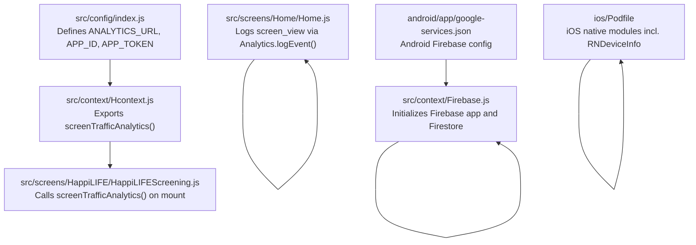
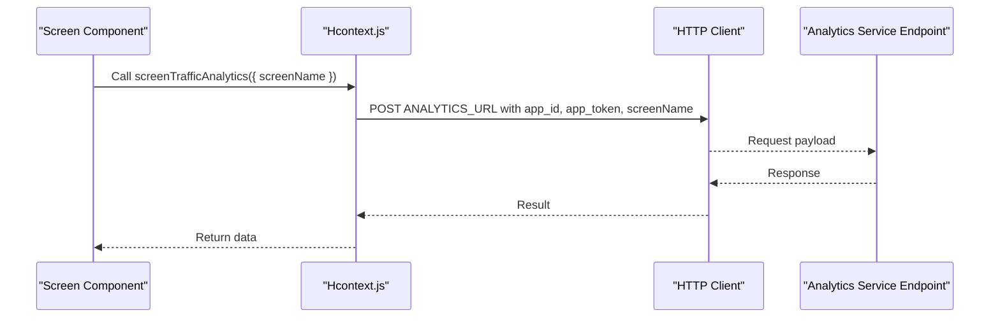
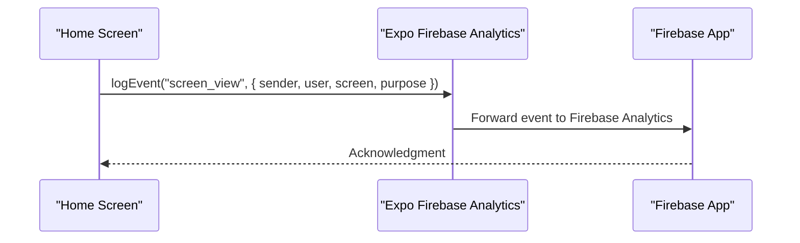
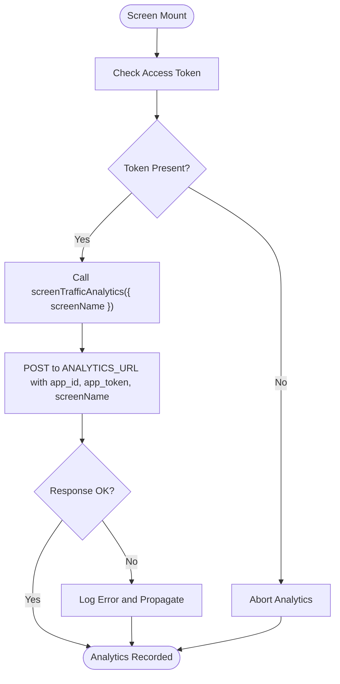
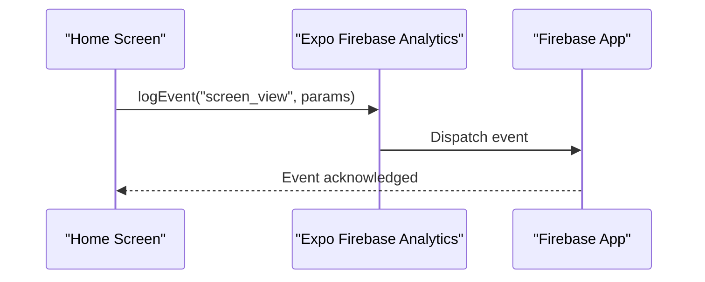
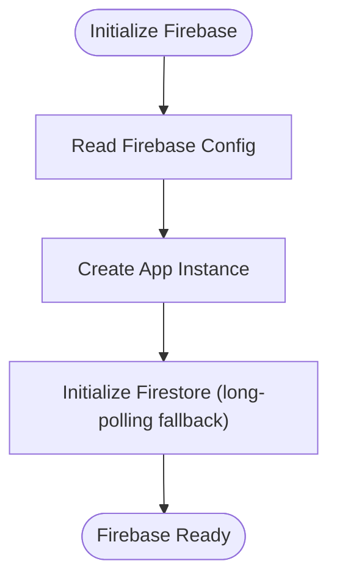
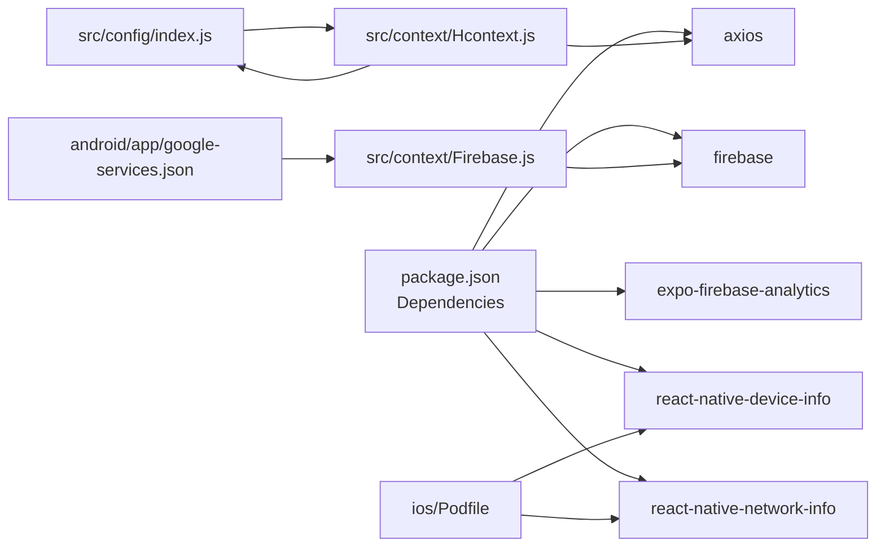

# Analytics and Tracking Services

<cite>
**Referenced Files in This Document**
- [package.json](file://package.json)
- [src/config/index.js](file://src/config/index.js)
- [src/context/Hcontext.js](file://src/context/Hcontext.js)
- [src/context/Firebase.js](file://src/context/Firebase.js)
- [android/app/google-services.json](file://android/app/google-services.json)
- [ios/Podfile](file://ios/Podfile)
- [src/screens/Home/Home.js](file://src/screens/Home/Home.js)
- [src/screens/HappiLIFE/HappiLIFEScreening.js](file://src/screens/HappiLIFE/HappiLIFEScreening.js)
- [src/utils/Util.js](file://src/utils/Util.js)
</cite>

## Table of Contents
1. [Introduction](#introduction)
2. [Project Structure](#project-structure)
3. [Core Components](#core-components)
4. [Architecture Overview](#architecture-overview)
5. [Detailed Component Analysis](#detailed-component-analysis)
6. [Dependency Analysis](#dependency-analysis)
7. [Performance Considerations](#performance-considerations)
8. [Troubleshooting Guide](#troubleshooting-guide)
9. [Conclusion](#conclusion)
10. [Appendices](#appendices)

## Introduction
This document describes the analytics and tracking services integrated into the application. It covers:
- Event tracking and user journey mapping via a third-party analytics provider
- Screen view logging and custom event logging
- Initialization and configuration of analytics SDKs
- Data privacy and compliance considerations
- Integration patterns for crash reporting, performance monitoring, and A/B testing
- Strategies for collecting engagement metrics, feature adoption, and service utilization

The implementation integrates:
- A third-party analytics service for screen traffic and custom events
- Firebase for analytics and related services
- Expo Firebase Analytics for native event logging

## Project Structure
The analytics-related code spans configuration, context providers, and screen-level event triggers. Key areas:
- Configuration defines endpoint and credentials for analytics
- Context exposes a method to log screen traffic to the analytics service
- Screens trigger analytics on mount or action
- Firebase is configured for analytics and messaging
- Expo Firebase Analytics is declared as a dependency

**Diagram sources**
- [src/config/index.js:1-13](file://src/config/index.js#L1-L13)
- [src/context/Hcontext.js:1321-1334](file://src/context/Hcontext.js#L1321-L1334)
- [src/screens/Home/Home.js:599-620](file://src/screens/Home/Home.js#L599-L620)
- [src/screens/HappiLIFE/HappiLIFEScreening.js:99-118](file://src/screens/HappiLIFE/HappiLIFEScreening.js#L99-L118)
- [src/context/Firebase.js:14-52](file://src/context/Firebase.js#L14-L52)
- [android/app/google-services.json:1-55](file://android/app/google-services.json#L1-L55)
- [ios/Podfile:74-123](file://ios/Podfile#L74-L123)

**Section sources**
- [src/config/index.js:1-13](file://src/config/index.js#L1-L13)
- [src/context/Hcontext.js:1321-1334](file://src/context/Hcontext.js#L1321-L1334)
- [src/screens/Home/Home.js:599-620](file://src/screens/Home/Home.js#L599-L620)
- [src/screens/HappiLIFE/HappiLIFEScreening.js:99-118](file://src/screens/HappiLIFE/HappiLIFEScreening.js#L99-L118)
- [src/context/Firebase.js:14-52](file://src/context/Firebase.js#L14-L52)
- [android/app/google-services.json:1-55](file://android/app/google-services.json#L1-L55)
- [ios/Podfile:74-123](file://ios/Podfile#L74-L123)

## Core Components
- Analytics configuration and credentials
  - Endpoint and app identifiers are defined centrally for analytics requests.
  - See [src/config/index.js:8-12](file://src/config/index.js#L8-L12).

- Screen traffic analytics
  - A context-provided function posts screenName to the analytics endpoint along with app credentials.
  - See [src/context/Hcontext.js:1321-1334](file://src/context/Hcontext.js#L1321-L1334).

- Native analytics event logging
  - The application logs a screen_view event using the Expo Firebase Analytics module.
  - See [src/screens/Home/Home.js:601](file://src/screens/Home/Home.js#L601).

- Firebase initialization
  - Firebase app and Firestore are initialized with a client configuration.
  - See [src/context/Firebase.js:14-52](file://src/context/Firebase.js#L14-L52).

- Android and iOS integration points
  - Android configuration file for Firebase services.
  - iOS Podfile includes native modules; Firebase-related pods are managed via Expo modules.
  - See [android/app/google-services.json:1-55](file://android/app/google-services.json#L1-L55) and [ios/Podfile:74-123](file://ios/Podfile#L74-L123).

**Section sources**
- [src/config/index.js:8-12](file://src/config/index.js#L8-L12)
- [src/context/Hcontext.js:1321-1334](file://src/context/Hcontext.js#L1321-L1334)
- [src/screens/Home/Home.js:601](file://src/screens/Home/Home.js#L601)
- [src/context/Firebase.js:14-52](file://src/context/Firebase.js#L14-L52)
- [android/app/google-services.json:1-55](file://android/app/google-services.json#L1-L55)
- [ios/Podfile:74-123](file://ios/Podfile#L74-L123)

## Architecture Overview
The analytics architecture combines:
- A third-party analytics service for screen traffic
- Native event logging via Expo Firebase Analytics
- Firebase for backend services and configuration

**Diagram sources**
- [src/context/Hcontext.js:1321-1334](file://src/context/Hcontext.js#L1321-L1334)
- [src/config/index.js:8-12](file://src/config/index.js#L8-L12)

**Diagram sources**
- [src/screens/Home/Home.js:601](file://src/screens/Home/Home.js#L601)
- [src/context/Firebase.js:14-52](file://src/context/Firebase.js#L14-L52)

## Detailed Component Analysis

### Screen Traffic Analytics Integration
- Purpose: Track screen views via a dedicated analytics endpoint.
- Implementation:
  - Centralized configuration supplies endpoint and credentials.
  - Context method posts screenName to the analytics service.
- Usage pattern:
  - Screens invoke the context method during mount or lifecycle events.

**Diagram sources**
- [src/context/Hcontext.js:1321-1334](file://src/context/Hcontext.js#L1321-L1334)
- [src/config/index.js:8-12](file://src/config/index.js#L8-L12)

**Section sources**
- [src/context/Hcontext.js:1321-1334](file://src/context/Hcontext.js#L1321-L1334)
- [src/config/index.js:8-12](file://src/config/index.js#L8-L12)

### Native Event Logging with Expo Firebase Analytics
- Purpose: Log structured events (e.g., screen_view) with custom parameters.
- Implementation:
  - Uses the Expo Firebase Analytics module to log events.
  - Parameters include sender, user identifier, screen name, and purpose.
- Usage pattern:
  - Called from the Home screen after successful authentication.

**Diagram sources**
- [src/screens/Home/Home.js:601](file://src/screens/Home/Home.js#L601)
- [src/context/Firebase.js:14-52](file://src/context/Firebase.js#L14-L52)

**Section sources**
- [src/screens/Home/Home.js:599-620](file://src/screens/Home/Home.js#L599-L620)
- [src/context/Firebase.js:14-52](file://src/context/Firebase.js#L14-L52)

### Firebase Initialization and Configuration
- Purpose: Initialize Firebase app and Firestore for analytics and backend services.
- Implementation:
  - Reads configuration from environment variables or constants.
  - Initializes Firestore with long-polling fallback for React Native environments.
  - Android and iOS configurations are provided via respective config files.

**Diagram sources**
- [src/context/Firebase.js:14-52](file://src/context/Firebase.js#L14-L52)
- [android/app/google-services.json:1-55](file://android/app/google-services.json#L1-L55)
- [ios/Podfile:74-123](file://ios/Podfile#L74-L123)

**Section sources**
- [src/context/Firebase.js:14-52](file://src/context/Firebase.js#L14-L52)
- [android/app/google-services.json:1-55](file://android/app/google-services.json#L1-L55)
- [ios/Podfile:74-123](file://ios/Podfile#L74-L123)

### Crash Reporting, Performance Monitoring, and A/B Testing Patterns
- Crash reporting:
  - Integrate a crash reporting SDK (e.g., Firebase Crashlytics) alongside Firebase Analytics.
  - Ensure SDK initialization occurs early in the app lifecycle.
  - Keep crash reports separate from analytics events to avoid cross-contamination.
- Performance monitoring:
  - Use Firebase Performance Monitoring to track app startup time, network latency, and custom traces.
  - Instrument key user journeys and feature flows.
- A/B testing:
  - Use Firebase Remote Config or A/B Testing SDKs to roll out variants.
  - Tag experiments with unique identifiers and measure outcomes via analytics events.

[No sources needed since this section provides general guidance]

### Data Collection Strategies
- Engagement metrics:
  - Track screen views, time-on-screen, and navigation paths.
  - Use screen_view events with contextual parameters.
- Feature adoption:
  - Log feature-specific events (e.g., course start, assessment completion).
  - Attribute conversions to campaigns or onboarding steps.
- Service utilization:
  - Monitor usage of subscriptions, bookings, and content consumption.
  - Aggregate counts and funnel progression.

[No sources needed since this section provides general guidance]

## Dependency Analysis
- Dependencies relevant to analytics:
  - Expo Firebase Analytics module for native event logging
  - Firebase app and Firestore for backend services
  - HTTP client for third-party analytics service
- External configuration:
  - Android google-services.json
  - iOS Podfile for native modules

**Diagram sources**
- [package.json:13-94](file://package.json#L13-L94)
- [src/config/index.js:8-12](file://src/config/index.js#L8-L12)
- [src/context/Hcontext.js:1321-1334](file://src/context/Hcontext.js#L1321-L1334)
- [src/context/Firebase.js:14-52](file://src/context/Firebase.js#L14-L52)
- [android/app/google-services.json:1-55](file://android/app/google-services.json#L1-L55)
- [ios/Podfile:74-123](file://ios/Podfile#L74-L123)

**Section sources**
- [package.json:13-94](file://package.json#L13-L94)
- [src/config/index.js:8-12](file://src/config/index.js#L8-L12)
- [src/context/Hcontext.js:1321-1334](file://src/context/Hcontext.js#L1321-L1334)
- [src/context/Firebase.js:14-52](file://src/context/Firebase.js#L14-L52)
- [android/app/google-services.json:1-55](file://android/app/google-services.json#L1-L55)
- [ios/Podfile:74-123](file://ios/Podfile#L74-L123)

## Performance Considerations
- Batch or debounce analytics requests to reduce network overhead.
- Avoid logging sensitive data in event parameters.
- Use asynchronous logging to prevent UI jank.
- Cache or queue events when offline; flush on connectivity recovery.

[No sources needed since this section provides general guidance]

## Troubleshooting Guide
- Analytics endpoint errors:
  - Verify ANALYTICS_URL, APP_ID, and APP_TOKEN in configuration.
  - Confirm network connectivity and CORS settings on the analytics service.
  - Inspect returned error messages and propagate them for UI feedback.
  - See [src/context/Hcontext.js:1331-1333](file://src/context/Hcontext.js#L1331-L1333) and [src/config/index.js:8-12](file://src/config/index.js#L8-L12).
- Firebase initialization issues:
  - Ensure the Firebase configuration matches the project settings.
  - Confirm long-polling fallback is applied for Firestore in React Native environments.
  - See [src/context/Firebase.js:42-49](file://src/context/Firebase.js#L42-L49).
- iOS/Android native module conflicts:
  - Review Podfile and Gradle configurations for conflicting native modules.
  - Align versions with Expo-managed dependencies.
  - See [ios/Podfile:74-123](file://ios/Podfile#L74-L123) and [android/app/google-services.json:1-55](file://android/app/google-services.json#L1-L55).

**Section sources**
- [src/context/Hcontext.js:1331-1333](file://src/context/Hcontext.js#L1331-L1333)
- [src/config/index.js:8-12](file://src/config/index.js#L8-L12)
- [src/context/Firebase.js:42-49](file://src/context/Firebase.js#L42-L49)
- [ios/Podfile:74-123](file://ios/Podfile#L74-L123)
- [android/app/google-services.json:1-55](file://android/app/google-services.json#L1-L55)

## Conclusion
The application integrates analytics through:
- A centralized configuration for third-party analytics
- A context-provided method to log screen traffic
- Native event logging via Expo Firebase Analytics
- Firebase initialization for backend services

To strengthen the implementation, consider adding:
- Crash reporting and performance monitoring
- A/B testing and remote config
- Data privacy controls and opt-out mechanisms
- Structured logging for debugging and compliance

[No sources needed since this section summarizes without analyzing specific files]

## Appendices

### Configuration Examples
- Analytics SDK initialization
  - Define ANALYTICS_URL, ANALYTOCS_APP_ID, and ANALYTOCS_APP_TOKEN in configuration.
  - See [src/config/index.js:8-12](file://src/config/index.js#L8-L12).
- Event parameter formatting
  - Use structured parameters (sender, user, screen, purpose) for screen_view events.
  - See [src/screens/Home/Home.js:601](file://src/screens/Home/Home.js#L601).
- Data privacy compliance
  - Anonymize identifiers where possible.
  - Provide user controls to disable analytics and export/delete data.
  - Ensure consent flows align with regional regulations (e.g., GDPR).

[No sources needed since this section provides general guidance]