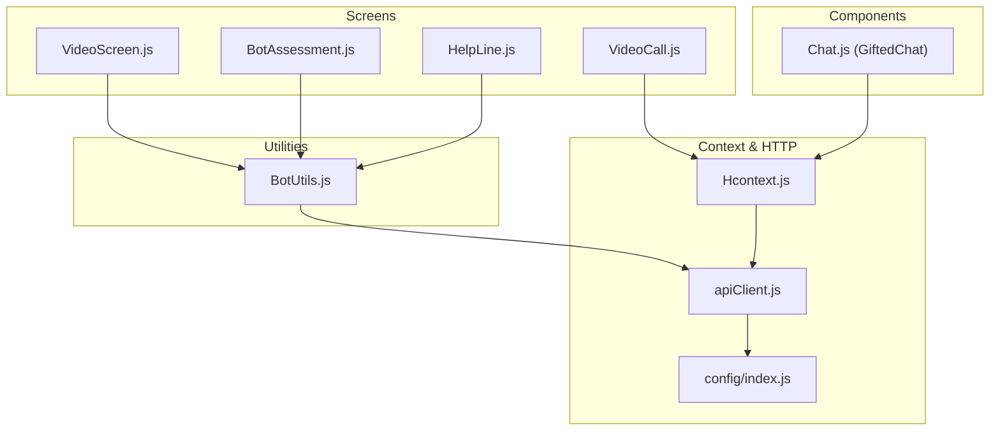
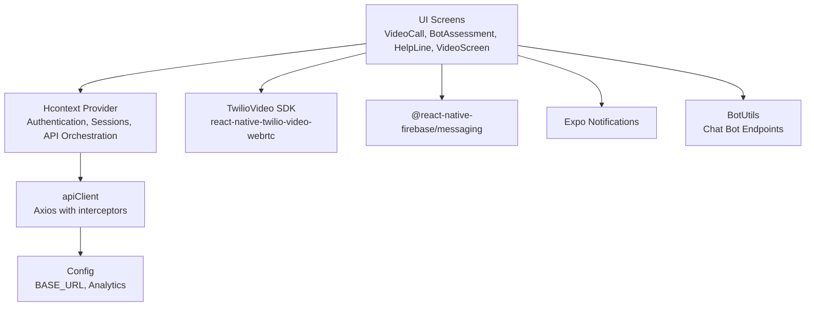
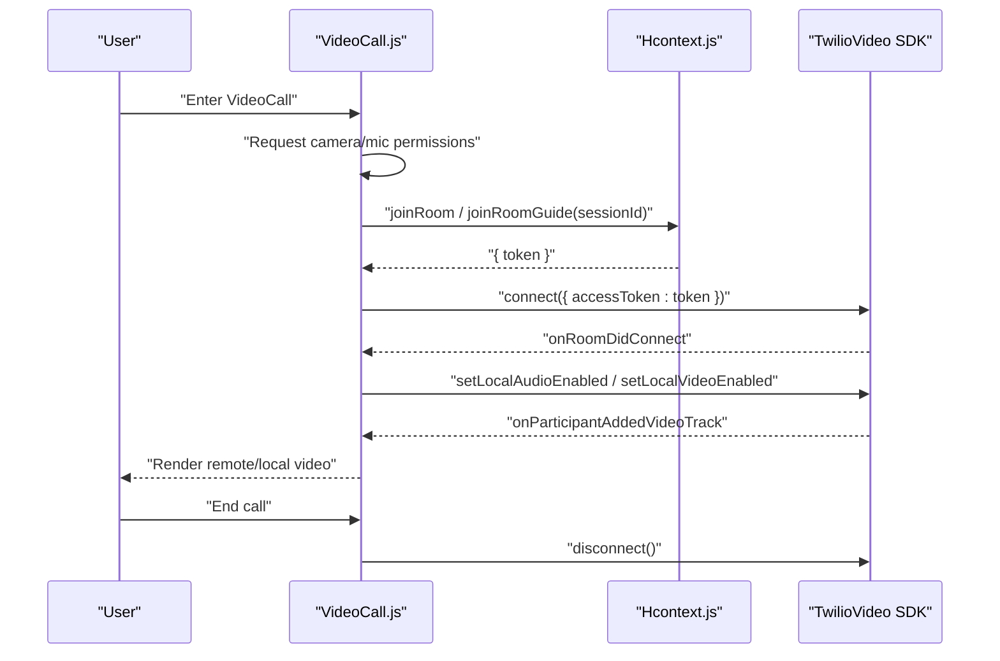
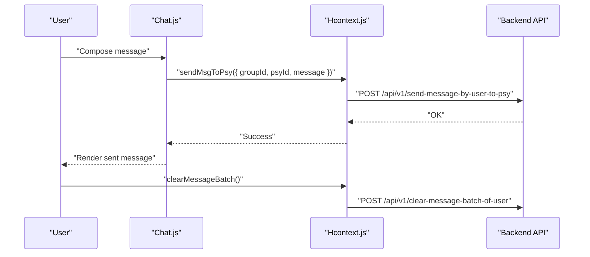
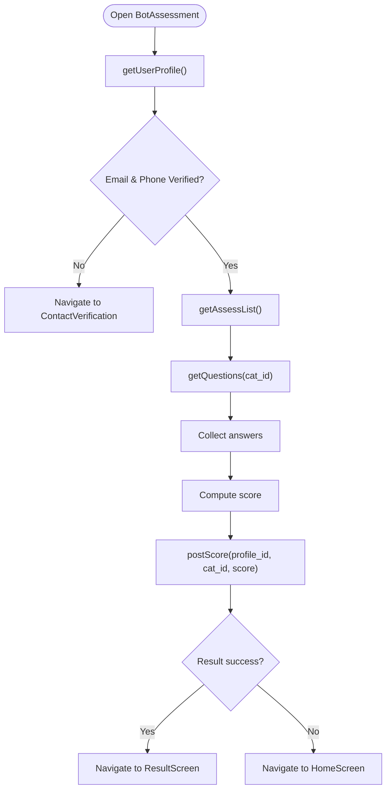
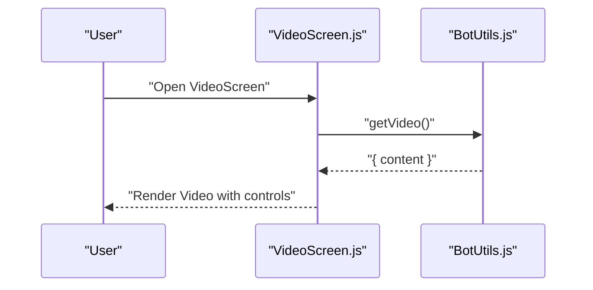
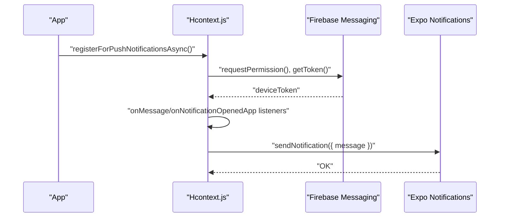
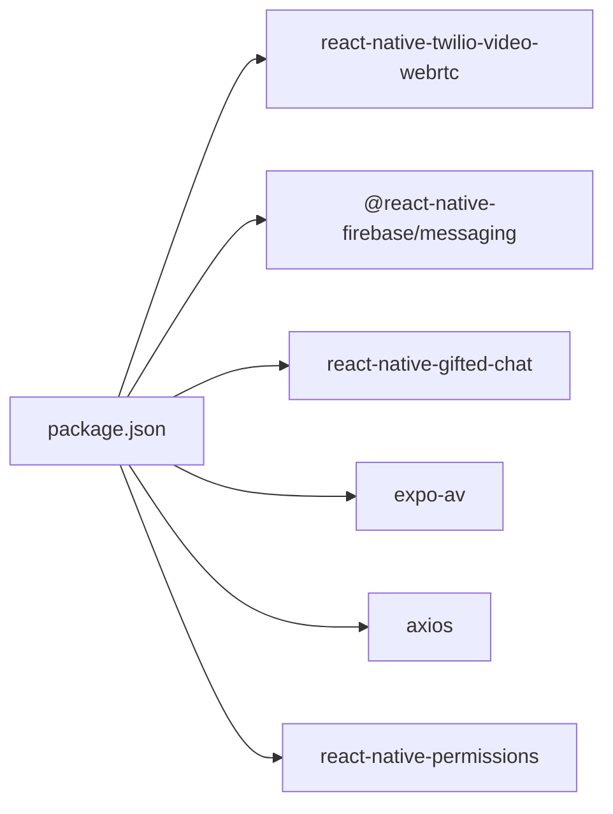

# Communication Platforms API

<cite>
**Referenced Files in This Document**
- [VideoCall.js](file://src/screens/HappiTALK/VideoCall.js)
- [VideoScreen.js](file://src/screens/Chat/VideoScreen.js)
- [BotAssessment.js](file://src/screens/Chat/BotAssessment.js)
- [HelpLine.js](file://src/screens/Chat/HelpLine.js)
- [BotUtils.js](file://src/screens/Chat/BotUtils.js)
- [Chat.js](file://src/components/common/Chat.js)
- [Hcontext.js](file://src/context/Hcontext.js)
- [apiClient.js](file://src/context/apiClient.js)
- [config/index.js](file://src/config/index.js)
- [package.json](file://package.json)
- [app.json](file://app.json)
</cite>

## Table of Contents
1. [Introduction](#introduction)
2. [Project Structure](#project-structure)
3. [Core Components](#core-components)
4. [Architecture Overview](#architecture-overview)
5. [Detailed Component Analysis](#detailed-component-analysis)
6. [Dependency Analysis](#dependency-analysis)
7. [Performance Considerations](#performance-considerations)
8. [Troubleshooting Guide](#troubleshooting-guide)
9. [Security and Compliance](#security-and-compliance)
10. [Conclusion](#conclusion)

## Introduction
This document describes the communication platform integrations implemented in the client application, focusing on:
- Twilio-powered video calling for therapy sessions
- Real-time chat messaging with psychologists
- AI-powered assessment bot for mental health screening
- Media playback for guided breathing exercises
- Push notifications via Expo Notifications
- Authentication and session lifecycle management

It consolidates the integration patterns, API endpoints, signaling and media handling, and security considerations observed in the codebase.

## Project Structure
The communication features are organized across:
- Screens for video calls, bot assessments, and help-line resources
- Utilities for bot APIs and media retrieval
- Shared chat UI components
- Context provider for authentication, session management, and API orchestration
- HTTP client with automatic bearer token injection
- Configuration for base URLs and analytics

**Diagram sources**
- [VideoCall.js:1-431](file://src/screens/HappiTALK/VideoCall.js#L1-L431)
- [VideoScreen.js:1-102](file://src/screens/Chat/VideoScreen.js#L1-L102)
- [BotAssessment.js:1-291](file://src/screens/Chat/BotAssessment.js#L1-L291)
- [HelpLine.js:1-89](file://src/screens/Chat/HelpLine.js#L1-L89)
- [Chat.js:1-139](file://src/components/common/Chat.js#L1-L139)
- [Hcontext.js:1-1558](file://src/context/Hcontext.js#L1-L1558)
- [apiClient.js:1-58](file://src/context/apiClient.js#L1-L58)
- [config/index.js:1-13](file://src/config/index.js#L1-L13)
- [BotUtils.js:1-183](file://src/screens/Chat/BotUtils.js#L1-L183)

**Section sources**
- [VideoCall.js:1-431](file://src/screens/HappiTALK/VideoCall.js#L1-L431)
- [Chat.js:1-139](file://src/components/common/Chat.js#L1-L139)
- [Hcontext.js:1-1558](file://src/context/Hcontext.js#L1-L1558)
- [apiClient.js:1-58](file://src/context/apiClient.js#L1-L58)
- [config/index.js:1-13](file://src/config/index.js#L1-L13)
- [BotUtils.js:1-183](file://src/screens/Chat/BotUtils.js#L1-L183)

## Core Components
- Twilio Video Calling
  - Uses react-native-twilio-video-webrtc to connect to rooms, manage tracks, and control local media.
  - Room access tokens are fetched via Hcontext methods and passed to the Twilio SDK.
- Real-Time Chat
  - GiftedChat-based UI with custom renderers for audio and document attachments.
  - Message sending and batch clearing handled via Hcontext methods.
- Bot-Assessment Workflow
  - Fetches categories, questions, and recommendations; posts scores to LLM-backed backend.
  - Integrates with external LLM service for conversational responses.
- Media Playback
  - Plays guided breathing videos via expo-av.
- Push Notifications
  - Uses @react-native-firebase/messaging and Expo Notifications to receive and display notifications.
- Authentication and Session Lifecycle
  - Centralized via Hcontext with apiClient injecting bearer tokens for authenticated endpoints.

**Section sources**
- [VideoCall.js:1-431](file://src/screens/HappiTALK/VideoCall.js#L1-L431)
- [Chat.js:1-139](file://src/components/common/Chat.js#L1-L139)
- [BotAssessment.js:1-291](file://src/screens/Chat/BotAssessment.js#L1-L291)
- [VideoScreen.js:1-102](file://src/screens/Chat/VideoScreen.js#L1-L102)
- [Hcontext.js:1-1558](file://src/context/Hcontext.js#L1-L1558)
- [apiClient.js:1-58](file://src/context/apiClient.js#L1-L58)

## Architecture Overview
The client integrates multiple communication channels through a unified context layer and HTTP client. The Twilio integration handles signaling and media, while the chat and bot features rely on REST endpoints and push notifications.

**Diagram sources**
- [VideoCall.js:1-431](file://src/screens/HappiTALK/VideoCall.js#L1-L431)
- [Hcontext.js:1-1558](file://src/context/Hcontext.js#L1-L1558)
- [apiClient.js:1-58](file://src/context/apiClient.js#L1-L58)
- [config/index.js:1-13](file://src/config/index.js#L1-L13)
- [BotUtils.js:1-183](file://src/screens/Chat/BotUtils.js#L1-L183)

## Detailed Component Analysis

### Twilio Video Calling Integration
- Room Access and Permissions
  - Requests camera and microphone permissions before joining a room.
  - Chooses between talk and guide room endpoints based on route params.
- Signaling and Media
  - Connects using an access token returned by the backend.
  - Tracks participant video tracks and renders local and remote views.
- Controls
  - Mute/unmute mic, toggle camera, flip camera, and end call.

**Diagram sources**
- [VideoCall.js:104-136](file://src/screens/HappiTALK/VideoCall.js#L104-L136)
- [VideoCall.js:138-159](file://src/screens/HappiTALK/VideoCall.js#L138-L159)
- [VideoCall.js:173-195](file://src/screens/HappiTALK/VideoCall.js#L173-L195)
- [Hcontext.js:1086-1109](file://src/context/Hcontext.js#L1086-L1109)

**Section sources**
- [VideoCall.js:1-431](file://src/screens/HappiTALK/VideoCall.js#L1-L431)
- [Hcontext.js:1086-1109](file://src/context/Hcontext.js#L1086-L1109)

### Real-Time Chat Messaging
- UI
  - GiftedChat with custom bubbles and time rendering.
  - Supports audio and document attachments via specialized cards.
- Backend Integration
  - Sends messages to psychologists and clears message batches.
  - Uses Hcontext methods for authenticated requests.

**Diagram sources**
- [Chat.js:1-139](file://src/components/common/Chat.js#L1-L139)
- [Hcontext.js:529-552](file://src/context/Hcontext.js#L529-L552)

**Section sources**
- [Chat.js:1-139](file://src/components/common/Chat.js#L1-L139)
- [Hcontext.js:529-552](file://src/context/Hcontext.js#L529-L552)

### AI-Powered Assessment Bot
- Workflow
  - Fetch user profile verification status.
  - Load assessment categories and questions.
  - Collect answers and compute score.
  - Post score to backend and route to result or verification screen depending on verification state.
- LLM Integration
  - Posts user input to an external LLM endpoint for conversational responses.

**Diagram sources**
- [BotAssessment.js:52-121](file://src/screens/Chat/BotAssessment.js#L52-L121)
- [BotUtils.js:48-119](file://src/screens/Chat/BotUtils.js#L48-L119)

**Section sources**
- [BotAssessment.js:1-291](file://src/screens/Chat/BotAssessment.js#L1-L291)
- [BotUtils.js:1-183](file://src/screens/Chat/BotUtils.js#L1-L183)

### Media Playback for Guided Breathing
- Retrieves a video resource and plays it using expo-av.
- Handles loading and buffering states.

**Diagram sources**
- [VideoScreen.js:34-79](file://src/screens/Chat/VideoScreen.js#L34-L79)
- [BotUtils.js:34-46](file://src/screens/Chat/BotUtils.js#L34-L46)

**Section sources**
- [VideoScreen.js:1-102](file://src/screens/Chat/VideoScreen.js#L1-L102)
- [BotUtils.js:34-46](file://src/screens/Chat/BotUtils.js#L34-L46)

### Push Notifications
- Device token acquisition via Firebase Messaging.
- Listeners for foreground/background notifications.
- Utility to send push notifications to Expo push tokens.

**Diagram sources**
- [Hcontext.js:87-134](file://src/context/Hcontext.js#L87-L134)
- [Hcontext.js:794-841](file://src/context/Hcontext.js#L794-L841)

**Section sources**
- [Hcontext.js:87-134](file://src/context/Hcontext.js#L87-L134)
- [Hcontext.js:794-841](file://src/context/Hcontext.js#L794-L841)
- [app.json:17-35](file://app.json#L17-L35)

## Dependency Analysis
Key dependencies and their roles:
- react-native-twilio-video-webrtc: WebRTC signaling and media rendering for video calls
- @react-native-firebase/messaging: Cross-platform push notifications
- react-native-gifted-chat: Real-time chat UI
- expo-av: Local media playback
- axios: HTTP client with interceptors for bearer token injection
- react-native-permissions: Runtime permission checks

**Diagram sources**
- [package.json:13-94](file://package.json#L13-L94)

**Section sources**
- [package.json:13-94](file://package.json#L13-L94)

## Performance Considerations
- Network timeouts and retries: apiClient sets a 15-second timeout for requests.
- Token caching: Global and AsyncStorage-based token retrieval reduces redundant auth overhead.
- Media rendering: expo-av provides efficient playback; buffering states should be monitored to avoid UI jank.
- Permission prompts: Request camera/mic early to minimize connection delays in video calls.

[No sources needed since this section provides general guidance]

## Troubleshooting Guide
- Video call fails to connect
  - Verify permissions are granted before connecting.
  - Ensure the correct room endpoint is used (talk vs guide).
- Missing bearer token in requests
  - Confirm token is present in AsyncStorage or global cache; apiClient attaches Authorization header automatically.
- Push notifications not received
  - Check device token acquisition and listener registration.
  - Ensure notification permissions are granted per platform configuration.

**Section sources**
- [VideoCall.js:91-102](file://src/screens/HappiTALK/VideoCall.js#L91-L102)
- [apiClient.js:12-44](file://src/context/apiClient.js#L12-L44)
- [Hcontext.js:111-134](file://src/context/Hcontext.js#L111-L134)

## Security and Compliance
- Encrypted Communications
  - Twilio WebRTC uses secure signaling and media transport.
  - HTTPS endpoints enforced by BASE_URL configuration.
- Participant Verification
  - Bot assessment requires verified email and phone; redirects to verification flow otherwise.
- Data Privacy
  - Token-based authentication via Authorization header.
  - Push notifications are sent via Expo push tokens; ensure sensitive data is not embedded in notification bodies.

**Section sources**
- [config/index.js:1-13](file://src/config/index.js#L1-L13)
- [BotAssessment.js:58-73](file://src/screens/Chat/BotAssessment.js#L58-L73)
- [apiClient.js:34-40](file://src/context/apiClient.js#L34-L40)

## Conclusion
The application integrates Twilio video calling, real-time chat, and an AI-assisted assessment bot through a centralized context and HTTP client. The design leverages platform capabilities for permissions, media, and notifications, while maintaining a clean separation of concerns across screens, components, and utilities. Adhering to the documented patterns ensures reliable, secure, and scalable communication experiences.