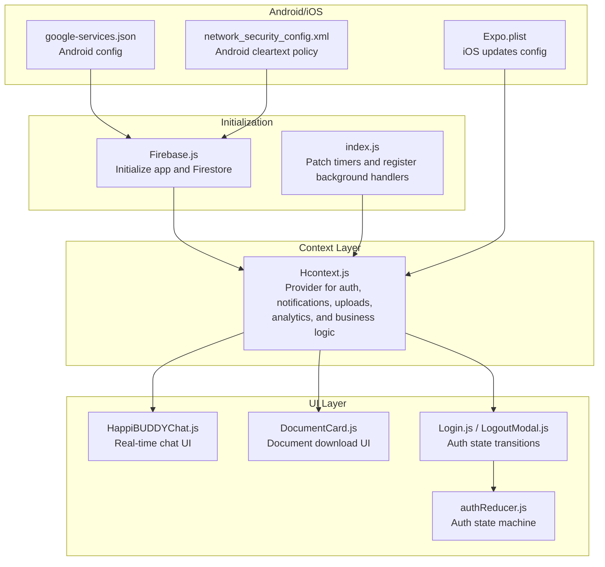
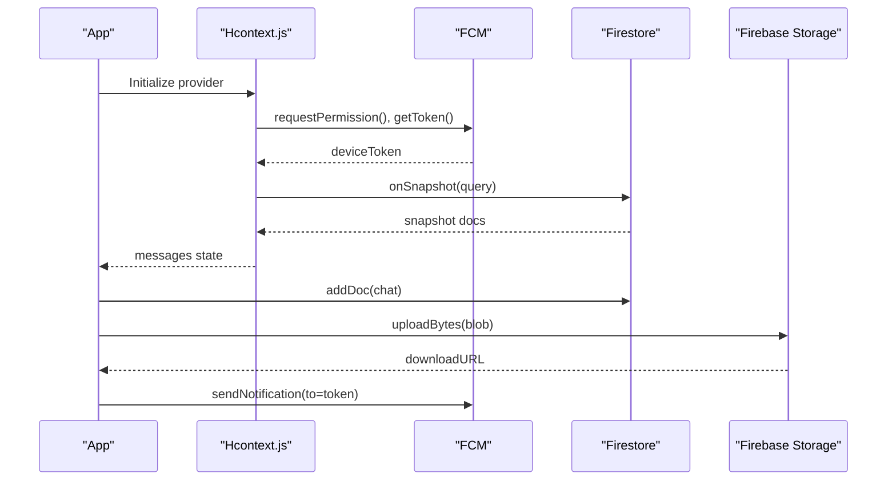
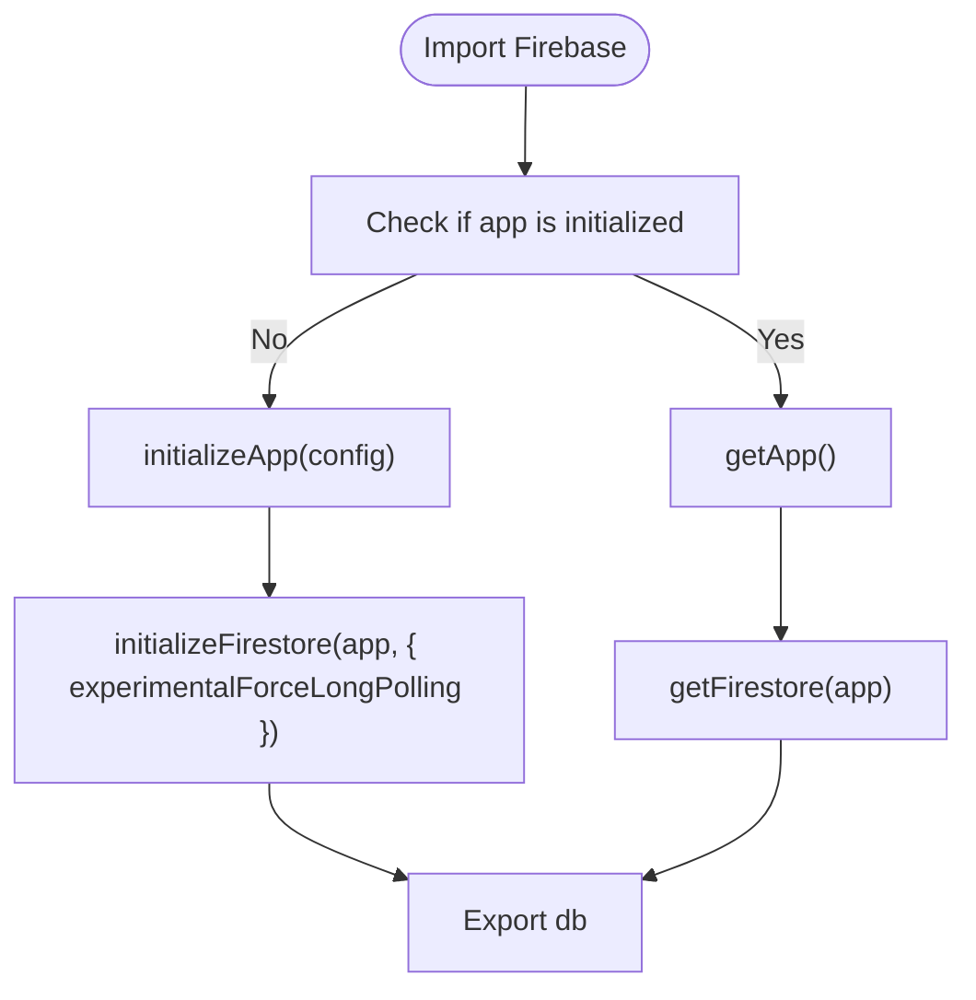
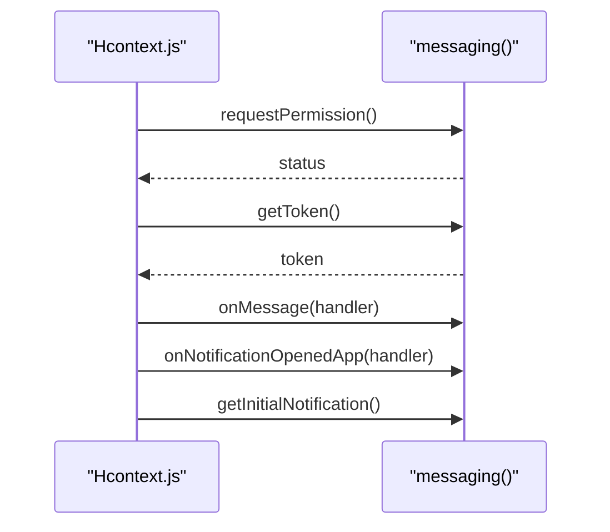
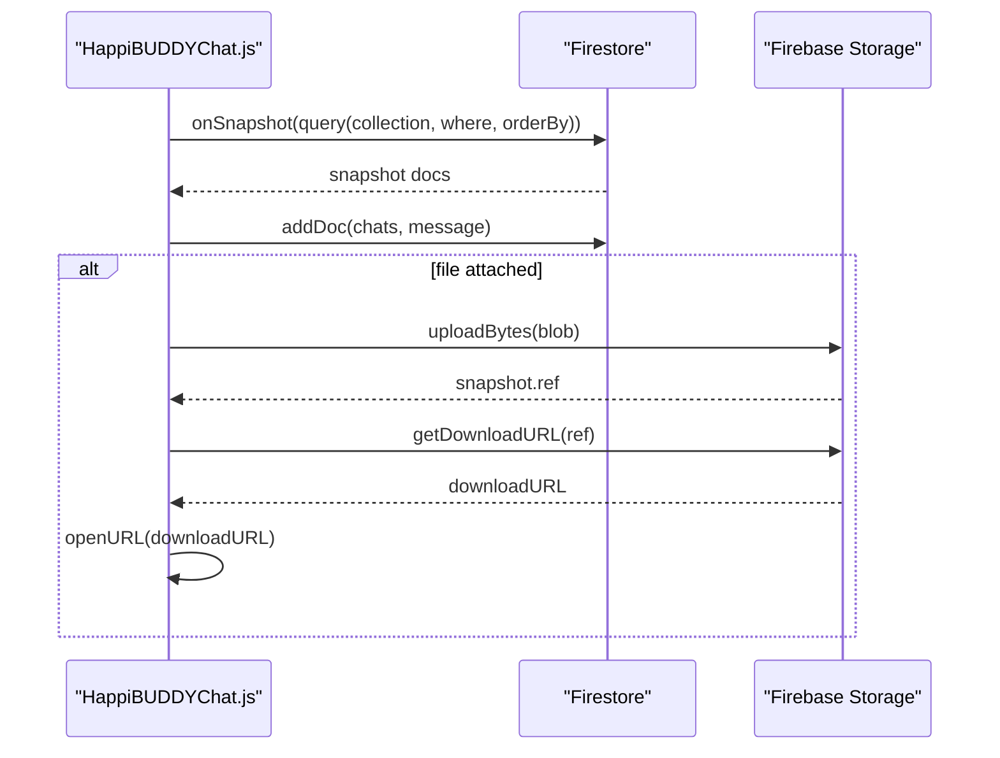
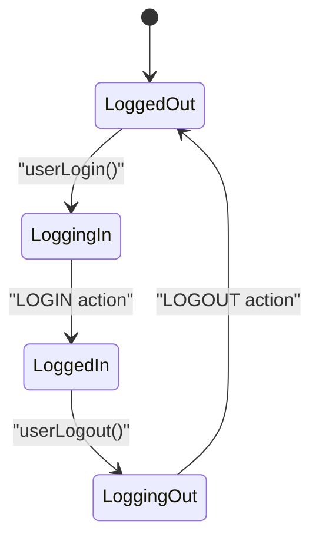
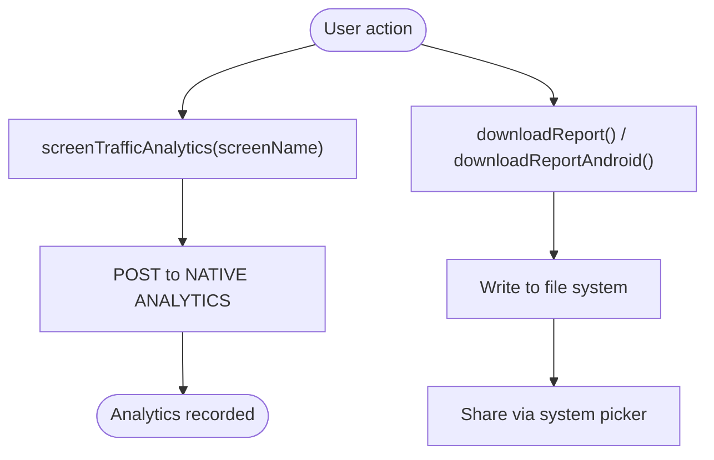
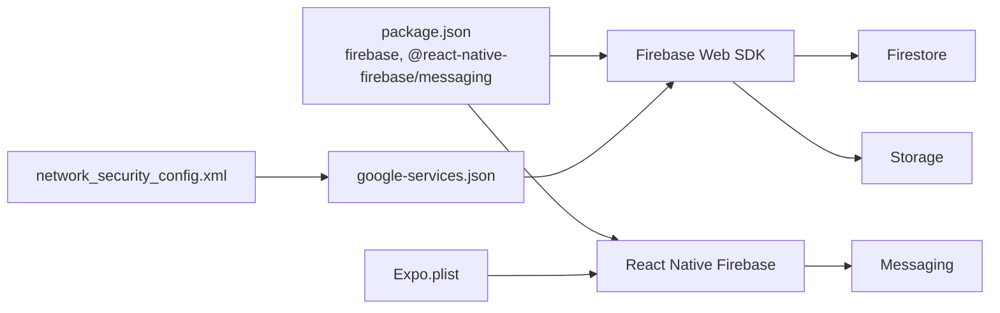

# Firebase Integration

<cite>
**Referenced Files in This Document**
- [Firebase.js](file://src/context/Firebase.js)
- [Hcontext.js](file://src/context/Hcontext.js)
- [HappiBUDDYChat.js](file://src/screens/HappyBUDDY/HappiBUDDYChat.js)
- [DocumentCard.js](file://src/components/cards/DocumentCard.js)
- [google-services.json](file://android/app/google-services.json)
- [index.js](file://index.js)
- [package.json](file://package.json)
- [network_security_config.xml](file://android/app/src/main/res/xml/network_security_config.xml)
- [Expo.plist](file://ios/HappiMynd/Supporting/Expo.plist)
- [Login.js](file://src/screens/Auth/Login.js)
- [LogoutModal.js](file://src/components/Modals/LogoutModal.js)
- [authReducer.js](file://src/context/reducers/authReducer.js)
- [Chat.js](file://src/components/common/Chat.js)
- [Home.js](file://src/screens/Home/Home.js)
- [AllReports.js](file://src/screens/HappiLIFE/AllReports.js)
- [index.js](file://index.js)
- [index.js](file://index.js)
- [index.js](file://index.js)
</cite>

## Table of Contents
1. [Introduction](#introduction)
2. [Project Structure](#project-structure)
3. [Core Components](#core-components)
4. [Architecture Overview](#architecture-overview)
5. [Detailed Component Analysis](#detailed-component-analysis)
6. [Dependency Analysis](#dependency-analysis)
7. [Performance Considerations](#performance-considerations)
8. [Troubleshooting Guide](#troubleshooting-guide)
9. [Conclusion](#conclusion)
10. [Appendices](#appendices)

## Introduction
This document explains the Firebase integration patterns used in HappiMynd. It covers configuration setup, real-time database operations via Cloud Firestore, push notification services using Firebase Cloud Messaging (FCM), and supporting integrations such as Firebase Storage for file handling. It also documents authentication state management, offline persistence considerations, and real-time synchronization patterns. Where applicable, the document references the actual source files and highlights how Firebase services are initialized, used, and wired into the application’s context and UI components.

## Project Structure
HappiMynd integrates Firebase across multiple layers:
- Initialization and configuration live in a dedicated Firebase context file.
- Real-time chat and document sharing leverage Firestore and Storage.
- Push notifications are handled via FCM with both native and Expo-based flows.
- Authentication state is managed in a Redux-style reducer and persisted locally.

**Diagram sources**
- [Firebase.js:1-52](file://src/context/Firebase.js#L1-L52)
- [Hcontext.js:1-1551](file://src/context/Hcontext.js#L1-L1551)
- [HappiBUDDYChat.js:1-747](file://src/screens/HappyBUDDY/HappiBUDDYChat.js#L1-L747)
- [DocumentCard.js:1-45](file://src/components/cards/DocumentCard.js#L1-L45)
- [google-services.json:1-55](file://android/app/google-services.json#L1-L55)
- [network_security_config.xml:1-9](file://android/app/src/main/res/xml/network_security_config.xml#L1-L9)
- [Expo.plist:1-17](file://ios/HappiMynd/Supporting/Expo.plist#L1-L17)
- [Login.js:44-74](file://src/screens/Auth/Login.js#L44-L74)
- [LogoutModal.js:32-138](file://src/components/Modals/LogoutModal.js#L32-L138)
- [authReducer.js:1-79](file://src/context/reducers/authReducer.js#L1-L79)
- [index.js:1-17](file://index.js#L1-L17)

**Section sources**
- [Firebase.js:1-52](file://src/context/Firebase.js#L1-L52)
- [Hcontext.js:1-1551](file://src/context/Hcontext.js#L1-L1551)
- [HappiBUDDYChat.js:1-747](file://src/screens/HappyBUDDY/HappiBUDDYChat.js#L1-L747)
- [DocumentCard.js:1-45](file://src/components/cards/DocumentCard.js#L1-L45)
- [google-services.json:1-55](file://android/app/google-services.json#L1-L55)
- [network_security_config.xml:1-9](file://android/app/src/main/res/xml/network_security_config.xml#L1-L9)
- [Expo.plist:1-17](file://ios/HappiMynd/Supporting/Expo.plist#L1-L17)
- [Login.js:44-74](file://src/screens/Auth/Login.js#L44-L74)
- [LogoutModal.js:32-138](file://src/components/Modals/LogoutModal.js#L32-L138)
- [authReducer.js:1-79](file://src/context/reducers/authReducer.js#L1-L79)
- [index.js:1-17](file://index.js#L1-L17)

## Core Components
- Firebase initialization and Firestore instance:
  - Initializes the Firebase app and Firestore with long-polling enabled for React Native environments.
  - Exports a Firestore instance for use across components.
- FCM provider and token management:
  - Registers for push notifications, requests permissions, retrieves FCM tokens, and subscribes to foreground/background message events.
  - Provides helpers to send notifications via Expo push endpoints.
- Real-time chat with Firestore and Storage:
  - Uses Firestore collections for chat history and onSnapshot for real-time updates.
  - Uses Firebase Storage for document/audio attachments and download URLs.
- Authentication state management:
  - Maintains logged-in state, user profile, and onboarding flags.
  - Persists user session and clears tokens on logout.
- Analytics and reporting:
  - Integrates a native analytics endpoint for screen traffic tracking.
  - Includes file download and share flows for reports.

**Section sources**
- [Firebase.js:1-52](file://src/context/Firebase.js#L1-L52)
- [Hcontext.js:66-102](file://src/context/Hcontext.js#L66-L102)
- [HappiBUDDYChat.js:249-284](file://src/screens/HappyBUDDY/HappiBUDDYChat.js#L249-L284)
- [DocumentCard.js:22-33](file://src/components/cards/DocumentCard.js#L22-L33)
- [authReducer.js:5-79](file://src/context/reducers/authReducer.js#L5-L79)
- [Hcontext.js:1321-1334](file://src/context/Hcontext.js#L1321-L1334)
- [Home.js:169-207](file://src/screens/Home/Home.js#L169-L207)
- [AllReports.js:175-191](file://src/screens/HappiLIFE/AllReports.js#L175-L191)

## Architecture Overview
The Firebase integration centers around a provider pattern:
- A central provider initializes Firebase and exposes methods for notifications, uploads, and analytics.
- UI screens subscribe to Firestore snapshots for real-time updates.
- Authentication state drives session lifecycle and UI routing.

**Diagram sources**
- [Hcontext.js:66-102](file://src/context/Hcontext.js#L66-L102)
- [HappiBUDDYChat.js:249-284](file://src/screens/HappyBUDDY/HappiBUDDYChat.js#L249-L284)
- [DocumentCard.js:22-33](file://src/components/cards/DocumentCard.js#L22-L33)

## Detailed Component Analysis

### Firebase Initialization and Firestore Instance
- Initializes Firebase app and Firestore with long-polling to avoid WebSocket/gRPC transport issues on React Native.
- Exports a Firestore instance for use in chat and other data operations.

**Diagram sources**
- [Firebase.js:33-51](file://src/context/Firebase.js#L33-L51)

**Section sources**
- [Firebase.js:1-52](file://src/context/Firebase.js#L1-L52)

### Push Notifications with FCM
- Requests notification permissions and retrieves an FCM token.
- Subscribes to foreground/background message events and initial notification data.
- Provides helper methods to send notifications via Expo push endpoints.

**Diagram sources**
- [Hcontext.js:80-102](file://src/context/Hcontext.js#L80-L102)

**Section sources**
- [Hcontext.js:66-102](file://src/context/Hcontext.js#L66-L102)
- [Hcontext.js:787-834](file://src/context/Hcontext.js#L787-L834)

### Real-Time Chat with Firestore and Storage
- Subscribes to a Firestore collection filtered by group ID and ordered by creation time.
- Sends messages to Firestore and optionally uploads files to Storage, then opens download URLs.
- Supports long-press to open downloadable files.

**Diagram sources**
- [HappiBUDDYChat.js:249-284](file://src/screens/HappyBUDDY/HappiBUDDYChat.js#L249-L284)
- [HappiBUDDYChat.js:447-482](file://src/screens/HappyBUDDY/HappiBUDDYChat.js#L447-L482)
- [DocumentCard.js:22-33](file://src/components/cards/DocumentCard.js#L22-L33)

**Section sources**
- [HappiBUDDYChat.js:249-284](file://src/screens/HappyBUDDY/HappiBUDDYChat.js#L249-L284)
- [HappiBUDDYChat.js:447-482](file://src/screens/HappyBUDDY/HappiBUDDYChat.js#L447-L482)
- [DocumentCard.js:22-33](file://src/components/cards/DocumentCard.js#L22-L33)

### Authentication State Management and Session Lifecycle
- Authentication state is modeled with a reducer that tracks login status, user profile, onboarding flags, and screening completion.
- Login stores the access token globally and persists user data.
- Logout clears tokens and resets state.

**Diagram sources**
- [authReducer.js:5-79](file://src/context/reducers/authReducer.js#L5-L79)
- [Login.js:44-74](file://src/screens/Auth/Login.js#L44-L74)
- [LogoutModal.js:32-52](file://src/components/Modals/LogoutModal.js#L32-L52)

**Section sources**
- [authReducer.js:1-79](file://src/context/reducers/authReducer.js#L1-L79)
- [Login.js:44-74](file://src/screens/Auth/Login.js#L44-L74)
- [LogoutModal.js:32-52](file://src/components/Modals/LogoutModal.js#L32-L52)

### Analytics and Reporting
- Screen traffic analytics are sent to a native analytics endpoint.
- Report downloads and sharing are handled with platform-specific file system APIs and sharing.

**Diagram sources**
- [Hcontext.js:1321-1334](file://src/context/Hcontext.js#L1321-L1334)
- [Home.js:169-207](file://src/screens/Home/Home.js#L169-L207)
- [AllReports.js:175-191](file://src/screens/HappiLIFE/AllReports.js#L175-L191)

**Section sources**
- [Hcontext.js:1321-1334](file://src/context/Hcontext.js#L1321-L1334)
- [Home.js:169-207](file://src/screens/Home/Home.js#L169-L207)
- [AllReports.js:175-191](file://src/screens/HappiLIFE/AllReports.js#L175-L191)

## Dependency Analysis
- Firebase Web SDK and native Firebase modules are integrated:
  - Web SDK for Firestore and Storage.
  - Native Firebase Messaging for background handling and token retrieval.
- Android and iOS configurations:
  - Android uses a network security config enabling cleartext traffic for development.
  - iOS uses Expo updates configuration.
- Package dependencies include Firebase SDKs and React Native Firebase Messaging.

**Diagram sources**
- [package.json:13-94](file://package.json#L13-L94)
- [google-services.json:1-55](file://android/app/google-services.json#L1-L55)
- [network_security_config.xml:1-9](file://android/app/src/main/res/xml/network_security_config.xml#L1-L9)
- [Expo.plist:1-17](file://ios/HappiMynd/Supporting/Expo.plist#L1-L17)

**Section sources**
- [package.json:13-94](file://package.json#L13-L94)
- [google-services.json:1-55](file://android/app/google-services.json#L1-L55)
- [network_security_config.xml:1-9](file://android/app/src/main/res/xml/network_security_config.xml#L1-L9)
- [Expo.plist:1-17](file://ios/HappiMynd/Supporting/Expo.plist#L1-L17)

## Performance Considerations
- Firestore long-polling is enabled to mitigate transport issues on React Native.
- Timers are patched on Android to prevent long-running timeouts from triggering warnings.
- Snapshot listeners should be unsubscribed to avoid memory leaks.
- File uploads are performed with blobs and download URLs cached per message to minimize repeated fetches.

[No sources needed since this section provides general guidance]

## Troubleshooting Guide
Common issues and resolutions:
- Could not reach Cloud Firestore backend:
  - The Firestore instance is initialized with long-polling to avoid WebSocket/gRPC transport problems on React Native.
- Android timer warnings:
  - A timer patch splits long timeouts into smaller intervals to satisfy platform constraints.
- Notification permission denied:
  - The provider checks authorization status and logs the result; ensure permissions are granted.
- Background notification handling:
  - A background message handler is registered early in the app lifecycle to process notifications when the app is not active.

**Section sources**
- [Firebase.js:37-49](file://src/context/Firebase.js#L37-L49)
- [index.js:19-56](file://index.js#L19-L56)
- [Hcontext.js:104-127](file://src/context/Hcontext.js#L104-L127)
- [index.js:5-17](file://index.js#L5-L17)

## Conclusion
HappiMynd integrates Firebase across initialization, real-time data, file storage, push notifications, and analytics. The provider-based architecture centralizes Firebase operations, while UI components subscribe to Firestore snapshots and use Storage for attachments. Authentication state is managed separately but coordinated with Firebase token retrieval and analytics. The integration leverages both Firebase Web SDK and native Firebase Messaging, with platform-specific configurations to ensure reliable operation on Android and iOS.

[No sources needed since this section summarizes without analyzing specific files]

## Appendices

### Configuration Examples and Initialization Patterns
- Firebase app and Firestore initialization with long-polling.
- FCM token retrieval and listener setup.
- Android network security and iOS Expo updates configuration.

**Section sources**
- [Firebase.js:14-51](file://src/context/Firebase.js#L14-L51)
- [Hcontext.js:80-102](file://src/context/Hcontext.js#L80-L102)
- [google-services.json:1-55](file://android/app/google-services.json#L1-L55)
- [network_security_config.xml:1-9](file://android/app/src/main/res/xml/network_security_config.xml#L1-L9)
- [Expo.plist:1-17](file://ios/HappiMynd/Supporting/Expo.plist#L1-L17)

### Security Rule Implementation Notes
- Firestore queries filter by group ID and order by creation time to scope chat visibility.
- Storage references are accessed via download URLs; ensure Storage security rules restrict access appropriately.

**Section sources**
- [HappiBUDDYChat.js:249-255](file://src/screens/HappyBUDDY/HappiBUDDYChat.js#L249-L255)
- [DocumentCard.js:22-33](file://src/components/cards/DocumentCard.js#L22-L33)

### Offline Persistence and Synchronization Patterns
- Firestore long-polling is enabled to improve reliability on React Native.
- Snapshot listeners provide real-time updates; ensure proper cleanup on component unmount.
- File uploads use blobs and cache download URLs to reduce redundant network calls.

**Section sources**
- [Firebase.js:37-49](file://src/context/Firebase.js#L37-L49)
- [HappiBUDDYChat.js:249-284](file://src/screens/HappyBUDDY/HappiBUDDYChat.js#L249-L284)
- [Hcontext.js:836-857](file://src/context/Hcontext.js#L836-L857)