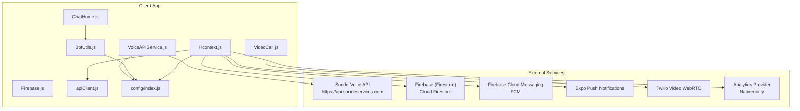
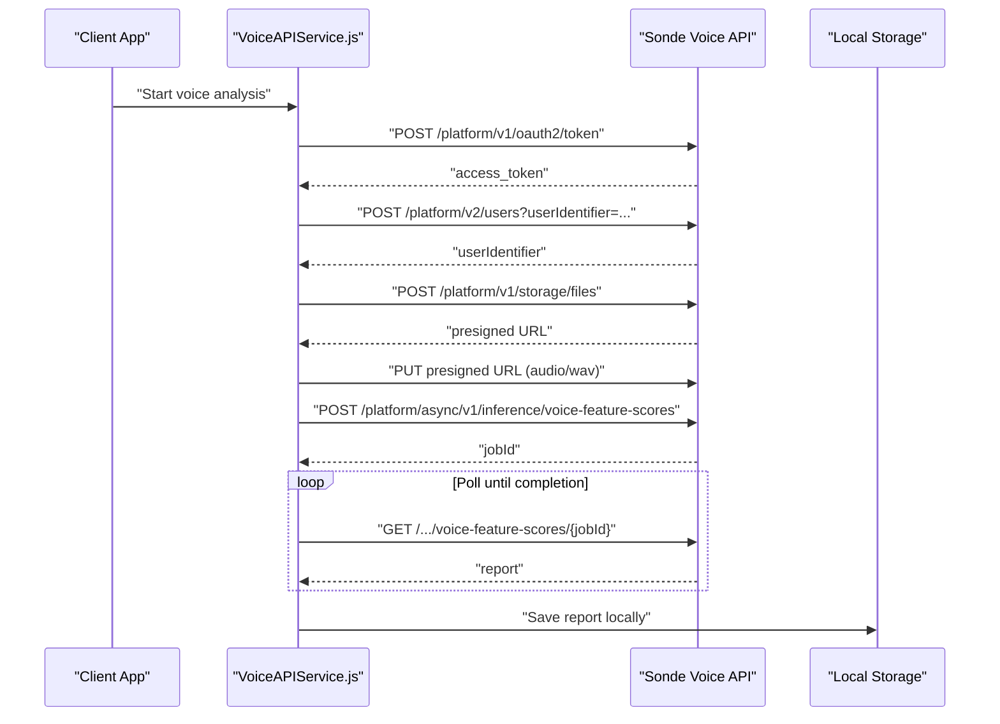
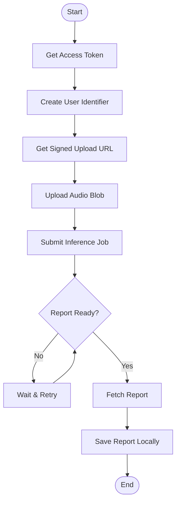
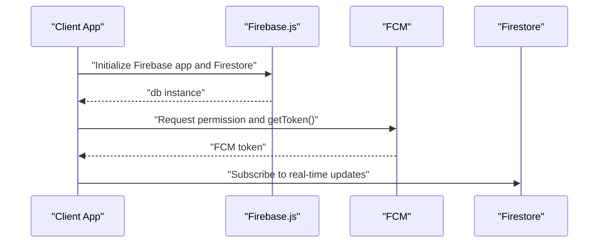
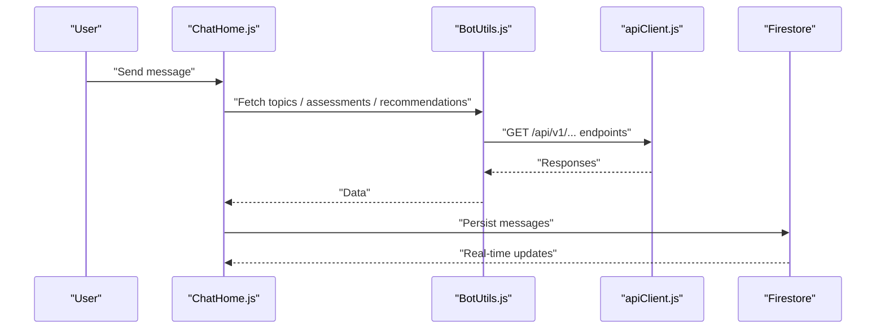
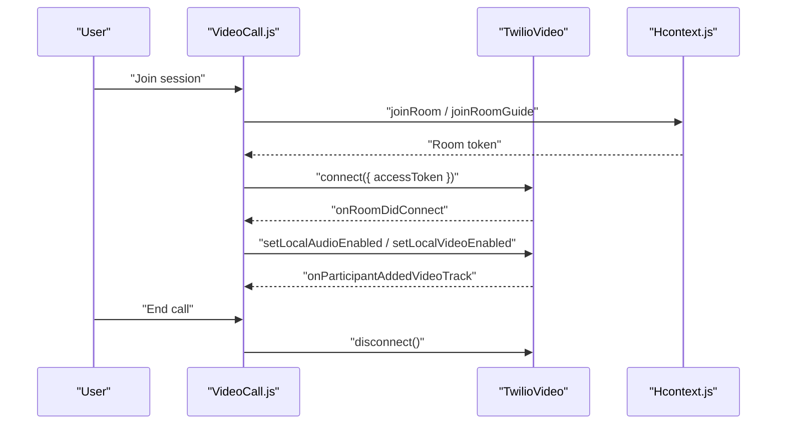
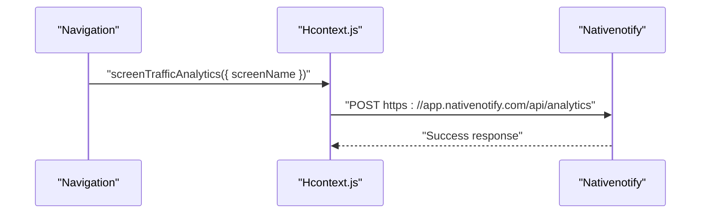
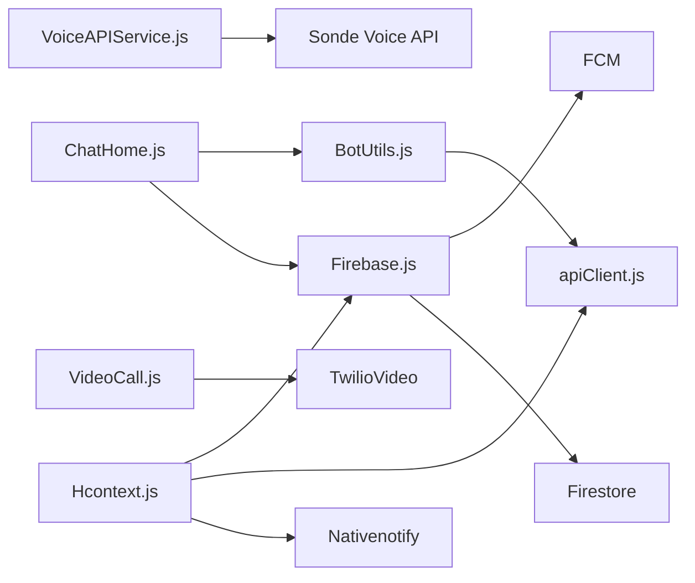

# Third-Party Integrations API

<cite>
**Referenced Files in This Document**
- [Firebase.js](file://src/context/Firebase.js)
- [google-services.json](file://google-services.json)
- [google-services.json](file://android/app/google-services.json)
- [VoiceAPIService.js](file://src/screens/HappiVOICE/VoiceAPIService.js)
- [apiClient.js](file://src/context/apiClient.js)
- [index.js](file://index.js)
- [Hcontext.js](file://src/context/Hcontext.js)
- [ChatHome.js](file://src/screens/Chat/ChatHome.js)
- [BotUtils.js](file://src/screens/Chat/BotUtils.js)
- [VideoCall.js](file://src/screens/HappiTALK/VideoCall.js)
- [config/index.js](file://src/config/index.js)
- [test_endpoints.js](file://test_endpoints.js)
</cite>

## Table of Contents
1. [Introduction](#introduction)
2. [Project Structure](#project-structure)
3. [Core Components](#core-components)
4. [Architecture Overview](#architecture-overview)
5. [Detailed Component Analysis](#detailed-component-analysis)
6. [Dependency Analysis](#dependency-analysis)
7. [Performance Considerations](#performance-considerations)
8. [Troubleshooting Guide](#troubleshooting-guide)
9. [Conclusion](#conclusion)
10. [Appendices](#appendices)

## Introduction
This document describes the third-party service integrations used by HappiMynd, focusing on:
- Voice analysis via the Sonde API for speech processing and report generation
- Firebase services for real-time messaging, push notifications, and data synchronization
- External communication platforms including chat, video calling, and analytics providers
- Authentication and authorization mechanisms, rate limiting considerations, error handling strategies
- Data privacy compliance, secure communication protocols, and monitoring approaches for external dependencies

## Project Structure
The integration surface spans client-side modules that orchestrate:
- Voice analysis workflows (authentication, signed URL generation, upload, inference, report saving)
- Firebase initialization and Firestore usage for chat persistence and real-time updates
- Push notifications via Firebase Cloud Messaging (FCM) and Expo push notifications
- Chatbot orchestration and recommendation retrieval via internal endpoints
- Video calling via Twilio Video WebRTC
- Analytics via an external analytics provider

**Diagram sources**
- [VoiceAPIService.js:1-264](file://src/screens/HappiVOICE/VoiceAPIService.js#L1-L264)
- [Firebase.js:1-52](file://src/context/Firebase.js#L1-L52)
- [Hcontext.js:1-200](file://src/context/Hcontext.js#L1-L200)
- [ChatHome.js:1-827](file://src/screens/Chat/ChatHome.js#L1-L827)
- [BotUtils.js:1-183](file://src/screens/Chat/BotUtils.js#L1-L183)
- [VideoCall.js:1-431](file://src/screens/HappiTALK/VideoCall.js#L1-L431)
- [apiClient.js:1-58](file://src/context/apiClient.js#L1-L58)
- [config/index.js:1-13](file://src/config/index.js#L1-L13)

**Section sources**
- [Firebase.js:1-52](file://src/context/Firebase.js#L1-L52)
- [config/index.js:1-13](file://src/config/index.js#L1-L13)

## Core Components
- Sonde Voice Analysis Service
  - Token acquisition, user identity creation, signed URL generation, audio upload, asynchronous inference, report retrieval, and local report saving
- Firebase Integration
  - Firestore initialization with long-polling fallback, FCM push notification setup, and analytics reporting
- Chat and Recommendations
  - Internal endpoints for topics, assessments, recommendations, and LLM responses
- Video Calling
  - Twilio Video WebRTC integration for peer-to-peer and guided sessions
- Analytics
  - Nativenotify analytics integration for screen traffic

**Section sources**
- [VoiceAPIService.js:11-264](file://src/screens/HappiVOICE/VoiceAPIService.js#L11-L264)
- [Firebase.js:14-51](file://src/context/Firebase.js#L14-L51)
- [Hcontext.js:80-127](file://src/context/Hcontext.js#L80-L127)
- [BotUtils.js:6-183](file://src/screens/Chat/BotUtils.js#L6-L183)
- [VideoCall.js:105-127](file://src/screens/HappiTALK/VideoCall.js#L105-L127)
- [config/index.js:8-12](file://src/config/index.js#L8-L12)

## Architecture Overview
The system integrates multiple third-party services through dedicated modules:
- Voice analysis uses Sonde’s OAuth2 token flow, user identity provisioning, signed URL uploads, and asynchronous inference
- Firebase powers real-time chat persistence and push notifications; Firestore is configured for React Native compatibility
- Chatbot orchestrates user intents and recommendations via internal endpoints
- Video calling relies on Twilio Video WebRTC with permission checks and lifecycle callbacks
- Analytics sends screen traffic events to an external analytics provider

**Diagram sources**
- [VoiceAPIService.js:26-201](file://src/screens/HappiVOICE/VoiceAPIService.js#L26-L201)

**Section sources**
- [VoiceAPIService.js:11-201](file://src/screens/HappiVOICE/VoiceAPIService.js#L11-L201)

## Detailed Component Analysis

### Sonde Voice Analysis API Integration
Endpoints and flows:
- Token acquisition: OAuth2 client credentials grant with specific scopes
- User identity creation: POST user profile with device metadata
- Signed URL generation: Upload metadata for audio file
- Audio upload: PUT to pre-signed URL
- Asynchronous inference: POST job request and poll for completion
- Report retrieval and local saving: GET job result and POST to internal scoring endpoint

**Diagram sources**
- [VoiceAPIService.js:26-201](file://src/screens/HappiVOICE/VoiceAPIService.js#L26-L201)

Key implementation references:
- Token acquisition and scopes: [VoiceAPIService.js:26-50](file://src/screens/HappiVOICE/VoiceAPIService.js#L26-L50)
- User identity creation: [VoiceAPIService.js:52-88](file://src/screens/HappiVOICE/VoiceAPIService.js#L52-L88)
- Signed URL generation: [VoiceAPIService.js:89-126](file://src/screens/HappiVOICE/VoiceAPIService.js#L89-L126)
- Audio upload: [VoiceAPIService.js:129-151](file://src/screens/HappiVOICE/VoiceAPIService.js#L129-L151)
- Inference submission and polling: [VoiceAPIService.js:154-201](file://src/screens/HappiVOICE/VoiceAPIService.js#L154-L201)
- Report parsing and saving: [VoiceAPIService.js:204-259](file://src/screens/HappiVOICE/VoiceAPIService.js#L204-L259)

**Section sources**
- [VoiceAPIService.js:11-264](file://src/screens/HappiVOICE/VoiceAPIService.js#L11-L264)

### Firebase Integration Patterns
Initialization and Firestore configuration:
- Client-side Firebase initialization with project credentials
- Firestore configured with long-polling to avoid WebSocket/gRPC transport issues on React Native
- Real-time listeners for push notifications via FCM

**Diagram sources**
- [Firebase.js:14-51](file://src/context/Firebase.js#L14-L51)
- [Hcontext.js:80-127](file://src/context/Hcontext.js#L80-L127)

Key implementation references:
- Firebase config and initialization: [Firebase.js:14-51](file://src/context/Firebase.js#L14-L51)
- FCM token retrieval and listeners: [Hcontext.js:80-127](file://src/context/Hcontext.js#L80-L127)
- Background message handler setup: [index.js:9-11](file://index.js#L9-L11)

**Section sources**
- [Firebase.js:14-51](file://src/context/Firebase.js#L14-L51)
- [Hcontext.js:80-127](file://src/context/Hcontext.js#L80-L127)
- [index.js:9-11](file://index.js#L9-L11)

### Chat and Recommendation Orchestration
Internal endpoints for chatbot workflows:
- Discussion topics, suicidal thoughts content, breathing exercise video, categories, assessments, questions, recommendations, and LLM responses
- Chat persistence and real-time updates via Firestore

**Diagram sources**
- [ChatHome.js:69-129](file://src/screens/Chat/ChatHome.js#L69-L129)
- [BotUtils.js:6-183](file://src/screens/Chat/BotUtils.js#L6-L183)
- [apiClient.js:12-56](file://src/context/apiClient.js#L12-L56)

Key implementation references:
- Chatbot orchestration and message persistence: [ChatHome.js:69-310](file://src/screens/Chat/ChatHome.js#L69-L310)
- Internal chatbot endpoints: [BotUtils.js:6-183](file://src/screens/Chat/BotUtils.js#L6-L183)
- API client with interceptors: [apiClient.js:12-56](file://src/context/apiClient.js#L12-L56)

**Section sources**
- [ChatHome.js:69-310](file://src/screens/Chat/ChatHome.js#L69-L310)
- [BotUtils.js:6-183](file://src/screens/Chat/BotUtils.js#L6-L183)
- [apiClient.js:12-56](file://src/context/apiClient.js#L12-L56)

### Video Calling Integration
Twilio Video WebRTC integration:
- Permission checks for camera and microphone
- Room access token retrieval via internal endpoints
- Connect/disconnect lifecycle and participant video tracks management

**Diagram sources**
- [VideoCall.js:52-192](file://src/screens/HappiTALK/VideoCall.js#L52-L192)
- [Hcontext.js:1297-1372](file://src/context/Hcontext.js#L1297-L1372)

Key implementation references:
- Permission handling and room access: [VideoCall.js:52-127](file://src/screens/HappiTALK/VideoCall.js#L52-L127)
- Twilio lifecycle callbacks: [VideoCall.js:155-195](file://src/screens/HappiTALK/VideoCall.js#L155-L195)
- Room token retrieval: [Hcontext.js:1297-1372](file://src/context/Hcontext.js#L1297-L1372)

**Section sources**
- [VideoCall.js:52-192](file://src/screens/HappiTALK/VideoCall.js#L52-L192)
- [Hcontext.js:1297-1372](file://src/context/Hcontext.js#L1297-L1372)

### Analytics Integration
Screen traffic analytics via Nativenotify:
- Endpoint and credentials configured centrally
- Screen analytics function invoked on navigation events

**Diagram sources**
- [Hcontext.js:1321-1334](file://src/context/Hcontext.js#L1321-L1334)
- [config/index.js:8-12](file://src/config/index.js#L8-L12)

Key implementation references:
- Analytics endpoint and credentials: [config/index.js:8-12](file://src/config/index.js#L8-L12)
- Analytics invocation: [Hcontext.js:1321-1334](file://src/context/Hcontext.js#L1321-L1334)

**Section sources**
- [config/index.js:8-12](file://src/config/index.js#L8-L12)
- [Hcontext.js:1321-1334](file://src/context/Hcontext.js#L1321-L1334)

## Dependency Analysis
External dependencies and integration points:
- Sonde Voice API: OAuth2 token, user provisioning, storage, and inference endpoints
- Firebase: Firestore for real-time data sync and FCM for push notifications
- Twilio Video: WebRTC-based video calling
- Analytics: Nativenotify for screen traffic analytics
- Internal API: Centralized base URL and endpoints for chatbot, assessments, and notifications

**Diagram sources**
- [VoiceAPIService.js:11-264](file://src/screens/HappiVOICE/VoiceAPIService.js#L11-L264)
- [ChatHome.js:1-827](file://src/screens/Chat/ChatHome.js#L1-L827)
- [BotUtils.js:1-183](file://src/screens/Chat/BotUtils.js#L1-L183)
- [Firebase.js:1-52](file://src/context/Firebase.js#L1-L52)
- [VideoCall.js:1-431](file://src/screens/HappiTALK/VideoCall.js#L1-L431)
- [Hcontext.js:1-200](file://src/context/Hcontext.js#L1-L200)
- [config/index.js:1-13](file://src/config/index.js#L1-L13)

**Section sources**
- [VoiceAPIService.js:11-264](file://src/screens/HappiVOICE/VoiceAPIService.js#L11-L264)
- [Firebase.js:1-52](file://src/context/Firebase.js#L1-L52)
- [VideoCall.js:1-431](file://src/screens/HappiTALK/VideoCall.js#L1-L431)
- [Hcontext.js:1-200](file://src/context/Hcontext.js#L1-L200)
- [config/index.js:1-13](file://src/config/index.js#L1-L13)

## Performance Considerations
- Firestore long-polling: Firestore is configured with long-polling to mitigate transport reliability issues on React Native environments
- Timeout and retries: Axios instances define timeouts; consider retry/backoff for transient failures
- Network efficiency: Audio uploads use pre-signed URLs to offload CDN handling; minimize repeated polling intervals for asynchronous jobs
- Permissions: Video calling requires runtime permissions; cache permission decisions to reduce redundant prompts

[No sources needed since this section provides general guidance]

## Troubleshooting Guide
Common issues and resolutions:
- Firebase initialization errors: Ensure Firebase app is initialized only once; the module falls back to existing instances on hot reloads
- Firestore connectivity: Long-polling mode is enforced to avoid WebSocket/gRPC transport issues
- Push notifications: Verify FCM permission grants and token retrieval; background handlers must be registered early
- Voice analysis: Validate OAuth2 scopes and token lifetime; ensure signed URL expiry and retry logic for uploads
- Video calling: Confirm camera and microphone permissions; handle connection failure callbacks and participant track events

**Section sources**
- [Firebase.js:40-49](file://src/context/Firebase.js#L40-L49)
- [index.js:9-11](file://index.js#L9-L11)
- [VideoCall.js:52-89](file://src/screens/HappiTALK/VideoCall.js#L52-L89)
- [VoiceAPIService.js:26-50](file://src/screens/HappiVOICE/VoiceAPIService.js#L26-L50)

## Conclusion
HappiMynd integrates multiple third-party services to deliver voice analysis, real-time chat, push notifications, video calling, and analytics. The integration patterns emphasize robust initialization, secure communication, and resilient error handling. Centralized configuration and interceptors streamline authentication and cross-service coordination.

[No sources needed since this section summarizes without analyzing specific files]

## Appendices

### Authentication and Authorization Mechanisms
- Sonde OAuth2: Client credentials grant with explicit scopes for user write/read and voice feature scores
- Internal API: Bearer token injected via request interceptor from global state or AsyncStorage
- Firebase: App initialization with project credentials; FCM token retrieval for push notifications

**Section sources**
- [VoiceAPIService.js:26-50](file://src/screens/HappiVOICE/VoiceAPIService.js#L26-L50)
- [apiClient.js:12-42](file://src/context/apiClient.js#L12-L42)
- [Firebase.js:14-34](file://src/context/Firebase.js#L14-L34)

### Rate Limiting and Error Handling Strategies
- Axios interceptors log errors and propagate structured responses
- Sonde endpoints: Implement retry logic for asynchronous jobs and handle 429/5xx gracefully
- Firebase: Use long-polling to mitigate transport-related failures
- Video calling: Handle permission denials and connection failures with user feedback

**Section sources**
- [apiClient.js:47-56](file://src/context/apiClient.js#L47-L56)
- [Firebase.js:40-49](file://src/context/Firebase.js#L40-L49)
- [VideoCall.js:52-89](file://src/screens/HappiTALK/VideoCall.js#L52-L89)

### Data Privacy Compliance and Secure Communication
- Firebase configuration files: Ensure keys are not committed to public repositories
- HTTPS endpoints: All third-party integrations use HTTPS
- Token storage: Prefer secure storage mechanisms; avoid logging sensitive tokens

**Section sources**
- [google-services.json:1-39](file://google-services.json#L1-L39)
- [google-services.json:1-55](file://android/app/google-services.json#L1-L55)
- [config/index.js:3-6](file://src/config/index.js#L3-L6)

### Monitoring Approaches for External Dependencies
- FCM background message handler registration
- Analytics screen traffic events
- Centralized error logging via interceptors

**Section sources**
- [index.js:9-11](file://index.js#L9-L11)
- [Hcontext.js:1321-1334](file://src/context/Hcontext.js#L1321-L1334)
- [apiClient.js:47-56](file://src/context/apiClient.js#L47-L56)

### API Endpoint Reference (Internal)
- Login: POST /api/v1/login
- Notifications: GET /api/v1/notification-list
- Assessments: GET /api/v1/chat-bot/assessments?user_id=...
- Categories: GET /api/v1/chat-bot/categories
- Recommendations: GET /api/v1/chat-bot/recommendations?user_profile_id=...&recommendation_category_id=...
- LLM Response: POST http://13.235.242.52/api/generate_response/

**Section sources**
- [test_endpoints.js:6-11](file://test_endpoints.js#L6-L11)
- [BotUtils.js:48-97](file://src/screens/Chat/BotUtils.js#L48-L97)
- [BotUtils.js:150-182](file://src/screens/Chat/BotUtils.js#L150-L182)