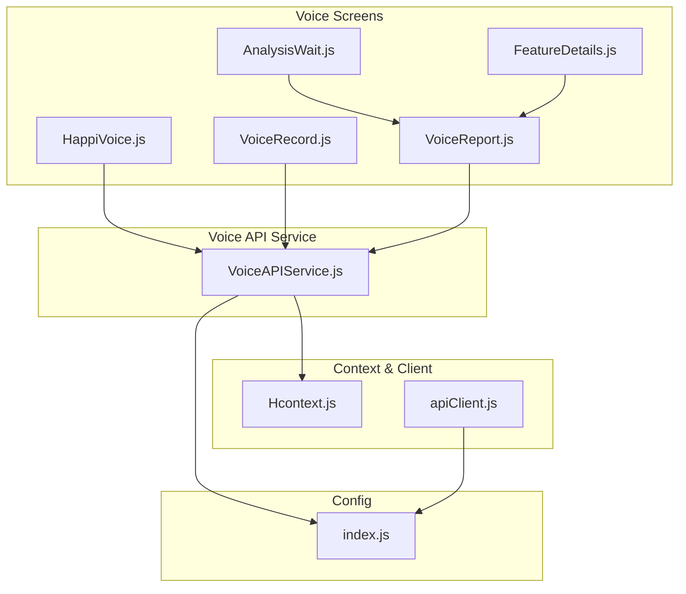
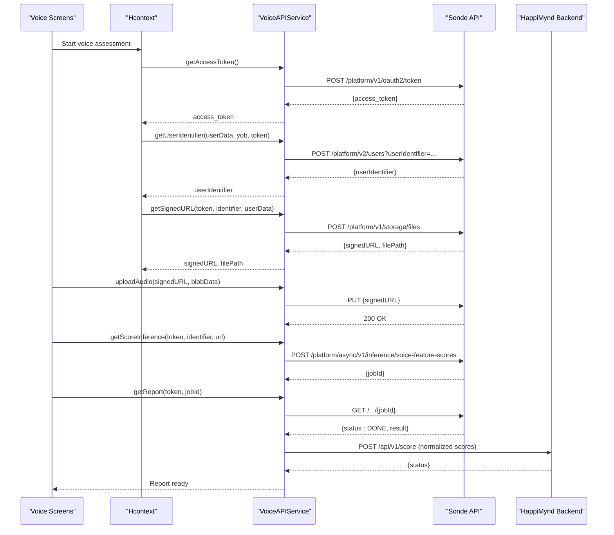
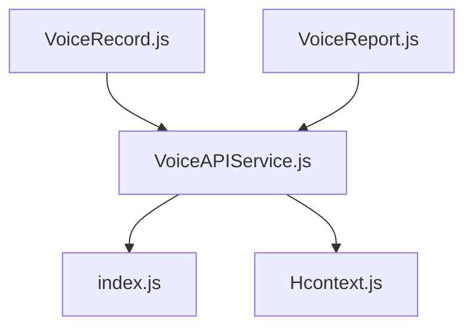

# Voice Analysis API Integration

<cite>
**Referenced Files in This Document**
- [VoiceAPIService.js](file://src/screens/HappiVOICE/VoiceAPIService.js)
- [VoiceRecord.js](file://src/screens/HappiVOICE/VoiceRecord.js)
- [VoiceReport.js](file://src/screens/HappiVOICE/VoiceReport.js)
- [AnalysisWait.js](file://src/screens/HappiVOICE/AnalysisWait.js)
- [FeatureDetails.js](file://src/screens/HappiVOICE/FeatureDetails.js)
- [HappiVoice.js](file://src/screens/HappiVOICE/HappiVoice.js)
- [Hcontext.js](file://src/context/Hcontext.js)
- [apiClient.js](file://src/context/apiClient.js)
- [index.js](file://src/config/index.js)
</cite>

## Table of Contents
1. [Introduction](#introduction)
2. [Project Structure](#project-structure)
3. [Core Components](#core-components)
4. [Architecture Overview](#architecture-overview)
5. [Detailed Component Analysis](#detailed-component-analysis)
6. [Dependency Analysis](#dependency-analysis)
7. [Performance Considerations](#performance-considerations)
8. [Troubleshooting Guide](#troubleshooting-guide)
9. [Conclusion](#conclusion)
10. [Appendices](#appendices)

## Introduction
This document provides comprehensive API documentation for integrating the Sonde voice analysis service into the HappiMynd application. It covers the OAuth2 authentication flow, user identifier registration, signed URL generation for secure audio uploads, and the end-to-end voice feature scoring workflow. It also documents the asynchronous inference process and report retrieval, along with the voice feature metrics used for scoring.

## Project Structure
The voice analysis integration spans several screens and services:
- Authentication and user context: Hcontext manages tokens and identifiers.
- API client: apiClient centralizes HTTP requests with interceptors.
- Voice API service: VoiceAPIService encapsulates Sonde endpoints and local storage.
- Voice screens: HappiVoice, VoiceRecord, AnalysisWait, VoiceReport, and FeatureDetails orchestrate the user journey.

**Diagram sources**
- [HappiVoice.js:104-138](file://src/screens/HappiVOICE/HappiVoice.js#L104-L138)
- [VoiceAPIService.js:26-50](file://src/screens/HappiVOICE/VoiceAPIService.js#L26-L50)
- [VoiceRecord.js:104-127](file://src/screens/HappiVOICE/VoiceRecord.js#L104-L127)
- [VoiceReport.js:117-155](file://src/screens/HappiVOICE/VoiceReport.js#L117-L155)
- [AnalysisWait.js:23-35](file://src/screens/HappiVOICE/AnalysisWait.js#L23-L35)
- [FeatureDetails.js:15-168](file://src/screens/HappiVOICE/FeatureDetails.js#L15-L168)
- [Hcontext.js:42-51](file://src/context/Hcontext.js#L42-L51)
- [apiClient.js:1-58](file://src/context/apiClient.js#L1-L58)
- [index.js:1-13](file://src/config/index.js#L1-L13)

**Section sources**
- [HappiVoice.js:104-138](file://src/screens/HappiVOICE/HappiVoice.js#L104-L138)
- [VoiceAPIService.js:26-50](file://src/screens/HappiVOICE/VoiceAPIService.js#L26-L50)
- [VoiceRecord.js:104-127](file://src/screens/HappiVOICE/VoiceRecord.js#L104-L127)
- [VoiceReport.js:117-155](file://src/screens/HappiVOICE/VoiceReport.js#L117-L155)
- [AnalysisWait.js:23-35](file://src/screens/HappiVOICE/AnalysisWait.js#L23-L35)
- [FeatureDetails.js:15-168](file://src/screens/HappiVOICE/FeatureDetails.js#L15-L168)
- [Hcontext.js:42-51](file://src/context/Hcontext.js#L42-L51)
- [apiClient.js:1-58](file://src/context/apiClient.js#L1-L58)
- [index.js:1-13](file://src/config/index.js#L1-L13)

## Core Components
- OAuth2 Access Token Retrieval: Uses client credentials grant to obtain an access token from Sonde.
- User Identifier Registration: Registers user profile and device metadata with Sonde.
- Signed URL Generation: Requests a pre-signed URL for secure audio upload.
- Audio Upload: Performs a PUT request to the pre-signed URL.
- Asynchronous Inference: Submits audio metadata for voice feature scoring.
- Report Retrieval: Polls or checks the job status and retrieves results.
- Local Report Storage: Persists normalized scores locally after successful retrieval.

Key integration points:
- Sonde endpoints are configured via config.SONDE_URL.
- Local endpoints are configured via config.BASE_URL.

**Section sources**
- [VoiceAPIService.js:26-50](file://src/screens/HappiVOICE/VoiceAPIService.js#L26-L50)
- [VoiceAPIService.js:52-88](file://src/screens/HappiVOICE/VoiceAPIService.js#L52-L88)
- [VoiceAPIService.js:89-126](file://src/screens/HappiVOICE/VoiceAPIService.js#L89-L126)
- [VoiceAPIService.js:129-151](file://src/screens/HappiVOICE/VoiceAPIService.js#L129-L151)
- [VoiceAPIService.js:154-185](file://src/screens/HappiVOICE/VoiceAPIService.js#L154-L185)
- [VoiceAPIService.js:187-201](file://src/screens/HappiVOICE/VoiceAPIService.js#L187-L201)
- [VoiceAPIService.js:204-259](file://src/screens/HappiVOICE/VoiceAPIService.js#L204-L259)
- [index.js:1-13](file://src/config/index.js#L1-L13)

## Architecture Overview
The voice analysis workflow integrates HappiMynd’s frontend with Sonde’s voice analytics platform. The flow includes:
- Authentication: Obtain an access token using client credentials.
- Registration: Register user profile and device info to receive a user identifier.
- Upload Preparation: Request a pre-signed URL for the audio file.
- Upload: Upload the recorded audio to the pre-signed URL.
- Inference: Submit the audio metadata for asynchronous voice feature scoring.
- Report Retrieval: Fetch the job result and persist normalized scores.

**Diagram sources**
- [VoiceAPIService.js:26-50](file://src/screens/HappiVOICE/VoiceAPIService.js#L26-L50)
- [VoiceAPIService.js:52-88](file://src/screens/HappiVOICE/VoiceAPIService.js#L52-L88)
- [VoiceAPIService.js:89-126](file://src/screens/HappiVOICE/VoiceAPIService.js#L89-L126)
- [VoiceAPIService.js:129-151](file://src/screens/HappiVOICE/VoiceAPIService.js#L129-L151)
- [VoiceAPIService.js:154-185](file://src/screens/HappiVOICE/VoiceAPIService.js#L154-L185)
- [VoiceAPIService.js:187-201](file://src/screens/HappiVOICE/VoiceAPIService.js#L187-L201)
- [VoiceAPIService.js:204-259](file://src/screens/HappiVOICE/VoiceAPIService.js#L204-L259)
- [index.js:1-13](file://src/config/index.js#L1-L13)

## Detailed Component Analysis

### OAuth2 Authentication Flow
Purpose:
- Obtain an access token using the client credentials grant for Sonde services.

Endpoints:
- POST /platform/v1/oauth2/token

Headers:
- Authorization: Basic base64(client_id:client_secret)
- Content-Type: application/x-www-form-urlencoded

Request Body:
- grant_type: client_credentials
- scope: sonde-platform/users.write sonde-platform/voice-feature-scores.write sonde-platform/voice-feature-scores.read sonde-platform/storage.write

Response:
- access_token: string
- token_type: string
- expires_in: number
- scope: string

Implementation highlights:
- Uses Axios with URL constructed from config.SONDE_URL.
- Returns the access token for subsequent authenticated calls.

**Section sources**
- [VoiceAPIService.js:26-50](file://src/screens/HappiVOICE/VoiceAPIService.js#L26-L50)
- [index.js:1-13](file://src/config/index.js#L1-L13)

### User Identifier Registration
Purpose:
- Register user profile and device metadata to obtain a user identifier.

Endpoint:
- POST /platform/v2/users?userIdentifier={external_user_id}

Request Body Schema:
- yearOfBirth: string (age-based validation applied)
- gender: string
- language: string
- device: object
  - type: "MOBILE"
  - manufacturer: string
- diseases: array

Response:
- userIdentifier: string

Implementation highlights:
- Constructs profile from user data and device info.
- Uses the access token for Authorization header.
- Returns userIdentifier for later steps.

**Section sources**
- [VoiceAPIService.js:52-88](file://src/screens/HappiVOICE/VoiceAPIService.js#L52-L88)

### Signed URL Generation for Secure Audio Upload
Purpose:
- Generate a pre-signed URL to upload the recorded audio securely.

Endpoint:
- POST /platform/v1/storage/files

Request Body Schema:
- fileType: "wav"
- countryCode: string
- userIdentifier: string
- audioMetaInfo: object
  - os: string
  - device: "MOBILE"
  - deviceModel: string

Response:
- signedURL: string
- filePath: string

Implementation highlights:
- Uses device country, OS, and model for metadata.
- Returns both signedURL and filePath for inference submission.

**Section sources**
- [VoiceAPIService.js:89-126](file://src/screens/HappiVOICE/VoiceAPIService.js#L89-L126)

### Audio Recording Capture and Upload
Purpose:
- Record audio, convert to blob, and upload to the pre-signed URL.

Recording:
- Uses react-native-audio-record with configured sampleRate, channels, bitsPerSample, and wavFile.

Upload:
- PUT request to signedURL with Content-Type: audio/wav.

Implementation highlights:
- Converts recorded file path to Blob and uploads via fetch.
- Validates response.ok to confirm successful upload.

**Section sources**
- [VoiceRecord.js:55-102](file://src/screens/HappiVOICE/VoiceRecord.js#L55-L102)
- [VoiceAPIService.js:129-151](file://src/screens/HappiVOICE/VoiceAPIService.js#L129-L151)

### Asynchronous Inference and Report Retrieval
Purpose:
- Submit audio metadata for voice feature scoring and retrieve results.

Inference Submission:
- POST /platform/async/v1/inference/voice-feature-scores
- Request Body:
  - infer: array of inference specs
    - type: "Acoustic"
    - version: "v4"
  - userIdentifier: string
  - filePath: string
  - measureName: "mental-fitness"
- Response:
  - jobId: string

Report Retrieval:
- GET /platform/async/v1/inference/voice-feature-scores/{jobId}
- Response:
  - status: "DONE" indicates completion
  - result: object containing inference and voiceFeatures

Local Report Persistence:
- POST /api/v1/score with normalized scores and metadata.

Implementation highlights:
- Stores jobId in context for later retrieval.
- Normalizes voice features and aggregates a composite result.

**Section sources**
- [VoiceAPIService.js:154-185](file://src/screens/HappiVOICE/VoiceAPIService.js#L154-L185)
- [VoiceAPIService.js:187-201](file://src/screens/HappiVOICE/VoiceAPIService.js#L187-L201)
- [VoiceAPIService.js:204-259](file://src/screens/HappiVOICE/VoiceAPIService.js#L204-L259)

### Voice Feature Metrics
Normalized metrics returned by the service:
- Smoothness (%)
- Liveliness (ratio)
- Control (%)
- Energy Range (dB)
- Clarity (ratio)
- Crispness (ms)
- Pause Duration (sec)
- Speech Rate (words/min)

Scoring logic:
- Composite score mapped to categories:
  - Pay Attention: 0–69
  - Good: 70–79
  - Excellent: 80–100

**Section sources**
- [VoiceAPIService.js:204-259](file://src/screens/HappiVOICE/VoiceAPIService.js#L204-L259)
- [FeatureDetails.js:15-168](file://src/screens/HappiVOICE/FeatureDetails.js#L15-L168)

### End-to-End Workflow Orchestration
Screens and flows:
- HappiVoice: Initiates authentication, registration, and signed URL acquisition.
- VoiceRecord: Manages countdown, recording, and upload.
- AnalysisWait: Brief wait before report retrieval.
- VoiceReport: Retrieves report, persists scores, and navigates based on verification and subscription status.
- FeatureDetails: Renders detailed breakdown of individual metrics.

**Section sources**
- [HappiVoice.js:104-138](file://src/screens/HappiVOICE/HappiVoice.js#L104-L138)
- [VoiceRecord.js:104-127](file://src/screens/HappiVOICE/VoiceRecord.js#L104-L127)
- [AnalysisWait.js:23-35](file://src/screens/HappiVOICE/AnalysisWait.js#L23-L35)
- [VoiceReport.js:117-155](file://src/screens/HappiVOICE/VoiceReport.js#L117-L155)
- [FeatureDetails.js:15-168](file://src/screens/HappiVOICE/FeatureDetails.js#L15-L168)

## Dependency Analysis
- VoiceAPIService depends on:
  - config.SONDE_URL for Sonde endpoints
  - config.BASE_URL for local persistence
  - Hcontext for tokens and identifiers
  - DeviceInfo and DeviceCountry for metadata
- VoiceRecord depends on:
  - VoiceAPIService for upload and inference
  - Hcontext for state management
- VoiceReport depends on:
  - VoiceAPIService for report retrieval and persistence
  - Hcontext for user and subscription state
- apiClient provides centralized HTTP behavior with token injection and error handling.

**Diagram sources**
- [VoiceAPIService.js:26-50](file://src/screens/HappiVOICE/VoiceAPIService.js#L26-L50)
- [index.js:1-13](file://src/config/index.js#L1-L13)
- [Hcontext.js:42-51](file://src/context/Hcontext.js#L42-L51)
- [VoiceRecord.js:104-127](file://src/screens/HappiVOICE/VoiceRecord.js#L104-L127)
- [VoiceReport.js:117-155](file://src/screens/HappiVOICE/VoiceReport.js#L117-L155)

**Section sources**
- [VoiceAPIService.js:26-50](file://src/screens/HappiVOICE/VoiceAPIService.js#L26-L50)
- [index.js:1-13](file://src/config/index.js#L1-L13)
- [Hcontext.js:42-51](file://src/context/Hcontext.js#L42-L51)
- [VoiceRecord.js:104-127](file://src/screens/HappiVOICE/VoiceRecord.js#L104-L127)
- [VoiceReport.js:117-155](file://src/screens/HappiVOICE/VoiceReport.js#L117-L155)

## Performance Considerations
- Network timeouts: Sonde endpoints are invoked with Axios defaults; ensure robust retry policies for transient failures.
- Large payloads: Inference requests specify a large body length limit; avoid unnecessary data in request bodies.
- Binary uploads: Audio uploads use fetch with appropriate headers; ensure chunked or streaming uploads for very large files if needed.
- Caching: Store tokens and identifiers in Hcontext to minimize repeated authentication and registration calls.
- UI responsiveness: Debounce or throttle polling for report status to reduce redundant network calls.

## Troubleshooting Guide
Common issues and resolutions:
- Authentication failures:
  - Verify client credentials and scopes.
  - Confirm Authorization header format and Content-Type.
- Registration errors:
  - Ensure userIdentifier query parameter matches external user ID.
  - Validate device metadata fields.
- Upload failures:
  - Confirm signedURL validity and expiry.
  - Check Content-Type and file format.
- Inference job not found:
  - Verify jobId correctness and token permissions.
  - Retry retrieval until status is DONE.
- Local persistence errors:
  - Inspect normalized score mapping and endpoint availability.

Operational tips:
- Implement exponential backoff for retries on temporary errors.
- Log request/response payloads for debugging.
- Validate device country, OS, and model metadata to prevent mismatches.

**Section sources**
- [VoiceAPIService.js:26-50](file://src/screens/HappiVOICE/VoiceAPIService.js#L26-L50)
- [VoiceAPIService.js:52-88](file://src/screens/HappiVOICE/VoiceAPIService.js#L52-L88)
- [VoiceAPIService.js:89-126](file://src/screens/HappiVOICE/VoiceAPIService.js#L89-L126)
- [VoiceAPIService.js:129-151](file://src/screens/HappiVOICE/VoiceAPIService.js#L129-L151)
- [VoiceAPIService.js:154-185](file://src/screens/HappiVOICE/VoiceAPIService.js#L154-L185)
- [VoiceAPIService.js:187-201](file://src/screens/HappiVOICE/VoiceAPIService.js#L187-L201)
- [VoiceAPIService.js:204-259](file://src/screens/HappiVOICE/VoiceAPIService.js#L204-L259)

## Conclusion
The HappiMynd voice analysis integration leverages Sonde’s platform to deliver comprehensive voice feature scoring. By following the documented authentication, registration, upload, inference, and reporting steps, developers can reliably integrate voice assessments into the application. Robust error handling, retry strategies, and privacy-conscious data handling ensure a resilient and compliant user experience.

## Appendices

### Endpoint Specifications
- POST /platform/v1/oauth2/token
  - Headers: Authorization (Basic), Content-Type: application/x-www-form-urlencoded
  - Body: grant_type, scope
  - Response: access_token, token_type, expires_in, scope

- POST /platform/v2/users?userIdentifier={external_user_id}
  - Headers: Authorization: Bearer {access_token}
  - Body: profile and device metadata
  - Response: userIdentifier

- POST /platform/v1/storage/files
  - Headers: Authorization: Bearer {access_token}
  - Body: fileType, countryCode, userIdentifier, audioMetaInfo
  - Response: signedURL, filePath

- PUT {signedURL}
  - Headers: Content-Type: audio/wav
  - Body: WAV audio blob
  - Response: 200 OK

- POST /platform/async/v1/inference/voice-feature-scores
  - Headers: Authorization: Bearer {access_token}
  - Body: infer, userIdentifier, filePath, measureName
  - Response: jobId

- GET /platform/async/v1/inference/voice-feature-scores/{jobId}
  - Headers: Authorization: Bearer {access_token}
  - Response: status, result

- POST /api/v1/score
  - Headers: Content-Type: application/json
  - Body: normalized scores and metadata
  - Response: status

### Data Schemas
- User Profile Request
  - yearOfBirth: string
  - gender: string
  - language: string
  - device: { type: "MOBILE", manufacturer: string }
  - diseases: array

- Audio Metadata Request
  - fileType: "wav"
  - countryCode: string
  - userIdentifier: string
  - audioMetaInfo: { os: string, device: "MOBILE", deviceModel: string }

- Inference Request
  - infer: [{ type: "Acoustic", version: "v4" }]
  - userIdentifier: string
  - filePath: string
  - measureName: "mental-fitness"

- Scoring Results
  - result: { inference: [{ score: { value: number }, voiceFeatures: [{ name: string, score: number }] }] }

### Voice Feature Definitions
- Smoothness: % (pitch control)
- Liveliness: ratio (vocal variety)
- Control: % (muscle control)
- Energy Range: dB (intensity variation)
- Clarity: ratio (articulation)
- Crispness: ms (sound duration)
- Pause Duration: sec (silent gaps)
- Speech Rate: words/min

### Privacy and Compliance Notes
- Minimize retention of raw audio; rely on pre-signed URLs and ephemeral tokens.
- Ensure device metadata is anonymized and aggregated.
- Comply with regional data protection regulations; avoid storing sensitive personal data unnecessarily.
- Use HTTPS endpoints exclusively and validate TLS certificates.