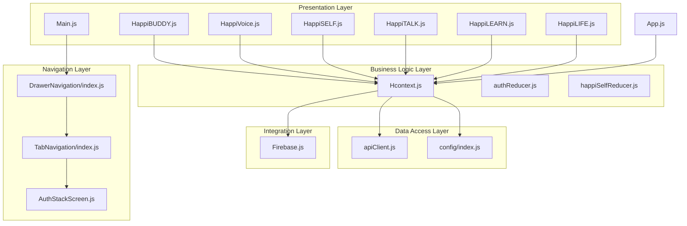
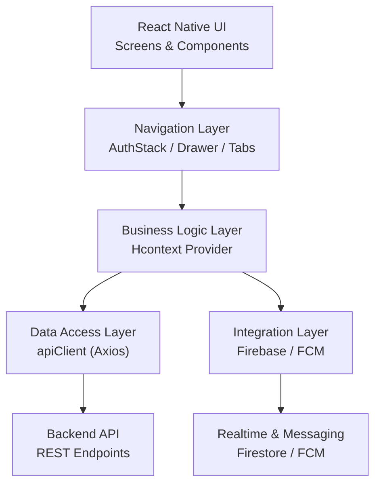
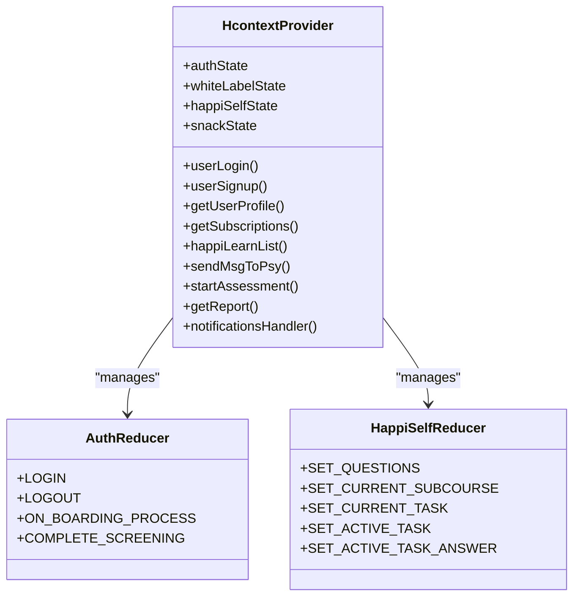
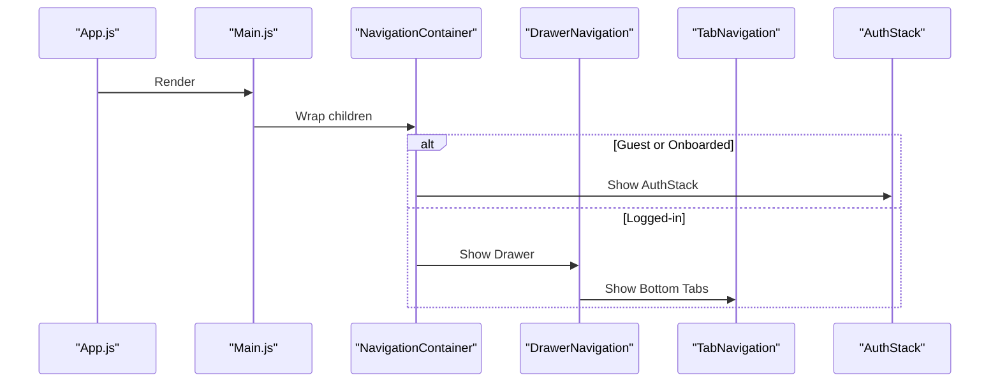
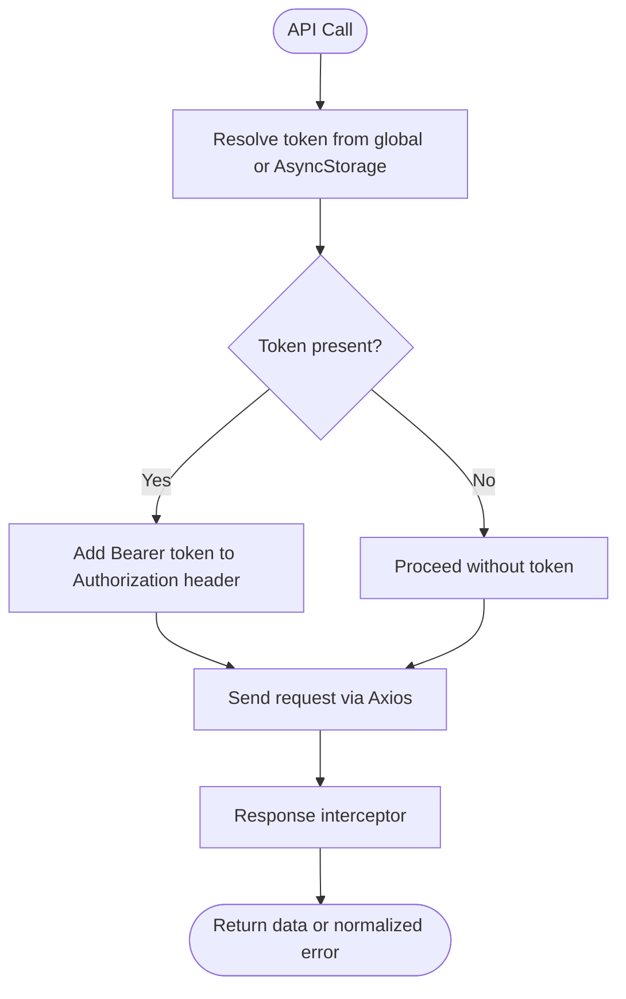
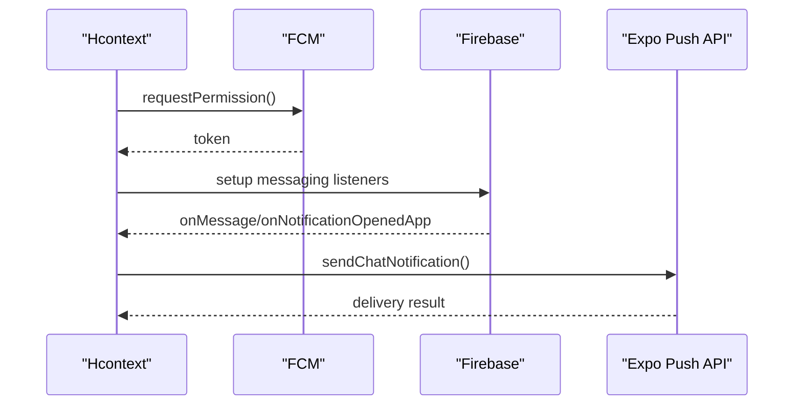
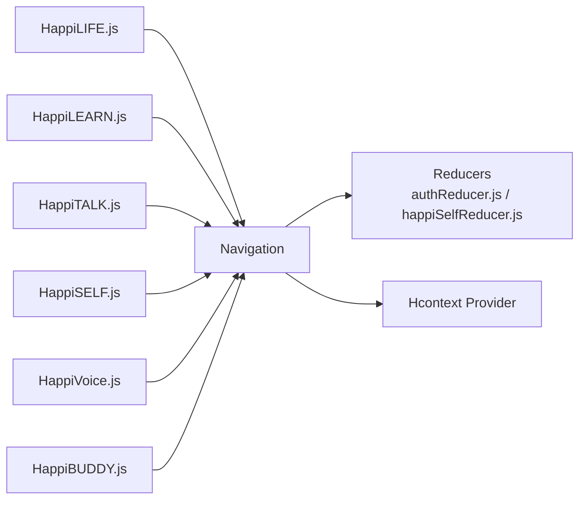
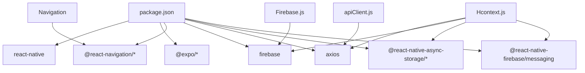

# Architecture Overview

<cite>
**Referenced Files in This Document**
- [App.js](file://App.js)
- [src/screens/Main.js](file://src/screens/Main.js)
- [src/context/Hcontext.js](file://src/context/Hcontext.js)
- [src/context/apiClient.js](file://src/context/apiClient.js)
- [src/context/Firebase.js](file://src/context/Firebase.js)
- [src/config/index.js](file://src/config/index.js)
- [src/routes/DrawerNavigation/index.js](file://src/routes/DrawerNavigation/index.js)
- [src/routes/TabNavigation/index.js](file://src/routes/TabNavigation/index.js)
- [src/routes/AuthStack/AuthStackScreen.js](file://src/routes/AuthStack/AuthStackScreen.js)
- [src/context/reducers/authReducer.js](file://src/context/reducers/authReducer.js)
- [src/context/reducers/happiSelfReducer.js](file://src/context/reducers/happiSelfReducer.js)
- [src/screens/HappiLIFE/HappiLIFE.js](file://src/screens/HappiLIFE/HappiLIFE.js)
- [src/screens/HappiLEARN/HappiLEARN.js](file://src/screens/HappiLEARN/HappiLEARN.js)
- [src/screens/HappiSELF/HappiSELF.js](file://src/screens/HappiSELF/HappiSELF.js)
- [src/screens/HappiTALK/HappiTALK.js](file://src/screens/HappiTALK/HappiTALK.js)
- [src/screens/HappiVOICE/HappiVoice.js](file://src/screens/HappiVOICE/HappiVoice.js)
- [src/screens/HappyBUDDY/HappiBUDDY.js](file://src/screens/HappyBUDDY/HappiBUDDY.js)
- [package.json](file://package.json)
</cite>

## Table of Contents
1. [Introduction](#introduction)
2. [Project Structure](#project-structure)
3. [Core Components](#core-components)
4. [Architecture Overview](#architecture-overview)
5. [Detailed Component Analysis](#detailed-component-analysis)
6. [Dependency Analysis](#dependency-analysis)
7. [Performance Considerations](#performance-considerations)
8. [Security Architecture](#security-architecture)
9. [Scalability Considerations](#scalability-considerations)
10. [Troubleshooting Guide](#troubleshooting-guide)
11. [Conclusion](#conclusion)

## Introduction
This document describes the HappiMynd application architecture built with React Native and Expo. The system follows a layered design with a strong emphasis on centralized state management via a Provider pattern (Hcontext), a robust navigation hierarchy using React Navigation, and modular service modules for distinct product domains. The architecture integrates Firebase for real-time capabilities and analytics, and Axios-based API clients for backend connectivity. The document explains data flow, component communication, state synchronization, system boundaries, and external integrations, along with performance, security, and scalability considerations.

## Project Structure
The project is organized by feature and layer:
- Presentation layer: React components and screens under src/screens organized by domain (e.g., HappiLIFE, HappiLEARN, HappiTALK, HappiSELF, HappiVOICE, HappiBUDDY).
- Business logic layer: Context providers and reducers under src/context.
- Data access layer: API client under src/context/apiClient.js.
- Integration layer: Firebase initialization and configuration under src/context/Firebase.js and src/config/index.js.
- Navigation layer: Stack, tab, and drawer navigators under src/routes.

**Diagram sources**
- [App.js:1-59](file://App.js#L1-L59)
- [src/screens/Main.js:1-172](file://src/screens/Main.js#L1-L172)
- [src/context/Hcontext.js:1-1551](file://src/context/Hcontext.js#L1-L1551)
- [src/context/apiClient.js:1-58](file://src/context/apiClient.js#L1-L58)
- [src/context/Firebase.js:1-52](file://src/context/Firebase.js#L1-L52)
- [src/config/index.js:1-13](file://src/config/index.js#L1-L13)
- [src/routes/DrawerNavigation/index.js:1-298](file://src/routes/DrawerNavigation/index.js#L1-L298)
- [src/routes/TabNavigation/index.js:1-83](file://src/routes/TabNavigation/index.js#L1-L83)
- [src/routes/AuthStack/AuthStackScreen.js:1-176](file://src/routes/AuthStack/AuthStackScreen.js#L1-L176)
- [src/context/reducers/authReducer.js:1-79](file://src/context/reducers/authReducer.js#L1-L79)
- [src/context/reducers/happiSelfReducer.js:1-45](file://src/context/reducers/happiSelfReducer.js#L1-L45)
- [src/screens/HappiLIFE/HappiLIFE.js:1-177](file://src/screens/HappiLIFE/HappiLIFE.js#L1-L177)
- [src/screens/HappiLEARN/HappiLEARN.js:1-262](file://src/screens/HappiLEARN/HappiLEARN.js#L1-L262)
- [src/screens/HappiTALK/HappiTALK.js:1-202](file://src/screens/HappiTALK/HappiTALK.js#L1-L202)
- [src/screens/HappiSELF/HappiSELF.js:1-173](file://src/screens/HappiSELF/HappiSELF.js#L1-L173)
- [src/screens/HappiVOICE/HappiVoice.js:1-213](file://src/screens/HappiVOICE/HappiVoice.js#L1-L213)
- [src/screens/HappyBUDDY/HappiBUDDY.js:1-164](file://src/screens/HappyBUDDY/HappiBUDDY.js#L1-L164)

**Section sources**
- [App.js:1-59](file://App.js#L1-L59)
- [src/screens/Main.js:1-172](file://src/screens/Main.js#L1-L172)
- [src/context/Hcontext.js:1-1551](file://src/context/Hcontext.js#L1-L1551)
- [src/context/apiClient.js:1-58](file://src/context/apiClient.js#L1-L58)
- [src/context/Firebase.js:1-52](file://src/context/Firebase.js#L1-L52)
- [src/config/index.js:1-13](file://src/config/index.js#L1-L13)
- [src/routes/DrawerNavigation/index.js:1-298](file://src/routes/DrawerNavigation/index.js#L1-L298)
- [src/routes/TabNavigation/index.js:1-83](file://src/routes/TabNavigation/index.js#L1-L83)
- [src/routes/AuthStack/AuthStackScreen.js:1-176](file://src/routes/AuthStack/AuthStackScreen.js#L1-L176)

## Core Components
- Provider Pattern (Hcontext): Centralized state and actions for authentication, subscriptions, notifications, HappiLEARN content, HappiSELF tasks, and voice integration. Uses useReducer for structured state slices and exposes async action methods for API and Firebase interactions.
- API Client: Axios instance with request/response interceptors to attach tokens from memory or AsyncStorage and normalize errors.
- Firebase Integration: Firestore initialization with long-polling fallback for RN and FCM messaging for push notifications.
- Navigation: Composite navigator hierarchy with AuthStack, Drawer, Bottom Tabs, and Stack screens per domain.
- Modular Screens: Domain-specific screens for HappiLIFE, HappiLEARN, HappiTALK, HappiSELF, HappiVOICE, HappiBUDDY, and shared components.

**Section sources**
- [src/context/Hcontext.js:1-1551](file://src/context/Hcontext.js#L1-L1551)
- [src/context/apiClient.js:1-58](file://src/context/apiClient.js#L1-L58)
- [src/context/Firebase.js:1-52](file://src/context/Firebase.js#L1-L52)
- [src/routes/DrawerNavigation/index.js:1-298](file://src/routes/DrawerNavigation/index.js#L1-L298)
- [src/routes/TabNavigation/index.js:1-83](file://src/routes/TabNavigation/index.js#L1-L83)
- [src/routes/AuthStack/AuthStackScreen.js:1-176](file://src/routes/AuthStack/AuthStackScreen.js#L1-L176)

## Architecture Overview
The system follows a multi-layered architecture:
- Presentation Layer: React components and screens organized by domain.
- Business Logic Layer: Hcontext provider orchestrates state transitions and exposes domain actions.
- Data Access Layer: apiClient handles HTTP requests and token injection.
- Integration Layer: Firebase and FCM for real-time and push notifications.
- Navigation Layer: React Navigation stacks, tabs, and drawers coordinate routing and UX.

**Diagram sources**
- [src/screens/Main.js:1-172](file://src/screens/Main.js#L1-L172)
- [src/context/Hcontext.js:1-1551](file://src/context/Hcontext.js#L1-L1551)
- [src/context/apiClient.js:1-58](file://src/context/apiClient.js#L1-L58)
- [src/context/Firebase.js:1-52](file://src/context/Firebase.js#L1-L52)

## Detailed Component Analysis

### Provider Pattern and State Management (Hcontext)
Hcontext centralizes state and actions:
- State slices: auth, white label, HappiSELF, snack.
- Reducers: authReducer, snackReducer, whiteLabelReducer, happiSelfReducer.
- Actions: authentication, profile updates, subscriptions, notifications, HappiLEARN content, voice integration, and more.
- Side effects: FCM token registration, listener setup, and Firebase storage operations.

**Diagram sources**
- [src/context/Hcontext.js:1-1551](file://src/context/Hcontext.js#L1-L1551)
- [src/context/reducers/authReducer.js:1-79](file://src/context/reducers/authReducer.js#L1-L79)
- [src/context/reducers/happiSelfReducer.js:1-45](file://src/context/reducers/happiSelfReducer.js#L1-L45)

**Section sources**
- [src/context/Hcontext.js:1-1551](file://src/context/Hcontext.js#L1-L1551)
- [src/context/reducers/authReducer.js:1-79](file://src/context/reducers/authReducer.js#L1-L79)
- [src/context/reducers/happiSelfReducer.js:1-45](file://src/context/reducers/happiSelfReducer.js#L1-L45)

### Navigation Architecture
The navigation hierarchy:
- AuthStack: Handles onboarding, login, registration, and verification flows.
- Drawer: Hosts bottom tabs and static pages (About, FAQ, Privacy, Contact, Settings).
- Bottom Tabs: Home, Explore Services, Notifications, Offers.

**Diagram sources**
- [App.js:1-59](file://App.js#L1-L59)
- [src/screens/Main.js:1-172](file://src/screens/Main.js#L1-L172)
- [src/routes/DrawerNavigation/index.js:1-298](file://src/routes/DrawerNavigation/index.js#L1-L298)
- [src/routes/TabNavigation/index.js:1-83](file://src/routes/TabNavigation/index.js#L1-L83)
- [src/routes/AuthStack/AuthStackScreen.js:1-176](file://src/routes/AuthStack/AuthStackScreen.js#L1-L176)

**Section sources**
- [src/routes/DrawerNavigation/index.js:1-298](file://src/routes/DrawerNavigation/index.js#L1-L298)
- [src/routes/TabNavigation/index.js:1-83](file://src/routes/TabNavigation/index.js#L1-L83)
- [src/routes/AuthStack/AuthStackScreen.js:1-176](file://src/routes/AuthStack/AuthStackScreen.js#L1-L176)

### Data Access Layer (API Client)
The apiClient:
- Sets base URL from config.
- Injects Authorization token from memory/global or AsyncStorage.
- Normalizes error responses for consistent handling.

**Diagram sources**
- [src/context/apiClient.js:1-58](file://src/context/apiClient.js#L1-L58)
- [src/config/index.js:1-13](file://src/config/index.js#L1-L13)

**Section sources**
- [src/context/apiClient.js:1-58](file://src/context/apiClient.js#L1-L58)
- [src/config/index.js:1-13](file://src/config/index.js#L1-L13)

### Integration Layer (Firebase and Push Notifications)
Firebase initialization and FCM:
- Firestore configured with long-polling fallback for RN.
- FCM token retrieval and listeners for foreground/background notifications.
- Push notification sending via Expo push endpoint.

**Diagram sources**
- [src/context/Hcontext.js:1-1551](file://src/context/Hcontext.js#L1-L1551)
- [src/context/Firebase.js:1-52](file://src/context/Firebase.js#L1-L52)

**Section sources**
- [src/context/Hcontext.js:1-1551](file://src/context/Hcontext.js#L1-L1551)
- [src/context/Firebase.js:1-52](file://src/context/Firebase.js#L1-L52)

### Modular Service Architecture
Domain modules are implemented as screens and integrated via navigation:
- HappiLIFE: Screening and awareness reporting.
- HappiLEARN: Content discovery and search.
- HappiTALK: Psychologist booking and verification.
- HappiSELF: Self-help tools and tasks.
- HappiVOICE: Voice assessment and Sonde integration.
- HappiBUDDY: Anonymous buddy chat.

**Diagram sources**
- [src/screens/HappiLIFE/HappiLIFE.js:1-177](file://src/screens/HappiLIFE/HappiLIFE.js#L1-L177)
- [src/screens/HappiLEARN/HappiLEARN.js:1-262](file://src/screens/HappiLEARN/HappiLEARN.js#L1-L262)
- [src/screens/HappiTALK/HappiTALK.js:1-202](file://src/screens/HappiTALK/HappiTALK.js#L1-L202)
- [src/screens/HappiSELF/HappiSELF.js:1-173](file://src/screens/HappiSELF/HappiSELF.js#L1-L173)
- [src/screens/HappiVOICE/HappiVoice.js:1-213](file://src/screens/HappiVOICE/HappiVoice.js#L1-L213)
- [src/screens/HappyBUDDY/HappiBUDDY.js:1-164](file://src/screens/HappyBUDDY/HappiBUDDY.js#L1-L164)
- [src/context/reducers/authReducer.js:1-79](file://src/context/reducers/authReducer.js#L1-L79)
- [src/context/reducers/happiSelfReducer.js:1-45](file://src/context/reducers/happiSelfReducer.js#L1-L45)
- [src/context/Hcontext.js:1-1551](file://src/context/Hcontext.js#L1-L1551)

**Section sources**
- [src/screens/HappiLIFE/HappiLIFE.js:1-177](file://src/screens/HappiLIFE/HappiLIFE.js#L1-L177)
- [src/screens/HappiLEARN/HappiLEARN.js:1-262](file://src/screens/HappiLEARN/HappiLEARN.js#L1-L262)
- [src/screens/HappiTALK/HappiTALK.js:1-202](file://src/screens/HappiTALK/HappiTALK.js#L1-L202)
- [src/screens/HappiSELF/HappiSELF.js:1-173](file://src/screens/HappiSELF/HappiSELF.js#L1-L173)
- [src/screens/HappiVOICE/HappiVoice.js:1-213](file://src/screens/HappiVOICE/HappiVoice.js#L1-L213)
- [src/screens/HappyBUDDY/HappiBUDDY.js:1-164](file://src/screens/HappyBUDDY/HappiBUDDY.js#L1-L164)

## Dependency Analysis
External dependencies include React Navigation, Firebase, Expo modules, and Axios. The provider depends on the API client and Firebase, while screens depend on the provider and navigation.

**Diagram sources**
- [package.json:1-101](file://package.json#L1-L101)
- [src/context/Hcontext.js:1-1551](file://src/context/Hcontext.js#L1-L1551)
- [src/context/apiClient.js:1-58](file://src/context/apiClient.js#L1-L58)
- [src/context/Firebase.js:1-52](file://src/context/Firebase.js#L1-L52)

**Section sources**
- [package.json:1-101](file://package.json#L1-L101)
- [src/context/Hcontext.js:1-1551](file://src/context/Hcontext.js#L1-L1551)
- [src/context/apiClient.js:1-58](file://src/context/apiClient.js#L1-L58)
- [src/context/Firebase.js:1-52](file://src/context/Firebase.js#L1-L52)

## Performance Considerations
- Token caching: apiClient caches tokens in memory to avoid repeated AsyncStorage reads.
- Mount guards: Screens use a mount guard hook to prevent state updates on unmounted components.
- Lazy navigation: AuthStack defers to Drawer only after onboarding and login.
- Responsive UI: Uses responsive units for layout stability across devices.
- Network timeouts: Axios client sets a 15-second timeout to prevent hanging requests.

**Section sources**
- [src/context/apiClient.js:1-58](file://src/context/apiClient.js#L1-L58)
- [src/screens/HappiLIFE/HappiLIFE.js:1-177](file://src/screens/HappiLIFE/HappiLIFE.js#L1-L177)
- [src/routes/AuthStack/AuthStackScreen.js:1-176](file://src/routes/AuthStack/AuthStackScreen.js#L1-L176)

## Security Architecture
- Root detection: App checks for jailbroken devices and displays a warning.
- Token management: Bearer tokens injected via apiClient interceptors; logout clears global token.
- Secure storage: AsyncStorage used for persisted user data; sensitive operations guarded.
- Push notifications: FCM tokens requested with runtime permission prompts; push messages handled securely.

**Section sources**
- [App.js:1-59](file://App.js#L1-L59)
- [src/context/apiClient.js:1-58](file://src/context/apiClient.js#L1-L58)
- [src/context/Hcontext.js:1-1551](file://src/context/Hcontext.js#L1-L1551)

## Scalability Considerations
- Modular screens: Each domain is a separate screen, enabling independent development and testing.
- Provider actions: Centralized actions reduce duplication and improve maintainability.
- Firebase long-polling: Ensures Firestore reliability on RN environments.
- Navigation composition: Drawer and Tabs isolate concerns and simplify scaling.

**Section sources**
- [src/context/Hcontext.js:1-1551](file://src/context/Hcontext.js#L1-L1551)
- [src/context/Firebase.js:1-52](file://src/context/Firebase.js#L1-L52)
- [src/routes/DrawerNavigation/index.js:1-298](file://src/routes/DrawerNavigation/index.js#L1-L298)

## Troubleshooting Guide
- Authentication errors: apiClient normalizes error responses; snack notifications surface user-facing messages.
- Network issues: apiClient logs request/response errors; adjust timeout or retry logic as needed.
- Notifications: Hcontext registers FCM permissions and listeners; verify token retrieval and listener setup.
- Firebase initialization: Long-polling fallback resolves backend connectivity issues in RN.

**Section sources**
- [src/context/apiClient.js:1-58](file://src/context/apiClient.js#L1-L58)
- [src/context/Hcontext.js:1-1551](file://src/context/Hcontext.js#L1-L1551)
- [src/context/Firebase.js:1-52](file://src/context/Firebase.js#L1-L52)

## Conclusion
HappiMynd employs a clean, layered architecture leveraging React Native and Expo. The Provider pattern (Hcontext) centralizes state and actions, while React Navigation composes AuthStack, Drawer, and Tabs for a cohesive UX. The Axios-based API client and Firebase integration provide robust data access and real-time capabilities. The modular screen design supports scalable development across HappiLIFE, HappiLEARN, HappiTALK, HappiSELF, HappiVOICE, and HappiBUDDY domains. With thoughtful performance, security, and scalability practices, the system is well-positioned for growth and maintenance.