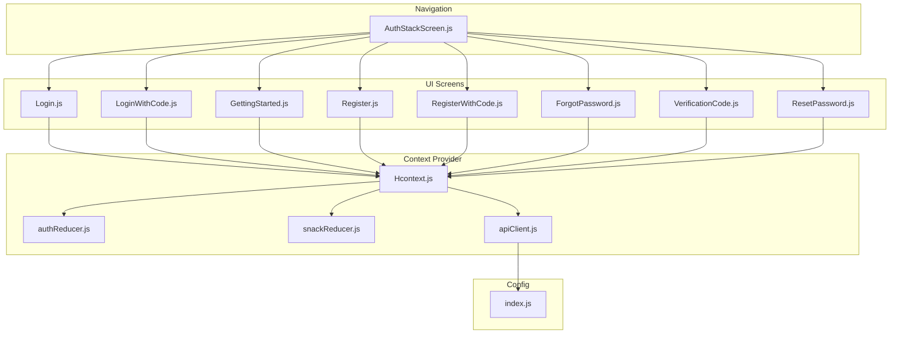
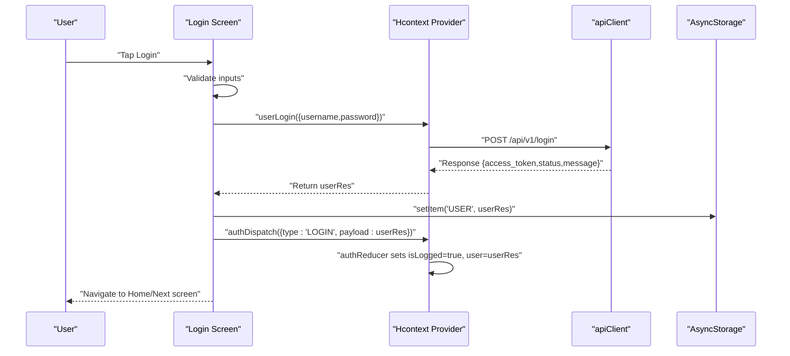
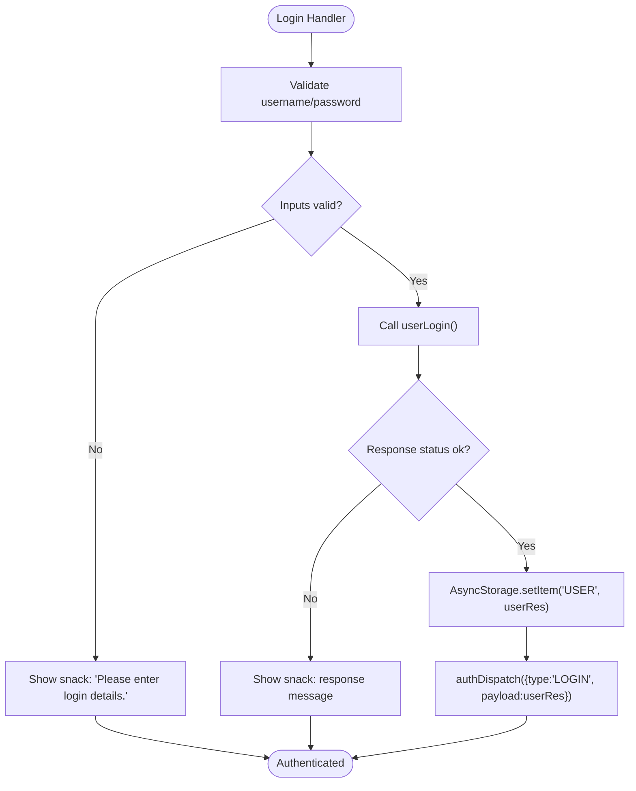
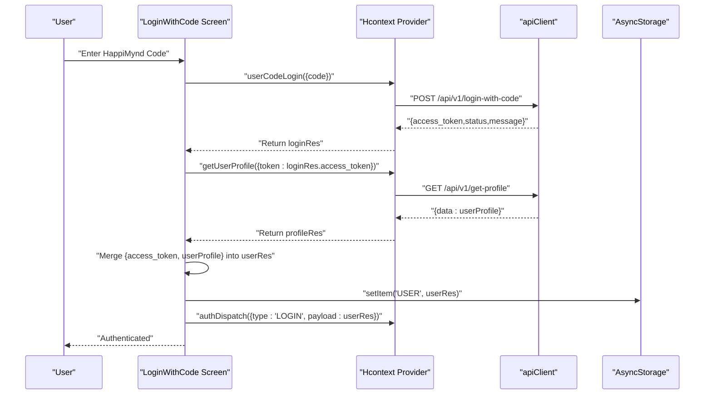
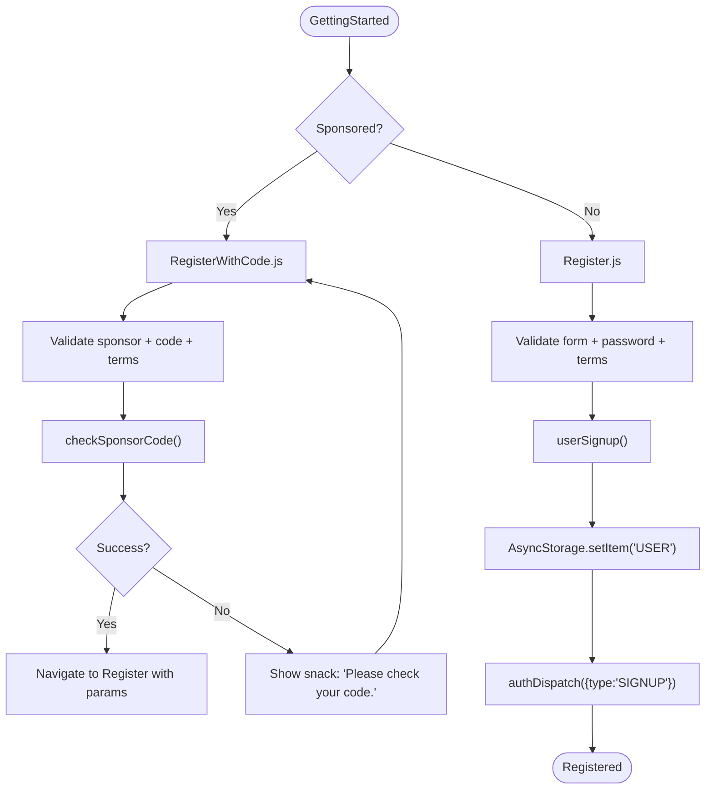
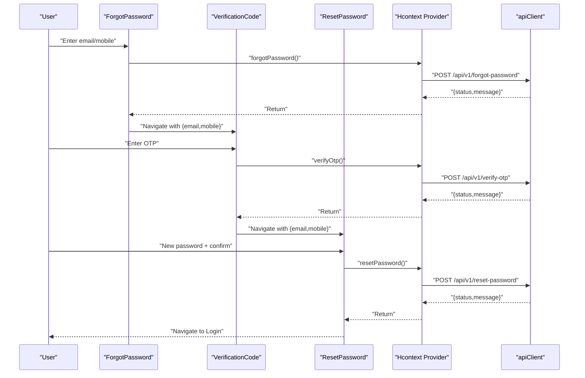
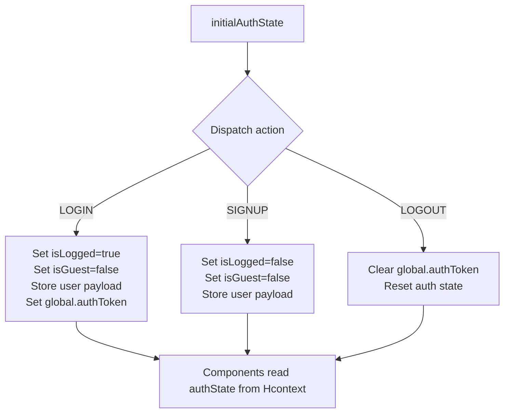
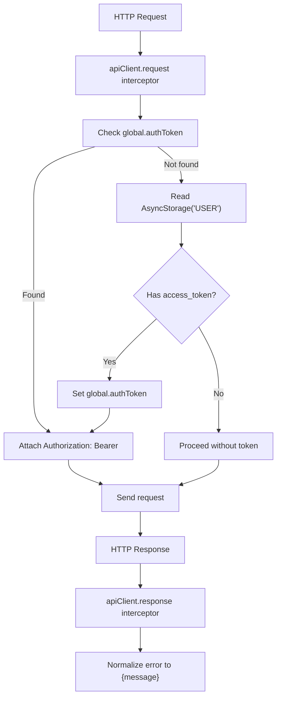
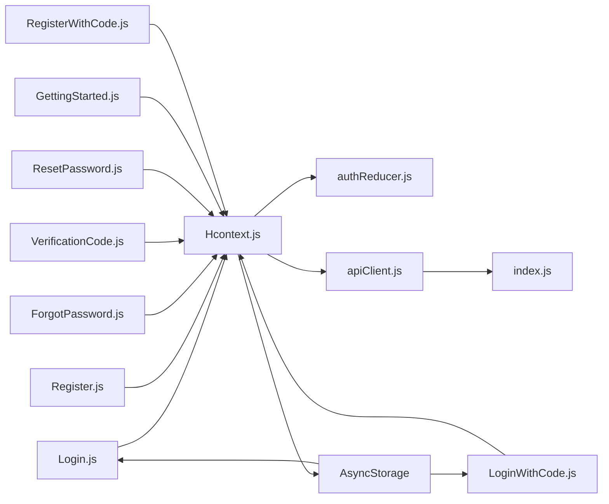

# Authentication Flow

<cite>
**Referenced Files in This Document**
- [authReducer.js](file://src/context/reducers/authReducer.js)
- [Hcontext.js](file://src/context/Hcontext.js)
- [apiClient.js](file://src/context/apiClient.js)
- [Login.js](file://src/screens/Auth/Login.js)
- [LoginWithCode.js](file://src/screens/Auth/LoginWithCode.js)
- [ForgotPassword.js](file://src/screens/Auth/ForgotPassword.js)
- [VerificationCode.js](file://src/screens/Auth/VerificationCode.js)
- [ResetPassword.js](file://src/screens/Auth/ResetPassword.js)
- [GettingStarted.js](file://src/screens/Auth/GettingStarted.js)
- [Register.js](file://src/screens/Auth/Register.js)
- [RegisterWithCode.js](file://src/screens/Auth/RegisterWithCode.js)
- [AuthStackScreen.js](file://src/routes/AuthStack/AuthStackScreen.js)
- [snackReducer.js](file://src/context/reducers/snackReducer.js)
- [index.js](file://src/config/index.js)
</cite>

## Table of Contents
1. [Introduction](#introduction)
2. [Project Structure](#project-structure)
3. [Core Components](#core-components)
4. [Architecture Overview](#architecture-overview)
5. [Detailed Component Analysis](#detailed-component-analysis)
6. [Dependency Analysis](#dependency-analysis)
7. [Performance Considerations](#performance-considerations)
8. [Troubleshooting Guide](#troubleshooting-guide)
9. [Conclusion](#conclusion)

## Introduction
This document explains the authentication flow system in HappiMynd. It covers the end-to-end user journey from login to authenticated state, including form validation, error handling, and success redirection. It also details the integration between UI components and the context provider, the state management using authReducer, the implementation of userLogin, token handling, and AsyncStorage integration for persistent authentication. Common scenarios such as invalid credentials, network errors, and session timeouts are addressed, along with troubleshooting guidance and user experience considerations.

## Project Structure
Authentication spans several layers:
- UI screens under src/screens/Auth implement login, registration, password reset, and related flows.
- The Hcontext provider in src/context/Hcontext.js exposes authentication actions and manages global state.
- The authReducer in src/context/reducers/authReducer.js defines the auth state machine.
- The apiClient in src/context/apiClient.js centralizes HTTP requests and token injection.
- The AuthStack in src/routes/AuthStack/AuthStackScreen.js orchestrates navigation for auth-related screens.

**Diagram sources**
- [Login.js:1-271](file://src/screens/Auth/Login.js#L1-L271)
- [LoginWithCode.js:1-237](file://src/screens/Auth/LoginWithCode.js#L1-L237)
- [GettingStarted.js:1-156](file://src/screens/Auth/GettingStarted.js#L1-L156)
- [Register.js:1-474](file://src/screens/Auth/Register.js#L1-L474)
- [RegisterWithCode.js:1-273](file://src/screens/Auth/RegisterWithCode.js#L1-L273)
- [ForgotPassword.js:1-116](file://src/screens/Auth/ForgotPassword.js#L1-L116)
- [VerificationCode.js:1-143](file://src/screens/Auth/VerificationCode.js#L1-L143)
- [ResetPassword.js:1-130](file://src/screens/Auth/ResetPassword.js#L1-L130)
- [Hcontext.js:1-800](file://src/context/Hcontext.js#L1-L800)
- [authReducer.js:1-79](file://src/context/reducers/authReducer.js#L1-L79)
- [snackReducer.js:1-16](file://src/context/reducers/snackReducer.js#L1-L16)
- [apiClient.js:1-58](file://src/context/apiClient.js#L1-L58)
- [AuthStackScreen.js:1-176](file://src/routes/AuthStack/AuthStackScreen.js#L1-L176)
- [index.js:1-13](file://src/config/index.js#L1-L13)

**Section sources**
- [AuthStackScreen.js:39-58](file://src/routes/AuthStack/AuthStackScreen.js#L39-L58)
- [Hcontext.js:26-41](file://src/context/Hcontext.js#L26-L41)

## Core Components
- Hcontext provider: Exposes userLogin, userCodeLogin, userLogout, and other auth-related actions. Manages auth state via useReducer and persists user data to AsyncStorage.
- authReducer: Defines the auth state shape and transitions for LOGIN, SIGNUP, LOGOUT, and other flags.
- apiClient: Centralized HTTP client with request/response interceptors that attach Bearer tokens and normalize errors.
- UI screens: Implement form validation, user interactions, and navigation after successful authentication.

Key responsibilities:
- Login.js: Validates inputs, calls userLogin, stores user data in AsyncStorage, and dispatches LOGIN to authReducer.
- LoginWithCode.js: Authenticates via code, retrieves profile, merges access_token and user data, stores in AsyncStorage, and logs in.
- Register.js: Validates registration form, calls userSignup, stores user data, and dispatches SIGNUP.
- ForgotPassword.js, VerificationCode.js, ResetPassword.js: Password reset flow with OTP verification and redirection.
- GettingStarted.js and RegisterWithCode.js: Alternative registration pathways (self-sponsored vs. organization-sponsored).

**Section sources**
- [Hcontext.js:129-145](file://src/context/Hcontext.js#L129-L145)
- [Hcontext.js:147-162](file://src/context/Hcontext.js#L147-L162)
- [Hcontext.js:164-172](file://src/context/Hcontext.js#L164-L172)
- [authReducer.js:5-15](file://src/context/reducers/authReducer.js#L5-L15)
- [authReducer.js:17-77](file://src/context/reducers/authReducer.js#L17-L77)
- [apiClient.js:11-44](file://src/context/apiClient.js#L11-L44)
- [apiClient.js:46-56](file://src/context/apiClient.js#L46-L56)
- [Login.js:44-74](file://src/screens/Auth/Login.js#L44-L74)
- [LoginWithCode.js:42-78](file://src/screens/Auth/LoginWithCode.js#L42-L78)
- [Register.js:87-184](file://src/screens/Auth/Register.js#L87-L184)
- [ForgotPassword.js:31-52](file://src/screens/Auth/ForgotPassword.js#L31-L52)
- [VerificationCode.js:35-58](file://src/screens/Auth/VerificationCode.js#L35-L58)
- [ResetPassword.js:36-72](file://src/screens/Auth/ResetPassword.js#L36-L72)
- [GettingStarted.js:54-66](file://src/screens/Auth/GettingStarted.js#L54-L66)
- [RegisterWithCode.js:63-104](file://src/screens/Auth/RegisterWithCode.js#L63-L104)

## Architecture Overview
The authentication flow integrates UI, context, reducer, and HTTP client:

**Diagram sources**
- [Login.js:44-74](file://src/screens/Auth/Login.js#L44-L74)
- [Hcontext.js:129-145](file://src/context/Hcontext.js#L129-L145)
- [apiClient.js:11-44](file://src/context/apiClient.js#L11-L44)
- [authReducer.js:17-30](file://src/context/reducers/authReducer.js#L17-L30)

## Detailed Component Analysis

### Login Screen
- Responsibilities:
  - Validate presence of username and password.
  - Call userLogin from Hcontext.
  - Persist user data to AsyncStorage.
  - Dispatch LOGIN action to update auth state.
- Error handling:
  - Shows snack messages for missing inputs.
  - Catches and logs errors from userLogin.
- Navigation:
  - After successful login, the app proceeds based on onboarding state in AuthStack.

**Diagram sources**
- [Login.js:44-74](file://src/screens/Auth/Login.js#L44-L74)
- [Hcontext.js:129-145](file://src/context/Hcontext.js#L129-L145)

**Section sources**
- [Login.js:44-74](file://src/screens/Auth/Login.js#L44-L74)
- [Login.js:31-169](file://src/screens/Auth/Login.js#L31-L169)

### Login With Code
- Responsibilities:
  - Validate code presence.
  - Call userCodeLogin to authenticate.
  - Fetch user profile using access_token.
  - Merge access_token and profile into userRes.
  - Persist to AsyncStorage and dispatch LOGIN.
- Error handling:
  - Specialized snack messages for invalid code.
  - General error propagation via catch blocks.

**Diagram sources**
- [LoginWithCode.js:42-78](file://src/screens/Auth/LoginWithCode.js#L42-L78)
- [Hcontext.js:147-162](file://src/context/Hcontext.js#L147-L162)
- [Hcontext.js:293-301](file://src/context/Hcontext.js#L293-L301)

**Section sources**
- [LoginWithCode.js:42-78](file://src/screens/Auth/LoginWithCode.js#L42-L78)

### Registration Flow
- GettingStarted.js:
  - Routes to Register or RegisterWithCode depending on user selection.
- Register.js:
  - Validates form fields, password match, minimum length, and terms agreement.
  - Calls userSignup, persists user data, and dispatches SIGNUP.
- RegisterWithCode.js:
  - Validates sponsor selection and code.
  - Calls checkSponsorCode and navigates to Register with metadata for sponsored sign-up.

**Diagram sources**
- [GettingStarted.js:54-66](file://src/screens/Auth/GettingStarted.js#L54-L66)
- [RegisterWithCode.js:63-104](file://src/screens/Auth/RegisterWithCode.js#L63-L104)
- [Register.js:87-184](file://src/screens/Auth/Register.js#L87-L184)

**Section sources**
- [GettingStarted.js:54-66](file://src/screens/Auth/GettingStarted.js#L54-L66)
- [RegisterWithCode.js:63-104](file://src/screens/Auth/RegisterWithCode.js#L63-L104)
- [Register.js:87-184](file://src/screens/Auth/Register.js#L87-L184)

### Password Reset Flow
- ForgotPassword.js:
  - Validates email or mobile, calls forgotPassword, and navigates to VerificationCode.
- VerificationCode.js:
  - Validates OTP, calls verifyOtp, and on success navigates to ResetPassword.
- ResetPassword.js:
  - Validates passwords match, calls resetPassword, and navigates to Login.

**Diagram sources**
- [ForgotPassword.js:31-52](file://src/screens/Auth/ForgotPassword.js#L31-L52)
- [VerificationCode.js:35-58](file://src/screens/Auth/VerificationCode.js#L35-L58)
- [ResetPassword.js:36-72](file://src/screens/Auth/ResetPassword.js#L36-L72)
- [Hcontext.js:325-341](file://src/context/Hcontext.js#L325-L341)
- [Hcontext.js:343-359](file://src/context/Hcontext.js#L343-L359)
- [Hcontext.js:361-380](file://src/context/Hcontext.js#L361-L380)

**Section sources**
- [ForgotPassword.js:31-52](file://src/screens/Auth/ForgotPassword.js#L31-L52)
- [VerificationCode.js:35-58](file://src/screens/Auth/VerificationCode.js#L35-L58)
- [ResetPassword.js:36-72](file://src/screens/Auth/ResetPassword.js#L36-L72)

### State Management with authReducer
- Initial state includes flags for logged-in status, guest mode, onboarding, screening completion, and user data.
- Actions:
  - LOGIN: Sets isLogged=true, isGuest=false, and stores user payload.
  - SIGNUP: Sets isLogged=false, isGuest=false, and stores user payload.
  - LOGOUT: Clears global token and resets auth state.
- Token handling:
  - On LOGIN, access_token is stored in global.authToken for immediate use by apiClient interceptors.
  - On LOGOUT, global.authToken is cleared.

**Diagram sources**
- [authReducer.js:5-15](file://src/context/reducers/authReducer.js#L5-L15)
- [authReducer.js:17-30](file://src/context/reducers/authReducer.js#L17-L30)
- [authReducer.js:65-74](file://src/context/reducers/authReducer.js#L65-L74)

**Section sources**
- [authReducer.js:5-15](file://src/context/reducers/authReducer.js#L5-L15)
- [authReducer.js:17-77](file://src/context/reducers/authReducer.js#L17-L77)

### Token Handling and AsyncStorage Integration
- apiClient request interceptor:
  - Attempts to read token from global.authToken or authState.user.access_token.
  - Falls back to AsyncStorage ("USER" item) and caches token in global.authToken.
  - Attaches Authorization: Bearer header if token exists.
- apiClient response interceptor:
  - Normalizes errors to include message for consistent handling.
- AsyncStorage usage:
  - Login.js and LoginWithCode.js persist userRes immediately upon successful authentication.
  - apiClient interceptor reads AsyncStorage to populate token when global is unavailable.

**Diagram sources**
- [apiClient.js:11-44](file://src/context/apiClient.js#L11-L44)
- [apiClient.js:46-56](file://src/context/apiClient.js#L46-L56)
- [Login.js:65-69](file://src/screens/Auth/Login.js#L65-L69)
- [LoginWithCode.js:70-73](file://src/screens/Auth/LoginWithCode.js#L70-L73)

**Section sources**
- [apiClient.js:11-44](file://src/context/apiClient.js#L11-L44)
- [apiClient.js:46-56](file://src/context/apiClient.js#L46-L56)
- [Login.js:65-69](file://src/screens/Auth/Login.js#L65-L69)
- [LoginWithCode.js:70-73](file://src/screens/Auth/LoginWithCode.js#L70-L73)

### Navigation Triggers
- AuthStackScreen sets initialRouteName based on onboarding state.
- Successful login or registration triggers navigation to appropriate screens after state updates.
- Password reset flow navigates through ForgotPassword -> VerificationCode -> ResetPassword -> Login.

**Section sources**
- [AuthStackScreen.js:39-58](file://src/routes/AuthStack/AuthStackScreen.js#L39-L58)
- [ForgotPassword.js:44-47](file://src/screens/Auth/ForgotPassword.js#L44-L47)
- [VerificationCode.js:51-53](file://src/screens/Auth/VerificationCode.js#L51-L53)
- [ResetPassword.js:64-67](file://src/screens/Auth/ResetPassword.js#L64-L67)

## Dependency Analysis
- UI screens depend on Hcontext for actions and state.
- Hcontext depends on:
  - authReducer for state transitions.
  - apiClient for HTTP communication.
  - AsyncStorage for persistence.
- apiClient depends on config.BASE_URL for base URL and AsyncStorage for token retrieval fallback.
- AuthStack orchestrates navigation among auth screens.

**Diagram sources**
- [Login.js:31-34](file://src/screens/Auth/Login.js#L31-L34)
- [LoginWithCode.js:30-33](file://src/screens/Auth/LoginWithCode.js#L30-L33)
- [Register.js:35-45](file://src/screens/Auth/Register.js#L35-L45)
- [ForgotPassword.js:23-24](file://src/screens/Auth/ForgotPassword.js#L23-L24)
- [VerificationCode.js:23-24](file://src/screens/Auth/VerificationCode.js#L23-L24)
- [ResetPassword.js:23-24](file://src/screens/Auth/ResetPassword.js#L23-L24)
- [GettingStarted.js:18](file://src/screens/Auth/GettingStarted.js#L18)
- [RegisterWithCode.js:33-35](file://src/screens/Auth/RegisterWithCode.js#L33-L35)
- [Hcontext.js:12-23](file://src/context/Hcontext.js#L12-L23)
- [apiClient.js:1-9](file://src/context/apiClient.js#L1-L9)
- [index.js:1-13](file://src/config/index.js#L1-L13)

**Section sources**
- [Hcontext.js:12-23](file://src/context/Hcontext.js#L12-L23)
- [apiClient.js:1-9](file://src/context/apiClient.js#L1-L9)
- [index.js:1-13](file://src/config/index.js#L1-L13)

## Performance Considerations
- Token caching: apiClient caches access_token in global.authToken to avoid repeated AsyncStorage reads.
- Timeout configuration: apiClient sets a 15-second timeout to prevent hanging requests.
- Minimal re-renders: authReducer updates only necessary fields; avoid unnecessary deep merges.
- Network error normalization: apiClient.response interceptor ensures consistent error objects for snack handling.

[No sources needed since this section provides general guidance]

## Troubleshooting Guide
Common issues and resolutions:
- Invalid credentials:
  - Symptom: Snack shows login failure message.
  - Resolution: Ensure username/password are correct; verify network connectivity.
  - Evidence: userLogin catches and shows snack on error.
- Invalid HappiMynd code:
  - Symptom: Snack shows "Invalid code. Please check again."
  - Resolution: Prompt user to re-enter the code; ensure code validity.
  - Evidence: userCodeLogin and LoginWithCode handle invalid code.
- Missing inputs:
  - Symptom: Snack prompts to fill required fields.
  - Resolution: Validate fields before submission in each screen’s handler.
  - Evidence: Login, Register, VerificationCode, ResetPassword handlers check inputs.
- Network errors and timeouts:
  - Symptom: Requests fail with generic messages or hang.
  - Resolution: Confirm network availability; retry; inspect response interceptor for normalized messages.
  - Evidence: apiClient.response interceptor normalizes errors; apiClient.timeout is set.
- Session timeout or token expiry:
  - Symptom: Subsequent requests fail with 401/invalid token.
  - Resolution: Clear persisted user data and force re-authentication; ensure LOGOUT clears global token.
  - Evidence: authReducer LOGOUT clears global.authToken and resets auth state.

**Section sources**
- [Login.js:50-63](file://src/screens/Auth/Login.js#L50-L63)
- [LoginWithCode.js:50-60](file://src/screens/Auth/LoginWithCode.js#L50-L60)
- [Register.js:97-134](file://src/screens/Auth/Register.js#L97-L134)
- [VerificationCode.js:38-44](file://src/screens/Auth/VerificationCode.js#L38-L44)
- [ResetPassword.js:40-54](file://src/screens/Auth/ResetPassword.js#L40-L54)
- [apiClient.js:46-56](file://src/context/apiClient.js#L46-L56)
- [authReducer.js:65-74](file://src/context/reducers/authReducer.js#L65-L74)

## Conclusion
HappiMynd’s authentication system combines robust UI flows, centralized context actions, a predictable reducer state machine, and a resilient HTTP client with token caching and AsyncStorage persistence. The design supports multiple authentication pathways (username/password, code-based, and password reset), enforces validation at the UI level, and normalizes error handling through snack notifications. Following the patterns documented here ensures consistent behavior across login, registration, and recovery flows.