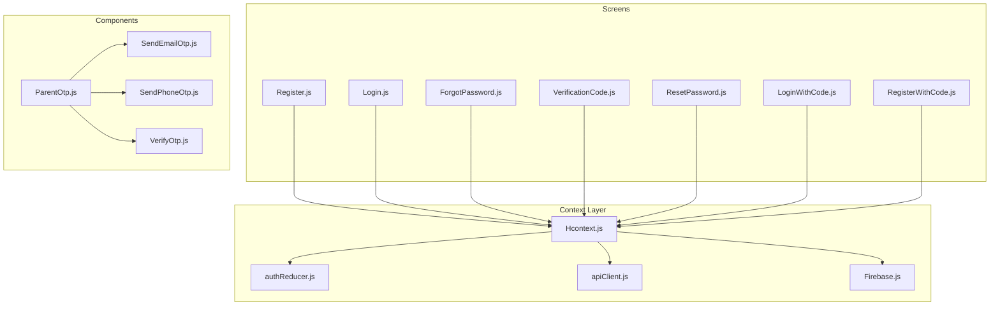
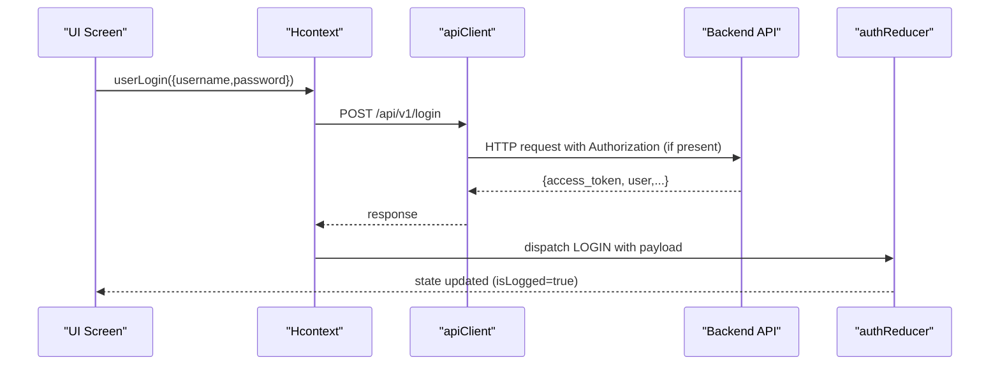
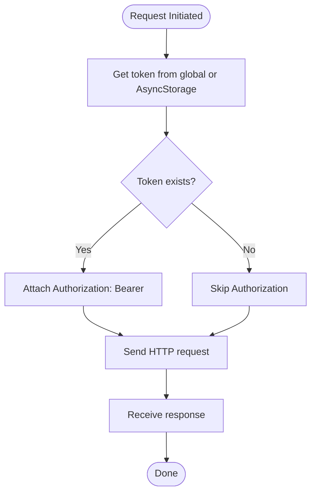
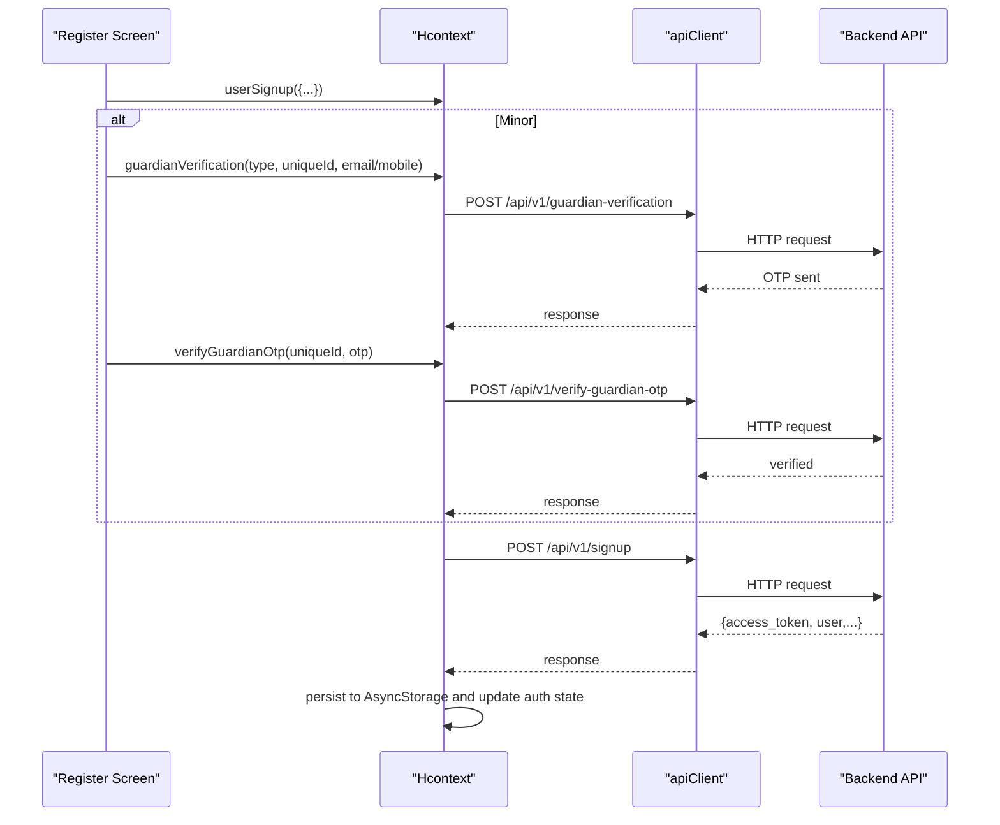
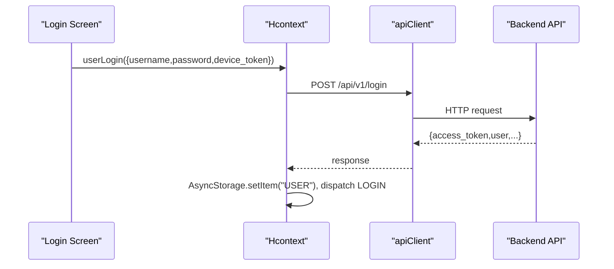
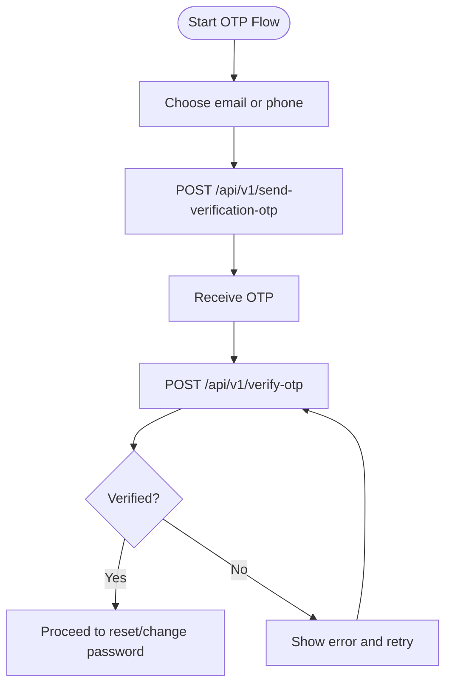
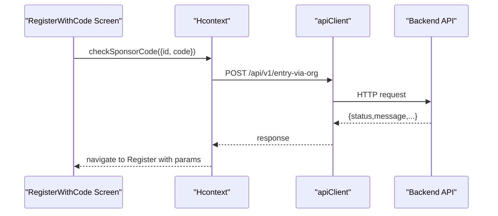
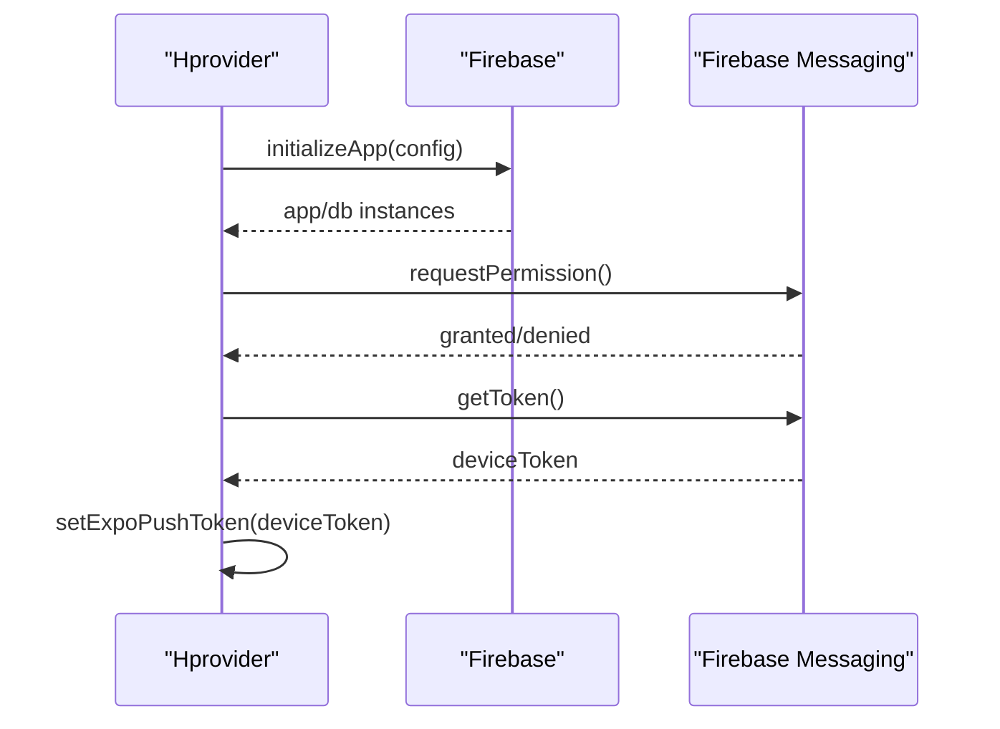
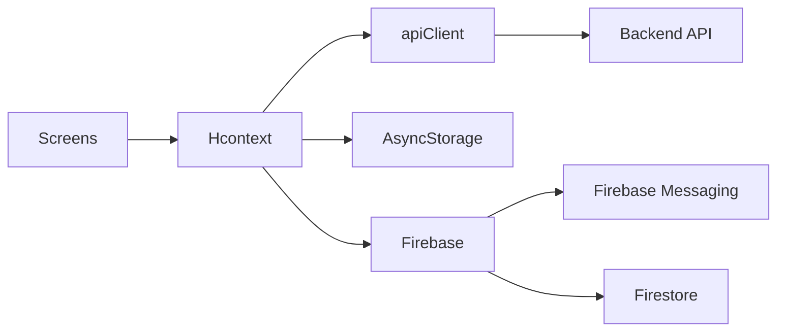

# Authentication System

<cite>
**Referenced Files in This Document**
- [Firebase.js](file://src/context/Firebase.js)
- [Hcontext.js](file://src/context/Hcontext.js)
- [apiClient.js](file://src/context/apiClient.js)
- [authReducer.js](file://src/context/reducers/authReducer.js)
- [Register.js](file://src/screens/Auth/Register.js)
- [Login.js](file://src/screens/Auth/Login.js)
- [ForgotPassword.js](file://src/screens/Auth/ForgotPassword.js)
- [VerificationCode.js](file://src/screens/Auth/VerificationCode.js)
- [ResetPassword.js](file://src/screens/Auth/ResetPassword.js)
- [LoginWithCode.js](file://src/screens/Auth/LoginWithCode.js)
- [RegisterWithCode.js](file://src/screens/Auth/RegisterWithCode.js)
- [SendEmailOtp.js](file://src/components/input/SendEmailOtp.js)
- [SendPhoneOtp.js](file://src/components/input/SendPhoneOtp.js)
- [VerifyOtp.js](file://src/components/input/VerifyOtp.js)
- [ParentOtp.js](file://src/components/common/ParentOtp.js)
- [AuthStackScreen.js](file://src/routes/AuthStack/AuthStackScreen.js)
</cite>

## Table of Contents
1. [Introduction](#introduction)
2. [Project Structure](#project-structure)
3. [Core Components](#core-components)
4. [Architecture Overview](#architecture-overview)
5. [Detailed Component Analysis](#detailed-component-analysis)
6. [Dependency Analysis](#dependency-analysis)
7. [Performance Considerations](#performance-considerations)
8. [Troubleshooting Guide](#troubleshooting-guide)
9. [Conclusion](#conclusion)

## Introduction
This document describes HappiMynd’s authentication and authorization framework. It covers the complete authentication lifecycle from registration through login verification, including multi-factor approaches (email verification, phone OTP verification), password reset mechanisms, JWT-based authentication with token propagation, user registration with profile creation and consent, session management, and integration with Firebase for real-time user state synchronization. It also outlines security measures, error handling strategies, and user experience considerations.

## Project Structure
The authentication system spans three primary areas:
- Context and API layer: centralized state and HTTP client with interceptors
- Screens: user-facing flows for registration, login, verification, and password reset
- Components: reusable UI elements for OTP and verification

**Diagram sources**
- [Hcontext.js:1-800](file://src/context/Hcontext.js#L1-L800)
- [apiClient.js:1-58](file://src/context/apiClient.js#L1-L58)
- [authReducer.js:1-79](file://src/context/reducers/authReducer.js#L1-L79)
- [Firebase.js:1-52](file://src/context/Firebase.js#L1-L52)
- [Register.js:1-474](file://src/screens/Auth/Register.js#L1-L474)
- [Login.js:1-271](file://src/screens/Auth/Login.js#L1-L271)
- [ForgotPassword.js:1-116](file://src/screens/Auth/ForgotPassword.js#L1-L116)
- [VerificationCode.js:1-143](file://src/screens/Auth/VerificationCode.js#L1-L143)
- [ResetPassword.js:1-130](file://src/screens/Auth/ResetPassword.js#L1-L130)
- [LoginWithCode.js:1-237](file://src/screens/Auth/LoginWithCode.js#L1-L237)
- [RegisterWithCode.js:1-273](file://src/screens/Auth/RegisterWithCode.js#L1-L273)
- [ParentOtp.js:1-139](file://src/components/common/ParentOtp.js#L1-L139)
- [SendEmailOtp.js:1-96](file://src/components/input/SendEmailOtp.js#L1-L96)
- [SendPhoneOtp.js:1-106](file://src/components/input/SendPhoneOtp.js#L1-L106)
- [VerifyOtp.js:1-57](file://src/components/input/VerifyOtp.js#L1-L57)

**Section sources**
- [Hcontext.js:1-800](file://src/context/Hcontext.js#L1-L800)
- [apiClient.js:1-58](file://src/context/apiClient.js#L1-L58)
- [authReducer.js:1-79](file://src/context/reducers/authReducer.js#L1-L79)
- [Firebase.js:1-52](file://src/context/Firebase.js#L1-L52)
- [Register.js:1-474](file://src/screens/Auth/Register.js#L1-L474)
- [Login.js:1-271](file://src/screens/Auth/Login.js#L1-L271)
- [ForgotPassword.js:1-116](file://src/screens/Auth/ForgotPassword.js#L1-L116)
- [VerificationCode.js:1-143](file://src/screens/Auth/VerificationCode.js#L1-L143)
- [ResetPassword.js:1-130](file://src/screens/Auth/ResetPassword.js#L1-L130)
- [LoginWithCode.js:1-237](file://src/screens/Auth/LoginWithCode.js#L1-L237)
- [RegisterWithCode.js:1-273](file://src/screens/Auth/RegisterWithCode.js#L1-L273)
- [ParentOtp.js:1-139](file://src/components/common/ParentOtp.js#L1-L139)
- [SendEmailOtp.js:1-96](file://src/components/input/SendEmailOtp.js#L1-L96)
- [SendPhoneOtp.js:1-106](file://src/components/input/SendPhoneOtp.js#L1-L106)
- [VerifyOtp.js:1-57](file://src/components/input/VerifyOtp.js#L1-L57)

## Core Components
- Hcontext: Centralized authentication and API orchestration, including login, signup, OTP verification, password reset, and profile operations. Manages device token and integrates Firebase Messaging.
- apiClient: Axios instance with request/response interceptors that attach Bearer tokens from global or AsyncStorage and standardize error responses.
- authReducer: Redux-style reducer managing logged-in state, guest mode, onboarded flags, and user metadata.
- Firebase: Initializes Firestore and Firebase Messaging for real-time capabilities and push notifications.
- Screens: Registration, login, forgot password, verification code, reset password, login with code, and register with code flows.
- Components: OTP input helpers for email, phone, and verification UI.

Key responsibilities:
- Token propagation via Authorization header
- Local persistence of user data
- Multi-factor verification for minors
- Password reset via email/phone OTP
- Device token collection for push notifications

**Section sources**
- [Hcontext.js:129-172](file://src/context/Hcontext.js#L129-L172)
- [apiClient.js:11-56](file://src/context/apiClient.js#L11-L56)
- [authReducer.js:5-79](file://src/context/reducers/authReducer.js#L5-L79)
- [Firebase.js:14-51](file://src/context/Firebase.js#L14-L51)
- [Register.js:87-184](file://src/screens/Auth/Register.js#L87-L184)
- [Login.js:44-74](file://src/screens/Auth/Login.js#L44-L74)
- [ForgotPassword.js:31-52](file://src/screens/Auth/ForgotPassword.js#L31-L52)
- [VerificationCode.js:35-72](file://src/screens/Auth/VerificationCode.js#L35-L72)
- [ResetPassword.js:36-72](file://src/screens/Auth/ResetPassword.js#L36-L72)
- [LoginWithCode.js:43-78](file://src/screens/Auth/LoginWithCode.js#L43-L78)
- [RegisterWithCode.js:63-104](file://src/screens/Auth/RegisterWithCode.js#L63-L104)
- [ParentOtp.js:43-70](file://src/components/common/ParentOtp.js#L43-L70)

## Architecture Overview
The authentication architecture follows a layered pattern:
- UI Screens trigger actions via Hcontext methods
- Hcontext composes API calls to the backend and updates authReducer state
- apiClient injects Authorization headers and normalizes errors
- Firebase initializes Firestore and Messaging for real-time features

**Diagram sources**
- [Login.js:44-74](file://src/screens/Auth/Login.js#L44-L74)
- [Hcontext.js:129-145](file://src/context/Hcontext.js#L129-L145)
- [apiClient.js:11-44](file://src/context/apiClient.js#L11-L44)
- [authReducer.js:17-30](file://src/context/reducers/authReducer.js#L17-L30)

## Detailed Component Analysis

### JWT-Based Authentication and Token Management
- Token injection: apiClient attaches Bearer token from global or AsyncStorage on every request.
- Token caching: Hcontext sets a global token after login/signup and authReducer persists user payload.
- Logout: Hcontext clears the global token and resets auth state.

**Diagram sources**
- [apiClient.js:11-44](file://src/context/apiClient.js#L11-L44)
- [Hcontext.js:17-30](file://src/context/Hcontext.js#L17-L30)
- [authReducer.js:65-74](file://src/context/reducers/authReducer.js#L65-L74)

**Section sources**
- [apiClient.js:11-56](file://src/context/apiClient.js#L11-L56)
- [Hcontext.js:17-30](file://src/context/Hcontext.js#L17-L30)
- [authReducer.js:17-30](file://src/context/reducers/authReducer.js#L17-L30)

### User Registration Flow
- Registration collects profile type, age, gender, username, password, consent, and optional referral code.
- Minors (<18) require parent/guardian OTP verification before enabling registration.
- On success, user data is persisted locally and auth state is updated.

**Diagram sources**
- [Register.js:87-184](file://src/screens/Auth/Register.js#L87-L184)
- [ParentOtp.js:43-70](file://src/components/common/ParentOtp.js#L43-L70)
- [Hcontext.js:239-264](file://src/context/Hcontext.js#L239-L264)
- [Hcontext.js:174-202](file://src/context/Hcontext.js#L174-L202)

**Section sources**
- [Register.js:87-184](file://src/screens/Auth/Register.js#L87-L184)
- [ParentOtp.js:43-70](file://src/components/common/ParentOtp.js#L43-L70)
- [Hcontext.js:174-202](file://src/context/Hcontext.js#L174-L202)
- [Hcontext.js:239-264](file://src/context/Hcontext.js#L239-L264)

### Login and Code-Based Access
- Standard login sends credentials and device token; stores response and updates state.
- Code-based login retrieves profile, merges access token and user data, and logs in.

**Diagram sources**
- [Login.js:44-74](file://src/screens/Auth/Login.js#L44-L74)
- [Hcontext.js:129-145](file://src/context/Hcontext.js#L129-L145)

**Section sources**
- [Login.js:44-74](file://src/screens/Auth/Login.js#L44-L74)
- [Hcontext.js:129-145](file://src/context/Hcontext.js#L129-L145)

### Multi-Factor Verification (Email/Phone OTP)
- Forgot password supports email or phone; OTP is sent and verified before allowing password reset.
- Parent/guardian OTP for minors during registration.

**Diagram sources**
- [ForgotPassword.js:31-52](file://src/screens/Auth/ForgotPassword.js#L31-L52)
- [VerificationCode.js:35-72](file://src/screens/Auth/VerificationCode.js#L35-L72)
- [ResetPassword.js:36-72](file://src/screens/Auth/ResetPassword.js#L36-L72)
- [ParentOtp.js:43-70](file://src/components/common/ParentOtp.js#L43-L70)

**Section sources**
- [ForgotPassword.js:31-52](file://src/screens/Auth/ForgotPassword.js#L31-L52)
- [VerificationCode.js:35-72](file://src/screens/Auth/VerificationCode.js#L35-L72)
- [ResetPassword.js:36-72](file://src/screens/Auth/ResetPassword.js#L36-L72)
- [ParentOtp.js:43-70](file://src/components/common/ParentOtp.js#L43-L70)

### Code-Based Registration and Login
- RegisterWithCode validates sponsor code and navigates to registration with organization type.
- LoginWithCode fetches profile, merges token and user data, and logs in.

**Diagram sources**
- [RegisterWithCode.js:63-104](file://src/screens/Auth/RegisterWithCode.js#L63-L104)
- [Hcontext.js:214-227](file://src/context/Hcontext.js#L214-L227)

**Section sources**
- [RegisterWithCode.js:63-104](file://src/screens/Auth/RegisterWithCode.js#L63-L104)
- [LoginWithCode.js:43-78](file://src/screens/Auth/LoginWithCode.js#L43-L78)
- [Hcontext.js:214-227](file://src/context/Hcontext.js#L214-L227)

### Session Management and Real-Time Features
- Device token collection for push notifications via Firebase Messaging.
- Notifications listener setup and cleanup on provider unmount.
- Firebase initialization for Firestore with long-polling fallback.

**Diagram sources**
- [Hcontext.js:80-127](file://src/context/Hcontext.js#L80-L127)
- [Firebase.js:14-51](file://src/context/Firebase.js#L14-L51)

**Section sources**
- [Hcontext.js:80-127](file://src/context/Hcontext.js#L80-L127)
- [Firebase.js:14-51](file://src/context/Firebase.js#L14-L51)

## Dependency Analysis
- Hcontext depends on apiClient for HTTP calls and AsyncStorage for persistence.
- Screens depend on Hcontext for business logic and UI state.
- Components encapsulate OTP input and verification UX.
- Firebase is initialized once and reused for Firestore and Messaging.

**Diagram sources**
- [Hcontext.js:1-800](file://src/context/Hcontext.js#L1-L800)
- [apiClient.js:1-58](file://src/context/apiClient.js#L1-L58)
- [Firebase.js:1-52](file://src/context/Firebase.js#L1-L52)

**Section sources**
- [Hcontext.js:1-800](file://src/context/Hcontext.js#L1-L800)
- [apiClient.js:1-58](file://src/context/apiClient.js#L1-L58)
- [Firebase.js:1-52](file://src/context/Firebase.js#L1-L52)

## Performance Considerations
- Timeout configuration in apiClient prevents hanging requests.
- Long-polling fallback for Firestore in React Native environments reduces transport overhead variability.
- Device token retrieval occurs once per session; avoid redundant requests.
- Minimize re-renders by keeping token and user state in centralized context.

[No sources needed since this section provides general guidance]

## Troubleshooting Guide
Common issues and resolutions:
- Login failures: Inspect snack messages dispatched on error and backend error payloads.
- OTP verification failures: Validate input length and resend OTP if expired.
- Token not attached: Confirm AsyncStorage contains USER and global token is set.
- Notification permission denied: Prompt users to enable notifications in system settings.

**Section sources**
- [Login.js:44-74](file://src/screens/Auth/Login.js#L44-L74)
- [Hcontext.js:139-144](file://src/context/Hcontext.js#L139-L144)
- [VerificationCode.js:35-72](file://src/screens/Auth/VerificationCode.js#L35-L72)
- [ForgotPassword.js:31-52](file://src/screens/Auth/ForgotPassword.js#L31-L52)
- [apiClient.js:11-56](file://src/context/apiClient.js#L11-L56)

## Conclusion
HappiMynd’s authentication system integrates a robust JWT-based flow with multi-factor verification, secure local persistence, and real-time capabilities via Firebase. The design centralizes API interactions in Hcontext, enforces token propagation through interceptors, and provides clear user journeys for registration, login, and password reset. Extending support for automatic token refresh and device fingerprinting would further strengthen security and user experience.