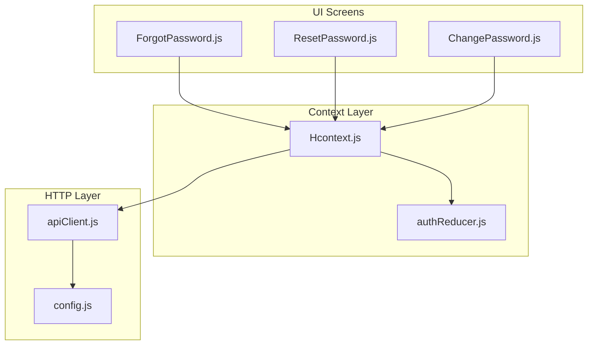
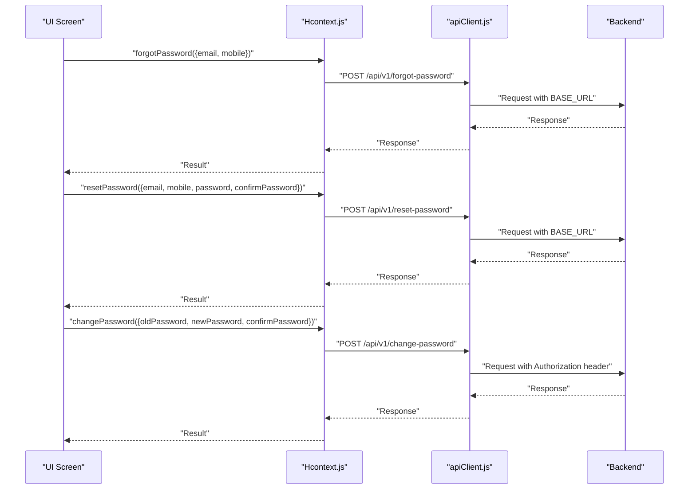
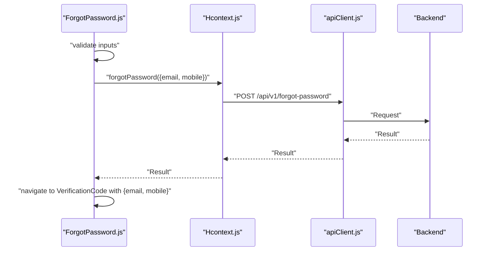
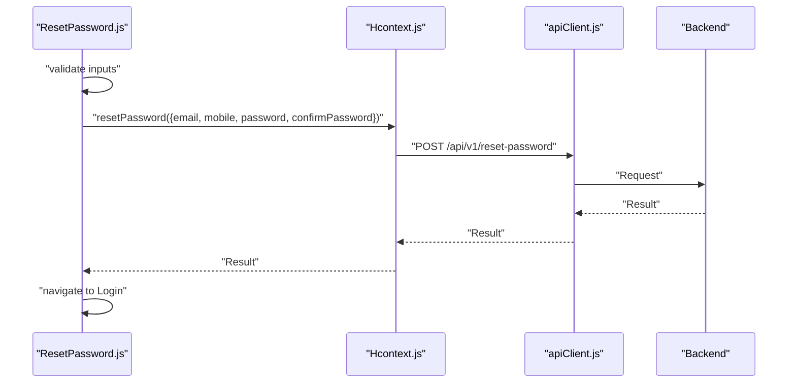
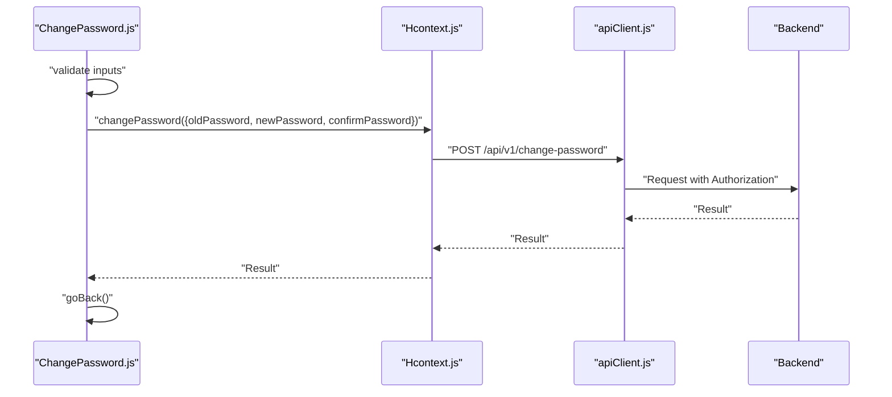
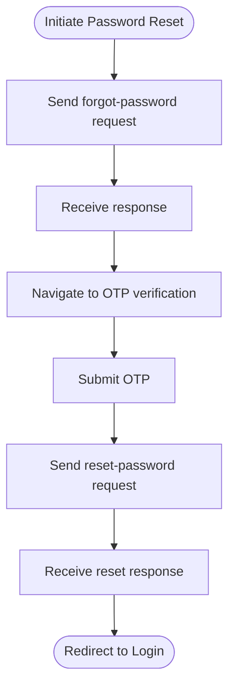
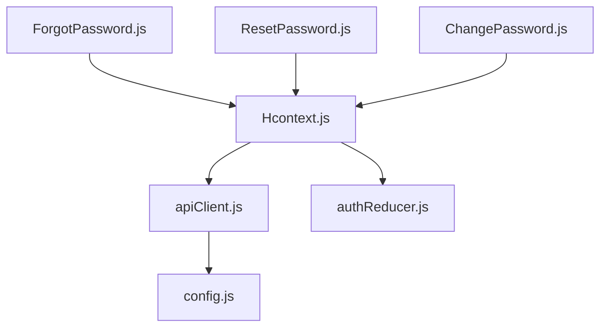

# Password Management

<cite>
**Referenced Files in This Document**
- [ForgotPassword.js](file://src/screens/Auth/ForgotPassword.js)
- [ResetPassword.js](file://src/screens/Auth/ResetPassword.js)
- [ChangePassword.js](file://src/screens/Setting/ChangePassword.js)
- [Hcontext.js](file://src/context/Hcontext.js)
- [apiClient.js](file://src/context/apiClient.js)
- [config.js](file://src/config/index.js)
- [authReducer.js](file://src/context/reducers/authReducer.js)
</cite>

## Table of Contents
1. [Introduction](#introduction)
2. [Project Structure](#project-structure)
3. [Core Components](#core-components)
4. [Architecture Overview](#architecture-overview)
5. [Detailed Component Analysis](#detailed-component-analysis)
6. [Dependency Analysis](#dependency-analysis)
7. [Performance Considerations](#performance-considerations)
8. [Troubleshooting Guide](#troubleshooting-guide)
9. [Conclusion](#conclusion)

## Introduction
This document describes the password management system in HappiMynd as implemented in the client-side codebase. It covers:
- Password reset workflow: initiation via email or phone, OTP verification, and reset completion
- Password change for authenticated users
- Validation and error handling during these flows
- Secure transport and token lifecycle
- Implementation details for password hashing, salt generation, and secure storage practices
- Security best practices and user experience considerations for password recovery

Where applicable, the document references the exact source locations for each behavior.

## Project Structure
The password management functionality spans three UI screens and a central authentication context:
- Screens: Forgot password, Reset password, Change password
- Context: Centralized authentication and password operations
- HTTP client: Axios-based client with interceptors and base URL configuration
- Reducer: Authentication state updates and token lifecycle

**Diagram sources**
- [ForgotPassword.js:19-89](file://src/screens/Auth/ForgotPassword.js#L19-L89)
- [ResetPassword.js:19-129](file://src/screens/Auth/ResetPassword.js#L19-L129)
- [ChangePassword.js:19-145](file://src/screens/Setting/ChangePassword.js#L19-L145)
- [Hcontext.js:325-380](file://src/context/Hcontext.js#L325-L380)
- [apiClient.js:1-58](file://src/context/apiClient.js#L1-L58)
- [config.js:1-13](file://src/config/index.js#L1-L13)
- [authReducer.js:17-79](file://src/context/reducers/authReducer.js#L17-L79)

**Section sources**
- [ForgotPassword.js:19-89](file://src/screens/Auth/ForgotPassword.js#L19-L89)
- [ResetPassword.js:19-129](file://src/screens/Auth/ResetPassword.js#L19-L129)
- [ChangePassword.js:19-145](file://src/screens/Setting/ChangePassword.js#L19-L145)
- [Hcontext.js:325-380](file://src/context/Hcontext.js#L325-L380)
- [apiClient.js:1-58](file://src/context/apiClient.js#L1-L58)
- [config.js:1-13](file://src/config/index.js#L1-L13)
- [authReducer.js:17-79](file://src/context/reducers/authReducer.js#L17-L79)

## Core Components
- Forgot password screen: collects email or phone, invokes backend to initiate reset, navigates to OTP verification
- Reset password screen: validates new password confirmation, submits reset with OTP context
- Change password screen: requires current password and enforces new password confirmation for authenticated users
- Hcontext functions: forgotPassword, verifyOtp, resetPassword, changePassword orchestrate HTTP calls
- apiClient: attaches bearer tokens, handles timeouts and errors
- config: defines BASE_URL for production
- authReducer: manages logged-in state and clears tokens on logout

Key implementation references:
- Forgot password submission and navigation: [ForgotPassword.js:31-52](file://src/screens/Auth/ForgotPassword.js#L31-L52)
- Reset password validation and submission: [ResetPassword.js:36-72](file://src/screens/Auth/ResetPassword.js#L36-L72)
- Change password validation and submission: [ChangePassword.js:32-68](file://src/screens/Setting/ChangePassword.js#L32-L68)
- Hcontext forgotPassword: [Hcontext.js:325-341](file://src/context/Hcontext.js#L325-L341)
- Hcontext resetPassword: [Hcontext.js:361-380](file://src/context/Hcontext.js#L361-L380)
- Hcontext changePassword: [Hcontext.js:303-323](file://src/context/Hcontext.js#L303-L323)
- apiClient request interceptor token attachment: [apiClient.js:12-42](file://src/context/apiClient.js#L12-L42)
- Base URL configuration: [config.js:3](file://src/config/index.js#L3)

**Section sources**
- [ForgotPassword.js:31-52](file://src/screens/Auth/ForgotPassword.js#L31-L52)
- [ResetPassword.js:36-72](file://src/screens/Auth/ResetPassword.js#L36-L72)
- [ChangePassword.js:32-68](file://src/screens/Setting/ChangePassword.js#L32-L68)
- [Hcontext.js:303-380](file://src/context/Hcontext.js#L303-L380)
- [apiClient.js:12-42](file://src/context/apiClient.js#L12-L42)
- [config.js:3](file://src/config/index.js#L3)

## Architecture Overview
The password management flow integrates UI screens with a centralized context that performs HTTP operations against the backend. The HTTP client injects authentication tokens automatically for protected endpoints.

**Diagram sources**
- [Hcontext.js:325-380](file://src/context/Hcontext.js#L325-L380)
- [apiClient.js:12-42](file://src/context/apiClient.js#L12-L42)
- [config.js:3](file://src/config/index.js#L3)

## Detailed Component Analysis

### Forgot Password Workflow
- Input collection: email or phone
- Validation: at least one field required
- Submission: calls forgotPassword with email/mobile and type derived from presence
- Navigation: on success, navigates to OTP verification screen with email/mobile context
- Error handling: shows snack messages for missing inputs and backend errors

**Diagram sources**
- [ForgotPassword.js:31-52](file://src/screens/Auth/ForgotPassword.js#L31-L52)
- [Hcontext.js:325-341](file://src/context/Hcontext.js#L325-L341)
- [apiClient.js:12-42](file://src/context/apiClient.js#L12-L42)

**Section sources**
- [ForgotPassword.js:31-52](file://src/screens/Auth/ForgotPassword.js#L31-L52)
- [Hcontext.js:325-341](file://src/context/Hcontext.js#L325-L341)

### Reset Password Workflow
- Input collection: new password and confirmation
- Validation: both fields required and must match
- Submission: calls resetPassword with email/mobile and password pair
- Navigation: on success, navigates to Login
- Error handling: shows snack messages for validation failures and logs backend errors

**Diagram sources**
- [ResetPassword.js:36-72](file://src/screens/Auth/ResetPassword.js#L36-L72)
- [Hcontext.js:361-380](file://src/context/Hcontext.js#L361-L380)
- [apiClient.js:12-42](file://src/context/apiClient.js#L12-L42)

**Section sources**
- [ResetPassword.js:36-72](file://src/screens/Auth/ResetPassword.js#L36-L72)
- [Hcontext.js:361-380](file://src/context/Hcontext.js#L361-L380)

### Change Password (Authenticated Users)
- Input collection: old password, new password, confirmation
- Validation: all fields required and new password must match confirmation
- Submission: calls changePassword with old/new/confirm password pair
- Navigation: on success, navigates back to previous screen
- Error handling: shows snack messages for validation failures and incorrect old password

**Diagram sources**
- [ChangePassword.js:32-68](file://src/screens/Setting/ChangePassword.js#L32-L68)
- [Hcontext.js:303-323](file://src/context/Hcontext.js#L303-L323)
- [apiClient.js:12-42](file://src/context/apiClient.js#L12-L42)

**Section sources**
- [ChangePassword.js:32-68](file://src/screens/Setting/ChangePassword.js#L32-L68)
- [Hcontext.js:303-323](file://src/context/Hcontext.js#L303-L323)

### Password Policy Enforcement
Observed client-side validations:
- Forgot password: at least one of email or phone must be provided
- Reset password: both password and confirmation must be present and equal
- Change password: all fields required and new password must match confirmation

Policy enforcement details:
- Minimum length: not enforced in the UI
- Character requirements: not enforced in the UI
- Complexity rules: not enforced in the UI

Recommendations:
- Enforce minimum length and complexity at the UI level for improved UX
- Provide real-time feedback on policy compliance
- Apply backend-side enforcement for robustness

**Section sources**
- [ForgotPassword.js:34-40](file://src/screens/Auth/ForgotPassword.js#L34-L40)
- [ResetPassword.js:40-54](file://src/screens/Auth/ResetPassword.js#L40-L54)
- [ChangePassword.js:36-50](file://src/screens/Setting/ChangePassword.js#L36-L50)

### Secure Transmission of Password Reset Tokens and Expiration Handling
- Transport security: HTTPS via BASE_URL configuration
- Token lifecycle: apiClient attaches Authorization header for protected endpoints; authReducer clears tokens on logout
- Expiration handling: UI does not implement explicit token expiration checks; backend is responsible for token validity

**Diagram sources**
- [config.js:3](file://src/config/index.js#L3)
- [apiClient.js:12-42](file://src/context/apiClient.js#L12-L42)
- [authReducer.js:65-74](file://src/context/reducers/authReducer.js#L65-L74)

**Section sources**
- [config.js:3](file://src/config/index.js#L3)
- [apiClient.js:12-42](file://src/context/apiClient.js#L12-L42)
- [authReducer.js:65-74](file://src/context/reducers/authReducer.js#L65-L74)

### Password Hashing, Salt Generation, and Secure Storage Practices
Observed client-side behavior:
- Passwords are transmitted as plain text to backend endpoints
- No client-side hashing or salting logic is present in the reviewed files

Backend responsibilities (as inferred from endpoint names):
- Password hashing and salt generation should be performed server-side
- Secure storage of hashed credentials and audit logs

Recommendations:
- Ensure backend enforces strong hashing (e.g., bcrypt, Argon2) and unique per-user salts
- Store only hashed credentials; never persist plaintext passwords
- Implement secure secret management and rotation

**Section sources**
- [Hcontext.js:309-313](file://src/context/Hcontext.js#L309-L313)
- [Hcontext.js:368-373](file://src/context/Hcontext.js#L368-L373)
- [Hcontext.js:327-331](file://src/context/Hcontext.js#L327-L331)

### Common Password-Related Scenarios
- Weak passwords: not validated in UI; rely on backend enforcement
- Password reuse detection: not implemented in UI; backend should enforce policies
- Account lockout mechanisms: not implemented in UI; backend should manage lockout and reset procedures

Recommendations:
- Provide immediate feedback for weak passwords and reuse violations
- Implement progressive lockout with clear user messaging and admin override
- Offer self-service unlock after successful verification

**Section sources**
- [ForgotPassword.js:34-40](file://src/screens/Auth/ForgotPassword.js#L34-L40)
- [ResetPassword.js:40-54](file://src/screens/Auth/ResetPassword.js#L40-L54)
- [ChangePassword.js:36-50](file://src/screens/Setting/ChangePassword.js#L36-L50)

### Examples of Validation Logic and Error Handling Strategies
- Validation logic:
  - Required fields: all fields must be present
  - Confirmation match: new password must equal confirmation
- Error handling strategies:
  - Snack notifications for validation failures
  - Backend error messages surfaced to users
  - Logging of unexpected errors for diagnostics

**Section sources**
- [ForgotPassword.js:34-40](file://src/screens/Auth/ForgotPassword.js#L34-L40)
- [ResetPassword.js:40-54](file://src/screens/Auth/ResetPassword.js#L40-L54)
- [ChangePassword.js:36-50](file://src/screens/Setting/ChangePassword.js#L36-L50)

## Dependency Analysis
The following diagram shows the primary dependencies among password-related components:

**Diagram sources**
- [ForgotPassword.js:24](file://src/screens/Auth/ForgotPassword.js#L24)
- [ResetPassword.js:24](file://src/screens/Auth/ResetPassword.js#L24)
- [ChangePassword.js:24](file://src/screens/Setting/ChangePassword.js#L24)
- [Hcontext.js:325-380](file://src/context/Hcontext.js#L325-L380)
- [apiClient.js:12-42](file://src/context/apiClient.js#L12-L42)
- [config.js:3](file://src/config/index.js#L3)
- [authReducer.js:17-79](file://src/context/reducers/authReducer.js#L17-L79)

**Section sources**
- [ForgotPassword.js:24](file://src/screens/Auth/ForgotPassword.js#L24)
- [ResetPassword.js:24](file://src/screens/Auth/ResetPassword.js#L24)
- [ChangePassword.js:24](file://src/screens/Setting/ChangePassword.js#L24)
- [Hcontext.js:325-380](file://src/context/Hcontext.js#L325-L380)
- [apiClient.js:12-42](file://src/context/apiClient.js#L12-L42)
- [config.js:3](file://src/config/index.js#L3)
- [authReducer.js:17-79](file://src/context/reducers/authReducer.js#L17-L79)

## Performance Considerations
- Network timeouts: apiClient sets a 15-second timeout to prevent hanging requests
- Token caching: global token cache reduces repeated AsyncStorage reads
- UI responsiveness: loading flags prevent duplicate submissions during async operations

Recommendations:
- Optimize retry logic with exponential backoff for transient failures
- Debounce rapid user inputs for validation feedback
- Pre-warm token retrieval on app start to minimize latency

**Section sources**
- [apiClient.js:8](file://src/context/apiClient.js#L8)
- [apiClient.js:12-42](file://src/context/apiClient.js#L12-L42)

## Troubleshooting Guide
Common issues and resolutions:
- Missing input fields:
  - Ensure at least one of email or phone is provided for forgot password
  - Ensure all fields are filled for change password and reset password
- Password mismatch:
  - Confirm that new password equals confirmation in reset and change flows
- Backend errors:
  - Review snack messages for validation and authentication failures
  - Inspect network tab for HTTP error responses
- Token issues:
  - Verify Authorization header is attached for protected endpoints
  - Confirm token is cleared on logout via authReducer

**Section sources**
- [ForgotPassword.js:34-40](file://src/screens/Auth/ForgotPassword.js#L34-L40)
- [ResetPassword.js:40-54](file://src/screens/Auth/ResetPassword.js#L40-L54)
- [ChangePassword.js:36-50](file://src/screens/Setting/ChangePassword.js#L36-L50)
- [apiClient.js:12-42](file://src/context/apiClient.js#L12-L42)
- [authReducer.js:65-74](file://src/context/reducers/authReducer.js#L65-L74)

## Conclusion
The HappiMynd client implements a straightforward password management flow with clear UI validations and centralized HTTP operations. While the UI enforces basic checks (presence and confirmation matching), robust password policies, hashing, and secure storage are expected to be handled by the backend. Enhancing client-side policy enforcement and adding user-friendly feedback for complex scenarios would further strengthen the system’s security and usability.