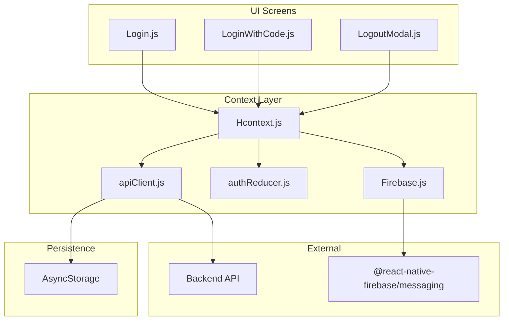
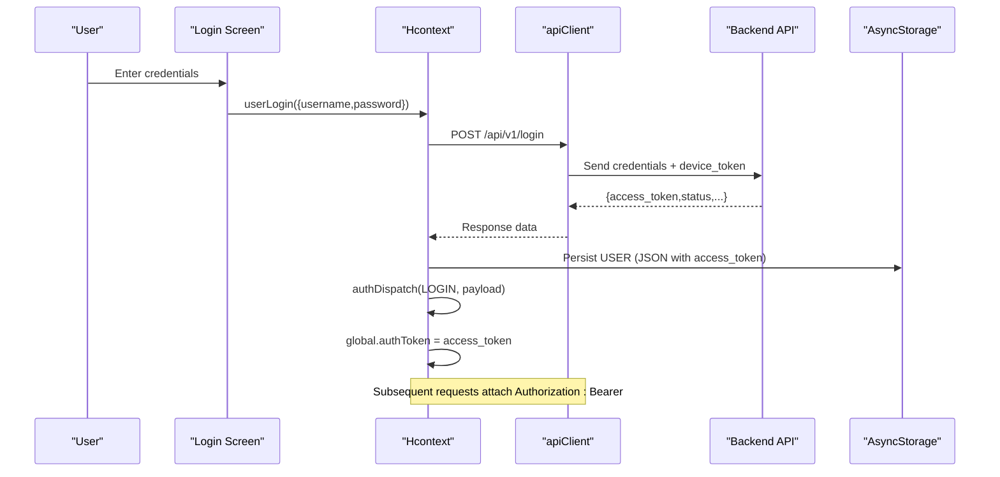
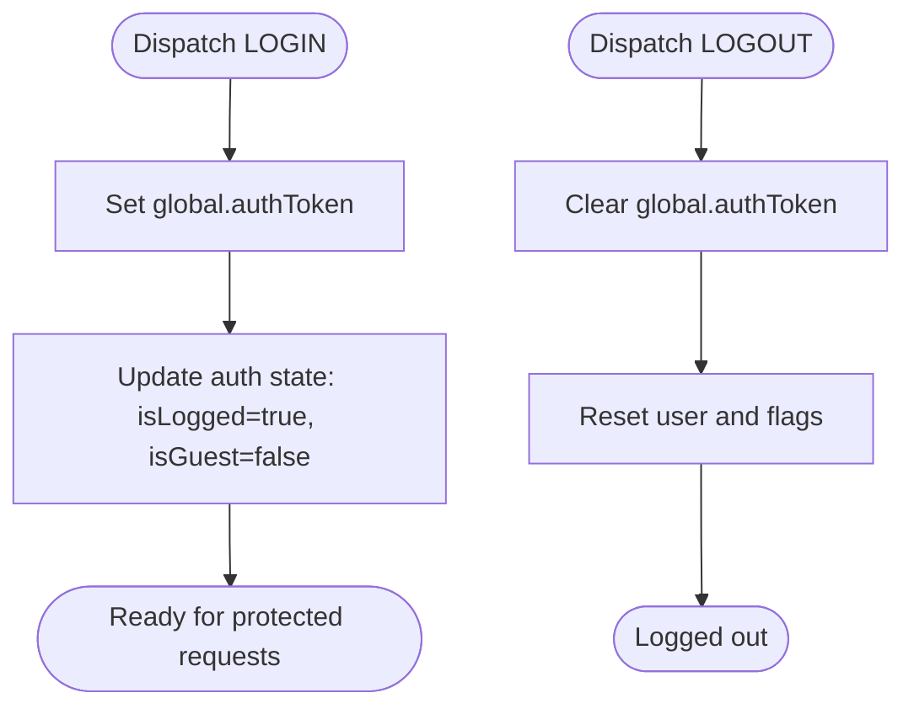
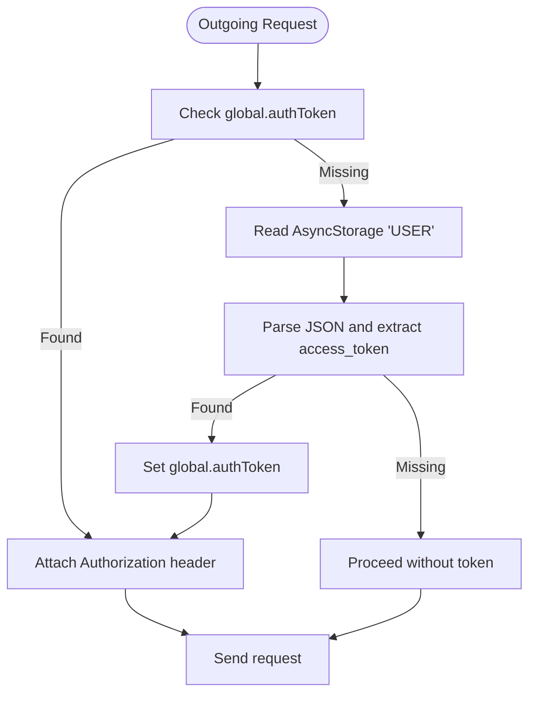
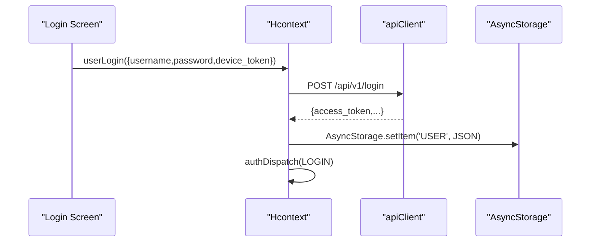
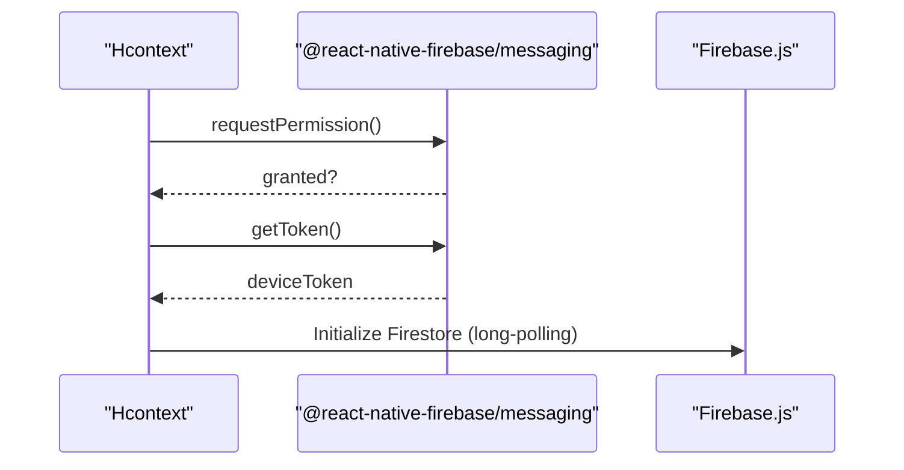
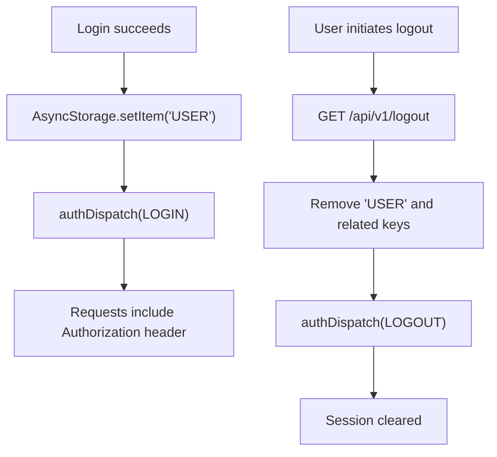
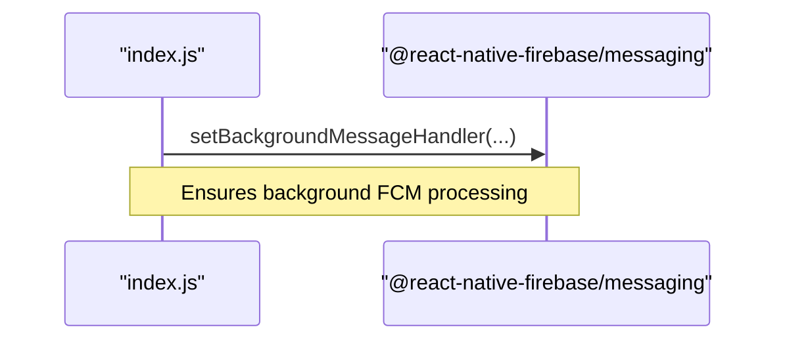
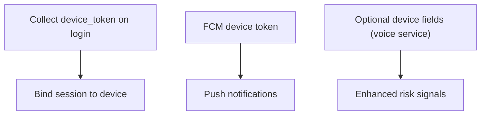
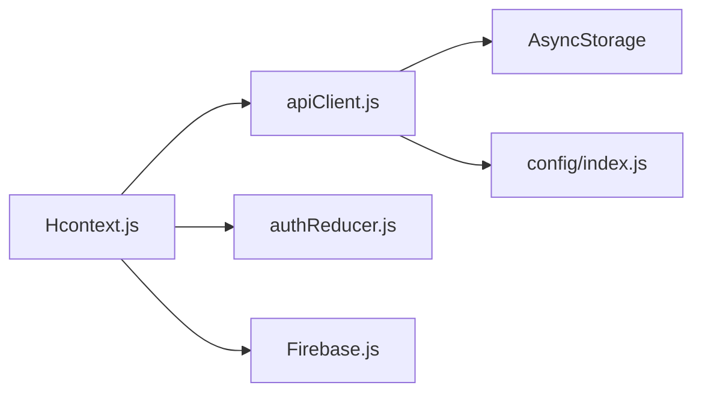

# Session Management

<cite>
**Referenced Files in This Document**
- [authReducer.js](file://src/context/reducers/authReducer.js)
- [Hcontext.js](file://src/context/Hcontext.js)
- [apiClient.js](file://src/context/apiClient.js)
- [Firebase.js](file://src/context/Firebase.js)
- [index.js](file://index.js)
- [Login.js](file://src/screens/Auth/Login.js)
- [LoginWithCode.js](file://src/screens/Auth/LoginWithCode.js)
- [LogoutModal.js](file://src/components/Modals/LogoutModal.js)
- [config/index.js](file://src/config/index.js)
- [SessionNotifies.js](file://src/components/notifiers/SessionNotifies.js)
- [VoiceAPIService.js](file://src/screens/HappiVOICE/VoiceAPIService.js)
</cite>

## Table of Contents
1. [Introduction](#introduction)
2. [Project Structure](#project-structure)
3. [Core Components](#core-components)
4. [Architecture Overview](#architecture-overview)
5. [Detailed Component Analysis](#detailed-component-analysis)
6. [Dependency Analysis](#dependency-analysis)
7. [Performance Considerations](#performance-considerations)
8. [Troubleshooting Guide](#troubleshooting-guide)
9. [Conclusion](#conclusion)
10. [Appendices](#appendices)

## Introduction
This document explains the session management system in HappiMynd with a focus on JWT-based authentication, token propagation, persistence, and real-time integration. It covers:
- Token generation and propagation via Axios interceptors
- Authentication state management with a reducer
- Persistence using AsyncStorage across app restarts
- Firebase Messaging integration for push notifications
- Logout and session cleanup
- Security considerations and troubleshooting guidance

## Project Structure
The session management spans three layers:
- Authentication UI: Login and code-based login screens
- Context and API: Centralized authentication state, API client, and Firebase integration
- Persistence: AsyncStorage-backed token storage

**Diagram sources**
- [Login.js:1-271](file://src/screens/Auth/Login.js#L1-L271)
- [LoginWithCode.js:1-237](file://src/screens/Auth/LoginWithCode.js#L1-L237)
- [LogoutModal.js:1-138](file://src/components/Modals/LogoutModal.js#L1-L138)
- [Hcontext.js:1-1551](file://src/context/Hcontext.js#L1-L1551)
- [authReducer.js:1-79](file://src/context/reducers/authReducer.js#L1-L79)
- [apiClient.js:1-58](file://src/context/apiClient.js#L1-L58)
- [Firebase.js:1-52](file://src/context/Firebase.js#L1-L52)

**Section sources**
- [Login.js:1-271](file://src/screens/Auth/Login.js#L1-L271)
- [LoginWithCode.js:1-237](file://src/screens/Auth/LoginWithCode.js#L1-L237)
- [LogoutModal.js:1-138](file://src/components/Modals/LogoutModal.js#L1-L138)
- [Hcontext.js:1-1551](file://src/context/Hcontext.js#L1-L1551)
- [authReducer.js:1-79](file://src/context/reducers/authReducer.js#L1-L79)
- [apiClient.js:1-58](file://src/context/apiClient.js#L1-L58)
- [Firebase.js:1-52](file://src/context/Firebase.js#L1-L52)

## Core Components
- Authentication state reducer: Manages login, logout, and user metadata
- API client: Centralized HTTP client with request/response interceptors for token injection and error handling
- Context provider: Orchestrates login flows, push notifications, and persistence
- Firebase integration: Initializes messaging and long-polling Firestore for reliable transport
- AsyncStorage: Persists user data to survive app restarts

Key responsibilities:
- LOGIN action sets global token and updates auth state
- LOGOUT clears token and resets state
- API interceptor reads token from global cache or AsyncStorage and attaches Authorization header
- Firebase messaging initializes device tokens and listens to foreground/background notifications

**Section sources**
- [authReducer.js:17-77](file://src/context/reducers/authReducer.js#L17-L77)
- [apiClient.js:12-56](file://src/context/apiClient.js#L12-L56)
- [Hcontext.js:129-172](file://src/context/Hcontext.js#L129-L172)
- [Firebase.js:33-51](file://src/context/Firebase.js#L33-L51)

## Architecture Overview
The JWT authentication flow integrates UI, context, persistence, and external services:

**Diagram sources**
- [Login.js:44-74](file://src/screens/Auth/Login.js#L44-L74)
- [Hcontext.js:129-145](file://src/context/Hcontext.js#L129-L145)
- [apiClient.js:12-44](file://src/context/apiClient.js#L12-L44)
- [config/index.js:1-LIVE:1-13](file://src/config/index.js#L1-L13)

## Detailed Component Analysis

### Authentication State Management (authReducer)
- Initial state defines logged-in, guest, onboarded, and user metadata flags
- LOGIN action:
  - Sets global.authToken for immediate use by apiClient
  - Marks user as logged in and not guest
- LOGOUT action:
  - Clears global.authToken
  - Resets user state and flags

**Diagram sources**
- [authReducer.js:17-77](file://src/context/reducers/authReducer.js#L17-L77)

**Section sources**
- [authReducer.js:5-15](file://src/context/reducers/authReducer.js#L5-L15)
- [authReducer.js:17-77](file://src/context/reducers/authReducer.js#L17-L77)

### API Client Interceptors (apiClient)
- Request interceptor:
  - Attempts to read token from global.authToken or global.authState
  - Falls back to AsyncStorage item "USER" and parses access_token
  - Caches token in global.authToken for subsequent requests
  - Attaches Authorization header if token exists
- Response interceptor:
  - Logs errors and normalizes error payloads

**Diagram sources**
- [apiClient.js:12-44](file://src/context/apiClient.js#L12-L44)

**Section sources**
- [apiClient.js:12-56](file://src/context/apiClient.js#L12-L56)

### Context Provider (Hcontext)
- Provides login flows:
  - userLogin: posts credentials and device token
  - userCodeLogin: posts code-based login
  - userLogout: GET /api/v1/logout
- Push notifications:
  - Registers for FCM token and handles foreground/background messages
- Persistence:
  - Stores USER in AsyncStorage after successful login
  - Clears AsyncStorage on logout

**Diagram sources**
- [Hcontext.js:129-172](file://src/context/Hcontext.js#L129-L172)
- [Login.js:44-74](file://src/screens/Auth/Login.js#L44-L74)

**Section sources**
- [Hcontext.js:129-172](file://src/context/Hcontext.js#L129-L172)
- [Login.js:44-74](file://src/screens/Auth/Login.js#L44-L74)
- [LoginWithCode.js:42-78](file://src/screens/Auth/LoginWithCode.js#L42-L78)
- [LogoutModal.js:35-52](file://src/components/Modals/LogoutModal.js#L35-L52)

### Firebase Integration (Messaging and Firestore)
- Messaging:
  - Requests permission and retrieves device token
  - Listens to foreground/background notifications
- Firestore:
  - Initializes with long-polling to avoid WebSocket/gRPC transport issues on React Native

**Diagram sources**
- [Hcontext.js:80-127](file://src/context/Hcontext.js#L80-L127)
- [Firebase.js:33-51](file://src/context/Firebase.js#L33-L51)
- [index.js:9-11](file://index.js#L9-L11)

**Section sources**
- [Hcontext.js:80-127](file://src/context/Hcontext.js#L80-L127)
- [Firebase.js:33-51](file://src/context/Firebase.js#L33-L51)
- [index.js:9-11](file://index.js#L9-L11)

### Session Lifecycle and Persistence
- Login:
  - Successful login stores USER in AsyncStorage and dispatches LOGIN
- Logout:
  - Calls backend logout, removes USER and chat-related keys, dispatches LOGOUT
- Persistence:
  - apiClient reads USER on missing global token to restore session across restarts

**Diagram sources**
- [Login.js:65-69](file://src/screens/Auth/Login.js#L65-L69)
- [LogoutModal.js:42-47](file://src/components/Modals/LogoutModal.js#L42-L47)
- [apiClient.js:18-32](file://src/context/apiClient.js#L18-L32)

**Section sources**
- [Login.js:65-69](file://src/screens/Auth/Login.js#L65-L69)
- [LogoutModal.js:35-52](file://src/components/Modals/LogoutModal.js#L35-L52)
- [apiClient.js:18-32](file://src/context/apiClient.js#L18-L32)

### Real-Time Session Synchronization and Notifications
- Foreground/background message handling via Firebase Messaging
- Background message handler registered at app entry
- Session notifications component surfaces ongoing sessions

**Diagram sources**
- [index.js:9-11](file://index.js#L9-L11)
- [SessionNotifies.js:55-97](file://src/components/notifiers/SessionNotifies.js#L55-L97)

**Section sources**
- [index.js:9-11](file://index.js#L9-L11)
- [SessionNotifies.js:55-97](file://src/components/notifiers/SessionNotifies.js#L55-L97)

### Security Measures and Suspicious Activity
- Device token collection during login for device binding
- Firebase device token retrieval for push notifications
- Optional device fingerprinting fields present in voice service integration

**Diagram sources**
- [Hcontext.js:131-135](file://src/context/Hcontext.js#L131-L135)
- [VoiceAPIService.js:52-88](file://src/screens/HappiVOICE/VoiceAPIService.js#L52-L88)

**Section sources**
- [Hcontext.js:131-135](file://src/context/Hcontext.js#L131-L135)
- [VoiceAPIService.js:52-88](file://src/screens/HappiVOICE/VoiceAPIService.js#L52-L88)

## Dependency Analysis
- Hcontext depends on:
  - apiClient for HTTP requests
  - AsyncStorage for persistence
  - Firebase modules for messaging and Firestore
- apiClient depends on:
  - AsyncStorage for fallback token retrieval
  - config for base URL
- authReducer is a pure reducer used by Hcontext

**Diagram sources**
- [Hcontext.js:1-40](file://src/context/Hcontext.js#L1-L40)
- [apiClient.js:1-9](file://src/context/apiClient.js#L1-L9)
- [config/index.js:1-13](file://src/config/index.js#L1-L13)

**Section sources**
- [Hcontext.js:1-40](file://src/context/Hcontext.js#L1-L40)
- [apiClient.js:1-9](file://src/context/apiClient.js#L1-L9)
- [config/index.js:1-13](file://src/config/index.js#L1-L13)

## Performance Considerations
- Use global.authToken caching to avoid repeated AsyncStorage reads
- Keep API timeouts reasonable to prevent hanging requests
- Prefer long-polling Firestore initialization for stable RN environments
- Minimize unnecessary re-renders by updating auth state atomically

## Troubleshooting Guide
Common issues and resolutions:
- Missing Authorization header:
  - Ensure LOGIN dispatched after storing USER
  - Confirm global.authToken is set in reducer
- AsyncStorage read failures:
  - Wrap AsyncStorage getItem in try/catch and handle parse errors
- Logout does not clear state:
  - Verify AsyncStorage.removeItem('USER') and authDispatch(LOGOUT)
- Background notification handling:
  - Confirm setBackgroundMessageHandler is registered before app registry

**Section sources**
- [apiClient.js:18-32](file://src/context/apiClient.js#L18-L32)
- [authReducer.js:65-74](file://src/context/reducers/authReducer.js#L65-L74)
- [LogoutModal.js:42-47](file://src/components/Modals/LogoutModal.js#L42-L47)
- [index.js:9-11](file://index.js#L9-L11)

## Conclusion
HappiMynd’s session management centers on a robust JWT flow with centralized token propagation, resilient persistence, and real-time notification support. The design leverages a reducer for state, an interceptor for token injection, and AsyncStorage for continuity across restarts. While explicit refresh and expiration handling are not implemented in the current code, the foundation supports straightforward extension for refresh tokens and session timeout logic.

## Appendices
- Example flows:
  - Login flow: [Login.js:44-74](file://src/screens/Auth/Login.js#L44-L74)
  - Code login flow: [LoginWithCode.js:42-78](file://src/screens/Auth/LoginWithCode.js#L42-L78)
  - Logout flow: [LogoutModal.js:35-52](file://src/components/Modals/LogoutModal.js#L35-L52)
- Security references:
  - Device token usage: [Hcontext.js:131-135](file://src/context/Hcontext.js#L131-L135)
  - Optional device fields: [VoiceAPIService.js:52-88](file://src/screens/HappiVOICE/VoiceAPIService.js#L52-L88)