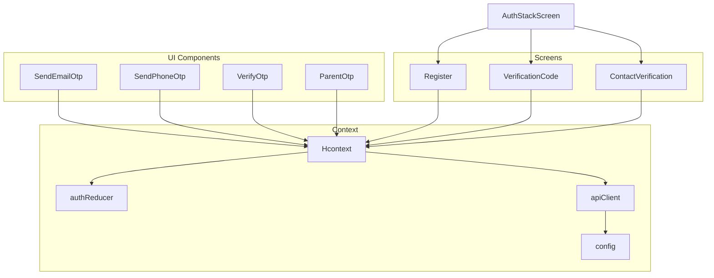
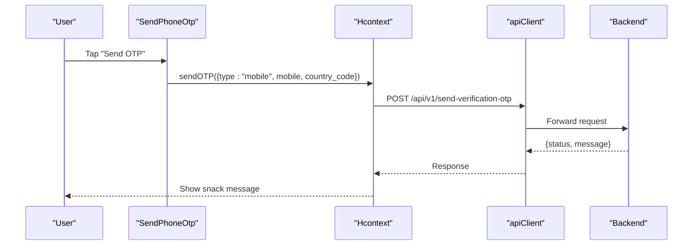
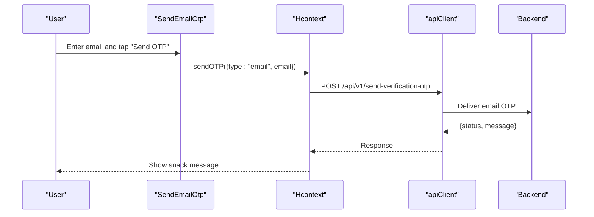
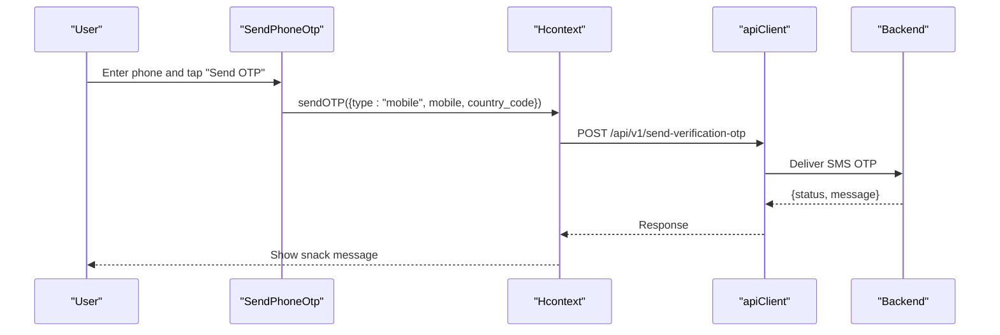
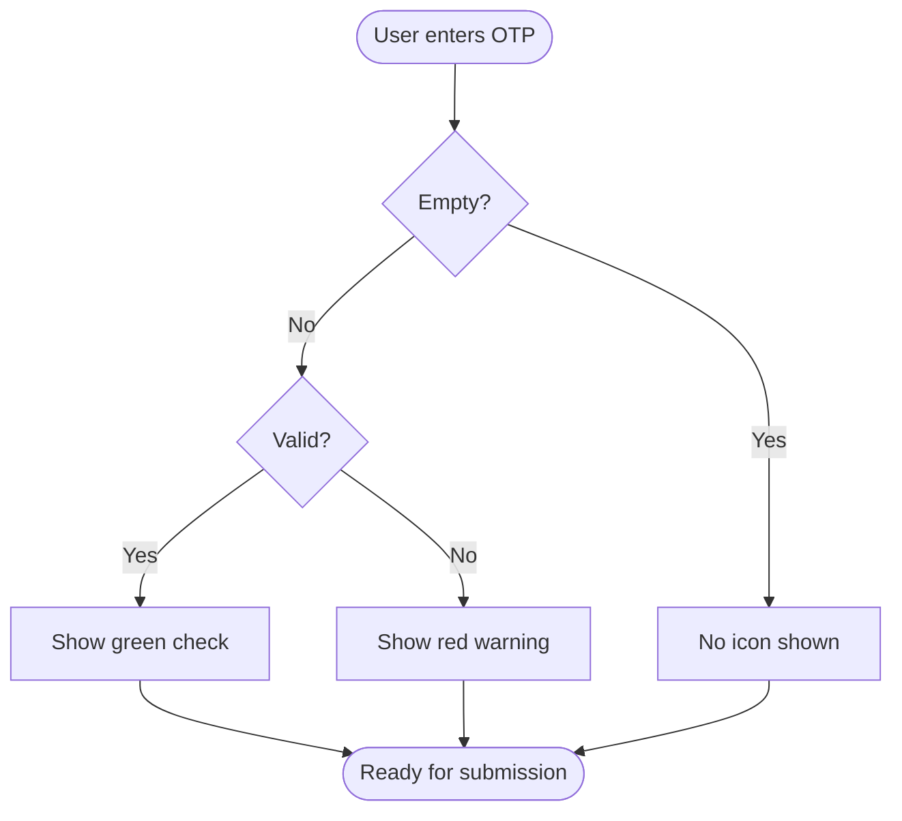
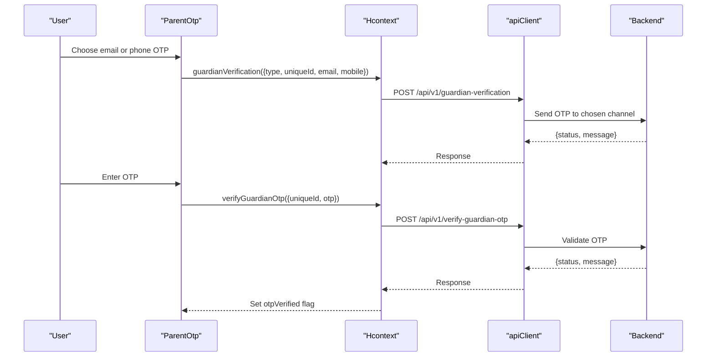
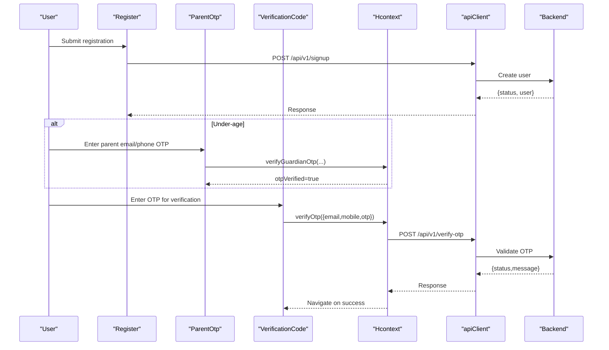
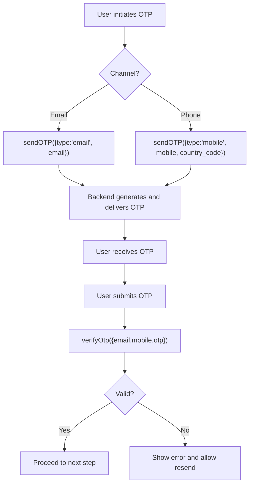
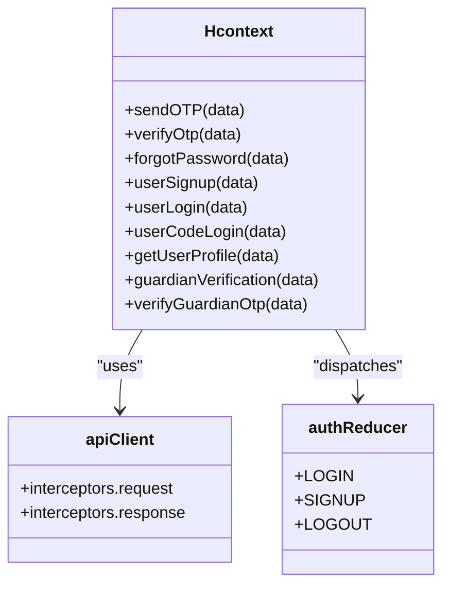
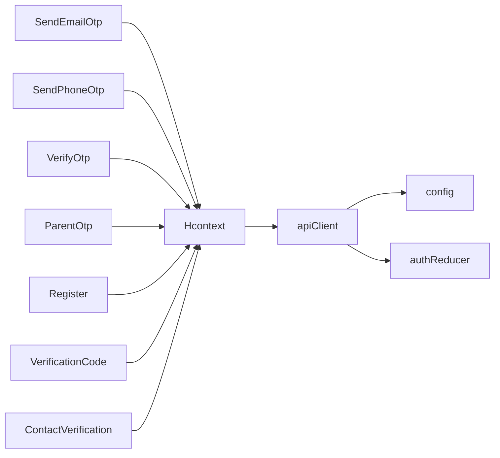

# Verification System

<cite>
**Referenced Files in This Document**
- [SendEmailOtp.js](file://src/components/input/SendEmailOtp.js)
- [SendPhoneOtp.js](file://src/components/input/SendPhoneOtp.js)
- [VerifyOtp.js](file://src/components/input/VerifyOtp.js)
- [ParentOtp.js](file://src/components/common/ParentOtp.js)
- [Hcontext.js](file://src/context/Hcontext.js)
- [authReducer.js](file://src/context/reducers/authReducer.js)
- [apiClient.js](file://src/context/apiClient.js)
- [config.js](file://src/config/index.js)
- [AuthStackScreen.js](file://src/routes/AuthStack/AuthStackScreen.js)
- [Register.js](file://src/screens/Auth/Register.js)
- [VerificationCode.js](file://src/screens/Auth/VerificationCode.js)
- [ContactVerification.js](file://src/screens/HappiLIFE/ContactVerification.js)
</cite>

## Table of Contents
1. [Introduction](#introduction)
2. [Project Structure](#project-structure)
3. [Core Components](#core-components)
4. [Architecture Overview](#architecture-overview)
5. [Detailed Component Analysis](#detailed-component-analysis)
6. [Dependency Analysis](#dependency-analysis)
7. [Performance Considerations](#performance-considerations)
8. [Security Considerations](#security-considerations)
9. [Troubleshooting Guide](#troubleshooting-guide)
10. [Conclusion](#conclusion)

## Introduction
This document explains the multi-layered verification system in HappiMynd. It covers:
- Email verification using the SendEmailOtp component
- Phone OTP verification via SendPhoneOtp
- Manual code verification through VerifyOtp
- The end-to-end workflow from registration to account activation
- OTP generation, delivery, and validation logic
- Retry limits, resend functionality, and time-based expiration behavior
- Integration with the authentication context and reducers
- Security considerations, error handling, and troubleshooting

## Project Structure
The verification system spans UI components, screens, and the central authentication context. Key areas:
- Input components for OTP entry and sending
- Screens orchestrating verification flows
- Authentication context providing OTP APIs and state updates
- Navigation stack routing to verification screens

**Diagram sources**
- [SendEmailOtp.js:19-69](file://src/components/input/SendEmailOtp.js#L19-L69)
- [SendPhoneOtp.js:19-79](file://src/components/input/SendPhoneOtp.js#L19-L79)
- [VerifyOtp.js:13-43](file://src/components/input/VerifyOtp.js#L13-L43)
- [ParentOtp.js:24-118](file://src/components/common/ParentOtp.js#L24-L118)
- [Register.js:35-401](file://src/screens/Auth/Register.js#L35-L401)
- [VerificationCode.js:19-143](file://src/screens/Auth/VerificationCode.js#L19-L143)
- [ContactVerification.js:46-200](file://src/screens/HappiLIFE/ContactVerification.js#L46-L200)
- [Hcontext.js:667-698](file://src/context/Hcontext.js#L667-L698)
- [authReducer.js:5-79](file://src/context/reducers/authReducer.js#L5-L79)
- [apiClient.js:1-58](file://src/context/apiClient.js#L1-L58)
- [config.js:1-13](file://src/config/index.js#L1-L13)
- [AuthStackScreen.js:39-176](file://src/routes/AuthStack/AuthStackScreen.js#L39-L176)

**Section sources**
- [SendEmailOtp.js:19-69](file://src/components/input/SendEmailOtp.js#L19-L69)
- [SendPhoneOtp.js:19-79](file://src/components/input/SendPhoneOtp.js#L19-L79)
- [VerifyOtp.js:13-43](file://src/components/input/VerifyOtp.js#L13-L43)
- [ParentOtp.js:24-118](file://src/components/common/ParentOtp.js#L24-L118)
- [Register.js:35-401](file://src/screens/Auth/Register.js#L35-L401)
- [VerificationCode.js:19-143](file://src/screens/Auth/VerificationCode.js#L19-L143)
- [ContactVerification.js:46-200](file://src/screens/HappiLIFE/ContactVerification.js#L46-L200)
- [Hcontext.js:667-698](file://src/context/Hcontext.js#L667-L698)
- [authReducer.js:5-79](file://src/context/reducers/authReducer.js#L5-L79)
- [apiClient.js:1-58](file://src/context/apiClient.js#L1-L58)
- [config.js:1-13](file://src/config/index.js#L1-L13)
- [AuthStackScreen.js:39-176](file://src/routes/AuthStack/AuthStackScreen.js#L39-L176)

## Core Components
- SendEmailOtp: Presents an email input and a Send OTP button. Disables the button during loading and shows an activity indicator.
- SendPhoneOtp: Presents a phone input with a fixed country code and a Send OTP button. Disables the button during loading and shows an activity indicator.
- VerifyOtp: Numeric input for OTP entry with inline validity indicators (checkmark or warning icon).
- ParentOtp: A composite component enabling either email or phone OTP for parental consent; integrates with guardian verification endpoints.

These components are wired to Hcontext OTP APIs and dispatch snackbar messages for user feedback.

**Section sources**
- [SendEmailOtp.js:19-69](file://src/components/input/SendEmailOtp.js#L19-L69)
- [SendPhoneOtp.js:19-79](file://src/components/input/SendPhoneOtp.js#L19-L79)
- [VerifyOtp.js:13-43](file://src/components/input/VerifyOtp.js#L13-L43)
- [ParentOtp.js:24-118](file://src/components/common/ParentOtp.js#L24-L118)

## Architecture Overview
The verification system follows a layered pattern:
- UI Layer: Components collect inputs and trigger actions
- Screen Layer: Orchestrates flows and navigates between verification steps
- Context Layer: Exposes OTP APIs (send, verify) and manages auth state
- API Layer: Axios client attaches tokens and communicates with backend
- Backend: OTP endpoints for sending and verifying codes

**Diagram sources**
- [SendPhoneOtp.js:53-75](file://src/components/input/SendPhoneOtp.js#L53-L75)
- [Hcontext.js:667-698](file://src/context/Hcontext.js#L667-L698)
- [apiClient.js:11-44](file://src/context/apiClient.js#L11-L44)

**Section sources**
- [Hcontext.js:667-698](file://src/context/Hcontext.js#L667-L698)
- [apiClient.js:11-44](file://src/context/apiClient.js#L11-L44)
- [config.js:1-13](file://src/config/index.js#L1-L13)

## Detailed Component Analysis

### Email Verification Flow (SendEmailOtp)
- Purpose: Allow users to receive an OTP via email during registration or other flows.
- Behavior:
  - Input field for email address
  - Send OTP button triggers sendOTP with type "email"
  - Loading state disables the button and shows an activity indicator
- Integration:
  - Uses Hcontext.sendOTP and displays snack messages on success/error

**Diagram sources**
- [SendEmailOtp.js:19-69](file://src/components/input/SendEmailOtp.js#L19-L69)
- [Hcontext.js:667-698](file://src/context/Hcontext.js#L667-L698)
- [apiClient.js:11-44](file://src/context/apiClient.js#L11-L44)

**Section sources**
- [SendEmailOtp.js:19-69](file://src/components/input/SendEmailOtp.js#L19-L69)
- [Hcontext.js:667-698](file://src/context/Hcontext.js#L667-L698)

### Phone OTP Verification Flow (SendPhoneOtp)
- Purpose: Allow users to receive an SMS OTP for phone verification.
- Behavior:
  - Input field for phone number with fixed country code
  - Send OTP button triggers sendOTP with type "mobile"
  - Loading state disables the button and shows an activity indicator
- Integration:
  - Uses Hcontext.sendOTP and displays snack messages

**Diagram sources**
- [SendPhoneOtp.js:19-79](file://src/components/input/SendPhoneOtp.js#L19-L79)
- [Hcontext.js:667-698](file://src/context/Hcontext.js#L667-L698)
- [apiClient.js:11-44](file://src/context/apiClient.js#L11-L44)

**Section sources**
- [SendPhoneOtp.js:19-79](file://src/components/input/SendPhoneOtp.js#L19-L79)
- [Hcontext.js:667-698](file://src/context/Hcontext.js#L667-L698)

### Manual Code Verification (VerifyOtp)
- Purpose: Accept a numeric OTP input and provide inline validity feedback.
- Behavior:
  - Numeric keyboard input
  - Inline icons indicate validity (green check or red warning)
- Integration:
  - Used across flows to capture OTP and validate against backend

**Diagram sources**
- [VerifyOtp.js:13-43](file://src/components/input/VerifyOtp.js#L13-L43)

**Section sources**
- [VerifyOtp.js:13-43](file://src/components/input/VerifyOtp.js#L13-L43)

### Parental Consent OTP (ParentOtp)
- Purpose: Enable either email or phone OTP for parental consent during registration.
- Behavior:
  - Conditional rendering: if phone is missing, show email input; otherwise show phone input
  - OR divider toggles between options
  - OTP entry validated via verifyGuardianOtp
  - Updates otpVerified flag to unlock registration continuation
- Integration:
  - Uses guardianVerification and verifyGuardianOtp endpoints
  - Communicates with Hcontext for OTP lifecycle

**Diagram sources**
- [ParentOtp.js:24-118](file://src/components/common/ParentOtp.js#L24-L118)
- [Hcontext.js:174-202](file://src/context/Hcontext.js#L174-L202)

**Section sources**
- [ParentOtp.js:24-118](file://src/components/common/ParentOtp.js#L24-L118)
- [Hcontext.js:174-202](file://src/context/Hcontext.js#L174-L202)

### Registration to Account Activation Workflow
- Registration:
  - User fills profile and credentials; age gating may require parental OTP
  - Registration posts to backend; user data stored locally
  - Parental OTP optional based on age
- Verification:
  - VerificationCode screen accepts OTP for password reset or similar flows
  - Resend OTP via forgotPassword endpoint
- Activation:
  - Successful OTP validation allows proceeding to next steps (e.g., reset password)

**Diagram sources**
- [Register.js:87-184](file://src/screens/Auth/Register.js#L87-L184)
- [ParentOtp.js:24-118](file://src/components/common/ParentOtp.js#L24-L118)
- [VerificationCode.js:35-72](file://src/screens/Auth/VerificationCode.js#L35-L72)
- [Hcontext.js:343-359](file://src/context/Hcontext.js#L343-L359)
- [apiClient.js:11-44](file://src/context/apiClient.js#L11-L44)

**Section sources**
- [Register.js:87-184](file://src/screens/Auth/Register.js#L87-L184)
- [VerificationCode.js:35-72](file://src/screens/Auth/VerificationCode.js#L35-L72)
- [Hcontext.js:343-359](file://src/context/Hcontext.js#L343-L359)

### OTP Generation, Delivery, and Validation Logic
- OTP Generation and Delivery:
  - sendOTP(type, email/mobile, country_code) triggers backend to generate and deliver OTP
  - Backend sends OTP via email or SMS depending on type
- Validation:
  - verifyOtp(email, mobile, otp) validates the code
  - Returns status and message; successful validation proceeds to next step
- Resend Functionality:
  - VerificationCode screen supports resending OTP via forgotPassword
- Time-based Expiration:
  - Expiration policy is enforced by the backend; frontend does not implement local timers

**Diagram sources**
- [Hcontext.js:667-698](file://src/context/Hcontext.js#L667-L698)
- [Hcontext.js:343-359](file://src/context/Hcontext.js#L343-L359)
- [VerificationCode.js:60-72](file://src/screens/Auth/VerificationCode.js#L60-L72)

**Section sources**
- [Hcontext.js:667-698](file://src/context/Hcontext.js#L667-L698)
- [Hcontext.js:343-359](file://src/context/Hcontext.js#L343-L359)
- [VerificationCode.js:60-72](file://src/screens/Auth/VerificationCode.js#L60-L72)

### Retry Limits and Resend Functionality
- Retry limits:
  - Not implemented in the frontend; backend enforces limits
- Resend:
  - VerificationCode screen exposes a "Resend Code" action
  - Uses forgotPassword to regenerate and deliver a new OTP

**Section sources**
- [VerificationCode.js:60-72](file://src/screens/Auth/VerificationCode.js#L60-L72)

### Integration with Authentication Context and Reducer
- Hcontext OTP APIs:
  - sendOTP, verifyOtp, forgotPassword, userSignup, userLogin, userCodeLogin, getUserProfile, guardianVerification, verifyGuardianOtp
- Token Management:
  - apiClient attaches Authorization header using global or AsyncStorage-stored tokens
- Auth State:
  - authReducer updates login/signup state and user data
- Navigation:
  - AuthStackScreen defines routes for verification and related screens

**Diagram sources**
- [Hcontext.js:667-698](file://src/context/Hcontext.js#L667-L698)
- [apiClient.js:11-56](file://src/context/apiClient.js#L11-L56)
- [authReducer.js:17-77](file://src/context/reducers/authReducer.js#L17-L77)

**Section sources**
- [Hcontext.js:667-698](file://src/context/Hcontext.js#L667-L698)
- [apiClient.js:11-56](file://src/context/apiClient.js#L11-L56)
- [authReducer.js:17-77](file://src/context/reducers/authReducer.js#L17-L77)

## Dependency Analysis
- UI components depend on Hcontext for OTP operations
- Screens orchestrate flows and pass parameters (e.g., email, mobile) to verification screens
- Hcontext depends on apiClient for HTTP communication and config for base URLs
- apiClient depends on AsyncStorage and global token caching

**Diagram sources**
- [SendEmailOtp.js:19-69](file://src/components/input/SendEmailOtp.js#L19-L69)
- [SendPhoneOtp.js:19-79](file://src/components/input/SendPhoneOtp.js#L19-L79)
- [VerifyOtp.js:13-43](file://src/components/input/VerifyOtp.js#L13-L43)
- [ParentOtp.js:24-118](file://src/components/common/ParentOtp.js#L24-L118)
- [Register.js:35-401](file://src/screens/Auth/Register.js#L35-L401)
- [VerificationCode.js:19-143](file://src/screens/Auth/VerificationCode.js#L19-L143)
- [ContactVerification.js:46-200](file://src/screens/HappiLIFE/ContactVerification.js#L46-L200)
- [Hcontext.js:667-698](file://src/context/Hcontext.js#L667-L698)
- [apiClient.js:1-58](file://src/context/apiClient.js#L1-L58)
- [authReducer.js:5-79](file://src/context/reducers/authReducer.js#L5-L79)
- [config.js:1-13](file://src/config/index.js#L1-L13)

**Section sources**
- [Hcontext.js:667-698](file://src/context/Hcontext.js#L667-L698)
- [apiClient.js:1-58](file://src/context/apiClient.js#L1-L58)
- [authReducer.js:5-79](file://src/context/reducers/authReducer.js#L5-L79)
- [config.js:1-13](file://src/config/index.js#L1-L13)

## Performance Considerations
- Network timeouts: apiClient sets a 15-second timeout to prevent hanging requests.
- Token caching: global and AsyncStorage token caching reduces redundant lookups.
- UI responsiveness: Loading flags disable interactive controls during network operations.

**Section sources**
- [apiClient.js:6-9](file://src/context/apiClient.js#L6-L9)
- [apiClient.js:12-44](file://src/context/apiClient.js#L12-L44)

## Security Considerations
- OTP Channel Selection:
  - Email vs. SMS delivery depends on user input; ensure secure transport per channel.
- Rate Limiting:
  - Enforced by backend; frontend should avoid aggressive retries and surface errors gracefully.
- Token Handling:
  - Authorization header is attached automatically; avoid logging sensitive tokens.
- Input Sanitization:
  - Numeric OTP inputs reduce injection risks; enforce length and format checks on the backend.
- Fraud Prevention:
  - Unique identifiers (e.g., uniqueId for guardian OTP) help tie requests to sessions.
  - Consider IP/device tracking and anomaly detection at the backend.

[No sources needed since this section provides general guidance]

## Troubleshooting Guide
Common issues and resolutions:
- OTP not delivered:
  - Verify channel selection (email vs. phone)
  - Confirm country code for phone OTP
  - Use resend functionality to generate a new code
- Expired or invalid OTP:
  - Prompt user to request a new OTP
  - Ensure backend validation errors are surfaced via snack messages
- Registration blocked by age gating:
  - Complete parental OTP verification before continuing registration
- Network errors:
  - Check timeout and connectivity; retry after a short delay

**Section sources**
- [VerificationCode.js:60-72](file://src/screens/Auth/VerificationCode.js#L60-L72)
- [ParentOtp.js:24-118](file://src/components/common/ParentOtp.js#L24-L118)
- [Hcontext.js:667-698](file://src/context/Hcontext.js#L667-L698)

## Conclusion
HappiMynd’s verification system combines reusable UI components with a centralized authentication context to support email and phone OTP flows, parental consent, and manual code verification. The system leverages backend endpoints for OTP generation and validation, with frontend safeguards for UX and security. Extending the system to include explicit retry limits, time-based expiration handling, and enhanced rate-limiting feedback would further strengthen reliability and user experience.