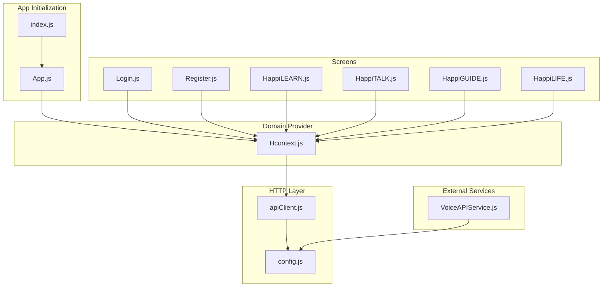
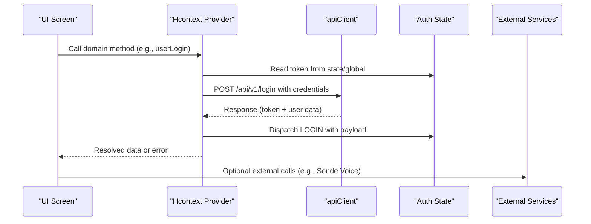
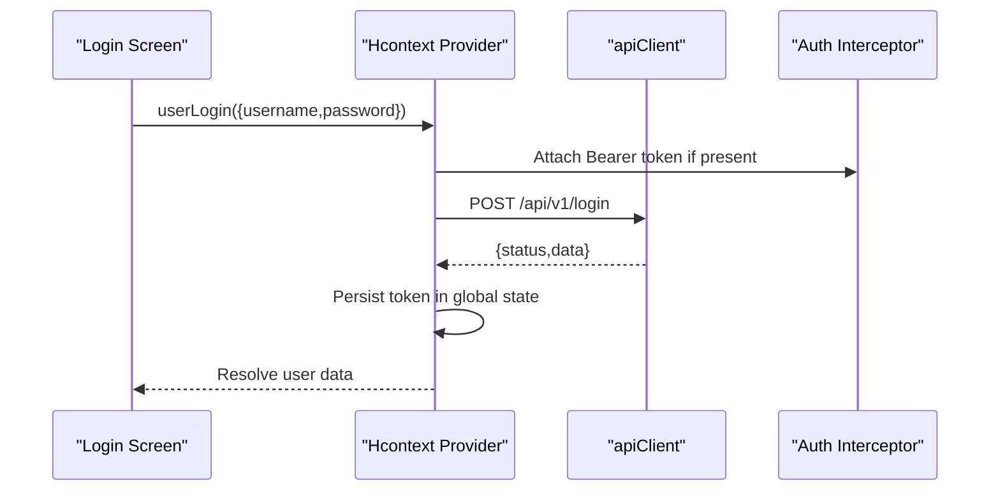
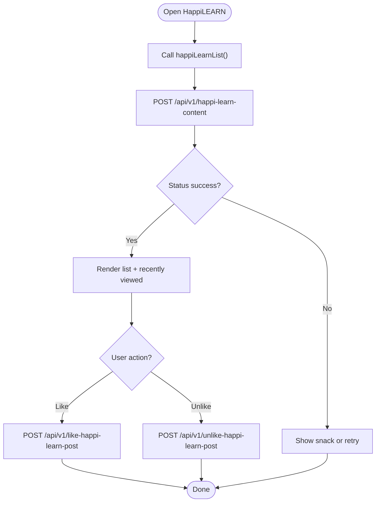
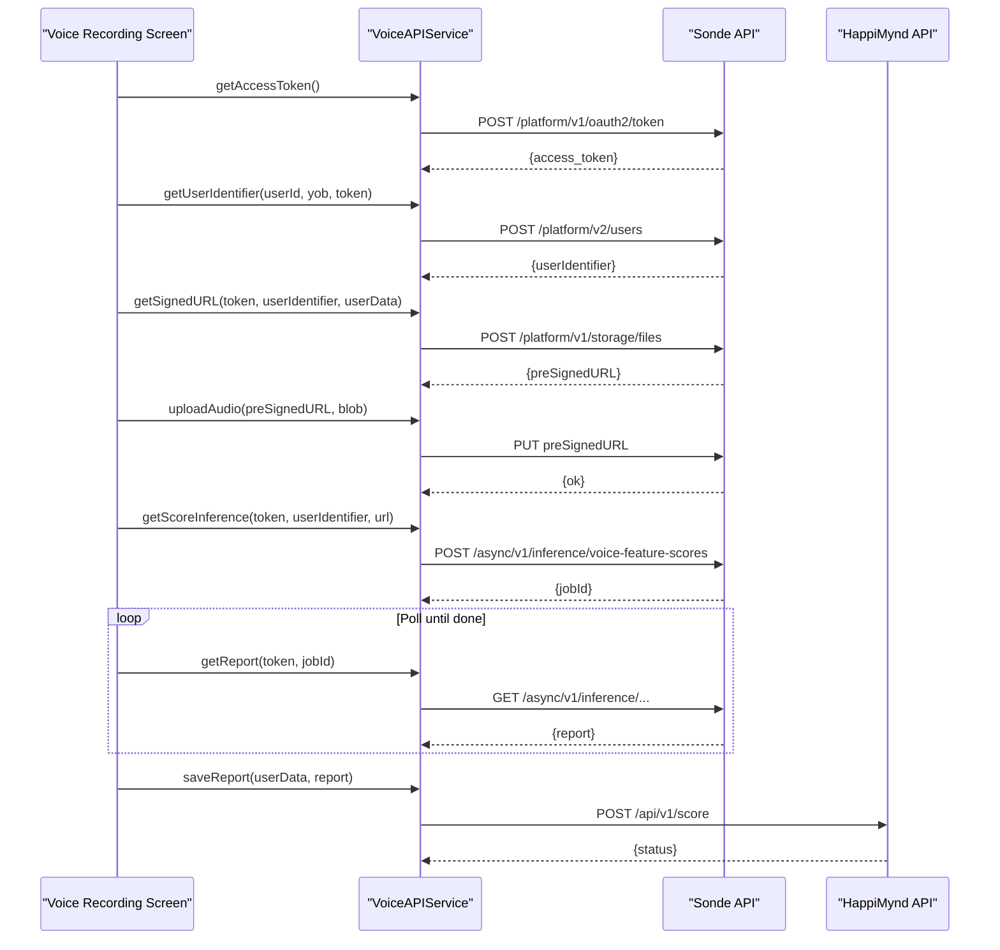
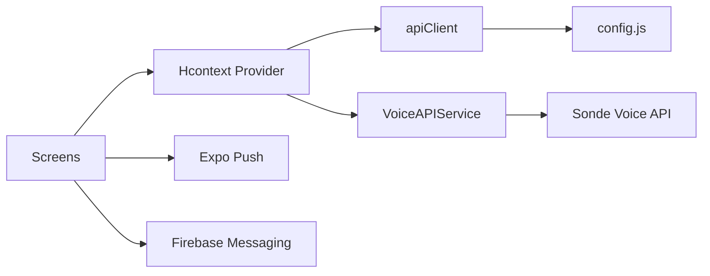

# API Endpoint Patterns

<cite>
**Referenced Files in This Document**
- [apiClient.js](file://src/context/apiClient.js)
- [index.js](file://index.js)
- [App.js](file://App.js)
- [Hcontext.js](file://src/context/Hcontext.js)
- [authReducer.js](file://src/context/reducers/authReducer.js)
- [Login.js](file://src/screens/Auth/Login.js)
- [Register.js](file://src/screens/Auth/Register.js)
- [HappiLEARN.js](file://src/screens/HappiLEARN/HappiLEARN.js)
- [HappiTALK.js](file://src/screens/HappiTALK/HappiTALK.js)
- [HappiGUIDE.js](file://src/screens/HappiGUIDE/HappiGUIDE.js)
- [HappiLIFE.js](file://src/screens/HappiLIFE/HappiLIFE.js)
- [VoiceAPIService.js](file://src/screens/HappiVOICE/VoiceAPIService.js)
- [config.js](file://src/config/index.js)
</cite>

## Table of Contents
1. [Introduction](#introduction)
2. [Project Structure](#project-structure)
3. [Core Components](#core-components)
4. [Architecture Overview](#architecture-overview)
5. [Detailed Component Analysis](#detailed-component-analysis)
6. [Dependency Analysis](#dependency-analysis)
7. [Performance Considerations](#performance-considerations)
8. [Troubleshooting Guide](#troubleshooting-guide)
9. [Conclusion](#conclusion)

## Introduction
This document describes the API endpoint patterns and service integration used by the HappiMynd application. It organizes endpoints by service modules (HappiLIFE, HappiGUIDE, HappiLEARN, HappiTALK, HappiVOICE, HappiSELF, and shared features), explains request/response patterns, authentication flows, user management operations, service booking workflows, content delivery, and real-time features. It also documents parameter validation strategies, data serialization approaches, response processing patterns, CRUD operations across modules, query parameter handling, form data submission patterns, integrations with external services (Sonde Voice Analysis API and payment gateways), and endpoint versioning strategies.

## Project Structure
The application uses a centralized HTTP client with request/response interceptors and a provider pattern to expose domain-specific API methods. Authentication state is managed globally and propagated to the HTTP client for automatic bearer token injection. External integrations are encapsulated in dedicated services.

**Diagram sources**
- [index.js:1-88](file://index.js#L1-L88)
- [App.js:1-59](file://App.js#L1-L59)
- [apiClient.js:1-58](file://src/context/apiClient.js#L1-L58)
- [config.js:1-13](file://src/config/index.js#L1-L13)
- [Hcontext.js:1-1558](file://src/context/Hcontext.js#L1-L1558)
- [Login.js:1-271](file://src/screens/Auth/Login.js#L1-L271)
- [Register.js:1-474](file://src/screens/Auth/Register.js#L1-L474)
- [HappiLEARN.js:1-262](file://src/screens/HappiLEARN/HappiLEARN.js#L1-L262)
- [HappiTALK.js:1-202](file://src/screens/HappiTALK/HappiTALK.js#L1-L202)
- [HappiGUIDE.js:1-342](file://src/screens/HappiGUIDE/HappiGUIDE.js#L1-L342)
- [HappiLIFE.js:1-177](file://src/screens/HappiLIFE/HappiLIFE.js#L1-L177)
- [VoiceAPIService.js:1-264](file://src/screens/HappiVOICE/VoiceAPIService.js#L1-L264)

**Section sources**
- [index.js:1-88](file://index.js#L1-L88)
- [App.js:1-59](file://App.js#L1-L59)
- [apiClient.js:1-58](file://src/context/apiClient.js#L1-L58)
- [config.js:1-13](file://src/config/index.js#L1-L13)
- [Hcontext.js:1-1558](file://src/context/Hcontext.js#L1-L1558)

## Core Components
- Centralized HTTP client with base URL and interceptors:
  - Automatically attaches a Bearer token from global state or persistent storage.
  - Standardizes error responses for downstream handling.
- Domain provider exposing typed methods for:
  - Authentication and user lifecycle.
  - Content discovery and engagement (HappiLEARN).
  - Booking and payment workflows (HappiTALK, HappiGUIDE).
  - Voice analysis pipeline (HappiVOICE).
  - Self-development and notes (HappiSELF).
  - Notifications and analytics.
- External service integrations:
  - Sonde Voice Analysis API for audio scoring and reporting.
  - Push notification delivery via Expo and Firebase.

Key endpoint families observed:
- Authentication: /api/v1/login, /api/v1/login-with-code, /api/v1/logout, /api/v1/signup, /api/v1/edit-profile, /api/v1/get-profile, /api/v1/change-password, /api/v1/forgot-password, /api/v1/verify-otp, /api/v1/reset-password, /api/v1/send-verification-otp
- Assessments: /api/v1/start-assessment, /api/v1/checkifany, /api/v1/save-option, /api/v1/get-report, /api/v1/get-all-report
- Messaging and psychologists: /api/v1/assign-psychologist, /api/v1/switch-language-while-chat, /api/v1/psy-whom-user-currently-chatting, /api/v1/send-message-by-user-to-psy, /api/v1/clear-message-batch-of-user, /api/v1/psychologist-listing
- HappiLEARN: /api/v1/happi-learn-content, /api/v1/happi-learn-content-by-id, /api/v1/like-happi-learn-post, /api/v1/unlike-happi-learn-post
- HappiTALK: /api/v1/join-talk-room-user, /api/v1/payment-for-happitalk, /api/v1/avail-haapitalk-user, /api/v1/my-booking-user, /api/v1/get-slots-of-psy, /api/v1/cancel-booking-user, /api/v1/book-another-session-user, /api/v1/reschedule-booking-user, /api/v1/list-to-book-another-session-user
- HappiGUIDE: /api/v1/payment-for-happiguide, /api/v1/happiguide-session-user, /api/v1/happiguide-reschedule-session-user, /api/v1/avail-happiguide-user
- HappiSELF: /api/v1/course-list, /api/v1/sub-course-list, /api/v1/get-sub-course-content, /api/v1/like-happiself-course, /api/v1/unlike-happiself-course, /api/v1/start-sub-course, /api/v1/end-sub-course, /api/v1/happiself-get-notes-list, /api/v1/happiself-add-notes, /api/v1/happiself-update-notes, /api/v1/happiself-delete-notes-by-id, /api/v1/happiself-library-list, /api/v1/happiself-library-content, /api/v1/save-happiself-content-answer
- Payments: /api/v1/payment, /api/v1/avail-free-services, /api/v1/payment-for-ios, /api/v1/buy-plan, /api/v1/my-subscribed-services, /api/v1/apply-coupon
- Utilities: /api/v1/language-list, /api/v1/white-labelling-status, /api/v1/general-faqs, /api/v1/notification-list, /api/v1/emoji-list, /api/v1/submit-rating, /api/v1/raise-query-app, /api/v1/feedback, /api/v1/submit-opinion-after-session-user, /api/v1/submit-opinion-after-guide-session-user, /api/v1/mood-emoji-list, /api/v1/user-mood, /api/v1/total-reward-points-user, /api/v1/my-referral-code, /api/v1/get-penalty-clause-user, /api/v1/on-off-status, /api/v1/get-user-report-by-psy, /api/v1/save-email, /api/v1/offer-screen-content
- Voice Analysis (via Sonde): OAuth token, user creation, signed URL generation, audio upload, inference, report retrieval, and saving results to HappiMynd backend.

**Section sources**
- [apiClient.js:1-58](file://src/context/apiClient.js#L1-L58)
- [Hcontext.js:136-1515](file://src/context/Hcontext.js#L136-L1515)
- [VoiceAPIService.js:11-264](file://src/screens/HappiVOICE/VoiceAPIService.js#L11-L264)

## Architecture Overview
The app follows a layered architecture:
- UI layer (screens) invokes domain methods from the provider.
- Provider orchestrates HTTP calls via the centralized client and external services.
- Interceptors attach auth tokens and normalize responses.
- Global state manages authentication and UI state transitions.

**Diagram sources**
- [Hcontext.js:136-1515](file://src/context/Hcontext.js#L136-L1515)
- [apiClient.js:1-58](file://src/context/apiClient.js#L1-L58)
- [authReducer.js:17-79](file://src/context/reducers/authReducer.js#L17-L79)

## Detailed Component Analysis

### Authentication Endpoints and Patterns
- Request patterns:
  - Login: POST /api/v1/login with username, password, device_token.
  - Login with code: POST /api/v1/login-with-code with happimynd_code and device_token.
  - Logout: GET /api/v1/logout.
  - Signup: POST /api/v1/signup with user profile and device_token.
  - Edit profile: POST /api/v1/edit-profile with user attributes.
  - Get profile: GET /api/v1/get-profile.
  - Change password: POST /api/v1/change-password with old/new passwords.
  - Forgot password: POST /api/v1/forgot-password with email/mobile/type.
  - Verify OTP: POST /api/v1/verify-otp with email/mobile/otp.
  - Reset password: POST /api/v1/reset-password with new credentials and identifiers.
  - Send verification OTP: POST /api/v1/send-verification-otp with type=email/mobile/country_code.
- Response patterns:
  - Success responses include a status field and data payload.
  - Errors are normalized by the response interceptor and surfaced to UI via snackbars.
- Validation strategies:
  - UI-level checks (e.g., required fields, password length, agreement acceptance).
  - Backend validation enforced by API responses and error messages.

**Diagram sources**
- [Login.js:45-74](file://src/screens/Auth/Login.js#L45-L74)
- [Hcontext.js:136-152](file://src/context/Hcontext.js#L136-L152)
- [apiClient.js:11-44](file://src/context/apiClient.js#L11-L44)
- [authReducer.js:19-30](file://src/context/reducers/authReducer.js#L19-L30)

**Section sources**
- [Login.js:45-74](file://src/screens/Auth/Login.js#L45-L74)
- [Register.js:87-184](file://src/screens/Auth/Register.js#L87-L184)
- [Hcontext.js:136-387](file://src/context/Hcontext.js#L136-L387)
- [apiClient.js:11-56](file://src/context/apiClient.js#L11-L56)
- [authReducer.js:17-79](file://src/context/reducers/authReducer.js#L17-L79)

### User Management Operations
- Profile management:
  - Edit profile: POST /api/v1/edit-profile with nickname, user_profile_id, age, gender, username, email, mobile.
  - Get profile: GET /api/v1/get-profile.
  - Change password: POST /api/v1/change-password with old/new/confirm passwords.
  - Delete account: POST /api/v1/delete-account.
- Preferences and analytics:
  - Save email: POST /api/v1/save-email.
  - Screen traffic analytics: POST https://app.nativenotify.com/api/analytics with app_id/app_token/screenName.

Validation and serialization:
- UI composes structured payloads and validates locally before submission.
- Responses are parsed and dispatched to reducers for state updates.

**Section sources**
- [Hcontext.js:273-308](file://src/context/Hcontext.js#L273-L308)
- [Hcontext.js:1387-1404](file://src/context/Hcontext.js#L1387-L1404)
- [Hcontext.js:1328-1341](file://src/context/Hcontext.js#L1328-L1341)

### Service Booking Workflows
- HappiTALK:
  - Listing and availability: POST /api/v1/psychologist-listing with search.
  - Slots: POST /api/v1/get-slots-of-psy with psychologist_id.
  - Payments: POST /api/v1/payment-for-happitalk with plan_id, amount, date, time, session, recording permission, coupon_id.
  - Booking actions: POST /api/v1/my-booking-user, /api/v1/cancel-booking-user, /api/v1/book-another-session-user, /api/v1/reschedule-booking-user, /api/v1/list-to-book-another-session-user.
  - Room joining: POST /api/v1/join-talk-room-user with session_id.
- HappiGUIDE:
  - Session status: POST /api/v1/happiguide-session-user.
  - Payments: POST /api/v1/payment-for-happiguide with plan_id/date/time/coupon_id.
  - Rescheduling: POST /api/v1/happiguide-reschedule-session-user with session_id/date/time.
  - Availability: POST /api/v1/avail-happiguide-user with plan_id/date/time/coupon_id.

Parameter handling:
- Query-like filters are passed as JSON bodies for POST endpoints.
- Boolean flags are serialized as strings ("true"/"false") where required by the backend.

**Section sources**
- [Hcontext.js:1111-1278](file://src/context/Hcontext.js#L1111-L1278)
- [HappiTALK.js:42-86](file://src/screens/HappiTALK/HappiTALK.js#L42-L86)
- [HappiGUIDE.js:137-183](file://src/screens/HappiGUIDE/HappiGUIDE.js#L137-L183)

### Content Delivery Mechanisms (HappiLEARN)
- Discovery:
  - List content: POST /api/v1/happi-learn-content with search, content_type, parameters, profile, language.
  - Fetch by ID: POST /api/v1/happi-learn-content-by-id with content_id.
- Engagement:
  - Like/Unlike posts: POST /api/v1/like-happi-learn-post and /api/v1/unlike-happi-learn-post with happi_learn_content_id.
- Pagination and filtering:
  - Filtering is handled client-side after receiving paginated lists.

**Diagram sources**
- [HappiLEARN.js:97-115](file://src/screens/HappiLEARN/HappiLEARN.js#L97-L115)
- [Hcontext.js:554-588](file://src/context/Hcontext.js#L554-L588)

**Section sources**
- [HappiLEARN.js:66-115](file://src/screens/HappiLEARN/HappiLEARN.js#L66-L115)
- [Hcontext.js:554-614](file://src/context/Hcontext.js#L554-L614)

### Real-Time Features and Messaging
- Psychologist assignment and chat:
  - Assign: POST /api/v1/assign-psychologist with language.
  - Switch language: POST /api/v1/switch-language-while-chat with language.
  - Current assignment: GET /api/v1/psy-whom-user-currently-chatting.
  - Send message: POST /api/v1/send-message-by-user-to-psy with group_id, psychologist_id, message.
  - Clear batch: POST /api/v1/clear-message-batch-of-user.
- Push notifications:
  - Expo push: POST https://exp.host/--/api/v2/push/send with device token and message.
  - Firebase messaging setup and token retrieval are initialized at startup.

**Section sources**
- [Hcontext.js:493-552](file://src/context/Hcontext.js#L493-L552)
- [index.js:5-17](file://index.js#L5-L17)

### Assessment and Reporting
- Start assessment: POST /api/v1/start-assessment with platform.
- Check assessments: POST /api/v1/checkifany with platform.
- Submit answers: POST /api/v1/save-option with option_question_id.
- Retrieve reports: GET /api/v1/get-report and GET /api/v1/get-all-report.

Validation and error handling:
- UI displays snackbar messages for failures and logs detailed error info.

**Section sources**
- [Hcontext.js:389-458](file://src/context/Hcontext.js#L389-L458)

### Payments and Subscriptions
- Plans and subscriptions:
  - Buy plans: GET /api/v1/buy-plan.
  - My subscriptions: GET /api/v1/my-subscribed-services.
  - Apply coupon: POST /api/v1/apply-coupon with plan_id and coupon.
- Payments:
  - Standard payment: POST /api/v1/payment with plan_id, amount, coupon_id.
  - Free services: POST /api/v1/avail-free-services with plan_id.
  - iOS payment: POST /api/v1/payment-for-ios with merchant_name, transaction_id, receipt.
- Credits and rescheduling:
  - List credits: GET /api/v1/list-to-book-another-session-user.
  - Reschedule bookings: POST /api/v1/reschedule-booking-user and /api/v1/happiguide-reschedule-session-user.

**Section sources**
- [Hcontext.js:616-644](file://src/context/Hcontext.js#L616-L644)
- [Hcontext.js:1063-1084](file://src/context/Hcontext.js#L1063-L1084)
- [Hcontext.js:1193-1245](file://src/context/Hcontext.js#L1193-L1245)

### HappiVOICE Integration
- End-to-end voice analysis pipeline:
  - Prompt list: GET /api/v1/prompt-list.
  - Sonde OAuth: POST https://api.sondeservices.com/platform/v1/oauth2/token with Basic auth and client_credentials.
  - Create user: POST https://api.sondeservices.com/platform/v2/users?userIdentifier={userId} with profile metadata.
  - Signed URL: POST https://api.sondeservices.com/platform/v1/storage/files with fileType, countryCode, userIdentifier, audioMetaInfo.
  - Upload audio: PUT to pre-signed URL with audio/wav.
  - Inference: POST https://api.sondeservices.com/platform/async/v1/inference/voice-feature-scores with infer specs, userIdentifier, filePath, measureName.
  - Poll report: GET https://api.sondeservices.com/platform/async/v1/inference/voice-feature-scores/{jobId}.
  - Save report: POST /api/v1/score with computed metrics and metadata.
- Data serialization:
  - JSON payloads for Sonde endpoints.
  - Binary uploads via pre-signed URLs.

**Diagram sources**
- [VoiceAPIService.js:26-201](file://src/screens/HappiVOICE/VoiceAPIService.js#L26-L201)
- [VoiceAPIService.js:204-259](file://src/screens/HappiVOICE/VoiceAPIService.js#L204-L259)
- [config.js:5-7](file://src/config/index.js#L5-L7)

**Section sources**
- [VoiceAPIService.js:11-264](file://src/screens/HappiVOICE/VoiceAPIService.js#L11-L264)
- [config.js:5-7](file://src/config/index.js#L5-L7)

### HappiSELF: Courses, Notes, Library
- Courses:
  - List courses: GET /api/v1/course-list.
  - Sub-courses: POST /api/v1/sub-course-list with happiself_course_id.
  - Content: POST /api/v1/get-sub-course-content with happiself_sub_course_id.
  - Like/Unlike: POST /api/v1/like-happiself-course, /api/v1/unlike-happiself-course.
  - Start/End: POST /api/v1/start-sub-course, /api/v1/end-sub-course.
- Notes:
  - List: GET /api/v1/happiself-get-notes-list.
  - Add/Update/Delete: POST /api/v1/happiself-add-notes, /api/v1/happiself-update-notes, /api/v1/happiself-delete-notes-by-id.
- Library:
  - List/Library content: GET /api/v1/happiself-library-list, POST /api/v1/happiself-library-content with happiself_library_id.
- Self-content answers: POST /api/v1/save-happiself-content-answer with content_id and answer.

**Section sources**
- [Hcontext.js:886-1061](file://src/context/Hcontext.js#L886-L1061)

### Additional Utilities and Integrations
- White-labeling: GET /api/v1/white-labelling-status.
- FAQs: GET https://happimynd.com/api/v1/general-faqs.
- Offer screen content: GET https://happimynd.com/api/v1/offer-screen-content.
- Notifications: GET /api/v1/notification-list.
- Emojis and ratings: GET /api/v1/emoji-list, POST /api/v1/submit-rating.
- Queries and feedback: POST /api/v1/raise-query-app, POST /api/v1/feedback.
- Opinions after sessions: POST /api/v1/submit-opinion-after-session-user and /api/v1/submit-opinion-after-guide-session-user.
- Mood tracking: GET /api/v1/mood-emoji-list, POST /api/v1/user-mood.
- Rewards and referrals: GET /api/v1/total-reward-points-user, GET /api/v1/my-referral-code, GET /api/v1/reward-instances-list.
- Penalties and on/off status: GET /api/v1/get-penalty-clause-user, GET /api/v1/on-off-status.
- User reports: POST /api/v1/get-user-report-by-psy with user_id.

**Section sources**
- [Hcontext.js:866-1327](file://src/context/Hcontext.js#L866-L1327)

## Dependency Analysis
- HTTP client depends on:
  - Base URL from configuration.
  - Global auth token propagation from reducers.
- Screens depend on:
  - Provider methods for domain operations.
  - UI components for rendering and user input capture.
- External services:
  - Sonde Voice API for audio scoring.
  - Expo push notifications for chat alerts.
  - Firebase for storage and messaging initialization.

**Diagram sources**
- [Hcontext.js:1-1558](file://src/context/Hcontext.js#L1-L1558)
- [apiClient.js:1-58](file://src/context/apiClient.js#L1-L58)
- [config.js:1-13](file://src/config/index.js#L1-L13)
- [VoiceAPIService.js:1-264](file://src/screens/HappiVOICE/VoiceAPIService.js#L1-L264)
- [index.js:5-17](file://index.js#L5-L17)

**Section sources**
- [Hcontext.js:1-1558](file://src/context/Hcontext.js#L1-L1558)
- [apiClient.js:1-58](file://src/context/apiClient.js#L1-L58)
- [config.js:1-13](file://src/config/index.js#L1-L13)
- [VoiceAPIService.js:1-264](file://src/screens/HappiVOICE/VoiceAPIService.js#L1-L264)
- [index.js:5-17](file://index.js#L5-L17)

## Performance Considerations
- Timeout and retries:
  - Centralized client sets a 15-second timeout to prevent hanging requests.
- Token caching:
  - Global token caching reduces repeated storage reads.
- Batch operations:
  - Messaging batch clearing reduces server-side backlog.
- Network hygiene:
  - Prefer POST for filters and queries to avoid URL length limits.
- External service timeouts:
  - Consider adding per-call timeouts for Sonde endpoints due to async inference.

[No sources needed since this section provides general guidance]

## Troubleshooting Guide
- Authentication failures:
  - Verify token presence in global state and AsyncStorage.
  - Inspect normalized error messages returned by the response interceptor.
- Network errors:
  - Check timeout logs and SSL/network issues for endpoints without bearer tokens.
- Sonde integration:
  - Validate OAuth credentials and scopes.
  - Ensure signed URL expiry and upload completion.
  - Poll job status until completion before retrieving results.
- UI feedback:
  - Snackbars surface user-facing errors; ensure dispatch handlers are wired in screens.

**Section sources**
- [apiClient.js:47-56](file://src/context/apiClient.js#L47-L56)
- [VoiceAPIService.js:26-50](file://src/screens/HappiVOICE/VoiceAPIService.js#L26-L50)
- [VoiceAPIService.js:187-201](file://src/screens/HappiVOICE/VoiceAPIService.js#L187-L201)

## Conclusion
HappiMynd’s API patterns center on a robust, centralized HTTP client with automatic authentication and standardized error handling. Domain-specific operations are exposed via a provider, enabling clean separation of concerns across modules. External integrations (Sonde Voice, payment gateways, push notifications) are encapsulated and invoked from domain methods. The endpoint families reflect a clear service-module organization, with consistent request/response patterns, parameter validation strategies, and data serialization approaches. Versioning appears to be indicated by the /api/v1 path prefix, and backward compatibility is maintained by preserving endpoint signatures and normalizing error responses.