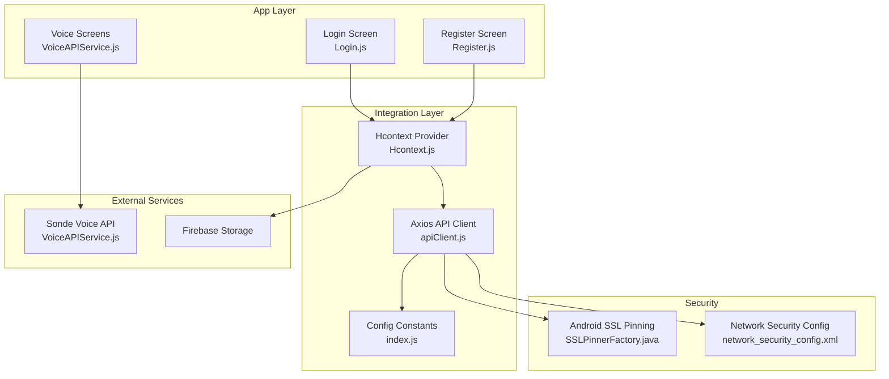
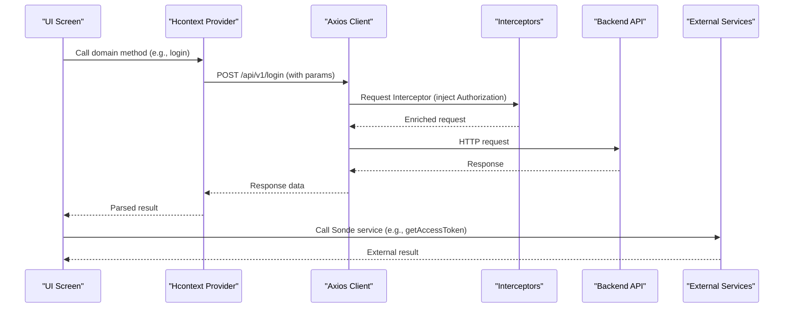
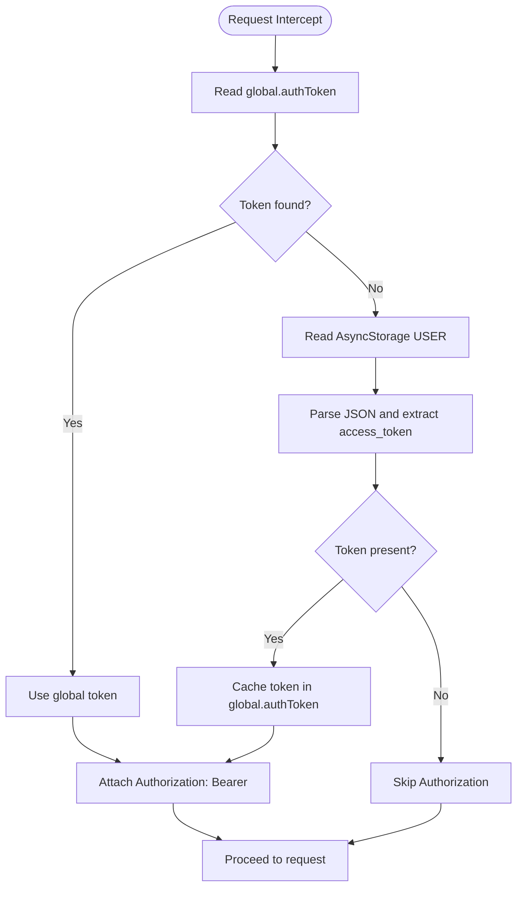
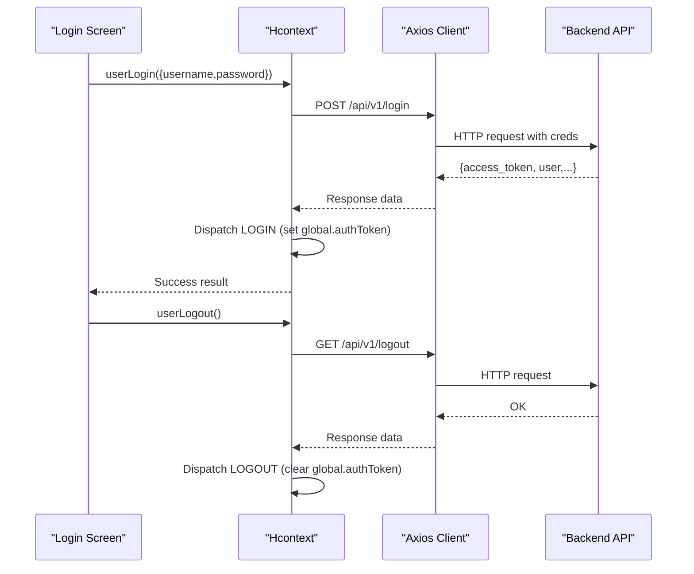
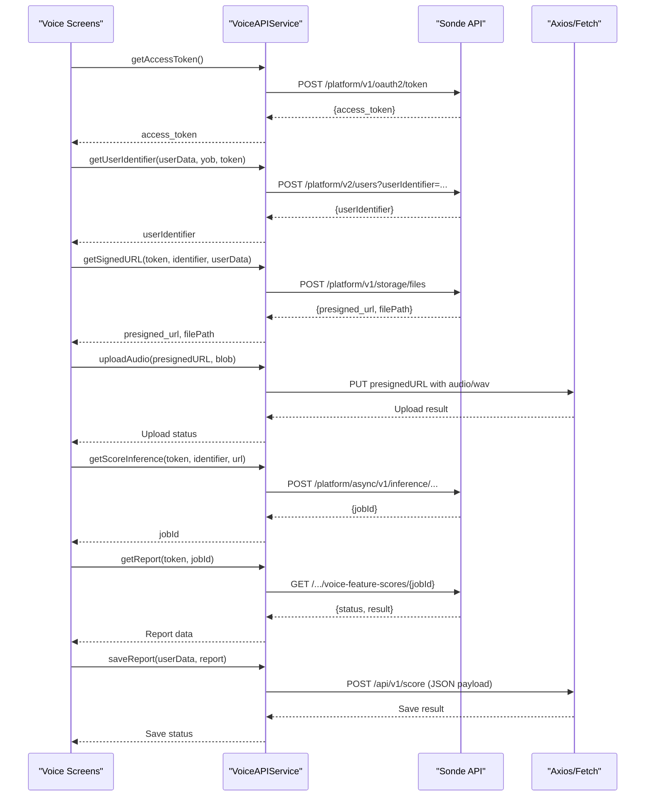
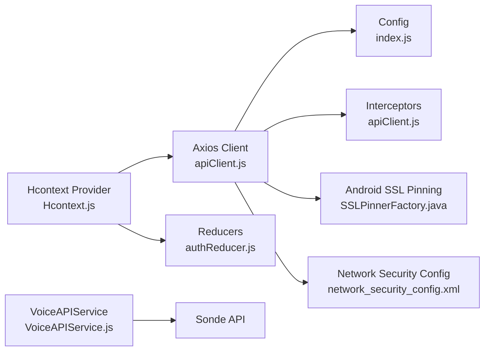

# API Integration

<cite>
**Referenced Files in This Document**
- [apiClient.js](file://src/context/apiClient.js)
- [Hcontext.js](file://src/context/Hcontext.js)
- [index.js](file://src/config/index.js)
- [Login.js](file://src/screens/Auth/Login.js)
- [Register.js](file://src/screens/Auth/Register.js)
- [VoiceAPIService.js](file://src/screens/HappiVOICE/VoiceAPIService.js)
- [SSLPinnerFactory.java](file://android/app/src/main/java/com/happimynd/SSLPinnerFactory.java)
- [network_security_config.xml](file://android/app/src/main/res/xml/network_security_config.xml)
</cite>

## Table of Contents
1. [Introduction](#introduction)
2. [Project Structure](#project-structure)
3. [Core Components](#core-components)
4. [Architecture Overview](#architecture-overview)
5. [Detailed Component Analysis](#detailed-component-analysis)
6. [Dependency Analysis](#dependency-analysis)
7. [Performance Considerations](#performance-considerations)
8. [Troubleshooting Guide](#troubleshooting-guide)
9. [Conclusion](#conclusion)
10. [Appendices](#appendices)

## Introduction
This document explains HappiMynd’s API integration patterns built on the Axios HTTP client. It covers the centralized API client configuration, authentication flow with bearer tokens, request/response interceptors, error handling, endpoint patterns for authentication, user management, service booking, content delivery, and real-time features. It also documents integrations with external services (Sonde Voice Analysis API), payment flows, SSL pinning, CORS configuration, and operational best practices such as timeouts and offline resilience.

## Project Structure
The API integration is centered around a single Axios instance configured in a dedicated module, consumed by a global context provider that exposes typed methods for each API domain. External service integrations are encapsulated in separate modules.

**Diagram sources**
- [apiClient.js:1-58](file://src/context/apiClient.js#L1-L58)
- [Hcontext.js:1-200](file://src/context/Hcontext.js#L1-L200)
- [index.js:1-13](file://src/config/index.js#L1-L13)
- [Login.js:1-271](file://src/screens/Auth/Login.js#L1-L271)
- [Register.js:1-474](file://src/screens/Auth/Register.js#L1-L474)
- [VoiceAPIService.js:1-264](file://src/screens/HappiVOICE/VoiceAPIService.js#L1-L264)
- [SSLPinnerFactory.java:1-22](file://android/app/src/main/java/com/happimynd/SSLPinnerFactory.java#L1-L22)
- [network_security_config.xml:1-10](file://android/app/src/main/res/xml/network_security_config.xml#L1-L10)

**Section sources**
- [apiClient.js:1-58](file://src/context/apiClient.js#L1-L58)
- [Hcontext.js:1-200](file://src/context/Hcontext.js#L1-L200)
- [index.js:1-13](file://src/config/index.js#L1-L13)
- [Login.js:1-271](file://src/screens/Auth/Login.js#L1-L271)
- [Register.js:1-474](file://src/screens/Auth/Register.js#L1-L474)
- [VoiceAPIService.js:1-264](file://src/screens/HappiVOICE/VoiceAPIService.js#L1-L264)
- [SSLPinnerFactory.java:1-22](file://android/app/src/main/java/com/happimynd/SSLPinnerFactory.java#L1-L22)
- [network_security_config.xml:1-10](file://android/app/src/main/res/xml/network_security_config.xml#L1-L10)

## Core Components
- Centralized Axios client with base URL, timeout, request/response interceptors, and token injection.
- Global context provider exposing typed API methods for authentication, user management, bookings, content, analytics, and payments.
- External service integrations (Sonde Voice Analysis) with dedicated functions for OAuth, user identity, signed URLs, uploads, inference, and report retrieval.
- SSL pinning and network security configuration for secure transport.

Key responsibilities:
- apiClient.js: Base URL, timeout, Authorization header injection, unified error handling.
- Hcontext.js: Domain-specific API methods, parameter shaping, and error propagation.
- VoiceAPIService.js: Sonde-specific flows and data transformations.
- index.js: Environment constants for base URLs and analytics.
- Android SSL pinning and network config: Transport-layer security.

**Section sources**
- [apiClient.js:1-58](file://src/context/apiClient.js#L1-L58)
- [Hcontext.js:129-172](file://src/context/Hcontext.js#L129-L172)
- [VoiceAPIService.js:26-50](file://src/screens/HappiVOICE/VoiceAPIService.js#L26-L50)
- [index.js:1-13](file://src/config/index.js#L1-L13)
- [SSLPinnerFactory.java:10-21](file://android/app/src/main/java/com/happimynd/SSLPinnerFactory.java#L10-L21)
- [network_security_config.xml:1-10](file://android/app/src/main/res/xml/network_security_config.xml#L1-L10)

## Architecture Overview
The app uses a single Axios instance configured centrally. All domain-specific calls are exposed via the Hcontext provider. Authentication tokens are injected automatically via a request interceptor. External services (e.g., Sonde Voice) are accessed through dedicated modules that may use Axios or native fetch depending on the requirement.

**Diagram sources**
- [apiClient.js:12-44](file://src/context/apiClient.js#L12-L44)
- [Hcontext.js:129-145](file://src/context/Hcontext.js#L129-L145)
- [VoiceAPIService.js:26-50](file://src/screens/HappiVOICE/VoiceAPIService.js#L26-L50)

## Detailed Component Analysis

### Axios API Client Configuration
- Base URL: Resolved from environment constants.
- Timeout: Applied globally to prevent hanging requests.
- Request interceptor:
  - Attempts to read access token from global state and AsyncStorage.
  - Injects Authorization header if available.
  - Logs token presence per request.
- Response interceptor:
  - Logs errors and normalizes error responses to a consistent shape.

**Diagram sources**
- [apiClient.js:12-44](file://src/context/apiClient.js#L12-L44)

**Section sources**
- [apiClient.js:1-58](file://src/context/apiClient.js#L1-L58)
- [index.js:1-13](file://src/config/index.js#L1-L13)

### Authentication Flow and Token Management
- Login:
  - Calls POST /api/v1/login with username, password, and device token.
  - Stores returned user payload in AsyncStorage and dispatches LOGIN to global state.
- Code-based login:
  - Calls POST /api/v1/login-with-code with code and device token.
- Logout:
  - Calls GET /api/v1/logout.
- Token lifecycle:
  - LOGIN action sets global.authToken.
  - LOGOUT action clears global.authToken.
  - Request interceptor reads global.authToken and AsyncStorage as fallback.

**Diagram sources**
- [Hcontext.js:129-172](file://src/context/Hcontext.js#L129-L172)
- [apiClient.js:12-44](file://src/context/apiClient.js#L12-L44)
- [authReducer.js:17-79](file://src/context/reducers/authReducer.js#L17-L79)

**Section sources**
- [Hcontext.js:129-172](file://src/context/Hcontext.js#L129-L172)
- [Login.js:44-74](file://src/screens/Auth/Login.js#L44-L74)
- [Register.js:87-184](file://src/screens/Auth/Register.js#L87-L184)
- [authReducer.js:17-79](file://src/context/reducers/authReducer.js#L17-L79)

### External Service Integration: Sonde Voice Analysis API
- OAuth token acquisition via Sonde’s token endpoint.
- User identity creation with device metadata.
- Signed URL generation for audio upload.
- Audio upload via pre-signed URL using fetch.
- Asynchronous inference job submission and polling for completion.
- Report saving to HappiMynd backend.

**Diagram sources**
- [VoiceAPIService.js:11-264](file://src/screens/HappiVOICE/VoiceAPIService.js#L11-L264)

**Section sources**
- [VoiceAPIService.js:11-264](file://src/screens/HappiVOICE/VoiceAPIService.js#L11-L264)

### Endpoint Patterns and Usage Examples
- Authentication
  - POST /api/v1/login
  - POST /api/v1/login-with-code
  - GET /api/v1/logout
- User Management
  - POST /api/v1/signup
  - POST /api/v1/edit-profile
  - GET /api/v1/get-profile
- Bookings and Sessions
  - POST /api/v1/avail-haapitalk-user
  - POST /api/v1/happiguide-session-user
  - POST /api/v1/join-talk-room-user
  - POST /api/v1/join-guide-room-user
  - POST /api/v1/cancel-booking-user
  - POST /api/v1/reschedule-booking-user
  - POST /api/v1/happiguide-reschedule-session-user
  - GET /api/v1/list-to-book-another-session-user
  - POST /api/v1/book-another-session-user
- Content and Analytics
  - GET /api/v1/offer-screen-content
  - POST https://app.nativenotify.com/api/analytics
- Payments
  - POST /api/v1/payment-for-ios
  - POST /api/v1/payment-for-happiguide
  - POST /api/v1/avail-happiguide-user
  - POST /api/v1/payments (context method)
- Real-time and Notifications
  - FCM token registration and listener wiring in provider.

These endpoints are invoked via the Hcontext provider methods, which internally call the Axios client with appropriate parameters and handle errors.

**Section sources**
- [Hcontext.js:129-172](file://src/context/Hcontext.js#L129-L172)
- [Hcontext.js:1165-1255](file://src/context/Hcontext.js#L1165-L1255)
- [Hcontext.js:1263-1280](file://src/context/Hcontext.js#L1263-L1280)
- [Hcontext.js:1321-1352](file://src/context/Hcontext.js#L1321-L1352)
- [Hcontext.js:1408-1551](file://src/context/Hcontext.js#L1408-L1551)

### Request/Response Transformation and Data Serialization
- Request transformation:
  - Hcontext methods normalize parameters (e.g., mapping UI-friendly keys to API keys).
  - Device token is included in most authentication and user actions.
- Response handling:
  - Interceptor logs and normalizes errors.
  - Consumers receive structured data from res.data.
- External service serialization:
  - Sonde APIs expect JSON payloads and use Authorization headers.
  - Signed URL uploads use fetch with explicit Content-Type.

**Section sources**
- [Hcontext.js:239-264](file://src/context/Hcontext.js#L239-L264)
- [VoiceAPIService.js:26-50](file://src/screens/HappiVOICE/VoiceAPIService.js#L26-L50)
- [VoiceAPIService.js:89-151](file://src/screens/HappiVOICE/VoiceAPIService.js#L89-L151)
- [VoiceAPIService.js:154-201](file://src/screens/HappiVOICE/VoiceAPIService.js#L154-L201)
- [VoiceAPIService.js:204-259](file://src/screens/HappiVOICE/VoiceAPIService.js#L204-L259)

### Error Handling Strategies
- Centralized response interceptor logs and rejects with normalized error payloads.
- Domain methods wrap calls in try/catch, dispatch snack notifications, and rethrow for UI handling.
- External service calls include basic error parsing and logging.

Recommendations:
- Add retry/backoff for transient network errors.
- Implement offline queue for idempotent writes.
- Surface user-friendly messages via snackbars.

**Section sources**
- [apiClient.js:46-56](file://src/context/apiClient.js#L46-L56)
- [Hcontext.js:129-145](file://src/context/Hcontext.js#L129-L145)
- [VoiceAPIService.js:19-23](file://src/screens/HappiVOICE/VoiceAPIService.js#L19-L23)

### Network Error Handling, Retry Mechanisms, and Offline Fallbacks
- Current behavior:
  - Global timeout configured on Axios client.
  - Unified error rejection in response interceptor.
- Recommended enhancements:
  - Implement retry with exponential backoff for 5xx and network errors.
  - Add offline detection and queue for write operations.
  - Persist pending mutations and replay after connectivity restoration.

[No sources needed since this section provides general guidance]

### API Versioning, Rate Limiting, and Security Considerations
- API versioning:
  - Base URL points to production; endpoints use /api/v1/... paths.
- Rate limiting:
  - Not explicitly handled in code; consider adding retry with backoff and jitter.
- CORS:
  - Managed by backend; client uses standard browser-like headers.
- SSL pinning:
  - Android uses CertificatePinner for the production domain.
  - Network security config allows system/user trust anchors.

**Section sources**
- [index.js:1-13](file://src/config/index.js#L1-L13)
- [SSLPinnerFactory.java:10-21](file://android/app/src/main/java/com/happimynd/SSLPinnerFactory.java#L10-L21)
- [network_security_config.xml:1-10](file://android/app/src/main/res/xml/network_security_config.xml#L1-L10)

## Dependency Analysis

**Diagram sources**
- [apiClient.js:1-58](file://src/context/apiClient.js#L1-L58)
- [index.js:1-13](file://src/config/index.js#L1-L13)
- [Hcontext.js:1-200](file://src/context/Hcontext.js#L1-L200)
- [authReducer.js:17-79](file://src/context/reducers/authReducer.js#L17-L79)
- [VoiceAPIService.js:1-264](file://src/screens/HappiVOICE/VoiceAPIService.js#L1-L264)
- [SSLPinnerFactory.java:1-22](file://android/app/src/main/java/com/happimynd/SSLPinnerFactory.java#L1-L22)
- [network_security_config.xml:1-10](file://android/app/src/main/res/xml/network_security_config.xml#L1-L10)

**Section sources**
- [apiClient.js:1-58](file://src/context/apiClient.js#L1-L58)
- [Hcontext.js:1-200](file://src/context/Hcontext.js#L1-L200)
- [VoiceAPIService.js:1-264](file://src/screens/HappiVOICE/VoiceAPIService.js#L1-L264)

## Performance Considerations
- Timeout: 15 seconds applied globally to avoid hanging requests.
- Request caching: Consider memoizing repeated GET requests (e.g., profile, lists) to reduce network overhead.
- Batch operations: Group analytics and non-critical events to minimize network calls.
- Image/audio uploads: Use streaming uploads and progress indicators for better UX.

[No sources needed since this section provides general guidance]

## Troubleshooting Guide
Common issues and resolutions:
- Missing Authorization header:
  - Ensure LOGIN action sets global.authToken and AsyncStorage USER contains access_token.
- Frequent timeouts:
  - Adjust Axios timeout or implement retry with backoff.
- External service failures:
  - Verify Sonde credentials and token lifetimes; check signed URL expiry.
- SSL pinning failures:
  - Confirm hostname and certificate pins match production.

**Section sources**
- [apiClient.js:12-44](file://src/context/apiClient.js#L12-L44)
- [VoiceAPIService.js:26-50](file://src/screens/HappiVOICE/VoiceAPIService.js#L26-L50)
- [SSLPinnerFactory.java:10-21](file://android/app/src/main/java/com/happimynd/SSLPinnerFactory.java#L10-L21)

## Conclusion
HappiMynd’s API integration centers on a robust Axios client with automatic token injection and unified error handling. The Hcontext provider organizes domain-specific calls, while external services like Sonde are integrated through dedicated modules. Security is strengthened via SSL pinning and environment-driven base URLs. To further improve reliability, consider implementing retries, offline queues, and enhanced error surfacing.

## Appendices
- Example invocation patterns:
  - Login: [Hcontext.js:129-145](file://src/context/Hcontext.js#L129-L145)
  - Signup: [Hcontext.js:239-264](file://src/context/Hcontext.js#L239-L264)
  - Book session: [Hcontext.js:1165-1255](file://src/context/Hcontext.js#L1165-L1255)
  - Voice analysis: [VoiceAPIService.js:26-201](file://src/screens/HappiVOICE/VoiceAPIService.js#L26-L201)