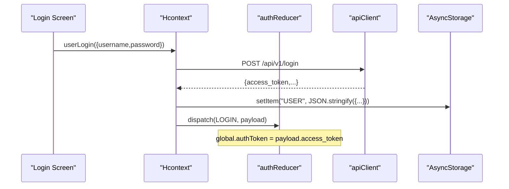
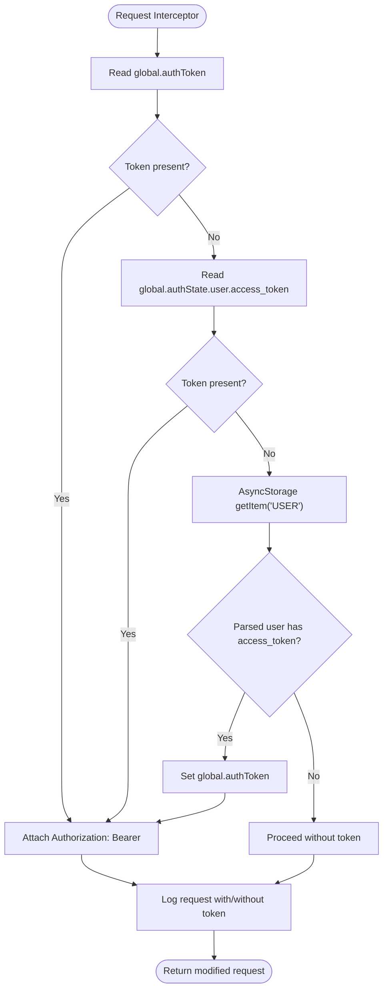
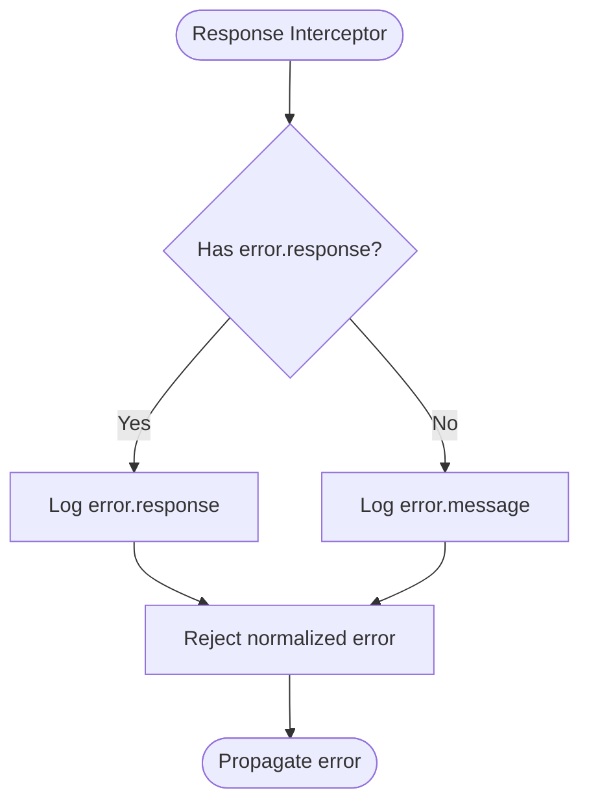
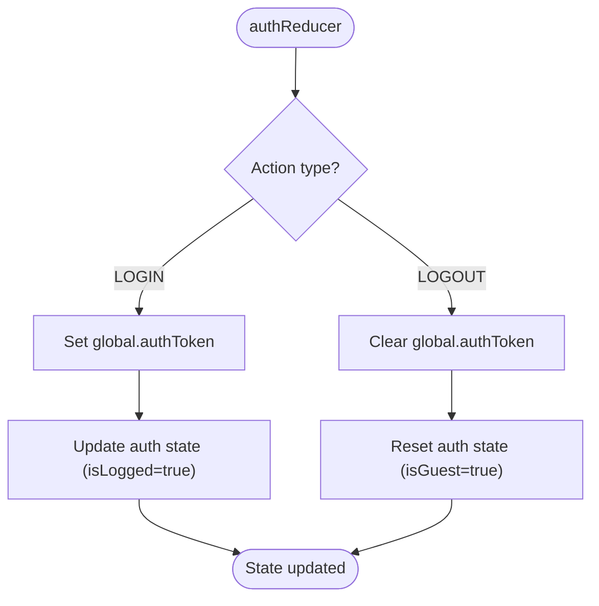
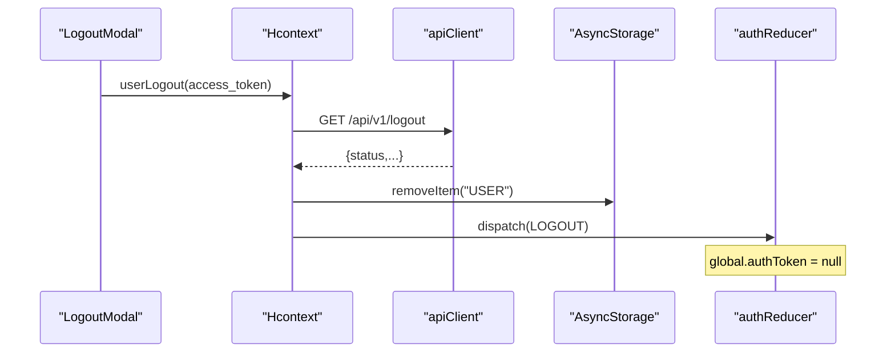
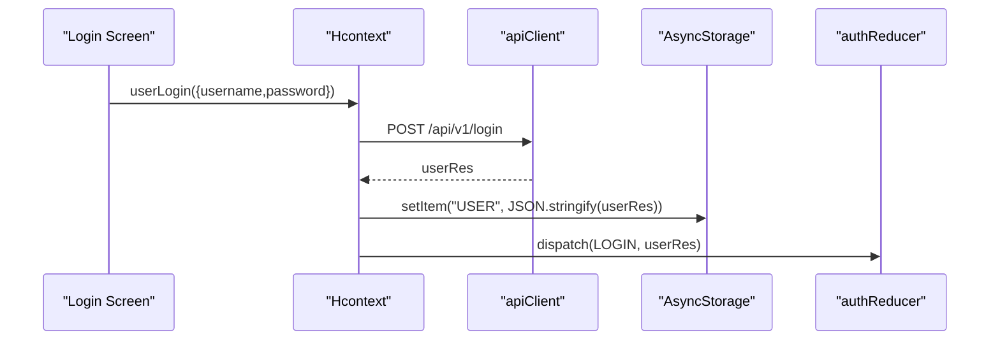
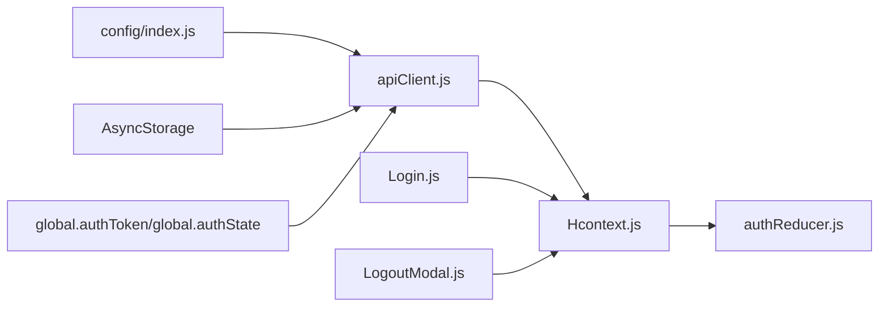

# Authentication & Token Management

<cite>
**Referenced Files in This Document**
- [apiClient.js](file://src/context/apiClient.js)
- [authReducer.js](file://src/context/reducers/authReducer.js)
- [Hcontext.js](file://src/context/Hcontext.js)
- [Login.js](file://src/screens/Auth/Login.js)
- [LogoutModal.js](file://src/components/Modals/LogoutModal.js)
- [index.js](file://src/config/index.js)
- [test_endpoints.js](file://test_endpoints.js)
</cite>

## Table of Contents
1. [Introduction](#introduction)
2. [Project Structure](#project-structure)
3. [Core Components](#core-components)
4. [Architecture Overview](#architecture-overview)
5. [Detailed Component Analysis](#detailed-component-analysis)
6. [Dependency Analysis](#dependency-analysis)
7. [Performance Considerations](#performance-considerations)
8. [Troubleshooting Guide](#troubleshooting-guide)
9. [Conclusion](#conclusion)

## Introduction
This document explains the authentication and token management system used by HappiMynd’s API integration. It focuses on:
- How bearer tokens are injected into outgoing requests via a request interceptor
- The multi-source token lookup strategy (global state, auth state, AsyncStorage)
- Token caching and persistence
- Logging mechanisms for debugging authentication flows
- Response interceptor error handling for authentication failures and unauthorized responses
- Token lifecycle management, automatic refresh patterns, and logout procedures

## Project Structure
The authentication and token management logic is primarily implemented in three areas:
- API client with interceptors for request and response handling
- Authentication reducer for managing global auth state and clearing tokens on logout
- Context provider that orchestrates login, logout, and AsyncStorage persistence

```mermaid
graph TB
subgraph "API Layer"
AX["axios instance<br/>apiClient.js"]
REQ["Request Interceptor<br/>Injects Authorization: Bearer"]
RES["Response Interceptor<br/>Logs errors"]
end
subgraph "State & Persistence"
AR["authReducer.js<br/>LOGIN/LOGOUT actions"]
HC["Hcontext.js<br/>userLogin/userLogout"]
AS["AsyncStorage<br/>"USER" key"]
end
subgraph "UI"
LG["Login.js<br/>Persists USER and dispatches LOGIN"]
LOM["LogoutModal.js<br/>Calls userLogout and clears storage"]
end
AX --> REQ
AX --> RES
REQ --> AR
RES --> AX
LG --> AS
LG --> AR
LOM --> AS
LOM --> AR
HC --> AX
```

**Diagram sources**
- [apiClient.js:1-58](file://src/context/apiClient.js#L1-L58)
- [authReducer.js:17-78](file://src/context/reducers/authReducer.js#L17-L78)
- [Hcontext.js:129-172](file://src/context/Hcontext.js#L129-L172)
- [Login.js:44-74](file://src/screens/Auth/Login.js#L44-L74)
- [LogoutModal.js:35-52](file://src/components/Modals/LogoutModal.js#L35-L52)

**Section sources**
- [apiClient.js:1-58](file://src/context/apiClient.js#L1-L58)
- [authReducer.js:17-78](file://src/context/reducers/authReducer.js#L17-L78)
- [Hcontext.js:129-172](file://src/context/Hcontext.js#L129-L172)
- [Login.js:44-74](file://src/screens/Auth/Login.js#L44-L74)
- [LogoutModal.js:35-52](file://src/components/Modals/LogoutModal.js#L35-L52)

## Core Components
- API client with interceptors:
  - Request interceptor retrieves tokens from multiple sources and attaches Authorization headers
  - Response interceptor logs errors and normalizes error payloads
- Authentication reducer:
  - Sets global token on login and clears it on logout
- Context provider:
  - Implements login and logout flows, persists user data to AsyncStorage, and coordinates state updates
- UI screens:
  - Login screen persists USER and dispatches LOGIN
  - Logout modal triggers userLogout, clears AsyncStorage, and dispatches LOGOUT

Key behaviors:
- Token retrieval order: global.authToken → authState.user.access_token → AsyncStorage ("USER")
- Caching: when a token is found in AsyncStorage, it is cached in global.authToken for subsequent requests
- Error logging: request interceptor logs URLs when attaching tokens; response interceptor logs error details

**Section sources**
- [apiClient.js:11-56](file://src/context/apiClient.js#L11-L56)
- [authReducer.js:19-74](file://src/context/reducers/authReducer.js#L19-L74)
- [Hcontext.js:129-172](file://src/context/Hcontext.js#L129-L172)
- [Login.js:65-69](file://src/screens/Auth/Login.js#L65-L69)
- [LogoutModal.js:38-47](file://src/components/Modals/LogoutModal.js#L38-L47)

## Architecture Overview
The authentication flow integrates UI, state, persistence, and HTTP clients as follows:



**Diagram sources**
- [Login.js:56-69](file://src/screens/Auth/Login.js#L56-L69)
- [Hcontext.js:129-144](file://src/context/Hcontext.js#L129-L144)
- [authReducer.js:19-30](file://src/context/reducers/authReducer.js#L19-L30)
- [apiClient.js:6-9](file://src/context/apiClient.js#L6-L9)

## Detailed Component Analysis

### Request Interceptor: Token Retrieval and Injection
The request interceptor implements a multi-source lookup strategy and injects Authorization headers:
- Sources (in order):
  - global.authToken
  - global.authState.user.access_token
  - AsyncStorage item "USER" parsed for access_token
- Caching:
  - If a token is found in AsyncStorage, it is cached in global.authToken for subsequent requests
- Logging:
  - Logs whether a token was attached or not for each request URL



**Diagram sources**
- [apiClient.js:12-42](file://src/context/apiClient.js#L12-L42)

**Section sources**
- [apiClient.js:12-42](file://src/context/apiClient.js#L12-L42)

### Response Interceptor: Error Logging and Normalization
The response interceptor:
- Logs the error response or message
- Normalizes the error payload to an object with a message field for consistent handling downstream



**Diagram sources**
- [apiClient.js:46-56](file://src/context/apiClient.js#L46-L56)

**Section sources**
- [apiClient.js:46-56](file://src/context/apiClient.js#L46-L56)

### Authentication Reducer: Token Lifecycle
The reducer manages token lifecycle:
- LOGIN action:
  - Sets global.authToken from payload.access_token
  - Updates auth state to logged-in
- LOGOUT action:
  - Clears global.authToken
  - Resets auth state to guest mode



**Diagram sources**
- [authReducer.js:19-74](file://src/context/reducers/authReducer.js#L19-L74)

**Section sources**
- [authReducer.js:19-30](file://src/context/reducers/authReducer.js#L19-L30)
- [authReducer.js:65-74](file://src/context/reducers/authReducer.js#L65-L74)

### Context Provider: Login and Logout Orchestration
The context provider coordinates authentication flows:
- userLogin:
  - Posts to /api/v1/login
  - Persists the entire user object to AsyncStorage under "USER"
  - Dispatches LOGIN to update state and cache token globally
- userLogout:
  - Calls GET /api/v1/logout
  - Clears AsyncStorage "USER" and related keys
  - Dispatches LOGOUT to reset state and clear global token



**Diagram sources**
- [Hcontext.js:164-172](file://src/context/Hcontext.js#L164-L172)
- [LogoutModal.js:38-47](file://src/components/Modals/LogoutModal.js#L38-L47)
- [authReducer.js:65-74](file://src/context/reducers/authReducer.js#L65-L74)

**Section sources**
- [Hcontext.js:129-144](file://src/context/Hcontext.js#L129-L144)
- [Hcontext.js:164-172](file://src/context/Hcontext.js#L164-L172)
- [LogoutModal.js:38-47](file://src/components/Modals/LogoutModal.js#L38-L47)

### UI Integration: Login and Logout Screens
- Login screen:
  - Calls userLogin
  - Persists returned user object to AsyncStorage
  - Dispatches LOGIN to update state and cache token globally
- Logout modal:
  - Calls userLogout
  - Clears AsyncStorage "USER" and related keys
  - Dispatches LOGOUT to reset state and clear global token



**Diagram sources**
- [Login.js:56-69](file://src/screens/Auth/Login.js#L56-L69)
- [Hcontext.js:129-144](file://src/context/Hcontext.js#L129-L144)

**Section sources**
- [Login.js:65-69](file://src/screens/Auth/Login.js#L65-L69)
- [LogoutModal.js:42-47](file://src/components/Modals/LogoutModal.js#L42-L47)

## Dependency Analysis
- apiClient depends on:
  - config.BASE_URL for base URL
  - AsyncStorage for token fallback
  - global.authToken/global.authState for token sources
- authReducer depends on:
  - global.authToken for token caching
- Hcontext depends on:
  - apiClient for HTTP calls
  - AsyncStorage for persistence
  - authReducer for state transitions



**Diagram sources**
- [index.js:1-13](file://src/config/index.js#L1-L13)
- [apiClient.js:1-9](file://src/context/apiClient.js#L1-L9)
- [Hcontext.js:129-172](file://src/context/Hcontext.js#L129-L172)
- [authReducer.js:19-74](file://src/context/reducers/authReducer.js#L19-L74)
- [Login.js:65-69](file://src/screens/Auth/Login.js#L65-L69)
- [LogoutModal.js:42-47](file://src/components/Modals/LogoutModal.js#L42-L47)

**Section sources**
- [index.js:1-13](file://src/config/index.js#L1-L13)
- [apiClient.js:1-9](file://src/context/apiClient.js#L1-L9)
- [Hcontext.js:129-172](file://src/context/Hcontext.js#L129-L172)
- [authReducer.js:19-74](file://src/context/reducers/authReducer.js#L19-L74)
- [Login.js:65-69](file://src/screens/Auth/Login.js#L65-L69)
- [LogoutModal.js:42-47](file://src/components/Modals/LogoutModal.js#L42-L47)

## Performance Considerations
- Request timeout: The axios instance sets a 15-second timeout to prevent hanging requests.
- Token caching: Found tokens from AsyncStorage are cached in global.authToken to avoid repeated disk reads.
- Logging overhead: Console logging during interceptors aids debugging but should be minimized in production builds.

Recommendations:
- Consider adding exponential backoff for retry logic if needed.
- Use a centralized error handler to avoid duplicating error logging across components.
- Monitor AsyncStorage read/write frequency and consider batching writes where appropriate.

**Section sources**
- [apiClient.js:6-9](file://src/context/apiClient.js#L6-L9)
- [apiClient.js:24-27](file://src/context/apiClient.js#L24-L27)

## Troubleshooting Guide
Common issues and resolutions:
- Unauthorized responses:
  - Ensure the token is present in one of the sources (global.authToken, authState.user.access_token, or AsyncStorage "USER").
  - Confirm the response interceptor logs the error details for diagnosis.
- Token not found:
  - Verify AsyncStorage "USER" contains access_token after login.
  - Check that LOGIN action sets global.authToken and that LOGOUT clears it.
- Logout does not clear token:
  - Confirm AsyncStorage "USER" is removed and LOGOUT action resets state and global token.

Debugging tips:
- Inspect request logs indicating whether Authorization was attached.
- Review response logs for error status and messages.
- Validate AsyncStorage keys and payloads around login/logout flows.

**Section sources**
- [apiClient.js:34-39](file://src/context/apiClient.js#L34-L39)
- [apiClient.js:49-54](file://src/context/apiClient.js#L49-L54)
- [Login.js:65-69](file://src/screens/Auth/Login.js#L65-L69)
- [LogoutModal.js:42-47](file://src/components/Modals/LogoutModal.js#L42-L47)
- [authReducer.js:21-24](file://src/context/reducers/authReducer.js#L21-L24)
- [authReducer.js:67](file://src/context/reducers/authReducer.js#L67)

## Conclusion
HappiMynd’s authentication system combines a robust request interceptor with a multi-source token lookup strategy, AsyncStorage persistence, and a reducer-managed global token cache. The response interceptor provides consistent error logging, while login and logout flows ensure tokens are properly set and cleared. Together, these components deliver a reliable and debuggable authentication pipeline suitable for production use.