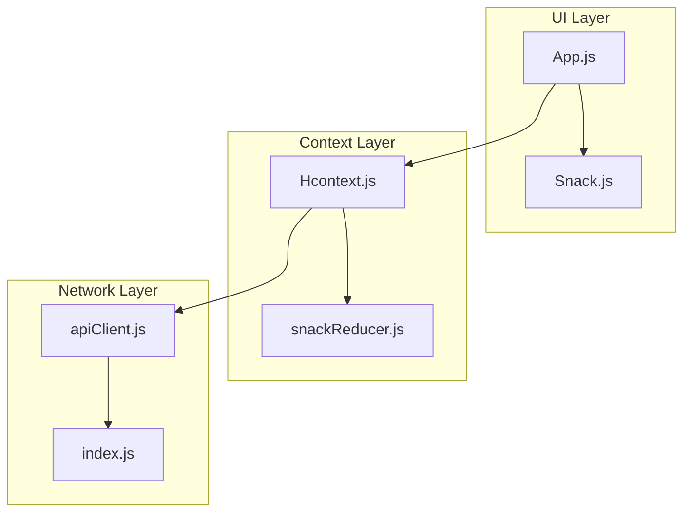
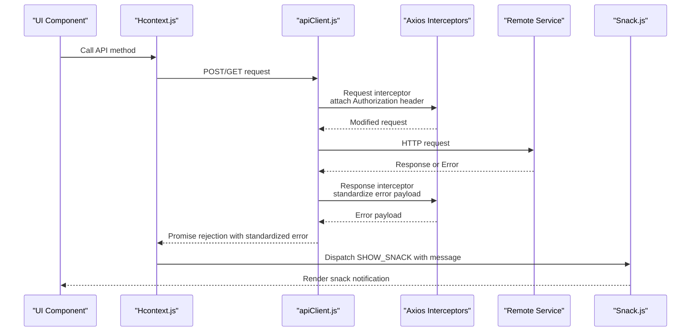
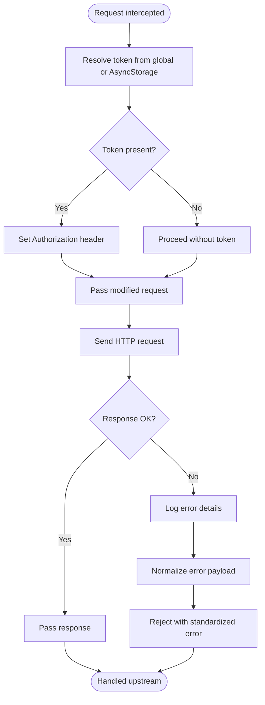
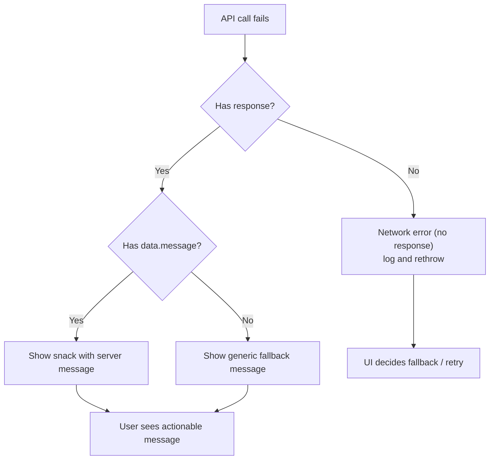
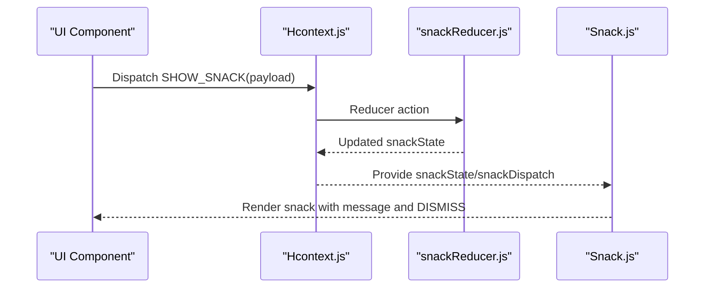
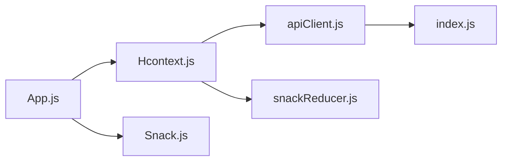

# Error Handling & Network Management

<cite>
**Referenced Files in This Document**
- [App.js](file://App.js)
- [apiClient.js](file://src/context/apiClient.js)
- [Hcontext.js](file://src/context/Hcontext.js)
- [Snack.js](file://src/components/common/Snack.js)
- [snackReducer.js](file://src/context/reducers/snackReducer.js)
- [index.js](file://src/config/index.js)
</cite>

## Table of Contents
1. [Introduction](#introduction)
2. [Project Structure](#project-structure)
3. [Core Components](#core-components)
4. [Architecture Overview](#architecture-overview)
5. [Detailed Component Analysis](#detailed-component-analysis)
6. [Dependency Analysis](#dependency-analysis)
7. [Performance Considerations](#performance-considerations)
8. [Troubleshooting Guide](#troubleshooting-guide)
9. [Conclusion](#conclusion)

## Introduction
This document explains how HappiMynd handles errors and manages network operations across its API integration. It focuses on the response interceptor error handling implementation, error categorization (network errors, HTTP status codes, validation errors), error message standardization, and user-friendly error presentation via snack notifications. It also covers retry mechanisms for transient network failures, timeout handling strategies, offline fallback approaches, authentication-related error handling, session expiration scenarios, service unavailability situations, error boundary implementations, graceful degradation patterns, recovery strategies for failed API calls, performance considerations, and best practices for resilient API consumption.

## Project Structure
The error handling and network management logic is primarily centralized in:
- An Axios client with request/response interceptors
- A global context that orchestrates API calls and user feedback
- A snack notification component and reducer for user-visible error messages
- A configuration module that defines base URLs and third-party endpoints

**Diagram sources**
- [App.js:17-55](file://App.js#L17-L55)
- [Snack.js:1-35](file://src/components/common/Snack.js#L1-L35)
- [Hcontext.js:33-1567](file://src/context/Hcontext.js#L33-L1567)
- [snackReducer.js:1-16](file://src/context/reducers/snackReducer.js#L1-L16)
- [apiClient.js:1-58](file://src/context/apiClient.js#L1-L58)
- [index.js:1-13](file://src/config/index.js#L1-L13)

**Section sources**
- [App.js:17-55](file://App.js#L17-L55)
- [apiClient.js:1-58](file://src/context/apiClient.js#L1-L58)
- [Hcontext.js:33-1567](file://src/context/Hcontext.js#L33-L1567)
- [Snack.js:1-35](file://src/components/common/Snack.js#L1-L35)
- [snackReducer.js:1-16](file://src/context/reducers/snackReducer.js#L1-L16)
- [index.js:1-13](file://src/config/index.js#L1-L13)

## Core Components
- Axios client with request/response interceptors:
  - Attaches Authorization headers using a token resolved from global state or AsyncStorage
  - Applies a default timeout to prevent hanging requests
  - Standardizes error responses for downstream handling
- Global context (Hcontext):
  - Centralizes API calls and error handling
  - Dispatches snack notifications for user feedback
  - Implements selective error categorization and user messaging
- Snack notification system:
  - Provides a reusable component for user-visible error messages
  - Uses a reducer to manage visibility and content
- Configuration:
  - Defines base URLs for production and third-party integrations

Key implementation references:
- [apiClient.js:6-9](file://src/context/apiClient.js#L6-L9)
- [apiClient.js:12-44](file://src/context/apiClient.js#L12-L44)
- [apiClient.js:47-56](file://src/context/apiClient.js#L47-L56)
- [Hcontext.js:146-179](file://src/context/Hcontext.js#L146-L179)
- [Snack.js:9-32](file://src/components/common/Snack.js#L9-L32)
- [snackReducer.js:1-16](file://src/context/reducers/snackReducer.js#L1-L16)
- [index.js:1-13](file://src/config/index.js#L1-L13)

**Section sources**
- [apiClient.js:1-58](file://src/context/apiClient.js#L1-L58)
- [Hcontext.js:146-179](file://src/context/Hcontext.js#L146-L179)
- [Snack.js:1-35](file://src/components/common/Snack.js#L1-L35)
- [snackReducer.js:1-16](file://src/context/reducers/snackReducer.js#L1-L16)
- [index.js:1-13](file://src/config/index.js#L1-L13)

## Architecture Overview
The error handling pipeline integrates the Axios client, global context, and snack notifications to deliver standardized, user-friendly error experiences.

**Diagram sources**
- [apiClient.js:12-44](file://src/context/apiClient.js#L12-L44)
- [apiClient.js:47-56](file://src/context/apiClient.js#L47-L56)
- [Hcontext.js:146-179](file://src/context/Hcontext.js#L146-L179)
- [Snack.js:9-32](file://src/components/common/Snack.js#L9-L32)

## Detailed Component Analysis

### Axios Client Interceptors and Error Standardization
- Request interceptor:
  - Resolves Authorization token from global state or AsyncStorage
  - Attaches the token to outgoing requests
  - Logs presence or absence of token per request
- Response interceptor:
  - Logs raw error details
  - Standardizes rejected errors to either response data or a generic message object
  - Ensures downstream handlers receive a consistent error shape

**Diagram sources**
- [apiClient.js:12-44](file://src/context/apiClient.js#L12-L44)
- [apiClient.js:47-56](file://src/context/apiClient.js#L47-L56)

**Section sources**
- [apiClient.js:12-44](file://src/context/apiClient.js#L12-L44)
- [apiClient.js:47-56](file://src/context/apiClient.js#L47-L56)

### Error Categorization and User-Friendly Presentation
- Network errors vs. HTTP errors:
  - Network errors (no response): logged distinctly and re-thrown for UI to decide on fallbacks
  - HTTP errors (with response): message extracted from response data and shown via snack
- Validation errors:
  - Specific endpoints surface validation messages; consumers dispatch snack with tailored messages
- User-friendly messaging:
  - Snack component renders visible notifications with a dismiss action
  - Messages are dispatched via reducer actions and cleared after a timeout

**Diagram sources**
- [Hcontext.js:470-501](file://src/context/Hcontext.js#L470-L501)
- [Hcontext.js:155-161](file://src/context/Hcontext.js#L155-L161)
- [Hcontext.js:171-179](file://src/context/Hcontext.js#L171-L179)
- [Snack.js:9-32](file://src/components/common/Snack.js#L9-L32)
- [snackReducer.js:1-16](file://src/context/reducers/snackReducer.js#L1-L16)

**Section sources**
- [Hcontext.js:470-501](file://src/context/Hcontext.js#L470-L501)
- [Hcontext.js:155-161](file://src/context/Hcontext.js#L155-L161)
- [Hcontext.js:171-179](file://src/context/Hcontext.js#L171-L179)
- [Snack.js:1-35](file://src/components/common/Snack.js#L1-L35)
- [snackReducer.js:1-16](file://src/context/reducers/snackReducer.js#L1-L16)

### Retry Mechanisms for Transient Failures
- Current implementation does not implement automatic retries in the Axios client or context.
- Recommended pattern:
  - Introduce a retry policy in the Axios client with exponential backoff for network errors and specific HTTP 408/425/502/503/504 statuses
  - Gate retries by operation idempotency and user-perceived latency constraints
  - Surface retry prompts to users for manual intervention when appropriate

[No sources needed since this section provides general guidance]

### Timeout Handling Strategies
- Default timeout is configured at the Axios client level to prevent hanging requests.
- UI components should surface timeouts as user-facing errors and optionally offer retry actions.

**Section sources**
- [apiClient.js:6-9](file://src/context/apiClient.js#L6-L9)

### Offline Fallback Approaches
- The codebase does not implement explicit offline detection or fallback logic.
- Recommended pattern:
  - Detect network availability and route critical operations to cached states or queue pending actions
  - Show offline snackbar and disable interactive elements until connectivity resumes

[No sources needed since this section provides general guidance]

### Authentication-Related Errors and Session Expiration
- Token resolution occurs in the request interceptor; missing tokens lead to unauthorized requests.
- Context methods surface authentication errors via snack notifications for user feedback.
- Session expiration:
  - Not explicitly handled in the provided code; recommend standardizing 401 responses to trigger logout and redirect to login flow

**Section sources**
- [apiClient.js:12-44](file://src/context/apiClient.js#L12-L44)
- [Hcontext.js:155-161](file://src/context/Hcontext.js#L155-L161)
- [Hcontext.js:171-179](file://src/context/Hcontext.js#L171-L179)

### Service Unavailability Situations
- Network errors are logged distinctly and rethrown for UI-level handling.
- UI components can implement fallbacks (e.g., retry prompts, cached data, or offline modes).

**Section sources**
- [Hcontext.js:470-501](file://src/context/Hcontext.js#L470-L501)

### Error Boundary Implementations and Graceful Degradation
- The application does not implement React error boundaries.
- Recommended pattern:
  - Wrap top-level navigators with error boundaries to catch rendering and lifecycle errors
  - Implement graceful degradation by disabling non-essential features during outages and surfacing actionable messages

[No sources needed since this section provides general guidance]

### Recovery Strategies for Failed API Calls
- Standardized error payloads enable consistent recovery decisions in UI components.
- Typical strategies:
  - Retry with backoff for transient errors
  - Fallback to cached data or last-known good state
  - Prompt user to check connectivity or retry manually

**Section sources**
- [apiClient.js:47-56](file://src/context/apiClient.js#L47-L56)
- [Hcontext.js:470-501](file://src/context/Hcontext.js#L470-L501)

### Integration with Snack Notifications
- Snack component reads from context state and displays messages with a dismiss action.
- Reducer supports show/hide actions and clears messages after a timeout.

**Diagram sources**
- [Hcontext.js:43-47](file://src/context/Hcontext.js#L43-L47)
- [snackReducer.js:1-16](file://src/context/reducers/snackReducer.js#L1-L16)
- [Snack.js:9-32](file://src/components/common/Snack.js#L9-L32)

**Section sources**
- [Hcontext.js:43-47](file://src/context/Hcontext.js#L43-L47)
- [snackReducer.js:1-16](file://src/context/reducers/snackReducer.js#L1-L16)
- [Snack.js:1-35](file://src/components/common/Snack.js#L1-L35)

### Error Logging Patterns and Debugging Capabilities
- Console logs capture error details and request outcomes for debugging.
- Recommendations:
  - Centralize logs with structured metadata (endpoint, method, status, correlation ID)
  - Integrate with a backend error reporting service for production diagnostics

**Section sources**
- [apiClient.js:50](file://src/context/apiClient.js#L50)
- [Hcontext.js:470-501](file://src/context/Hcontext.js#L470-L501)

## Dependency Analysis
The following diagram shows how the key modules depend on each other in the error handling and network management flow.

**Diagram sources**
- [App.js:17-55](file://App.js#L17-L55)
- [Hcontext.js:33-1567](file://src/context/Hcontext.js#L33-L1567)
- [apiClient.js:1-58](file://src/context/apiClient.js#L1-L58)
- [snackReducer.js:1-16](file://src/context/reducers/snackReducer.js#L1-L16)
- [Snack.js:1-35](file://src/components/common/Snack.js#L1-L35)
- [index.js:1-13](file://src/config/index.js#L1-L13)

**Section sources**
- [App.js:17-55](file://App.js#L17-L55)
- [Hcontext.js:33-1567](file://src/context/Hcontext.js#L33-L1567)
- [apiClient.js:1-58](file://src/context/apiClient.js#L1-L58)
- [snackReducer.js:1-16](file://src/context/reducers/snackReducer.js#L1-L16)
- [Snack.js:1-35](file://src/components/common/Snack.js#L1-L35)
- [index.js:1-13](file://src/config/index.js#L1-L13)

## Performance Considerations
- Prefer short, deterministic timeouts to avoid blocking UI threads.
- Batch or debounce frequent API calls to reduce redundant network work.
- Cache frequently accessed data to minimize repeated network requests.
- Avoid synchronous heavy operations in interceptors to keep request/response cycles fast.

[No sources needed since this section provides general guidance]

## Troubleshooting Guide
- Symptom: Requests hang indefinitely
  - Cause: Missing timeout configuration
  - Resolution: Ensure Axios client timeout is active and UI surfaces timeout errors
  - Reference: [apiClient.js:6-9](file://src/context/apiClient.js#L6-L9)
- Symptom: Unauthorized requests despite login
  - Cause: Token not found in global state or AsyncStorage
  - Resolution: Verify token propagation and interceptor logic
  - Reference: [apiClient.js:12-44](file://src/context/apiClient.js#L12-L44)
- Symptom: Generic “Something went wrong” message
  - Cause: Response interceptor fallback
  - Resolution: Ensure backend returns structured error payloads
  - Reference: [apiClient.js:52-54](file://src/context/apiClient.js#L52-L54)
- Symptom: No user-visible error for network issues
  - Cause: Rethrown errors without snack dispatch
  - Resolution: Add snack dispatch around failing calls
  - References:
    - [Hcontext.js:470-501](file://src/context/Hcontext.js#L470-L501)
    - [Snack.js:9-32](file://src/components/common/Snack.js#L9-L32)
    - [snackReducer.js:1-16](file://src/context/reducers/snackReducer.js#L1-L16)

**Section sources**
- [apiClient.js:6-9](file://src/context/apiClient.js#L6-L9)
- [apiClient.js:12-44](file://src/context/apiClient.js#L12-L44)
- [apiClient.js:52-54](file://src/context/apiClient.js#L52-L54)
- [Hcontext.js:470-501](file://src/context/Hcontext.js#L470-L501)
- [Snack.js:1-35](file://src/components/common/Snack.js#L1-L35)
- [snackReducer.js:1-16](file://src/context/reducers/snackReducer.js#L1-L16)

## Conclusion
HappiMynd’s current error handling relies on a standardized Axios client with request/response interceptors, a global context for orchestrating API calls and user feedback, and a snack notification system for user-visible messages. While the system provides consistent error shaping and basic user messaging, it lacks built-in retry mechanisms, offline fallbacks, explicit session expiration handling, and error boundaries. Enhancing these areas with structured logging, retry policies, offline support, and error boundaries will significantly improve resilience and user experience.