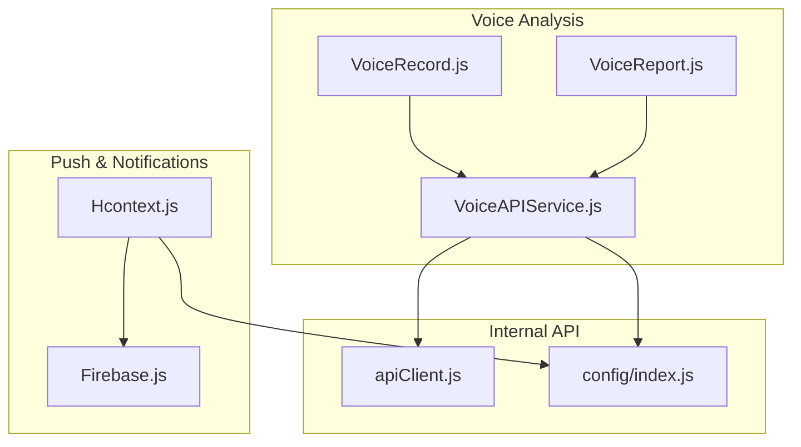
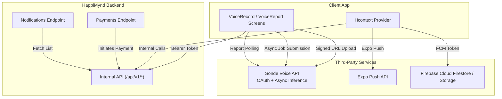
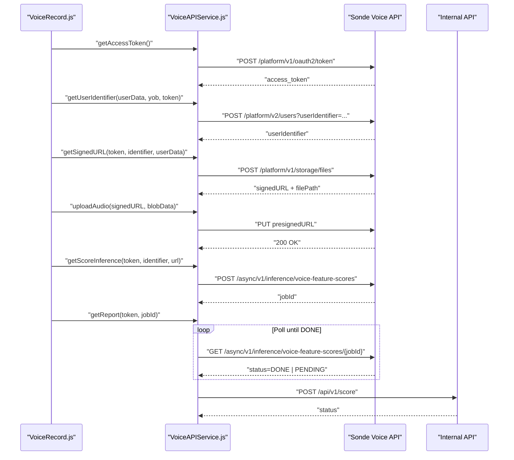
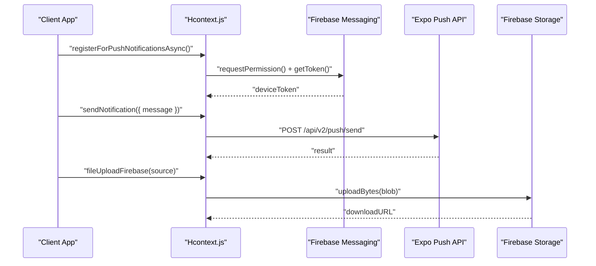
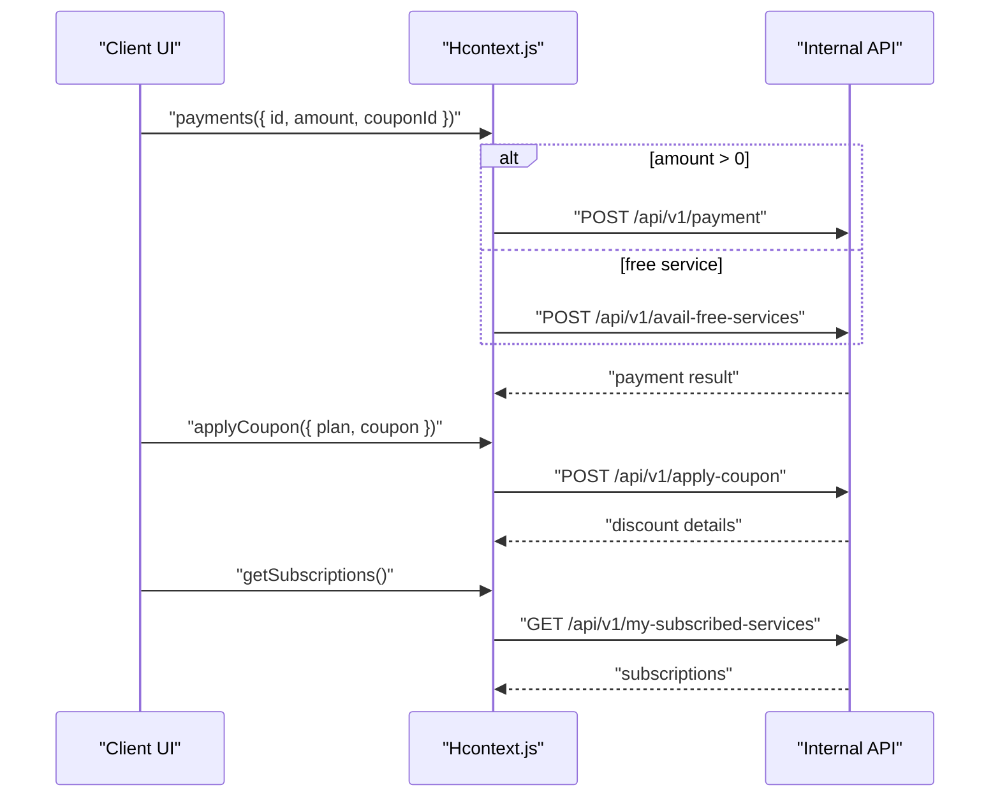
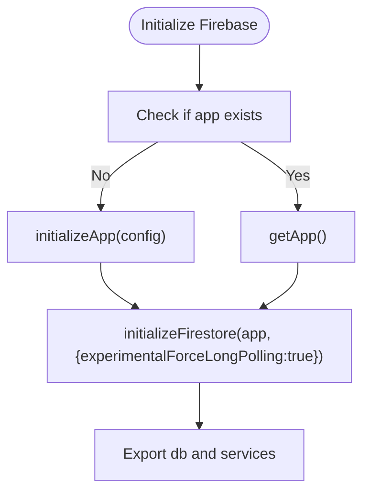
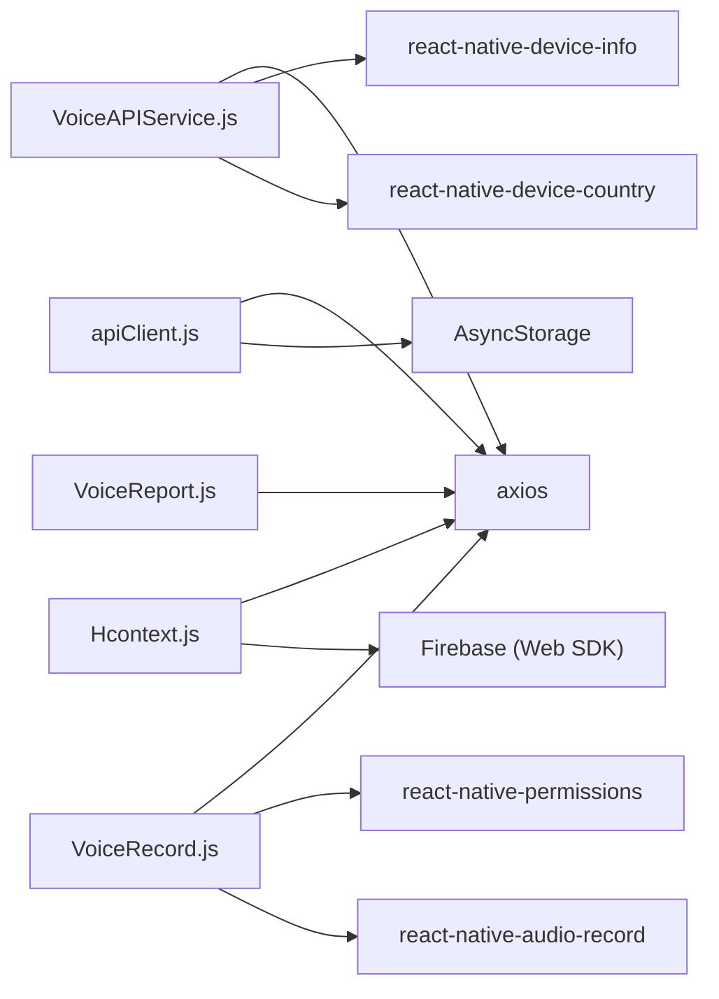

# External Service Integrations

<cite>
**Referenced Files in This Document**
- [VoiceAPIService.js](file://src/screens/HappiVOICE/VoiceAPIService.js)
- [VoiceRecord.js](file://src/screens/HappiVOICE/VoiceRecord.js)
- [VoiceReport.js](file://src/screens/HappiVOICE/VoiceReport.js)
- [Firebase.js](file://src/context/Firebase.js)
- [google-services.json](file://android/app/google-services.json)
- [index.js](file://src/config/index.js)
- [Hcontext.js](file://src/context/Hcontext.js)
- [apiClient.js](file://src/context/apiClient.js)
- [test_endpoints.js](file://test_endpoints.js)
</cite>

## Table of Contents
1. [Introduction](#introduction)
2. [Project Structure](#project-structure)
3. [Core Components](#core-components)
4. [Architecture Overview](#architecture-overview)
5. [Detailed Component Analysis](#detailed-component-analysis)
6. [Dependency Analysis](#dependency-analysis)
7. [Performance Considerations](#performance-considerations)
8. [Troubleshooting Guide](#troubleshooting-guide)
9. [Conclusion](#conclusion)
10. [Appendices](#appendices)

## Introduction
This document explains external service integrations within HappiMynd’s API architecture. It focuses on:
- Voice analysis via the Sonde Voice Analysis API
- Push notification delivery using Expo push tokens and Firebase Cloud Messaging (FCM)
- Payment initiation through HappiMynd’s internal API
- Firebase services for real-time features and storage
- API key management, authentication, data exchange protocols, webhook handling, health monitoring, fallback strategies, and security considerations

## Project Structure
The integration surface spans:
- Voice analysis orchestration in the HappiVOICE screens and service module
- Firebase initialization and Firestore client
- Internal API client with bearer token injection
- Configuration constants for base URLs and third-party endpoints
- Push notification setup and delivery via Expo and Firebase

**Diagram sources**
- [VoiceRecord.js:1-245](file://src/screens/HappiVOICE/VoiceRecord.js#L1-L245)
- [VoiceAPIService.js:1-264](file://src/screens/HappiVOICE/VoiceAPIService.js#L1-L264)
- [VoiceReport.js:1-246](file://src/screens/HappiVOICE/VoiceReport.js#L1-L246)
- [apiClient.js:1-58](file://src/context/apiClient.js#L1-L58)
- [index.js:1-13](file://src/config/index.js#L1-L13)
- [Hcontext.js:600-850](file://src/context/Hcontext.js#L600-L850)
- [Firebase.js:1-52](file://src/context/Firebase.js#L1-L52)

**Section sources**
- [VoiceAPIService.js:1-264](file://src/screens/HappiVOICE/VoiceAPIService.js#L1-L264)
- [VoiceRecord.js:1-245](file://src/screens/HappiVOICE/VoiceRecord.js#L1-L245)
- [VoiceReport.js:1-246](file://src/screens/HappiVOICE/VoiceReport.js#L1-L246)
- [Firebase.js:1-52](file://src/context/Firebase.js#L1-L52)
- [index.js:1-13](file://src/config/index.js#L1-L13)
- [Hcontext.js:600-850](file://src/context/Hcontext.js#L600-L850)
- [apiClient.js:1-58](file://src/context/apiClient.js#L1-L58)

## Core Components
- VoiceAPIService: Orchestrates OAuth token acquisition, user profile creation, signed URL generation, audio upload, asynchronous inference job submission, and report retrieval and persistence.
- VoiceRecord: Manages recording lifecycle, countdown, permission handling, and triggers upload and inference.
- VoiceReport: Polls for inference completion, retrieves the report, persists results, and enforces subscription and verification checks.
- Hcontext: Provides push notification registration and delivery, Firebase storage upload, and internal API interactions.
- Firebase: Initializes Firestore and Firebase Storage clients for long-polling transport and uploads.
- apiClient: Centralized Axios client injecting bearer tokens and handling errors.
- config: Holds base URLs and third-party endpoints.

**Section sources**
- [VoiceAPIService.js:1-264](file://src/screens/HappiVOICE/VoiceAPIService.js#L1-L264)
- [VoiceRecord.js:1-245](file://src/screens/HappiVOICE/VoiceRecord.js#L1-L245)
- [VoiceReport.js:1-246](file://src/screens/HappiVOICE/VoiceReport.js#L1-L246)
- [Hcontext.js:600-850](file://src/context/Hcontext.js#L600-L850)
- [Firebase.js:1-52](file://src/context/Firebase.js#L1-L52)
- [apiClient.js:1-58](file://src/context/apiClient.js#L1-L58)
- [index.js:1-13](file://src/config/index.js#L1-L13)

## Architecture Overview
The external integrations are layered:
- Authentication and identity: Sonde OAuth client credentials flow; HappiMynd internal bearer token via apiClient.
- Data exchange: Signed URL-based uploads to Sonde storage; JSON payloads for inference and report retrieval.
- Real-time and notifications: FCM token registration and Expo push delivery; Firestore for real-time features.
- Payment: HappiMynd internal API endpoints for payment initiation and coupon application.

**Diagram sources**
- [VoiceAPIService.js:1-264](file://src/screens/HappiVOICE/VoiceAPIService.js#L1-L264)
- [VoiceRecord.js:1-245](file://src/screens/HappiVOICE/VoiceRecord.js#L1-L245)
- [VoiceReport.js:1-246](file://src/screens/HappiVOICE/VoiceReport.js#L1-L246)
- [Hcontext.js:600-850](file://src/context/Hcontext.js#L600-L850)
- [Firebase.js:1-52](file://src/context/Firebase.js#L1-L52)
- [apiClient.js:1-58](file://src/context/apiClient.js#L1-L58)
- [index.js:1-13](file://src/config/index.js#L1-L13)

## Detailed Component Analysis

### Voice Analysis Workflow with Sonde
The voice analysis workflow integrates:
- OAuth token acquisition using client credentials
- User profile creation with device metadata
- Signed URL generation for secure uploads
- Audio upload via PUT to pre-signed URL
- Asynchronous inference job submission
- Report polling until completion and saving to HappiMynd backend

**Diagram sources**
- [VoiceAPIService.js:26-201](file://src/screens/HappiVOICE/VoiceAPIService.js#L26-L201)
- [VoiceRecord.js:104-127](file://src/screens/HappiVOICE/VoiceRecord.js#L104-L127)
- [VoiceReport.js:117-155](file://src/screens/HappiVOICE/VoiceReport.js#L117-L155)

Key implementation notes:
- Authentication: Sonde uses Basic Auth for OAuth token exchange; subsequent calls use Bearer token.
- Data exchange: JSON payloads for user profile, storage request, and inference submission; signed URL upload uses raw PUT.
- Error handling: Functions return parsed error objects; callers should inspect returned status and handle failures.

**Section sources**
- [VoiceAPIService.js:26-201](file://src/screens/HappiVOICE/VoiceAPIService.js#L26-L201)
- [VoiceRecord.js:104-127](file://src/screens/HappiVOICE/VoiceRecord.js#L104-L127)
- [VoiceReport.js:117-155](file://src/screens/HappiVOICE/VoiceReport.js#L117-L155)

### Push Notifications and Firebase Integration
HappiMynd supports:
- FCM token registration and listener setup
- Expo push notifications for cross-platform delivery
- Firebase Storage uploads for arbitrary files

**Diagram sources**
- [Hcontext.js:600-850](file://src/context/Hcontext.js#L600-L850)
- [Firebase.js:1-52](file://src/context/Firebase.js#L1-L52)

Operational details:
- FCM token registration is gated by permission; listeners capture foreground/background notifications.
- Expo push delivery uses a public endpoint; messages include target token and body.
- Firebase Storage upload converts a local URI to a blob and returns a downloadable URL.

**Section sources**
- [Hcontext.js:600-850](file://src/context/Hcontext.js#L600-L850)
- [Firebase.js:1-52](file://src/context/Firebase.js#L1-L52)

### Payment Gateway Integration
HappiMynd’s internal API handles payment initiation and coupon application:
- Free service eligibility or paid plan purchase
- Coupon application and plan selection
- Subscription listing and plan bundles

**Diagram sources**
- [Hcontext.js:619-665](file://src/context/Hcontext.js#L619-L665)
- [Hcontext.js:639-647](file://src/context/Hcontext.js#L639-L647)
- [Hcontext.js:649-665](file://src/context/Hcontext.js#L649-L665)

Notes:
- The internal API client injects bearer tokens automatically.
- Error handling surfaces user-friendly messages and rethrows for upstream handling.

**Section sources**
- [Hcontext.js:619-665](file://src/context/Hcontext.js#L619-L665)
- [Hcontext.js:639-647](file://src/context/Hcontext.js#L639-L647)
- [Hcontext.js:649-665](file://src/context/Hcontext.js#L649-L665)
- [apiClient.js:11-56](file://src/context/apiClient.js#L11-L56)

### Firebase Initialization and Real-Time Features
Firebase is initialized with long-polling enabled for React Native stability. Firestore and Storage are used for real-time queries and file uploads.

**Diagram sources**
- [Firebase.js:33-51](file://src/context/Firebase.js#L33-L51)

Android and iOS configurations:
- Google Services JSON defines OAuth clients, API keys, and project identifiers for Firebase.
- Expo plist controls update behavior and SDK version.

**Section sources**
- [Firebase.js:1-52](file://src/context/Firebase.js#L1-L52)
- [google-services.json:1-55](file://android/app/google-services.json#L1-L55)

## Dependency Analysis
External dependencies and their roles:
- Axios for HTTP requests to internal API, Sonde, and Expo push
- Firebase Web SDK for Firestore and Storage
- react-native-audio-record for audio capture
- react-native-device-info and react-native-device-country for device metadata
- react-native-permissions for microphone/audio permissions

**Diagram sources**
- [VoiceAPIService.js:1-264](file://src/screens/HappiVOICE/VoiceAPIService.js#L1-L264)
- [VoiceRecord.js:1-245](file://src/screens/HappiVOICE/VoiceRecord.js#L1-L245)
- [VoiceReport.js:1-246](file://src/screens/HappiVOICE/VoiceReport.js#L1-L246)
- [Hcontext.js:600-850](file://src/context/Hcontext.js#L600-L850)
- [apiClient.js:1-58](file://src/context/apiClient.js#L1-L58)

**Section sources**
- [VoiceAPIService.js:1-264](file://src/screens/HappiVOICE/VoiceAPIService.js#L1-L264)
- [VoiceRecord.js:1-245](file://src/screens/HappiVOICE/VoiceRecord.js#L1-L245)
- [VoiceReport.js:1-246](file://src/screens/HappiVOICE/VoiceReport.js#L1-L246)
- [Hcontext.js:600-850](file://src/context/Hcontext.js#L600-L850)
- [apiClient.js:1-58](file://src/context/apiClient.js#L1-L58)

## Performance Considerations
- Timeout tuning: Internal API client sets a 15-second timeout to prevent hanging requests.
- Long-polling transport: Firestore is configured with long-polling to improve reliability on React Native.
- Upload strategy: Signed URL-based uploads avoid proxying large audio files through the app server.
- Retry and polling: Inference polling should implement exponential backoff and upper bounds to reduce load.

[No sources needed since this section provides general guidance]

## Troubleshooting Guide
Common issues and remedies:
- Authentication failures
  - Sonde OAuth: Verify Basic Auth credentials and scope during token acquisition.
  - Internal API: Confirm bearer token presence via request interceptor logs.
- Upload failures
  - Ensure signed URL validity and correct Content-Type for PUT.
  - Validate device metadata fields passed to Sonde.
- Report retrieval timing
  - Implement bounded polling with jitter; handle transient network errors.
- Push notifications
  - Confirm permission grants and token availability before sending.
  - Use Expo push endpoint for cross-platform delivery.
- Firebase connectivity
  - Long-polling transport mitigates WebSocket instability on mobile networks.

**Section sources**
- [VoiceAPIService.js:26-201](file://src/screens/HappiVOICE/VoiceAPIService.js#L26-L201)
- [apiClient.js:11-56](file://src/context/apiClient.js#L11-L56)
- [Firebase.js:37-49](file://src/context/Firebase.js#L37-L49)
- [Hcontext.js:80-127](file://src/context/Hcontext.js#L80-L127)

## Conclusion
HappiMynd integrates external services through a clean separation of concerns:
- Voice analysis uses Sonde’s OAuth and async inference APIs with signed URL uploads.
- Notifications leverage FCM and Expo push for broad compatibility.
- Payments and subscriptions are handled by the internal API with centralized token management.
- Firebase underpins real-time features and storage with long-polling for stability.

[No sources needed since this section summarizes without analyzing specific files]

## Appendices

### API Key Management and Security
- Sonde OAuth: Client credentials are embedded in code; consider rotating and restricting scopes. Avoid logging sensitive headers.
- Internal API: Tokens are injected automatically; ensure secure storage and refresh strategies.
- Firebase: Project configuration is included; restrict API keys and OAuth clients appropriately.

**Section sources**
- [VoiceAPIService.js:33-41](file://src/screens/HappiVOICE/VoiceAPIService.js#L33-L41)
- [apiClient.js:12-42](file://src/context/apiClient.js#L12-L42)
- [google-services.json:1-55](file://android/app/google-services.json#L1-L55)

### Data Exchange Protocols
- Voice Analysis: JSON payloads for user profile and inference; signed URL PUT for audio.
- Internal API: JSON bodies for payment, coupon, and notifications.
- Push Notifications: JSON payload with target token and message body.

**Section sources**
- [VoiceAPIService.js:59-81](file://src/screens/HappiVOICE/VoiceAPIService.js#L59-L81)
- [VoiceAPIService.js:157-181](file://src/screens/HappiVOICE/VoiceAPIService.js#L157-L181)
- [Hcontext.js:787-834](file://src/context/Hcontext.js#L787-L834)

### Health Monitoring and Webhooks
- Inference polling: Implement retry loops with backoff and circuit breaker logic.
- Endpoint testing: Use the provided script to validate internal endpoints and token propagation.

**Section sources**
- [VoiceReport.js:117-155](file://src/screens/HappiVOICE/VoiceReport.js#L117-L155)
- [test_endpoints.js:1-69](file://test_endpoints.js#L1-L69)