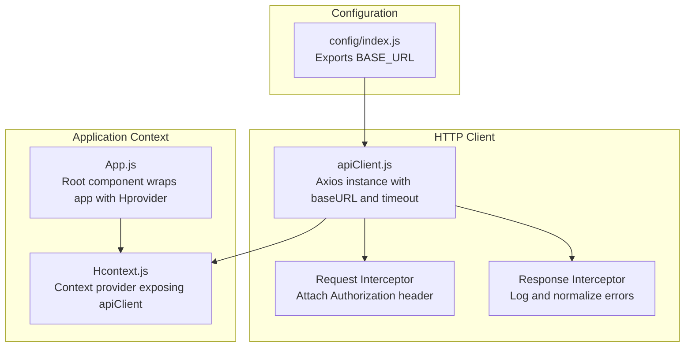
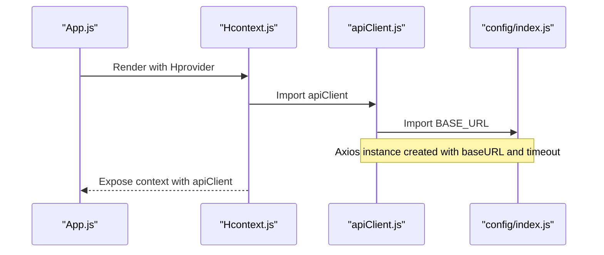
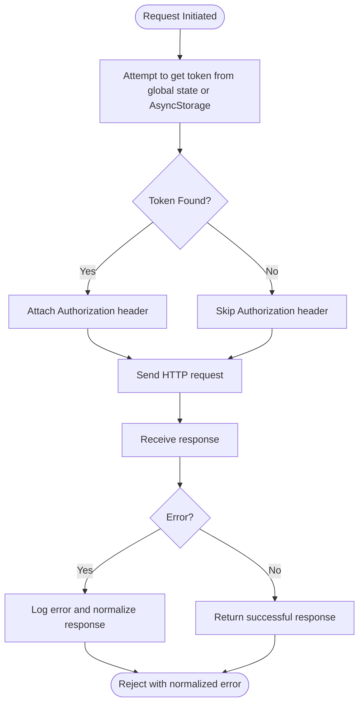
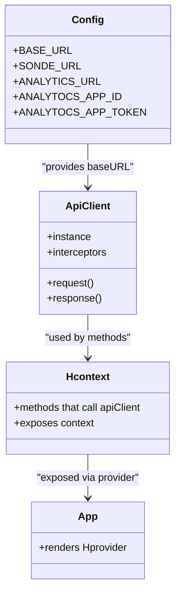
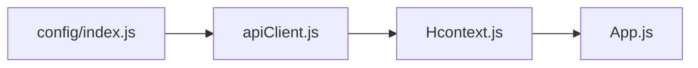

# HTTP Client Configuration

<cite>
**Referenced Files in This Document**
- [apiClient.js](file://src/context/apiClient.js)
- [index.js](file://src/config/index.js)
- [Hcontext.js](file://src/context/Hcontext.js)
- [App.js](file://App.js)
</cite>

## Table of Contents
1. [Introduction](#introduction)
2. [Project Structure](#project-structure)
3. [Core Components](#core-components)
4. [Architecture Overview](#architecture-overview)
5. [Detailed Component Analysis](#detailed-component-analysis)
6. [Dependency Analysis](#dependency-analysis)
7. [Performance Considerations](#performance-considerations)
8. [Troubleshooting Guide](#troubleshooting-guide)
9. [Conclusion](#conclusion)

## Introduction
This document explains the Axios HTTP client configuration used in HappiMynd. It focuses on the apiClient.js setup, base URL configuration via environment variables, timeout settings, instance creation patterns, and how the client integrates with the broader application architecture through the context provider system.

## Project Structure
The HTTP client configuration centers around three key files:
- apiClient.js: Creates the Axios instance with baseURL and timeout, and attaches request/response interceptors.
- index.js: Defines the configuration object that supplies the base URL used by the HTTP client.
- Hcontext.js: Provides the application-wide context that initializes and exposes the HTTP client to components.

**Diagram sources**
- [apiClient.js:1-58](file://src/context/apiClient.js#L1-L58)
- [index.js:1-13](file://src/config/index.js#L1-L13)
- [Hcontext.js:1-1551](file://src/context/Hcontext.js#L1-L1551)
- [App.js:1-59](file://App.js#L1-L59)

**Section sources**
- [apiClient.js:1-58](file://src/context/apiClient.js#L1-L58)
- [index.js:1-13](file://src/config/index.js#L1-L13)
- [Hcontext.js:1-1551](file://src/context/Hcontext.js#L1-L1551)
- [App.js:1-59](file://App.js#L1-L59)

## Core Components
- Axios instance with baseURL and timeout:
  - The apiClient.js creates an Axios instance using config.BASE_URL and sets a 15-second timeout to prevent hanging requests.
  - The baseURL is imported from the config module, ensuring centralized configuration.
- Request interceptor:
  - Attempts to retrieve an access token from multiple sources (global auth state, AsyncStorage).
  - Attaches the Authorization header for authenticated requests.
  - Logs whether a token was found for each request.
- Response interceptor:
  - Logs API errors and normalizes error responses to include a consistent message structure.

These components form the foundation for all HTTP communication in the app.

**Section sources**
- [apiClient.js:1-58](file://src/context/apiClient.js#L1-L58)
- [index.js:1-13](file://src/config/index.js#L1-L13)

## Architecture Overview
The HTTP client is initialized once and reused across the application through the Hcontext provider. The App component wraps the UI with Hprovider, making the apiClient available to all consumers via context.

**Diagram sources**
- [App.js:1-59](file://App.js#L1-L59)
- [Hcontext.js:1-1551](file://src/context/Hcontext.js#L1-L1551)
- [apiClient.js:1-58](file://src/context/apiClient.js#L1-L58)
- [index.js:1-13](file://src/config/index.js#L1-L13)

## Detailed Component Analysis

### Axios Instance Creation and Interceptors
- Instance creation:
  - The Axios instance is created with baseURL set to config.BASE_URL and a timeout of 15000ms.
- Request interceptor:
  - Retrieves token from global auth state or AsyncStorage if not present.
  - Sets Authorization header if a token is available; otherwise logs absence.
- Response interceptor:
  - Logs error details and ensures a standardized error response is returned.

**Diagram sources**
- [apiClient.js:1-58](file://src/context/apiClient.js#L1-L58)

**Section sources**
- [apiClient.js:1-58](file://src/context/apiClient.js#L1-L58)

### Base URL Configuration and Environment Integration
- Centralized configuration:
  - The config/index.js exports a config object containing BASE_URL, used by the HTTP client.
- Environment-specific settings:
  - The current configuration defines BASE_URL for the live server.
  - The codebase also references other environment-related constants (e.g., analytics and Sonde service URLs), indicating a pattern for environment-aware configuration.

Examples of environment-specific usage:
- The Hcontext.js file demonstrates how BASE_URL is consumed for endpoints such as organizer listings, user profiles, and FAQs.
- Other parts of the codebase reference additional environment constants (e.g., analytics and Sonde service URLs), reinforcing the pattern of centralized configuration.

**Section sources**
- [index.js:1-13](file://src/config/index.js#L1-L13)
- [Hcontext.js:205-207](file://src/context/Hcontext.js#L205-L207)
- [Hcontext.js:214-219](file://src/context/Hcontext.js#L214-L219)
- [Hcontext.js:229-232](file://src/context/Hcontext.js#L229-L232)
- [Hcontext.js:325-331](file://src/context/Hcontext.js#L325-L331)
- [Hcontext.js:343-349](file://src/context/Hcontext.js#L343-L349)
- [Hcontext.js:366-373](file://src/context/Hcontext.js#L366-L373)
- [Hcontext.js:455-459](file://src/context/Hcontext.js#L455-L459)
- [Hcontext.js:869-872](file://src/context/Hcontext.js#L869-L872)
- [Hcontext.js:1344-1347](file://src/context/Hcontext.js#L1344-L1347)

### Client Initialization and Context Provider Integration
- Initialization:
  - The apiClient is imported by Hcontext.js and used to perform authenticated requests.
- Context exposure:
  - Hcontext.js exposes numerous methods that internally use the apiClient for authentication, user actions, bookings, and other features.
- Root integration:
  - App.js wraps the application with Hprovider, ensuring the HTTP client is available globally.

**Diagram sources**
- [index.js:1-13](file://src/config/index.js#L1-L13)
- [apiClient.js:1-58](file://src/context/apiClient.js#L1-L58)
- [Hcontext.js:1-1551](file://src/context/Hcontext.js#L1-L1551)
- [App.js:1-59](file://App.js#L1-L59)

**Section sources**
- [Hcontext.js:1-1551](file://src/context/Hcontext.js#L1-L1551)
- [App.js:1-59](file://App.js#L1-L59)

## Dependency Analysis
- apiClient.js depends on:
  - config/index.js for BASE_URL.
  - AsyncStorage for token persistence fallback.
- Hcontext.js depends on:
  - apiClient.js for authenticated requests.
  - config/index.js for non-authenticated endpoints (e.g., organizer-list, user-profile, FAQs).
- App.js depends on:
  - Hcontext.js via Hprovider to supply the HTTP client to the entire app.

**Diagram sources**
- [index.js:1-13](file://src/config/index.js#L1-L13)
- [apiClient.js:1-58](file://src/context/apiClient.js#L1-L58)
- [Hcontext.js:1-1551](file://src/context/Hcontext.js#L1-L1551)
- [App.js:1-59](file://App.js#L1-L59)

**Section sources**
- [index.js:1-13](file://src/config/index.js#L1-L13)
- [apiClient.js:1-58](file://src/context/apiClient.js#L1-L58)
- [Hcontext.js:1-1551](file://src/context/Hcontext.js#L1-L1551)
- [App.js:1-59](file://App.js#L1-L59)

## Performance Considerations
- Timeout handling:
  - The 15-second timeout helps prevent hanging requests and improves responsiveness under poor network conditions.
- Token retrieval:
  - The request interceptor attempts to retrieve tokens from multiple sources; caching in global state reduces repeated AsyncStorage reads.
- Centralized configuration:
  - Keeping baseURL in a single config module simplifies environment switching and avoids duplication.

[No sources needed since this section provides general guidance]

## Troubleshooting Guide
- Authentication failures:
  - If Authorization header is missing, verify token availability in global state or AsyncStorage.
  - Confirm that the request interceptor is attaching the token before sending the request.
- Network timeouts:
  - Requests exceeding 15 seconds will reject; consider retry logic or adjusting timeout if appropriate.
- Error logging:
  - Response interceptor logs API errors and returns a normalized error object; inspect logs for detailed error messages.

**Section sources**
- [apiClient.js:1-58](file://src/context/apiClient.js#L1-L58)

## Conclusion
The Axios HTTP client in HappiMynd is configured centrally with a 15-second timeout and a single baseURL derived from the config module. The request interceptor manages authentication tokens, while the response interceptor standardizes error handling. Through the Hcontext provider, the apiClient is made available application-wide, enabling consistent HTTP communication across features such as authentication, user management, and bookings.

[No sources needed since this section summarizes without analyzing specific files]