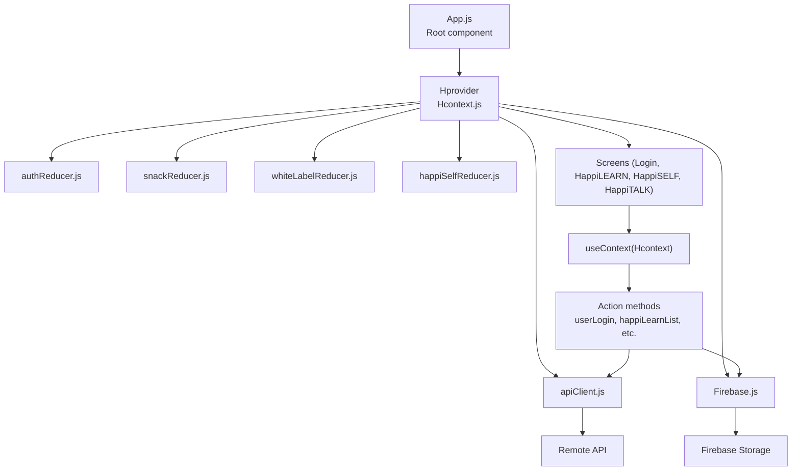
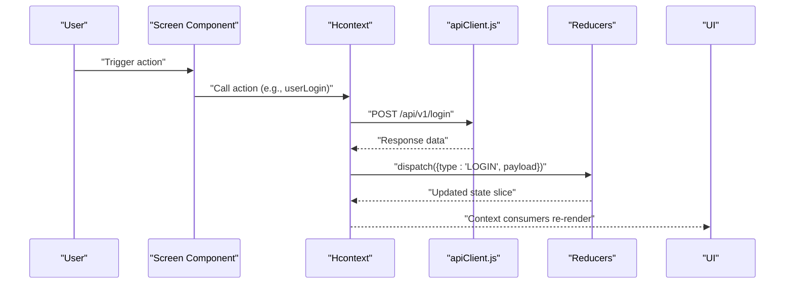
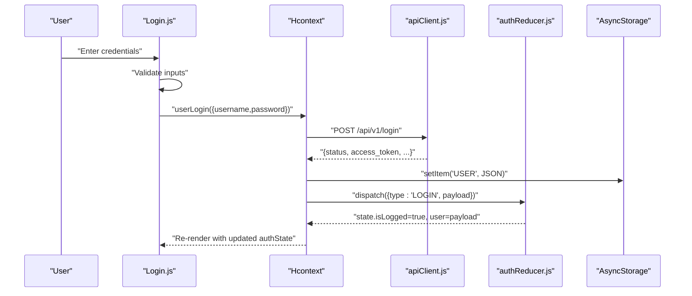
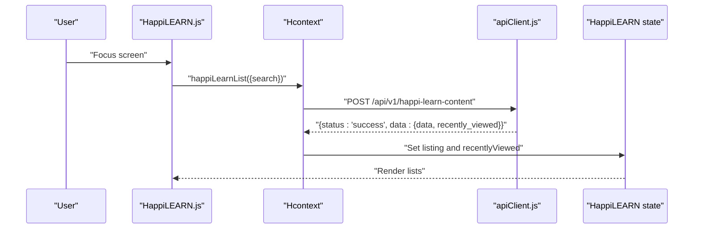
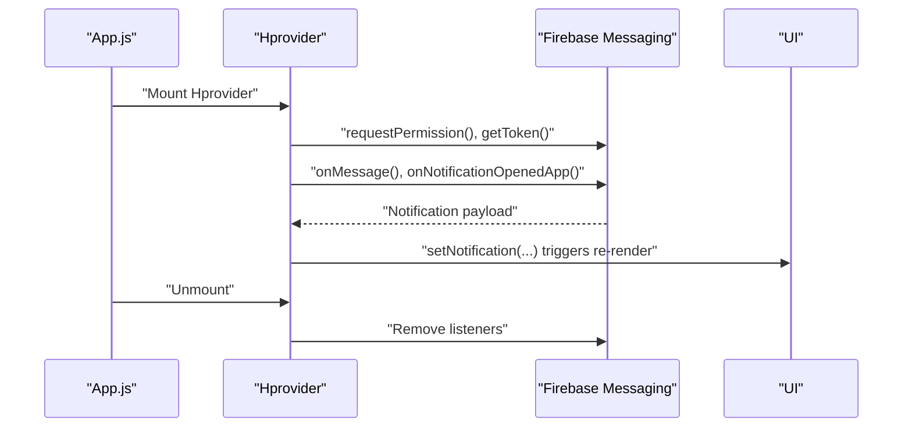
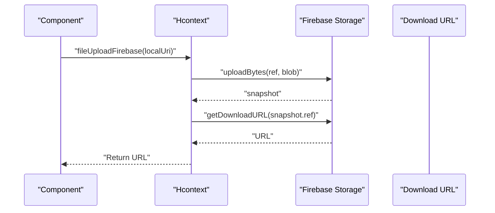
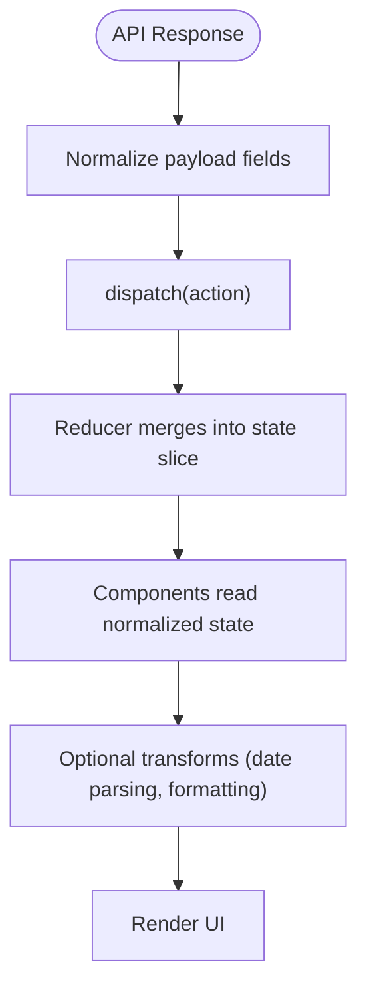
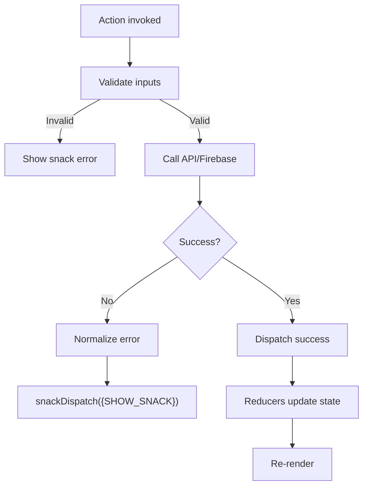
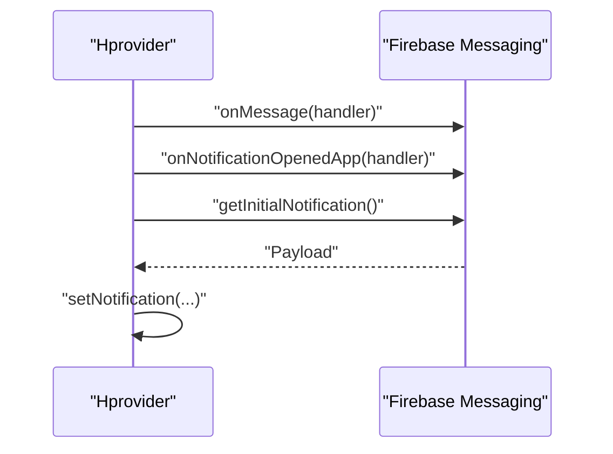
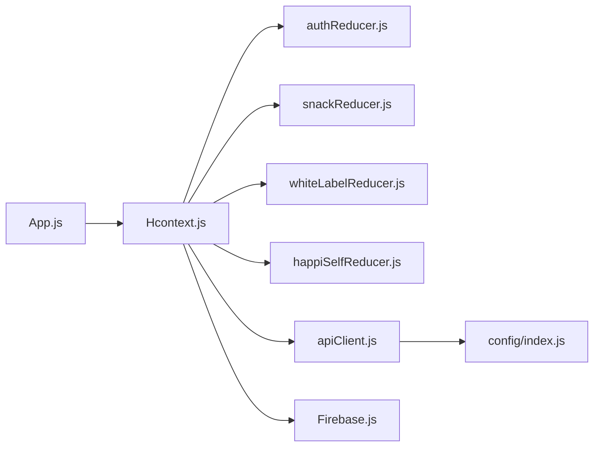

# Data Flow Patterns

<cite>
**Referenced Files in This Document**
- [App.js](file://App.js)
- [Hcontext.js](file://src/context/Hcontext.js)
- [authReducer.js](file://src/context/reducers/authReducer.js)
- [snackReducer.js](file://src/context/reducers/snackReducer.js)
- [whiteLabelReducer.js](file://src/context/reducers/whiteLabelReducer.js)
- [happiSelfReducer.js](file://src/context/reducers/happiSelfReducer.js)
- [Firebase.js](file://src/context/Firebase.js)
- [apiClient.js](file://src/context/apiClient.js)
- [Login.js](file://src/screens/Auth/Login.js)
- [HappiLEARN.js](file://src/screens/HappiLEARN/HappiLEARN.js)
- [HappiSELF.js](file://src/screens/HappiSELF/HappiSELF.js)
- [HappiTALK.js](file://src/screens/HappiTALK/HappiTALK.js)
- [Snack.js](file://src/components/common/Snack.js)
- [useIsMounted.js](file://src/hooks/useIsMounted.js)
- [Util.js](file://src/utils/Util.js)
- [index.js](file://src/config/index.js)
</cite>

## Table of Contents
1. [Introduction](#introduction)
2. [Project Structure](#project-structure)
3. [Core Components](#core-components)
4. [Architecture Overview](#architecture-overview)
5. [Detailed Component Analysis](#detailed-component-analysis)
6. [Dependency Analysis](#dependency-analysis)
7. [Performance Considerations](#performance-considerations)
8. [Troubleshooting Guide](#troubleshooting-guide)
9. [Conclusion](#conclusion)

## Introduction
This document explains HappiMynd’s unidirectional data flow architecture built on React Context and reducer patterns, similar to Redux. It traces the lifecycle from user actions through context providers to API calls and state updates, and documents integrations with AsyncStorage, remote APIs, and Firebase. It also covers state normalization, transformation pipelines, caching, error propagation, loading states, validation, observer-style real-time updates, and performance optimizations.

## Project Structure
HappiMynd initializes the global state provider at the root and exposes a single Hcontext with multiple reducers and action methods. Screens consume context to trigger actions, which call API clients and update normalized state.

**Diagram sources**
- [App.js:17-55](file://App.js#L17-L55)
- [Hcontext.js:26-1551](file://src/context/Hcontext.js#L26-L1551)
- [authReducer.js:5-79](file://src/context/reducers/authReducer.js#L5-L79)
- [snackReducer.js:1-16](file://src/context/reducers/snackReducer.js#L1-L16)
- [whiteLabelReducer.js:1-22](file://src/context/reducers/whiteLabelReducer.js#L1-L22)
- [happiSelfReducer.js:1-45](file://src/context/reducers/happiSelfReducer.js#L1-L45)
- [apiClient.js:1-58](file://src/context/apiClient.js#L1-L58)
- [Firebase.js:1-52](file://src/context/Firebase.js#L1-L52)

**Section sources**
- [App.js:17-55](file://App.js#L17-L55)
- [Hcontext.js:26-1551](file://src/context/Hcontext.js#L26-L1551)

## Core Components
- Hcontext provider: Holds multiple useReducer-backed state slices and exposes action methods for all domain features (authentication, learning, therapy, subscriptions, chat, bookings, etc.).
- Reducers: Separate reducers manage auth, snack notifications, white-label branding, and HappiSELF tasks/questions.
- API client: Centralized Axios instance with request/response interceptors for token injection and error normalization.
- Firebase: Initialized Firestore and Storage for real-time and media operations.
- Screens: Consume context to dispatch actions and render UI based on normalized state.

Key responsibilities:
- Authentication lifecycle: login, logout, profile retrieval, password reset, OTP verification.
- Content lifecycle: listing, filtering, search, likes, and content detail retrieval.
- Real-time updates: Firebase Messaging listeners and push notifications.
- Media uploads: Firebase Storage upload and URL retrieval.
- Caching and persistence: AsyncStorage for user session and global token caching.

**Section sources**
- [Hcontext.js:26-1551](file://src/context/Hcontext.js#L26-L1551)
- [authReducer.js:5-79](file://src/context/reducers/authReducer.js#L5-L79)
- [snackReducer.js:1-16](file://src/context/reducers/snackReducer.js#L1-L16)
- [whiteLabelReducer.js:1-22](file://src/context/reducers/whiteLabelReducer.js#L1-L22)
- [happiSelfReducer.js:1-45](file://src/context/reducers/happiSelfReducer.js#L1-L45)
- [apiClient.js:1-58](file://src/context/apiClient.js#L1-L58)
- [Firebase.js:1-52](file://src/context/Firebase.js#L1-L52)

## Architecture Overview
Unidirectional data flow:
1. User interacts with a screen component.
2. Component calls an action from Hcontext (e.g., userLogin).
3. Action performs validation, then invokes apiClient or Firebase.
4. API responses are normalized and dispatched to reducers.
5. Reducers update immutable state slices.
6. React re-renders affected components via context subscription.

**Diagram sources**
- [Login.js:31-74](file://src/screens/Auth/Login.js#L31-L74)
- [Hcontext.js:129-145](file://src/context/Hcontext.js#L129-L145)
- [apiClient.js:11-56](file://src/context/apiClient.js#L11-L56)
- [authReducer.js:17-77](file://src/context/reducers/authReducer.js#L17-L77)

## Detailed Component Analysis

### Authentication Flow: Login
End-to-end login flow demonstrates unidirectional data flow, validation, API call, AsyncStorage persistence, and state update.

**Diagram sources**
- [Login.js:31-74](file://src/screens/Auth/Login.js#L31-L74)
- [Hcontext.js:129-145](file://src/context/Hcontext.js#L129-L145)
- [apiClient.js:11-56](file://src/context/apiClient.js#L11-L56)
- [authReducer.js:17-77](file://src/context/reducers/authReducer.js#L17-L77)

**Section sources**
- [Login.js:31-74](file://src/screens/Auth/Login.js#L31-L74)
- [Hcontext.js:129-145](file://src/context/Hcontext.js#L129-L145)
- [apiClient.js:11-56](file://src/context/apiClient.js#L11-L56)
- [authReducer.js:17-77](file://src/context/reducers/authReducer.js#L17-L77)

### Content Loading Flow: HappiLEARN
This flow shows search/filter-driven content loading, normalization into lists, and rendering with loading states.

**Diagram sources**
- [HappiLEARN.js:66-116](file://src/screens/HappiLEARN/HappiLEARN.js#L66-L116)
- [Hcontext.js:547-581](file://src/context/Hcontext.js#L547-L581)
- [apiClient.js:11-56](file://src/context/apiClient.js#L11-L56)

**Section sources**
- [HappiLEARN.js:66-116](file://src/screens/HappiLEARN/HappiLEARN.js#L66-L116)
- [Hcontext.js:547-581](file://src/context/Hcontext.js#L547-L581)
- [apiClient.js:11-56](file://src/context/apiClient.js#L11-L56)

### Real-Time Updates: Push Notifications
Real-time updates are handled via Firebase Cloud Messaging listeners. The provider registers listeners on mount and unsubscribes on unmount.

**Diagram sources**
- [App.js:17-55](file://App.js#L17-L55)
- [Hcontext.js:70-102](file://src/context/Hcontext.js#L70-L102)

**Section sources**
- [App.js:17-55](file://App.js#L17-L55)
- [Hcontext.js:70-102](file://src/context/Hcontext.js#L70-L102)

### Media Upload Flow: Firebase Storage
Uploads use Firebase Storage to obtain a public URL for later consumption.

**Diagram sources**
- [Hcontext.js:836-857](file://src/context/Hcontext.js#L836-L857)
- [Firebase.js:1-52](file://src/context/Firebase.js#L1-L52)

**Section sources**
- [Hcontext.js:836-857](file://src/context/Hcontext.js#L836-L857)
- [Firebase.js:1-52](file://src/context/Firebase.js#L1-L52)

### State Normalization and Transformation
- Authentication payload normalization: The login response is stored in AsyncStorage and dispatched to the auth reducer, which sets global token and user flags.
- Content lists: API responses are normalized into structured lists (e.g., “Most Relevant” and “Recently Viewed”) and rendered conditionally.
- Date/time utilities: Helper utilities combine and parse date/time strings for scheduling and analytics.

**Diagram sources**
- [authReducer.js:17-77](file://src/context/reducers/authReducer.js#L17-L77)
- [happiSelfReducer.js:9-44](file://src/context/reducers/happiSelfReducer.js#L9-L44)
- [Util.js:3-21](file://src/utils/Util.js#L3-L21)

**Section sources**
- [authReducer.js:17-77](file://src/context/reducers/authReducer.js#L17-L77)
- [happiSelfReducer.js:9-44](file://src/context/reducers/happiSelfReducer.js#L9-L44)
- [Util.js:3-21](file://src/utils/Util.js#L3-L21)

### Error Propagation and Loading States
- API errors: apiClient normalizes error responses and logs them; actions surface user-facing messages via snack notifications.
- Loading states: Screens set loading booleans around async operations; components render spinners while loading.
- Validation: Screens validate inputs before invoking actions; reducers guard against partial updates.

**Diagram sources**
- [Login.js:45-74](file://src/screens/Auth/Login.js#L45-L74)
- [apiClient.js:47-56](file://src/context/apiClient.js#L47-L56)
- [Snack.js:9-35](file://src/components/common/Snack.js#L9-L35)

**Section sources**
- [Login.js:45-74](file://src/screens/Auth/Login.js#L45-L74)
- [apiClient.js:47-56](file://src/context/apiClient.js#L47-L56)
- [Snack.js:9-35](file://src/components/common/Snack.js#L9-L35)

### Observer Pattern for Real-Time Updates
- Firebase Messaging listeners subscribe to foreground/background notifications and initial notifications on mount.
- Listener cleanup ensures no memory leaks on unmount.

**Diagram sources**
- [Hcontext.js:80-102](file://src/context/Hcontext.js#L80-L102)

**Section sources**
- [Hcontext.js:80-102](file://src/context/Hcontext.js#L80-L102)

### Integration with React Hooks for Efficient Re-rendering
- useIsMounted hook guards against state updates after unmount, preventing memory leaks and stale updates.
- Screens subscribe to context selectively via useContext, minimizing unnecessary re-renders.

**Section sources**
- [useIsMounted.js:18-32](file://src/hooks/useIsMounted.js#L18-L32)
- [HappiLEARN.js:66-95](file://src/screens/HappiLEARN/HappiLEARN.js#L66-L95)
- [HappiSELF.js:25-42](file://src/screens/HappiSELF/HappiSELF.js#L25-L42)
- [HappiTALK.js:25-46](file://src/screens/HappiTALK/HappiTALK.js#L25-L46)

## Dependency Analysis
- Root initialization: App mounts Hprovider and renders Main.
- Hprovider composes reducers and action methods, exposing them via context.
- apiClient depends on AsyncStorage and global token cache to inject Authorization headers.
- Firebase is initialized once and reused across upload/download operations.

**Diagram sources**
- [App.js:17-55](file://App.js#L17-L55)
- [Hcontext.js:26-1551](file://src/context/Hcontext.js#L26-L1551)
- [apiClient.js:1-58](file://src/context/apiClient.js#L1-L58)
- [Firebase.js:1-52](file://src/context/Firebase.js#L1-L52)
- [index.js:1-13](file://src/config/index.js#L1-L13)

**Section sources**
- [App.js:17-55](file://App.js#L17-L55)
- [Hcontext.js:26-1551](file://src/context/Hcontext.js#L26-L1551)
- [apiClient.js:1-58](file://src/context/apiClient.js#L1-L58)
- [Firebase.js:1-52](file://src/context/Firebase.js#L1-L52)
- [index.js:1-13](file://src/config/index.js#L1-L13)

## Performance Considerations
- Memoization: Prefer useMemo/useCallback in screens to avoid re-computation on re-renders triggered by context updates.
- Lazy loading: Defer heavy computations until after data arrives; load secondary content after primary list renders.
- Data prefetching: Preload frequently accessed lists (e.g., subscriptions, languages) on app start or relevant screen focus.
- Caching: Use AsyncStorage for user sessions and global token caching to reduce repeated login flows.
- Network timeouts: apiClient enforces a 15-second timeout to prevent hanging requests.
- Real-time listeners: Ensure listeners are removed on unmount to prevent leaks.

[No sources needed since this section provides general guidance]

## Troubleshooting Guide
- Token not found: apiClient checks global and AsyncStorage for tokens; verify AsyncStorage persistence after login.
- API errors: Inspect normalized error payloads and surface user-friendly messages via snack notifications.
- Network issues: Distinguish between server errors, network timeouts, and request setup problems.
- Real-time notifications: Confirm permission grants and listener registration on mount.

**Section sources**
- [apiClient.js:11-56](file://src/context/apiClient.js#L11-L56)
- [Snack.js:9-35](file://src/components/common/Snack.js#L9-L35)
- [Hcontext.js:80-102](file://src/context/Hcontext.js#L80-L102)

## Conclusion
HappiMynd’s data layer follows a clean, unidirectional flow: user actions → context actions → API/Firebase → normalized state updates → UI re-render. The provider encapsulates reducers, interceptors, and integrations, enabling predictable state transitions and scalable feature development. By combining AsyncStorage, centralized API clients, and Firebase, the app supports offline-ready sessions, real-time updates, and robust error handling.