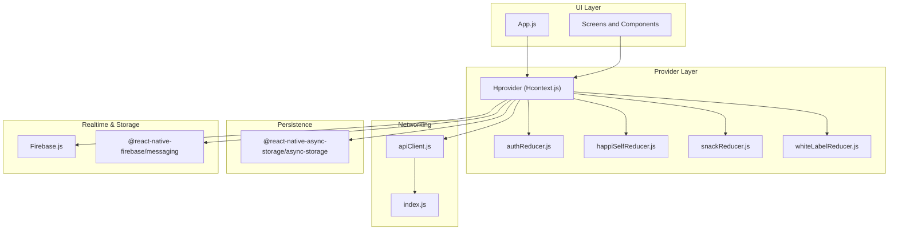
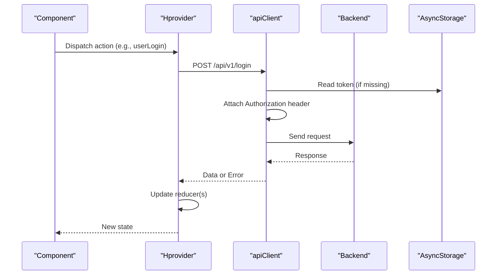
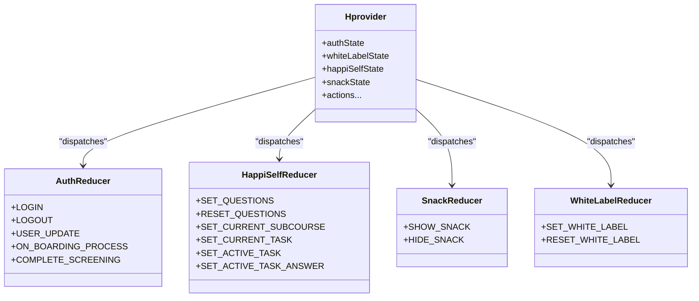
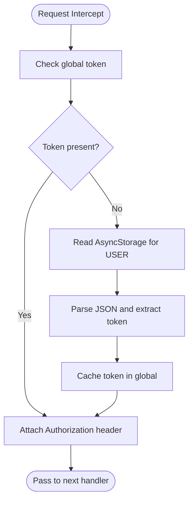
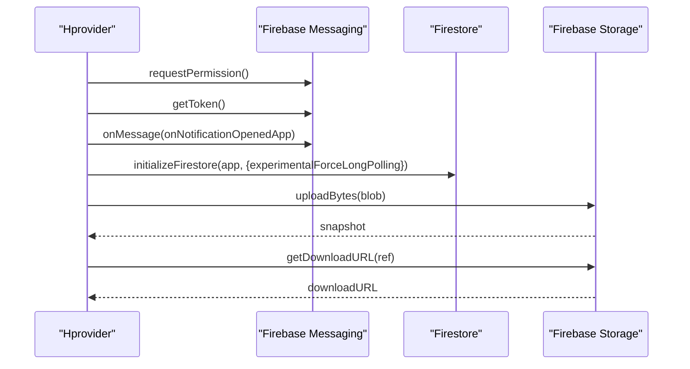
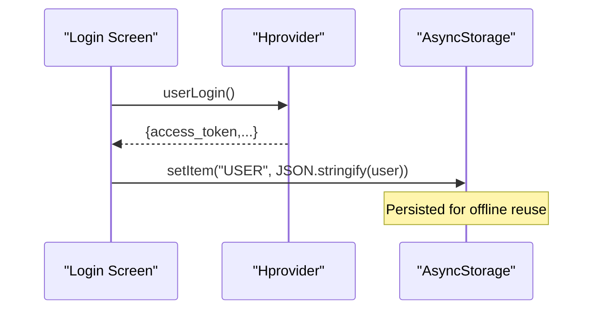
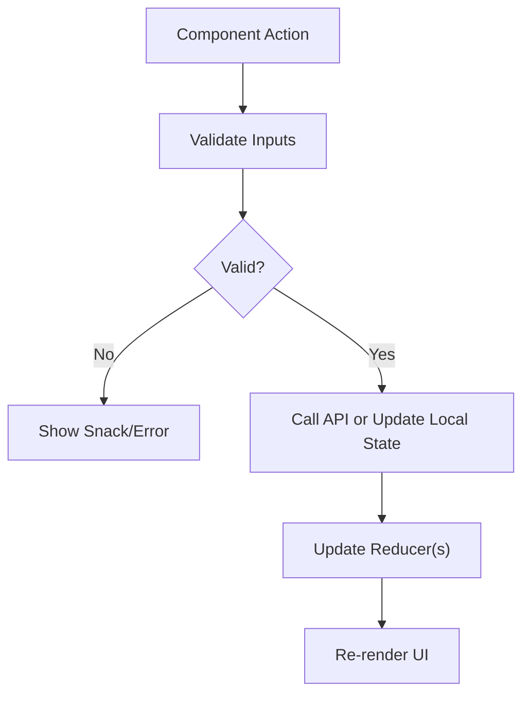
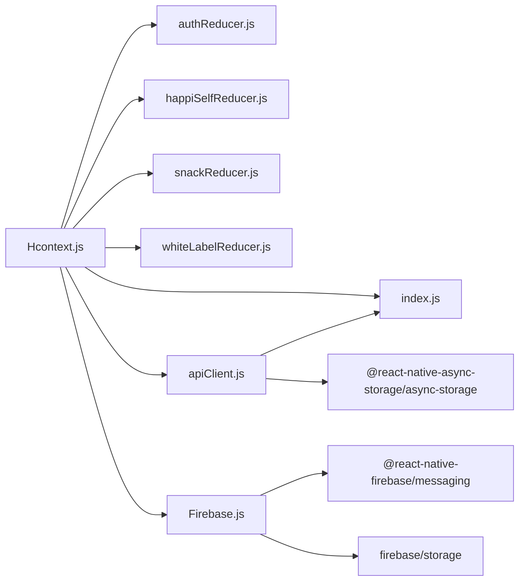

# Data Management

<cite>
**Referenced Files in This Document**
- [App.js](file://App.js)
- [Hcontext.js](file://src/context/Hcontext.js)
- [apiClient.js](file://src/context/apiClient.js)
- [Firebase.js](file://src/context/Firebase.js)
- [authReducer.js](file://src/context/reducers/authReducer.js)
- [happiSelfReducer.js](file://src/context/reducers/happiSelfReducer.js)
- [snackReducer.js](file://src/context/reducers/snackReducer.js)
- [whiteLabelReducer.js](file://src/context/reducers/whiteLabelReducer.js)
- [index.js](file://src/config/index.js)
- [package.json](file://package.json)
- [Login.js](file://src/screens/Auth/Login.js)
- [Snack.js](file://src/components/common/Snack.js)
- [Util.js](file://src/utils/Util.js)
</cite>

## Table of Contents
1. [Introduction](#introduction)
2. [Project Structure](#project-structure)
3. [Core Components](#core-components)
4. [Architecture Overview](#architecture-overview)
5. [Detailed Component Analysis](#detailed-component-analysis)
6. [Dependency Analysis](#dependency-analysis)
7. [Performance Considerations](#performance-considerations)
8. [Troubleshooting Guide](#troubleshooting-guide)
9. [Conclusion](#conclusion)
10. [Appendices](#appendices)

## Introduction
This document describes the data management architecture of HappiMynd, focusing on state management via a Redux-like context provider, API integration with Axios and interceptors, Firebase integration for real-time features and uploads, AsyncStorage-based persistence, and data flow patterns. It also outlines validation, error handling, and security considerations derived from the repository’s implementation.

## Project Structure
HappiMynd organizes data-related concerns under a single provider that aggregates multiple reducers and exposes a unified API surface. The provider initializes authentication, white-labeling, HappiSELF learning state, and snack notifications. It wires an Axios client with request/response interceptors and integrates Firebase for messaging and storage. Configuration constants define base URLs and analytics endpoints.

**Diagram sources**
- [App.js:17-55](file://App.js#L17-L55)
- [Hcontext.js:26-40](file://src/context/Hcontext.js#L26-L40)
- [apiClient.js:1-58](file://src/context/apiClient.js#L1-L58)
- [Firebase.js:1-52](file://src/context/Firebase.js#L1-L52)
- [index.js:1-13](file://src/config/index.js#L1-L13)

**Section sources**
- [App.js:17-55](file://App.js#L17-L55)
- [Hcontext.js:26-40](file://src/context/Hcontext.js#L26-L40)
- [apiClient.js:1-58](file://src/context/apiClient.js#L1-L58)
- [Firebase.js:1-52](file://src/context/Firebase.js#L1-L52)
- [index.js:1-13](file://src/config/index.js#L1-L13)

## Core Components
- Provider and Reducers: A central provider composes multiple reducers for authentication, white-label branding, HappiSELF tasks/questions, and snack notifications. Actions update state immutably and propagate to consumers.
- API Client: An Axios instance configured with request/response interceptors to attach Bearer tokens from memory or AsyncStorage and normalize errors.
- Firebase: Initializes Firestore with long-polling compatibility and Firebase Messaging for push notifications. Provides storage upload and download utilities.
- Persistence: AsyncStorage stores serialized user data; the API client reads tokens from it when needed.
- Configuration: Centralized constants for base URLs, analytics endpoints, and third-party integrations.

**Section sources**
- [Hcontext.js:26-40](file://src/context/Hcontext.js#L26-L40)
- [authReducer.js:1-79](file://src/context/reducers/authReducer.js#L1-L79)
- [happiSelfReducer.js:1-45](file://src/context/reducers/happiSelfReducer.js#L1-L45)
- [snackReducer.js:1-16](file://src/context/reducers/snackReducer.js#L1-L16)
- [whiteLabelReducer.js:1-22](file://src/context/reducers/whiteLabelReducer.js#L1-L22)
- [apiClient.js:1-58](file://src/context/apiClient.js#L1-L58)
- [Firebase.js:1-52](file://src/context/Firebase.js#L1-L52)
- [index.js:1-13](file://src/config/index.js#L1-L13)

## Architecture Overview
The provider exposes a comprehensive set of actions grouped by domain (authentication, chat, learning, bookings, payments, etc.). Consumers dispatch actions that either call the API client or update local state. The API client injects Authorization headers and surfaces normalized errors. Firebase is used for push notifications and file uploads.

**Diagram sources**
- [Hcontext.js:129-145](file://src/context/Hcontext.js#L129-L145)
- [apiClient.js:11-44](file://src/context/apiClient.js#L11-L44)
- [Login.js:44-74](file://src/screens/Auth/Login.js#L44-L74)

## Detailed Component Analysis

### Provider and Reducers
- Provider composes reducers for authentication, white-label branding, HappiSELF state, and snack notifications. It exposes a large action surface covering authentication, chat, learning, bookings, payments, and analytics.
- Authentication reducer sets and clears a global token, updates user metadata, and toggles onboarding/screening flags.
- HappiSELF reducer manages current subcourse/task, questions list, and active task answer buffer.
- Snack reducer controls a global snackbar visibility and message.
- White-label reducer holds branding assets and headers/footers.

**Diagram sources**
- [Hcontext.js:26-40](file://src/context/Hcontext.js#L26-L40)
- [authReducer.js:17-78](file://src/context/reducers/authReducer.js#L17-L78)
- [happiSelfReducer.js:9-44](file://src/context/reducers/happiSelfReducer.js#L9-L44)
- [snackReducer.js:6-15](file://src/context/reducers/snackReducer.js#L6-L15)
- [whiteLabelReducer.js:7-21](file://src/context/reducers/whiteLabelReducer.js#L7-L21)

**Section sources**
- [Hcontext.js:26-40](file://src/context/Hcontext.js#L26-L40)
- [authReducer.js:1-79](file://src/context/reducers/authReducer.js#L1-L79)
- [happiSelfReducer.js:1-45](file://src/context/reducers/happiSelfReducer.js#L1-L45)
- [snackReducer.js:1-16](file://src/context/reducers/snackReducer.js#L1-L16)
- [whiteLabelReducer.js:1-22](file://src/context/reducers/whiteLabelReducer.js#L1-L22)

### API Client and Interceptors
- Axios instance configured with a base URL from configuration and a timeout.
- Request interceptor:
  - Attempts to read a token from a global variable, falling back to AsyncStorage under a specific key.
  - Attaches Authorization header when available.
- Response interceptor:
  - Logs errors and normalizes them into a consistent shape for consumers.

**Diagram sources**
- [apiClient.js:11-44](file://src/context/apiClient.js#L11-L44)

**Section sources**
- [apiClient.js:1-58](file://src/context/apiClient.js#L1-L58)
- [index.js:1-13](file://src/config/index.js#L1-L13)

### Firebase Integration
- Firestore initialization with long-polling enabled for RN stability.
- Messaging setup for push notifications, including permission handling and listener registration.
- Storage utilities for uploading blobs and retrieving download URLs.

**Diagram sources**
- [Hcontext.js:80-127](file://src/context/Hcontext.js#L80-L127)
- [Firebase.js:36-51](file://src/context/Firebase.js#L36-L51)
- [Hcontext.js:836-857](file://src/context/Hcontext.js#L836-L857)

**Section sources**
- [Hcontext.js:80-127](file://src/context/Hcontext.js#L80-L127)
- [Firebase.js:1-52](file://src/context/Firebase.js#L1-L52)
- [Hcontext.js:836-857](file://src/context/Hcontext.js#L836-L857)

### Data Persistence and Synchronization
- AsyncStorage is used to persist the logged-in user object. On successful login, the response is stored under a specific key and later consumed by the API client interceptor.
- The provider also exposes actions for CRUD operations on notes, courses, and other domain entities, which are backed by API endpoints.

**Diagram sources**
- [Login.js:65](file://src/screens/Auth/Login.js#L65)
- [apiClient.js:18-32](file://src/context/apiClient.js#L18-L32)

**Section sources**
- [Login.js:44-74](file://src/screens/Auth/Login.js#L44-L74)
- [apiClient.js:18-32](file://src/context/apiClient.js#L18-L32)

### Data Flow Patterns, Validation, and Error Handling
- Data flow:
  - Components dispatch actions via the provider.
  - Actions call the API client or update local state reducers.
  - Results update state, which re-renders components.
- Validation:
  - Login action checks presence of required fields before invoking the API.
  - Many actions log and dispatch snack messages for user feedback.
- Error handling:
  - API client normalizes errors for consumers.
  - Actions surface user-friendly messages via snack reducer.
  - Firebase and network errors are logged and surfaced to callers.

**Diagram sources**
- [Login.js:48-54](file://src/screens/Auth/Login.js#L48-L54)
- [apiClient.js:46-56](file://src/context/apiClient.js#L46-L56)
- [Snack.js:9-32](file://src/components/common/Snack.js#L9-L32)

**Section sources**
- [Login.js:44-74](file://src/screens/Auth/Login.js#L44-L74)
- [apiClient.js:46-56](file://src/context/apiClient.js#L46-L56)
- [Snack.js:1-35](file://src/components/common/Snack.js#L1-L35)

### Offline-First Strategy and Caching
- Token caching:
  - Global token caching reduces repeated AsyncStorage reads.
  - On logout, the global token is cleared to prevent stale requests.
- AsyncStorage caching:
  - User object is persisted locally after login to support offline scenarios and faster rehydration.
- Recommendations for broader offline-first adoption:
  - Normalize API responses into structured entities.
  - Implement optimistic updates with rollback strategies.
  - Queue write operations when offline and sync on connectivity.

**Section sources**
- [apiClient.js:14-32](file://src/context/apiClient.js#L14-L32)
- [authReducer.js:65-74](file://src/context/reducers/authReducer.js#L65-L74)
- [Login.js:65](file://src/screens/Auth/Login.js#L65)

### Third-Party Integrations and Analytics
- Firebase:
  - Messaging for push notifications.
  - Storage for file uploads.
- Analytics:
  - NativeNotify analytics endpoint is called with screen name and credentials from configuration.
- Payment:
  - Dedicated endpoints for various payment flows, including Apple Pay receipts.

**Section sources**
- [Hcontext.js:1398-1406](file://src/context/Hcontext.js#L1398-L1406)
- [Hcontext.js:1321-1334](file://src/context/Hcontext.js#L1321-L1334)
- [index.js:8-12](file://src/config/index.js#L8-L12)

### Security and Compliance Considerations
- Transport security:
  - HTTPS base URL ensures encrypted communication with the backend.
- Token handling:
  - Access tokens are stored in AsyncStorage and cached globally for convenience; ensure secure deletion on logout.
- Device integrity:
  - Root detection is performed at startup to restrict usage on compromised devices.
- Data at rest:
  - AsyncStorage persists sensitive user data; consider encryption libraries for production-grade protection.
- Privacy:
  - Analytics collection is external; ensure compliance with applicable privacy regulations and user consent.

**Section sources**
- [index.js:3](file://src/config/index.js#L3)
- [authReducer.js:65-74](file://src/context/reducers/authReducer.js#L65-L74)
- [App.js:38-46](file://App.js#L38-L46)

## Dependency Analysis
The provider orchestrates multiple dependencies: reducers, API client, Firebase, AsyncStorage, and configuration. The API client depends on configuration and AsyncStorage. Firebase is initialized once and reused across actions.

**Diagram sources**
- [Hcontext.js:13-22](file://src/context/Hcontext.js#L13-L22)
- [apiClient.js:1-9](file://src/context/apiClient.js#L1-L9)
- [Firebase.js:1-10](file://src/context/Firebase.js#L1-L10)
- [index.js:1-13](file://src/config/index.js#L1-L13)

**Section sources**
- [Hcontext.js:13-22](file://src/context/Hcontext.js#L13-L22)
- [apiClient.js:1-9](file://src/context/apiClient.js#L1-L9)
- [Firebase.js:1-10](file://src/context/Firebase.js#L1-L10)
- [index.js:1-13](file://src/config/index.js#L1-L13)

## Performance Considerations
- Prefer global token caching to avoid repeated AsyncStorage reads.
- Debounce or throttle frequent API calls (e.g., analytics, notifications).
- Use long-polling for Firestore in RN environments to avoid transport instability.
- Batch UI updates after state changes to minimize re-renders.

## Troubleshooting Guide
- Authentication failures:
  - Verify token presence in AsyncStorage and global cache.
  - Confirm Authorization header is attached in requests.
- Network timeouts:
  - Check Axios timeout and server responsiveness.
- Firebase errors:
  - Ensure messaging permissions are granted and tokens are retrieved.
  - Confirm Firestore initialization with long-polling is effective.
- Snack notifications:
  - Ensure the snack component is rendered and timers are cleared properly.

**Section sources**
- [apiClient.js:11-44](file://src/context/apiClient.js#L11-L44)
- [Hcontext.js:80-127](file://src/context/Hcontext.js#L80-L127)
- [Snack.js:9-32](file://src/components/common/Snack.js#L9-L32)

## Conclusion
HappiMynd employs a Redux-like context provider to centralize state across multiple reducers, an Axios-based API client with robust interceptors, and Firebase for real-time features and storage. AsyncStorage is used for persistence, with token caching to improve performance. The implementation includes basic validation and error surfacing via a global snack mechanism. For production hardening, consider structured entity normalization, optimistic updates, encryption at rest, and stricter privacy controls.

## Appendices
- Utility helpers for date/time formatting are available for consistent temporal handling across components.

**Section sources**
- [Util.js:1-22](file://src/utils/Util.js#L1-L22)