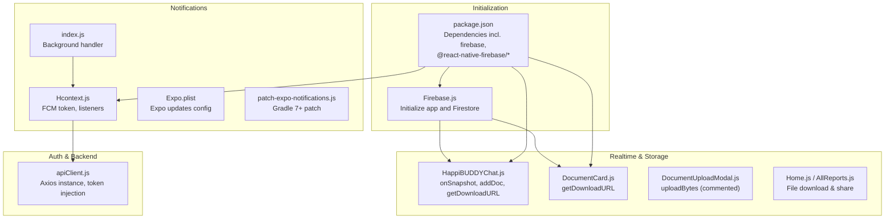
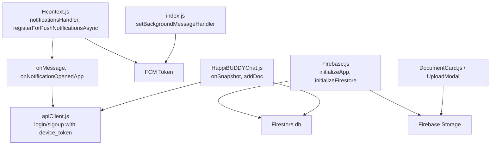
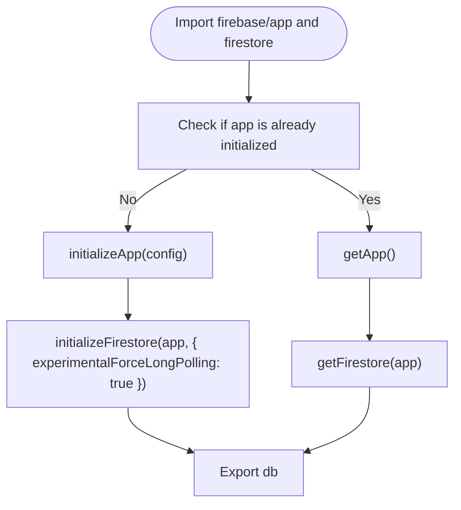
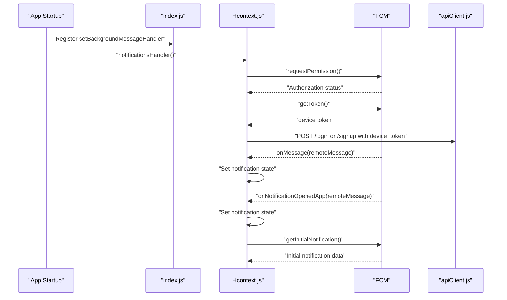
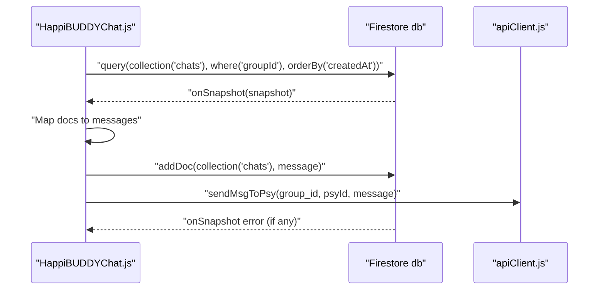
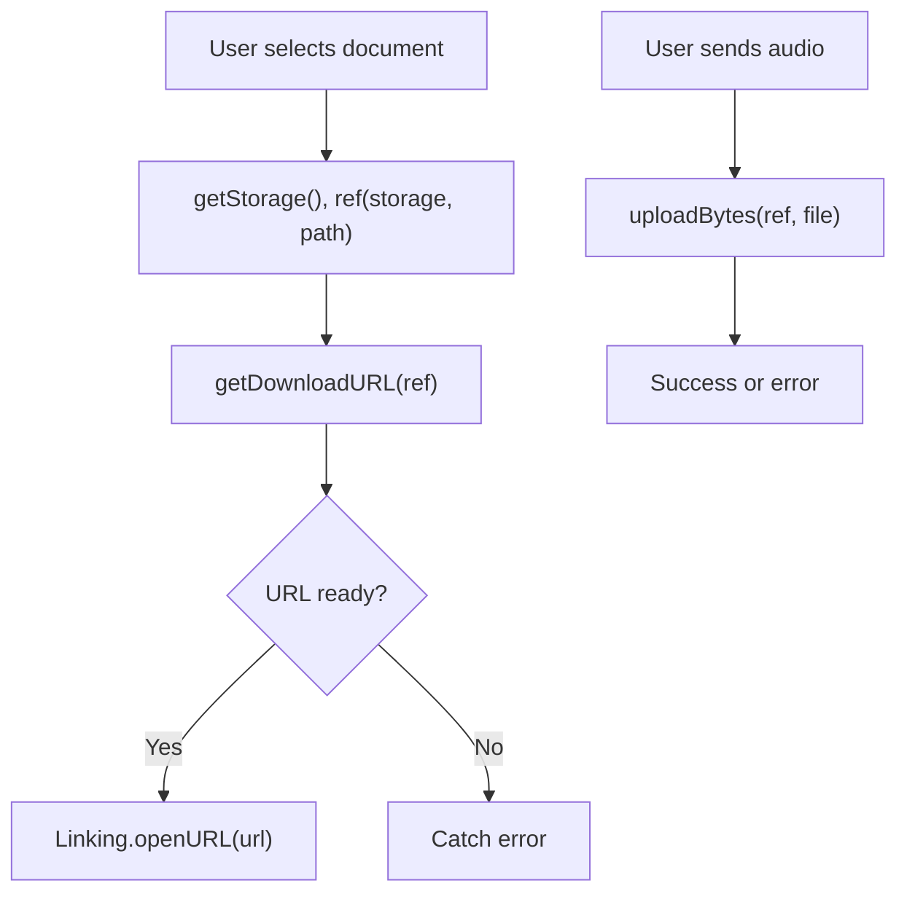
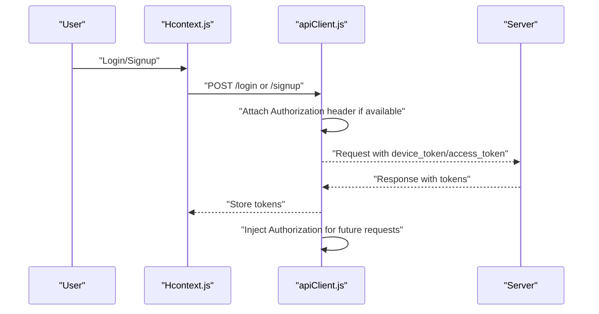
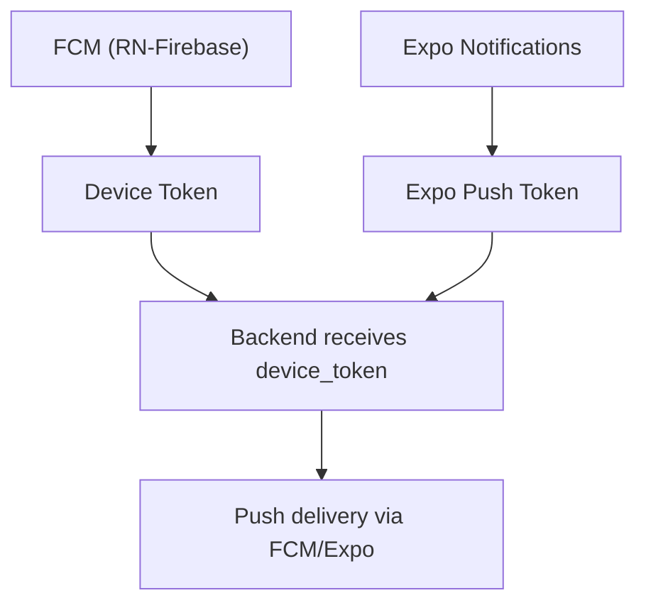
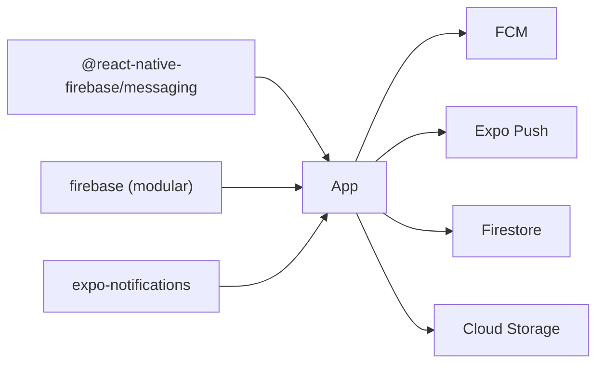

# Firebase Integration

<cite>
**Referenced Files in This Document**
- [Firebase.js](file://src/context/Firebase.js)
- [Hcontext.js](file://src/context/Hcontext.js)
- [index.js](file://index.js)
- [HappiBUDDYChat.js](file://src/screens/HappyBUDDY/HappiBUDDYChat.js)
- [DocumentCard.js](file://src/components/cards/DocumentCard.js)
- [DocumentUploadModal.js](file://src/components/Modals/DocumentUploadModal.js)
- [apiClient.js](file://src/context/apiClient.js)
- [google-services.json](file://android/app/google-services.json)
- [Expo.plist](file://ios/HappiMynd/Supporting/Expo.plist)
- [package.json](file://package.json)
- [patch-expo-notifications.js](file://scripts/patch-expo-notifications.js)
- [Home.js](file://src/screens/Home/Home.js)
- [AllReports.js](file://src/screens/HappiLIFE/AllReports.js)
</cite>

## Table of Contents
1. [Introduction](#introduction)
2. [Project Structure](#project-structure)
3. [Core Components](#core-components)
4. [Architecture Overview](#architecture-overview)
5. [Detailed Component Analysis](#detailed-component-analysis)
6. [Dependency Analysis](#dependency-analysis)
7. [Performance Considerations](#performance-considerations)
8. [Troubleshooting Guide](#troubleshooting-guide)
9. [Conclusion](#conclusion)
10. [Appendices](#appendices)

## Introduction
This document explains HappiMynd’s Firebase integration across three pillars: real-time features, push notifications, and cloud storage. It covers SDK initialization, configuration, service setup, messaging and token management, Firestore-based real-time synchronization, Firebase Cloud Storage for media, and the hybrid push notification strategy combining Firebase Cloud Messaging (FCM) with Expo Notifications. It also documents authentication flows, deep linking considerations, user engagement tracking, security rules, indexing, performance optimization, cross-platform notification strategies, and troubleshooting.

## Project Structure
The Firebase integration spans a small set of focused modules:
- Firebase initialization and Firestore instance creation
- Provider-level notification setup and token management
- Real-time chat using Firestore snapshots
- Cloud Storage downloads and uploads
- API client integration for authentication and device token passing
- Platform-specific configuration and patches for Android and iOS

**Diagram sources**
- [Firebase.js:1-52](file://src/context/Firebase.js#L1-L52)
- [Hcontext.js:1-145](file://src/context/Hcontext.js#L1-L145)
- [index.js:1-33](file://index.js#L1-L33)
- [HappiBUDDYChat.js:222-284](file://src/screens/HappyBUDDY/HappiBUDDYChat.js#L222-L284)
- [DocumentCard.js:22-45](file://src/components/cards/DocumentCard.js#L22-L45)
- [DocumentUploadModal.js:46-88](file://src/components/Modals/DocumentUploadModal.js#L46-L88)
- [apiClient.js:1-58](file://src/context/apiClient.js#L1-L58)
- [package.json:13-38](file://package.json#L13-L38)
- [Expo.plist:1-17](file://ios/HappiMynd/Supporting/Expo.plist#L1-L17)
- [patch-expo-notifications.js:1-102](file://scripts/patch-expo-notifications.js#L1-L102)

**Section sources**
- [Firebase.js:1-52](file://src/context/Firebase.js#L1-L52)
- [Hcontext.js:1-145](file://src/context/Hcontext.js#L1-L145)
- [index.js:1-33](file://index.js#L1-L33)
- [HappiBUDDYChat.js:222-284](file://src/screens/HappyBUDDY/HappiBUDDYChat.js#L222-L284)
- [DocumentCard.js:22-45](file://src/components/cards/DocumentCard.js#L22-L45)
- [DocumentUploadModal.js:46-88](file://src/components/Modals/DocumentUploadModal.js#L46-L88)
- [apiClient.js:1-58](file://src/context/apiClient.js#L1-L58)
- [package.json:13-38](file://package.json#L13-L38)
- [Expo.plist:1-17](file://ios/HappiMynd/Supporting/Expo.plist#L1-L17)
- [patch-expo-notifications.js:1-102](file://scripts/patch-expo-notifications.js#L1-L102)

## Core Components
- Firebase initialization and Firestore instance:
  - Initializes the Firebase app and Firestore with long-polling enabled for React Native stability.
  - Exports the Firestore instance for use across the app.
- Notification provider:
  - Requests notification permission, retrieves FCM token, and registers foreground/background listeners.
  - Passes device token to backend during login and sign-up.
- Real-time chat:
  - Uses Firestore queries and onSnapshot to stream chat messages in real time.
  - Writes new messages to Firestore and triggers backend notifications.
- Cloud storage:
  - Downloads files via signed URLs for documents and media.
  - Uploads audio/media to Firebase Storage (commented in modal).
- API client:
  - Injects access tokens into outgoing requests and centralizes error logging.

**Section sources**
- [Firebase.js:14-51](file://src/context/Firebase.js#L14-L51)
- [Hcontext.js:80-145](file://src/context/Hcontext.js#L80-L145)
- [HappiBUDDYChat.js:249-284](file://src/screens/HappyBUDDY/HappiBUDDYChat.js#L249-L284)
- [DocumentCard.js:22-45](file://src/components/cards/DocumentCard.js#L22-L45)
- [DocumentUploadModal.js:46-88](file://src/components/Modals/DocumentUploadModal.js#L46-L88)
- [apiClient.js:11-56](file://src/context/apiClient.js#L11-L56)

## Architecture Overview
The integration follows a layered pattern:
- Initialization layer: Firebase app and Firestore configured once.
- Provider layer: Centralized notification setup and token management.
- Domain layer: Real-time chat and storage operations.
- Backend layer: Authentication and push notification delivery via Expo push tokens.

**Diagram sources**
- [Firebase.js:14-51](file://src/context/Firebase.js#L14-L51)
- [Hcontext.js:80-145](file://src/context/Hcontext.js#L80-L145)
- [HappiBUDDYChat.js:249-284](file://src/screens/HappyBUDDY/HappiBUDDYChat.js#L249-L284)
- [DocumentCard.js:22-45](file://src/components/cards/DocumentCard.js#L22-L45)
- [DocumentUploadModal.js:46-88](file://src/components/Modals/DocumentUploadModal.js#L46-L88)
- [apiClient.js:11-56](file://src/context/apiClient.js#L11-L56)
- [index.js:9-11](file://index.js#L9-L11)

## Detailed Component Analysis

### Firebase Initialization and Firestore Setup
- Initializes Firebase app and Firestore with long-polling to avoid WebSocket/gRPC transport issues on React Native.
- Exports the Firestore instance for use in screens and components.

**Diagram sources**
- [Firebase.js:33-49](file://src/context/Firebase.js#L33-L49)

**Section sources**
- [Firebase.js:14-51](file://src/context/Firebase.js#L14-L51)

### Push Notifications: FCM, Tokens, and Listeners
- Background handler is registered early to process notifications when the app is terminated or in the background.
- Foreground listeners capture foreground notifications and initial notification taps.
- Device token retrieval is performed after permission is granted and passed to the backend during login/sign-up.
- Expo push notifications are integrated via Expo Notifications and a Gradle compatibility patch.

**Diagram sources**
- [index.js:9-11](file://index.js#L9-L11)
- [Hcontext.js:80-145](file://src/context/Hcontext.js#L80-L145)
- [apiClient.js:11-56](file://src/context/apiClient.js#L11-L56)

**Section sources**
- [index.js:1-33](file://index.js#L1-L33)
- [Hcontext.js:80-145](file://src/context/Hcontext.js#L80-L145)
- [apiClient.js:11-56](file://src/context/apiClient.js#L11-L56)
- [Expo.plist:1-17](file://ios/HappiMynd/Supporting/Expo.plist#L1-L17)
- [patch-expo-notifications.js:1-102](file://scripts/patch-expo-notifications.js#L1-L102)

### Real-Time Data Synchronization: Firestore Chat
- Streams chat messages in real time using onSnapshot with a query filtered by group ID and ordered by creation time.
- Writes new messages to Firestore and triggers backend actions for psychologist notifications.
- Handles Firestore connectivity errors gracefully.

**Diagram sources**
- [HappiBUDDYChat.js:249-284](file://src/screens/HappyBUDDY/HappiBUDDYChat.js#L249-L284)
- [HappiBUDDYChat.js:447-482](file://src/screens/HappyBUDDY/HappiBUDDYChat.js#L447-L482)

**Section sources**
- [HappiBUDDYChat.js:249-284](file://src/screens/HappyBUDDY/HappiBUDDYChat.js#L249-L284)
- [HappiBUDDYChat.js:447-482](file://src/screens/HappyBUDDY/HappiBUDDYChat.js#L447-L482)

### Cloud Storage: Downloads and Uploads
- Downloads files/documents via Firebase Storage getDownloadURL and opens them externally.
- Uploads audio/media to Firebase Storage (commented in the upload modal).
- File download and share utilities exist in other screens for PDF reports.

**Diagram sources**
- [DocumentCard.js:22-45](file://src/components/cards/DocumentCard.js#L22-L45)
- [HappiBUDDYChat.js:222-246](file://src/screens/HappyBUDDY/HappiBUDDYChat.js#L222-L246)
- [DocumentUploadModal.js:46-88](file://src/components/Modals/DocumentUploadModal.js#L46-L88)
- [Home.js:169-207](file://src/screens/Home/Home.js#L169-L207)
- [AllReports.js:175-191](file://src/screens/HappiLIFE/AllReports.js#L175-L191)

**Section sources**
- [DocumentCard.js:22-45](file://src/components/cards/DocumentCard.js#L22-L45)
- [HappiBUDDYChat.js:222-246](file://src/screens/HappyBUDDY/HappiBUDDYChat.js#L222-L246)
- [DocumentUploadModal.js:46-88](file://src/components/Modals/DocumentUploadModal.js#L46-L88)
- [Home.js:169-207](file://src/screens/Home/Home.js#L169-L207)
- [AllReports.js:175-191](file://src/screens/HappiLIFE/AllReports.js#L175-L191)

### Authentication Flows and Token Management
- Access tokens are injected into API requests via an Axios interceptor.
- Device tokens are captured during notification setup and sent to the backend on login/sign-up.
- Global token caching ensures subsequent requests carry the bearer token.

**Diagram sources**
- [Hcontext.js:129-145](file://src/context/Hcontext.js#L129-L145)
- [apiClient.js:11-56](file://src/context/apiClient.js#L11-L56)

**Section sources**
- [Hcontext.js:129-145](file://src/context/Hcontext.js#L129-L145)
- [apiClient.js:11-56](file://src/context/apiClient.js#L11-L56)

### Cross-Platform Notification Strategies
- FCM handles native push notifications on both Android and iOS.
- Expo Notifications is integrated for broader compatibility and a Gradle 7+ patch is applied to maintain compatibility.
- Expo push tokens are stored alongside FCM tokens for hybrid delivery.

**Diagram sources**
- [Hcontext.js:42-45](file://src/context/Hcontext.js#L42-L45)
- [Hcontext.js:80-145](file://src/context/Hcontext.js#L80-L145)
- [Expo.plist:1-17](file://ios/HappiMynd/Supporting/Expo.plist#L1-L17)
- [patch-expo-notifications.js:1-102](file://scripts/patch-expo-notifications.js#L1-L102)

**Section sources**
- [Hcontext.js:42-45](file://src/context/Hcontext.js#L42-L45)
- [Hcontext.js:80-145](file://src/context/Hcontext.js#L80-L145)
- [Expo.plist:1-17](file://ios/HappiMynd/Supporting/Expo.plist#L1-L17)
- [patch-expo-notifications.js:1-102](file://scripts/patch-expo-notifications.js#L1-L102)

## Dependency Analysis
- Dependencies include Firebase modular SDK, React Native Firebase messaging, and Expo Notifications.
- Android configuration includes google-services.json for FCM.
- iOS configuration includes Expo updates settings.

**Diagram sources**
- [package.json:13-38](file://package.json#L13-L38)
- [google-services.json:1-55](file://android/app/google-services.json#L1-L55)
- [Expo.plist:1-17](file://ios/HappiMynd/Supporting/Expo.plist#L1-L17)

**Section sources**
- [package.json:13-38](file://package.json#L13-L38)
- [google-services.json:1-55](file://android/app/google-services.json#L1-L55)
- [Expo.plist:1-17](file://ios/HappiMynd/Supporting/Expo.plist#L1-L17)

## Performance Considerations
- Firestore long-polling is enabled to avoid unstable transports on React Native.
- Use onSnapshot efficiently by unsubscribing when components unmount.
- Batch writes and limit query result sets to reduce bandwidth and latency.
- Cache frequently accessed tokens and avoid redundant token refreshes.
- For storage, prefer pre-signed URLs for downloads and compress media where possible.

[No sources needed since this section provides general guidance]

## Troubleshooting Guide
Common issues and resolutions:
- Could not reach Cloud Firestore backend:
  - The Firestore instance is initialized with long-polling to mitigate transport instability on React Native.
- Android timer warnings with Firebase:
  - A patch intercepts long setTimeout calls and splits them into shorter timers to prevent Android timer thresholds from triggering.
- FCM background handling:
  - Ensure the background message handler is registered before component registration.
- Permission denied for notifications:
  - Verify that notification permission is requested and accepted; otherwise, token retrieval will fail.
- Expo Notifications Gradle compatibility:
  - Apply the provided patch to fix deprecated Gradle plugins and ensure builds succeed on newer Gradle versions.

**Section sources**
- [Firebase.js:37-44](file://src/context/Firebase.js#L37-L44)
- [index.js:13-33](file://index.js#L13-L33)
- [index.js:9-11](file://index.js#L9-L11)
- [Hcontext.js:104-127](file://src/context/Hcontext.js#L104-L127)
- [patch-expo-notifications.js:1-102](file://scripts/patch-expo-notifications.js#L1-L102)

## Conclusion
HappiMynd integrates Firebase across real-time messaging, push notifications, and cloud storage with a clean separation of concerns. The initialization layer ensures stable Firestore connectivity, the provider layer manages tokens and listeners, and domain components leverage Firestore and Storage for chat and media. The hybrid approach using FCM and Expo Notifications improves reliability and compatibility across platforms. Following the recommended practices and troubleshooting steps will help maintain a robust and scalable Firebase integration.

[No sources needed since this section summarizes without analyzing specific files]

## Appendices

### Security Rules and Indexing Guidance
- Firestore security rules should restrict reads/writes to authenticated users and enforce field validation.
- Indexes should be created for commonly queried fields (e.g., group IDs, timestamps) to optimize real-time queries.
- Storage security rules should validate upload paths and restrict access to authorized users.

[No sources needed since this section provides general guidance]

### Monitoring Approaches
- Track notification delivery and open rates via backend analytics.
- Monitor Firestore query performance and error logs.
- Observe storage download success rates and file corruption checks.

[No sources needed since this section provides general guidance]