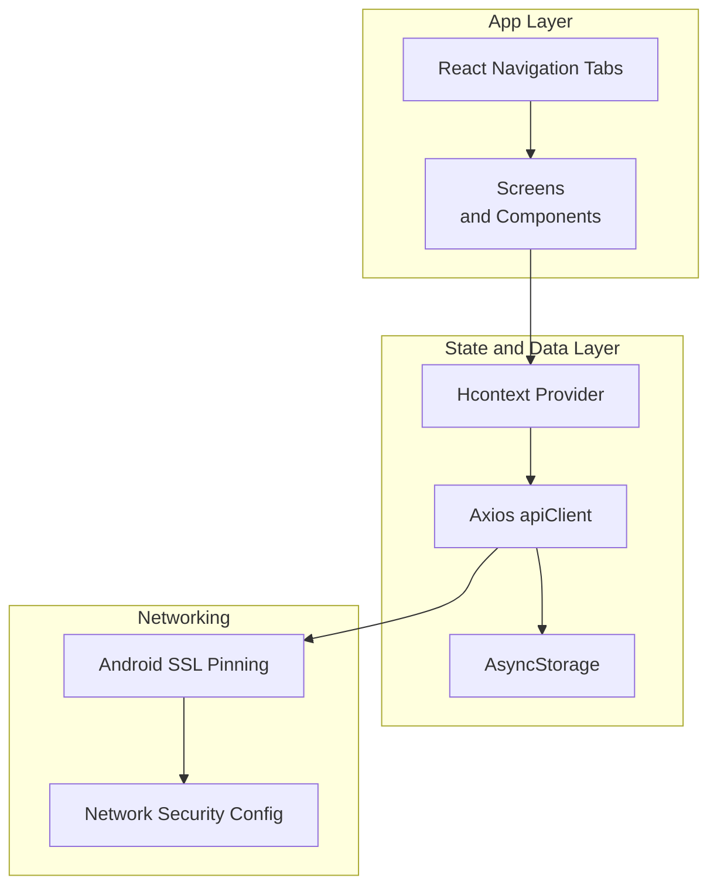
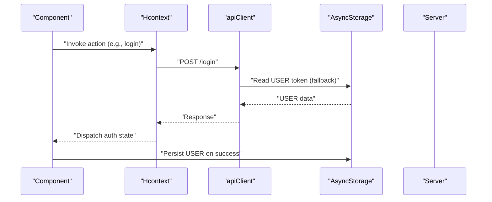
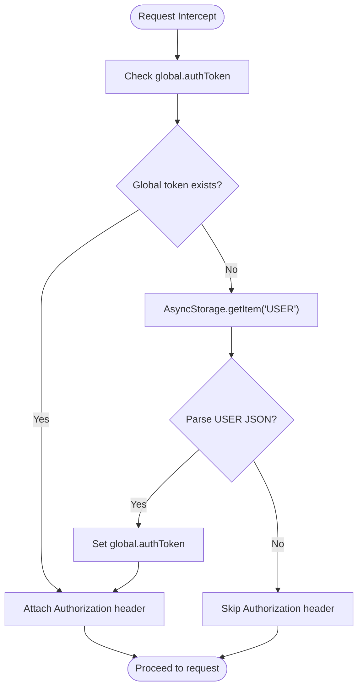
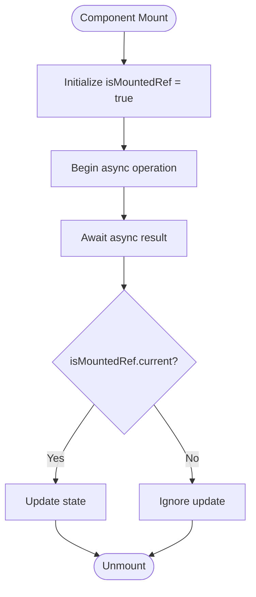
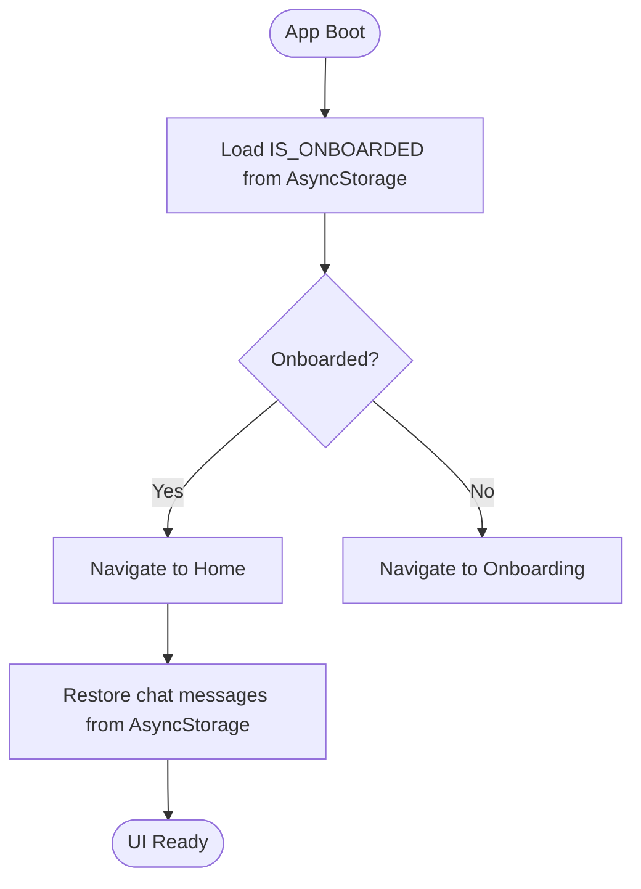
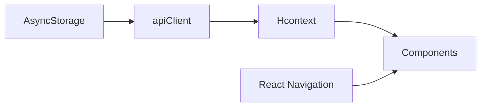

# Offline Persistence

<cite>
**Referenced Files in This Document**
- [useIsMounted.js](file://src/hooks/useIsMounted.js)
- [apiClient.js](file://src/context/apiClient.js)
- [Hcontext.js](file://src/context/Hcontext.js)
- [Login.js](file://src/screens/Auth/Login.js)
- [ChatHome.js](file://src/screens/Chat/ChatHome.js)
- [index.js](file://index.js)
- [TabNavigation/index.js](file://src/routes/TabNavigation/index.js)
- [OnBoarding.js](file://src/screens/shared/OnBoarding.js)
- [SSLPinnerFactory.java](file://android/app/src/main/java/com/happimynd/SSLPinnerFactory.java)
- [network_security_config.xml](file://android/app/src/main/res/xml/network_security_config.xml)
</cite>

## Table of Contents
1. [Introduction](#introduction)
2. [Project Structure](#project-structure)
3. [Core Components](#core-components)
4. [Architecture Overview](#architecture-overview)
5. [Detailed Component Analysis](#detailed-component-analysis)
6. [Dependency Analysis](#dependency-analysis)
7. [Performance Considerations](#performance-considerations)
8. [Troubleshooting Guide](#troubleshooting-guide)
9. [Conclusion](#conclusion)
10. [Appendices](#appendices)

## Introduction
This document explains HappiMynd’s offline-first data persistence strategy. It focuses on AsyncStorage-backed caching for user credentials and lightweight UI state, the integration of AsyncStorage with the HTTP client for token retrieval, and the local state management patterns used across the app. It also documents the useIsMounted hook to prevent memory leaks during asynchronous operations, and outlines conceptual patterns for offline data lifecycle, synchronization, optimistic updates, conflict resolution, and background sync. Guidance is included for hydrating data on app launch, maintaining data consistency, cache warming, and performance optimization for large datasets. Finally, it covers integration with React Navigation for offline-aware routing and handling network connectivity changes, along with debugging and testing strategies for offline functionality.

## Project Structure
The offline-first approach in HappiMynd centers around:
- AsyncStorage for persisting user credentials and small UI state
- An Axios-based apiClient with a request interceptor that reads tokens from AsyncStorage
- A central Hcontext provider that orchestrates API calls and exposes reducers for local state
- A useIsMounted hook to guard against state updates after unmount
- React Navigation tabs for offline-aware routing

**Diagram sources**
- [TabNavigation/index.js:1-83](file://src/routes/TabNavigation/index.js#L1-L83)
- [Hcontext.js:1-1551](file://src/context/Hcontext.js#L1-L1551)
- [apiClient.js:1-58](file://src/context/apiClient.js#L1-L58)
- [SSLPinnerFactory.java:1-22](file://android/app/src/main/java/com/happimynd/SSLPinnerFactory.java#L1-L22)
- [network_security_config.xml:1-9](file://android/app/src/main/res/xml/network_security_config.xml#L1-L9)

**Section sources**
- [TabNavigation/index.js:1-83](file://src/routes/TabNavigation/index.js#L1-L83)
- [Hcontext.js:1-1551](file://src/context/Hcontext.js#L1-L1551)
- [apiClient.js:1-58](file://src/context/apiClient.js#L1-L58)

## Core Components
- AsyncStorage usage for user credentials and onboarding state
- Centralized HTTP client with token injection from AsyncStorage
- Local state via useReducer in Hcontext
- useIsMounted hook to avoid state updates after unmount
- Offline-aware routing via React Navigation tabs

Key implementation references:
- AsyncStorage token injection in apiClient request interceptor
- Persisting user data on successful login
- Using AsyncStorage for chat messages and onboarding flag
- useIsMounted hook pattern

**Section sources**
- [apiClient.js:1-58](file://src/context/apiClient.js#L1-L58)
- [Login.js:44-74](file://src/screens/Auth/Login.js#L44-L74)
- [ChatHome.js:246-273](file://src/screens/Chat/ChatHome.js#L246-L273)
- [OnBoarding.js:93-126](file://src/screens/shared/OnBoarding.js#L93-L126)
- [useIsMounted.js:1-32](file://src/hooks/useIsMounted.js#L1-L32)

## Architecture Overview
The offline-first strategy leverages AsyncStorage to:
- Persist user credentials for seamless re-authentication
- Store lightweight UI state (e.g., chat messages, onboarding completion)
- Provide fallback token retrieval when global auth state is unavailable

The apiClient interceptors attach the Authorization header using tokens sourced from global state or AsyncStorage. Hcontext coordinates API calls and exposes reducers for local UI state. React Navigation tabs provide offline-aware routing.

**Diagram sources**
- [apiClient.js:11-44](file://src/context/apiClient.js#L11-L44)
- [Login.js:56-70](file://src/screens/Auth/Login.js#L56-L70)
- [Hcontext.js:129-145](file://src/context/Hcontext.js#L129-L145)

## Detailed Component Analysis

### AsyncStorage Integration and Token Management
- Token retrieval: The apiClient request interceptor attempts to read the token from global state and falls back to AsyncStorage under the key USER.
- Token caching: Upon successful retrieval from AsyncStorage, the token is cached in global.authToken for subsequent requests.
- User data persistence: On successful login, the entire user object is persisted to AsyncStorage under the key USER.

**Diagram sources**
- [apiClient.js:12-42](file://src/context/apiClient.js#L12-L42)

**Section sources**
- [apiClient.js:1-58](file://src/context/apiClient.js#L1-L58)
- [Login.js:65-69](file://src/screens/Auth/Login.js#L65-L69)

### Local State Management and useIsMounted Hook
- Hcontext aggregates reducers for auth, snack notifications, white-label branding, and HappiSELF state.
- The useIsMounted hook returns a ref whose current value flips to false upon unmount, enabling guards around async setState calls to prevent memory leaks.

**Diagram sources**
- [useIsMounted.js:18-29](file://src/hooks/useIsMounted.js#L18-L29)

**Section sources**
- [Hcontext.js:26-40](file://src/context/Hcontext.js#L26-L40)
- [useIsMounted.js:1-32](file://src/hooks/useIsMounted.js#L1-L32)

### Offline Data Lifecycle and Hydration
- App launch hydration: Onboarding state is hydrated from AsyncStorage to decide the initial route.
- Chat messages: Messages are persisted to AsyncStorage and restored on component mount.
- Data fetching strategy: Components rely on Hcontext actions that use apiClient. When offline, AsyncStorage provides token fallback for protected endpoints.
- Cache invalidation and conflict resolution: Not implemented in the current codebase; conceptual guidance is provided below.

**Diagram sources**
- [OnBoarding.js:101-107](file://src/screens/shared/OnBoarding.js#L101-L107)
- [ChatHome.js:255-273](file://src/screens/Chat/ChatHome.js#L255-L273)

**Section sources**
- [OnBoarding.js:93-126](file://src/screens/shared/OnBoarding.js#L93-L126)
- [ChatHome.js:246-273](file://src/screens/Chat/ChatHome.js#L246-L273)

### Synchronization Patterns and Optimistic Updates
Conceptual guidance:
- Optimistic updates: Update local state immediately upon user action (e.g., like a post) and roll back if the server request fails.
- Rollback mechanism: Capture previous state snapshot; revert on error.
- Conflict resolution: For concurrent edits, adopt last-writer-wins or merge strategies with timestamps.
- Background sync: Queue local changes and retry when connectivity is restored.

[No sources needed since this section provides conceptual guidance]

### Offline-Aware Routing and Connectivity Changes
- Offline-aware routing: React Navigation tabs provide persistent navigation regardless of connectivity.
- Connectivity handling: Monitor network status and adjust UI affordances (e.g., disable actions, show offline banners). Implement queueing of outbound mutations when offline.

[No sources needed since this section provides conceptual guidance]

### Examples of Offline-Capable Components
- Login screen persists USER to AsyncStorage on success and dispatches auth state.
- ChatHome saves and restores messages via AsyncStorage.
- Onboarding sets IS_ONBOARDED to enable subsequent hydration.

**Section sources**
- [Login.js:56-70](file://src/screens/Auth/Login.js#L56-L70)
- [ChatHome.js:246-273](file://src/screens/Chat/ChatHome.js#L246-L273)
- [OnBoarding.js:101-107](file://src/screens/shared/OnBoarding.js#L101-L107)

### Data Consistency, Cache Warming, and Performance
- Consistency: Prefer server-driven state for critical data; use local cache for read-heavy content with explicit refresh policies.
- Cache warming: Preload frequently accessed lists on app start or tab focus.
- Performance: Batch AsyncStorage writes, debounce frequent writes, and limit stored payload sizes. For large datasets, consider pagination and selective caching.

[No sources needed since this section provides general guidance]

## Dependency Analysis
The primary dependencies for offline persistence are:
- AsyncStorage for credential and state persistence
- apiClient for HTTP requests with token injection
- Hcontext for orchestrating actions and reducers
- React Navigation for offline-aware routing

**Diagram sources**
- [apiClient.js:1-58](file://src/context/apiClient.js#L1-L58)
- [Hcontext.js:1-1551](file://src/context/Hcontext.js#L1-L1551)
- [TabNavigation/index.js:1-83](file://src/routes/TabNavigation/index.js#L1-L83)

**Section sources**
- [apiClient.js:1-58](file://src/context/apiClient.js#L1-L58)
- [Hcontext.js:1-1551](file://src/context/Hcontext.js#L1-L1551)
- [TabNavigation/index.js:1-83](file://src/routes/TabNavigation/index.js#L1-L83)

## Performance Considerations
- Minimize AsyncStorage reads/writes during UI interactions; batch operations when possible.
- Use shallow copies and immutable updates in reducers to reduce re-renders.
- Avoid storing large binary blobs in AsyncStorage; prefer cloud storage URLs.
- Implement timeouts and retries for network requests to improve resilience.

[No sources needed since this section provides general guidance]

## Troubleshooting Guide
- Token not found: Verify AsyncStorage.USER contains a valid token and that the request interceptor executes before outgoing requests.
- Memory leaks: Ensure all async setState calls are guarded by useIsMounted.
- Network errors: Inspect apiClient response interceptor logs and server responses.
- SSL pinning: Confirm Android SSL pinner matches the configured hostname and certificate pins.

**Section sources**
- [apiClient.js:47-56](file://src/context/apiClient.js#L47-L56)
- [useIsMounted.js:18-29](file://src/hooks/useIsMounted.js#L18-L29)
- [SSLPinnerFactory.java:9-21](file://android/app/src/main/java/com/happimynd/SSLPinnerFactory.java#L9-L21)

## Conclusion
HappiMynd’s offline-first strategy relies on AsyncStorage for user credentials and lightweight UI state, with apiClient’s request interceptor ensuring tokens are available even when global state is uninitialized. Hcontext centralizes API orchestration and local state, while useIsMounted prevents memory leaks. For a production-grade offline experience, implement explicit cache invalidation, optimistic updates with rollback, background sync, and robust connectivity handling. These enhancements will improve reliability, consistency, and performance for large datasets.

## Appendices

### Appendix A: AsyncStorage Keys Used in Code
- USER: Stores the logged-in user object for token fallback and hydration.
- chatBotMessages: Stores chat message history locally.
- IS_ONBOARDED: Tracks onboarding completion for hydration.

**Section sources**
- [apiClient.js:20-28](file://src/context/apiClient.js#L20-L28)
- [Login.js:65-69](file://src/screens/Auth/Login.js#L65-L69)
- [ChatHome.js:251-251](file://src/screens/Chat/ChatHome.js#L251-L251)
- [OnBoarding.js:106-106](file://src/screens/shared/OnBoarding.js#L106-L106)

### Appendix B: Networking Security Configuration
- Android SSL pinning ensures certificate trust for the configured hostname.
- Network security config allows cleartext traffic in debug builds.

**Section sources**
- [SSLPinnerFactory.java:9-21](file://android/app/src/main/java/com/happimynd/SSLPinnerFactory.java#L9-L21)
- [network_security_config.xml:3-8](file://android/app/src/main/res/xml/network_security_config.xml#L3-L8)