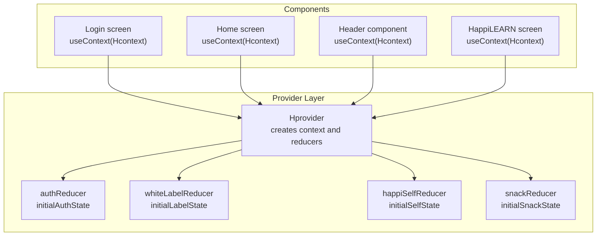
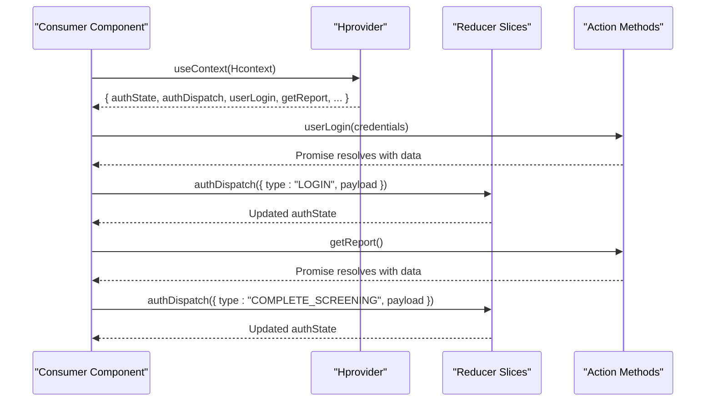
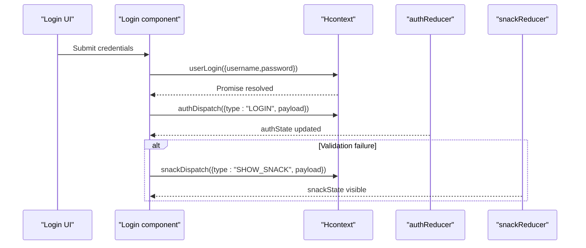
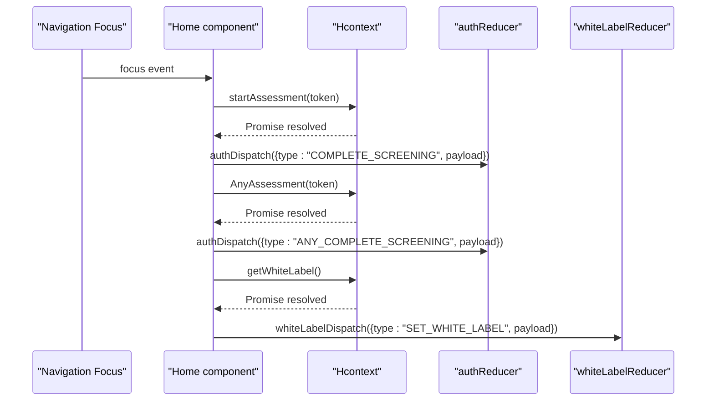
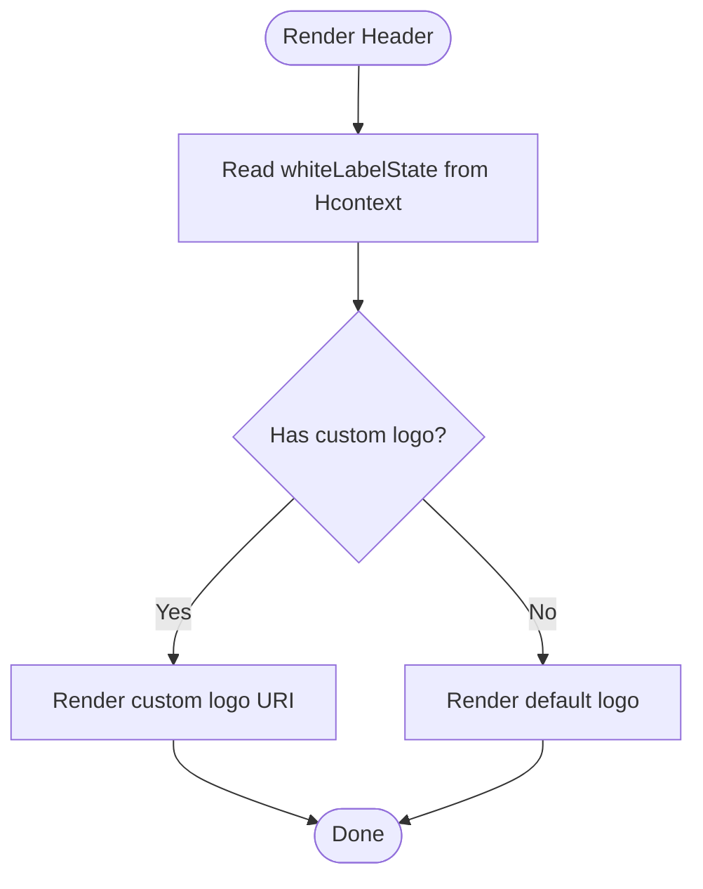
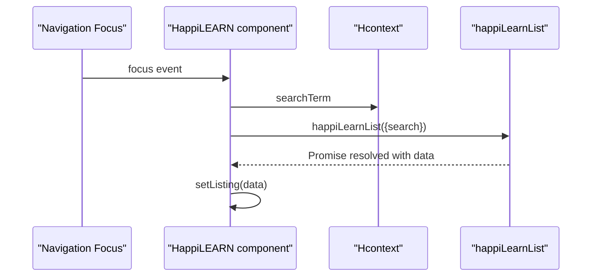
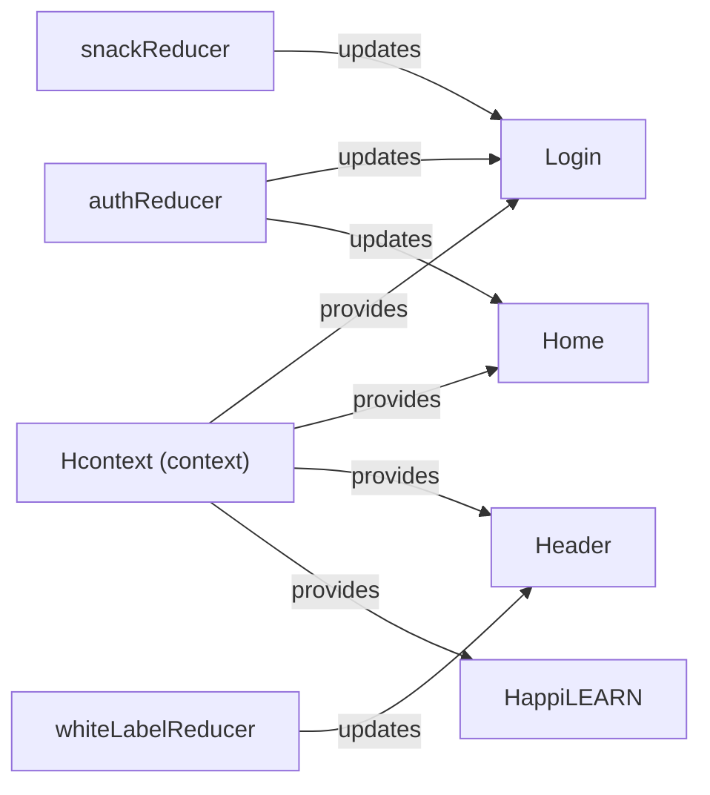

# Component Integration Patterns

<cite>
**Referenced Files in This Document**
- [Hcontext.js](file://src/context/Hcontext.js)
- [authReducer.js](file://src/context/reducers/authReducer.js)
- [happiSelfReducer.js](file://src/context/reducers/happiSelfReducer.js)
- [snackReducer.js](file://src/context/reducers/snackReducer.js)
- [whiteLabelReducer.js](file://src/context/reducers/whiteLabelReducer.js)
- [Login.js](file://src/screens/Auth/Login.js)
- [Home.js](file://src/screens/Home/Home.js)
- [Header.js](file://src/components/common/Header.js)
- [HappiLEARN.js](file://src/screens/HappiLEARN/HappiLEARN.js)
- [useIsMounted.js](file://src/hooks/useIsMounted.js)
</cite>

## Table of Contents
1. [Introduction](#introduction)
2. [Project Structure](#project-structure)
3. [Core Components](#core-components)
4. [Architecture Overview](#architecture-overview)
5. [Detailed Component Analysis](#detailed-component-analysis)
6. [Dependency Analysis](#dependency-analysis)
7. [Performance Considerations](#performance-considerations)
8. [Troubleshooting Guide](#troubleshooting-guide)
9. [Conclusion](#conclusion)

## Introduction
This document explains how components integrate with HappiMynd’s state management system centered around a React Context provider. It covers:
- Consuming context via the useContext hook
- Accessing state from reducer-backed slices
- Dispatching actions to update state and trigger API calls
- Patterns for functional components, class components, and higher-order components
- Strategies for component state mapping, selector optimization, and memoization
- Error handling, loading states, and lifecycle integration with the provider

## Project Structure
HappiMynd organizes state management under a single provider that exposes:
- Reducer-backed state slices (authentication, white-label branding, snack notifications, HappiSELF tasks)
- Action methods for API calls and side effects
- Local state for filters, selections, and UI flags

**Diagram sources**
- [Hcontext.js:31-31](file://src/context/Hcontext.js#L31-L31)
- [Hcontext.js:33-1567](file://src/context/Hcontext.js#L33-L1567)
- [authReducer.js:5-79](file://src/context/reducers/authReducer.js#L5-L79)
- [whiteLabelReducer.js:1-22](file://src/context/reducers/whiteLabelReducer.js#L1-L22)
- [happiSelfReducer.js:1-45](file://src/context/reducers/happiSelfReducer.js#L1-L45)
- [snackReducer.js:1-16](file://src/context/reducers/snackReducer.js#L1-L16)
- [Login.js:31-34](file://src/screens/Auth/Login.js#L31-L34)
- [Home.js:44-68](file://src/screens/Home/Home.js#L44-L68)
- [Header.js:17-19](file://src/components/common/Header.js#L17-L19)
- [HappiLEARN.js:66-78](file://src/screens/HappiLEARN/HappiLEARN.js#L66-L78)

**Section sources**
- [Hcontext.js:31-1567](file://src/context/Hcontext.js#L31-L1567)
- [authReducer.js:5-79](file://src/context/reducers/authReducer.js#L5-L79)
- [whiteLabelReducer.js:1-22](file://src/context/reducers/whiteLabelReducer.js#L1-L22)
- [happiSelfReducer.js:1-45](file://src/context/reducers/happiSelfReducer.js#L1-L45)
- [snackReducer.js:1-16](file://src/context/reducers/snackReducer.js#L1-L16)

## Core Components
- Hcontext and Hprovider: Create a context with combined state and action methods, exposing reducer slices and local state.
- Reducers: Provide deterministic state transitions for auth, white-label, snack, and HappiSELF slices.
- Consumer components: Use useContext to access state and actions for rendering and side effects.

Key integration points:
- Accessing state: Destructure desired slices and methods from the context value.
- Updating state: Call dispatch functions for reducer slices or invoke action methods for API calls.
- Managing UI flags: Use local state fields exposed by the provider for UI-related toggles and filters.

**Section sources**
- [Hcontext.js:31-31](file://src/context/Hcontext.js#L31-L31)
- [Hcontext.js:33-1567](file://src/context/Hcontext.js#L33-L1567)
- [authReducer.js:17-77](file://src/context/reducers/authReducer.js#L17-L77)
- [whiteLabelReducer.js:7-21](file://src/context/reducers/whiteLabelReducer.js#L7-L21)
- [happiSelfReducer.js:9-43](file://src/context/reducers/happiSelfReducer.js#L9-L43)
- [snackReducer.js:6-15](file://src/context/reducers/snackReducer.js#L6-L15)

## Architecture Overview
The provider composes multiple reducers and exposes them alongside action methods and local state. Consumers subscribe via useContext and can:
- Read state slices (e.g., authState, whiteLabelState)
- Dispatch reducer actions (e.g., authDispatch)
- Invoke API-bound methods (e.g., userLogin, getReport)

**Diagram sources**
- [Hcontext.js:1425-1567](file://src/context/Hcontext.js#L1425-L1567)
- [authReducer.js:17-77](file://src/context/reducers/authReducer.js#L17-L77)
- [Login.js:45-74](file://src/screens/Auth/Login.js#L45-L74)
- [Home.js:108-134](file://src/screens/Home/Home.js#L108-L134)

## Detailed Component Analysis

### Functional Components: Login
- Consumes context to access dispatch and action methods.
- Uses action methods to perform login and dispatch reducer updates.
- Uses snack dispatch to surface errors.

**Diagram sources**
- [Login.js:31-74](file://src/screens/Auth/Login.js#L31-L74)
- [Hcontext.js:1425-1483](file://src/context/Hcontext.js#L1425-L1483)
- [authReducer.js:17-77](file://src/context/reducers/authReducer.js#L17-L77)
- [snackReducer.js:6-15](file://src/context/reducers/snackReducer.js#L6-L15)

**Section sources**
- [Login.js:31-74](file://src/screens/Auth/Login.js#L31-L74)

### Functional Components: Home
- Demonstrates lifecycle integration with navigation focus and AppState changes.
- Calls action methods to check assessment status and update reducer state.
- Uses white-label state to render branded UI.

**Diagram sources**
- [Home.js:44-89](file://src/screens/Home/Home.js#L44-L89)
- [Home.js:108-134](file://src/screens/Home/Home.js#L108-L134)
- [Hcontext.js:1425-1567](file://src/context/Hcontext.js#L1425-L1567)
- [authReducer.js:17-77](file://src/context/reducers/authReducer.js#L17-L77)
- [whiteLabelReducer.js:7-21](file://src/context/reducers/whiteLabelReducer.js#L7-L21)

**Section sources**
- [Home.js:44-134](file://src/screens/Home/Home.js#L44-L134)

### Functional Components: Header
- Reads white-label state to conditionally render a custom logo.
- Illustrates minimal consumer usage of context.

**Diagram sources**
- [Header.js:17-19](file://src/components/common/Header.js#L17-L19)
- [whiteLabelReducer.js:7-21](file://src/context/reducers/whiteLabelReducer.js#L7-L21)

**Section sources**
- [Header.js:17-19](file://src/components/common/Header.js#L17-L19)

### Functional Components: HappiLEARN
- Uses action methods to fetch content lists.
- Manages local state for search term and loading indicators.
- Integrates with navigation focus to refresh data.

**Diagram sources**
- [HappiLEARN.js:66-95](file://src/screens/HappiLEARN/HappiLEARN.js#L66-L95)
- [HappiLEARN.js:97-110](file://src/screens/HappiLEARN/HappiLEARN.js#L97-L110)
- [Hcontext.js:1425-1483](file://src/context/Hcontext.js#L1425-L1483)

**Section sources**
- [HappiLEARN.js:66-110](file://src/screens/HappiLEARN/HappiLEARN.js#L66-L110)

### Class Components and Higher-Order Components
- Class components can consume context similarly by using the static contextType or the useContext hook inside a functional wrapper.
- Higher-order components can wrap consumers to inject context-derived props, enabling reuse across components.

[No sources needed since this section provides general guidance]

## Dependency Analysis
The provider composes multiple reducers and exposes a consolidated context value. Consumers depend on:
- Correct destructuring of context fields
- Proper dispatch usage for reducer slices
- Consistent action method signatures for API calls

**Diagram sources**
- [Hcontext.js:31-31](file://src/context/Hcontext.js#L31-L31)
- [Hcontext.js:33-1567](file://src/context/Hcontext.js#L33-L1567)
- [authReducer.js:17-77](file://src/context/reducers/authReducer.js#L17-L77)
- [whiteLabelReducer.js:7-21](file://src/context/reducers/whiteLabelReducer.js#L7-L21)
- [snackReducer.js:6-15](file://src/context/reducers/snackReducer.js#L6-L15)
- [Login.js:31-34](file://src/screens/Auth/Login.js#L31-L34)
- [Home.js:44-68](file://src/screens/Home/Home.js#L44-L68)
- [Header.js:17-19](file://src/components/common/Header.js#L17-L19)
- [HappiLEARN.js:66-78](file://src/screens/HappiLEARN/HappiLEARN.js#L66-L78)

**Section sources**
- [Hcontext.js:31-1567](file://src/context/Hcontext.js#L31-L1567)

## Performance Considerations
- Prefer granular consumption: Destructure only the fields needed from the context to minimize re-renders.
- Memoize derived data: Use memoization utilities to avoid recomputing expensive derived values between renders.
- Optimize rendering: Separate concerns into smaller components to reduce unnecessary re-renders when unrelated state changes occur.
- Avoid excessive dispatches: Batch related updates and coalesce frequent updates where appropriate.
- Lifecycle hooks: Use navigation focus and AppState listeners judiciously to prevent redundant work.

[No sources needed since this section provides general guidance]

## Troubleshooting Guide
Common issues and remedies:
- Missing context provider: Ensure the app is wrapped with the provider so consumers can access state and actions.
- Incorrect dispatch usage: Verify action types match reducer cases and payloads are structured as expected.
- API errors: Use snack dispatch to surface user-facing messages; inspect thrown errors and handle them gracefully in components.
- Loading states: Manage loading flags around async operations to provide responsive UI feedback.
- Lifecycle integration: Subscribe to navigation focus and AppState changes to keep UI synchronized with remote state.

**Section sources**
- [Login.js:45-74](file://src/screens/Auth/Login.js#L45-L74)
- [Home.js:108-134](file://src/screens/Home/Home.js#L108-L134)
- [snackReducer.js:6-15](file://src/context/reducers/snackReducer.js#L6-L15)

## Conclusion
HappiMynd’s integration model centers on a single provider that exposes reducer-backed state slices and action methods. Components consume context via the useContext hook, dispatch reducer actions for state updates, and call action methods for API-driven side effects. By following the patterns demonstrated in Login, Home, Header, and HappiLEARN, teams can maintain predictable state flows, manage loading and error states effectively, and optimize performance through careful selection of consumed fields and memoization strategies.