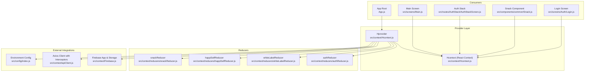
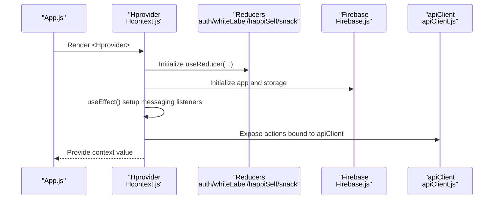
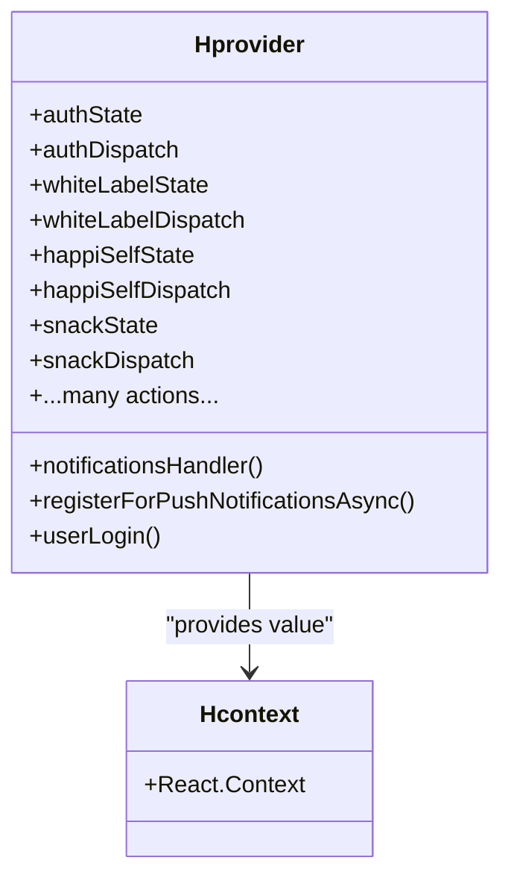
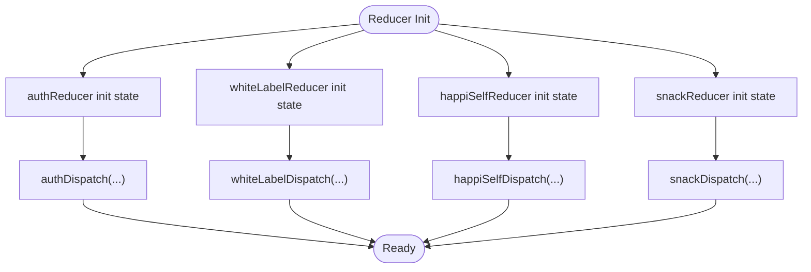
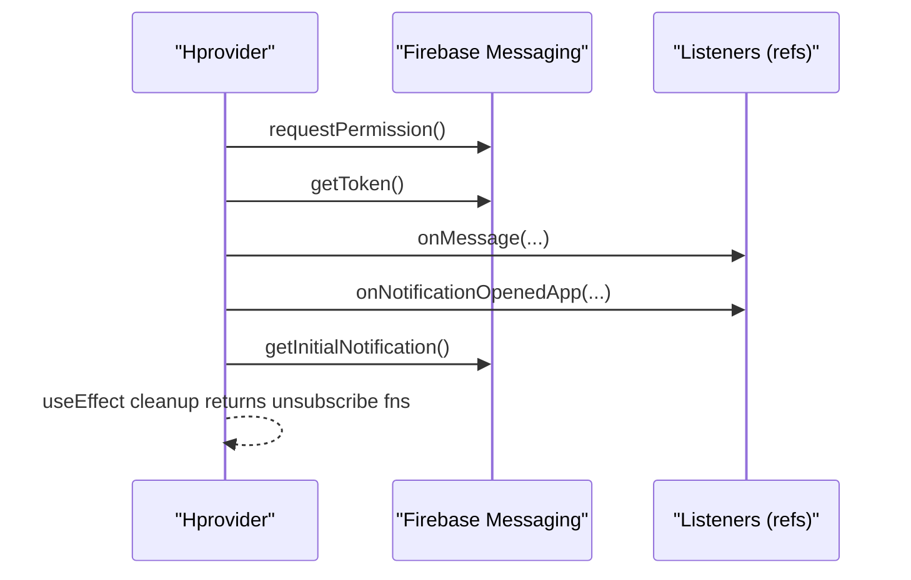
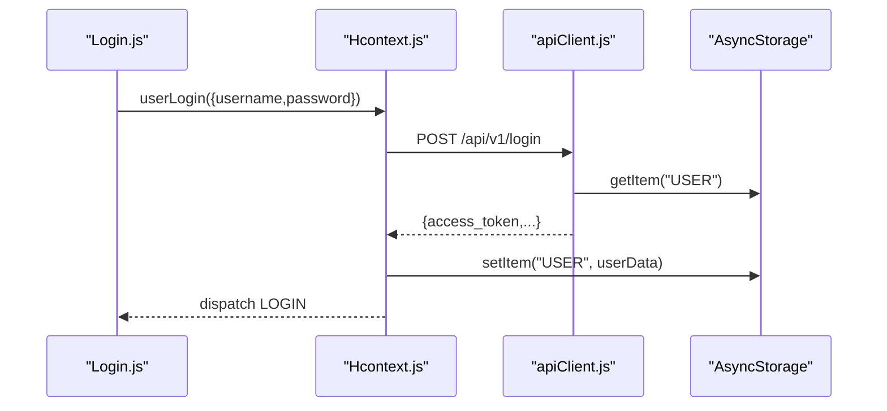
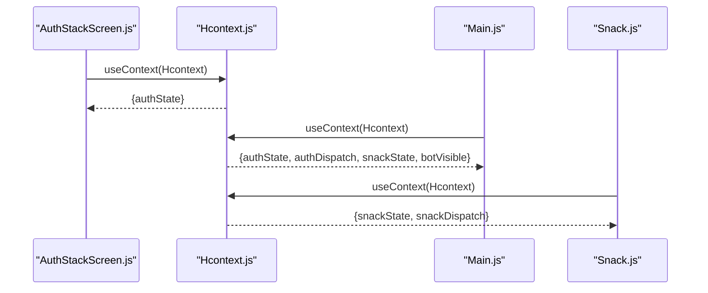
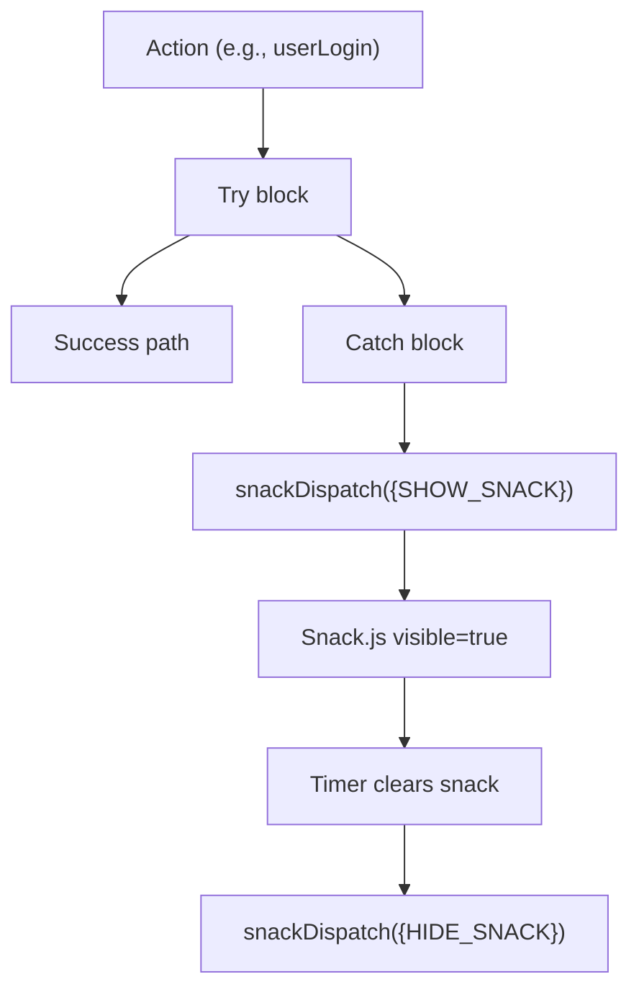
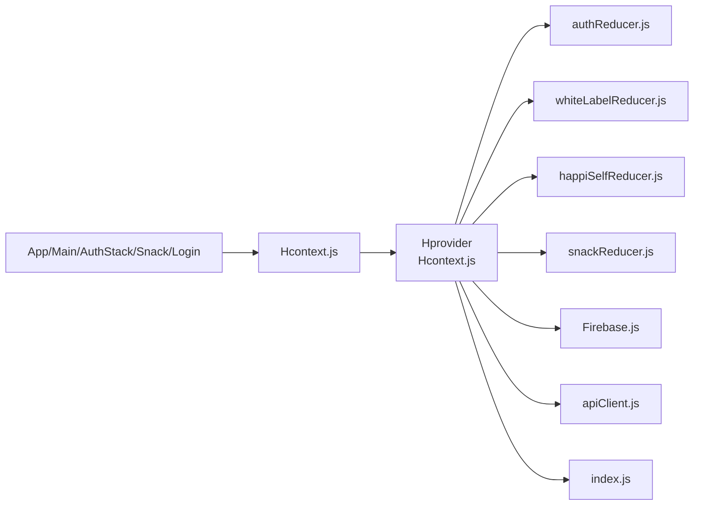

# Context Provider Setup

<cite>
**Referenced Files in This Document**
- [Hcontext.js](file://src/context/Hcontext.js)
- [authReducer.js](file://src/context/reducers/authReducer.js)
- [whiteLabelReducer.js](file://src/context/reducers/whiteLabelReducer.js)
- [happiSelfReducer.js](file://src/context/reducers/happiSelfReducer.js)
- [snackReducer.js](file://src/context/reducers/snackReducer.js)
- [Firebase.js](file://src/context/Firebase.js)
- [apiClient.js](file://src/context/apiClient.js)
- [index.js](file://src/config/index.js)
- [App.js](file://App.js)
- [Main.js](file://src/screens/Main.js)
- [AuthStackScreen.js](file://src/routes/AuthStack/AuthStackScreen.js)
- [Snack.js](file://src/components/common/Snack.js)
- [Login.js](file://src/screens/Auth/Login.js)
</cite>

## Table of Contents
1. [Introduction](#introduction)
2. [Project Structure](#project-structure)
3. [Core Components](#core-components)
4. [Architecture Overview](#architecture-overview)
5. [Detailed Component Analysis](#detailed-component-analysis)
6. [Dependency Analysis](#dependency-analysis)
7. [Performance Considerations](#performance-considerations)
8. [Troubleshooting Guide](#troubleshooting-guide)
9. [Conclusion](#conclusion)

## Introduction
This document explains the Hcontext provider setup in HappiMynd’s state management architecture. It focuses on the Provider pattern using React.createContext(), the Hprovider component structure, initialization of multiple reducers (authState, whiteLabelState, happiSelfState, snackState), state variables for device tokens, notifications, voice analysis, and filters, and the useEffect cleanup patterns for Firebase Cloud Messaging listeners. It also documents provider configuration, context consumption patterns, AsyncStorage integration for persistent state, and error handling via snack notifications.

## Project Structure
The state management is encapsulated in a single provider that exports a context and exposes a rich set of actions and state variables to the app tree. The provider initializes reducers, sets up Firebase messaging, and wires up API clients and configuration.

**Diagram sources**
- [Hcontext.js:24-24](file://src/context/Hcontext.js#L24-L24)
- [Hcontext.js:26-1550](file://src/context/Hcontext.js#L26-L1550)
- [authReducer.js:1-79](file://src/context/reducers/authReducer.js#L1-L79)
- [whiteLabelReducer.js:1-22](file://src/context/reducers/whiteLabelReducer.js#L1-L22)
- [happiSelfReducer.js:1-45](file://src/context/reducers/happiSelfReducer.js#L1-L45)
- [snackReducer.js:1-16](file://src/context/reducers/snackReducer.js#L1-L16)
- [Firebase.js:1-52](file://src/context/Firebase.js#L1-L52)
- [apiClient.js:1-58](file://src/context/apiClient.js#L1-L58)
- [index.js:1-13](file://src/config/index.js#L1-L13)
- [App.js:17-55](file://App.js#L17-L55)
- [Main.js:13-147](file://src/screens/Main.js#L13-L147)
- [AuthStackScreen.js:39-42](file://src/routes/AuthStack/AuthStackScreen.js#L39-L42)
- [Snack.js:9-32](file://src/components/common/Snack.js#L9-L32)
- [Login.js:44-74](file://src/screens/Auth/Login.js#L44-L74)

**Section sources**
- [Hcontext.js:24-24](file://src/context/Hcontext.js#L24-L24)
- [Hcontext.js:26-1550](file://src/context/Hcontext.js#L26-L1550)
- [App.js:17-55](file://App.js#L17-L55)

## Core Components
- Hcontext: Creates the React context used by consumers.
- Hprovider: Initializes reducers, state variables, Firebase messaging, and exposes actions/state to children.
- Reducers: authReducer, whiteLabelReducer, happiSelfReducer, snackReducer manage domain-specific state.
- Firebase: Initializes Firebase app and Firestore with long-polling fallback for RN.
- apiClient: Axios instance with request/response interceptors and AsyncStorage-backed token retrieval.
- Config: Centralized environment variables.

Key initialization highlights:
- Reducers are initialized with initial state and dispatchers are exposed.
- Device token and notification state are declared and managed.
- Firebase messaging listeners are registered and cleaned up on unmount.
- Actions wrap API calls and dispatch snack notifications on errors.

**Section sources**
- [Hcontext.js:24-24](file://src/context/Hcontext.js#L24-L24)
- [Hcontext.js:26-1550](file://src/context/Hcontext.js#L26-L1550)
- [authReducer.js:5-79](file://src/context/reducers/authReducer.js#L5-L79)
- [whiteLabelReducer.js:1-22](file://src/context/reducers/whiteLabelReducer.js#L1-L22)
- [happiSelfReducer.js:1-45](file://src/context/reducers/happiSelfReducer.js#L1-L45)
- [snackReducer.js:1-16](file://src/context/reducers/snackReducer.js#L1-L16)
- [Firebase.js:14-52](file://src/context/Firebase.js#L14-L52)
- [apiClient.js:6-58](file://src/context/apiClient.js#L6-L58)
- [index.js:1-13](file://src/config/index.js#L1-L13)

## Architecture Overview
The Hprovider composes multiple concerns:
- State and reducers for auth, white-label branding, HappiSELF tasks/questions, and snack notifications.
- UI state for filters, voice analysis, and navigation flags.
- Firebase messaging setup and cleanup.
- API client with automatic token injection and error handling.
- AsyncStorage-backed persistence for onboarding, language, and user sessions.

**Diagram sources**
- [App.js:47-51](file://App.js#L47-L51)
- [Hcontext.js:26-102](file://src/context/Hcontext.js#L26-L102)
- [Firebase.js:33-52](file://src/context/Firebase.js#L33-L52)
- [apiClient.js:12-56](file://src/context/apiClient.js#L12-L56)

## Detailed Component Analysis

### Hcontext Provider and Context Creation
- Context creation: A single context is exported for all consumers.
- Provider composition: All reducers, state variables, and actions are bundled into the context value.
- Consumers access state and dispatchers via useContext(Hcontext).

**Diagram sources**
- [Hcontext.js:24-24](file://src/context/Hcontext.js#L24-L24)
- [Hcontext.js:26-1550](file://src/context/Hcontext.js#L26-L1550)

**Section sources**
- [Hcontext.js:24-24](file://src/context/Hcontext.js#L24-L24)
- [Hcontext.js:26-1550](file://src/context/Hcontext.js#L26-L1550)

### Reducer Initialization and Exports
- authReducer manages login state, onboarding, language selection, screening flags, and logout cleanup.
- whiteLabelReducer manages header/footer/logo branding.
- happiSelfReducer tracks current subcourse/task, questions list, and answers.
- snackReducer toggles visibility and message for snack notifications.

**Diagram sources**
- [authReducer.js:5-79](file://src/context/reducers/authReducer.js#L5-L79)
- [whiteLabelReducer.js:1-22](file://src/context/reducers/whiteLabelReducer.js#L1-L22)
- [happiSelfReducer.js:1-45](file://src/context/reducers/happiSelfReducer.js#L1-L45)
- [snackReducer.js:1-16](file://src/context/reducers/snackReducer.js#L1-L16)

**Section sources**
- [authReducer.js:5-79](file://src/context/reducers/authReducer.js#L5-L79)
- [whiteLabelReducer.js:1-22](file://src/context/reducers/whiteLabelReducer.js#L1-L22)
- [happiSelfReducer.js:1-45](file://src/context/reducers/happiSelfReducer.js#L1-L45)
- [snackReducer.js:1-16](file://src/context/reducers/snackReducer.js#L1-L16)

### Firebase Messaging Setup and Cleanup
- Permission and token retrieval are handled in a dedicated handler invoked during mount.
- Listeners for foreground messages and app open notifications are stored in refs and unsubscribed on unmount.
- Initial notification data is processed when the app starts.

**Diagram sources**
- [Hcontext.js:70-102](file://src/context/Hcontext.js#L70-L102)
- [Hcontext.js:104-127](file://src/context/Hcontext.js#L104-L127)
- [Hcontext.js:1409-1549](file://src/context/Hcontext.js#L1409-L1549)

**Section sources**
- [Hcontext.js:70-102](file://src/context/Hcontext.js#L70-L102)
- [Hcontext.js:104-127](file://src/context/Hcontext.js#L104-L127)
- [Hcontext.js:1409-1549](file://src/context/Hcontext.js#L1409-L1549)

### API Client and AsyncStorage Integration
- The axios instance attaches Authorization headers using a token resolved from either a global cache or AsyncStorage.
- On successful login, user data is persisted to AsyncStorage and auth state is dispatched.
- Response interceptor centralizes error handling and logging.

**Diagram sources**
- [Login.js:44-74](file://src/screens/Auth/Login.js#L44-L74)
- [Hcontext.js:129-145](file://src/context/Hcontext.js#L129-L145)
- [apiClient.js:12-56](file://src/context/apiClient.js#L12-L56)

**Section sources**
- [apiClient.js:6-58](file://src/context/apiClient.js#L6-L58)
- [Login.js:44-74](file://src/screens/Auth/Login.js#L44-L74)
- [Main.js:43-61](file://src/screens/Main.js#L43-L61)

### Context Consumption Patterns
- Auth stack reads authState to decide navigation routes.
- Snack component consumes snackState and dispatch to show/hide notifications.
- Main screen uses multiple context values for routing and UI behavior.

**Diagram sources**
- [AuthStackScreen.js:39-42](file://src/routes/AuthStack/AuthStackScreen.js#L39-L42)
- [Main.js:15-18](file://src/screens/Main.js#L15-L18)
- [Snack.js:9-11](file://src/components/common/Snack.js#L9-L11)

**Section sources**
- [AuthStackScreen.js:39-42](file://src/routes/AuthStack/AuthStackScreen.js#L39-L42)
- [Main.js:15-18](file://src/screens/Main.js#L15-L18)
- [Snack.js:9-11](file://src/components/common/Snack.js#L9-L11)

### State Variables and Filters
The provider declares state variables for:
- Device tokens and Expo push tokens
- Notifications and selected mood
- Signed audio URLs and Sonde integration fields
- Voice reports and UI flags (bot visibility, navigation targets)
- Filter configuration (category, contentType, parameters, profile, language, searchTerm)

These are exposed via the context value alongside their setters for consumer updates.

**Section sources**
- [Hcontext.js:42-64](file://src/context/Hcontext.js#L42-L64)
- [Hcontext.js:1509-1545](file://src/context/Hcontext.js#L1509-L1545)

### Error Boundary Handling via Snack
- Actions dispatch snack notifications on failures with user-friendly messages.
- The Snack component listens to snackState and auto-hides after a timer.

**Diagram sources**
- [Hcontext.js:139-143](file://src/context/Hcontext.js#L139-L143)
- [snackReducer.js:8-11](file://src/context/reducers/snackReducer.js#L8-L11)
- [Snack.js:14-21](file://src/components/common/Snack.js#L14-L21)

**Section sources**
- [Hcontext.js:139-143](file://src/context/Hcontext.js#L139-L143)
- [snackReducer.js:8-11](file://src/context/reducers/snackReducer.js#L8-L11)
- [Snack.js:14-21](file://src/components/common/Snack.js#L14-L21)

## Dependency Analysis
- Hprovider depends on reducers, Firebase, apiClient, and config.
- Consumers depend on Hcontext for state and actions.
- AsyncStorage bridges persistence and runtime state.

**Diagram sources**
- [Hcontext.js:26-1550](file://src/context/Hcontext.js#L26-L1550)
- [authReducer.js:1-79](file://src/context/reducers/authReducer.js#L1-L79)
- [whiteLabelReducer.js:1-22](file://src/context/reducers/whiteLabelReducer.js#L1-L22)
- [happiSelfReducer.js:1-45](file://src/context/reducers/happiSelfReducer.js#L1-L45)
- [snackReducer.js:1-16](file://src/context/reducers/snackReducer.js#L1-L16)
- [Firebase.js:1-52](file://src/context/Firebase.js#L1-L52)
- [apiClient.js:1-58](file://src/context/apiClient.js#L1-L58)
- [index.js:1-13](file://src/config/index.js#L1-L13)
- [App.js:17-55](file://App.js#L17-L55)
- [Main.js:13-147](file://src/screens/Main.js#L13-L147)
- [AuthStackScreen.js:39-42](file://src/routes/AuthStack/AuthStackScreen.js#L39-L42)
- [Snack.js:9-32](file://src/components/common/Snack.js#L9-L32)
- [Login.js:44-74](file://src/screens/Auth/Login.js#L44-L74)

**Section sources**
- [Hcontext.js:26-1550](file://src/context/Hcontext.js#L26-L1550)
- [App.js:17-55](file://App.js#L17-L55)
- [Main.js:13-147](file://src/screens/Main.js#L13-L147)
- [AuthStackScreen.js:39-42](file://src/routes/AuthStack/AuthStackScreen.js#L39-L42)
- [Snack.js:9-32](file://src/components/common/Snack.js#L9-L32)
- [Login.js:44-74](file://src/screens/Auth/Login.js#L44-L74)

## Performance Considerations
- Centralized token resolution avoids redundant network calls and reduces latency.
- Firebase long-polling configuration improves reliability in React Native environments.
- useReducer minimizes re-renders by batching state updates per domain.
- Snack auto-hide timers prevent UI clutter and reduce memory retention.

## Troubleshooting Guide
Common issues and resolutions:
- Notification permission denied: The provider logs the authorization status and returns without a token. Ensure users grant permissions.
- Firebase initialization errors: The provider catches initialization errors and falls back to existing instances on hot reloads.
- API token missing: The interceptor attempts to load the token from AsyncStorage if not present globally.
- Snack not hiding: Ensure the timer is cleared and HIDE_SNACK is dispatched.

**Section sources**
- [Hcontext.js:104-127](file://src/context/Hcontext.js#L104-L127)
- [Firebase.js:41-49](file://src/context/Firebase.js#L41-L49)
- [apiClient.js:12-44](file://src/context/apiClient.js#L12-L44)
- [Snack.js:14-21](file://src/components/common/Snack.js#L14-L21)

## Conclusion
The Hcontext provider establishes a robust, centralized state management layer that integrates reducers, Firebase messaging, API client, and AsyncStorage. It enables predictable state updates, consistent error handling via snack notifications, and clean resource management through useEffect cleanup. This architecture simplifies cross-component communication, improves maintainability, and supports scalable feature additions.