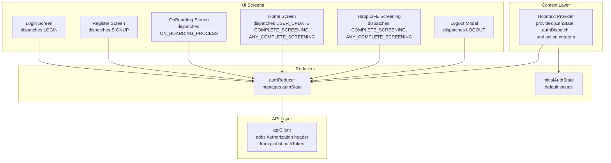
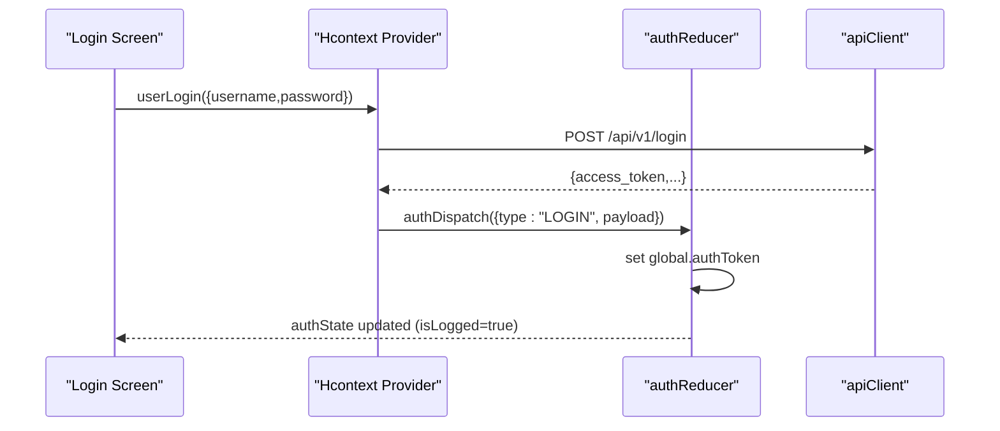
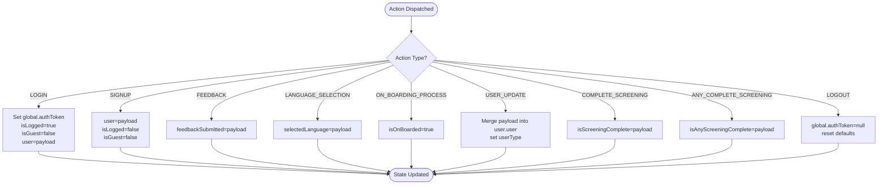
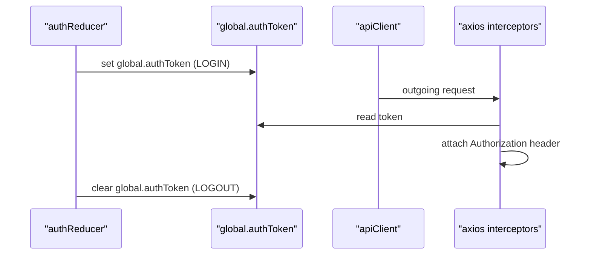
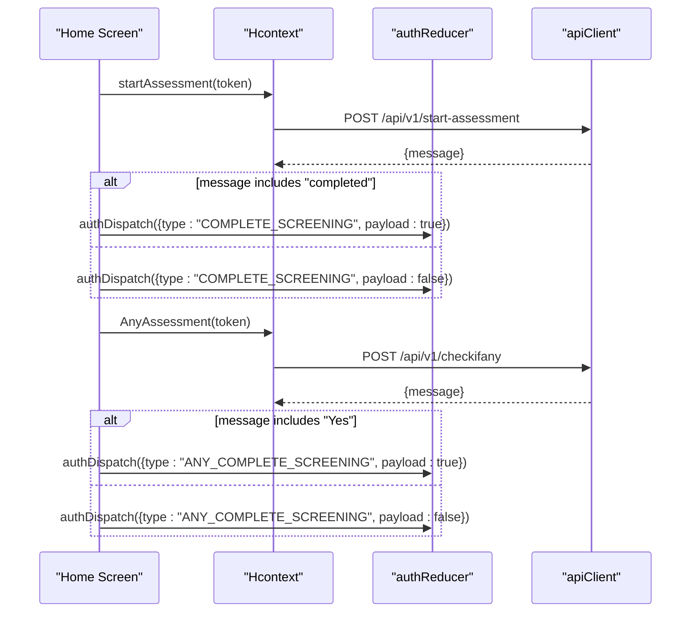
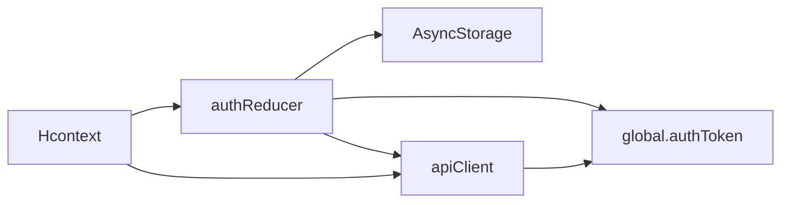

# Authentication Reducer

<cite>
**Referenced Files in This Document**
- [authReducer.js](file://src/context/reducers/authReducer.js)
- [Hcontext.js](file://src/context/Hcontext.js)
- [apiClient.js](file://src/context/apiClient.js)
- [Login.js](file://src/screens/Auth/Login.js)
- [Register.js](file://src/screens/Auth/Register.js)
- [OnBoarding.js](file://src/screens/shared/OnBoarding.js)
- [HappiLIFEScreening.js](file://src/screens/HappiLIFE/HappiLIFEScreening.js)
- [Home.js](file://src/screens/Home/Home.js)
- [LogoutModal.js](file://src/components/Modals/LogoutModal.js)
</cite>

## Table of Contents
1. [Introduction](#introduction)
2. [Project Structure](#project-structure)
3. [Core Components](#core-components)
4. [Architecture Overview](#architecture-overview)
5. [Detailed Component Analysis](#detailed-component-analysis)
6. [Dependency Analysis](#dependency-analysis)
7. [Performance Considerations](#performance-considerations)
8. [Troubleshooting Guide](#troubleshooting-guide)
9. [Conclusion](#conclusion)

## Introduction
This document provides comprehensive documentation for the authReducer implementation in HappiMynd's authentication system. It explains the initialAuthState structure, supported action types, state mutation patterns, token management via global.authToken, and integration with the API client. It also covers practical examples of action creators, state selectors, and common authentication workflows such as login, signup, onboarding, screening status updates, and logout.

## Project Structure
The authentication system is centered around a Redux-style reducer pattern using React’s useReducer hook. The Hcontext provider exposes:
- A reducer-backed authState and authDispatch
- Action creators that perform API calls and dispatch actions
- An API client that injects Authorization headers using a global token

**Diagram sources**
- [Hcontext.js:26-40](file://src/context/Hcontext.js#L26-L40)
- [authReducer.js:5-15](file://src/context/reducers/authReducer.js#L5-L15)
- [apiClient.js:11-44](file://src/context/apiClient.js#L11-L44)

**Section sources**
- [Hcontext.js:26-40](file://src/context/Hcontext.js#L26-L40)
- [authReducer.js:5-15](file://src/context/reducers/authReducer.js#L5-L15)
- [apiClient.js:11-44](file://src/context/apiClient.js#L11-L44)

## Core Components
- initialAuthState: Defines default authentication state values including isLogged, isGuest, selectedLanguage, user, isOnBoarded, feedbackSubmitted, isScreeningComplete, isAnyScreeningComplete, and userType.
- authReducer: Pure reducer handling actions to mutate authState and manage token lifecycle.

Key state fields:
- isLogged: Boolean indicating whether the user is authenticated.
- isGuest: Boolean indicating guest mode.
- selectedLanguage: Currently selected language identifier.
- user: Full user payload (including access_token).
- isOnBoarded: Boolean indicating onboarding completion.
- feedbackSubmitted: Boolean tracking feedback submission.
- isScreeningComplete: Boolean tracking HappiLIFE screening completion.
- isAnyScreeningComplete: Boolean tracking any screening completion.
- userType: String identifying user type ("individual" or "organisation").

Supported actions:
- LOGIN: Sets global.authToken from payload and marks user logged in.
- SIGNUP: Stores user payload without marking logged in.
- FEEDBACK: Updates feedbackSubmitted flag.
- LANGUAGE_SELECTION: Updates selectedLanguage.
- ON_BOARDING_PROCESS: Marks onboarding complete.
- USER_UPDATE: Partially updates user nested data and sets userType.
- COMPLETE_SCREENING: Updates isScreeningComplete.
- ANY_COMPLETE_SCREENING: Updates isAnyScreeningComplete.
- LOGOUT: Clears global.authToken and resets authState to defaults.

**Section sources**
- [authReducer.js:5-15](file://src/context/reducers/authReducer.js#L5-L15)
- [authReducer.js:17-78](file://src/context/reducers/authReducer.js#L17-L78)

## Architecture Overview
The authentication flow integrates UI screens, the Hcontext provider, the authReducer, and the apiClient. The apiClient reads global.authToken to attach Authorization headers to outgoing requests.

**Diagram sources**
- [Login.js:45-74](file://src/screens/Auth/Login.js#L45-L74)
- [Hcontext.js:129-145](file://src/context/Hcontext.js#L129-L145)
- [authReducer.js:19-30](file://src/context/reducers/authReducer.js#L19-L30)
- [apiClient.js:11-44](file://src/context/apiClient.js#L11-L44)

## Detailed Component Analysis

### Initial Authentication State
The initialAuthState defines baseline values for authentication state. These defaults ensure predictable UI behavior before any actions are dispatched.

- isLogged: false
- isGuest: true
- selectedLanguage: null
- user: null
- isOnBoarded: false
- feedbackSubmitted: false
- isScreeningComplete: false
- isAnyScreeningComplete: false
- userType: ""

These fields are mutated by reducer actions to reflect current authentication and user status.

**Section sources**
- [authReducer.js:5-15](file://src/context/reducers/authReducer.js#L5-L15)

### Reducer Actions and Mutations
- LOGIN
  - Purpose: Authenticate user and inject token.
  - Behavior: Sets global.authToken from payload.access_token, marks isLogged true, isGuest false, and stores full user payload.
  - Side effect: Enables apiClient Authorization header for subsequent requests.

- SIGNUP
  - Purpose: Register new user.
  - Behavior: Stores user payload without marking logged in; isGuest remains false.

- FEEDBACK
  - Purpose: Track feedback submission.
  - Behavior: Sets feedbackSubmitted to provided boolean.

- LANGUAGE_SELECTION
  - Purpose: Persist language preference.
  - Behavior: Sets selectedLanguage to provided value.

- ON_BOARDING_PROCESS
  - Purpose: Mark onboarding as complete.
  - Behavior: Sets isOnBoarded to true.

- USER_UPDATE
  - Purpose: Update user profile data and type.
  - Behavior: Merges partial user payload into nested user.user structure and sets userType.

- COMPLETE_SCREENING
  - Purpose: Track HappiLIFE screening completion.
  - Behavior: Sets isScreeningComplete to provided boolean.

- ANY_COMPLETE_SCREENING
  - Purpose: Track any screening completion.
  - Behavior: Sets isAnyScreeningComplete to provided boolean.

- LOGOUT
  - Purpose: Terminate session.
  - Behavior: Clears global.authToken, resets isLogged false, isGuest true, user null, feedbackSubmitted false.

**Diagram sources**
- [authReducer.js:17-78](file://src/context/reducers/authReducer.js#L17-L78)

**Section sources**
- [authReducer.js:17-78](file://src/context/reducers/authReducer.js#L17-L78)

### Token Management and API Client Integration
The apiClient attaches Authorization headers using the global.authToken. The authReducer writes to global.authToken during LOGIN and clears it during LOGOUT.

- Request Interceptor:
  - Attempts to read token from global.authToken.
  - Falls back to AsyncStorage USER string if missing.
  - Attaches Authorization: Bearer token to outgoing requests.

- Reducer Effects:
  - LOGIN: Sets global.authToken from payload.access_token.
  - LOGOUT: Clears global.authToken.

**Diagram sources**
- [authReducer.js:19-30](file://src/context/reducers/authReducer.js#L19-L30)
- [authReducer.js:65-74](file://src/context/reducers/authReducer.js#L65-L74)
- [apiClient.js:11-44](file://src/context/apiClient.js#L11-L44)

**Section sources**
- [apiClient.js:11-44](file://src/context/apiClient.js#L11-L44)
- [authReducer.js:19-30](file://src/context/reducers/authReducer.js#L19-L30)
- [authReducer.js:65-74](file://src/context/reducers/authReducer.js#L65-L74)

### Action Creators and Dispatch Patterns
- Login Screen
  - Calls userLogin action creator to authenticate.
  - Persists user payload to AsyncStorage.
  - Dispatches LOGIN with returned payload.

- Register Screen
  - Calls userSignup action creator to register.
  - Persists user payload to AsyncStorage.
  - Dispatches SIGNUP with returned payload.

- OnBoarding Screen
  - Dispatches ON_BOARDING_PROCESS after completion.

- Home Screen
  - Dispatches USER_UPDATE with user_token when present.
  - Dispatches COMPLETE_SCREENING and ANY_COMPLETE_SCREENING based on API checks.

- HappiLIFE Screening Screen
  - Dispatches COMPLETE_SCREENING and ANY_COMPLETE_SCREENING after assessment checks.

- Logout Modal
  - Calls userLogout action creator.
  - Removes AsyncStorage keys.
  - Dispatches LOGOUT.

**Diagram sources**
- [Home.js:108-134](file://src/screens/Home/Home.js#L108-L134)
- [Hcontext.js:382-414](file://src/context/Hcontext.js#L382-L414)
- [authReducer.js:55-64](file://src/context/reducers/authReducer.js#L55-L64)

**Section sources**
- [Login.js:45-74](file://src/screens/Auth/Login.js#L45-L74)
- [Register.js:87-184](file://src/screens/Auth/Register.js#L87-L184)
- [OnBoarding.js:101-113](file://src/screens/shared/OnBoarding.js#L101-L113)
- [Home.js:108-167](file://src/screens/Home/Home.js#L108-L167)
- [HappiLIFEScreening.js:102-151](file://src/screens/HappiLIFE/HappiLIFEScreening.js#L102-L151)
- [LogoutModal.js:35-52](file://src/components/Modals/LogoutModal.js#L35-L52)

### State Selectors and Usage Patterns
Common selectors derived from authState:
- isAuthenticated: authState.isLogged
- isGuestMode: authState.isGuest
- selectedLanguage: authState.selectedLanguage
- currentUser: authState.user
- onboarded: authState.isOnBoarded
- feedbackSubmitted: authState.feedbackSubmitted
- screeningComplete: authState.isScreeningComplete
- anyScreeningComplete: authState.isAnyScreeningComplete
- userType: authState.userType

Usage examples:
- Navigation guards: Redirect unauthenticated users to welcome/onboarding.
- Feature gating: Enable/disable features based on screeningComplete or anyScreeningComplete.
- UI rendering: Display user-specific content using currentUser and userType.

[No sources needed since this section provides general guidance]

## Dependency Analysis
The authReducer depends on:
- Hcontext provider for exposing authState and authDispatch.
- apiClient for Authorization header injection.
- AsyncStorage for persisting user data during login/signup.

**Diagram sources**
- [authReducer.js:19-30](file://src/context/reducers/authReducer.js#L19-L30)
- [authReducer.js:65-74](file://src/context/reducers/authReducer.js#L65-L74)
- [apiClient.js:11-44](file://src/context/apiClient.js#L11-L44)
- [Hcontext.js:26-40](file://src/context/Hcontext.js#L26-L40)

**Section sources**
- [authReducer.js:17-78](file://src/context/reducers/authReducer.js#L17-L78)
- [apiClient.js:11-44](file://src/context/apiClient.js#L11-L44)
- [Hcontext.js:26-40](file://src/context/Hcontext.js#L26-L40)

## Performance Considerations
- Prefer batching related state updates (e.g., USER_UPDATE with userType) to minimize re-renders.
- Avoid frequent global.authToken writes; set once per login and clear on logout.
- Cache tokens in global.authToken to prevent repeated AsyncStorage reads.
- Use shallow comparisons in components to reduce unnecessary renders.

[No sources needed since this section provides general guidance]

## Troubleshooting Guide
Common issues and resolutions:
- Missing Authorization header:
  - Ensure LOGIN action is dispatched with a payload containing access_token.
  - Confirm global.authToken is set and not cleared prematurely.

- Stale token errors:
  - Verify AsyncStorage USER string is persisted on login/signup.
  - apiClient falls back to AsyncStorage if global.authToken is missing.

- Logout not clearing state:
  - Confirm LOGOUT action is dispatched and global.authToken is cleared.
  - Ensure AsyncStorage USER is removed.

- Screening status not updating:
  - Verify Home screen checks are executed after login.
  - Confirm API responses for startAssessment and AnyAssessment are parsed correctly.

**Section sources**
- [apiClient.js:11-44](file://src/context/apiClient.js#L11-L44)
- [authReducer.js:19-30](file://src/context/reducers/authReducer.js#L19-L30)
- [authReducer.js:65-74](file://src/context/reducers/authReducer.js#L65-L74)
- [Home.js:108-134](file://src/screens/Home/Home.js#L108-L134)

## Conclusion
The authReducer provides a focused, predictable mechanism for managing authentication state in HappiMynd. By centralizing token handling in global.authToken and integrating with the apiClient, it ensures secure and consistent API access. The reducer’s actions align with common authentication workflows, enabling clean UI integrations across Login, Register, OnBoarding, Screening, and Logout flows.