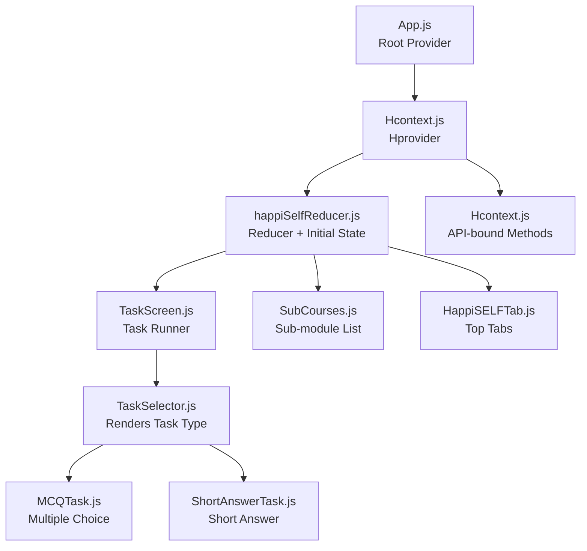
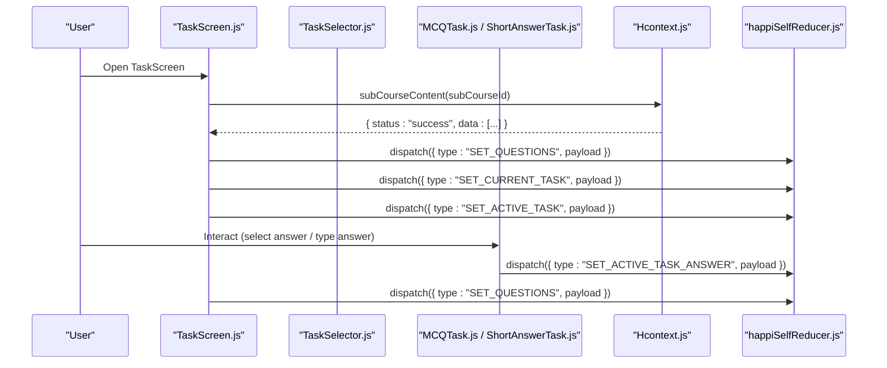
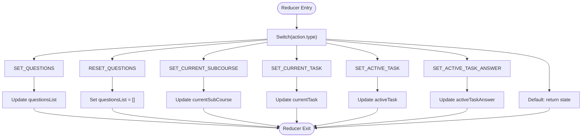
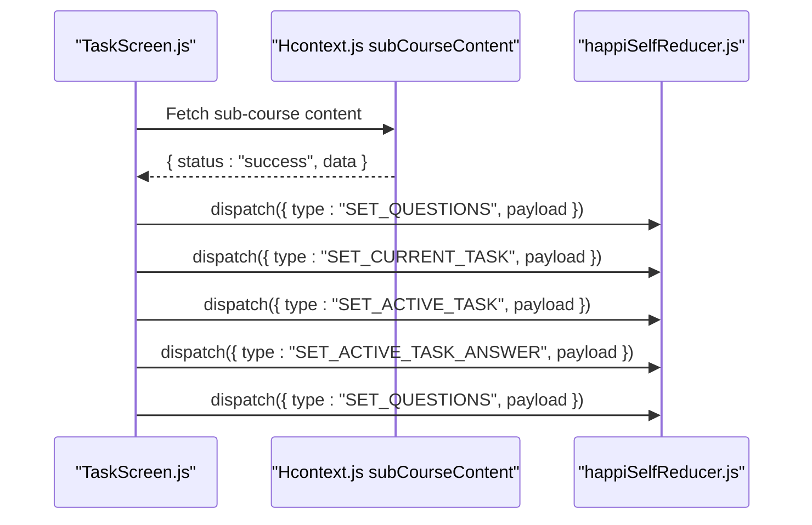
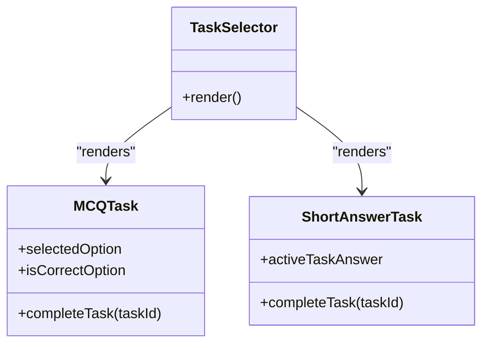
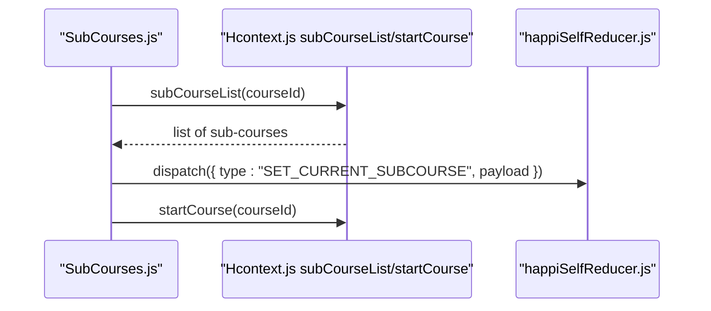
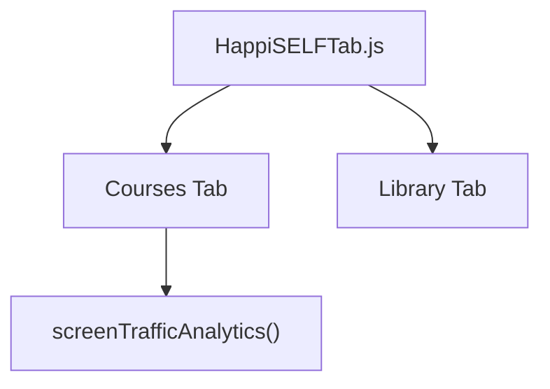
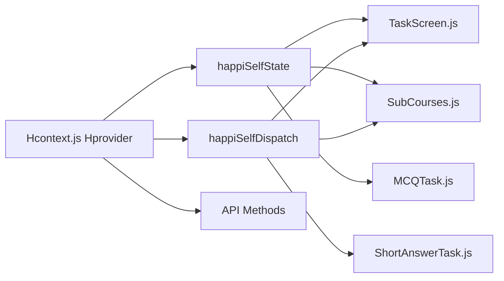

# HappiSelf Reducer

<cite>
**Referenced Files in This Document**
- [happiSelfReducer.js](file://src/context/reducers/happiSelfReducer.js)
- [Hcontext.js](file://src/context/Hcontext.js)
- [TaskScreen.js](file://src/screens/HappiSELF/TaskScreen.js)
- [SubCourses.js](file://src/screens/HappiSELF/SubCourses.js)
- [HappiSELFTab.js](file://src/screens/HappiSELF/HappiSELFTab.js)
- [TaskSelector.js](file://src/screens/HappiSELF/Tasks/TaskSelector.js)
- [MCQTask.js](file://src/screens/HappiSELF/Tasks/MCQTask.js)
- [ShortAnswerTask.js](file://src/screens/HappiSELF/Tasks/ShortAnswerTask.js)
- [HappiSELF.js](file://src/screens/HappiSELF/HappiSELF.js)
- [App.js](file://App.js)
</cite>

## Table of Contents
1. [Introduction](#introduction)
2. [Project Structure](#project-structure)
3. [Core Components](#core-components)
4. [Architecture Overview](#architecture-overview)
5. [Detailed Component Analysis](#detailed-component-analysis)
6. [Dependency Analysis](#dependency-analysis)
7. [Performance Considerations](#performance-considerations)
8. [Troubleshooting Guide](#troubleshooting-guide)
9. [Conclusion](#conclusion)

## Introduction
This document describes the HappiSelf Reducer that powers the self-help module in HappiMynd. It explains the initial state shape for tracking tasks, courses, and user interactions, enumerates the actions used to update state, and documents how the reducer integrates with HappiSELF screens and components. It also provides examples of typical workflows such as enrolling in a course, completing tasks, and progressing through sub-modules.

## Project Structure
The HappiSelf Reducer is part of a centralized context provider that exposes state and dispatch functions across the app. The HappiSELF module is organized under src/screens/HappiSELF with dedicated screens for browsing courses, viewing sub-courses, and rendering task types.

**Diagram sources**
- [App.js:47-52](file://App.js#L47-L52)
- [Hcontext.js:26-41](file://src/context/Hcontext.js#L26-L41)
- [happiSelfReducer.js:1-45](file://src/context/reducers/happiSelfReducer.js#L1-L45)
- [TaskScreen.js:27-39](file://src/screens/HappiSELF/TaskScreen.js#L27-L39)
- [SubCourses.js:33-40](file://src/screens/HappiSELF/SubCourses.js#L33-L40)
- [HappiSELFTab.js:201-214](file://src/screens/HappiSELF/HappiSELFTab.js#L201-L214)
- [TaskSelector.js:14-32](file://src/screens/HappiSELF/Tasks/TaskSelector.js#L14-L32)
- [MCQTask.js:22-35](file://src/screens/HappiSELF/Tasks/MCQTask.js#L22-L35)
- [ShortAnswerTask.js:24-29](file://src/screens/HappiSELF/Tasks/ShortAnswerTask.js#L24-L29)

**Section sources**
- [App.js:47-52](file://App.js#L47-L52)
- [Hcontext.js:26-41](file://src/context/Hcontext.js#L26-L41)

## Core Components
- Initial state for HappiSelf:
  - currentSubCourse: null
  - currentTask: null
  - questionsList: []
  - activeTask: null
  - activeTaskAnswer: ""
- Actions handled by the reducer:
  - SET_QUESTIONS
  - RESET_QUESTIONS
  - SET_CURRENT_SUBCOURSE
  - SET_CURRENT_TASK
  - SET_ACTIVE_TASK
  - SET_ACTIVE_TASK_ANSWER

These actions enable:
- Loading sub-course content into questionsList
- Tracking the active sub-course and current task
- Selecting the active task for rendering
- Capturing user answers for short-answer tasks

**Section sources**
- [happiSelfReducer.js:1-45](file://src/context/reducers/happiSelfReducer.js#L1-L45)

## Architecture Overview
The HappiSELF module relies on a single shared reducer for state management. The Hprovider composes multiple reducers and exposes them via context. Components consume the reducer’s state and dispatch actions to update HappiSELF-specific data.

**Diagram sources**
- [TaskScreen.js:92-119](file://src/screens/HappiSELF/TaskScreen.js#L92-L119)
- [TaskScreen.js:121-146](file://src/screens/HappiSELF/TaskScreen.js#L121-L146)
- [TaskSelector.js:14-32](file://src/screens/HappiSELF/Tasks/TaskSelector.js#L14-L32)
- [MCQTask.js:44-57](file://src/screens/HappiSELF/Tasks/MCQTask.js#L44-L57)
- [ShortAnswerTask.js:32-41](file://src/screens/HappiSELF/Tasks/ShortAnswerTask.js#L32-L41)
- [Hcontext.js:902-913](file://src/context/Hcontext.js#L902-L913)
- [happiSelfReducer.js:9-44](file://src/context/reducers/happiSelfReducer.js#L9-L44)

## Detailed Component Analysis

### HappiSelf Reducer
- Purpose: Centralized state for HappiSELF tasks and sub-courses.
- Initial state fields:
  - currentSubCourse: Tracks the currently selected sub-course identifier.
  - currentTask: Tracks the sub-course currently being attempted.
  - questionsList: Array of task items with an isCompleted flag.
  - activeTask: Currently rendered task object.
  - activeTaskAnswer: Current answer text for short-answer tasks.
- Action handlers:
  - SET_QUESTIONS: Replace the in-memory questions list.
  - RESET_QUESTIONS: Clear the questions list.
  - SET_CURRENT_SUBCOURSE: Set the active sub-course identifier.
  - SET_CURRENT_TASK: Mark the current sub-course id.
  - SET_ACTIVE_TASK: Set the next pending task to render.
  - SET_ACTIVE_TASK_ANSWER: Update the current answer for short-answer tasks.

**Diagram sources**
- [happiSelfReducer.js:9-44](file://src/context/reducers/happiSelfReducer.js#L9-L44)

**Section sources**
- [happiSelfReducer.js:1-45](file://src/context/reducers/happiSelfReducer.js#L1-L45)

### TaskScreen Integration
- Loads sub-course content and seeds questionsList.
- Determines the next pending task and sets activeTask.
- Updates questionsList after a task is marked complete.
- Supports short-answer tasks by capturing activeTaskAnswer.

**Diagram sources**
- [TaskScreen.js:92-119](file://src/screens/HappiSELF/TaskScreen.js#L92-L119)
- [TaskScreen.js:121-146](file://src/screens/HappiSELF/TaskScreen.js#L121-L146)
- [Hcontext.js:902-913](file://src/context/Hcontext.js#L902-L913)
- [happiSelfReducer.js:9-44](file://src/context/reducers/happiSelfReducer.js#L9-L44)

**Section sources**
- [TaskScreen.js:27-39](file://src/screens/HappiSELF/TaskScreen.js#L27-L39)
- [TaskScreen.js:48-79](file://src/screens/HappiSELF/TaskScreen.js#L48-L79)
- [TaskScreen.js:92-119](file://src/screens/HappiSELF/TaskScreen.js#L92-L119)
- [TaskScreen.js:121-146](file://src/screens/HappiSELF/TaskScreen.js#L121-L146)

### Task Type Rendering
- TaskSelector chooses the appropriate task component based on content_type.
- MCQTask updates isCorrectOption and calls completeTask when the selection matches the correct answer.
- ShortAnswerTask updates activeTaskAnswer and completes the task when an answer exists.

**Diagram sources**
- [TaskSelector.js:14-32](file://src/screens/HappiSELF/Tasks/TaskSelector.js#L14-L32)
- [MCQTask.js:22-57](file://src/screens/HappiSELF/Tasks/MCQTask.js#L22-L57)
- [ShortAnswerTask.js:24-41](file://src/screens/HappiSELF/Tasks/ShortAnswerTask.js#L24-L41)

**Section sources**
- [TaskSelector.js:14-32](file://src/screens/HappiSELF/Tasks/TaskSelector.js#L14-L32)
- [MCQTask.js:22-57](file://src/screens/HappiSELF/Tasks/MCQTask.js#L22-L57)
- [ShortAnswerTask.js:24-41](file://src/screens/HappiSELF/Tasks/ShortAnswerTask.js#L24-L41)

### Sub-Courses and Course Enrollment
- SubCourses loads sub-courses for a given course id and sets currentSubCourse.
- startCourse initiates a sub-course enrollment via the API.

**Diagram sources**
- [SubCourses.js:58-70](file://src/screens/HappiSELF/SubCourses.js#L58-L70)
- [SubCourses.js:72-87](file://src/screens/HappiSELF/SubCourses.js#L72-L87)
- [Hcontext.js:889-900](file://src/context/Hcontext.js#L889-L900)
- [Hcontext.js:939-950](file://src/context/Hcontext.js#L939-L950)
- [happiSelfReducer.js:21-25](file://src/context/reducers/happiSelfReducer.js#L21-L25)

**Section sources**
- [SubCourses.js:33-40](file://src/screens/HappiSELF/SubCourses.js#L33-L40)
- [SubCourses.js:58-70](file://src/screens/HappiSELF/SubCourses.js#L58-L70)
- [SubCourses.js:72-87](file://src/screens/HappiSELF/SubCourses.js#L72-L87)

### Top-Level HappiSELF Tabs
- HappiSELFTab displays Modules and Library tabs and triggers analytics on the course screen.

**Diagram sources**
- [HappiSELFTab.js:29-47](file://src/screens/HappiSELF/HappiSELFTab.js#L29-L47)
- [HappiSELF.js:108-129](file://src/screens/HappiSELF/HappiSELF.js#L108-L129)

**Section sources**
- [HappiSELFTab.js:201-214](file://src/screens/HappiSELF/HappiSELFTab.js#L201-L214)
- [HappiSELF.js:25-57](file://src/screens/HappiSELF/HappiSELF.js#L25-L57)

## Dependency Analysis
- Provider composition:
  - Hprovider initializes the HappiSelf reducer alongside others.
  - Exposes happiSelfState and happiSelfDispatch to consumers.
- Consumer usage:
  - TaskScreen reads questionsList and activeTask, writes back updates.
  - Task components read/write activeTaskAnswer via dispatch.
  - SubCourses sets currentSubCourse and triggers startCourse.

**Diagram sources**
- [Hcontext.js:26-41](file://src/context/Hcontext.js#L26-L41)
- [TaskScreen.js:33-39](file://src/screens/HappiSELF/TaskScreen.js#L33-L39)
- [SubCourses.js:39-40](file://src/screens/HappiSELF/SubCourses.js#L39-L40)
- [MCQTask.js:35](file://src/screens/HappiSELF/Tasks/MCQTask.js#L35)
- [ShortAnswerTask.js:29](file://src/screens/HappiSELF/Tasks/ShortAnswerTask.js#L29)

**Section sources**
- [Hcontext.js:1408-1551](file://src/context/Hcontext.js#L1408-L1551)

## Performance Considerations
- Prefer replacing the entire questionsList array when updating completed tasks to keep renders predictable.
- Avoid frequent re-renders by batching related dispatches (e.g., SET_QUESTIONS followed by SET_ACTIVE_TASK_ANSWER).
- Keep activeTaskAnswer minimal and only update when the user interacts with short-answer tasks.

## Troubleshooting Guide
- Symptoms: Tasks do not advance after answering.
  - Verify that SET_ACTIVE_TASK is dispatched after loading questionsList.
  - Confirm that SET_QUESTIONS replaces the list with updated isCompleted flags.
- Symptoms: Short-answer tasks do not auto-complete.
  - Ensure SET_ACTIVE_TASK_ANSWER is updated and that the parent triggers SET_QUESTIONS with the updated list.
- Symptoms: Sub-courses not loading.
  - Confirm subCourseList returns a successful response and SET_CURRENT_SUBCOURSE is dispatched.

**Section sources**
- [TaskScreen.js:63-79](file://src/screens/HappiSELF/TaskScreen.js#L63-L79)
- [TaskScreen.js:121-146](file://src/screens/HappiSELF/TaskScreen.js#L121-L146)
- [ShortAnswerTask.js:32-41](file://src/screens/HappiSELF/Tasks/ShortAnswerTask.js#L32-L41)

## Conclusion
The HappiSelf Reducer provides a focused, predictable state model for the HappiSELF module. By centralizing task and sub-course state and exposing clear actions, it enables consistent behavior across screens and task types. Integrating with the Hprovider ensures that components can reliably read and update state, supporting robust workflows such as course enrollment, task completion, and progress tracking.