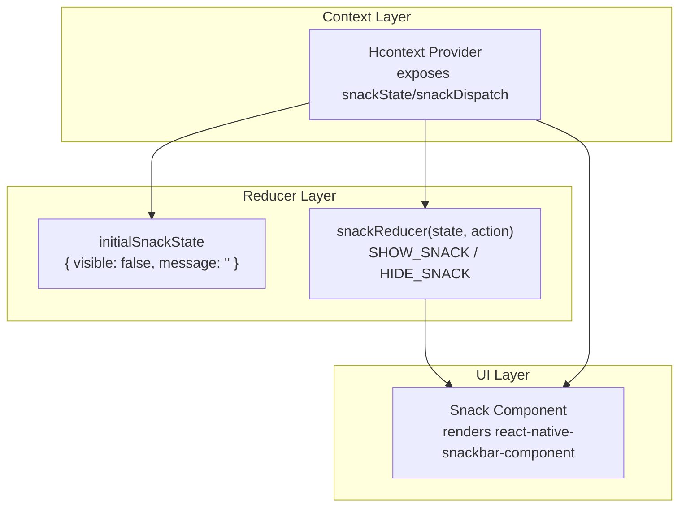
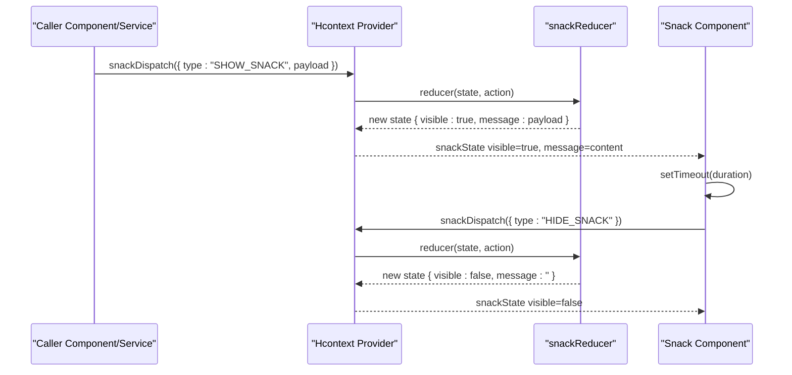
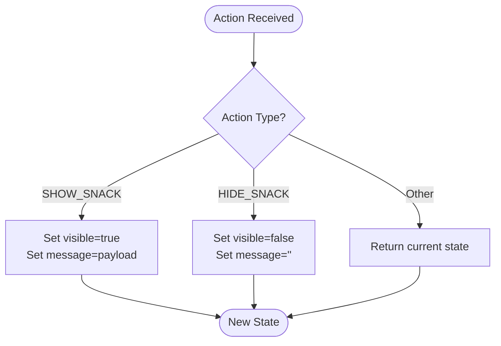
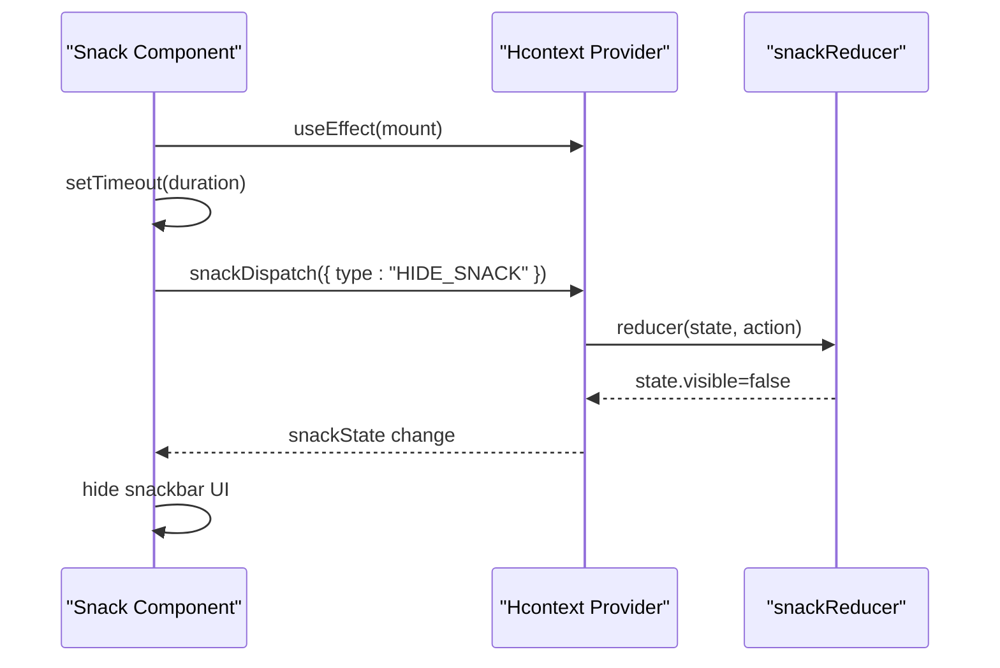
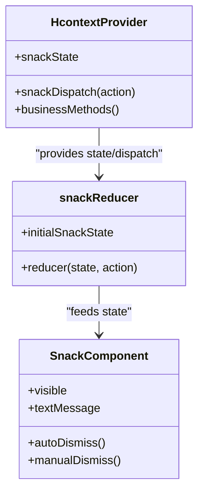
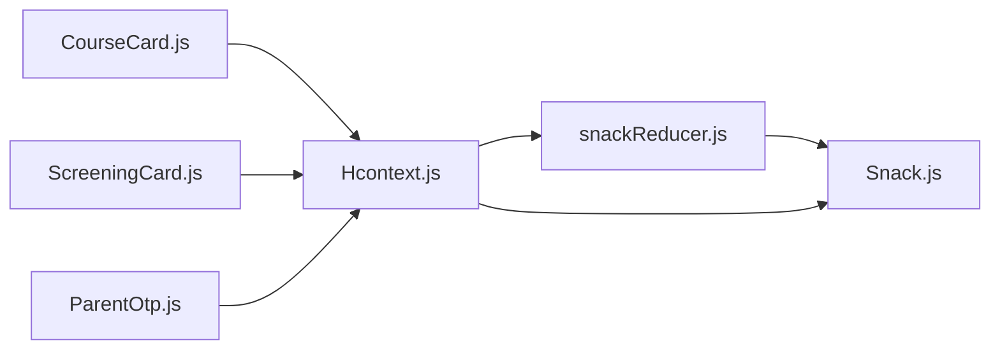

# Notification Reducer

<cite>
**Referenced Files in This Document**
- [snackReducer.js](file://src/context/reducers/snackReducer.js)
- [Snack.js](file://src/components/common/Snack.js)
- [Hcontext.js](file://src/context/Hcontext.js)
- [CourseCard.js](file://src/components/cards/CourseCard.js)
- [ScreeningCard.js](file://src/components/cards/ScreeningCard.js)
- [ParentOtp.js](file://src/components/common/ParentOtp.js)
- [Notification.js](file://src/screens/Individual/Notification.js)
</cite>

## Table of Contents
1. [Introduction](#introduction)
2. [Project Structure](#project-structure)
3. [Core Components](#core-components)
4. [Architecture Overview](#architecture-overview)
5. [Detailed Component Analysis](#detailed-component-analysis)
6. [Dependency Analysis](#dependency-analysis)
7. [Performance Considerations](#performance-considerations)
8. [Troubleshooting Guide](#troubleshooting-guide)
9. [Conclusion](#conclusion)

## Introduction
This document explains the notification and snack bar subsystem centered on the snackReducer. It covers the initial state, supported actions, and the integration with the Snack component and the broader Hcontext provider. It also documents how the system coordinates with the rest of the application to surface user-facing messages, including auto-dismiss behavior and common usage patterns.

## Project Structure
The snack notification system spans three primary areas:
- Reducer and initial state definition
- UI component that renders the snack bar and manages auto-dismiss
- Provider that exposes the reducer’s dispatch to the app

**Diagram sources**
- [Hcontext.js:36-40](file://src/context/Hcontext.js#L36-L40)
- [snackReducer.js:1-16](file://src/context/reducers/snackReducer.js#L1-L16)
- [Snack.js:9-32](file://src/components/common/Snack.js#L9-L32)

**Section sources**
- [Hcontext.js:36-40](file://src/context/Hcontext.js#L36-L40)
- [snackReducer.js:1-16](file://src/context/reducers/snackReducer.js#L1-L16)
- [Snack.js:9-32](file://src/components/common/Snack.js#L9-L32)

## Core Components
- Initial state: A minimal object controlling visibility and message content.
- Actions:
  - SHOW_SNACK: sets visible to true and updates the message payload.
  - HIDE_SNACK: hides the snackbar and clears the message.
- Snack component: Renders a native snackbar, auto-dismisses after a fixed duration, and supports manual dismissal.

Key characteristics:
- Single-purpose reducer with two actions.
- Auto-dismiss timer in the Snack component.
- Manual dismissal via the snackbar’s action handler.
- Dispatch calls originate from business logic in Hcontext and UI components.

**Section sources**
- [snackReducer.js:1-16](file://src/context/reducers/snackReducer.js#L1-L16)
- [Snack.js:9-32](file://src/components/common/Snack.js#L9-L32)

## Architecture Overview
The snack system is part of the global Hcontext provider. Components and service methods dispatch actions to update the snack state, which the Snack component consumes to render a native snackbar. The Snack component also schedules an automatic dismissal after a fixed duration.

**Diagram sources**
- [Hcontext.js:36-40](file://src/context/Hcontext.js#L36-L40)
- [snackReducer.js:6-15](file://src/context/reducers/snackReducer.js#L6-L15)
- [Snack.js:9-32](file://src/components/common/Snack.js#L9-L32)

## Detailed Component Analysis

### snackReducer
- Purpose: Manage visibility and message content for the snack bar.
- Initial state: Two fields—visible and message.
- Actions:
  - SHOW_SNACK: toggles visibility on and sets the message payload.
  - HIDE_SNACK: toggles visibility off and clears the message.
- Behavior: Pure reducer; no side effects.

**Diagram sources**
- [snackReducer.js:6-15](file://src/context/reducers/snackReducer.js#L6-L15)

**Section sources**
- [snackReducer.js:1-16](file://src/context/reducers/snackReducer.js#L1-L16)

### Snack Component
- Purpose: Render a native snackbar and manage its lifecycle.
- Rendering: Uses a third-party snackbar component and binds to snackState.
- Auto-dismiss: Schedules a timeout on mount; clears the snack on expiration.
- Manual dismiss: Exposes an action handler to call HIDE_SNACK.
- Duration: Controlled by a prop passed to the component.

**Diagram sources**
- [Snack.js:9-32](file://src/components/common/Snack.js#L9-L32)
- [snackReducer.js:6-15](file://src/context/reducers/snackReducer.js#L6-L15)

**Section sources**
- [Snack.js:9-32](file://src/components/common/Snack.js#L9-L32)

### Hcontext Provider Integration
- Exposes snackState and snackDispatch via the provider value.
- Multiple service methods dispatch SHOW_SNACK with contextual messages during error or success flows.
- Ensures consistent snack behavior across the app by centralizing state and dispatch.

**Diagram sources**
- [Hcontext.js:36-40](file://src/context/Hcontext.js#L36-L40)
- [snackReducer.js:1-16](file://src/context/reducers/snackReducer.js#L1-L16)
- [Snack.js:9-32](file://src/components/common/Snack.js#L9-L32)

**Section sources**
- [Hcontext.js:36-40](file://src/context/Hcontext.js#L36-L40)

### Usage Patterns Across the Application
Common patterns observed in the codebase:
- Error handling: Dispatching SHOW_SNACK with an error message payload.
- Success or informational events: Dispatching SHOW_SNACK with a success or completion message.
- Conditional locking: Dispatching a message when a feature is locked or unavailable.
- Completion events: Dispatching a completion message and navigating to a new screen.

Examples of usage sites:
- Login/signup/signout flows dispatch snack messages on errors.
- OTP and verification flows dispatch snack messages for user feedback.
- Course and screening interactions dispatch snack messages for locked items and completion events.

These patterns demonstrate consistent, centralized snack messaging that improves user experience by surfacing actionable feedback immediately.

**Section sources**
- [Hcontext.js:139-142](file://src/context/Hcontext.js#L139-L142)
- [Hcontext.js:156-159](file://src/context/Hcontext.js#L156-L159)
- [Hcontext.js:223-225](file://src/context/Hcontext.js#L223-L225)
- [Hcontext.js:258-261](file://src/context/Hcontext.js#L258-L261)
- [Hcontext.js:317-320](file://src/context/Hcontext.js#L317-L320)
- [Hcontext.js:335-338](file://src/context/Hcontext.js#L335-L338)
- [Hcontext.js:353-356](file://src/context/Hcontext.js#L353-L356)
- [Hcontext.js:395-398](file://src/context/Hcontext.js#L395-L398)
- [Hcontext.js:434-436](file://src/context/Hcontext.js#L434-L436)
- [Hcontext.js:446-448](file://src/context/Hcontext.js#L446-L448)
- [Hcontext.js:659-662](file://src/context/Hcontext.js#L659-L662)
- [Hcontext.js:681-695](file://src/context/Hcontext.js#L681-L695)
- [CourseCard.js:170-173](file://src/components/cards/CourseCard.js#L170-L173)
- [ScreeningCard.js:56-59](file://src/components/cards/ScreeningCard.js#L56-L59)
- [ParentOtp.js:53-54](file://src/components/common/ParentOtp.js#L53-L54)

### Notification Screen Integration
The Notification screen fetches backend notifications and displays them in a list. While distinct from the snack reducer, it participates in the overall notification architecture by providing persistent notification history alongside transient snack messages.

**Section sources**
- [Notification.js:58-85](file://src/screens/Individual/Notification.js#L58-L85)

## Dependency Analysis
- Hcontext depends on snackReducer for state and dispatch.
- Snack component depends on Hcontext for snackState and snackDispatch.
- Business logic in Hcontext dispatches actions to update snack state.
- UI components (e.g., CourseCard, ScreeningCard, ParentOtp) trigger snack messages in response to user actions or API outcomes.

**Diagram sources**
- [Hcontext.js:36-40](file://src/context/Hcontext.js#L36-L40)
- [snackReducer.js:1-16](file://src/context/reducers/snackReducer.js#L1-L16)
- [Snack.js:9-32](file://src/components/common/Snack.js#L9-L32)
- [CourseCard.js:170-173](file://src/components/cards/CourseCard.js#L170-L173)
- [ScreeningCard.js:56-59](file://src/components/cards/ScreeningCard.js#L56-L59)
- [ParentOtp.js:53-54](file://src/components/common/ParentOtp.js#L53-L54)

**Section sources**
- [Hcontext.js:36-40](file://src/context/Hcontext.js#L36-L40)
- [snackReducer.js:1-16](file://src/context/reducers/snackReducer.js#L1-L16)
- [Snack.js:9-32](file://src/components/common/Snack.js#L9-L32)
- [CourseCard.js:170-173](file://src/components/cards/CourseCard.js#L170-L173)
- [ScreeningCard.js:56-59](file://src/components/cards/ScreeningCard.js#L56-L59)
- [ParentOtp.js:53-54](file://src/components/common/ParentOtp.js#L53-L54)

## Performance Considerations
- The snack reducer is lightweight and stateless beyond visibility and message content, minimizing overhead.
- Auto-dismiss relies on a single timeout per snack instance; keep durations reasonable to avoid frequent re-renders.
- Avoid flooding the snack with rapid successive messages; coalesce or debounce messages in hot paths to prevent UI thrash.

## Troubleshooting Guide
- Snack does not appear:
  - Ensure the Snack component is rendered and connected to Hcontext.
  - Verify snackDispatch is called with a valid payload and that the action type is correct.
- Snack does not auto-dismiss:
  - Confirm the component’s mount effect runs and the timeout is scheduled.
  - Check that HIDE_SNACK is dispatched after the timeout.
- Message not updating:
  - Confirm SHOW_SNACK is dispatched with a new payload.
  - Ensure the component re-renders after state changes.

**Section sources**
- [Snack.js:9-32](file://src/components/common/Snack.js#L9-L32)
- [snackReducer.js:6-15](file://src/context/reducers/snackReducer.js#L6-L15)

## Conclusion
The snackReducer provides a focused, predictable mechanism for transient user feedback. Combined with the Snack component and Hcontext integration, it delivers consistent, auto-dismissing notifications across the application. The system’s simplicity enables widespread adoption in business logic and UI components, ensuring a cohesive user experience for both error and success scenarios.