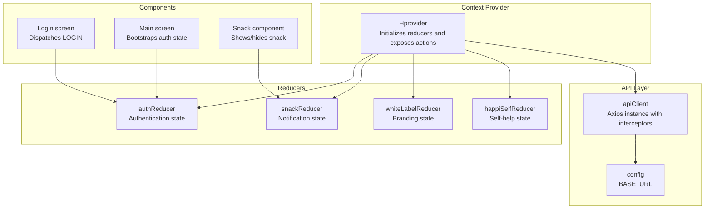
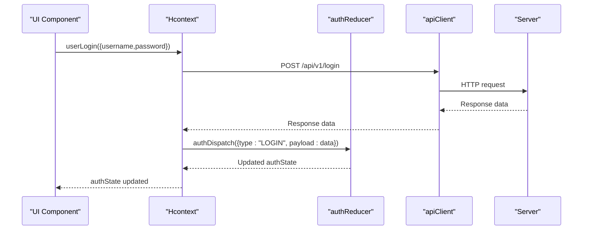
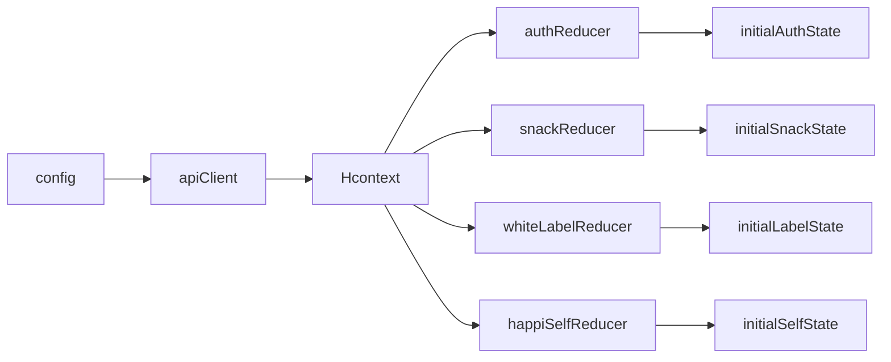

# Reducer Implementations

<cite>
**Referenced Files in This Document**
- [authReducer.js](file://src/context/reducers/authReducer.js)
- [snackReducer.js](file://src/context/reducers/snackReducer.js)
- [whiteLabelReducer.js](file://src/context/reducers/whiteLabelReducer.js)
- [happiSelfReducer.js](file://src/context/reducers/happiSelfReducer.js)
- [Hcontext.js](file://src/context/Hcontext.js)
- [apiClient.js](file://src/context/apiClient.js)
- [Login.js](file://src/screens/Auth/Login.js)
- [Snack.js](file://src/components/common/Snack.js)
- [Main.js](file://src/screens/Main.js)
- [index.js](file://src/config/index.js)
</cite>

## Table of Contents
1. [Introduction](#introduction)
2. [Project Structure](#project-structure)
3. [Core Components](#core-components)
4. [Architecture Overview](#architecture-overview)
5. [Detailed Component Analysis](#detailed-component-analysis)
6. [Dependency Analysis](#dependency-analysis)
7. [Performance Considerations](#performance-considerations)
8. [Troubleshooting Guide](#troubleshooting-guide)
9. [Conclusion](#conclusion)

## Introduction
This document provides comprehensive documentation for the reducer implementations in HappiMynd’s state management system. It covers:
- Authentication state management via authReducer (login, logout, user profile updates)
- Notification and snack bar state via snackReducer
- Brand customization and theme management via whiteLabelReducer
- Self-help module state via happiSelfReducer (task progress, course completion, activity tracking)

For each reducer, we explain initial state structure, action types, reducer functions, state update patterns, and practical usage through action dispatches and API integrations. We also describe state normalization techniques and how reducers handle asynchronous operations through API integration.

## Project Structure
Reducers are part of a centralized context provider that exposes state and action dispatchers to the entire application. The provider initializes each reducer with its initial state and exposes methods for API-driven state updates.

**Diagram sources**
- [Hcontext.js:26-40](file://src/context/Hcontext.js#L26-L40)
- [authReducer.js:5-15](file://src/context/reducers/authReducer.js#L5-L15)
- [snackReducer.js:1-4](file://src/context/reducers/snackReducer.js#L1-L4)
- [whiteLabelReducer.js:1-5](file://src/context/reducers/whiteLabelReducer.js#L1-L5)
- [happiSelfReducer.js:1-7](file://src/context/reducers/happiSelfReducer.js#L1-L7)
- [apiClient.js:6-9](file://src/context/apiClient.js#L6-L9)
- [index.js:1-13](file://src/config/index.js#L1-L13)

**Section sources**
- [Hcontext.js:26-40](file://src/context/Hcontext.js#L26-L40)
- [apiClient.js:6-9](file://src/context/apiClient.js#L6-L9)
- [index.js:1-13](file://src/config/index.js#L1-L13)

## Core Components
This section outlines the four reducers and their roles in the state management system.

- authReducer: Manages authentication lifecycle, user profile updates, onboarding, screening flags, and language selection.
- snackReducer: Controls visibility and message of snack notifications.
- whiteLabelReducer: Stores branding metadata (header/footer/logo) for white-label customization.
- happiSelfReducer: Tracks HappiSELF tasks, questions list, current subcourse, and active task/answer.

Each reducer exports:
- An initial state object
- A reducer function that handles a set of action types

**Section sources**
- [authReducer.js:5-79](file://src/context/reducers/authReducer.js#L5-L79)
- [snackReducer.js:1-16](file://src/context/reducers/snackReducer.js#L1-L16)
- [whiteLabelReducer.js:1-22](file://src/context/reducers/whiteLabelReducer.js#L1-L22)
- [happiSelfReducer.js:1-45](file://src/context/reducers/happiSelfReducer.js#L1-L45)

## Architecture Overview
The state management architecture centers around a single context provider that:
- Initializes each reducer with its initial state
- Exposes dispatchers for each reducer
- Provides API-bound methods that dispatch actions and update state accordingly

**Diagram sources**
- [Hcontext.js:129-145](file://src/context/Hcontext.js#L129-L145)
- [authReducer.js:17-30](file://src/context/reducers/authReducer.js#L17-L30)
- [apiClient.js:12-44](file://src/context/apiClient.js#L12-L44)

**Section sources**
- [Hcontext.js:129-145](file://src/context/Hcontext.js#L129-L145)
- [authReducer.js:17-30](file://src/context/reducers/authReducer.js#L17-L30)
- [apiClient.js:12-44](file://src/context/apiClient.js#L12-L44)

## Detailed Component Analysis

### Authentication Reducer (authReducer)
Initial state structure:
- isLogged: Boolean indicating logged-in status
- isGuest: Boolean indicating guest mode
- selectedLanguage: Selected language identifier
- user: Current user object (nullable)
- isOnBoarded: Boolean indicating onboarding completion
- feedbackSubmitted: Boolean indicating feedback submission
- isScreeningComplete: Boolean indicating screening completion
- isAnyScreeningComplete: Boolean indicating any screening completion
- userType: String representing user type

Key action types and behaviors:
- LOGIN: Sets isLogged=true, isGuest=false, and stores user payload. Also sets a global auth token if present.
- SIGNUP: Prepares state for new user without marking as logged in.
- FEEDBACK: Updates feedbackSubmitted flag.
- LANGUAGE_SELECTION: Stores selected language.
- ON_BOARDING_PROCESS: Marks onboarding as completed.
- USER_UPDATE: Partially updates user profile fields and sets userType.
- COMPLETE_SCREENING: Updates screening completion flag.
- ANY_COMPLETE_SCREENING: Updates any screening completion flag.
- LOGOUT: Clears global auth token and resets auth-related flags and user data.

State update pattern:
- Pure reducer using switch(action.type) with immutable spread updates.

Asynchronous integration:
- API methods (e.g., userLogin, userLogout) perform HTTP calls and dispatch actions upon success or failure.

Common usage patterns:
- Dispatch LOGIN after successful authentication to update UI and persist token.
- Dispatch LOGOUT to clear session and reset state.
- Dispatch USER_UPDATE to reflect profile changes.

Examples of usage:
- Login screen dispatches LOGIN after receiving user data from API.
- Main screen dispatches LOGIN during app bootstrap using persisted user data.

**Section sources**
- [authReducer.js:5-79](file://src/context/reducers/authReducer.js#L5-L79)
- [Login.js:45-74](file://src/screens/Auth/Login.js#L45-L74)
- [Main.js:43-61](file://src/screens/Main.js#L43-L61)
- [Hcontext.js:129-172](file://src/context/Hcontext.js#L129-L172)

### Snack Reducer (snackReducer)
Initial state structure:
- visible: Boolean controlling snack visibility
- message: String containing snack message text

Key action types and behaviors:
- SHOW_SNACK: Sets visible=true and assigns message payload.
- HIDE_SNACK: Resets visible=false and clears message.

State update pattern:
- Immutable spread updates for visibility and message.

Integration with UI:
- Snack component reads snackState and auto-hides after a timer by dispatching HIDE_SNACK.

Common usage patterns:
- Dispatch SHOW_SNACK with error messages from API failures.
- Dispatch HIDE_SNACK to dismiss snack programmatically.

Examples of usage:
- API error handlers dispatch SHOW_SNACK with error messages.
- Snack component auto-dismisses after duration.

**Section sources**
- [snackReducer.js:1-16](file://src/context/reducers/snackReducer.js#L1-L16)
- [Snack.js:9-32](file://src/components/common/Snack.js#L9-L32)
- [Hcontext.js:139-142](file://src/context/Hcontext.js#L139-L142)
- [Hcontext.js:258-262](file://src/context/Hcontext.js#L258-L262)
- [Hcontext.js:317-321](file://src/context/Hcontext.js#L317-L321)
- [Hcontext.js:335-339](file://src/context/Hcontext.js#L335-L339)
- [Hcontext.js:353-357](file://src/context/Hcontext.js#L353-L357)
- [Hcontext.js:659-663](file://src/context/Hcontext.js#L659-L663)
- [Hcontext.js:681-696](file://src/context/Hcontext.js#L681-L696)

### White Label Reducer (whiteLabelReducer)
Initial state structure:
- header: Numeric header configuration
- footer: Numeric footer configuration
- logo: String representing logo URL or identifier

Key action types and behaviors:
- SET_WHITE_LABEL: Updates header, footer, and logo from payload.
- RESET_WHITE_LABEL: Returns current state (no-op).

State update pattern:
- Immutable spread updates for branding fields.

Integration with API:
- getWhiteLabel fetches white-label configuration and can be wired to dispatch SET_WHITE_LABEL.

Common usage patterns:
- After fetching branding metadata, dispatch SET_WHITE_LABEL to update UI consistently.

**Section sources**
- [whiteLabelReducer.js:1-22](file://src/context/reducers/whiteLabelReducer.js#L1-L22)
- [Hcontext.js:859-867](file://src/context/Hcontext.js#L859-L867)

### HappiSELF Reducer (happiSelfReducer)
Initial state structure:
- currentSubCourse: Currently selected subcourse identifier
- currentTask: Currently selected task identifier
- questionsList: Array of questions for current context
- activeTask: Identifier of the active task being processed
- activeTaskAnswer: String of comma-separated answer identifiers

Key action types and behaviors:
- SET_QUESTIONS: Replaces questionsList with payload.
- RESET_QUESTIONS: Clears questionsList.
- SET_CURRENT_SUBCOURSE: Sets currentSubCourse.
- SET_CURRENT_TASK: Sets currentTask.
- SET_ACTIVE_TASK: Sets activeTask.
- SET_ACTIVE_TASK_ANSWER: Sets activeTaskAnswer.

State update pattern:
- Immutable spread updates per field.

Integration with API:
- Methods like subCourseList, subCourseContent, saveHappiSelfContentAnswer, startCourse, completeCourse, libraryList, libraryContent, getNotes, addNote, updateNote, deleteNote are used to populate and manage HappiSELF state.

Common usage patterns:
- Dispatch SET_QUESTIONS after loading course content.
- Dispatch SET_ACTIVE_TASK_ANSWER when user answers a task.
- Dispatch SET_CURRENT_SUBCOURSE and SET_CURRENT_TASK to navigate within the module.

**Section sources**
- [happiSelfReducer.js:1-45](file://src/context/reducers/happiSelfReducer.js#L1-L45)
- [Hcontext.js:879-962](file://src/context/Hcontext.js#L879-L962)
- [Hcontext.js:1011-1054](file://src/context/Hcontext.js#L1011-L1054)

## Dependency Analysis
The reducers depend on:
- Initial state objects exported by each reducer
- Action types defined within the reducers
- Context provider that wires reducers to UI components and API methods

**Diagram sources**
- [authReducer.js:5-15](file://src/context/reducers/authReducer.js#L5-L15)
- [snackReducer.js:1-4](file://src/context/reducers/snackReducer.js#L1-L4)
- [whiteLabelReducer.js:1-5](file://src/context/reducers/whiteLabelReducer.js#L1-L5)
- [happiSelfReducer.js:1-7](file://src/context/reducers/happiSelfReducer.js#L1-L7)
- [Hcontext.js:26-40](file://src/context/Hcontext.js#L26-L40)
- [apiClient.js:6-9](file://src/context/apiClient.js#L6-L9)
- [index.js:1-13](file://src/config/index.js#L1-L13)

**Section sources**
- [Hcontext.js:26-40](file://src/context/Hcontext.js#L26-L40)
- [apiClient.js:6-9](file://src/context/apiClient.js#L6-L9)
- [index.js:1-13](file://src/config/index.js#L1-L13)

## Performance Considerations
- Keep action payloads minimal to reduce unnecessary re-renders.
- Prefer immutable updates to maintain referential equality where possible.
- Debounce or throttle frequent snack updates to avoid UI thrashing.
- Normalize data for lists (e.g., questionsList) to enable efficient updates and caching.
- Use selective state consumption in components to limit re-renders.

## Troubleshooting Guide
Common issues and resolutions:
- Token not attached to requests:
  - Ensure LOGIN action is dispatched with a payload containing access_token.
  - Verify apiClient request interceptor logic for token retrieval and assignment.
- Snack not appearing:
  - Confirm SHOW_SNACK is dispatched with a non-empty message.
  - Ensure Snack component is rendered and snackState.visible is true.
- Auth state not persisting:
  - On app bootstrap, dispatch LOGIN with persisted user data from AsyncStorage.
  - Verify AsyncStorage keys and parsing logic.
- White-label not updating:
  - Call getWhiteLabel and dispatch SET_WHITE_LABEL with returned data.
- HappiSELF state inconsistencies:
  - Dispatch appropriate actions (SET_QUESTIONS, SET_CURRENT_SUBCOURSE, SET_ACTIVE_TASK_ANSWER) after API calls.

**Section sources**
- [apiClient.js:12-44](file://src/context/apiClient.js#L12-L44)
- [Login.js:45-74](file://src/screens/Auth/Login.js#L45-L74)
- [Main.js:43-61](file://src/screens/Main.js#L43-L61)
- [Snack.js:9-32](file://src/components/common/Snack.js#L9-L32)
- [Hcontext.js:859-867](file://src/context/Hcontext.js#L859-L867)
- [Hcontext.js:879-962](file://src/context/Hcontext.js#L879-L962)
- [Hcontext.js:1011-1054](file://src/context/Hcontext.js#L1011-L1054)

## Conclusion
HappiMynd’s reducer-based state management provides a clean separation of concerns:
- authReducer manages authentication and user lifecycle
- snackReducer centralizes notification UX
- whiteLabelReducer supports dynamic branding
- happiSelfReducer tracks self-help progress and content state

By leveraging the Hcontext provider, asynchronous operations integrate seamlessly with reducers through action dispatches, ensuring predictable state updates and robust UI behavior.