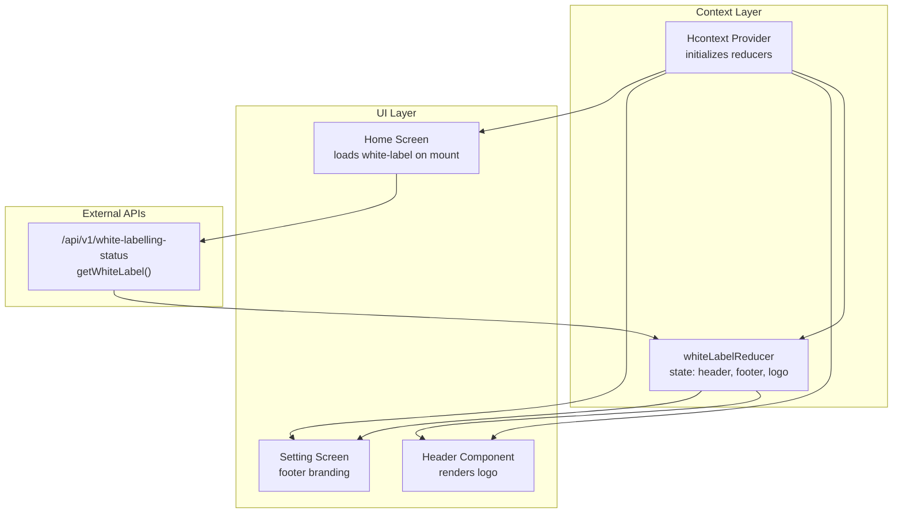
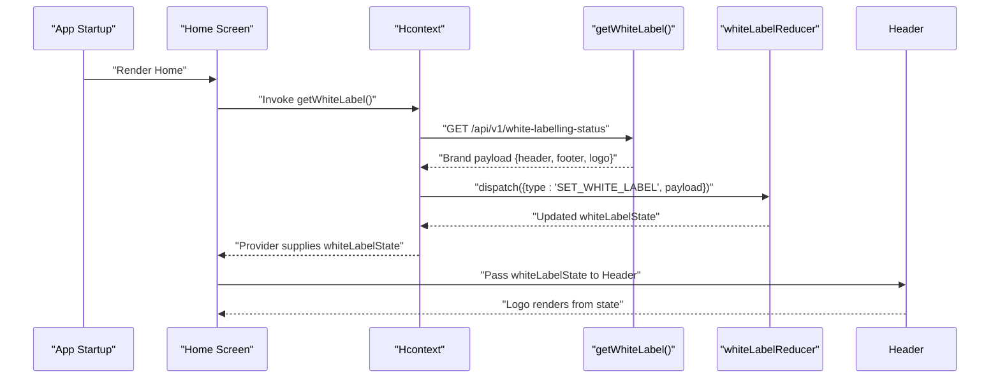
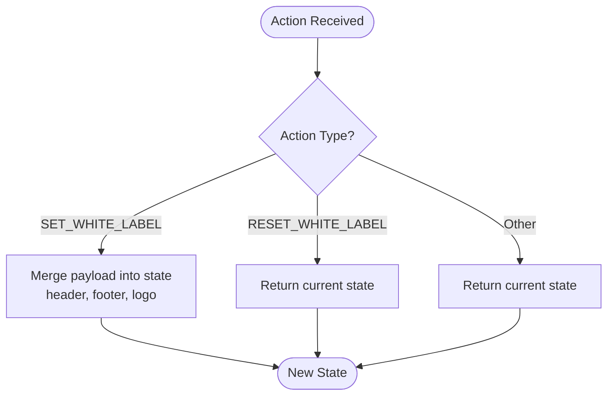
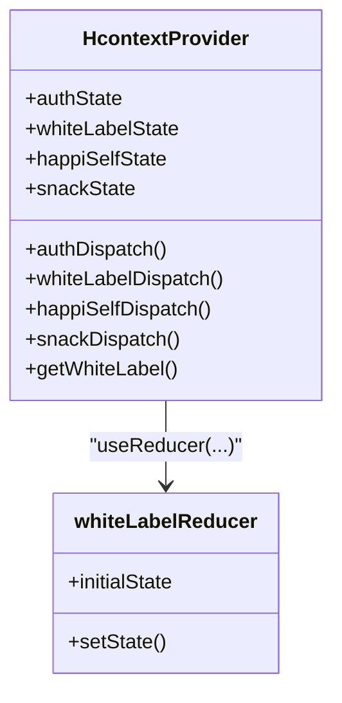
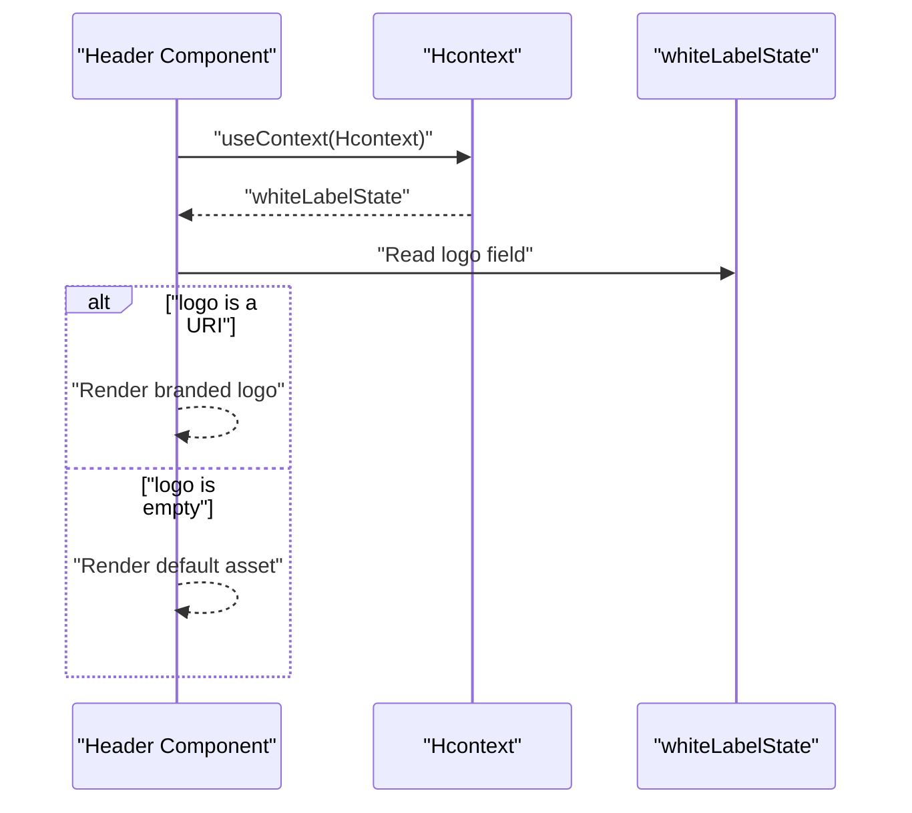
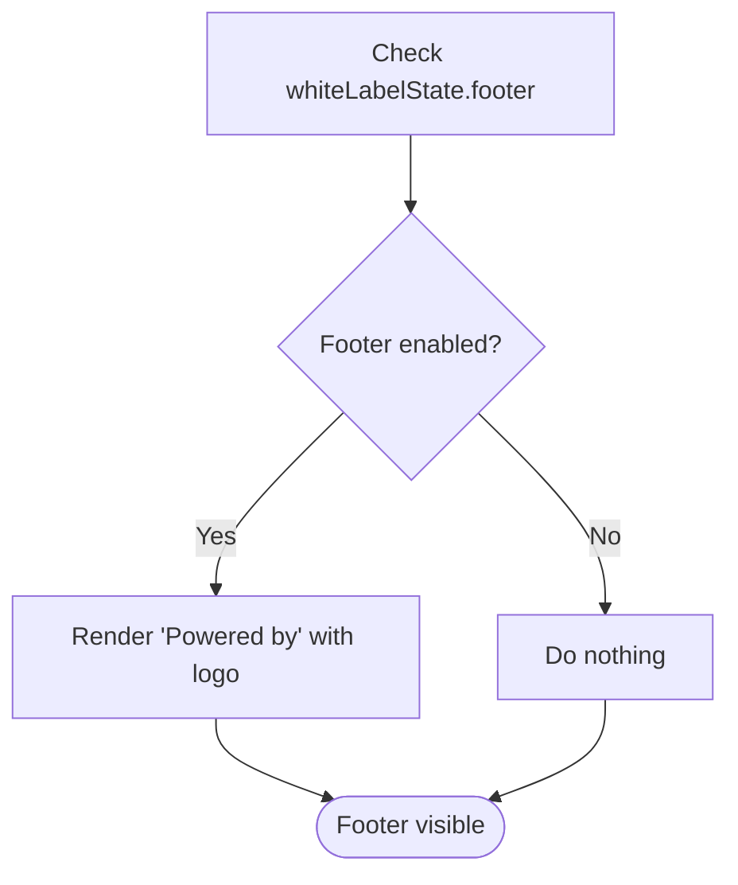
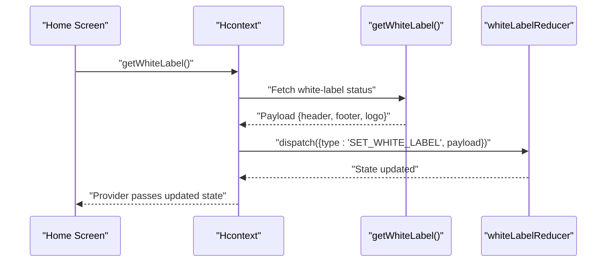
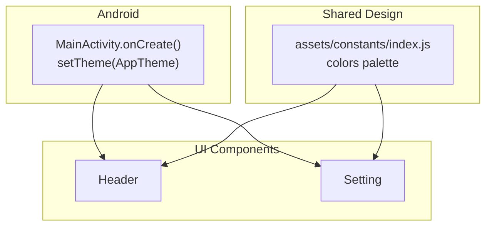
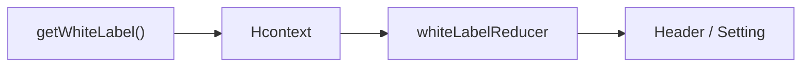

# White Label Reducer

<cite>
**Referenced Files in This Document**
- [whiteLabelReducer.js](file://src/context/reducers/whiteLabelReducer.js)
- [Hcontext.js](file://src/context/Hcontext.js)
- [Header.js](file://src/components/common/Header.js)
- [Home.js](file://src/screens/Home/Home.js)
- [Setting.js](file://src/screens/Setting/Setting.js)
- [index.js](file://src/assets/constants/index.js)
- [colors.xml](file://android/app/src/main/res/values/colors.xml)
- [MainActivity.java](file://android/app/src/main/java/com/happimynd/MainActivity.java)
</cite>

## Table of Contents
1. [Introduction](#introduction)
2. [Project Structure](#project-structure)
3. [Core Components](#core-components)
4. [Architecture Overview](#architecture-overview)
5. [Detailed Component Analysis](#detailed-component-analysis)
6. [Dependency Analysis](#dependency-analysis)
7. [Performance Considerations](#performance-considerations)
8. [Troubleshooting Guide](#troubleshooting-guide)
9. [Conclusion](#conclusion)

## Introduction
This document explains the whiteLabelReducer that powers brand customization and theme state in HappiMynd. It covers the initial state structure for brand configurations, how actions apply white-label settings, and how the reducer integrates with the design system and UI components. It also outlines practical scenarios for brand switching, theme customization workflows, and white-label deployment patterns across client implementations.

## Project Structure
The white-label system is implemented as a Redux-style reducer within the global Hcontext provider. It is consumed by UI components such as the Header and Setting screens, and initialized during app startup via a white-label status API call.

**Diagram sources**
- [Hcontext.js:26-41](file://src/context/Hcontext.js#L26-L41)
- [whiteLabelReducer.js:1-21](file://src/context/reducers/whiteLabelReducer.js#L1-L21)
- [Header.js:17-81](file://src/components/common/Header.js#L17-L81)
- [Setting.js:218-229](file://src/screens/Setting/Setting.js#L218-L229)
- [Home.js:568-585](file://src/screens/Home/Home.js#L568-L585)

**Section sources**
- [Hcontext.js:26-41](file://src/context/Hcontext.js#L26-L41)
- [whiteLabelReducer.js:1-21](file://src/context/reducers/whiteLabelReducer.js#L1-L21)
- [Header.js:17-81](file://src/components/common/Header.js#L17-L81)
- [Setting.js:218-229](file://src/screens/Setting/Setting.js#L218-L229)
- [Home.js:568-585](file://src/screens/Home/Home.js#L568-L585)

## Core Components
- Initial state: The white-label state includes three fields:
  - header: integer flag controlling header branding behavior
  - footer: integer flag controlling footer branding behavior
  - logo: string URI or empty string for dynamic logo rendering
- Actions:
  - SET_WHITE_LABEL: Applies brand configuration payload to state
  - RESET_WHITE_LABEL: Placeholder action included for symmetry (current implementation returns state unchanged)

These components work together to enable per-client branding without hardcoding assets or colors in UI components.

**Section sources**
- [whiteLabelReducer.js:1-21](file://src/context/reducers/whiteLabelReducer.js#L1-L21)

## Architecture Overview
The white-label pipeline connects API-driven branding data to UI rendering through the Hcontext provider and whiteLabelReducer.

**Diagram sources**
- [Home.js:568-585](file://src/screens/Home/Home.js#L568-L585)
- [Hcontext.js:859-867](file://src/context/Hcontext.js#L859-L867)
- [whiteLabelReducer.js:7-21](file://src/context/reducers/whiteLabelReducer.js#L7-L21)
- [Header.js:49-58](file://src/components/common/Header.js#L49-L58)

## Detailed Component Analysis

### whiteLabelReducer
The reducer defines the brand state shape and updates it based on dispatched actions. It supports:
- Applying brand settings via SET_WHITE_LABEL
- A placeholder RESET_WHITE_LABEL action for future expansion

**Diagram sources**
- [whiteLabelReducer.js:7-21](file://src/context/reducers/whiteLabelReducer.js#L7-L21)

**Section sources**
- [whiteLabelReducer.js:1-21](file://src/context/reducers/whiteLabelReducer.js#L1-L21)

### Hcontext Provider Integration
The Hcontext provider initializes the whiteLabelReducer and exposes both state and dispatch to consumers. It also provides the getWhiteLabel API wrapper used by screens to load branding.

**Diagram sources**
- [Hcontext.js:26-41](file://src/context/Hcontext.js#L26-L41)
- [Hcontext.js:859-867](file://src/context/Hcontext.js#L859-L867)
- [whiteLabelReducer.js:1-21](file://src/context/reducers/whiteLabelReducer.js#L1-L21)

**Section sources**
- [Hcontext.js:26-41](file://src/context/Hcontext.js#L26-L41)
- [Hcontext.js:859-867](file://src/context/Hcontext.js#L859-L867)

### Header Component Branding
The Header component reads whiteLabelState.logo and conditionally renders either a branded logo URI or the default asset. It also respects showLogo to hide the logo when needed.

**Diagram sources**
- [Header.js:17-81](file://src/components/common/Header.js#L17-L81)
- [Header.js:49-58](file://src/components/common/Header.js#L49-L58)

**Section sources**
- [Header.js:17-81](file://src/components/common/Header.js#L17-L81)

### Footer Branding in Settings
The Setting screen conditionally renders a "Powered by" footer when whiteLabelState.footer indicates branding should be shown. It uses a fixed local asset for the logo in this case.

**Diagram sources**
- [Setting.js:218-229](file://src/screens/Setting/Setting.js#L218-L229)

**Section sources**
- [Setting.js:218-229](file://src/screens/Setting/Setting.js#L218-L229)

### Home Screen Brand Loading
On mount, the Home screen calls getWhiteLabel(), receives a payload, and dispatches SET_WHITE_LABEL to apply branding. This ensures the app loads client-specific branding at startup.

**Diagram sources**
- [Home.js:568-585](file://src/screens/Home/Home.js#L568-L585)
- [Hcontext.js:859-867](file://src/context/Hcontext.js#L859-L867)
- [whiteLabelReducer.js:7-21](file://src/context/reducers/whiteLabelReducer.js#L7-L21)

**Section sources**
- [Home.js:568-585](file://src/screens/Home/Home.js#L568-L585)
- [Hcontext.js:859-867](file://src/context/Hcontext.js#L859-L867)

### Theme Provider Integration
While the whiteLabelReducer itself is UI-state focused, the app’s theme system is configured at the native level and via shared constants:

- Android theme initialization sets the app theme early in the Activity lifecycle, ensuring consistent UI theming from launch.
- Shared color constants define the design tokens used across components.

**Diagram sources**
- [MainActivity.java:12-18](file://android/app/src/main/java/com/happimynd/MainActivity.java#L12-L18)
- [index.js:1-14](file://src/assets/constants/index.js#L1-L14)

**Section sources**
- [MainActivity.java:12-18](file://android/app/src/main/java/com/happimynd/MainActivity.java#L12-L18)
- [index.js:1-14](file://src/assets/constants/index.js#L1-L14)

## Dependency Analysis
The white-label system has minimal coupling and clear boundaries:

- Hcontext orchestrates state and API access
- whiteLabelReducer encapsulates brand state transitions
- UI components depend only on context-provided state
- No circular dependencies were observed in the analyzed files

**Diagram sources**
- [Hcontext.js:859-867](file://src/context/Hcontext.js#L859-L867)
- [whiteLabelReducer.js:7-21](file://src/context/reducers/whiteLabelReducer.js#L7-L21)
- [Header.js:17-81](file://src/components/common/Header.js#L17-L81)
- [Setting.js:218-229](file://src/screens/Setting/Setting.js#L218-L229)

**Section sources**
- [Hcontext.js:859-867](file://src/context/Hcontext.js#L859-L867)
- [whiteLabelReducer.js:7-21](file://src/context/reducers/whiteLabelReducer.js#L7-L21)
- [Header.js:17-81](file://src/components/common/Header.js#L17-L81)
- [Setting.js:218-229](file://src/screens/Setting/Setting.js#L218-L229)

## Performance Considerations
- Keep brand payloads small: Only transmit necessary branding fields to avoid unnecessary re-renders.
- Memoize derived UI decisions: Components can compare previous state to logo and flags to minimize re-rendering.
- Network reliability: Cache last-known branding locally if desired, but rely on the API for real-time updates.

## Troubleshooting Guide
Common issues and resolutions:
- Logo not appearing:
  - Verify whiteLabelState.logo is a valid URI and not an empty string.
  - Confirm the Header component is receiving the latest state from Hcontext.
- Footer branding missing:
  - Ensure whiteLabelState.footer is enabled in the returned payload.
  - Check that the Setting screen conditionally renders the footer block.
- Brand not applied on startup:
  - Confirm getWhiteLabel() resolves successfully and dispatches SET_WHITE_LABEL.
  - Ensure the Home screen invokes the loading logic on mount.

**Section sources**
- [Header.js:49-58](file://src/components/common/Header.js#L49-L58)
- [Setting.js:218-229](file://src/screens/Setting/Setting.js#L218-L229)
- [Home.js:568-585](file://src/screens/Home/Home.js#L568-L585)
- [Hcontext.js:859-867](file://src/context/Hcontext.js#L859-L867)

## Conclusion
The whiteLabelReducer provides a lightweight, scalable mechanism for client-specific branding in HappiMynd. By centralizing brand state in Hcontext and exposing it to UI components, the system enables flexible white-label deployments without hardcoding assets or colors. Integrating with the design system and theme provider ensures consistent visuals across platforms.