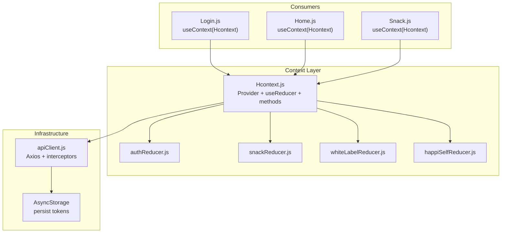
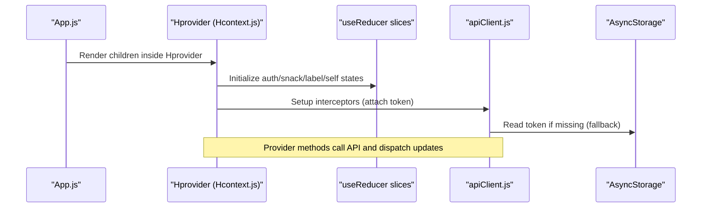
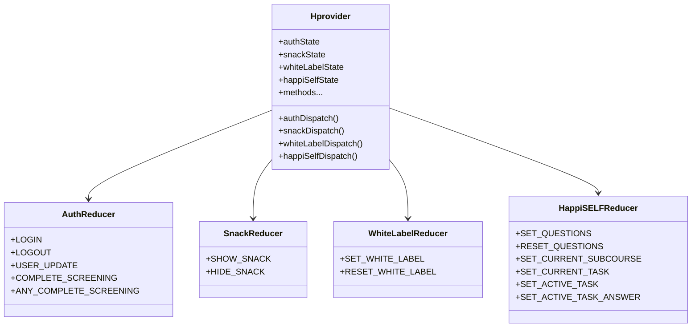
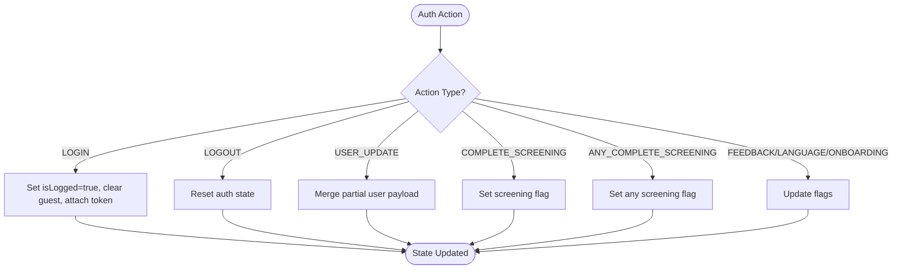
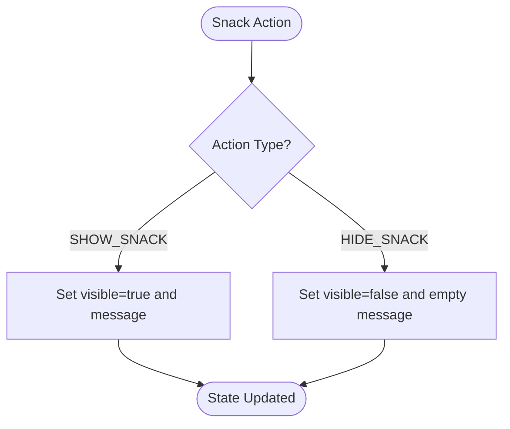
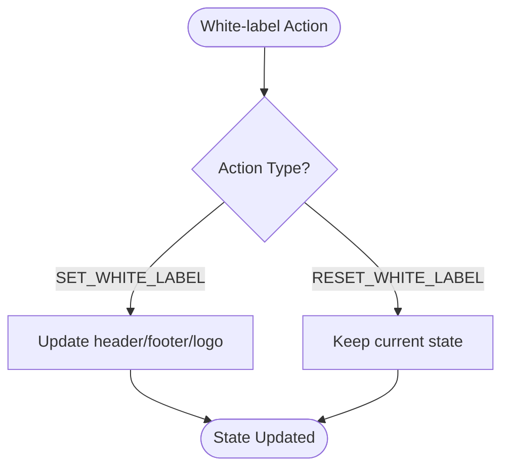
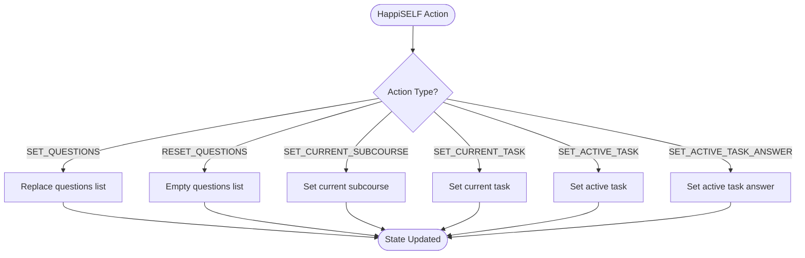
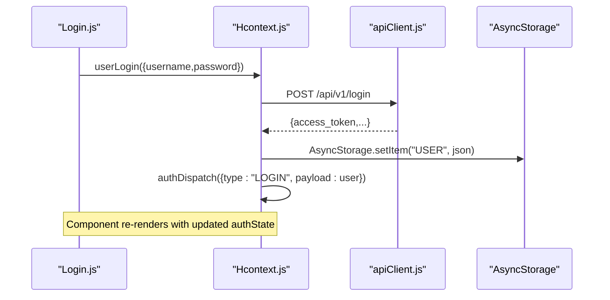
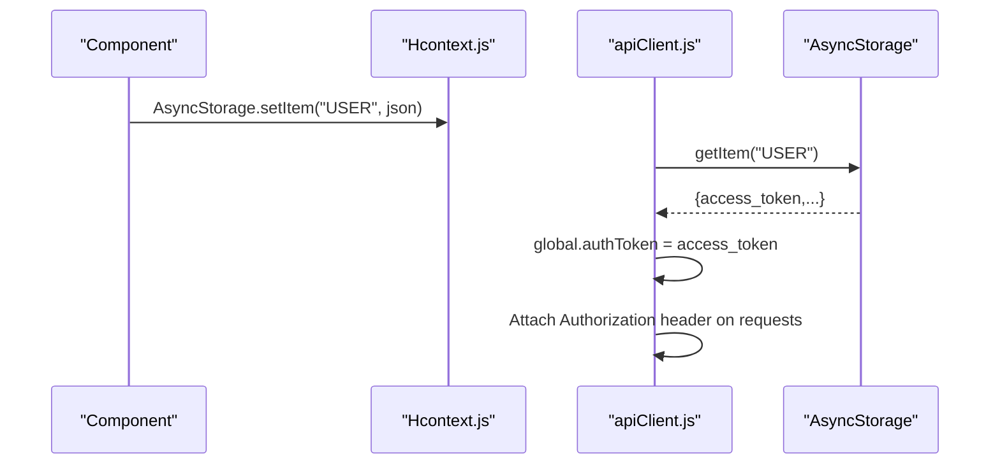
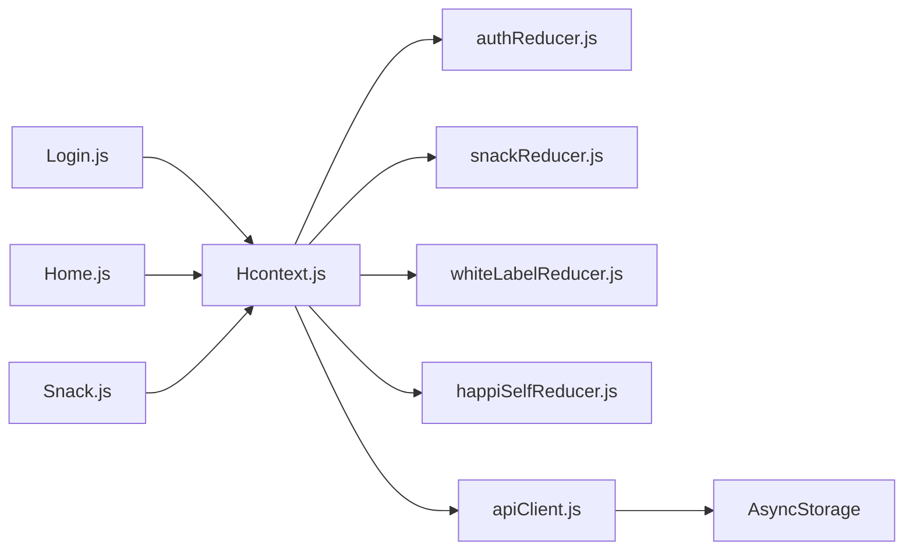

# State Management Architecture

<cite>
**Referenced Files in This Document**
- [Hcontext.js](file://src/context/Hcontext.js)
- [authReducer.js](file://src/context/reducers/authReducer.js)
- [snackReducer.js](file://src/context/reducers/snackReducer.js)
- [whiteLabelReducer.js](file://src/context/reducers/whiteLabelReducer.js)
- [happiSelfReducer.js](file://src/context/reducers/happiSelfReducer.js)
- [apiClient.js](file://src/context/apiClient.js)
- [Login.js](file://src/screens/Auth/Login.js)
- [Home.js](file://src/screens/Home/Home.js)
- [Snack.js](file://src/components/common/Snack.js)
- [App.js](file://App.js)
- [useIsMounted.js](file://src/hooks/useIsMounted.js)
</cite>

## Table of Contents
1. [Introduction](#introduction)
2. [Project Structure](#project-structure)
3. [Core Components](#core-components)
4. [Architecture Overview](#architecture-overview)
5. [Detailed Component Analysis](#detailed-component-analysis)
6. [Dependency Analysis](#dependency-analysis)
7. [Performance Considerations](#performance-considerations)
8. [Troubleshooting Guide](#troubleshooting-guide)
9. [Conclusion](#conclusion)

## Introduction
This document explains HappiMynd’s state management architecture built on React Context and useReducer. It covers the Provider pattern via Hcontext.js, the multi-reducer design (authentication, snack notifications, white-label branding, and HappiSELF self-help state), initialization patterns, dispatch mechanisms, AsyncStorage integration, and debugging strategies. It also outlines performance considerations such as memoization and normalization.

## Project Structure
HappiMynd organizes state management under src/context with:
- A central provider (Hcontext.js) exporting a React Context and a Provider component
- Four reducers under src/context/reducers for distinct domains
- Consumers across screens and components using useContext
- An apiClient wrapper that injects authentication tokens from AsyncStorage or global state

**Diagram sources**
- [Hcontext.js:1-25](file://src/context/Hcontext.js#L1-L25)
- [authReducer.js:1-79](file://src/context/reducers/authReducer.js#L1-L79)
- [snackReducer.js:1-16](file://src/context/reducers/snackReducer.js#L1-L16)
- [whiteLabelReducer.js:1-22](file://src/context/reducers/whiteLabelReducer.js#L1-L22)
- [happiSelfReducer.js:1-45](file://src/context/reducers/happiSelfReducer.js#L1-L45)
- [apiClient.js:1-58](file://src/context/apiClient.js#L1-L58)
- [Login.js:28-34](file://src/screens/Auth/Login.js#L28-L34)
- [Home.js:42-68](file://src/screens/Home/Home.js#L42-L68)
- [Snack.js:9-11](file://src/components/common/Snack.js#L9-L11)

**Section sources**
- [Hcontext.js:1-25](file://src/context/Hcontext.js#L1-L25)
- [App.js:17-55](file://App.js#L17-L55)

## Core Components
- Central Context and Provider
  - Hcontext.js creates a Context and exports a Provider that initializes four useReducer instances and numerous stateful variables. It exposes both state slices and bound dispatchers, plus a large surface of async methods for API interactions.
- Reducers and Initial States
  - Authentication reducer manages login state, user metadata, onboarding, and screening flags.
  - Snack reducer controls a global notification toast.
  - White-label reducer stores header/footer/logo branding values.
  - HappiSELF reducer tracks current subcourse/task, questions list, and active task answer.
- Consumers
  - Components like Login and Home use useContext to access state and dispatchers, and call provider methods to mutate state or trigger side effects.

Key implementation references:
- Provider creation and reducer initialization: [Hcontext.js:26-40](file://src/context/Hcontext.js#L26-L40)
- Exposing state and dispatchers: [Hcontext.js:1408-1549](file://src/context/Hcontext.js#L1408-L1549)
- Reducer definitions: [authReducer.js:5-79](file://src/context/reducers/authReducer.js#L5-L79), [snackReducer.js:1-16](file://src/context/reducers/snackReducer.js#L1-L16), [whiteLabelReducer.js:1-22](file://src/context/reducers/whiteLabelReducer.js#L1-L22), [happiSelfReducer.js:1-45](file://src/context/reducers/happiSelfReducer.js#L1-L45)

**Section sources**
- [Hcontext.js:26-40](file://src/context/Hcontext.js#L26-L40)
- [Hcontext.js:1408-1549](file://src/context/Hcontext.js#L1408-L1549)
- [authReducer.js:5-79](file://src/context/reducers/authReducer.js#L5-L79)
- [snackReducer.js:1-16](file://src/context/reducers/snackReducer.js#L1-L16)
- [whiteLabelReducer.js:1-22](file://src/context/reducers/whiteLabelReducer.js#L1-L22)
- [happiSelfReducer.js:1-45](file://src/context/reducers/happiSelfReducer.js#L1-L45)

## Architecture Overview
The architecture follows a centralized Provider pattern:
- App wraps the app tree with Hprovider
- Hprovider initializes useReducer slices and state variables
- Methods bound to the provider perform async operations and dispatch updates
- Consumers subscribe to state via useContext

**Diagram sources**
- [App.js:47-51](file://App.js#L47-L51)
- [Hcontext.js:26-40](file://src/context/Hcontext.js#L26-L40)
- [apiClient.js:12-44](file://src/context/apiClient.js#L12-L44)

## Detailed Component Analysis

### Provider Pattern and Hcontext.js
- Purpose: Central state container aggregating reducers, state variables, and async methods.
- Initialization:
  - Four useReducer instances initialized with initial states and reducers.
  - Numerous state variables for UI and feature flags.
- Methods:
  - Authentication: login, logout, signup, password change, forgot/reset OTP.
  - Content: HappiLearn listings, likes, posts.
  - Payments: plans, coupons, subscriptions.
  - Messaging: push notifications, chat messages, white-labeling.
  - HappiSELF: courses, tasks, notes, answers.
- Exposed value:
  - Each reducer’s state and dispatch.
  - All provider-bound methods.
  - Selected UI/filter state variables and setters.

**Diagram sources**
- [Hcontext.js:26-40](file://src/context/Hcontext.js#L26-L40)
- [authReducer.js:17-77](file://src/context/reducers/authReducer.js#L17-L77)
- [snackReducer.js:6-14](file://src/context/reducers/snackReducer.js#L6-L14)
- [whiteLabelReducer.js:7-20](file://src/context/reducers/whiteLabelReducer.js#L7-L20)
- [happiSelfReducer.js:9-43](file://src/context/reducers/happiSelfReducer.js#L9-L43)

**Section sources**
- [Hcontext.js:26-40](file://src/context/Hcontext.js#L26-L40)
- [Hcontext.js:1408-1549](file://src/context/Hcontext.js#L1408-L1549)

### Authentication Reducer
- Responsibilities:
  - Track logged-in status, guest mode, selected language, onboarding, screening completion.
  - Merge partial user updates and persist access tokens globally.
- Actions:
  - LOGIN, SIGNUP, FEEDBACK, LANGUAGE_SELECTION, ON_BOARDING_PROCESS, USER_UPDATE, COMPLETE_SCREENING, ANY_COMPLETE_SCREENING, LOGOUT.

**Diagram sources**
- [authReducer.js:17-77](file://src/context/reducers/authReducer.js#L17-L77)

**Section sources**
- [authReducer.js:5-79](file://src/context/reducers/authReducer.js#L5-L79)

### Snack Reducer (Notifications)
- Responsibilities:
  - Control a global snackbar/notification overlay.
- Actions:
  - SHOW_SNACK, HIDE_SNACK.

**Diagram sources**
- [snackReducer.js:6-14](file://src/context/reducers/snackReducer.js#L6-L14)

**Section sources**
- [snackReducer.js:1-16](file://src/context/reducers/snackReducer.js#L1-L16)

### White-label Reducer
- Responsibilities:
  - Store header/footer/logo branding values.
- Actions:
  - SET_WHITE_LABEL, RESET_WHITE_LABEL.

**Diagram sources**
- [whiteLabelReducer.js:7-20](file://src/context/reducers/whiteLabelReducer.js#L7-L20)

**Section sources**
- [whiteLabelReducer.js:1-22](file://src/context/reducers/whiteLabelReducer.js#L1-L22)

### HappiSELF Reducer
- Responsibilities:
  - Track current subcourse/task, questions list, and active task answer.
- Actions:
  - SET_QUESTIONS, RESET_QUESTIONS, SET_CURRENT_SUBCOURSE, SET_CURRENT_TASK, SET_ACTIVE_TASK, SET_ACTIVE_TASK_ANSWER.

**Diagram sources**
- [happiSelfReducer.js:9-43](file://src/context/reducers/happiSelfReducer.js#L9-L43)

**Section sources**
- [happiSelfReducer.js:1-45](file://src/context/reducers/happiSelfReducer.js#L1-L45)

### Consumer Usage Patterns
- Login Screen:
  - Uses authDispatch and userLogin to authenticate, persist user data to AsyncStorage, and update global auth state.
- Home Screen:
  - Uses authDispatch to update screening flags, getUserProfile to merge user data, and whiteLabelDispatch to apply branding.

**Diagram sources**
- [Login.js:33-74](file://src/screens/Auth/Login.js#L33-L74)
- [Hcontext.js:129-145](file://src/context/Hcontext.js#L129-L145)
- [apiClient.js:12-44](file://src/context/apiClient.js#L12-L44)

**Section sources**
- [Login.js:31-74](file://src/screens/Auth/Login.js#L31-L74)
- [Home.js:60-167](file://src/screens/Home/Home.js#L60-L167)

### Dispatch Mechanisms and Side Effects
- Dispatchers are exposed alongside provider methods. Components call provider methods (which may dispatch) or call dispatch directly on reducer-specific dispatchers.
- Example: Login dispatches LOGIN after successful API response; Home dispatches USER_UPDATE and screening flags after fetching profile.

**Section sources**
- [Login.js:67-69](file://src/screens/Auth/Login.js#L67-L69)
- [Home.js:117-129](file://src/screens/Home/Home.js#L117-L129)
- [Home.js:152-162](file://src/screens/Home/Home.js#L152-L162)

### State Initialization Patterns
- Each reducer defines an initial state object.
- Hprovider initializes useReducer with these initial states and binds dispatchers.
- UI/filter state variables are initialized with sensible defaults.

**Section sources**
- [authReducer.js:5-15](file://src/context/reducers/authReducer.js#L5-L15)
- [snackReducer.js:1-4](file://src/context/reducers/snackReducer.js#L1-L4)
- [whiteLabelReducer.js:1-5](file://src/context/reducers/whiteLabelReducer.js#L1-L5)
- [happiSelfReducer.js:1-7](file://src/context/reducers/happiSelfReducer.js#L1-L7)
- [Hcontext.js:28-40](file://src/context/Hcontext.js#L28-L40)

### Integration with AsyncStorage
- Persistence:
  - Login writes user data to AsyncStorage for offline reuse.
- Token injection:
  - apiClient reads AsyncStorage for access tokens and caches in global.authToken for subsequent requests.

**Diagram sources**
- [Login.js:65](file://src/screens/Auth/Login.js#L65)
- [apiClient.js:18-32](file://src/context/apiClient.js#L18-L32)

**Section sources**
- [Login.js:65](file://src/screens/Auth/Login.js#L65)
- [apiClient.js:12-44](file://src/context/apiClient.js#L12-L44)

### Error Boundary Handling
- The codebase does not implement React error boundaries. Instead, it relies on:
  - Snack notifications for user-visible errors.
  - Console logging and request/response interception for diagnostics.
  - API error interceptor normalizing error payloads.

Recommendation:
- Wrap critical parts of the UI with an error boundary to prevent app crashes and present a fallback UI.

**Section sources**
- [Snack.js:9-31](file://src/components/common/Snack.js#L9-L31)
- [apiClient.js:47-56](file://src/context/apiClient.js#L47-L56)

### State Debugging Strategies
- Logging:
  - Provider methods log request/response details and errors.
  - apiClient logs token attachment and error responses.
- Observability:
  - Snack notifications surface actionable messages.
- Recommendations:
  - Add structured logging (e.g., Sentry) and Redux DevTools-style middleware for reducers.
  - Instrument provider methods with timing metrics.

**Section sources**
- [Hcontext.js:382-400](file://src/context/Hcontext.js#L382-L400)
- [apiClient.js:34-56](file://src/context/apiClient.js#L34-L56)

## Dependency Analysis
- Provider depends on:
  - Reducers for state transitions
  - apiClient for authenticated requests
  - AsyncStorage for persistence
- Consumers depend on:
  - Hcontext for state and dispatchers
- No circular dependencies observed among reducers or provider.

**Diagram sources**
- [Hcontext.js:13-22](file://src/context/Hcontext.js#L13-L22)
- [apiClient.js:1-3](file://src/context/apiClient.js#L1-L3)
- [Login.js:28-34](file://src/screens/Auth/Login.js#L28-L34)
- [Home.js:42-68](file://src/screens/Home/Home.js#L42-L68)
- [Snack.js:9-11](file://src/components/common/Snack.js#L9-L11)

**Section sources**
- [Hcontext.js:13-22](file://src/context/Hcontext.js#L13-L22)
- [apiClient.js:1-3](file://src/context/apiClient.js#L1-L3)

## Performance Considerations
- Memoization:
  - Use useMemo/useCallback around expensive computations or derived data in consumers to avoid unnecessary renders.
  - Normalize state shapes to reduce re-renders (e.g., keep arrays of IDs and lookup maps).
- Reducer granularity:
  - Current single-provider approach is fine for small-to-medium apps. As complexity grows, consider splitting the provider into smaller contexts per domain.
- Async work:
  - Debounce frequent UI updates; batch API calls where possible.
- Token caching:
  - apiClient already caches tokens in global.authToken; ensure no redundant fetches.
- UI responsiveness:
  - Offload heavy work to background threads and avoid blocking the render loop.

[No sources needed since this section provides general guidance]

## Troubleshooting Guide
Common issues and remedies:
- Authentication token not attached:
  - Ensure AsyncStorage contains USER and access_token; verify apiClient interceptor attaches Authorization header.
- Snack notifications not appearing:
  - Confirm Snack component is rendered and snackDispatch toggles visible/message.
- Provider methods failing silently:
  - Check console logs in provider methods and apiClient interceptors; ensure snackDispatch is called on errors.

**Section sources**
- [apiClient.js:12-44](file://src/context/apiClient.js#L12-L44)
- [Snack.js:9-31](file://src/components/common/Snack.js#L9-L31)
- [Hcontext.js:139-144](file://src/context/Hcontext.js#L139-L144)

## Conclusion
HappiMynd’s state management centers on a robust Provider pattern with four focused reducers, a unified API client with token caching, and AsyncStorage-backed persistence. Consumers use useContext to access state and dispatchers, enabling predictable updates and side-effect orchestration. For scalability, consider modularizing the provider, adding error boundaries, and implementing advanced debugging and normalization strategies.