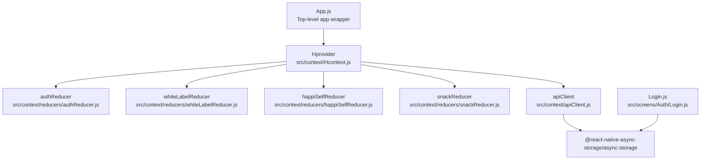
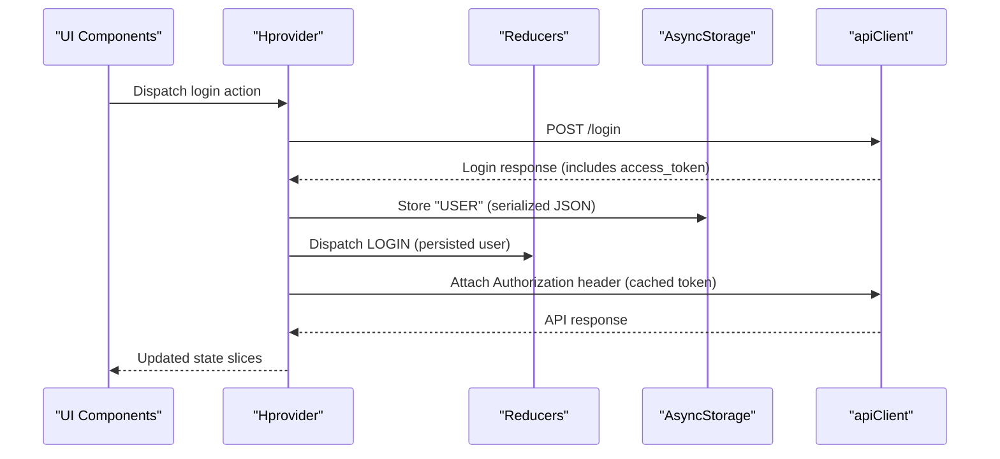
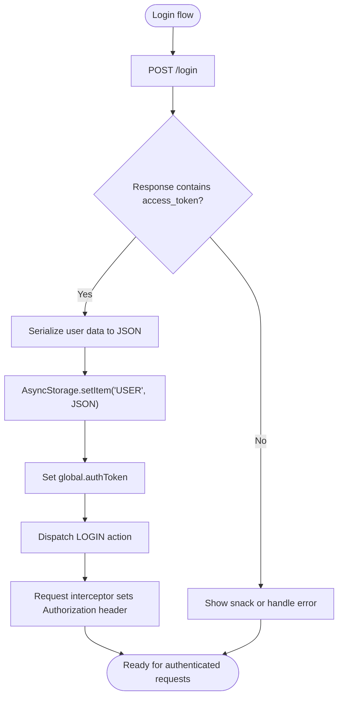
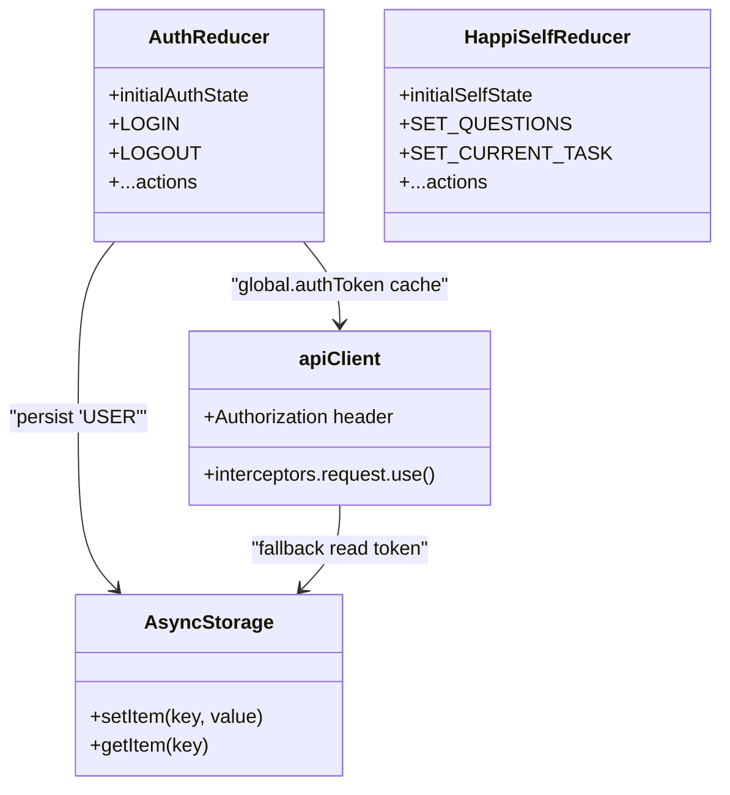
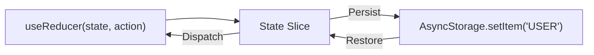
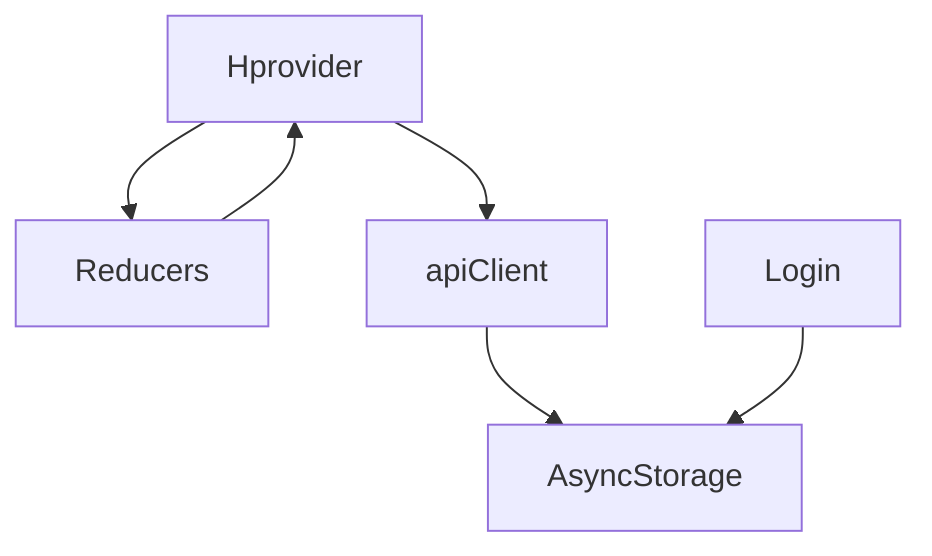

# State Persistence Strategies

<cite>
**Referenced Files in This Document**
- [App.js](file://App.js)
- [Hcontext.js](file://src/context/Hcontext.js)
- [apiClient.js](file://src/context/apiClient.js)
- [authReducer.js](file://src/context/reducers/authReducer.js)
- [happiSelfReducer.js](file://src/context/reducers/happiSelfReducer.js)
- [snackReducer.js](file://src/context/reducers/snackReducer.js)
- [whiteLabelReducer.js](file://src/context/reducers/whiteLabelReducer.js)
- [Login.js](file://src/screens/Auth/Login.js)
</cite>

## Table of Contents
1. [Introduction](#introduction)
2. [Project Structure](#project-structure)
3. [Core Components](#core-components)
4. [Architecture Overview](#architecture-overview)
5. [Detailed Component Analysis](#detailed-component-analysis)
6. [Dependency Analysis](#dependency-analysis)
7. [Performance Considerations](#performance-considerations)
8. [Troubleshooting Guide](#troubleshooting-guide)
9. [Conclusion](#conclusion)

## Introduction
This document explains the state persistence strategies used in HappiMynd’s state management architecture. It focuses on how AsyncStorage is integrated to persist critical application state across app restarts, how the token is cached and injected into API clients, and how the provider exposes state slices to the rest of the app. It also covers the selective persistence approach, serialization/deserialization patterns, error handling for corrupted storage data, and performance considerations for large state objects. Finally, it maps AsyncStorage usage to Redux-style reducer patterns.

## Project Structure
HappiMynd initializes the application with a top-level provider that aggregates multiple reducers and exposes a unified context to the UI. Authentication state and user data are persisted to AsyncStorage, while other state slices remain in memory managed by React’s useReducer.

**Diagram sources**
- [App.js:17-55](file://App.js#L17-L55)
- [Hcontext.js:26-40](file://src/context/Hcontext.js#L26-L40)
- [authReducer.js:5-15](file://src/context/reducers/authReducer.js#L5-L15)
- [whiteLabelReducer.js:1-5](file://src/context/reducers/whiteLabelReducer.js#L1-L5)
- [happiSelfReducer.js:1-7](file://src/context/reducers/happiSelfReducer.js#L1-L7)
- [snackReducer.js:1-4](file://src/context/reducers/snackReducer.js#L1-L4)
- [apiClient.js:1-58](file://src/context/apiClient.js#L1-L58)
- [Login.js:44-74](file://src/screens/Auth/Login.js#L44-L74)

**Section sources**
- [App.js:17-55](file://App.js#L17-L55)
- [Hcontext.js:26-40](file://src/context/Hcontext.js#L26-L40)

## Core Components
- Hprovider: Creates and manages multiple reducers (authentication, white-label branding, HappiSELF tasks, snack notifications) and exposes them via a context provider. It also orchestrates API interactions and integrates AsyncStorage for authentication persistence.
- apiClient: Axios instance with request/response interceptors. It reads the user token from AsyncStorage when needed and injects it into outgoing requests.
- Reducers: Define initial state and actions for each slice. Authentication state is persisted to AsyncStorage; other slices remain in memory.

Key responsibilities:
- Persist critical user data (e.g., login response) to AsyncStorage upon successful login.
- Cache the access token in a global variable for fast access by the API client.
- Inject the Authorization header on every request using the cached token or AsyncStorage.
- Expose state slices and action creators to the UI.

**Section sources**
- [Hcontext.js:26-40](file://src/context/Hcontext.js#L26-L40)
- [apiClient.js:11-44](file://src/context/apiClient.js#L11-L44)
- [authReducer.js:17-30](file://src/context/reducers/authReducer.js#L17-L30)
- [Login.js:44-74](file://src/screens/Auth/Login.js#L44-L74)

## Architecture Overview
The persistence architecture follows a Redux-like pattern with React’s useReducer. AsyncStorage is used selectively to persist only essential state (e.g., user credentials and tokens) to survive app restarts. Volatile UI and transient state remain in memory.

**Diagram sources**
- [Login.js:44-74](file://src/screens/Auth/Login.js#L44-L74)
- [Hcontext.js:129-145](file://src/context/Hcontext.js#L129-L145)
- [apiClient.js:12-44](file://src/context/apiClient.js#L12-L44)
- [authReducer.js:17-30](file://src/context/reducers/authReducer.js#L17-L30)

## Detailed Component Analysis

### Authentication State Persistence and Token Caching
- Persistence: On successful login, the entire login response (including access_token) is serialized to AsyncStorage under the key "USER".
- Token caching: The reducer sets a global token cache upon LOGIN. The API client checks this cache first, falling back to AsyncStorage if missing.
- Token injection: The request interceptor attaches the Authorization header for every outgoing request using the cached token or AsyncStorage.

**Diagram sources**
- [Login.js:44-74](file://src/screens/Auth/Login.js#L44-L74)
- [authReducer.js:17-30](file://src/context/reducers/authReducer.js#L17-L30)
- [apiClient.js:12-44](file://src/context/apiClient.js#L12-L44)

**Section sources**
- [Login.js:44-74](file://src/screens/Auth/Login.js#L44-L74)
- [authReducer.js:17-30](file://src/context/reducers/authReducer.js#L17-L30)
- [apiClient.js:12-44](file://src/context/apiClient.js#L12-L44)

### State Hydration During Initialization
- The provider composes multiple reducers and exposes their state and dispatchers to the app. While there is no explicit “hydration” function in the provider, the app’s top-level initialization wraps the UI with the provider. Authentication persistence is achieved through AsyncStorage usage in the login flow and API client interceptor.
- Recommendation: If hydration is desired, implement a function that reads AsyncStorage on app start and dispatches appropriate actions to initialize state slices before rendering the UI.

**Section sources**
- [App.js:17-55](file://App.js#L17-L55)
- [Hcontext.js:26-40](file://src/context/Hcontext.js#L26-L40)

### Selective Persistence Strategy
- Essential state persisted: Authentication user data (serialized JSON) under "USER".
- Volatile/transient state remains in memory: HappiSELF task answers, UI flags, and other temporary state are handled by reducers without AsyncStorage writes.

**Diagram sources**
- [authReducer.js:5-15](file://src/context/reducers/authReducer.js#L5-L15)
- [happiSelfReducer.js:1-7](file://src/context/reducers/happiSelfReducer.js#L1-L7)
- [apiClient.js:12-44](file://src/context/apiClient.js#L12-L44)

**Section sources**
- [authReducer.js:5-15](file://src/context/reducers/authReducer.js#L5-L15)
- [happiSelfReducer.js:1-7](file://src/context/reducers/happiSelfReducer.js#L1-L7)
- [apiClient.js:12-44](file://src/context/apiClient.js#L12-L44)

### Serialization and Deserialization Patterns
- Serialization: Login response is stringified to JSON before being stored in AsyncStorage.
- Deserialization: The API client attempts to parse the stored user data to extract the access_token when the global token cache is unavailable.

Best practices:
- Always wrap AsyncStorage operations in try/catch blocks.
- Validate parsed data shape before use.
- Consider versioning persisted data to support schema migrations.

**Section sources**
- [Login.js:65](file://src/screens/Auth/Login.js#L65)
- [apiClient.js:18-32](file://src/context/apiClient.js#L18-L32)

### Error Handling for Corrupted Storage Data
- The API client’s request interceptor logs errors when reading from AsyncStorage and continues without an Authorization header if parsing fails.
- Recommendations:
  - Add robust error logging and fallback behavior (e.g., redirect to login).
  - Implement a cleanup routine to remove malformed entries.
  - Surface user-facing errors via snackbars or alerts.

**Section sources**
- [apiClient.js:29-31](file://src/context/apiClient.js#L29-L31)

### Relationship Between AsyncStorage and Redux-Style State Management
- Reducers manage state transitions in memory.
- AsyncStorage persists critical slices (e.g., user) to disk.
- The provider exposes state and dispatchers to components, enabling a predictable, Redux-like flow.

**Diagram sources**
- [Hcontext.js:26-40](file://src/context/Hcontext.js#L26-L40)
- [Login.js:65](file://src/screens/Auth/Login.js#L65)
- [apiClient.js:18-32](file://src/context/apiClient.js#L18-L32)

**Section sources**
- [Hcontext.js:26-40](file://src/context/Hcontext.js#L26-L40)
- [Login.js:65](file://src/screens/Auth/Login.js#L65)
- [apiClient.js:18-32](file://src/context/apiClient.js#L18-L32)

## Dependency Analysis
- Hprovider depends on:
  - Reducers for state slices.
  - apiClient for authenticated requests.
  - AsyncStorage for persistence.
- apiClient depends on AsyncStorage for token retrieval and on global.authToken for fast access.
- Login screen depends on AsyncStorage to persist the user object after successful authentication.

**Diagram sources**
- [Hcontext.js:26-40](file://src/context/Hcontext.js#L26-L40)
- [apiClient.js:1-58](file://src/context/apiClient.js#L1-L58)
- [Login.js:44-74](file://src/screens/Auth/Login.js#L44-L74)

**Section sources**
- [Hcontext.js:26-40](file://src/context/Hcontext.js#L26-L40)
- [apiClient.js:1-58](file://src/context/apiClient.js#L1-L58)
- [Login.js:44-74](file://src/screens/Auth/Login.js#L44-L74)

## Performance Considerations
- Minimize AsyncStorage reads/writes:
  - Cache tokens in memory (global.authToken) to avoid repeated disk I/O.
  - Batch updates when possible.
- Keep persisted payloads small:
  - Only persist essential fields (e.g., access_token, minimal user metadata).
- Avoid blocking UI:
  - Perform persistence off the main thread if needed.
- Monitor storage size:
  - AsyncStorage has limits; avoid storing large binary blobs or excessive data.

[No sources needed since this section provides general guidance]

## Troubleshooting Guide
Common issues and resolutions:
- Missing Authorization header:
  - Ensure the reducer dispatches LOGIN to populate global.authToken.
  - Confirm the interceptor reads AsyncStorage only when the cache is empty.
- Corrupted or invalid persisted data:
  - Wrap AsyncStorage reads in try/catch and log errors.
  - Remove malformed entries and prompt the user to re-authenticate.
- Stale or expired tokens:
  - Implement token refresh logic in the API client or reducer.
  - Clear persisted user data on logout.

**Section sources**
- [authReducer.js:65-74](file://src/context/reducers/authReducer.js#L65-L74)
- [apiClient.js:12-44](file://src/context/apiClient.js#L12-L44)
- [apiClient.js:29-31](file://src/context/apiClient.js#L29-L31)

## Conclusion
HappiMynd employs a pragmatic, Redux-like state management approach with AsyncStorage used selectively to persist authentication state. The API client leverages a global token cache and AsyncStorage as a fallback to ensure authenticated requests work seamlessly across app restarts. Other state slices remain in memory, keeping the system responsive and efficient. For production readiness, consider implementing explicit hydration, robust error handling, and schema-versioning strategies for persisted data.