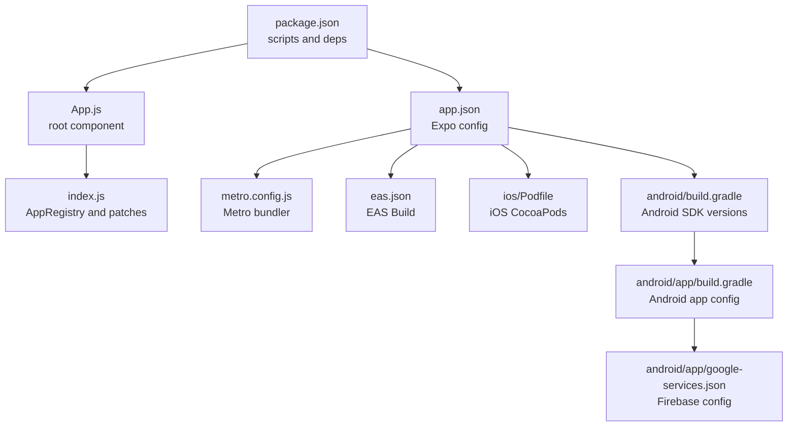

# Getting Started

<cite>
**Referenced Files in This Document**
- [package.json](file://package.json)
- [app.json](file://app.json)
- [babel.config.js](file://babel.config.js)
- [metro.config.js](file://metro.config.js)
- [eas.json](file://eas.json)
- [ios/Podfile](file://ios/Podfile)
- [android/build.gradle](file://android/build.gradle)
- [android/app/build.gradle](file://android/app/build.gradle)
- [android/app/google-services.json](file://android/app/google-services.json)
- [App.js](file://App.js)
- [index.js](file://index.js)
- [scripts/patch-expo-notifications.js](file://scripts/patch-expo-notifications.js)
</cite>

## Table of Contents
1. [Introduction](#introduction)
2. [Project Structure](#project-structure)
3. [Prerequisites and Setup](#prerequisites-and-setup)
4. [Installation Steps](#installation-steps)
5. [Environment Variables](#environment-variables)
6. [Initial Build and Running](#initial-build-and-running)
7. [Development Workflow](#development-workflow)
8. [iOS Simulator Setup](#ios-simulator-setup)
9. [Android Emulator Setup](#android-emulator-setup)
10. [Essential Tools](#essential-tools)
11. [Testing Strategies](#testing-strategies)
12. [Troubleshooting](#troubleshooting)
13. [Code Formatting and Linting](#code-formating-and-linting)
14. [Best Practices](#best-practices)
15. [Conclusion](#conclusion)

## Introduction
This guide helps you set up the HappiMynd development environment and start building. It covers prerequisites, platform-specific setup, project initialization, dependency installation, building, and day-to-day development workflows including hot reloading, debugging, and testing. It also includes troubleshooting tips, environment variable configuration, and development best practices.

## Project Structure
HappiMynd is an Expo-based React Native project with platform-specific native configurations for iOS and Android. Key areas:
- Cross-platform app entry and providers are in [App.js](file://App.js) and [index.js](file://index.js).
- Expo configuration is centralized in [app.json](file://app.json).
- Metro bundler configuration is in [metro.config.js](file://metro.config.js).
- EAS Build configuration is in [eas.json](file://eas.json).
- iOS CocoaPods configuration is in [ios/Podfile](file://ios/Podfile).
- Android Gradle configuration is split across [android/build.gradle](file://android/build.gradle) and [android/app/build.gradle](file://android/app/build.gradle), with Google Services credentials in [android/app/google-services.json](file://android/app/google-services.json).

**Diagram sources**
- [package.json](file://package.json)
- [App.js](file://App.js)
- [index.js](file://index.js)
- [app.json](file://app.json)
- [metro.config.js](file://metro.config.js)
- [eas.json](file://eas.json)
- [ios/Podfile](file://ios/Podfile)
- [android/build.gradle](file://android/build.gradle)
- [android/app/build.gradle](file://android/app/build.gradle)
- [android/app/google-services.json](file://android/app/google-services.json)

**Section sources**
- [package.json](file://package.json)
- [app.json](file://app.json)
- [metro.config.js](file://metro.config.js)
- [eas.json](file://eas.json)
- [ios/Podfile](file://ios/Podfile)
- [android/build.gradle](file://android/build.gradle)
- [android/app/build.gradle](file://android/app/build.gradle)
- [android/app/google-services.json](file://android/app/google-services.json)

## Prerequisites and Setup
Install the following tools before starting:
- Node.js and npm or yarn
- Expo CLI (required for development client and device workflows)
- Xcode (for iOS builds and simulators)
- Android Studio with Android SDK and an emulator
- Optional but recommended: Flipper and React Native Debugger

Notes:
- The project uses Expo SDK 43 with React Native 0.64.4 and Expo CLI for development workflows.
- EAS Build is configured for development client builds.

**Section sources**
- [package.json](file://package.json)
- [app.json](file://app.json)
- [eas.json](file://eas.json)

## Installation Steps
Follow these steps to prepare your local environment:

1. Install dependencies
   - Use yarn to install all dependencies defined in [package.json](file://package.json).
   - The project runs a postinstall script to apply a patch for compatibility.

2. Prepare platform-specific environments
   - iOS: Install pods via CocoaPods as configured in [ios/Podfile](file://ios/Podfile).
   - Android: Ensure Android SDK, build tools, and Gradle versions match [android/build.gradle](file://android/build.gradle).

3. Configure Firebase/Google Services (Android)
   - Place the correct Google Services JSON file in [android/app/google-services.json](file://android/app/google-services.json) as referenced by [app.json](file://app.json).

4. Initialize the project
   - Run the development server using the Expo start script defined in [package.json](file://package.json).

**Section sources**
- [package.json](file://package.json)
- [ios/Podfile](file://ios/Podfile)
- [android/build.gradle](file://android/build.gradle)
- [android/app/google-services.json](file://android/app/google-services.json)
- [app.json](file://app.json)

## Environment Variables
Configure environment variables for local development as needed:
- Android signing and secrets
  - Define keystore and key properties referenced in [android/app/build.gradle](file://android/app/build.gradle) for release builds.
- Flipper
  - The Android app includes Flipper debug plugins in debug builds as seen in [android/app/build.gradle](file://android/app/build.gradle).
- EAS Build
  - Development client settings are defined in [eas.json](file://eas.json).

**Section sources**
- [android/app/build.gradle](file://android/app/build.gradle)
- [android/app/build.gradle](file://android/app/build.gradle)
- [eas.json](file://eas.json)

## Initial Build and Running
To start developing:
- Start the development server with the Expo dev client:
  - Use the start script in [package.json](file://package.json).
- Run on iOS or Android:
  - Use the platform-specific scripts in [package.json](file://package.json) to launch the dev client on a simulator or device.

Notes:
- The project uses a development client for faster iteration and Expo-managed workflows.
- The Metro bundler configuration is provided in [metro.config.js](file://metro.config.js).

**Section sources**
- [package.json](file://package.json)
- [metro.config.js](file://metro.config.js)

## Development Workflow
Recommended workflow for daily development:
- Hot reloading
  - Expo Metro serves the app and enables live reload when files change.
- Debugging
  - Use Expo DevTools in the terminal or browser to inspect logs and network requests.
  - Enable Flipper for native debugging on both platforms.
  - Use React Native Debugger for Redux-like state inspection if applicable.
- Testing
  - Use Jest and React Native Testing Library for unit tests.
  - For integration/UI tests, consider Detox or Appium depending on your needs.

[No sources needed since this section provides general guidance]

## iOS Simulator Setup
Steps to configure and run on iOS:
1. Install dependencies
   - Run CocoaPods as configured in [ios/Podfile](file://ios/Podfile).
2. Open the workspace
   - Use the Xcode workspace referenced in the iOS folder structure.
3. Select a simulator
   - Choose a destination device and OS version compatible with the project’s iOS deployment target.
4. Build and run
   - Use the scheme defined in the Xcode workspace to build and run the app.

Notes:
- The iOS configuration references permissions and Expo modules in [ios/Podfile](file://ios/Podfile).
- The app’s iOS identifiers and permissions are defined in [app.json](file://app.json).

**Section sources**
- [ios/Podfile](file://ios/Podfile)
- [app.json](file://app.json)

## Android Emulator Setup
Steps to configure and run on Android:
1. Create or select an AVD
   - Use Android Studio AVD Manager to create a virtual device with x86/x86_64 system image.
2. Start the emulator
   - Launch the emulator before connecting the app.
3. Install and run
   - Use the Android script in [package.json](file://package.json) to run on the connected emulator.

Notes:
- The Android SDK versions and Gradle settings are defined in [android/build.gradle](file://android/build.gradle).
- The app Gradle configuration and debug plugins are in [android/app/build.gradle](file://android/app/build.gradle).
- Google Services credentials are configured in [android/app/google-services.json](file://android/app/google-services.json).

**Section sources**
- [android/build.gradle](file://android/build.gradle)
- [android/app/build.gradle](file://android/app/build.gradle)
- [android/app/google-services.json](file://android/app/google-services.json)
- [package.json](file://package.json)

## Essential Tools
Recommended developer tools:
- Expo Dev Client
  - Use the development client for fast iteration and device testing.
- Flipper
  - Installed for Android debug builds and useful for inspecting network requests and React Native performance.
- React Native Debugger
  - Useful for inspecting state and Redux-like structures if your app adopts them.

**Section sources**
- [android/app/build.gradle](file://android/app/build.gradle)
- [package.json](file://package.json)

## Testing Strategies
Testing approaches for HappiMynd:
- Unit tests
  - Use Jest with React Native Testing Library to test components and utilities.
- Integration/UI tests
  - Consider Detox for end-to-end flows on iOS and Android.
- Network and Firebase tests
  - Mock or stub network requests and Firebase services in tests.

[No sources needed since this section provides general guidance]

## Troubleshooting
Common setup issues and resolutions:
- Expo postinstall patch for notifications
  - A postinstall script patches a problematic dependency. See [scripts/patch-expo-notifications.js](file://scripts/patch-expo-notifications.js).
- Android Gradle and Kotlin compatibility
  - Ensure Gradle version and Kotlin version match the project’s expectations in [android/build.gradle](file://android/build.gradle).
- Android signing and keystore
  - For release builds, define keystore and key properties referenced in [android/app/build.gradle](file://android/app/build.gradle).
- iOS CocoaPods
  - Run CocoaPods setup as configured in [ios/Podfile](file://ios/Podfile) and open the workspace in Xcode.
- Metro bundler issues
  - Clear cache and restart Metro if the bundler fails to start. The Metro config is in [metro.config.js](file://metro.config.js).

**Section sources**
- [scripts/patch-expo-notifications.js](file://scripts/patch-expo-notifications.js)
- [android/build.gradle](file://android/build.gradle)
- [android/app/build.gradle](file://android/app/build.gradle)
- [ios/Podfile](file://ios/Podfile)
- [metro.config.js](file://metro.config.js)

## Code Formatting and Linting
Formatting and linting setup:
- ESLint and Prettier
  - The project includes template ESLint and Prettier configuration files under node_modules/react-native/template. Copy or adapt these to your project root to enforce consistent formatting and linting rules.
- Apply rules consistently
  - Integrate linting into your CI pipeline and pre-commit hooks to maintain code quality.

[No sources needed since this section provides general guidance]

## Best Practices
Development best practices for HappiMynd:
- Keep dependencies updated
  - Review [package.json](file://package.json) regularly and update dependencies with caution.
- Use Expo-managed workflows
  - Leverage Expo CLI and EAS Build for faster iteration and simplified native configuration.
- Modularize code
  - Organize components, screens, and utilities under [src/](file://src/) as shown in the project structure.
- Environment separation
  - Use environment variables for API keys and service endpoints; avoid committing secrets.
- Performance
  - Monitor memory and rendering performance using Flipper and React DevTools.

**Section sources**
- [package.json](file://package.json)
- [eas.json](file://eas.json)

## Conclusion
You now have the essentials to set up HappiMynd, run it on iOS and Android, and develop iteratively with hot reloading and debugging tools. Follow the troubleshooting tips for common issues, adopt linting and formatting standards, and adhere to best practices for a smooth development experience.