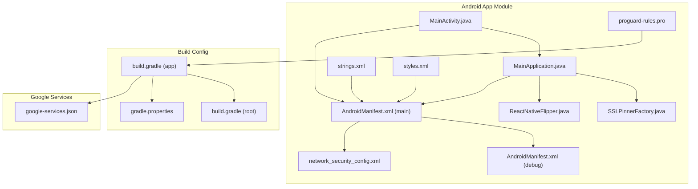
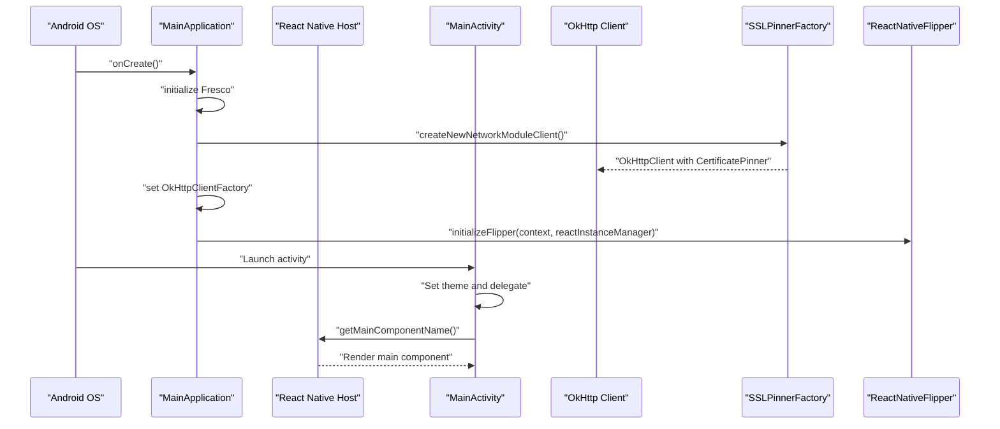
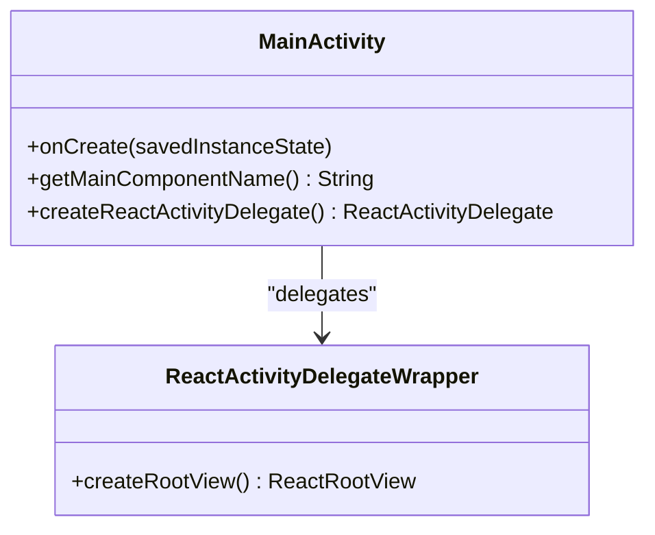
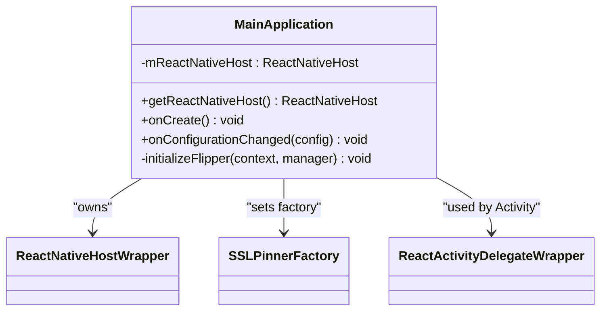
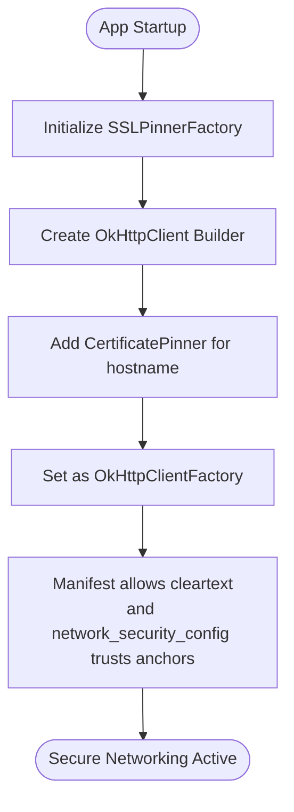
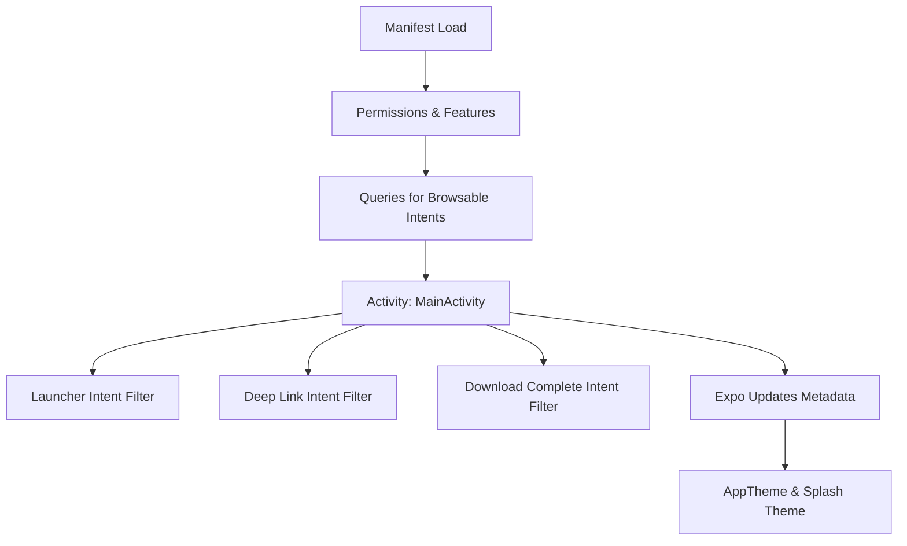
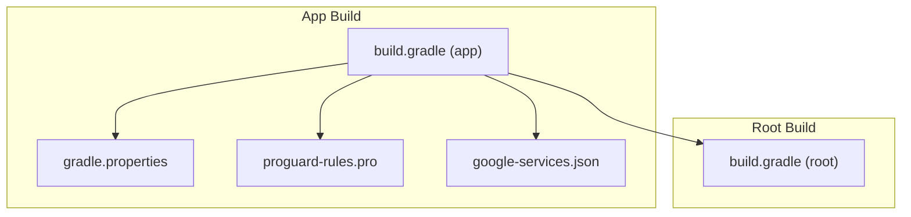
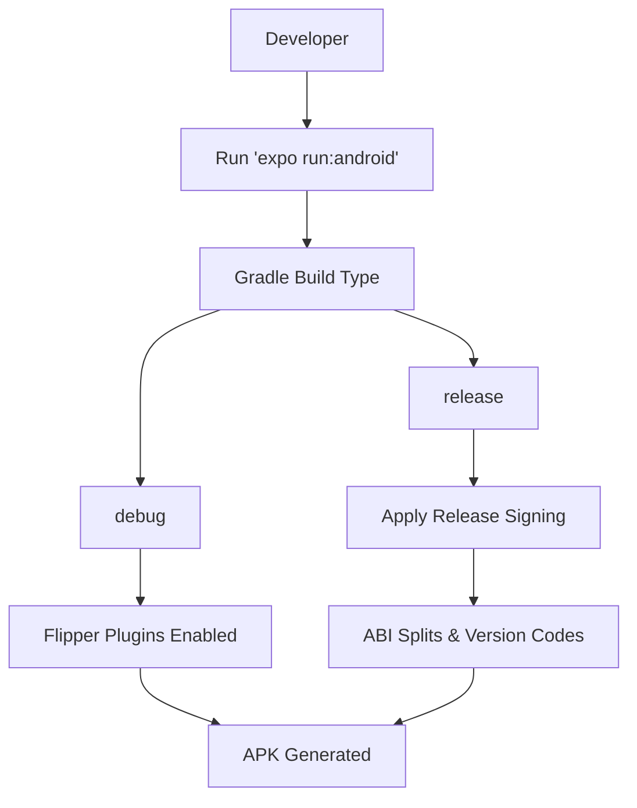
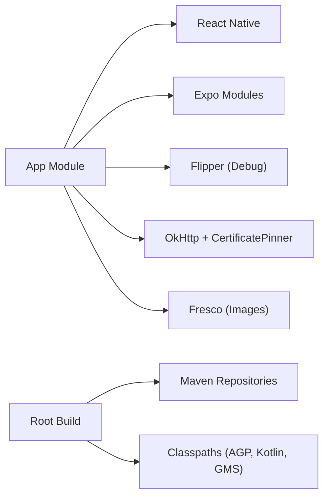

# Android Integration

<cite>
**Referenced Files in This Document**
- [MainActivity.java](file://android/app/src/main/java/com/happimynd/MainActivity.java)
- [MainApplication.java](file://android/app/src/main/java/com/happimynd/MainApplication.java)
- [SSLPinnerFactory.java](file://android/app/src/main/java/com/happimynd/SSLPinnerFactory.java)
- [AndroidManifest.xml (main)](file://android/app/src/main/AndroidManifest.xml)
- [AndroidManifest.xml (debug)](file://android/app/src/debug/AndroidManifest.xml)
- [network_security_config.xml](file://android/app/src/main/res/xml/network_security_config.xml)
- [google-services.json](file://android/app/google-services.json)
- [build.gradle (app)](file://android/app/build.gradle)
- [gradle.properties](file://android/gradle.properties)
- [build.gradle (root)](file://android/build.gradle)
- [proguard-rules.pro](file://android/app/proguard-rules.pro)
- [ReactNativeFlipper.java](file://android/app/src/debug/java/com/happimynd/ReactNativeFlipper.java)
- [strings.xml](file://android/app/src/main/res/values/strings.xml)
- [styles.xml](file://android/app/src/main/res/values/styles.xml)
- [package.json](file://package.json)
</cite>

## Table of Contents
1. [Introduction](#introduction)
2. [Project Structure](#project-structure)
3. [Core Components](#core-components)
4. [Architecture Overview](#architecture-overview)
5. [Detailed Component Analysis](#detailed-component-analysis)
6. [Dependency Analysis](#dependency-analysis)
7. [Performance Considerations](#performance-considerations)
8. [Troubleshooting Guide](#troubleshooting-guide)
9. [Conclusion](#conclusion)
10. [Appendices](#appendices)

## Introduction
This document explains the Android integration for HappiMynd’s React Native platform implementation. It covers the React Native bridge setup in MainActivity, application lifecycle and intent handling, MainApplication initialization including Flipper debugging and SSL pinning, Android manifest permissions and Google Services integration, Gradle build configuration, signing and build variants, debug and release processes, ProGuard/R8 configuration, APK generation, Android-specific security measures, and troubleshooting guidance for common issues.

## Project Structure
The Android implementation resides under the android/app directory and integrates with React Native and Expo modules. Key areas include:
- Java/Kotlin entry points: MainActivity and MainApplication
- Security: SSL pinning factory and network security config
- Manifest: permissions, activities, intent filters, and metadata
- Build: Gradle configuration, signing, and ProGuard rules
- Debugging: Flipper integration for network and React debugging

**Diagram sources**
- [MainActivity.java:1-42](file://android/app/src/main/java/com/happimynd/MainActivity.java#L1-L42)
- [MainApplication.java:1-108](file://android/app/src/main/java/com/happimynd/MainApplication.java#L1-L108)
- [SSLPinnerFactory.java:1-22](file://android/app/src/main/java/com/happimynd/SSLPinnerFactory.java#L1-L22)
- [AndroidManifest.xml (main):1-67](file://android/app/src/main/AndroidManifest.xml#L1-L67)
- [AndroidManifest.xml (debug):1-8](file://android/app/src/debug/AndroidManifest.xml#L1-L8)
- [network_security_config.xml:1-10](file://android/app/src/main/res/xml/network_security_config.xml#L1-L10)
- [ReactNativeFlipper.java:1-69](file://android/app/src/debug/java/com/happimynd/ReactNativeFlipper.java#L1-L69)
- [strings.xml:1-5](file://android/app/src/main/res/values/strings.xml#L1-L5)
- [styles.xml:1-16](file://android/app/src/main/res/values/styles.xml#L1-L16)
- [proguard-rules.pro:1-17](file://android/app/proguard-rules.pro#L1-L17)
- [build.gradle (app):1-288](file://android/app/build.gradle#L1-L288)
- [build.gradle (root):1-55](file://android/build.gradle#L1-L55)
- [gradle.properties:1-55](file://android/gradle.properties#L1-L55)
- [google-services.json:1-55](file://android/app/google-services.json#L1-L55)

**Section sources**
- [MainActivity.java:1-42](file://android/app/src/main/java/com/happimynd/MainActivity.java#L1-L42)
- [MainApplication.java:1-108](file://android/app/src/main/java/com/happimynd/MainApplication.java#L1-L108)
- [SSLPinnerFactory.java:1-22](file://android/app/src/main/java/com/happimynd/SSLPinnerFactory.java#L1-L22)
- [AndroidManifest.xml (main):1-67](file://android/app/src/main/AndroidManifest.xml#L1-L67)
- [AndroidManifest.xml (debug):1-8](file://android/app/src/debug/AndroidManifest.xml#L1-L8)
- [network_security_config.xml:1-10](file://android/app/src/main/res/xml/network_security_config.xml#L1-L10)
- [ReactNativeFlipper.java:1-69](file://android/app/src/debug/java/com/happimynd/ReactNativeFlipper.java#L1-L69)
- [strings.xml:1-5](file://android/app/src/main/res/values/strings.xml#L1-L5)
- [styles.xml:1-16](file://android/app/src/main/res/values/styles.xml#L1-L16)
- [proguard-rules.pro:1-17](file://android/app/proguard-rules.pro#L1-L17)
- [build.gradle (app):1-288](file://android/app/build.gradle#L1-L288)
- [build.gradle (root):1-55](file://android/build.gradle#L1-L55)
- [gradle.properties:1-55](file://android/gradle.properties#L1-L55)
- [google-services.json:1-55](file://android/app/google-services.json#L1-L55)

## Core Components
- MainActivity: ReactActivity subclass that sets the theme early, configures the main component name, and delegates ReactRootView creation through a wrapper.
- MainApplication: ReactApplication that initializes Fresco, sets a custom SSL pinner factory for OkHttp, initializes Flipper in debug builds, and forwards lifecycle events to Expo.
- SSLPinnerFactory: Provides an OkHttpClient with certificate pinning for a specific hostname and integrates with React Native’s networking provider.
- AndroidManifest: Declares permissions, features, application metadata, and activity intent filters including deep links and downloads.
- Build Configuration: Gradle app module defines dependencies, signing, build types, ABI splits, and applies Google Services plugin; root Gradle defines repositories and classpaths; gradle.properties centralizes global settings.

**Section sources**
- [MainActivity.java:11-41](file://android/app/src/main/java/com/happimynd/MainActivity.java#L11-L41)
- [MainApplication.java:27-107](file://android/app/src/main/java/com/happimynd/MainApplication.java#L27-L107)
- [SSLPinnerFactory.java:9-22](file://android/app/src/main/java/com/happimynd/SSLPinnerFactory.java#L9-L22)
- [AndroidManifest.xml (main):1-67](file://android/app/src/main/AndroidManifest.xml#L1-L67)
- [build.gradle (app):126-214](file://android/app/build.gradle#L126-L214)
- [build.gradle (root):1-55](file://android/build.gradle#L1-L55)
- [gradle.properties:31-55](file://android/gradle.properties#L31-L55)

## Architecture Overview
The Android app bootstraps React Native via MainApplication and exposes the main JS component through MainActivity. Networking traffic is secured with SSL pinning, and debugging is enabled in debug builds via Flipper. Google Services integration is configured via google-services.json and applied in the app module.

**Diagram sources**
- [MainApplication.java:62-69](file://android/app/src/main/java/com/happimynd/MainApplication.java#L62-L69)
- [SSLPinnerFactory.java:12-21](file://android/app/src/main/java/com/happimynd/SSLPinnerFactory.java#L12-L21)
- [MainActivity.java:25-39](file://android/app/src/main/java/com/happimynd/MainActivity.java#L25-L39)
- [ReactNativeFlipper.java:28-68](file://android/app/src/debug/java/com/happimynd/ReactNativeFlipper.java#L28-L68)

## Detailed Component Analysis

### MainActivity Configuration
- Theme initialization occurs before onCreate to support splash screen theming.
- The main component name is returned for React Native to render.
- A ReactActivityDelegate wrapper creates a ReactRootView for rendering.

**Diagram sources**
- [MainActivity.java:11-41](file://android/app/src/main/java/com/happimynd/MainActivity.java#L11-L41)

**Section sources**
- [MainActivity.java:12-39](file://android/app/src/main/java/com/happimynd/MainActivity.java#L12-L39)
- [styles.xml:13-15](file://android/app/src/main/res/values/styles.xml#L13-L15)

### MainApplication Setup
- ReactNativeHost configuration:
  - Developer support toggled by build type.
  - Packages loaded via PackageList; additional packages can be added.
  - JS entry module name is index.
  - JSI module package is null.
- Lifecycle and initialization:
  - Fresco image pipeline initialization.
  - SSLPinnerFactory injected into OkHttpClientProvider.
  - SoLoader initialized.
  - Flipper initialized conditionally in debug builds.
  - Expo ApplicationLifecycleDispatcher invoked for configuration changes.

**Diagram sources**
- [MainApplication.java:27-107](file://android/app/src/main/java/com/happimynd/MainApplication.java#L27-L107)
- [SSLPinnerFactory.java:9-22](file://android/app/src/main/java/com/happimynd/SSLPinnerFactory.java#L9-L22)

**Section sources**
- [MainApplication.java:27-107](file://android/app/src/main/java/com/happimynd/MainApplication.java#L27-L107)

### SSL Pinning and Security
- SSLPinnerFactory:
  - Creates an OkHttpClient builder using React Native defaults.
  - Adds a CertificatePinner for a specific hostname.
  - Returns the configured client.
- Network security configuration:
  - network_security_config.xml allows cleartext traffic and trusts system and user certificates.
- Manifest-level cleartext traffic is permitted for development.

**Diagram sources**
- [SSLPinnerFactory.java:12-21](file://android/app/src/main/java/com/happimynd/SSLPinnerFactory.java#L12-L21)
- [network_security_config.xml:1-10](file://android/app/src/main/res/xml/network_security_config.xml#L1-L10)
- [AndroidManifest.xml (main):35-35](file://android/app/src/main/AndroidManifest.xml#L35-L35)

**Section sources**
- [SSLPinnerFactory.java:9-22](file://android/app/src/main/java/com/happimynd/SSLPinnerFactory.java#L9-L22)
- [network_security_config.xml:1-10](file://android/app/src/main/res/xml/network_security_config.xml#L1-L10)
- [AndroidManifest.xml (main):35-35](file://android/app/src/main/AndroidManifest.xml#L35-L35)

### Android Manifest Configuration
- Permissions:
  - Network, audio, camera, storage, vibration, notifications, and others declared.
- Features:
  - Camera and autofocus as not required.
  - Microphone as not required.
- Intent filters:
  - Launcher action for app icon.
  - Deep link scheme com.happimynd for external URLs.
  - Download completion action.
- Application metadata:
  - Expo updates disabled and configured with explicit update settings.
  - Theme and splash screen theme applied.
- Queries:
  - Declares browsable intent for https scheme.

**Diagram sources**
- [AndroidManifest.xml (main):5-66](file://android/app/src/main/AndroidManifest.xml#L5-L66)
- [strings.xml:1-5](file://android/app/src/main/res/values/strings.xml#L1-L5)
- [styles.xml:13-15](file://android/app/src/main/res/values/styles.xml#L13-L15)

**Section sources**
- [AndroidManifest.xml (main):5-66](file://android/app/src/main/AndroidManifest.xml#L5-L66)
- [strings.xml:1-5](file://android/app/src/main/res/values/strings.xml#L1-L5)
- [styles.xml:1-16](file://android/app/src/main/res/values/styles.xml#L1-L16)

### Google Services Integration
- google-services.json contains project info, OAuth clients, API keys, and service configurations for Firebase.
- The app Gradle module applies the Google Services plugin to enable Firebase services.

**Diagram sources**
- [google-services.json:1-55](file://android/app/google-services.json#L1-L55)
- [build.gradle (app):287-287](file://android/app/build.gradle#L287-L287)

**Section sources**
- [google-services.json:1-55](file://android/app/google-services.json#L1-L55)
- [build.gradle (app):287-287](file://android/app/build.gradle#L287-L287)

### Gradle Build Configuration
- App module:
  - React Native and Expo modules included.
  - Dependencies include Flipper plugins for debug builds.
  - Build types: debug and release with signing configs.
  - ABI splits enabled with version code overrides per architecture.
  - ProGuard/R8 rules applied.
  - Google Services plugin applied.
- Root module:
  - Repositories include local React Native and JSC engines, Maven Central, JCenter, and JitPack.
  - Classpaths for Android Gradle Plugin, Kotlin, and Google Services.
- Properties:
  - AndroidX enabled and Jetifier enabled.
  - Flipper version and JS engine selection.
  - Signing credentials for release.

**Diagram sources**
- [build.gradle (app):126-288](file://android/app/build.gradle#L126-L288)
- [gradle.properties:31-55](file://android/gradle.properties#L31-L55)
- [proguard-rules.pro:1-17](file://android/app/proguard-rules.pro#L1-L17)
- [build.gradle (root):27-45](file://android/build.gradle#L27-L45)

**Section sources**
- [build.gradle (app):126-288](file://android/app/build.gradle#L126-L288)
- [build.gradle (root):1-55](file://android/build.gradle#L1-L55)
- [gradle.properties:31-55](file://android/gradle.properties#L31-L55)

### Debug and Release Processes
- Debug build:
  - Flipper plugins included.
  - Cleartext traffic allowed in debug manifest.
  - Hermes or JSC selected via properties.
- Release build:
  - Signing configured with keystore and passwords from properties.
  - Minification and resource shrinking controlled by properties.
  - ABI splits produce architecture-specific APKs with unique version codes.

**Diagram sources**
- [build.gradle (app):168-214](file://android/app/build.gradle#L168-L214)
- [gradle.properties:52-55](file://android/gradle.properties#L52-L55)
- [AndroidManifest.xml (debug):6-6](file://android/app/src/debug/AndroidManifest.xml#L6-L6)

**Section sources**
- [build.gradle (app):168-214](file://android/app/build.gradle#L168-L214)
- [gradle.properties:52-55](file://android/gradle.properties#L52-L55)
- [AndroidManifest.xml (debug):6-6](file://android/app/src/debug/AndroidManifest.xml#L6-L6)

### ProGuard/R8 and APK Generation
- ProGuard/R8:
  - Enabled in release builds according to properties.
  - Project-specific keep rules for Reanimated, Hermes, JNI, TurboModules, SVG, and DevSupport are defined.
- APK generation:
  - Universal and architecture-specific APKs produced via ABI splits.
  - Version code override per ABI ensures correct Play Store handling.

**Section sources**
- [build.gradle (app):102-102](file://android/app/build.gradle#L102-L102)
- [proguard-rules.pro:10-17](file://android/app/proguard-rules.pro#L10-L17)
- [build.gradle (app):201-213](file://android/app/build.gradle#L201-L213)

### Android-Specific Security Implementations
- SSL pinning via SSLPinnerFactory ensures only pinned certificates are trusted for the configured hostname.
- Network security configuration trusts system and user certificates while allowing cleartext for development.
- Manifest-level permissions and features define capabilities and hardware requirements.

**Section sources**
- [SSLPinnerFactory.java:9-22](file://android/app/src/main/java/com/happimynd/SSLPinnerFactory.java#L9-L22)
- [network_security_config.xml:1-10](file://android/app/src/main/res/xml/network_security_config.xml#L1-L10)
- [AndroidManifest.xml (main):5-19](file://android/app/src/main/AndroidManifest.xml#L5-L19)

### Integration with Android Native Modules and Third-Party SDKs
- Expo modules integrated via project dependencies (e.g., firebase-analytics, firebase-core, splash-screen).
- Twilio video package included via a manual package registration.
- Flipper plugins included for debugging network and React Native behavior in debug builds.
- Hermes or JSC selected via gradle properties; dependencies reflect the chosen engine.

**Section sources**
- [build.gradle (app):222-281](file://android/app/build.gradle#L222-L281)
- [MainApplication.java:24-25](file://android/app/src/main/java/com/happimynd/MainApplication.java#L24-L25)
- [ReactNativeFlipper.java:26-27](file://android/app/src/debug/java/com/happimynd/ReactNativeFlipper.java#L26-L27)

## Dependency Analysis
The app module depends on React Native, Expo modules, Flipper (debug), and optional media/image libraries. The root module configures repositories and classpaths for Android tooling and Google Services.

**Diagram sources**
- [build.gradle (app):216-281](file://android/app/build.gradle#L216-L281)
- [build.gradle (root):27-45](file://android/build.gradle#L27-L45)

**Section sources**
- [build.gradle (app):216-281](file://android/app/build.gradle#L216-L281)
- [build.gradle (root):27-45](file://android/build.gradle#L27-L45)

## Performance Considerations
- Enable Hermes or JSC based on performance goals; Hermes requires matching AARs.
- Keep minification and resource shrinking enabled in release for smaller APKs.
- Use ABI splits to reduce APK size but ensure Play Store upload of all architectures.
- Avoid unnecessary Flipper plugins in release builds.

[No sources needed since this section provides general guidance]

## Troubleshooting Guide
- Flipper not starting in release:
  - Flipper initialization is guarded by a debug check; it will not initialize in release builds.
- SSL pinning failures:
  - Verify the pinned hostname and certificate pins match the target domain.
  - Confirm the factory is set during application startup.
- Manifest merge conflicts:
  - Review intent filters and meta-data for duplicates or conflicting declarations.
- Signing errors:
  - Ensure keystore file path and passwords match gradle.properties.
- ProGuard/R8 issues:
  - Add missing keep rules for custom native modules or third-party libraries.
- Debug vs release differences:
  - Confirm debuggable flags and cleartext traffic allowances per build type.

**Section sources**
- [MainApplication.java:84-106](file://android/app/src/main/java/com/happimynd/MainApplication.java#L84-L106)
- [SSLPinnerFactory.java:9-22](file://android/app/src/main/java/com/happimynd/SSLPinnerFactory.java#L9-L22)
- [AndroidManifest.xml (main):41-66](file://android/app/src/main/AndroidManifest.xml#L41-L66)
- [gradle.properties:52-55](file://android/gradle.properties#L52-L55)
- [proguard-rules.pro:10-17](file://android/app/proguard-rules.pro#L10-L17)

## Conclusion
HappiMynd’s Android integration leverages React Native with Expo modules, secure networking via SSL pinning, and robust debugging with Flipper in debug builds. The Gradle configuration supports modern Android tooling, ABI splits, and Google Services. Properly managing permissions, signing, and ProGuard/R8 ensures reliable builds and distribution.

[No sources needed since this section summarizes without analyzing specific files]

## Appendices
- Additional runtime configuration and native module integrations are managed through Expo modules and Gradle dependencies as defined in the app and root build files.

**Section sources**
- [build.gradle (app):222-281](file://android/app/build.gradle#L222-L281)
- [build.gradle (root):27-45](file://android/build.gradle#L27-L45)