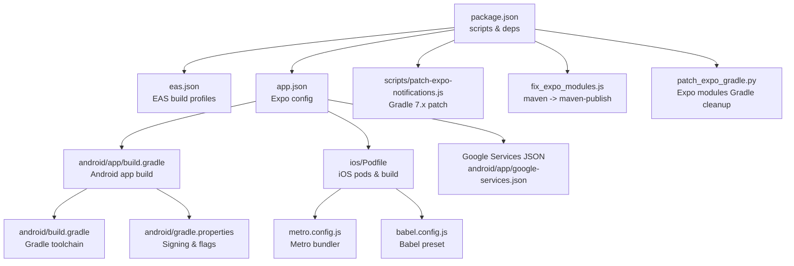
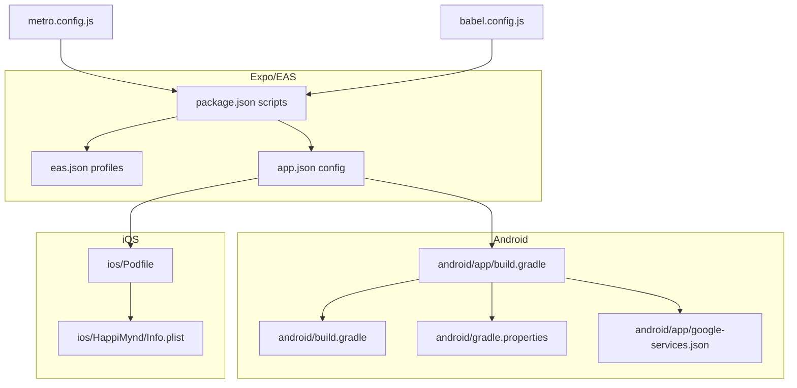
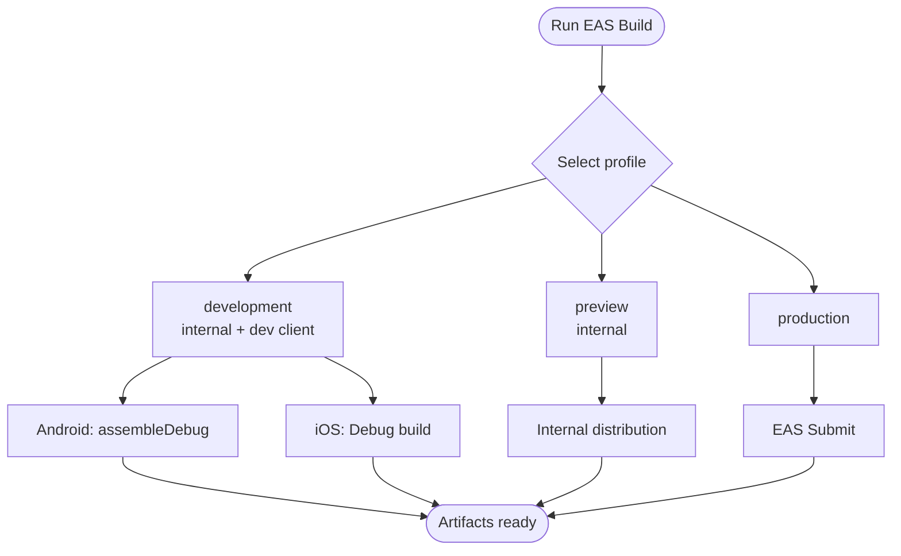
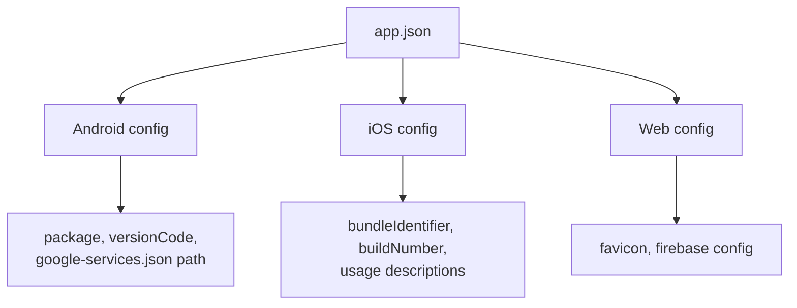
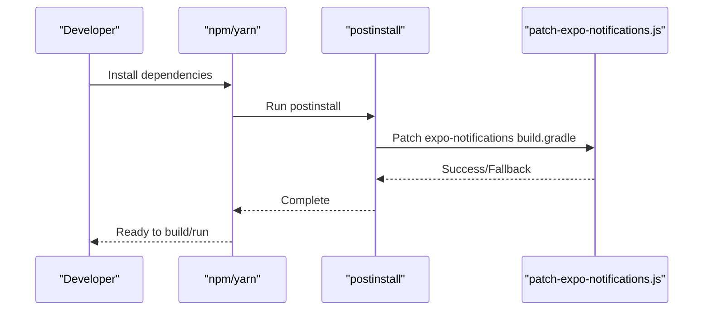
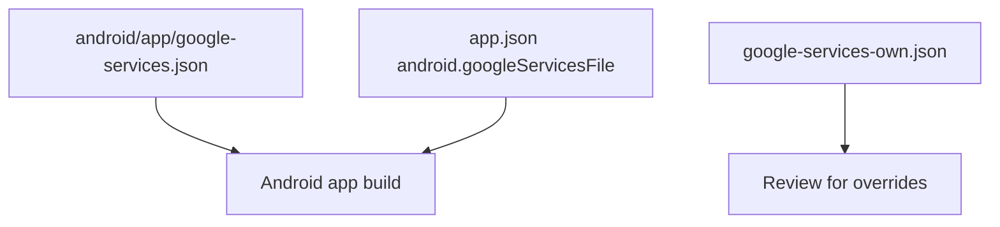
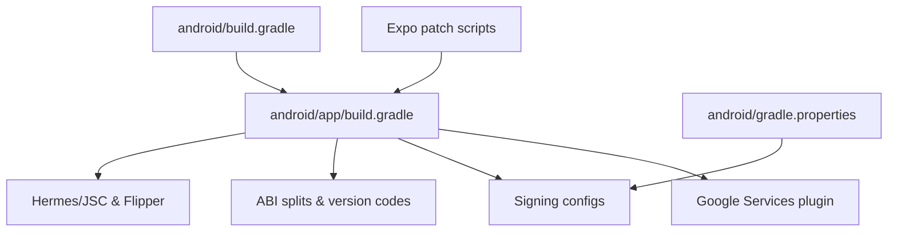
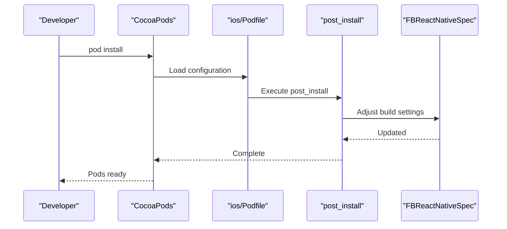
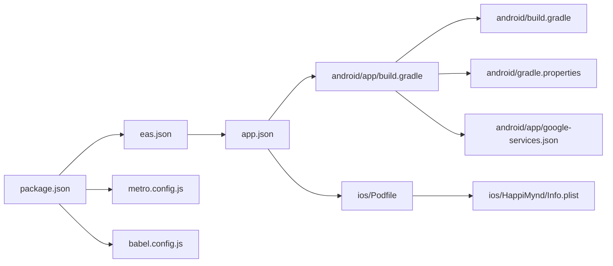

# Build and Deployment

<cite>
**Referenced Files in This Document**
- [package.json](file://package.json)
- [eas.json](file://eas.json)
- [app.json](file://app.json)
- [google-services-own.json](file://google-services-own.json)
- [android/app/google-services.json](file://android/app/google-services.json)
- [scripts/patch-expo-notifications.js](file://scripts/patch-expo-notifications.js)
- [fix_expo_modules.js](file://fix_expo_modules.js)
- [patch_expo_gradle.py](file://patch_expo_gradle.py)
- [android/app/build.gradle](file://android/app/build.gradle)
- [android/build.gradle](file://android/build.gradle)
- [android/gradle.properties](file://android/gradle.properties)
- [ios/Podfile](file://ios/Podfile)
- [metro.config.js](file://metro.config.js)
- [babel.config.js](file://babel.config.js)
- [ios/HappiMynd/Info.plist](file://ios/HappiMynd/Info.plist)
</cite>

## Table of Contents
1. [Introduction](#introduction)
2. [Project Structure](#project-structure)
3. [Core Components](#core-components)
4. [Architecture Overview](#architecture-overview)
5. [Detailed Component Analysis](#detailed-component-analysis)
6. [Dependency Analysis](#dependency-analysis)
7. [Performance Considerations](#performance-considerations)
8. [Troubleshooting Guide](#troubleshooting-guide)
9. [Conclusion](#conclusion)
10. [Appendices](#appendices)

## Introduction
This document explains the multi-platform build and deployment system for HappiMynd, covering EAS Build configuration, Expo app configuration, scripts and dependencies, Google Services setup, Android and iOS build customization, and deployment strategies. It also includes CI/CD workflows, automated testing integration, release management, and troubleshooting guidance for build and deployment issues.

## Project Structure
The repository is an Expo-based React Native project with platform-specific native configurations under android/ and ios/. Build orchestration is driven by EAS Build and Expo CLI scripts, with Gradle and CocoaPods managing Android and iOS native builds respectively.

**Diagram sources**
- [package.json:1-101](file://package.json#L1-L101)
- [eas.json:1-25](file://eas.json#L1-L25)
- [app.json:1-52](file://app.json#L1-L52)
- [android/app/build.gradle:1-288](file://android/app/build.gradle#L1-L288)
- [android/build.gradle:1-55](file://android/build.gradle#L1-L55)
- [android/gradle.properties:1-55](file://android/gradle.properties#L1-L55)
- [ios/Podfile:1-124](file://ios/Podfile#L1-L124)
- [metro.config.js:1-5](file://metro.config.js#L1-L5)
- [babel.config.js:1-7](file://babel.config.js#L1-L7)
- [android/app/google-services.json:1-55](file://android/app/google-services.json#L1-L55)
- [scripts/patch-expo-notifications.js:1-102](file://scripts/patch-expo-notifications.js#L1-L102)
- [fix_expo_modules.js:1-59](file://fix_expo_modules.js#L1-L59)
- [patch_expo_gradle.py:1-117](file://patch_expo_gradle.py#L1-L117)

**Section sources**
- [package.json:1-101](file://package.json#L1-L101)
- [eas.json:1-25](file://eas.json#L1-L25)
- [app.json:1-52](file://app.json#L1-L52)

## Core Components
- EAS Build configuration defines three build profiles: development (internal distribution, development client), preview (internal distribution), and production. Platform-specific overrides are present for Android and iOS build commands.
- Expo app configuration sets app metadata, splash screen, updates policy, platform identifiers, permissions, and Google Services integration for Android.
- Scripts handle Expo module patching for Gradle 7.x compatibility and prepare native dependencies for modern Gradle versions.
- Android Gradle build integrates Google Services, signing configuration, ABI splits, and Hermes/JSC selection.
- iOS CocoaPods configuration enables Expo modules and native dependencies, with post-install adjustments.

**Section sources**
- [eas.json:1-25](file://eas.json#L1-L25)
- [app.json:1-52](file://app.json#L1-L52)
- [scripts/patch-expo-notifications.js:1-102](file://scripts/patch-expo-notifications.js#L1-L102)
- [fix_expo_modules.js:1-59](file://fix_expo_modules.js#L1-L59)
- [patch_expo_gradle.py:1-117](file://patch_expo_gradle.py#L1-L117)
- [android/app/build.gradle:1-288](file://android/app/build.gradle#L1-L288)
- [ios/Podfile:1-124](file://ios/Podfile#L1-L124)

## Architecture Overview
The build pipeline combines Expo CLI and EAS Build for cross-platform builds, with platform-specific Gradle and CocoaPods steps. Google Services JSON is integrated into the Android app build. Metro and Babel configure the JS bundling and transpilation.

**Diagram sources**
- [package.json:1-101](file://package.json#L1-L101)
- [eas.json:1-25](file://eas.json#L1-L25)
- [app.json:1-52](file://app.json#L1-L52)
- [android/app/build.gradle:1-288](file://android/app/build.gradle#L1-L288)
- [android/build.gradle:1-55](file://android/build.gradle#L1-L55)
- [android/gradle.properties:1-55](file://android/gradle.properties#L1-L55)
- [android/app/google-services.json:1-55](file://android/app/google-services.json#L1-L55)
- [ios/Podfile:1-124](file://ios/Podfile#L1-L124)
- [ios/HappiMynd/Info.plist:1-96](file://ios/HappiMynd/Info.plist#L1-L96)
- [metro.config.js:1-5](file://metro.config.js#L1-L5)
- [babel.config.js:1-7](file://babel.config.js#L1-L7)

## Detailed Component Analysis

### EAS Build Configuration
- Profiles:
  - development: internal distribution, development client, Android debug assemble command, iOS Debug build configuration.
  - preview: internal distribution.
  - production: empty profile suitable for EAS Submit.
- Environment variables and secrets are referenced via Android gradle.properties placeholders for keystore and keys.

**Diagram sources**
- [eas.json:5-20](file://eas.json#L5-L20)

**Section sources**
- [eas.json:1-25](file://eas.json#L1-L25)
- [android/gradle.properties:52-55](file://android/gradle.properties#L52-L55)

### Expo Configuration (app.json)
- App identity and metadata: name, slug, version, orientation, icon, splash.
- Updates policy disabled for production builds.
- Asset bundling pattern includes all assets.
- iOS:
  - Permissions and usage descriptions.
  - Bundle identifier and build number.
- Android:
  - Adaptive icon, package name, permissions, version code, Google Services file path, Next Notifications API enabled.
- Web:
  - Favicon and Firebase config placeholder.
- Extra:
  - EAS project ID for EAS-managed workflows.

**Diagram sources**
- [app.json:1-52](file://app.json#L1-L52)

**Section sources**
- [app.json:1-52](file://app.json#L1-L52)

### Package Scripts and Dependencies
- Scripts:
  - start, android, ios, web, eject, postinstall, build:ios.
- Dependencies include Expo SDK, navigation, Firebase, media, animations, and numerous community RN modules.
- postinstall runs jetifier and the Expo notifications patch script.

**Diagram sources**
- [package.json:4-12](file://package.json#L4-L12)
- [scripts/patch-expo-notifications.js:1-102](file://scripts/patch-expo-notifications.js#L1-L102)

**Section sources**
- [package.json:1-101](file://package.json#L1-L101)
- [scripts/patch-expo-notifications.js:1-102](file://scripts/patch-expo-notifications.js#L1-L102)

### Google Services Configuration
- Two Google Services JSON files are present:
  - android/app/google-services.json: primary Android Services config for the app.
  - google-services-own.json: alternate or secondary configuration.
- app.json references the Android Google Services file path for integration.

**Diagram sources**
- [android/app/google-services.json:1-55](file://android/app/google-services.json#L1-L55)
- [google-services-own.json:1-40](file://google-services-own.json#L1-L40)
- [app.json:33](file://app.json#L33)

**Section sources**
- [android/app/google-services.json:1-55](file://android/app/google-services.json#L1-L55)
- [google-services-own.json:1-40](file://google-services-own.json#L1-L40)
- [app.json:33](file://app.json#L33)

### Android Build Scripts and Gradle Modifications
- Expo module patching scripts:
  - patch-expo-notifications.js: fixes expo-notifications build.gradle for Gradle 7.x compatibility.
  - fix_expo_modules.js: replaces deprecated maven plugin with maven-publish in Expo modules.
  - patch_expo_gradle.py: removes maven publishing blocks and tasks from multiple Expo module build.gradle files.
- Android app build.gradle:
  - Integrates Google Services plugin.
  - Defines signing configs for debug and release using gradle.properties placeholders.
  - Splits ABIs and overrides version codes per architecture.
  - Supports Hermes/JSC selection and Flipper debug dependencies.
- Top-level android/build.gradle:
  - Sets Gradle, Kotlin, and Android SDK versions.
  - Configures repositories and classpaths for Google Services and Android Gradle Plugin.

**Diagram sources**
- [scripts/patch-expo-notifications.js:1-102](file://scripts/patch-expo-notifications.js#L1-L102)
- [fix_expo_modules.js:1-59](file://fix_expo_modules.js#L1-L59)
- [patch_expo_gradle.py:1-117](file://patch_expo_gradle.py#L1-L117)
- [android/app/build.gradle:1-288](file://android/app/build.gradle#L1-L288)
- [android/build.gradle:1-55](file://android/build.gradle#L1-L55)
- [android/gradle.properties:1-55](file://android/gradle.properties#L1-L55)

**Section sources**
- [scripts/patch-expo-notifications.js:1-102](file://scripts/patch-expo-notifications.js#L1-L102)
- [fix_expo_modules.js:1-59](file://fix_expo_modules.js#L1-L59)
- [patch_expo_gradle.py:1-117](file://patch_expo_gradle.py#L1-L117)
- [android/app/build.gradle:1-288](file://android/app/build.gradle#L1-L288)
- [android/build.gradle:1-55](file://android/build.gradle#L1-L55)
- [android/gradle.properties:1-55](file://android/gradle.properties#L1-L55)

### iOS Build Configuration
- ios/Podfile:
  - Uses Expo autolinking and native modules.
  - Enables permissions pods for Camera/Microphone.
  - Includes RNIap and react-native-twilio-video-webrtc.
  - Post-install adjusts FBReactNativeSpec build settings.
- Info.plist:
  - App display name, identifiers, marketing version, and project version.
  - URL scheme for deep linking.
  - Network security exceptions for development domains.
  - Microphone usage description.

**Diagram sources**
- [ios/Podfile:65-124](file://ios/Podfile#L65-L124)
- [ios/HappiMynd/Info.plist:1-96](file://ios/HappiMynd/Info.plist#L1-L96)

**Section sources**
- [ios/Podfile:1-124](file://ios/Podfile#L1-L124)
- [ios/HappiMynd/Info.plist:1-96](file://ios/HappiMynd/Info.plist#L1-L96)

### Metro and Babel Configuration
- Metro configuration extends Expo’s default configuration.
- Babel preset is Expo’s preset for React Native.

**Section sources**
- [metro.config.js:1-5](file://metro.config.js#L1-L5)
- [babel.config.js:1-7](file://babel.config.js#L1-L7)

## Dependency Analysis
- EAS Build depends on app.json for app metadata and platform identifiers, and on package.json scripts for local development and bundling.
- Android build depends on:
  - app.json for google-services.json path.
  - android/app/build.gradle for dependencies and plugins.
  - android/gradle.properties for keystore and engine flags.
  - android/build.gradle for toolchain versions.
- iOS build depends on:
  - ios/Podfile for native modules and permissions.
  - ios/HappiMynd/Info.plist for app identifiers and usage descriptions.

**Diagram sources**
- [eas.json:1-25](file://eas.json#L1-L25)
- [app.json:1-52](file://app.json#L1-L52)
- [package.json:1-101](file://package.json#L1-L101)
- [metro.config.js:1-5](file://metro.config.js#L1-L5)
- [babel.config.js:1-7](file://babel.config.js#L1-L7)
- [android/app/build.gradle:1-288](file://android/app/build.gradle#L1-L288)
- [android/build.gradle:1-55](file://android/build.gradle#L1-L55)
- [android/gradle.properties:1-55](file://android/gradle.properties#L1-L55)
- [android/app/google-services.json:1-55](file://android/app/google-services.json#L1-L55)
- [ios/Podfile:1-124](file://ios/Podfile#L1-L124)
- [ios/HappiMynd/Info.plist:1-96](file://ios/HappiMynd/Info.plist#L1-L96)

**Section sources**
- [eas.json:1-25](file://eas.json#L1-L25)
- [app.json:1-52](file://app.json#L1-L52)
- [android/app/build.gradle:1-288](file://android/app/build.gradle#L1-L288)
- [ios/Podfile:1-124](file://ios/Podfile#L1-L124)

## Performance Considerations
- Enable Hermes for Android to improve runtime performance and reduce bundle size overhead.
- Keep updates disabled in production to avoid over-the-air updates and maintain strict control over releases.
- Use ABI splits judiciously; while they reduce APK size, they increase distribution complexity.
- Configure Gradle JVM args appropriately to balance build speed and stability.
- Minimize asset count and optimize images to reduce bundle size and improve startup time.

[No sources needed since this section provides general guidance]

## Troubleshooting Guide
- Expo notifications Gradle 7.x compatibility:
  - The patch script modifies the expo-notifications build.gradle to replace the deprecated maven plugin and publishing tasks. If builds fail due to maven plugin errors, ensure the postinstall script runs and the patch is applied.
- Expo modules publishing blocks:
  - The fix_expo_modules.js and patch_expo_gradle.py scripts address maven publishing blocks in Expo modules. If Gradle fails with publishing-related errors, run these scripts to update module build files.
- Android signing and keystore:
  - Release builds rely on keystore properties defined in android/gradle.properties. Ensure MYAPP_UPLOAD_* variables are set and the keystore file path is correct.
- Google Services integration:
  - Confirm app.json android.googleServicesFile points to the correct JSON file and that the file matches the app’s package name.
- iOS permissions and usage descriptions:
  - Ensure Info.plist includes required usage descriptions for microphone and camera if the app requests them.
- Metro and Babel:
  - If bundling fails, verify metro.config.js and babel.config.js align with the project’s Expo and React Native versions.

**Section sources**
- [scripts/patch-expo-notifications.js:1-102](file://scripts/patch-expo-notifications.js#L1-L102)
- [fix_expo_modules.js:1-59](file://fix_expo_modules.js#L1-L59)
- [patch_expo_gradle.py:1-117](file://patch_expo_gradle.py#L1-L117)
- [android/gradle.properties:52-55](file://android/gradle.properties#L52-L55)
- [app.json:33](file://app.json#L33)
- [ios/HappiMynd/Info.plist:64-67](file://ios/HappiMynd/Info.plist#L64-L67)
- [metro.config.js:1-5](file://metro.config.js#L1-L5)
- [babel.config.js:1-7](file://babel.config.js#L1-L7)

## Conclusion
HappiMynd’s build and deployment system leverages EAS Build and Expo for streamlined multi-platform development, with targeted Gradle and CocoaPods configurations for Android and iOS. The setup includes critical patches for modern Gradle compatibility, Google Services integration, and secure signing. Following the documented scripts, configurations, and troubleshooting steps ensures reliable builds and deployments across platforms.

[No sources needed since this section summarizes without analyzing specific files]

## Appendices
- Continuous Integration and Delivery:
  - Configure EAS Build triggers on branches and PRs. Use EAS Submit for app store uploads after successful builds. Integrate automated testing (unit, snapshot, e2e) in CI before building to catch regressions early.
- Automated Testing Integration:
  - Add test scripts to package.json and run them in CI before EAS Build jobs. Examples include Jest, Detox, or platform-specific testing frameworks.
- Release Management:
  - Maintain distinct build profiles for development, preview, and production. Use semantic versioning for app versions and track changes in changelogs. Store secrets securely and avoid committing sensitive credentials to the repository.

[No sources needed since this section provides general guidance]