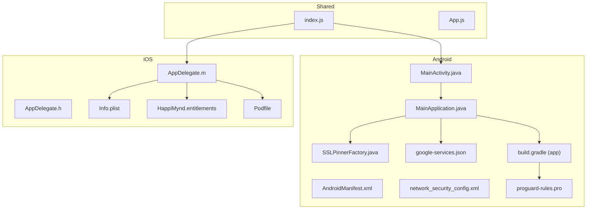
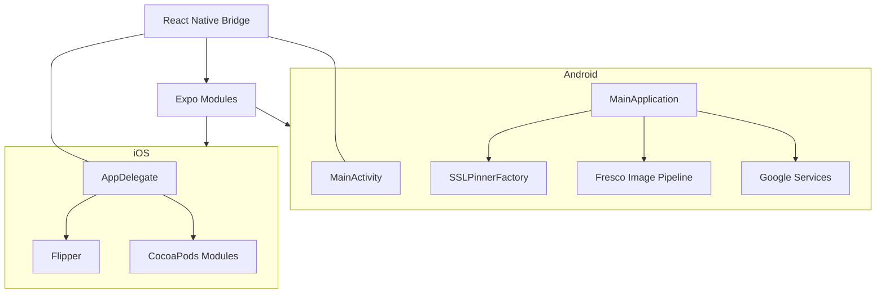
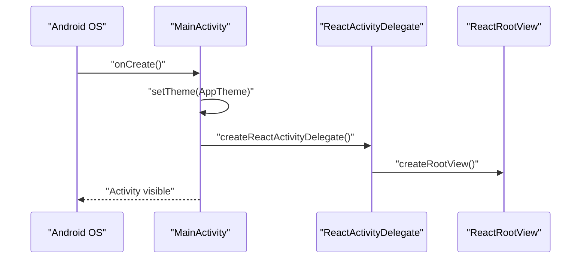
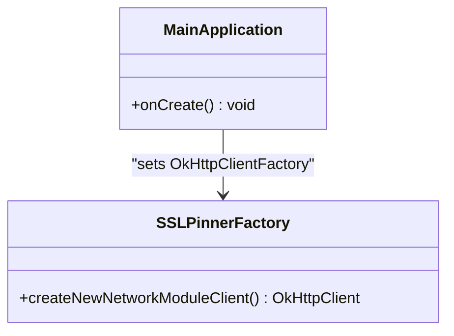
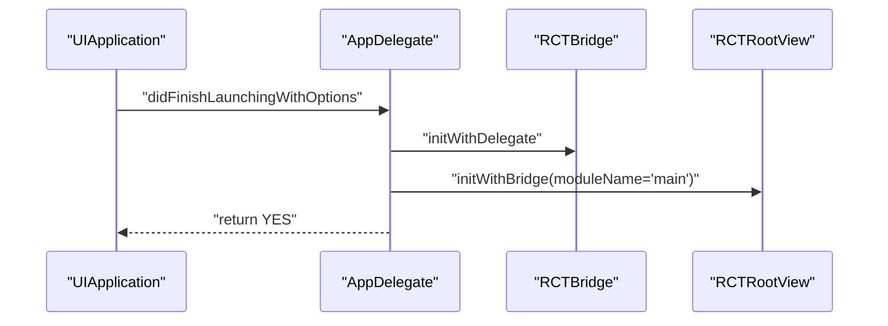
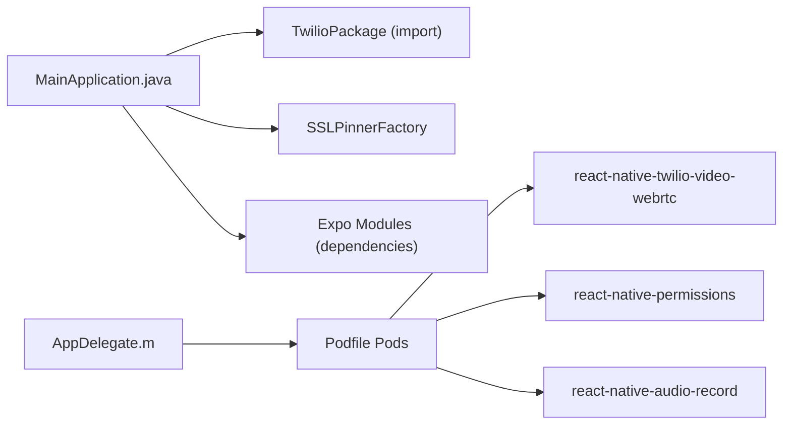

# Native Integration

<cite>
**Referenced Files in This Document**
- [MainActivity.java](file://android/app/src/main/java/com/happimynd/MainActivity.java)
- [MainApplication.java](file://android/app/src/main/java/com/happimynd/MainApplication.java)
- [SSLPinnerFactory.java](file://android/app/src/main/java/com/happimynd/SSLPinnerFactory.java)
- [AndroidManifest.xml](file://android/app/src/main/AndroidManifest.xml)
- [network_security_config.xml](file://android/app/src/main/res/xml/network_security_config.xml)
- [strings.xml](file://android/app/src/main/res/values/strings.xml)
- [google-services.json](file://android/app/google-services.json)
- [build.gradle (app)](file://android/app/build.gradle)
- [build.gradle (project)](file://android/build.gradle)
- [settings.gradle](file://android/settings.gradle)
- [proguard-rules.pro](file://android/app/proguard-rules.pro)
- [AppDelegate.h](file://ios/HappiMynd/AppDelegate.h)
- [AppDelegate.m](file://ios/HappiMynd/AppDelegate.m)
- [Info.plist](file://ios/HappiMynd/Info.plist)
- [HappiMynd.entitlements](file://ios/HappiMynd/HappiMynd.entitlements)
- [Podfile](file://ios/Podfile)
- [App.js](file://App.js)
- [index.js](file://index.js)
- [src/screens/HappiTALK/VideoCall.js](file://src/screens/HappiTALK/VideoCall.js)
- [src/screens/HappiVOICE/VoiceRecord.js](file://src/screens/HappiVOICE/VoiceRecord.js)
- [src/context/Firebase.js](file://src/context/Firebase.js)
- [scripts/patch-expo-notifications.js](file://scripts/patch-expo-notifications.js)
</cite>

## Table of Contents
1. [Introduction](#introduction)
2. [Project Structure](#project-structure)
3. [Core Components](#core-components)
4. [Architecture Overview](#architecture-overview)
5. [Detailed Component Analysis](#detailed-component-analysis)
6. [Dependency Analysis](#dependency-analysis)
7. [Performance Considerations](#performance-considerations)
8. [Troubleshooting Guide](#troubleshooting-guide)
9. [Conclusion](#conclusion)
10. [Appendices](#appendices)

## Introduction
This document provides comprehensive native integration documentation for HappiMynd’s Android and iOS platform-specific implementations. It covers Android configuration (MainActivity setup, permissions, SSL pinning, Google Services), iOS configuration (AppDelegate setup, entitlements, CocoaPods), native module integrations (camera, audio, video calling, push notifications), build configuration (signing, deployment), native bridge patterns, platform-specific optimizations, and troubleshooting.

## Project Structure
HappiMynd uses React Native with Expo, with platform-specific native code under android/ and ios/. The Android app defines MainActivity, MainApplication, and SSL pinning factory. iOS defines AppDelegate and Info.plist for permissions and URL schemes. Native modules are integrated via Expo modules and CocoaPods.

**Diagram sources**
- [MainActivity.java:1-42](file://android/app/src/main/java/com/happimynd/MainActivity.java#L1-L42)
- [MainApplication.java:1-108](file://android/app/src/main/java/com/happimynd/MainApplication.java#L1-L108)
- [SSLPinnerFactory.java:1-22](file://android/app/src/main/java/com/happimynd/SSLPinnerFactory.java#L1-L22)
- [AndroidManifest.xml:1-67](file://android/app/src/main/AndroidManifest.xml#L1-L67)
- [network_security_config.xml:1-10](file://android/app/src/main/res/xml/network_security_config.xml#L1-L10)
- [google-services.json:1-55](file://android/app/google-services.json#L1-L55)
- [build.gradle (app):1-288](file://android/app/build.gradle#L1-L288)
- [proguard-rules.pro:1-17](file://android/app/proguard-rules.pro#L1-L17)
- [AppDelegate.h:1-10](file://ios/HappiMynd/AppDelegate.h#L1-L10)
- [AppDelegate.m:1-92](file://ios/HappiMynd/AppDelegate.m#L1-L92)
- [Info.plist:1-96](file://ios/HappiMynd/Info.plist#L1-L96)
- [HappiMynd.entitlements:1-8](file://ios/HappiMynd/HappiMynd.entitlements#L1-L8)
- [Podfile:1-124](file://ios/Podfile#L1-L124)
- [index.js](file://index.js)
- [App.js](file://App.js)

**Section sources**
- [MainActivity.java:1-42](file://android/app/src/main/java/com/happimynd/MainActivity.java#L1-L42)
- [MainApplication.java:1-108](file://android/app/src/main/java/com/happimynd/MainApplication.java#L1-L108)
- [SSLPinnerFactory.java:1-22](file://android/app/src/main/java/com/happimynd/SSLPinnerFactory.java#L1-L22)
- [AndroidManifest.xml:1-67](file://android/app/src/main/AndroidManifest.xml#L1-L67)
- [network_security_config.xml:1-10](file://android/app/src/main/res/xml/network_security_config.xml#L1-L10)
- [google-services.json:1-55](file://android/app/google-services.json#L1-L55)
- [build.gradle (app):1-288](file://android/app/build.gradle#L1-L288)
- [build.gradle (project):1-55](file://android/build.gradle#L1-L55)
- [settings.gradle:1-10](file://android/settings.gradle#L1-L10)
- [proguard-rules.pro:1-17](file://android/app/proguard-rules.pro#L1-L17)
- [AppDelegate.h:1-10](file://ios/HappiMynd/AppDelegate.h#L1-L10)
- [AppDelegate.m:1-92](file://ios/HappiMynd/AppDelegate.m#L1-L92)
- [Info.plist:1-96](file://ios/HappiMynd/Info.plist#L1-L96)
- [HappiMynd.entitlements:1-8](file://ios/HappiMynd/HappiMynd.entitlements#L1-L8)
- [Podfile:1-124](file://ios/Podfile#L1-L124)
- [index.js](file://index.js)
- [App.js](file://App.js)

## Core Components
- Android entrypoint: MainActivity sets theme and delegates to ReactActivityDelegate.
- Android application: MainApplication initializes Fresco, SSL pinning, Flipper, and Expo lifecycle.
- SSL pinning: Custom OkHttpClientFactory pins certificates for a specific hostname.
- Permissions: AndroidManifest declares internet, camera, microphone, storage, and notification permissions.
- Google Services: google-services.json integrates Firebase/GCM.
- iOS entrypoint: AppDelegate initializes React bridge and root view, supports linking and Flipper.
- iOS permissions: Info.plist declares camera/microphone usage descriptions and URL schemes.
- iOS entitlements: HappiMynd.entitlements configures APNs environment.
- CocoaPods: Podfile lists native modules including Twilio video, permissions, and audio recording.

**Section sources**
- [MainActivity.java:11-41](file://android/app/src/main/java/com/happimynd/MainActivity.java#L11-L41)
- [MainApplication.java:27-107](file://android/app/src/main/java/com/happimynd/MainApplication.java#L27-L107)
- [SSLPinnerFactory.java:9-22](file://android/app/src/main/java/com/happimynd/SSLPinnerFactory.java#L9-L22)
- [AndroidManifest.xml:5-26](file://android/app/src/main/AndroidManifest.xml#L5-L26)
- [google-services.json:1-55](file://android/app/google-services.json#L1-L55)
- [AppDelegate.m:28-91](file://ios/HappiMynd/AppDelegate.m#L28-L91)
- [Info.plist:64-67](file://ios/HappiMynd/Info.plist#L64-L67)
- [HappiMynd.entitlements:5-6](file://ios/HappiMynd/HappiMynd.entitlements#L5-L6)
- [Podfile:85-104](file://ios/Podfile#L85-L104)

## Architecture Overview
The native runtime integrates with React Native via Expo modules. Android uses a custom SSL pinner and Fresco image pipeline. iOS uses Flipper for debugging and CocoaPods for native modules. Push notifications are handled via Expo Notifications and Firebase.

**Diagram sources**
- [MainActivity.java:1-42](file://android/app/src/main/java/com/happimynd/MainActivity.java#L1-L42)
- [MainApplication.java:1-108](file://android/app/src/main/java/com/happimynd/MainApplication.java#L1-L108)
- [SSLPinnerFactory.java:1-22](file://android/app/src/main/java/com/happimynd/SSLPinnerFactory.java#L1-L22)
- [AppDelegate.m:1-92](file://ios/HappiMynd/AppDelegate.m#L1-L92)
- [Podfile:85-104](file://ios/Podfile#L85-L104)

## Detailed Component Analysis

### Android Configuration

#### MainActivity Setup
- Sets theme prior to onCreate to support splash screen theming.
- Returns the main component name for React Native.
- Wraps ReactActivityDelegate to customize root view creation.

**Diagram sources**
- [MainActivity.java:12-40](file://android/app/src/main/java/com/happimynd/MainActivity.java#L12-L40)

**Section sources**
- [MainActivity.java:11-41](file://android/app/src/main/java/com/happimynd/MainActivity.java#L11-L41)

#### Permissions Handling
- Declares INTERNET, CAMERA, RECORD_AUDIO, WRITE_EXTERNAL_STORAGE, ACCESS_NETWORK_STATE, POST_NOTIFICATIONS, and others.
- Uses uses-feature for camera and autofocus with required=false.
- Includes intent queries for VIEW actions with https scheme.

**Section sources**
- [AndroidManifest.xml:5-26](file://android/app/src/main/AndroidManifest.xml#L5-L26)

#### SSL Pinning Implementation
- Custom OkHttpClientFactory pins certificates for a specific hostname.
- Injected into React Native’s OkHttpClientProvider during application startup.

**Diagram sources**
- [SSLPinnerFactory.java:9-22](file://android/app/src/main/java/com/happimynd/SSLPinnerFactory.java#L9-L22)
- [MainApplication.java:62-69](file://android/app/src/main/java/com/happimynd/MainApplication.java#L62-L69)

**Section sources**
- [SSLPinnerFactory.java:1-22](file://android/app/src/main/java/com/happimynd/SSLPinnerFactory.java#L1-L22)
- [MainApplication.java:62-69](file://android/app/src/main/java/com/happimynd/MainApplication.java#L62-L69)

#### Network Security Configuration
- network_security_config.xml allows cleartext traffic and trusts system/user certificates.
- AndroidManifest references this config via android:networkSecurityConfig.

**Section sources**
- [network_security_config.xml:1-10](file://android/app/src/main/res/xml/network_security_config.xml#L1-L10)
- [AndroidManifest.xml:35-35](file://android/app/src/main/AndroidManifest.xml#L35-L35)

#### Google Services Integration
- google-services.json contains Firebase project info, OAuth clients, API keys, and service configuration.
- The Google Services Gradle plugin is applied in the app build.gradle.

**Section sources**
- [google-services.json:1-55](file://android/app/google-services.json#L1-L55)
- [build.gradle (app):287-287](file://android/app/build.gradle#L287-L287)

#### Build Configuration
- compileSdk/targetSdk/minSdk set; versionCode/versionName configured.
- Signing configs define debug/release keystores and environment variables for release.
- Splits ABI and overrides manifest placeholders for non-debuggable release builds.
- Dependencies include Expo modules and optional Flipper plugins.

**Section sources**
- [build.gradle (project):4-11](file://android/build.gradle#L4-L11)
- [build.gradle (app):126-214](file://android/app/build.gradle#L126-L214)
- [build.gradle (app):154-186](file://android/app/build.gradle#L154-L186)
- [build.gradle (app):216-281](file://android/app/build.gradle#L216-L281)

### iOS Configuration

#### AppDelegate Setup
- Initializes RCTBridge and RCTRootView with module name "main".
- Supports linking via RCTLinkingManager for universal links and custom URL schemes.
- Conditionally initializes Flipper in debug builds.

**Diagram sources**
- [AppDelegate.m:30-54](file://ios/HappiMynd/AppDelegate.m#L30-L54)

**Section sources**
- [AppDelegate.h:7-9](file://ios/HappiMynd/AppDelegate.h#L7-L9)
- [AppDelegate.m:28-91](file://ios/HappiMynd/AppDelegate.m#L28-L91)

#### Entitlements Management
- HappiMynd.entitlements sets aps-environment to development for APNs.
- Adjust this value for production builds.

**Section sources**
- [HappiMynd.entitlements:5-6](file://ios/HappiMynd/HappiMynd.entitlements#L5-L6)

#### CocoaPods Dependency Resolution
- Podfile enables Expo modules and React Native, adds permissions pods for camera/microphone, Twilio video, audio record, device info, and network info.
- post_install configures RN specs and deployment targets.

**Section sources**
- [Podfile:74-123](file://ios/Podfile#L74-L123)

#### Info.plist Permissions and URL Schemes
- NSCameraUsageDescription and NSMicrophoneUsageDescription provide user-facing permission messages.
- CFBundleURLTypes includes com.happimynd for deep linking.

**Section sources**
- [Info.plist:64-67](file://ios/HappiMynd/Info.plist#L64-L67)
- [Info.plist:23-31](file://ios/HappiMynd/Info.plist#L23-L31)

### Native Module Integrations

#### Camera Access
- Android: CAMERA and FOREGROUND_SERVICE permissions declared; uses Fresco for media.
- iOS: NSCameraUsageDescription present; permissions pod included in Podfile.

**Section sources**
- [AndroidManifest.xml:15-18](file://android/app/src/main/AndroidManifest.xml#L15-L18)
- [MainApplication.java:64-64](file://android/app/src/main/java/com/happimynd/MainApplication.java#L64-L64)
- [Info.plist:64-64](file://ios/HappiMynd/Info.plist#L64-L64)
- [Podfile:85-86](file://ios/Podfile#L85-L86)

#### Audio Recording
- Android: RECORD_AUDIO permission declared.
- iOS: Microphone permission and RNAudioRecord pod included.

**Section sources**
- [AndroidManifest.xml:11-11](file://android/app/src/main/AndroidManifest.xml#L11-L11)
- [Info.plist:67-67](file://ios/HappiMynd/Info.plist#L67-L67)
- [Podfile:104-104](file://ios/Podfile#L104-L104)

#### Video Calling
- iOS: react-native-twilio-video-webrtc pod included; usage in screens under HappiTALK.

**Section sources**
- [Podfile:89-89](file://ios/Podfile#L89-L89)
- [src/screens/HappiTALK/VideoCall.js](file://src/screens/HappiTALK/VideoCall.js)

#### Push Notifications
- Expo Notifications module included in Android dependencies.
- Firebase configured via google-services.json.
- Patch script adjusts Expo notifications behavior.

**Section sources**
- [build.gradle (app):235-235](file://android/app/build.gradle#L235-L235)
- [google-services.json:1-55](file://android/app/google-services.json#L1-L55)
- [scripts/patch-expo-notifications.js](file://scripts/patch-expo-notifications.js)

### Native Bridge Patterns
- Expo modules auto-link; custom native modules can be added via ReactNativeHostWrapper and PackageList.
- iOS exposes extraModulesForBridge for custom RCTBridgeModules.

**Section sources**
- [MainApplication.java:28-54](file://android/app/src/main/java/com/happimynd/MainApplication.java#L28-L54)
- [AppDelegate.m:56-60](file://ios/HappiMynd/AppDelegate.m#L56-L60)

## Dependency Analysis
Android and iOS rely on Expo modules and platform-specific native libraries. Android integrates Twilio via a React package import and SSL pinning via a custom factory. iOS integrates Twilio and permissions via CocoaPods.

**Diagram sources**
- [MainApplication.java:24-24](file://android/app/src/main/java/com/happimynd/MainApplication.java#L24-L24)
- [SSLPinnerFactory.java:1-22](file://android/app/src/main/java/com/happimynd/SSLPinnerFactory.java#L1-L22)
- [build.gradle (app):222-237](file://android/app/build.gradle#L222-L237)
- [AppDelegate.m:1-92](file://ios/HappiMynd/AppDelegate.m#L1-L92)
- [Podfile:85-104](file://ios/Podfile#L85-L104)

**Section sources**
- [MainApplication.java:24-24](file://android/app/src/main/java/com/happimynd/MainApplication.java#L24-L24)
- [build.gradle (app):222-237](file://android/app/build.gradle#L222-L237)
- [Podfile:85-104](file://ios/Podfile#L85-L104)

## Performance Considerations
- Android
  - Enable Hermes if configured; configure minification/shrinking appropriately.
  - Keep ProGuard rules minimal but effective; avoid over-warn.
  - Use Fresco for optimized image loading.
- iOS
  - Ensure Flipper is only enabled in debug builds.
  - Optimize pod sizes and avoid unused pods.

[No sources needed since this section provides general guidance]

## Troubleshooting Guide
- Android SSL Pinning Failure
  - Verify hostname and certificate pins match backend configuration.
  - Confirm OkHttpClientProvider is initialized in MainApplication.onCreate.
- Android Permissions Denied
  - Ensure permissions are declared in AndroidManifest and runtime requests are handled in-app.
- iOS Flipper Not Working
  - Confirm FB_SONARKIT_ENABLED and proper initialization in AppDelegate.
- iOS Push Notifications Not Received
  - Verify HappiMynd.entitlements aps-environment and Firebase configuration.
  - Confirm Expo Notifications patch script ran.
- Android Release Build Crashes
  - Check signingConfig values and keystore availability.
  - Review ProGuard rules for third-party SDKs.

**Section sources**
- [SSLPinnerFactory.java:10-21](file://android/app/src/main/java/com/happimynd/SSLPinnerFactory.java#L10-L21)
- [MainApplication.java:62-69](file://android/app/src/main/java/com/happimynd/MainApplication.java#L62-L69)
- [AndroidManifest.xml:5-26](file://android/app/src/main/AndroidManifest.xml#L5-L26)
- [AppDelegate.m:9-26](file://ios/HappiMynd/AppDelegate.m#L9-L26)
- [HappiMynd.entitlements:5-6](file://ios/HappiMynd/HappiMynd.entitlements#L5-L6)
- [scripts/patch-expo-notifications.js](file://scripts/patch-expo-notifications.js)

## Conclusion
HappiMynd’s native integration leverages Expo modules for cross-platform consistency while enabling platform-specific capabilities. Android focuses on SSL pinning, media permissions, and Google Services, while iOS emphasizes Flipper, entitlements, and CocoaPods. Proper build configuration, permission handling, and native bridge patterns ensure secure, performant, and maintainable platform-specific features.

[No sources needed since this section summarizes without analyzing specific files]

## Appendices

### Build and Deployment Checklist
- Android
  - Configure signingConfig release with environment variables.
  - Validate ABI splits and versionCode overrides.
  - Confirm google-services.json placement and GMS plugin application.
- iOS
  - Update HappiMynd.entitlements aps-environment for production.
  - Run pod install and validate post_install steps.
  - Verify Info.plist usage descriptions and URL schemes.

**Section sources**
- [build.gradle (app):154-186](file://android/app/build.gradle#L154-L186)
- [build.gradle (app):201-213](file://android/app/build.gradle#L201-L213)
- [google-services.json:1-55](file://android/app/google-services.json#L1-L55)
- [HappiMynd.entitlements:5-6](file://ios/HappiMynd/HappiMynd.entitlements#L5-L6)
- [Podfile:106-121](file://ios/Podfile#L106-L121)
- [Info.plist:23-31](file://ios/HappiMynd/Info.plist#L23-L31)