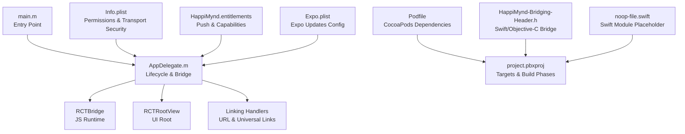
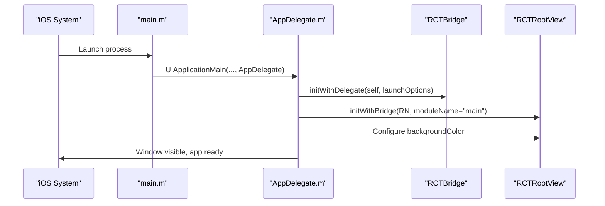
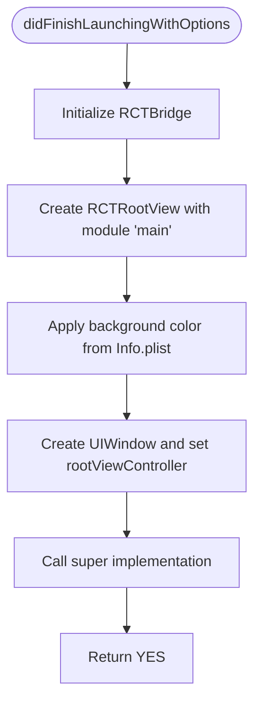
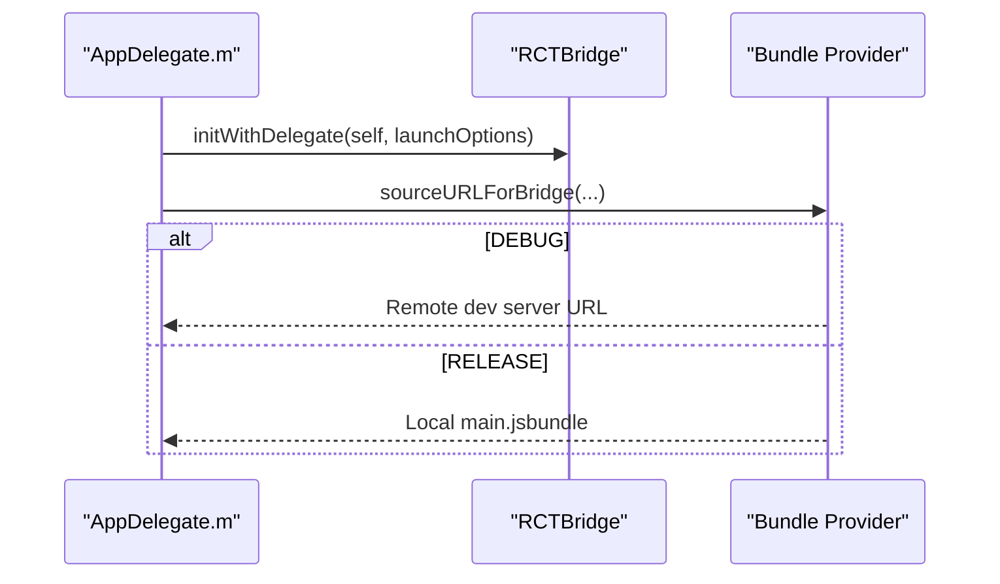
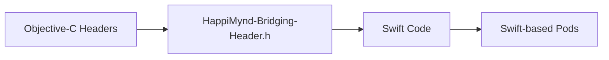
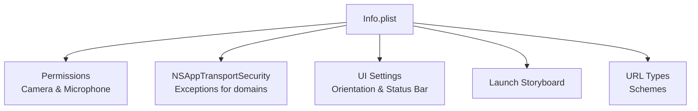
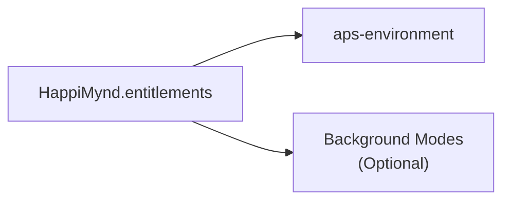
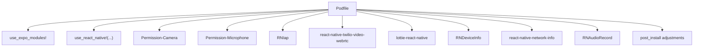
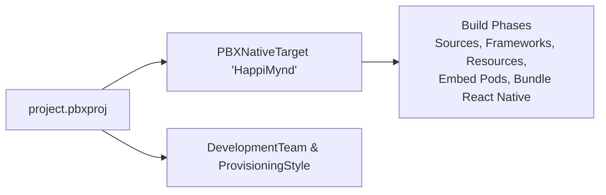
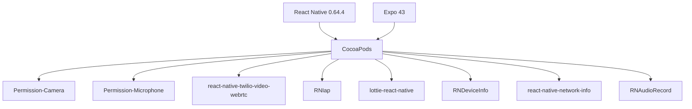

# iOS Integration

<cite>
**Referenced Files in This Document**
- [Podfile](file://ios/Podfile)
- [AppDelegate.h](file://ios/HappiMynd/AppDelegate.h)
- [AppDelegate.m](file://ios/HappiMynd/AppDelegate.m)
- [Info.plist](file://ios/HappiMynd/Info.plist)
- [HappiMynd.entitlements](file://ios/HappiMynd/HappiMynd.entitlements)
- [HappiMynd-Bridging-Header.h](file://ios/HappiMynd/HappiMynd-Bridging-Header.h)
- [main.m](file://ios/HappiMynd/main.m)
- [noop-file.swift](file://ios/HappiMynd/noop-file.swift)
- [project.pbxproj](file://ios/HappiMynd.xcodeproj/project.pbxproj)
- [Expo.plist](file://ios/HappiMynd/Supporting/Expo.plist)
- [package.json](file://package.json)
</cite>

## Table of Contents
1. [Introduction](#introduction)
2. [Project Structure](#project-structure)
3. [Core Components](#core-components)
4. [Architecture Overview](#architecture-overview)
5. [Detailed Component Analysis](#detailed-component-analysis)
6. [Dependency Analysis](#dependency-analysis)
7. [Performance Considerations](#performance-considerations)
8. [Troubleshooting Guide](#troubleshooting-guide)
9. [Conclusion](#conclusion)
10. [Appendices](#appendices)

## Introduction
This document provides comprehensive iOS integration guidance for HappiMynd’s React Native-based iOS implementation. It covers AppDelegate configuration, React Native bridge initialization, application lifecycle management, linking handlers, bridging header setup, Info.plist permissions, entitlements for push notifications and background modes, CocoaPods dependency management, Xcode project configuration, and iOS-specific security and biometric considerations. It also includes troubleshooting steps for common build and deployment issues.

## Project Structure
The iOS project resides under the ios/ directory and integrates with React Native via Expo. Key elements include:
- Application entry point and lifecycle in AppDelegate
- React Native bridge initialization and JS bundle loading
- Permissions and transport security in Info.plist
- Push notification entitlements
- CocoaPods-managed native dependencies
- Xcode project configuration and build targets

**Diagram sources**
- [main.m:1-11](file://ios/HappiMynd/main.m#L1-L11)
- [AppDelegate.m:28-92](file://ios/HappiMynd/AppDelegate.m#L28-L92)
- [Info.plist:1-96](file://ios/HappiMynd/Info.plist#L1-L96)
- [HappiMynd.entitlements:1-8](file://ios/HappiMynd/HappiMynd.entitlements#L1-L8)
- [Podfile:65-124](file://ios/Podfile#L65-L124)
- [project.pbxproj:148-200](file://ios/HappiMynd.xcodeproj/project.pbxproj#L148-L200)
- [HappiMynd-Bridging-Header.h:1-4](file://ios/HappiMynd/HappiMynd-Bridging-Header.h#L1-L4)
- [noop-file.swift:1-5](file://ios/HappiMynd/noop-file.swift#L1-L5)
- [Expo.plist:1-17](file://ios/HappiMynd/Supporting/Expo.plist#L1-L17)

**Section sources**
- [main.m:1-11](file://ios/HappiMynd/main.m#L1-L11)
- [AppDelegate.m:28-92](file://ios/HappiMynd/AppDelegate.m#L28-L92)
- [Info.plist:1-96](file://ios/HappiMynd/Info.plist#L1-L96)
- [HappiMynd.entitlements:1-8](file://ios/HappiMynd/HappiMynd.entitlements#L1-L8)
- [Podfile:65-124](file://ios/Podfile#L65-L124)
- [project.pbxproj:148-200](file://ios/HappiMynd.xcodeproj/project.pbxproj#L148-L200)
- [HappiMynd-Bridging-Header.h:1-4](file://ios/HappiMynd/HappiMynd-Bridging-Header.h#L1-L4)
- [noop-file.swift:1-5](file://ios/HappiMynd/noop-file.swift#L1-L5)
- [Expo.plist:1-17](file://ios/HappiMynd/Supporting/Expo.plist#L1-L17)

## Core Components
- AppDelegate: Initializes the React Native bridge, sets up the root view, handles linking, and manages the app lifecycle.
- Info.plist: Defines app metadata, permissions (camera, microphone), transport security, supported orientations, and URL schemes.
- Entitlements: Declares push notification environment and related capabilities.
- Bridging Header: Exposes Objective-C APIs to Swift and enables mixed-language modules.
- CocoaPods: Manages native dependencies and post-install adjustments for RN compatibility.
- Expo Updates: Controls over-the-air update behavior.

**Section sources**
- [AppDelegate.h:1-10](file://ios/HappiMynd/AppDelegate.h#L1-L10)
- [AppDelegate.m:28-92](file://ios/HappiMynd/AppDelegate.m#L28-L92)
- [Info.plist:1-96](file://ios/HappiMynd/Info.plist#L1-L96)
- [HappiMynd.entitlements:1-8](file://ios/HappiMynd/HappiMynd.entitlements#L1-L8)
- [HappiMynd-Bridging-Header.h:1-4](file://ios/HappiMynd/HappiMynd-Bridging-Header.h#L1-L4)
- [Podfile:65-124](file://ios/Podfile#L65-L124)
- [Expo.plist:1-17](file://ios/HappiMynd/Supporting/Expo.plist#L1-L17)

## Architecture Overview
The iOS app boots through main.m, instantiates AppDelegate, initializes the React Native bridge, renders the JS root view, and exposes linking handlers for universal links and deep links. Native modules are integrated via CocoaPods and Expo autolinking.

**Diagram sources**
- [main.m:5-9](file://ios/HappiMynd/main.m#L5-L9)
- [AppDelegate.m:30-54](file://ios/HappiMynd/AppDelegate.m#L30-L54)

## Detailed Component Analysis

### AppDelegate Configuration
- Bridge Initialization: Creates the React Native bridge and root view during application launch.
- Root View Setup: Applies optional background color from Info.plist and sets the window’s root view controller.
- Linking Handlers: Implements URL opening and Universal Links continuation to route deep links to React Native.

**Diagram sources**
- [AppDelegate.m:30-54](file://ios/HappiMynd/AppDelegate.m#L30-L54)

**Section sources**
- [AppDelegate.h:7-9](file://ios/HappiMynd/AppDelegate.h#L7-L9)
- [AppDelegate.m:30-54](file://ios/HappiMynd/AppDelegate.m#L30-L54)
- [AppDelegate.m:70-89](file://ios/HappiMynd/AppDelegate.m#L70-L89)

### React Native Bridge and JS Bundle Loading
- Debug vs Release: Uses a remote dev server URL in debug builds and bundles the JS locally in release builds.
- Extra Modules: Provides hook for registering additional native modules if needed.

**Diagram sources**
- [AppDelegate.m:70-76](file://ios/HappiMynd/AppDelegate.m#L70-L76)

**Section sources**
- [AppDelegate.m:70-76](file://ios/HappiMynd/AppDelegate.m#L70-L76)

### Scene Delegate Handling
- The project currently uses the traditional UIApplication lifecycle in AppDelegate. Scene delegate handling is not present in the provided files. If scene-based lifecycle is desired, integrate UISceneSession configuration in Info.plist and implement a SceneDelegate class accordingly.

[No sources needed since this section provides general guidance]

### Swift/Objective-C Bridging Header Setup
- Purpose: Expose Objective-C public headers to Swift and enable mixed-language modules.
- Current Header: Empty placeholder exists to support Swift-based native modules.
- Swift Module Placeholder: A minimal Swift file ensures Swift-based pods link correctly.

**Diagram sources**
- [HappiMynd-Bridging-Header.h:1-4](file://ios/HappiMynd/HappiMynd-Bridging-Header.h#L1-L4)
- [noop-file.swift:1-5](file://ios/HappiMynd/noop-file.swift#L1-L5)

**Section sources**
- [HappiMynd-Bridging-Header.h:1-4](file://ios/HappiMynd/HappiMynd-Bridging-Header.h#L1-L4)
- [noop-file.swift:1-5](file://ios/HappiMynd/noop-file.swift#L1-L5)

### Info.plist Configuration
- App Metadata: Bundle identifiers, display name, marketing version, and executable name.
- Permissions:
  - Camera: NSCameraUsageDescription
  - Microphone: NSMicrophoneUsageDescription
- Transport Security:
  - NSAppTransportSecurity allows arbitrary loads disabled globally with specific domain exceptions for development and production hosts.
- Launch and UI:
  - UILaunchStoryboardName, UIRequiredDeviceCapabilities, UIRequiresFullScreen, UIUserInterfaceStyle, UIViewControllerBasedStatusBarAppearance.
- Supported Orientations: Portrait and upside-down portrait for iPhone; includes iPad landscape support.
- URL Schemes: CFBundleURLTypes with CFBundleURLSchemes for deep linking.

**Diagram sources**
- [Info.plist:4-96](file://ios/HappiMynd/Info.plist#L4-L96)

**Section sources**
- [Info.plist:4-96](file://ios/HappiMynd/Info.plist#L4-L96)

### Entitlements Configuration
- Push Notifications: aps-environment indicates the push environment (development).
- Background Modes: Not configured in the provided entitlements; add background modes as needed for features like VoIP or audio playback.

**Diagram sources**
- [HappiMynd.entitlements:4-7](file://ios/HappiMynd/HappiMynd.entitlements#L4-L7)

**Section sources**
- [HappiMynd.entitlements:1-8](file://ios/HappiMynd/HappiMynd.entitlements#L1-L8)

### CocoaPods Dependency Management
- Autolinking: Uses Expo and React Native autolinking scripts.
- Platform Target: iOS 12.0.
- Permissions: Adds permission pods for camera and microphone.
- Native Modules:
  - RNIap (in-app purchases)
  - react-native-twilio-video-webrtc (video calling)
  - lottie-react-native (animations)
  - RNDeviceInfo (device info)
  - react-native-network-info (network info)
  - RNAudioRecord (audio recording)
- Post Install: Moves a specific build phase for RN compatibility.

**Diagram sources**
- [Podfile:65-124](file://ios/Podfile#L65-L124)

**Section sources**
- [Podfile:65-124](file://ios/Podfile#L65-L124)

### Xcode Project Configuration
- Targets and Build Phases: The project defines the HappiMynd target with Sources, Frameworks, Resources, and CocoaPods embedding phases.
- Signing and Provisioning: Automatic signing is enabled; ensure proper team and provisioning profiles are configured in Xcode.
- Expo Modules Provider: Generated Swift provider is included in the project.

**Diagram sources**
- [project.pbxproj:148-200](file://ios/HappiMynd.xcodeproj/project.pbxproj#L148-L200)

**Section sources**
- [project.pbxproj:148-200](file://ios/HappiMynd.xcodeproj/project.pbxproj#L148-L200)

### iOS-Specific Security, Keychain, and Biometric Authentication
- Keychain Storage: Firebase Messaging and GoogleUtilities include keychain storage utilities for secure token storage. Integrate appropriate keychain access groups and service names per Apple guidelines.
- Biometric Authentication: Use React Native Permissions to request Face ID or Touch ID access and handle authentication events securely. Ensure fallbacks for devices without biometrics.
- Transport Security: Keep ATS strict and limit exceptions to trusted domains only.

[No sources needed since this section provides general guidance]

### Expo Updates Integration
- Expo.plist controls update checks, enabling/disabling updates and specifying the update URL and SDK version.

**Section sources**
- [Expo.plist:1-17](file://ios/HappiMynd/Supporting/Expo.plist#L1-L17)

## Dependency Analysis
- React Native and Expo: Managed via autolinking and scripts in the Podfile.
- Native Modules: Integrated via CocoaPods with explicit paths for certain modules.
- Permissions: Separate pods for camera and microphone permissions.
- Post Install Adjustments: Ensures RN compatibility by reordering build phases.

**Diagram sources**
- [Podfile:65-124](file://ios/Podfile#L65-L124)
- [package.json:13-94](file://package.json#L13-L94)

**Section sources**
- [Podfile:65-124](file://ios/Podfile#L65-L124)
- [package.json:13-94](file://package.json#L13-L94)

## Performance Considerations
- Bundle Size: Minimize native dependencies and remove unused modules to reduce binary size.
- Network Calls: Prefer HTTPS and restrict ATS exceptions to essential domains.
- Background Execution: Enable only necessary background modes to preserve battery life.

[No sources needed since this section provides general guidance]

## Troubleshooting Guide
- Build Failures:
  - Ensure CocoaPods installation succeeded and the workspace opened correctly.
  - Verify autolinking scripts are present and executable.
- Flipper Integration:
  - Conditional Flipper initialization is supported; confirm headers are available if enabling Flipper.
- Simulator/Emulator Issues:
  - Reset content and settings in the simulator.
  - Reinstall the app after changing permissions or entitlements.
- Device Deployment:
  - Confirm Automatic signing is enabled and a valid provisioning profile is selected.
  - Ensure push notification entitlement matches the correct environment.
- JS Bundle Issues:
  - For release builds, verify main.jsbundle is bundled and loaded correctly.
  - For debug builds, confirm the dev server is reachable at the configured IP.

**Section sources**
- [AppDelegate.m:9-26](file://ios/HappiMynd/AppDelegate.m#L9-L26)
- [AppDelegate.m:70-76](file://ios/HappiMynd/AppDelegate.m#L70-L76)
- [project.pbxproj:174-186](file://ios/HappiMynd.xcodeproj/project.pbxproj#L174-L186)

## Conclusion
HappiMynd’s iOS integration leverages React Native with Expo, a standard AppDelegate bridge setup, and CocoaPods for native modules. Permissions, transport security, and entitlements are configured to support camera, microphone, and push notifications. The project is structured to enable future enhancements such as scene delegate handling, expanded background modes, and deeper native module integrations.

## Appendices
- Additional Native Modules: Integrate via Podfile and ensure bridging headers are configured for mixed-language modules.
- Security Best Practices: Restrict ATS, use secure keychain storage, and implement robust fallbacks for biometric authentication.

[No sources needed since this section provides general guidance]