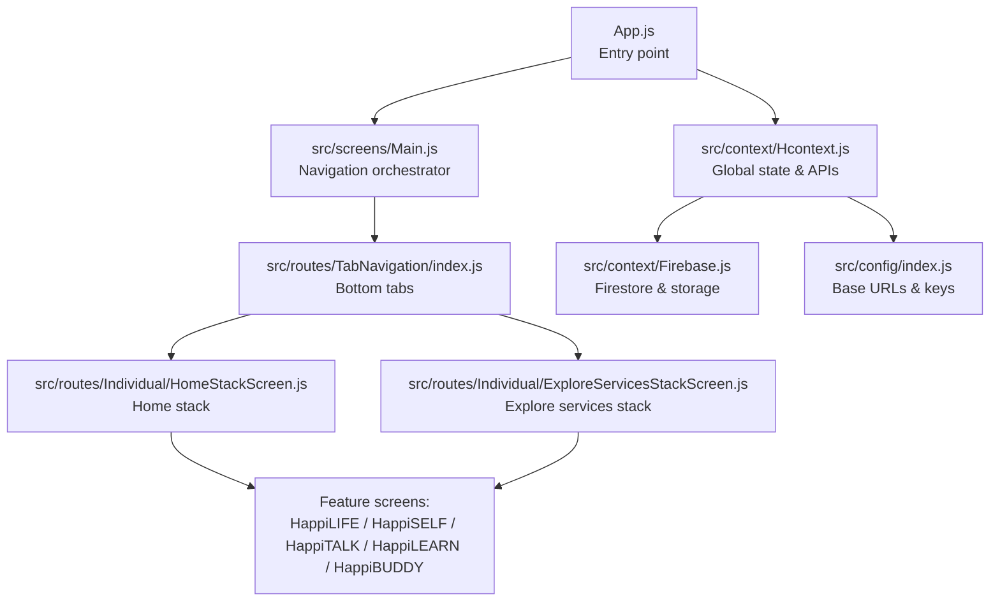
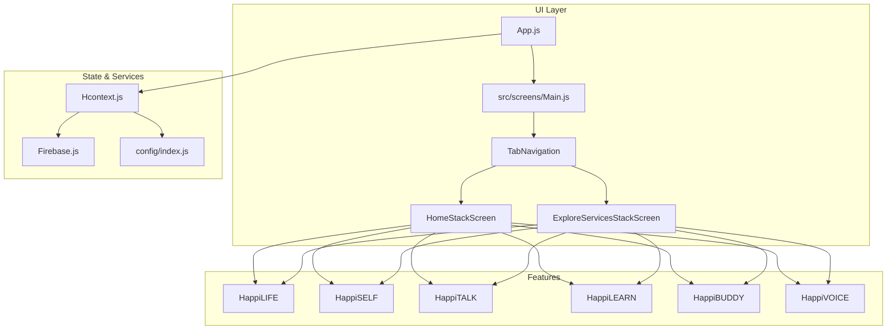
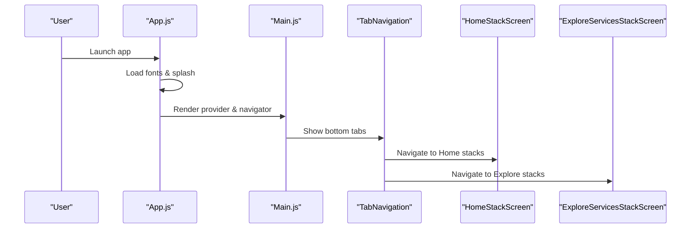
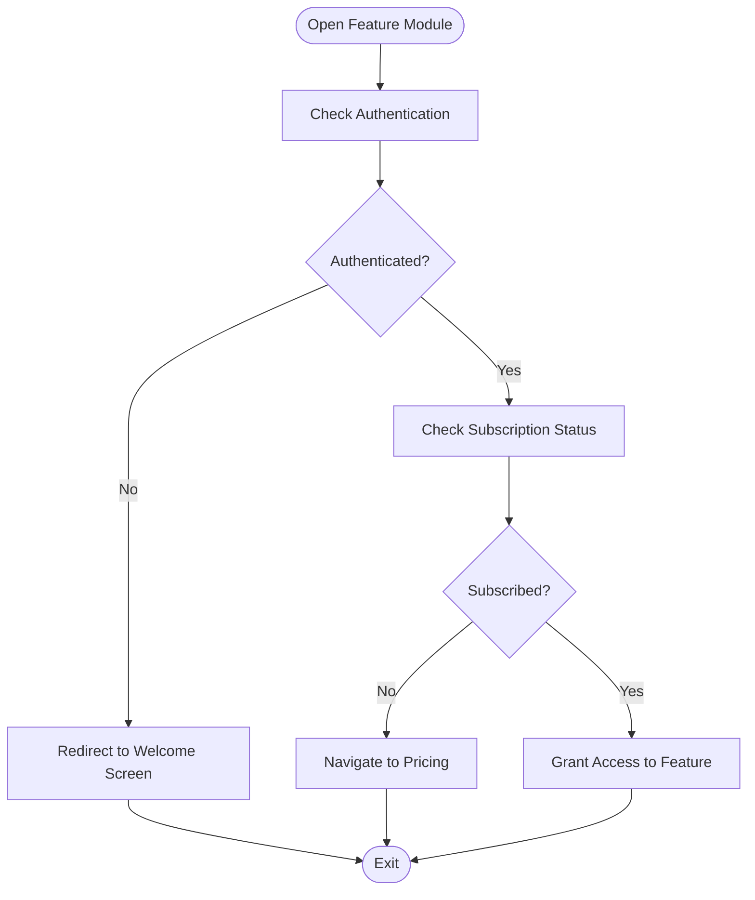
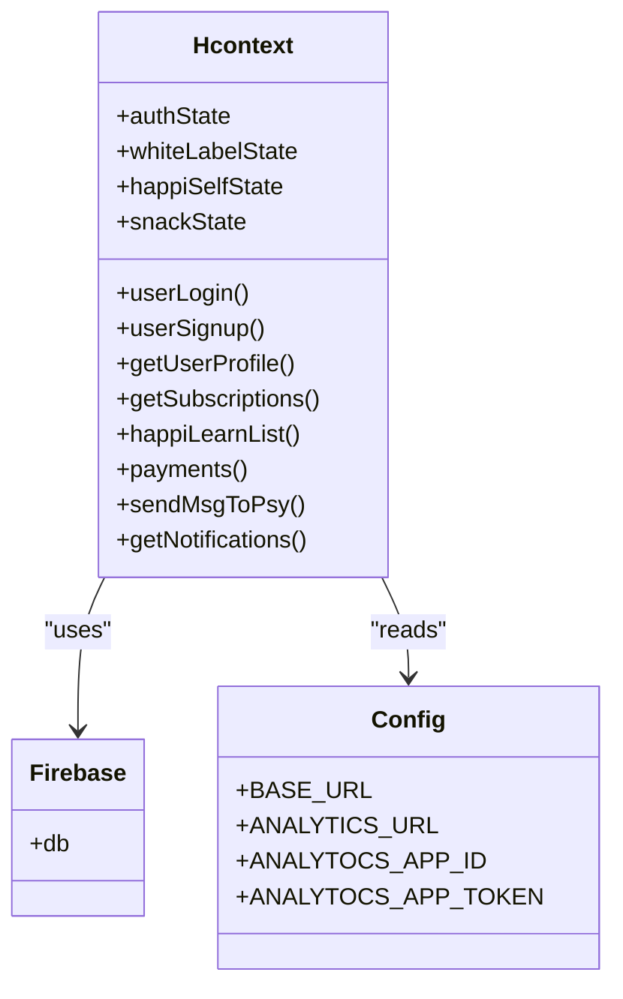
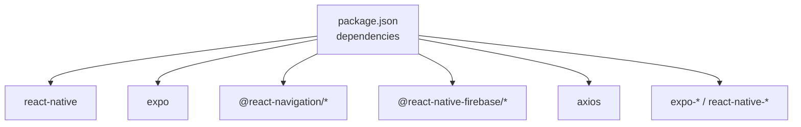

# Project Overview

<cite>
**Referenced Files in This Document**
- [package.json](file://package.json)
- [App.js](file://App.js)
- [src/screens/Main.js](file://src/screens/Main.js)
- [src/routes/TabNavigation/index.js](file://src/routes/TabNavigation/index.js)
- [src/routes/Individual/HomeStackScreen.js](file://src/routes/Individual/HomeStackScreen.js)
- [src/routes/Individual/ExploreServicesStackScreen.js](file://src/routes/Individual/ExploreServicesStackScreen.js)
- [src/context/Hcontext.js](file://src/context/Hcontext.js)
- [src/context/Firebase.js](file://src/context/Firebase.js)
- [src/config/index.js](file://src/config/index.js)
- [src/screens/HappiLIFE/HappiLIFE.js](file://src/screens/HappiLIFE/HappiLIFE.js)
- [src/screens/HappiSELF/HappiSELF.js](file://src/screens/HappiSELF/HappiSELF.js)
- [src/screens/HappiTALK/HappiTALK.js](file://src/screens/HappiTALK/HappiTALK.js)
- [src/screens/HappiLEARN/HappiLEARN.js](file://src/screens/HappiLEARN/HappiLEARN.js)
- [src/screens/HappyBUDDY/HappiBUDDY.js](file://src/screens/HappyBUDDY/HappiBUDDY.js)
- [src/assets/constants/index.js](file://src/assets/constants/index.js)
</cite>

## Table of Contents
1. [Introduction](#introduction)
2. [Project Structure](#project-structure)
3. [Core Components](#core-components)
4. [Architecture Overview](#architecture-overview)
5. [Detailed Component Analysis](#detailed-component-analysis)
6. [Dependency Analysis](#dependency-analysis)
7. [Performance Considerations](#performance-considerations)
8. [Troubleshooting Guide](#troubleshooting-guide)
9. [Conclusion](#conclusion)
10. [Appendices](#appendices)

## Introduction
HappiMynd is an integrated mental health and wellness platform designed to improve accessibility to mental health support through a comprehensive mobile application. The platform offers screening tools, guided self-management resources, therapy sessions, educational content, and community support services. Built with React Native and Expo, it enables cross-platform deployment for Android and iOS, while integrating with cloud services for secure, scalable operations.

Mission and Vision:
- Mission: Improve mental health accessibility through technology by offering personalized, evidence-based tools and services.
- Vision: To be a trusted companion on the emotional wellbeing journey, connecting users to resources, support, and expert guidance tailored to their needs.

Target Audience:
- Individuals seeking mental health support and self-improvement.
- Therapists and counselors providing remote and on-demand services.
- Healthcare professionals and organizations offering integrated care pathways.

Core Value Propositions:
- End-to-end mental health ecosystem: screening, self-help, guided support, therapy, education, and community.
- Personalized journeys powered by AI-driven assessments and curated content.
- Confidentiality and anonymity with robust security and compliance measures.
- Cross-platform availability via native mobile apps with web-like development ergonomics.

Key Features:
- Integrated service modules: HappiLIFE (screening), HappiSELF (self-management), HappiTALK (therapy), HappiLEARN (education), HappiBUDDY (peer/expert buddy), HappiVOICE (emotional voice analytics).
- Assessment workflows with bot-assisted guidance and expert recommendations.
- Subscription-based access with pricing and coupon integration.
- Notifications, chat, and booking systems for seamless engagement.

Differentiation Factors:
- Unified platform combining self-assessment, self-help, and professional support in one app.
- Emphasis on privacy-first design and rooted-device detection for security.
- Modular service architecture allowing flexible subscriptions and upsells.
- Strong focus on content discoverability and personalization.

Market Positioning and Competitive Landscape:
- Positioned as a comprehensive, privacy-centric mental health companion with integrated services.
- Competes with fragmented solutions by consolidating screening, self-help, and therapy into a single UX.
- Regulatory considerations include data protection, consent, and ethical AI use in assessments.

Regulatory Considerations:
- Data privacy and security aligned with global standards; rooted-device detection enhances integrity.
- Consent and transparency in AI-assisted assessments and data usage.
- Compliance with regional regulations for telehealth and mental health data handling.

## Project Structure
The project follows a modular React Native architecture with:
- A central App entrypoint initializing fonts, splash, and the provider context.
- A routing hierarchy with bottom tabs and native stack navigators.
- Feature-specific screens organized by domain (HappiLIFE, HappiSELF, HappiTALK, HappiLEARN, HappiBUDDY).
- A centralized context provider managing authentication, subscriptions, notifications, and API integrations.
- Firebase integration for Firestore and storage; configuration for external services (analytics, voice analysis).

**Diagram sources**
- [App.js:17-55](file://App.js#L17-L55)
- [src/screens/Main.js:13-146](file://src/screens/Main.js#L13-L146)
- [src/routes/TabNavigation/index.js:18-82](file://src/routes/TabNavigation/index.js#L18-L82)
- [src/routes/Individual/HomeStackScreen.js:84-404](file://src/routes/Individual/HomeStackScreen.js#L84-L404)
- [src/routes/Individual/ExploreServicesStackScreen.js:55-227](file://src/routes/Individual/ExploreServicesStackScreen.js#L55-L227)
- [src/context/Hcontext.js:26-102](file://src/context/Hcontext.js#L26-L102)
- [src/context/Firebase.js:33-51](file://src/context/Firebase.js#L33-L51)
- [src/config/index.js:1-13](file://src/config/index.js#L1-L13)

**Section sources**
- [App.js:17-55](file://App.js#L17-L55)
- [src/screens/Main.js:13-146](file://src/screens/Main.js#L13-L146)
- [src/routes/TabNavigation/index.js:18-82](file://src/routes/TabNavigation/index.js#L18-L82)
- [src/routes/Individual/HomeStackScreen.js:84-404](file://src/routes/Individual/HomeStackScreen.js#L84-L404)
- [src/routes/Individual/ExploreServicesStackScreen.js:55-227](file://src/routes/Individual/ExploreServicesStackScreen.js#L55-L227)
- [src/context/Hcontext.js:26-102](file://src/context/Hcontext.js#L26-L102)
- [src/context/Firebase.js:33-51](file://src/context/Firebase.js#L33-L51)
- [src/config/index.js:1-13](file://src/config/index.js#L1-L13)

## Core Components
- App bootstrap and splash: Initializes fonts, splash animation, and jailbroken device checks before rendering the main provider and navigator.
- Main navigation: Orchestrates guest/onboarding flows, drawer navigation, and tab-based access to core modules.
- Feature modules:
  - HappiLIFE: Awareness screening and report access.
  - HappiSELF: Self-management tools and CBT-based exercises.
  - HappiTALK: Verified booking and video sessions with therapists.
  - HappiLEARN: Curated educational content with search and filters.
  - HappiBUDDY: Peer/expert buddy support.
  - HappiVOICE: Voice-based emotional health monitoring.
- Context provider: Centralizes authentication, subscriptions, notifications, analytics, and API calls to the backend.
- Firebase integration: Firestore initialization and long-polling fallback for RN compatibility; storage references for media.

**Section sources**
- [App.js:17-55](file://App.js#L17-L55)
- [src/screens/Main.js:13-146](file://src/screens/Main.js#L13-L146)
- [src/screens/HappiLIFE/HappiLIFE.js:25-141](file://src/screens/HappiLIFE/HappiLIFE.js#L25-L141)
- [src/screens/HappiSELF/HappiSELF.js:25-137](file://src/screens/HappiSELF/HappiSELF.js#L25-L137)
- [src/screens/HappiTALK/HappiTALK.js:25-165](file://src/screens/HappiTALK/HappiTALK.js#L25-L165)
- [src/screens/HappiLEARN/HappiLEARN.js:66-225](file://src/screens/HappiLEARN/HappiLEARN.js#L66-L225)
- [src/context/Hcontext.js:26-102](file://src/context/Hcontext.js#L26-L102)
- [src/context/Firebase.js:33-51](file://src/context/Firebase.js#L33-L51)

## Architecture Overview
HappiMynd leverages React Native with Expo for cross-platform builds, a centralized context provider for state and API orchestration, and Firebase for data persistence. The navigation layer organizes feature modules behind tab and stack navigators. External integrations include analytics, voice analysis, and push notifications.

**Diagram sources**
- [App.js:17-55](file://App.js#L17-L55)
- [src/screens/Main.js:13-146](file://src/screens/Main.js#L13-L146)
- [src/routes/TabNavigation/index.js:18-82](file://src/routes/TabNavigation/index.js#L18-L82)
- [src/routes/Individual/HomeStackScreen.js:84-404](file://src/routes/Individual/HomeStackScreen.js#L84-L404)
- [src/routes/Individual/ExploreServicesStackScreen.js:55-227](file://src/routes/Individual/ExploreServicesStackScreen.js#L55-L227)
- [src/context/Hcontext.js:26-102](file://src/context/Hcontext.js#L26-L102)
- [src/context/Firebase.js:33-51](file://src/context/Firebase.js#L33-L51)
- [src/config/index.js:1-13](file://src/config/index.js#L1-L13)

## Detailed Component Analysis

### Navigation and Routing
- Bottom tabs provide quick access to Home, Explore Services, Notifications, and Offers.
- Native stack navigators encapsulate feature-specific flows for each module.
- Conditional rendering ensures authenticated, guest, and onboarding states are handled seamlessly.

**Diagram sources**
- [App.js:17-55](file://App.js#L17-L55)
- [src/screens/Main.js:96-146](file://src/screens/Main.js#L96-L146)
- [src/routes/TabNavigation/index.js:18-82](file://src/routes/TabNavigation/index.js#L18-L82)
- [src/routes/Individual/HomeStackScreen.js:84-404](file://src/routes/Individual/HomeStackScreen.js#L84-L404)
- [src/routes/Individual/ExploreServicesStackScreen.js:55-227](file://src/routes/Individual/ExploreServicesStackScreen.js#L55-L227)

**Section sources**
- [src/routes/TabNavigation/index.js:18-82](file://src/routes/TabNavigation/index.js#L18-L82)
- [src/routes/Individual/HomeStackScreen.js:84-404](file://src/routes/Individual/HomeStackScreen.js#L84-L404)
- [src/routes/Individual/ExploreServicesStackScreen.js:55-227](file://src/routes/Individual/ExploreServicesStackScreen.js#L55-L227)

### Feature Modules Overview
- HappiLIFE: Describes the awareness screening module and integrates with subscription checks and navigation to the assessment flow.
- HappiSELF: Highlights self-management tools and subscription gating.
- HappiTALK: Focuses on verified bookings and therapist sessions with identity verification steps.
- HappiLEARN: Provides a searchable, filterable library of educational content.
- HappiBUDDY: Introduces peer/expert buddy support with subscription handling.
- HappiVOICE: Presents voice-based emotional health monitoring and reporting.

**Diagram sources**
- [src/screens/HappiLIFE/HappiLIFE.js:46-62](file://src/screens/HappiLIFE/HappiLIFE.js#L46-L62)
- [src/screens/HappiSELF/HappiSELF.js:44-57](file://src/screens/HappiSELF/HappiSELF.js#L44-L57)
- [src/screens/HappiTALK/HappiTALK.js:47-62](file://src/screens/HappiTALK/HappiTALK.js#L47-L62)
- [src/screens/HappiLEARN/HappiLEARN.js:97-110](file://src/screens/HappiLEARN/HappiLEARN.js#L97-L110)
- [src/screens/HappyBUDDY/HappiBUDDY.js:41-54](file://src/screens/HappyBUDDY/HappiBUDDY.js#L41-L54)

**Section sources**
- [src/screens/HappiLIFE/HappiLIFE.js:25-141](file://src/screens/HappiLIFE/HappiLIFE.js#L25-L141)
- [src/screens/HappiSELF/HappiSELF.js:25-137](file://src/screens/HappiSELF/HappiSELF.js#L25-L137)
- [src/screens/HappiTALK/HappiTALK.js:25-165](file://src/screens/HappiTALK/HappiTALK.js#L25-L165)
- [src/screens/HappiLEARN/HappiLEARN.js:66-225](file://src/screens/HappiLEARN/HappiLEARN.js#L66-L225)
- [src/screens/HappyBUDDY/HappiBUDDY.js:24-128](file://src/screens/HappyBUDDY/HappiBUDDY.js#L24-L128)

### Context Provider and Integrations
- Hcontext manages authentication, subscriptions, notifications, analytics, and API interactions.
- Firebase is initialized with long-polling enabled for Firestore reliability on React Native.
- External services include analytics endpoints and voice analysis integration.

**Diagram sources**
- [src/context/Hcontext.js:26-102](file://src/context/Hcontext.js#L26-L102)
- [src/context/Firebase.js:33-51](file://src/context/Firebase.js#L33-L51)
- [src/config/index.js:1-13](file://src/config/index.js#L1-L13)

**Section sources**
- [src/context/Hcontext.js:26-102](file://src/context/Hcontext.js#L26-L102)
- [src/context/Firebase.js:33-51](file://src/context/Firebase.js#L33-L51)
- [src/config/index.js:1-13](file://src/config/index.js#L1-L13)

## Dependency Analysis
Primary dependencies include React Navigation for routing, Firebase for backend services, and Expo for cross-platform builds. The project also integrates audio/video capabilities, notifications, and analytics.

**Diagram sources**
- [package.json:13-94](file://package.json#L13-L94)

**Section sources**
- [package.json:13-94](file://package.json#L13-L94)

## Performance Considerations
- Use responsive units (percentage-based heights/widths) and font scaling for consistent layouts across devices.
- Lazy-load heavy assets and defer non-critical computations to background threads.
- Minimize re-renders by structuring context providers and avoiding unnecessary prop drilling.
- Optimize navigation transitions and avoid deep linking loops.

## Troubleshooting Guide
Common issues and resolutions:
- Rooted/jailbroken device detection: The app blocks unsupported devices to protect data integrity.
- Splash screen timing: Adjust splash duration to accommodate slower debug builds.
- Firebase connectivity: Long-polling is enabled for Firestore to mitigate RN transport limitations.
- Network errors: Implement retry logic and user-friendly snackbars for API failures.
- Authentication flows: Ensure device tokens are captured and passed during login/signup.

**Section sources**
- [App.js:36-55](file://App.js#L36-L55)
- [src/context/Firebase.js:40-49](file://src/context/Firebase.js#L40-L49)
- [src/context/Hcontext.js:129-145](file://src/context/Hcontext.js#L129-L145)

## Conclusion
HappiMynd delivers a comprehensive mental health platform that combines screening, self-management, guided support, therapy, education, and community resources. Its React Native + Expo foundation enables efficient cross-platform development, while a centralized context provider and Firebase integration ensure scalability and reliability. With a strong emphasis on privacy, personalization, and user experience, the platform aims to become a trusted companion for emotional wellbeing journeys.

## Appendices
- Color palette and constants define the UI theme and messaging assets used across feature modules.

**Section sources**
- [src/assets/constants/index.js:1-195](file://src/assets/constants/index.js#L1-L195)