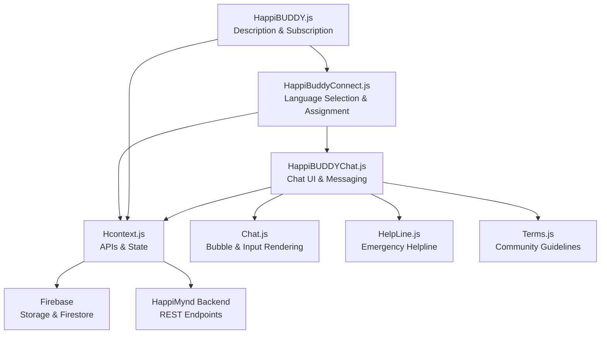
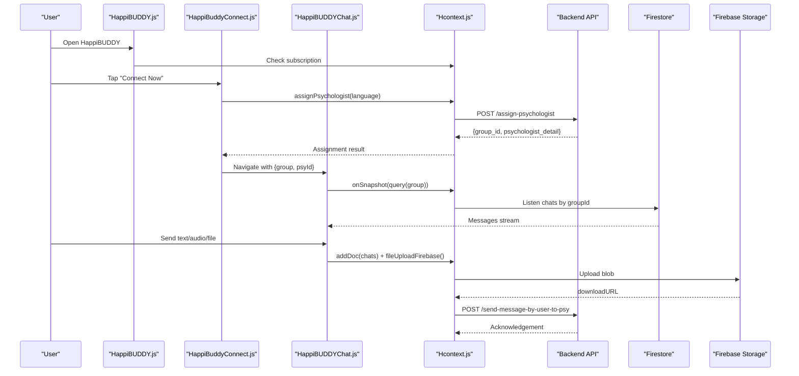
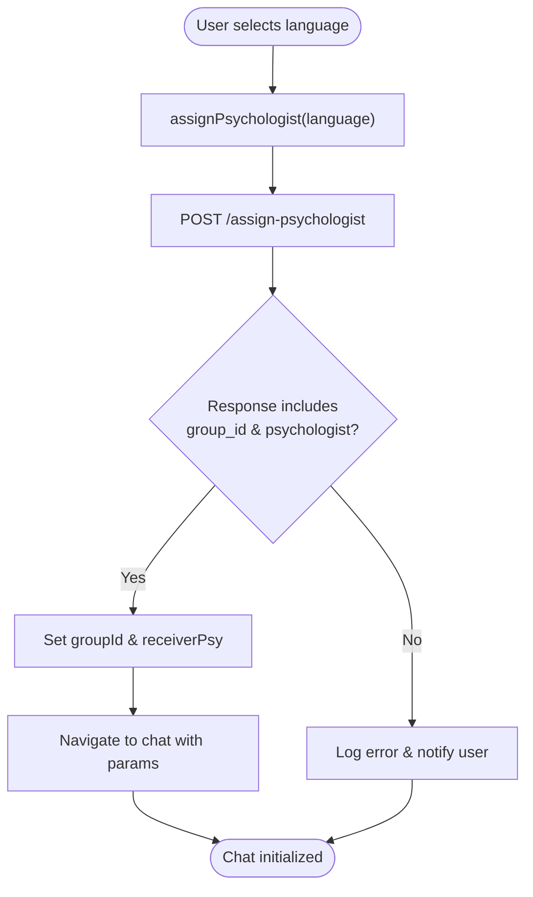
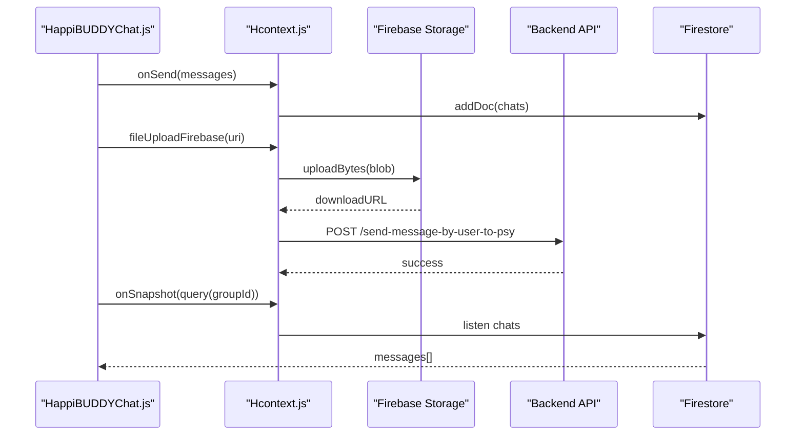
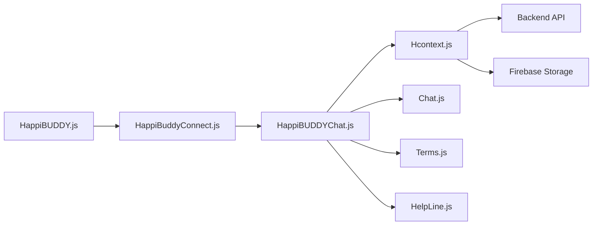

# HappiBUDDY - Peer Support Module

<cite>
**Referenced Files in This Document**
- [HappiBUDDY.js](file://src/screens/HappyBUDDY/HappiBUDDY.js)
- [HappiBuddyConnect.js](file://src/screens/HappyBUDDY/HappiBuddyConnect.js)
- [HappiBUDDYChat.js](file://src/screens/HappyBUDDY/HappiBUDDYChat.js)
- [Hcontext.js](file://src/context/Hcontext.js)
- [Chat.js](file://src/components/common/Chat.js)
- [Terms.js](file://src/screens/shared/Terms.js)
- [HelpLine.js](file://src/screens/Chat/HelpLine.js)
- [index.js](file://src/assets/constants/index.js)
</cite>

## Table of Contents
1. [Introduction](#introduction)
2. [Project Structure](#project-structure)
3. [Core Components](#core-components)
4. [Architecture Overview](#architecture-overview)
5. [Detailed Component Analysis](#detailed-component-analysis)
6. [Dependency Analysis](#dependency-analysis)
7. [Performance Considerations](#performance-considerations)
8. [Troubleshooting Guide](#troubleshooting-guide)
9. [Conclusion](#conclusion)
10. [Appendices](#appendices)

## Introduction
HappiBUDDY is the peer support module of HappiMynd that connects users with a professional expert “buddy” in a non-judgmental, anonymous, and confidential environment. It provides a personal emotional log room where users can share thoughts, feelings, and general concerns and receive personalized guidance. The module integrates with language selection, asynchronous messaging, file/audio attachments, and a secure chat interface backed by Firebase and HappiMynd’s API ecosystem. It also aligns with community guidelines and privacy policies, and provides pathways to professional support and emergency assistance.

## Project Structure
The HappiBUDDY module consists of three primary screens:
- Description and subscription landing: [HappiBUDDY.js](file://src/screens/HappyBUDDY/HappiBUDDY.js)
- Buddy connection and language selection: [HappiBuddyConnect.js](file://src/screens/HappyBUDDY/HappiBuddyConnect.js)
- Real-time chat with buddy: [HappiBUDDYChat.js](file://src/screens/HappyBUDDY/HappiBUDDYChat.js)

These screens rely on:
- Shared UI utilities and chat rendering: [Chat.js](file://src/components/common/Chat.js)
- Application-wide context and APIs: [Hcontext.js](file://src/context/Hcontext.js)
- Community and policy references: [Terms.js](file://src/screens/shared/Terms.js)
- Emergency helpline integration: [HelpLine.js](file://src/screens/Chat/HelpLine.js)
- Messaging and chat constants: [index.js](file://src/assets/constants/index.js)

**Diagram sources**
- [HappiBUDDY.js:24-129](file://src/screens/HappyBUDDY/HappiBUDDY.js#L24-L129)
- [HappiBuddyConnect.js:48-296](file://src/screens/HappyBUDDY/HappiBuddyConnect.js#L48-L296)
- [HappiBUDDYChat.js:163-630](file://src/screens/HappyBUDDY/HappiBUDDYChat.js#L163-L630)
- [Hcontext.js:486-545](file://src/context/Hcontext.js#L486-L545)
- [Chat.js:33-105](file://src/components/common/Chat.js#L33-L105)
- [HelpLine.js:15-89](file://src/screens/Chat/HelpLine.js#L15-L89)
- [Terms.js:42-45](file://src/screens/shared/Terms.js#L42-L45)

**Section sources**
- [HappiBUDDY.js:24-129](file://src/screens/HappyBUDDY/HappiBUDDY.js#L24-L129)
- [HappiBuddyConnect.js:48-296](file://src/screens/HappyBUDDY/HappiBuddyConnect.js#L48-L296)
- [HappiBUDDYChat.js:163-630](file://src/screens/HappyBUDDY/HappiBUDDYChat.js#L163-L630)

## Core Components
- Subscription and eligibility checks: [HappiBUDDY.js:41-54](file://src/screens/HappyBUDDY/HappiBUDDY.js#L41-L54)
- Buddy assignment and language selection: [HappiBuddyConnect.js:133-151](file://src/screens/HappyBUDDY/HappiBuddyConnect.js#L133-L151)
- Chat UI, message persistence, and file/audio support: [HappiBUDDYChat.js:189-482](file://src/screens/HappyBUDDY/HappiBUDDYChat.js#L189-L482)
- Context APIs for messaging, uploads, and notifications: [Hcontext.js:486-545](file://src/context/Hcontext.js#L486-L545)

Key capabilities:
- Asynchronous buddy messaging with Firestore-backed snapshots
- File and audio attachment support via Firebase Storage
- Language-based buddy assignment and switching
- Anonymous and confidential chat environment

**Section sources**
- [HappiBUDDY.js:41-54](file://src/screens/HappyBUDDY/HappiBUDDY.js#L41-L54)
- [HappiBuddyConnect.js:133-151](file://src/screens/HappyBUDDY/HappiBuddyConnect.js#L133-L151)
- [HappiBUDDYChat.js:189-482](file://src/screens/HappyBUDDY/HappiBUDDYChat.js#L189-L482)
- [Hcontext.js:486-545](file://src/context/Hcontext.js#L486-L545)

## Architecture Overview
The HappiBUDDY module follows a layered architecture:
- Presentation Layer: Screens for discovery, connection, and chat
- Domain Layer: Context APIs for assignment, messaging, and uploads
- Data Layer: Firestore for chat persistence and Firebase Storage for attachments
- External Integrations: Push notifications, helpline services, and policy enforcement

**Diagram sources**
- [HappiBUDDY.js:41-54](file://src/screens/HappyBUDDY/HappiBUDDY.js#L41-L54)
- [HappiBuddyConnect.js:133-151](file://src/screens/HappyBUDDY/HappiBuddyConnect.js#L133-L151)
- [HappiBUDDYChat.js:249-284](file://src/screens/HappyBUDDY/HappiBUDDYChat.js#L249-L284)
- [Hcontext.js:486-545](file://src/context/Hcontext.js#L486-L545)

## Detailed Component Analysis

### Buddy Matching Algorithm
HappiBUDDY uses a language-first matching mechanism:
- Supported languages are preloaded and filtered for assignment
- Assignment endpoint returns a group identifier and psychologist metadata
- Users can switch language and buddy mid-conversation

**Diagram sources**
- [HappiBuddyConnect.js:133-151](file://src/screens/HappyBUDDY/HappiBuddyConnect.js#L133-L151)
- [Hcontext.js:486-497](file://src/context/Hcontext.js#L486-L497)

**Section sources**
- [HappiBuddyConnect.js:30-58](file://src/screens/HappyBUDDY/HappiBuddyConnect.js#L30-L58)
- [HappiBuddyConnect.js:133-151](file://src/screens/HappyBUDDY/HappiBuddyConnect.js#L133-L151)
- [Hcontext.js:486-510](file://src/context/Hcontext.js#L486-L510)

### Chat System
Real-time-like messaging with asynchronous responses:
- Firestore query by groupId with orderBy and onSnapshot
- Message composition with text, audio, and document attachments
- Firebase Storage upload and download URL retrieval
- Push notifications via Expo push tokens

**Diagram sources**
- [HappiBUDDYChat.js:447-482](file://src/screens/HappyBUDDY/HappiBUDDYChat.js#L447-L482)
- [HappiBUDDYChat.js:249-284](file://src/screens/HappyBUDDY/HappiBUDDYChat.js#L249-L284)
- [Hcontext.js:836-857](file://src/context/Hcontext.js#L836-L857)
- [Hcontext.js:522-535](file://src/context/Hcontext.js#L522-L535)

**Section sources**
- [HappiBUDDYChat.js:189-482](file://src/screens/HappyBUDDY/HappiBUDDYChat.js#L189-L482)
- [Chat.js:33-105](file://src/components/common/Chat.js#L33-L105)
- [Hcontext.js:836-857](file://src/context/Hcontext.js#L836-L857)

### Anonymous Support and Privacy Controls
- Non-judgmental, anonymous, and confidential environment
- 100% confidentiality assurances and secure messaging
- Community guidelines and prohibited uses enforced
- Disclaimer that the platform does not handle medical emergencies

**Section sources**
- [HappiBUDDY.js:86-100](file://src/screens/HappyBUDDY/HappiBUDDY.js#L86-L100)
- [Terms.js:42-45](file://src/screens/shared/Terms.js#L42-L45)
- [Terms.js:164-167](file://src/screens/shared/Terms.js#L164-L167)

### Integration with Crisis Support and Emergency Assistance
- Helpline screen displays emergency contacts and instructions
- Clear disclaimer directing users to seek in-person help in crises
- Integration with tel: links for immediate assistance

**Section sources**
- [HelpLine.js:25-42](file://src/screens/Chat/HelpLine.js#L25-L42)
- [Terms.js:42-45](file://src/screens/shared/Terms.js#L42-L45)

### Community Guidelines and Content Moderation
- Prohibited uses and user conduct rules
- Moderation of forums, topics, replies, and comments
- Confidentiality of communications within therapy scope

**Section sources**
- [Terms.js:164-167](file://src/screens/shared/Terms.js#L164-L167)
- [Terms.js:138-143](file://src/screens/shared/Terms.js#L138-L143)

### Training and Certification Programs
- Not implemented in the current codebase
- No explicit screens or APIs for peer supporter/moderator training/certification

**Section sources**
- [HappiBUDDY.js:24-129](file://src/screens/HappyBUDDY/HappiBUDDY.js#L24-L129)
- [HappiBuddyConnect.js:48-296](file://src/screens/HappyBUDDY/HappiBuddyConnect.js#L48-L296)
- [HappiBUDDYChat.js:163-630](file://src/screens/HappyBUDDY/HappiBUDDYChat.js#L163-L630)

### Integration with Professional Support Services
- Users can navigate to HappiTALK and HappiGUIDE for professional sessions
- Subscription mapping includes HappiBUDDY as a peer support option alongside professional services

**Section sources**
- [HappiBUDDY.js:105-121](file://src/screens/HappyBUDDY/HappiBUDDY.js#L105-L121)
- [Terms.js:36-39](file://src/screens/shared/Terms.js#L36-L39)

## Dependency Analysis
HappiBUDDY depends on:
- Context APIs for assignment, messaging, uploads, and notifications
- Firestore for chat persistence
- Firebase Storage for attachments
- Backend endpoints for buddy assignment and message delivery
- UI components for chat rendering and input toolbars

**Diagram sources**
- [HappiBUDDY.js:24-129](file://src/screens/HappyBUDDY/HappiBUDDY.js#L24-L129)
- [HappiBuddyConnect.js:48-296](file://src/screens/HappyBUDDY/HappiBuddyConnect.js#L48-L296)
- [HappiBUDDYChat.js:163-630](file://src/screens/HappyBUDDY/HappiBUDDYChat.js#L163-L630)
- [Hcontext.js:486-545](file://src/context/Hcontext.js#L486-L545)
- [Chat.js:33-105](file://src/components/common/Chat.js#L33-L105)
- [Terms.js:42-45](file://src/screens/shared/Terms.js#L42-L45)
- [HelpLine.js:15-89](file://src/screens/Chat/HelpLine.js#L15-L89)

**Section sources**
- [HappiBUDDY.js:24-129](file://src/screens/HappyBUDDY/HappiBUDDY.js#L24-L129)
- [HappiBuddyConnect.js:48-296](file://src/screens/HappyBUDDY/HappiBuddyConnect.js#L48-L296)
- [HappiBUDDYChat.js:163-630](file://src/screens/HappyBUDDY/HappiBUDDYChat.js#L163-L630)
- [Hcontext.js:486-545](file://src/context/Hcontext.js#L486-L545)

## Performance Considerations
- Firestore onSnapshot provides near real-time updates; ensure unsubscribe on unmount to prevent leaks
- Audio recording and playback should manage lifecycle to avoid memory leaks
- File uploads should handle retries and progress reporting for better UX
- Language pre-fetching reduces UI latency during buddy assignment

[No sources needed since this section provides general guidance]

## Troubleshooting Guide
Common issues and resolutions:
- Assignment failures: Verify language selection and retry assignment
- Message send failures: Confirm network connectivity and backend acknowledgments
- Audio recording/playback errors: Check permissions and device-specific recording settings
- File upload failures: Validate Firebase Storage rules and network stability

**Section sources**
- [HappiBuddyConnect.js:133-151](file://src/screens/HappyBUDDY/HappiBuddyConnect.js#L133-L151)
- [HappiBUDDYChat.js:447-482](file://src/screens/HappyBUDDY/HappiBUDDYChat.js#L447-L482)
- [HappiBUDDYChat.js:306-376](file://src/screens/HappyBUDDY/HappiBUDDYChat.js#L306-L376)
- [Hcontext.js:836-857](file://src/context/Hcontext.js#L836-L857)

## Conclusion
HappiBUDDY delivers a secure, anonymous peer support experience with language-based buddy assignment, asynchronous messaging, and integrated emergency resources. While the current implementation focuses on chat and assignment, training and certification programs for peer supporters/moderators are not present in the codebase. The module aligns with community guidelines and privacy policies, ensuring confidentiality and responsible use.

## Appendices
- Buddy messaging constants and bot-related content are defined in [index.js:91-189](file://src/assets/constants/index.js#L91-L189)

**Section sources**
- [index.js:91-189](file://src/assets/constants/index.js#L91-L189)