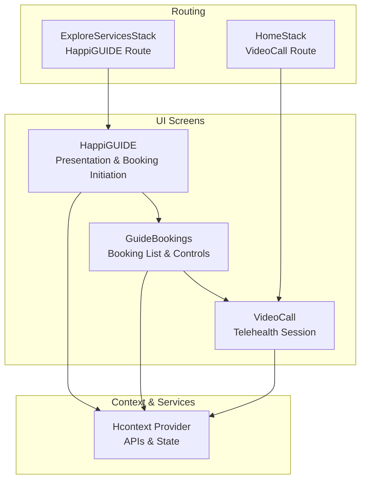
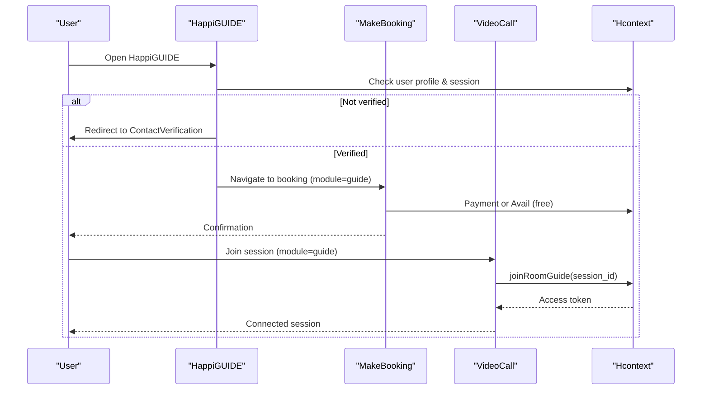
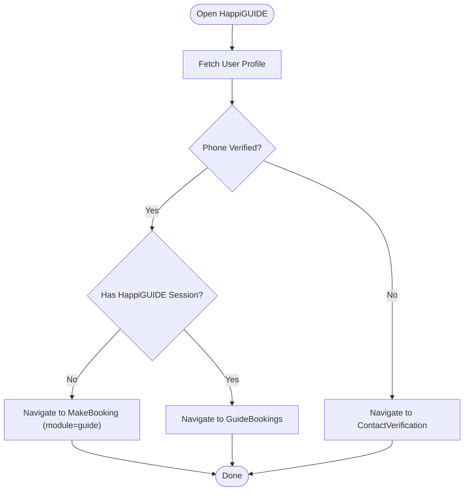
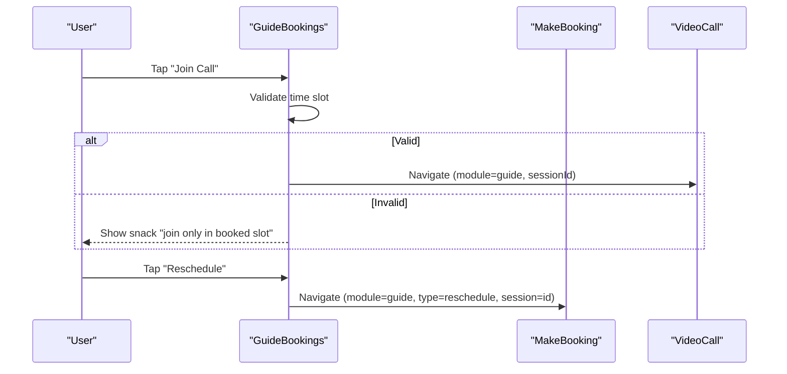
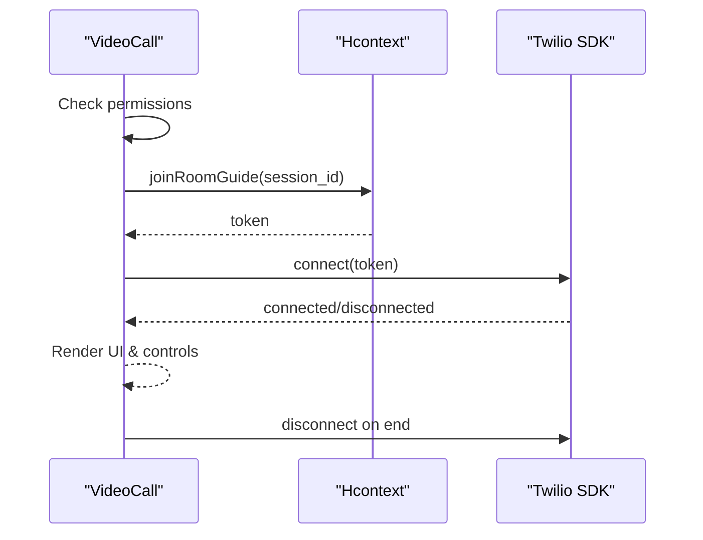
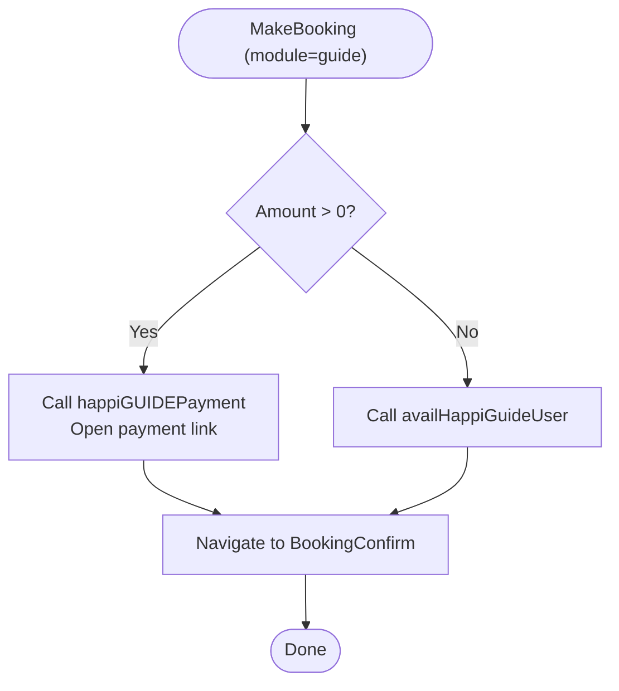
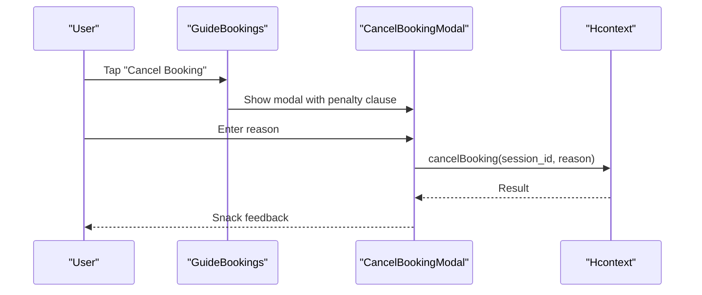
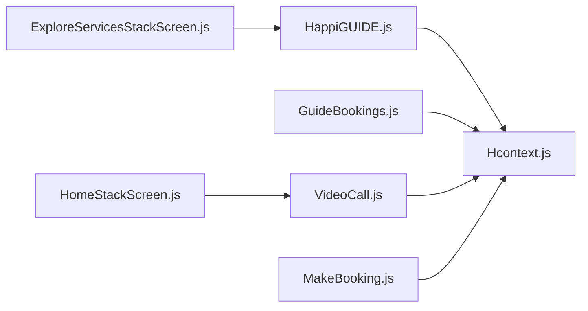

# HappiGUIDE - Professional Guidance Module

<cite>
**Referenced Files in This Document**
- [HappiGUIDE.js](file://src/screens/HappiGUIDE/HappiGUIDE.js)
- [GuideBookings.js](file://src/screens/HappiGUIDE/GuideBookings.js)
- [VideoCall.js](file://src/screens/HappiTALK/VideoCall.js)
- [MakeBooking.js](file://src/screens/HappiTALK/MakeBooking.js)
- [Hcontext.js](file://src/context/Hcontext.js)
- [ExploreServicesStackScreen.js](file://src/routes/Individual/ExploreServicesStackScreen.js)
- [HomeStackScreen.js](file://src/routes/Individual/HomeStackScreen.js)
- [ContactVerification.js](file://src/screens/HappiLIFE/ContactVerification.js)
- [PrivacyPolicy.js](file://src/screens/shared/PrivacyPolicy.js)
- [Terms.js](file://src/screens/shared/Terms.js)
- [CancelBookingModal.js](file://src/components/Modals/CancelBookingModal.js)
</cite>

## Table of Contents
1. [Introduction](#introduction)
2. [Project Structure](#project-structure)
3. [Core Components](#core-components)
4. [Architecture Overview](#architecture-overview)
5. [Detailed Component Analysis](#detailed-component-analysis)
6. [Dependency Analysis](#dependency-analysis)
7. [Performance Considerations](#performance-considerations)
8. [Troubleshooting Guide](#troubleshooting-guide)
9. [Conclusion](#conclusion)
10. [Appendices](#appendices)

## Introduction
This document describes the HappiGUIDE professional guidance module that connects users with certified mental health professionals. It covers the professional matching and booking workflows, scheduling and rescheduling, cancellation policies, session management, integration with video conferencing, and compliance-related topics surfaced by the client codebase. It also outlines the user verification process and highlights where rating and review capabilities are exposed.

## Project Structure
The HappiGUIDE module is organized around three primary screens and supporting infrastructure:
- HappiGUIDE landing screen: presentation, eligibility checks, and initiation of booking.
- GuideBookings: user’s booking list and session controls.
- VideoCall: integrated telehealth session via Twilio Video.

Supporting services and state management are centralized in the Hcontext provider, which encapsulates API clients, authentication, and session lifecycle operations.

**Diagram sources**
- [HappiGUIDE.js](file://src/screens/HappiGUIDE/HappiGUIDE.js)
- [GuideBookings.js](file://src/screens/HappiGUIDE/GuideBookings.js)
- [VideoCall.js](file://src/screens/HappiTALK/VideoCall.js)
- [ExploreServicesStackScreen.js](file://src/routes/Individual/ExploreServicesStackScreen.js)
- [HomeStackScreen.js](file://src/routes/Individual/HomeStackScreen.js)
- [Hcontext.js](file://src/context/Hcontext.js)

**Section sources**
- [HappiGUIDE.js:112-301](file://src/screens/HappiGUIDE/HappiGUIDE.js#L112-L301)
- [GuideBookings.js:285-356](file://src/screens/HappiGUIDE/GuideBookings.js#L285-L356)
- [VideoCall.js:27-89](file://src/screens/HappiTALK/VideoCall.js#L27-L89)
- [ExploreServicesStackScreen.js:190-227](file://src/routes/Individual/ExploreServicesStackScreen.js#L190-L227)
- [HomeStackScreen.js:58-88](file://src/routes/Individual/HomeStackScreen.js#L58-L88)

## Core Components
- HappiGUIDE landing screen orchestrates user eligibility checks (contact verification), session retrieval, and navigation to booking or viewing existing bookings.
- GuideBookings renders a single booking card with status, join-call action, reschedule, and feedback actions.
- VideoCall integrates Twilio Video for secure audio/video sessions, requesting device permissions and connecting via tokens.
- Hcontext exposes APIs for payments, session availability, rescheduling, cancellation, and room access.

Key responsibilities:
- Eligibility gating: phone verification before booking.
- Booking lifecycle: create, reschedule, cancel, and feedback.
- Session orchestration: join room, manage media, and end session.
- Compliance and safety: privacy policy, terms, and verification steps.

**Section sources**
- [HappiGUIDE.js:144-183](file://src/screens/HappiGUIDE/HappiGUIDE.js#L144-L183)
- [GuideBookings.js:27-283](file://src/screens/HappiGUIDE/GuideBookings.js#L27-L283)
- [VideoCall.js:105-127](file://src/screens/HappiTALK/VideoCall.js#L105-L127)
- [Hcontext.js:1263-1280](file://src/context/Hcontext.js#L1263-L1280)

## Architecture Overview
The HappiGUIDE module follows a layered pattern:
- Presentation layer: React Native screens for discovery, booking, and session.
- Routing layer: Stack navigators expose routes for HappiGUIDE and VideoCall.
- Service layer: Hcontext wraps API client calls for payments, sessions, and room access.
- Integration layer: Twilio Video SDK for secure sessions.

**Diagram sources**
- [HappiGUIDE.js:233-258](file://src/screens/HappiGUIDE/HappiGUIDE.js#L233-L258)
- [MakeBooking.js:385-467](file://src/screens/HappiTALK/MakeBooking.js#L385-L467)
- [VideoCall.js:105-127](file://src/screens/HappiTALK/VideoCall.js#L105-L127)
- [Hcontext.js:1091-1102](file://src/context/Hcontext.js#L1091-L1102)

## Detailed Component Analysis

### HappiGUIDE Landing Screen
- Purpose: Present HappiGUIDE benefits, check verification status, and initiate booking or view existing sessions.
- Key flows:
  - On mount: fetch user profile and HappiGUIDE session.
  - If unverified (phone), navigate to ContactVerification.
  - If verified, allow booking initiation with module=guide.
  - If a session exists, show “Guide Booking” card.

**Diagram sources**
- [HappiGUIDE.js:138-183](file://src/screens/HappiGUIDE/HappiGUIDE.js#L138-L183)
- [HappiGUIDE.js:233-258](file://src/screens/HappiGUIDE/HappiGUIDE.js#L233-L258)

**Section sources**
- [HappiGUIDE.js:112-301](file://src/screens/HappiGUIDE/HappiGUIDE.js#L112-L301)

### GuideBookings Screen
- Purpose: Display a single HappiGUIDE booking with status, join-call, reschedule, and feedback actions.
- Key behaviors:
  - Status derived from completion flag.
  - Join-call validates current time slot and navigates to VideoCall.
  - Reschedule navigates to MakeBooking with type=reschedule.
  - Feedback available after session completion.

**Diagram sources**
- [GuideBookings.js:150-232](file://src/screens/HappiGUIDE/GuideBookings.js#L150-L232)
- [GuideBookings.js:27-283](file://src/screens/HappiGUIDE/GuideBookings.js#L27-L283)

**Section sources**
- [GuideBookings.js:27-283](file://src/screens/HappiGUIDE/GuideBookings.js#L27-L283)

### VideoCall Integration (Twilio)
- Purpose: Secure, permission-requested audio/video session using Twilio Video.
- Key behaviors:
  - Requests camera and microphone permissions.
  - Chooses joinRoomGuide for HappiGUIDE sessions.
  - Renders remote/local views and call controls (mute, flip, end).
  - Disconnects and returns on end.

**Diagram sources**
- [VideoCall.js:91-127](file://src/screens/HappiTALK/VideoCall.js#L91-L127)
- [Hcontext.js:1091-1102](file://src/context/Hcontext.js#L1091-L1102)

**Section sources**
- [VideoCall.js:1-431](file://src/screens/HappiTALK/VideoCall.js#L1-L431)
- [Hcontext.js:1079-1102](file://src/context/Hcontext.js#L1079-L1102)

### Booking and Payment (HappiGUIDE)
- Purpose: Allow users to book or reschedule HappiGUIDE sessions and handle payment.
- Key flows:
  - Payment: If amount > 0, prepare plan_id, date, time, coupon and open payment link.
  - Free access: If subscribed, call availHappiGuideUser with plan_id and date/time.
  - Reschedule: Use rescheduleGuideBooking with session, date, time.

**Diagram sources**
- [MakeBooking.js:385-467](file://src/screens/HappiTALK/MakeBooking.js#L385-L467)
- [Hcontext.js:1263-1280](file://src/context/Hcontext.js#L1263-L1280)

**Section sources**
- [MakeBooking.js:385-824](file://src/screens/HappiTALK/MakeBooking.js#L385-L824)
- [Hcontext.js:1263-1280](file://src/context/Hcontext.js#L1263-L1280)

### Cancellation and Penalties
- Purpose: Provide structured cancellation with policy disclosure.
- Key behaviors:
  - Cancel modal fetches penalty clause for user type (b2b/b2c).
  - Requires a reason; otherwise shows snack prompting reason.
  - Calls cancel endpoint with session_id and cancel_reason.

**Diagram sources**
- [CancelBookingModal.js:50-70](file://src/components/Modals/CancelBookingModal.js#L50-L70)
- [GuideBookings.js:127-135](file://src/screens/HappiGUIDE/GuideBookings.js#L127-L135)
- [Hcontext.js:1172-1184](file://src/context/Hcontext.js#L1172-L1184)

**Section sources**
- [CancelBookingModal.js:1-92](file://src/components/Modals/CancelBookingModal.js#L1-L92)
- [GuideBookings.js:127-135](file://src/screens/HappiGUIDE/GuideBookings.js#L127-L135)
- [Hcontext.js:1172-1184](file://src/context/Hcontext.js#L1172-L1184)

### Professional Matching and Credentialing
- Current implementation indicates:
  - Listing and selection of psychologists is handled in HappiTALK flows (not HappiGUIDE).
  - HappiGUIDE focuses on session creation and scheduling rather than explicit matching.
- Implication: Professionals are likely pre-vetted and discoverable via HappiTALK listings; HappiGUIDE uses a distinct endpoint for room access and session management.

**Section sources**
- [Hcontext.js:1104-1115](file://src/context/Hcontext.js#L1104-L1115)
- [Hcontext.js:1091-1102](file://src/context/Hcontext.js#L1091-L1102)

### Session Management
- Pre-session:
  - Eligibility checks (phone verification).
  - Booking confirmation and coupon application.
- During session:
  - Permission prompts, token acquisition, and connection.
  - Media controls and participant view rendering.
- Post-session:
  - Completion status leads to feedback submission.
  - Cancellation and rescheduling handled via dedicated endpoints.

**Section sources**
- [HappiGUIDE.js:161-183](file://src/screens/HappiGUIDE/HappiGUIDE.js#L161-L183)
- [GuideBookings.js:134-151](file://src/screens/HappiGUIDE/GuideBookings.js#L134-L151)
- [VideoCall.js:105-127](file://src/screens/HappiTALK/VideoCall.js#L105-L127)

### Telehealth Integrations and Security
- Video conferencing:
  - Twilio Video SDK integrated for secure audio/video.
  - Permissions requested for camera and microphone.
- Communication channels:
  - Room access tokens retrieved via joinRoomGuide.
  - Notifications and analytics are managed elsewhere in the context provider.

**Section sources**
- [VideoCall.js:17-21](file://src/screens/HappiTALK/VideoCall.js#L17-L21)
- [VideoCall.js:91-127](file://src/screens/HappiTALK/VideoCall.js#L91-L127)
- [Hcontext.js:1091-1102](file://src/context/Hcontext.js#L1091-L1102)

### Ratings and Reviews
- Feedback submission:
  - After a completed session, users can navigate to a feedback screen from the booking card.
- Rating system:
  - No explicit rating UI is present in the HappiGUIDE module; feedback appears to be textual.

**Section sources**
- [GuideBookings.js:134-151](file://src/screens/HappiGUIDE/GuideBookings.js#L134-L151)

### Emergency Response and Crisis Intervention
- No explicit crisis intervention or emergency routing logic is present in the HappiGUIDE module.
- Users may access helpline/chat elsewhere in the app (outside HappiGUIDE).

**Section sources**
- [ExploreServicesStackScreen.js:190-227](file://src/routes/Individual/ExploreServicesStackScreen.js#L190-L227)

### Compliance and Legal Context
- Privacy and terms:
  - Privacy policy and terms documents define regulatory posture and user obligations.
- Age and prohibited uses:
  - Minimum age and prohibited uses are documented in shared screens.

**Section sources**
- [PrivacyPolicy.js:93-103](file://src/screens/shared/PrivacyPolicy.js#L93-L103)
- [Terms.js:161-171](file://src/screens/shared/Terms.js#L161-L171)

## Dependency Analysis
- Routing dependencies:
  - ExploreServicesStack registers HappiGUIDE.
  - HomeStack registers VideoCall.
- Context dependencies:
  - HappiGUIDE depends on user profile and session retrieval.
  - GuideBookings depends on cancellation and rescheduling endpoints.
  - VideoCall depends on room access endpoints.
  - MakeBooking depends on payment and availability endpoints.

**Diagram sources**
- [HappiGUIDE.js:117-141](file://src/screens/HappiGUIDE/HappiGUIDE.js#L117-L141)
- [GuideBookings.js:39-50](file://src/screens/HappiGUIDE/GuideBookings.js#L39-L50)
- [VideoCall.js:44-44](file://src/screens/HappiTALK/VideoCall.js#L44-L44)
- [MakeBooking.js:385-467](file://src/screens/HappiTALK/MakeBooking.js#L385-L467)
- [ExploreServicesStackScreen.js:190-227](file://src/routes/Individual/ExploreServicesStackScreen.js#L190-L227)
- [HomeStackScreen.js:58-88](file://src/routes/Individual/HomeStackScreen.js#L58-L88)

**Section sources**
- [ExploreServicesStackScreen.js:190-227](file://src/routes/Individual/ExploreServicesStackScreen.js#L190-L227)
- [HomeStackScreen.js:58-88](file://src/routes/Individual/HomeStackScreen.js#L58-L88)
- [Hcontext.js:1172-1280](file://src/context/Hcontext.js#L1172-L1280)

## Performance Considerations
- Network-bound operations:
  - Room token retrieval and payment redirects introduce latency; consider caching tokens per session and displaying loaders during transitions.
- UI responsiveness:
  - Time-slot validation and permission checks should avoid blocking the main thread; current implementations use moment parsing and snack dispatch which are lightweight.
- Media initialization:
  - Camera/microphone permission requests should be batched and retried gracefully to minimize repeated prompts.

## Troubleshooting Guide
Common issues and remedies:
- Permission denials:
  - If camera or microphone permissions are denied, request again and explain necessity; fallback to disabling video/audio is supported.
- Join-time validation:
  - Ensure the current time falls within the booked slot; otherwise, show a snack and prevent joining.
- Cancellation without reason:
  - Require a reason; otherwise, prompt the user to provide one before calling the cancellation endpoint.
- Payment failures:
  - For HappiGUIDE payment, ensure plan_id, date, time, and coupon are correctly passed; confirm redirect link opens successfully.

**Section sources**
- [VideoCall.js:91-102](file://src/screens/HappiTALK/VideoCall.js#L91-L102)
- [GuideBookings.js:173-201](file://src/screens/HappiGUIDE/GuideBookings.js#L173-L201)
- [GuideBookings.js:127-135](file://src/screens/HappiGUIDE/GuideBookings.js#L127-L135)
- [MakeBooking.js:385-417](file://src/screens/HappiTALK/MakeBooking.js#L385-L417)

## Conclusion
The HappiGUIDE module provides a streamlined pathway for users to verify eligibility, book, reschedule, and attend professional guidance sessions. It leverages Twilio for secure sessions, integrates with payment flows, and exposes feedback mechanisms post-session. While professional matching and credentialing appear to be handled outside HappiGUIDE, the module’s booking and session management align with a secure, compliant, and user-friendly telehealth experience.

## Appendices
- Contact verification:
  - Required before booking HappiGUIDE sessions to ensure user identity and communication preferences.
- Legal and privacy:
  - Review Privacy Policy and Terms for regulatory and usage obligations.

**Section sources**
- [ContactVerification.js:46-411](file://src/screens/HappiLIFE/ContactVerification.js#L46-L411)
- [PrivacyPolicy.js:93-103](file://src/screens/shared/PrivacyPolicy.js#L93-L103)
- [Terms.js:161-171](file://src/screens/shared/Terms.js#L161-L171)