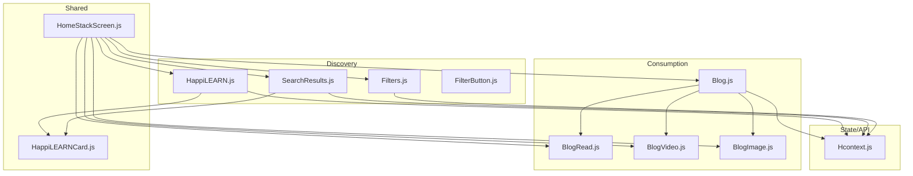
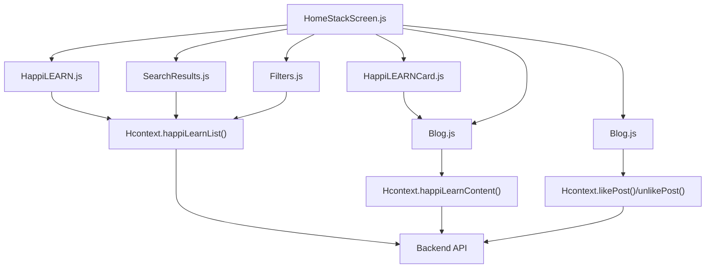
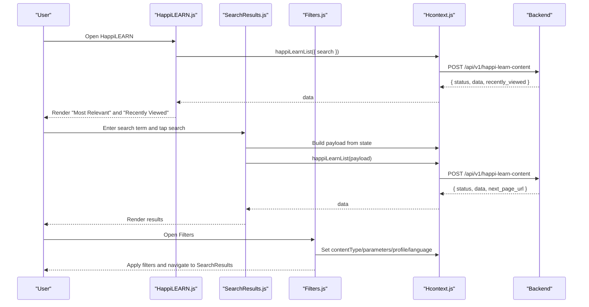
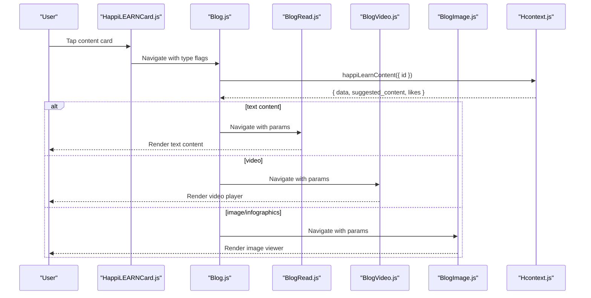
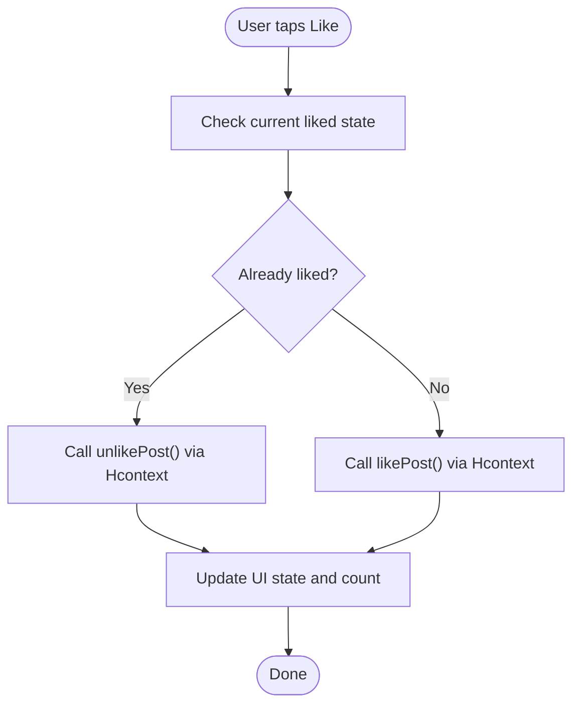
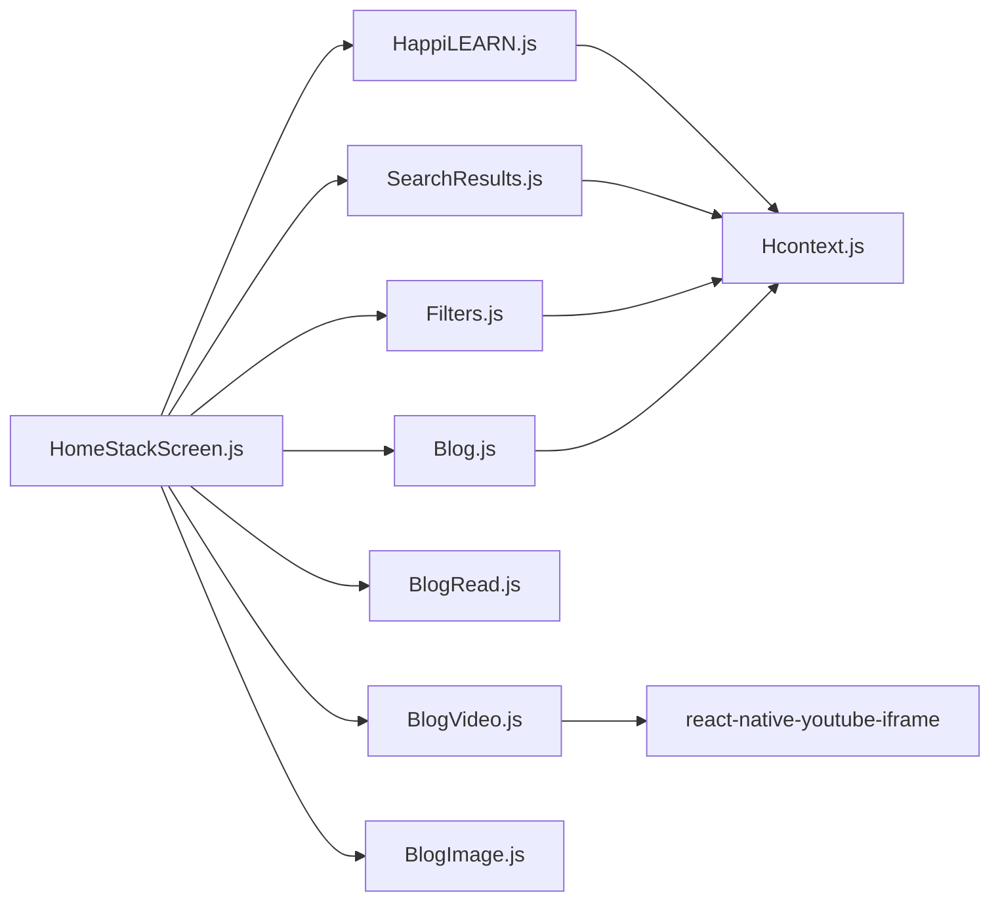

# HappiLEARN - Educational Content Module

<cite>
**Referenced Files in This Document**
- [HappiLEARN.js](file://src/screens/HappiLEARN/HappiLEARN.js)
- [HappiLEARNDescription.js](file://src/screens/HappiLEARN/HappiLEARNDescription.js)
- [SearchResults.js](file://src/screens/HappiLEARN/SearchResults.js)
- [HappiLEARNCard.js](file://src/components/cards/HappiLEARNCard.js)
- [HomeStackScreen.js](file://src/routes/Individual/HomeStackScreen.js)
- [Hcontext.js](file://src/context/Hcontext.js)
- [Filters.js](file://src/screens/Individual/Filters.js)
- [FilterButton.js](file://src/components/buttons/FilterButton.js)
- [Blog.js](file://src/screens/Individual/Blog.js)
- [BlogRead.js](file://src/screens/Individual/BlogRead.js)
- [BlogVideo.js](file://src/screens/Individual/BlogVideo.js)
- [BlogImage.js](file://src/screens/Individual/BlogImage.js)
- [package.json](file://package.json)
</cite>

## Table of Contents
1. [Introduction](#introduction)
2. [Project Structure](#project-structure)
3. [Core Components](#core-components)
4. [Architecture Overview](#architecture-overview)
5. [Detailed Component Analysis](#detailed-component-analysis)
6. [Dependency Analysis](#dependency-analysis)
7. [Performance Considerations](#performance-considerations)
8. [Troubleshooting Guide](#troubleshooting-guide)
9. [Conclusion](#conclusion)
10. [Appendices](#appendices)

## Introduction
HappiLEARN is the educational content module within HappiMynd that delivers a virtual self-learning space focused on emotional and mental wellbeing. It provides access to a curated repository of 5000+ minutes of research-backed content in English and Hindi, including blogs, videos, infographics, and images. Users can discover content via search, category filters, and personalized recommendations, consume content through dedicated readers and players, and track engagement through likes and suggested content. The module integrates with HappiMynd’s authentication, subscriptions, and analytics systems to deliver a seamless learning experience.

## Project Structure
HappiLEARN is organized around three primary screens and supporting components:
- Content discovery and browsing: HappiLEARN (home), SearchResults (search and filters), Filters (filtering UI)
- Content consumption: Blog (generic reader), BlogRead (text-based reader), BlogVideo (YouTube player), BlogImage (image viewer)
- Shared UI: HappiLEARNCard (content card), FilterButton (filter trigger)
- Navigation: HomeStackScreen (stack navigator for HappiLEARN and related screens)
- State and APIs: Hcontext (context provider exposing content APIs, filters, and analytics)

**Diagram sources**
- [HappiLEARN.js:1-262](file://src/screens/HappiLEARN/HappiLEARN.js#L1-L262)
- [SearchResults.js:1-270](file://src/screens/HappiLEARN/SearchResults.js#L1-L270)
- [Filters.js:1-408](file://src/screens/Individual/Filters.js#L1-L408)
- [FilterButton.js:1-61](file://src/components/buttons/FilterButton.js#L1-L61)
- [Blog.js:1-539](file://src/screens/Individual/Blog.js#L1-L539)
- [BlogRead.js:1-231](file://src/screens/Individual/BlogRead.js#L1-L231)
- [BlogVideo.js:1-270](file://src/screens/Individual/BlogVideo.js#L1-L270)
- [BlogImage.js:1-248](file://src/screens/Individual/BlogImage.js#L1-L248)
- [HomeStackScreen.js:1-405](file://src/routes/Individual/HomeStackScreen.js#L1-L405)
- [Hcontext.js:547-607](file://src/context/Hcontext.js#L547-L607)

**Section sources**
- [HappiLEARN.js:1-262](file://src/screens/HappiLEARN/HappiLEARN.js#L1-L262)
- [SearchResults.js:1-270](file://src/screens/HappiLEARN/SearchResults.js#L1-L270)
- [Filters.js:1-408](file://src/screens/Individual/Filters.js#L1-L408)
- [HomeStackScreen.js:1-405](file://src/routes/Individual/HomeStackScreen.js#L1-L405)

## Core Components
- HappiLEARN (home): Renders “Most Relevant” and “Recently Viewed” content lists, search bar, and filter button. Fetches content via Hcontext and navigates to search results.
- SearchResults: Implements paginated search with filters applied. Uses FlatList for efficient rendering and loads more results via an end-of-list callback.
- Filters: Provides a multi-category filter interface (content type, parameters, profile, language) and applies selections to Hcontext state.
- HappiLEARNCard: Displays content thumbnails, type badges, like counts, and navigation to the appropriate reader.
- Blog family: Blog.js orchestrates content loading and routing to specialized readers (BlogRead, BlogVideo, BlogImage). It also manages likes and related content suggestions.
- Hcontext: Exposes content APIs (list, content by ID, like/unlike), filter state, and analytics.

Key capabilities:
- Content discovery: search, category filters, and “Recently Viewed”
- Consumption: text blogs, videos (YouTube), infographics, and images
- Engagement: likes and suggested content
- Navigation: stack-based routing for HappiLEARN and readers

**Section sources**
- [HappiLEARN.js:66-226](file://src/screens/HappiLEARN/HappiLEARN.js#L66-L226)
- [SearchResults.js:67-233](file://src/screens/HappiLEARN/SearchResults.js#L67-L233)
- [Filters.js:289-328](file://src/screens/Individual/Filters.js#L289-L328)
- [HappiLEARNCard.js:21-134](file://src/components/cards/HappiLEARNCard.js#L21-L134)
- [Blog.js:163-480](file://src/screens/Individual/Blog.js#L163-L480)
- [Hcontext.js:547-607](file://src/context/Hcontext.js#L547-L607)

## Architecture Overview
HappiLEARN follows a layered architecture:
- UI Layer: Screens and components for discovery, filtering, and consumption
- Navigation Layer: Stack navigator routes to HappiLEARN, search, filters, and readers
- State and API Layer: Hcontext centralizes content APIs, filter state, and analytics
- Data Layer: Backend endpoints for content listing, content retrieval, and engagement actions

**Diagram sources**
- [HappiLEARN.js:97-110](file://src/screens/HappiLEARN/HappiLEARN.js#L97-L110)
- [SearchResults.js:94-127](file://src/screens/HappiLEARN/SearchResults.js#L94-L127)
- [Filters.js:226-255](file://src/screens/Individual/Filters.js#L226-L255)
- [Blog.js:201-233](file://src/screens/Individual/Blog.js#L201-L233)
- [Blog.js:235-271](file://src/screens/Individual/Blog.js#L235-L271)
- [HomeStackScreen.js:220-274](file://src/routes/Individual/HomeStackScreen.js#L220-L274)
- [Hcontext.js:547-607](file://src/context/Hcontext.js#L547-L607)

## Detailed Component Analysis

### Content Discovery and Filtering
- HappiLEARN home screen:
  - Displays “Most Relevant” and “Recently Viewed” content lists
  - Integrates search field and filter button
  - Fetches content via Hcontext.happiLearnList and updates state
- SearchResults:
  - Builds a query payload from Hcontext state (search term, content type, parameters, profile, language)
  - Paginates results using an end-of-list callback and axios post to nextPageLink
- Filters:
  - Multi-category selection (content type, parameters, profile, language)
  - Applies selections to Hcontext state and navigates to SearchResults

**Diagram sources**
- [HappiLEARN.js:97-110](file://src/screens/HappiLEARN/HappiLEARN.js#L97-L110)
- [SearchResults.js:94-127](file://src/screens/HappiLEARN/SearchResults.js#L94-L127)
- [Filters.js:226-255](file://src/screens/Individual/Filters.js#L226-L255)
- [Hcontext.js:547-568](file://src/context/Hcontext.js#L547-L568)

**Section sources**
- [HappiLEARN.js:66-226](file://src/screens/HappiLEARN/HappiLEARN.js#L66-L226)
- [SearchResults.js:67-233](file://src/screens/HappiLEARN/SearchResults.js#L67-L233)
- [Filters.js:289-328](file://src/screens/Individual/Filters.js#L289-L328)

### Content Consumption Workflows
- Generic Blog reader:
  - Loads content by ID via Hcontext.happiLearnContent
  - Supports toggling likes and displays related content suggestions
  - Routes to specialized readers based on content type (text, video, image, infographics)
- Text-based reader (BlogRead):
  - Displays title, type badge, description, profile, keywords, and credit
- Video player (BlogVideo):
  - Extracts YouTube ID and renders a responsive player
- Image viewer (BlogImage):
  - Opens full-screen image preview

**Diagram sources**
- [HappiLEARNCard.js:80-92](file://src/components/cards/HappiLEARNCard.js#L80-L92)
- [Blog.js:163-480](file://src/screens/Individual/Blog.js#L163-L480)
- [BlogRead.js:78-148](file://src/screens/Individual/BlogRead.js#L78-L148)
- [BlogVideo.js:112-193](file://src/screens/Individual/BlogVideo.js#L112-L193)
- [BlogImage.js:58-198](file://src/screens/Individual/BlogImage.js#L58-L198)
- [Hcontext.js:570-581](file://src/context/Hcontext.js#L570-L581)

**Section sources**
- [Blog.js:163-480](file://src/screens/Individual/Blog.js#L163-L480)
- [BlogRead.js:78-148](file://src/screens/Individual/BlogRead.js#L78-L148)
- [BlogVideo.js:112-193](file://src/screens/Individual/BlogVideo.js#L112-L193)
- [BlogImage.js:58-198](file://src/screens/Individual/BlogImage.js#L58-L198)

### Progress Tracking and Engagement
- Likes and engagement:
  - HappiLEARNCard supports toggling likes and updating like counts
  - Blog reader supports toggling likes and displaying like counts
- Recently viewed:
  - HappiLEARN home screen displays “Recently Viewed” content derived from backend response
- Analytics:
  - Hcontext.screenTrafficAnalytics logs screen views to an analytics endpoint

**Diagram sources**
- [HappiLEARNCard.js:48-78](file://src/components/cards/HappiLEARNCard.js#L48-L78)
- [Blog.js:235-271](file://src/screens/Individual/Blog.js#L235-L271)
- [Hcontext.js:583-607](file://src/context/Hcontext.js#L583-L607)

**Section sources**
- [HappiLEARNCard.js:21-134](file://src/components/cards/HappiLEARNCard.js#L21-L134)
- [Blog.js:163-480](file://src/screens/Individual/Blog.js#L163-L480)
- [HappiLEARN.js:87-110](file://src/screens/HappiLEARN/HappiLEARN.js#L87-L110)

### Content Curation and Quality Assurance
- Curated repository:
  - Content is curated for emotional and mental wellbeing, available in English and Hindi
- Quality indicators:
  - Content metadata includes type, profile, keywords, and credit
  - Related content suggestions help reinforce learning themes

**Section sources**
- [HappiLEARNDescription.js:92-102](file://src/screens/HappiLEARN/HappiLEARNDescription.js#L92-L102)
- [Blog.js:201-233](file://src/screens/Individual/Blog.js#L201-L233)

### Licensing and Copyright Considerations
- Content licensing:
  - Content includes credit attribution; users are encouraged to respect third-party licenses
- External links:
  - Some content may link out to external sources; HappiLEARN opens external URLs securely

**Section sources**
- [Blog.js:273-279](file://src/screens/Individual/Blog.js#L273-L279)

### Integration with External Educational Resources and Partnerships
- YouTube integration:
  - Videos are embedded via react-native-youtube-iframe for a native experience
- External content links:
  - Blogs may link to external resources; HappiLEARN opens these links safely

**Section sources**
- [BlogVideo.js:23](file://src/screens/Individual/BlogVideo.js#L23)
- [Blog.js:273-279](file://src/screens/Individual/Blog.js#L273-L279)

### Accessibility Features
- Responsive UI:
  - Uses responsive units for font sizes and layout scaling across devices
- Image viewing:
  - Full-screen image viewer with pinch-to-zoom and double-tap controls
- Video playback:
  - Hardware-accelerated WebView for smoother playback

**Section sources**
- [BlogVideo.js:155-169](file://src/screens/Individual/BlogVideo.js#L155-L169)
- [BlogImage.js:106-113](file://src/screens/Individual/BlogImage.js#L106-L113)
- [package.json:93](file://package.json#L93)

### Content Moderation and Safety Measures
- Moderation:
  - Content is curated for mental wellbeing; moderation policies are enforced by the backend
- Safety:
  - External links are opened via secure handlers; image viewers prevent unsafe gestures

**Section sources**
- [HappiLEARNDescription.js:92-102](file://src/screens/HappiLEARN/HappiLEARNDescription.js#L92-L102)
- [Blog.js:273-279](file://src/screens/Individual/Blog.js#L273-L279)

## Dependency Analysis
HappiLEARN depends on:
- Navigation: HomeStackScreen registers HappiLEARN, search, filters, and readers
- State: Hcontext exposes content APIs, filter state, and analytics
- UI: HappiLEARNCard, FilterButton, and reader screens
- Media: react-native-youtube-iframe for video playback

**Diagram sources**
- [HomeStackScreen.js:220-274](file://src/routes/Individual/HomeStackScreen.js#L220-L274)
- [HappiLEARN.js:12-26](file://src/screens/HappiLEARN/HappiLEARN.js#L12-L26)
- [SearchResults.js:22-27](file://src/screens/HappiLEARN/SearchResults.js#L22-L27)
- [Filters.js:21](file://src/screens/Individual/Filters.js#L21)
- [Blog.js:29](file://src/screens/Individual/Blog.js#L29)
- [BlogVideo.js:23](file://src/screens/Individual/BlogVideo.js#L23)

**Section sources**
- [HomeStackScreen.js:1-405](file://src/routes/Individual/HomeStackScreen.js#L1-L405)
- [HappiLEARN.js:1-262](file://src/screens/HappiLEARN/HappiLEARN.js#L1-L262)
- [SearchResults.js:1-270](file://src/screens/HappiLEARN/SearchResults.js#L1-L270)
- [Filters.js:1-408](file://src/screens/Individual/Filters.js#L1-L408)
- [Blog.js:1-539](file://src/screens/Individual/Blog.js#L1-L539)
- [BlogVideo.js:1-270](file://src/screens/Individual/BlogVideo.js#L1-L270)
- [BlogImage.js:1-248](file://src/screens/Individual/BlogImage.js#L1-L248)

## Performance Considerations
- Efficient rendering:
  - FlatList in SearchResults minimizes re-renders during pagination
  - Memoized sub-components reduce unnecessary re-renders in Blog
- Lazy loading:
  - Video player initializes on ready to avoid blocking UI
- Network optimization:
  - Pagination via nextPageLink reduces initial payload size
- UI responsiveness:
  - Responsive units scale layouts across devices

**Section sources**
- [SearchResults.js:206-227](file://src/screens/HappiLEARN/SearchResults.js#L206-L227)
- [Blog.js:38-74](file://src/screens/Individual/Blog.js#L38-L74)
- [BlogVideo.js:130-132](file://src/screens/Individual/BlogVideo.js#L130-L132)

## Troubleshooting Guide
- Content not loading:
  - Verify network connectivity and backend availability
  - Check console logs for errors from HappiLEARN and SearchResults fetch functions
- Pagination issues:
  - Ensure nextPageLink is present and accessible
  - Confirm axios post to nextPageLink succeeds
- Filter not applying:
  - Verify selected filters are set in Hcontext state
  - Confirm navigation to SearchResults after applying filters
- Video playback problems:
  - Validate YouTube URL extraction and videoId
  - Ensure react-native-youtube-iframe is properly linked

**Section sources**
- [SearchResults.js:129-159](file://src/screens/HappiLEARN/SearchResults.js#L129-L159)
- [Filters.js:226-255](file://src/screens/Individual/Filters.js#L226-L255)
- [BlogVideo.js:33-44](file://src/screens/Individual/BlogVideo.js#L33-L44)

## Conclusion
HappiLEARN provides a robust, scalable educational content module tailored for mental wellbeing. Its discovery mechanisms (search, filters, recently viewed), consumption workflows (text, video, image), and engagement features (likes, suggestions) are integrated through a clean navigation and state layer. The module leverages responsive UI, efficient rendering, and media integrations to deliver a smooth user experience while maintaining safety and accessibility standards.

## Appendices
- External dependencies used by HappiLEARN:
  - react-native-youtube-iframe for video playback
  - react-native-image-viewing for image previews
  - react-native-responsive-* for responsive UI
  - axios for API requests

**Section sources**
- [package.json:24](file://package.json#L24)
- [package.json:93](file://package.json#L93)
- [BlogVideo.js:23](file://src/screens/Individual/BlogVideo.js#L23)
- [BlogImage.js:18](file://src/screens/Individual/BlogImage.js#L18)