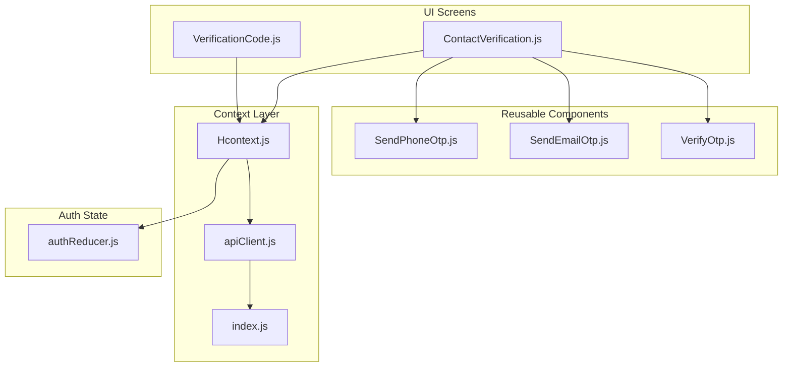
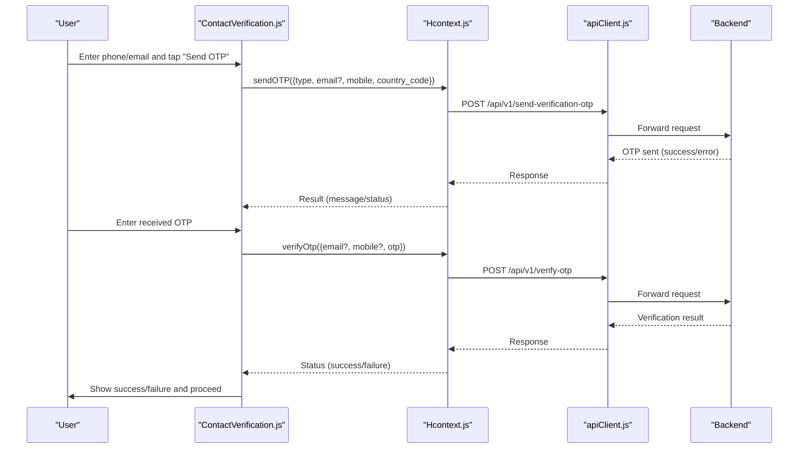
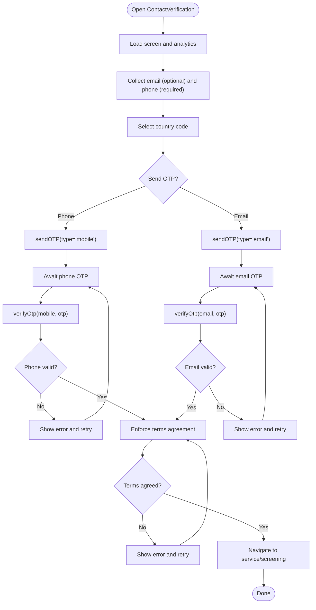
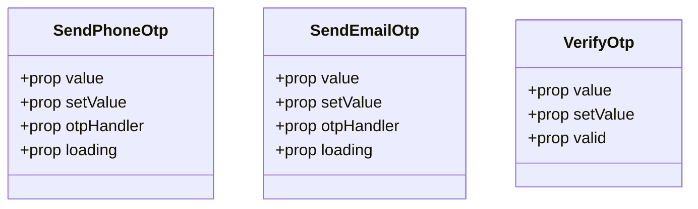
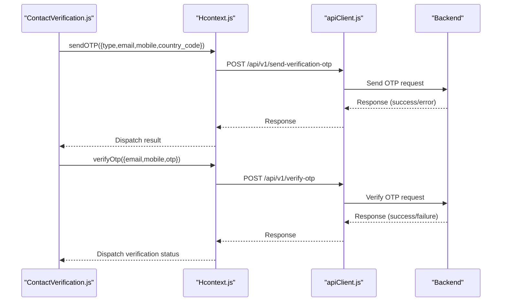
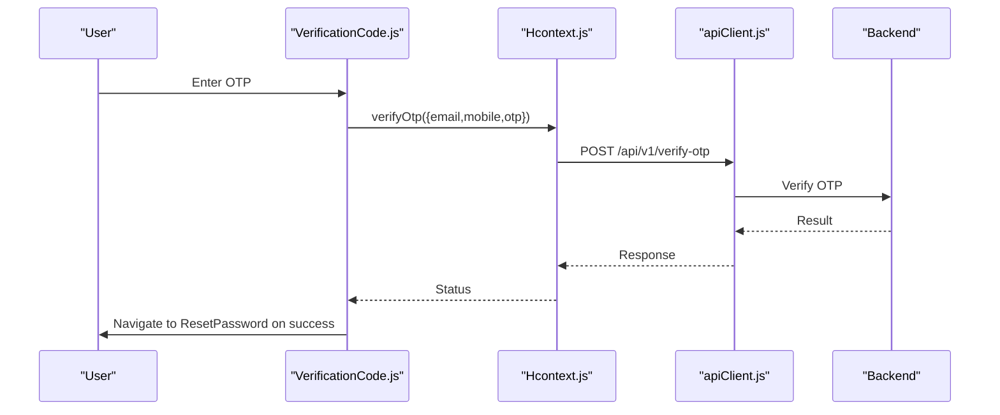
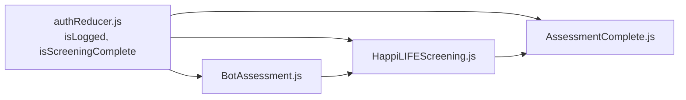
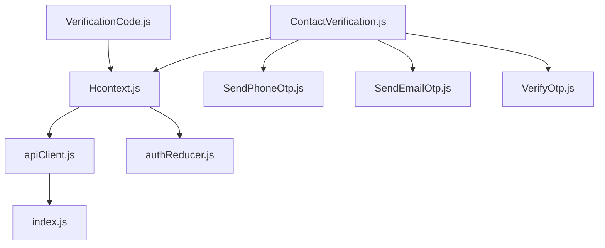
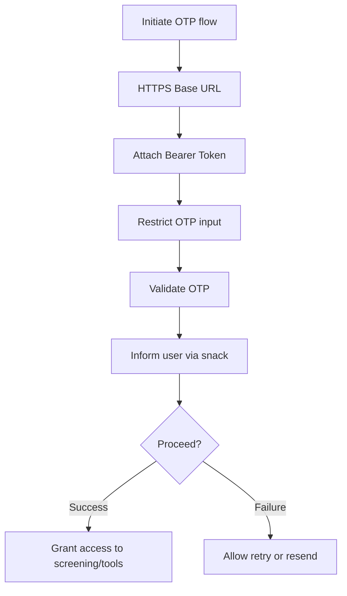

# Contact Verification Process

<cite>
**Referenced Files in This Document**
- [ContactVerification.js](file://src/screens/HappiLIFE/ContactVerification.js)
- [SendPhoneOtp.js](file://src/components/input/SendPhoneOtp.js)
- [SendEmailOtp.js](file://src/components/input/SendEmailOtp.js)
- [VerifyOtp.js](file://src/components/input/VerifyOtp.js)
- [VerificationCode.js](file://src/screens/Auth/VerificationCode.js)
- [Hcontext.js](file://src/context/Hcontext.js)
- [apiClient.js](file://src/context/apiClient.js)
- [index.js](file://src/config/index.js)
- [authReducer.js](file://src/context/reducers/authReducer.js)
- [BotAssessment.js](file://src/screens/Chat/BotAssessment.js)
- [HappiLIFEScreening.js](file://src/screens/HappiLIFE/HappiLIFEScreening.js)
- [AssessmentComplete.js](file://src/screens/HappiLIFE/AssessmentComplete.js)
- [PrivacyPolicy.js](file://src/screens/shared/PrivacyPolicy.js)
</cite>

## Table of Contents
1. [Introduction](#introduction)
2. [Project Structure](#project-structure)
3. [Core Components](#core-components)
4. [Architecture Overview](#architecture-overview)
5. [Detailed Component Analysis](#detailed-component-analysis)
6. [Dependency Analysis](#dependency-analysis)
7. [Performance Considerations](#performance-considerations)
8. [Security Measures](#security-measures)
9. [Compliance and Data Retention](#compliance-and-data-retention)
10. [Troubleshooting Guide](#troubleshooting-guide)
11. [Conclusion](#conclusion)

## Introduction
This document describes the contact verification process used to ensure secure and authenticated participation in screening activities. It covers the verification methods (phone OTP and optional email), integration with authentication systems, how verified contacts enable access to screening tools, security measures protecting user contact information, fallback mechanisms for verification failures, retry processes, and compliance considerations for handling sensitive contact data.

## Project Structure
The contact verification flow spans UI screens, reusable input components, and the central application context that orchestrates API communication and authentication state.

**Diagram sources**
- [ContactVerification.js:1-602](file://src/screens/HappiLIFE/ContactVerification.js#L1-L602)
- [VerificationCode.js:1-143](file://src/screens/Auth/VerificationCode.js#L1-L143)
- [SendPhoneOtp.js:1-106](file://src/components/input/SendPhoneOtp.js#L1-L106)
- [SendEmailOtp.js:1-96](file://src/components/input/SendEmailOtp.js#L1-L96)
- [VerifyOtp.js:1-57](file://src/components/input/VerifyOtp.js#L1-L57)
- [Hcontext.js:1-1551](file://src/context/Hcontext.js#L1-L1551)
- [apiClient.js:1-58](file://src/context/apiClient.js#L1-L58)
- [index.js:1-13](file://src/config/index.js#L1-L13)
- [authReducer.js:1-79](file://src/context/reducers/authReducer.js#L1-L79)

**Section sources**
- [ContactVerification.js:1-602](file://src/screens/HappiLIFE/ContactVerification.js#L1-L602)
- [VerificationCode.js:1-143](file://src/screens/Auth/VerificationCode.js#L1-L143)
- [SendPhoneOtp.js:1-106](file://src/components/input/SendPhoneOtp.js#L1-L106)
- [SendEmailOtp.js:1-96](file://src/components/input/SendEmailOtp.js#L1-L96)
- [VerifyOtp.js:1-57](file://src/components/input/VerifyOtp.js#L1-L57)
- [Hcontext.js:1-1551](file://src/context/Hcontext.js#L1-L1551)
- [apiClient.js:1-58](file://src/context/apiClient.js#L1-L58)
- [index.js:1-13](file://src/config/index.js#L1-L13)
- [authReducer.js:1-79](file://src/context/reducers/authReducer.js#L1-L79)

## Core Components
- ContactVerification screen: Collects optional email and mandatory phone number, sends OTPs, validates OTPs, enforces terms agreement, and routes users to appropriate screening or service flows after successful verification.
- OTP input components: Reusable SendPhoneOtp, SendEmailOtp, and VerifyOtp components encapsulate UI and basic validation for OTP entry and display.
- Hcontext: Centralized provider exposing sendOTP, verifyOtp, and other methods used by verification flows. It manages authentication state and attaches tokens to outgoing requests.
- Authentication reducer: Manages logged-in state, guest mode, and screening completion flags used across the app.
- API client: Intercepts requests to attach bearer tokens and handles errors consistently.

Key responsibilities:
- Phone OTP verification is mandatory for accessing HappiLIFE screening and related services.
- Optional email verification supports password recovery and communications.
- Verified contacts unlock access to screening tools and downstream services.

**Section sources**
- [ContactVerification.js:46-222](file://src/screens/HappiLIFE/ContactVerification.js#L46-L222)
- [SendPhoneOtp.js:19-79](file://src/components/input/SendPhoneOtp.js#L19-L79)
- [SendEmailOtp.js:19-69](file://src/components/input/SendEmailOtp.js#L19-L69)
- [VerifyOtp.js:13-43](file://src/components/input/VerifyOtp.js#L13-L43)
- [Hcontext.js:667-698](file://src/context/Hcontext.js#L667-L698)
- [Hcontext.js:343-359](file://src/context/Hcontext.js#L343-L359)
- [authReducer.js:5-79](file://src/context/reducers/authReducer.js#L5-L79)
- [apiClient.js:11-56](file://src/context/apiClient.js#L11-L56)

## Architecture Overview
The verification architecture integrates UI screens with reusable components and the context layer to orchestrate OTP-based authentication and route users to screening tools.

**Diagram sources**
- [ContactVerification.js:119-171](file://src/screens/HappiLIFE/ContactVerification.js#L119-L171)
- [Hcontext.js:667-698](file://src/context/Hcontext.js#L667-L698)
- [Hcontext.js:343-359](file://src/context/Hcontext.js#L343-L359)
- [apiClient.js:11-56](file://src/context/apiClient.js#L11-L56)

## Detailed Component Analysis

### ContactVerification Screen
- Purpose: Collects optional email and mandatory phone number, manages OTP flows, validates terms, and routes users to screening or service pages upon successful verification.
- Key behaviors:
  - Phone OTP is mandatory before proceeding to screening or related services.
  - Optional email OTP can be used for password recovery and communications.
  - Terms agreement is enforced before allowing access.
  - Country code selection is supported for phone numbers.
  - Analytics tracking is invoked on screen focus.

**Diagram sources**
- [ContactVerification.js:60-222](file://src/screens/HappiLIFE/ContactVerification.js#L60-L222)

**Section sources**
- [ContactVerification.js:46-222](file://src/screens/HappiLIFE/ContactVerification.js#L46-L222)

### OTP Input Components
- SendPhoneOtp: Encapsulates phone input with country code and OTP send button.
- SendEmailOtp: Encapsulates email input and OTP send button.
- VerifyOtp: Encapsulates OTP input with visual validation indicator.

**Diagram sources**
- [SendPhoneOtp.js:19-79](file://src/components/input/SendPhoneOtp.js#L19-L79)
- [SendEmailOtp.js:19-69](file://src/components/input/SendEmailOtp.js#L19-L69)
- [VerifyOtp.js:13-43](file://src/components/input/VerifyOtp.js#L13-L43)

**Section sources**
- [SendPhoneOtp.js:1-106](file://src/components/input/SendPhoneOtp.js#L1-L106)
- [SendEmailOtp.js:1-96](file://src/components/input/SendEmailOtp.js#L1-L96)
- [VerifyOtp.js:1-57](file://src/components/input/VerifyOtp.js#L1-L57)

### Authentication and Verification Orchestration (Hcontext)
- sendOTP: Sends verification OTP via POST to /api/v1/send-verification-otp with either email or mobile and country code.
- verifyOtp: Verifies OTP via POST to /api/v1/verify-otp with email, mobile, and OTP.
- Token injection: apiClient attaches Bearer token to requests using global or AsyncStorage-stored tokens.
- Error handling: Displays snack messages for OTP errors and duplicate registrations.

**Diagram sources**
- [Hcontext.js:667-698](file://src/context/Hcontext.js#L667-L698)
- [Hcontext.js:343-359](file://src/context/Hcontext.js#L343-L359)
- [apiClient.js:11-56](file://src/context/apiClient.js#L11-L56)

**Section sources**
- [Hcontext.js:343-359](file://src/context/Hcontext.js#L343-L359)
- [Hcontext.js:667-698](file://src/context/Hcontext.js#L667-L698)
- [apiClient.js:11-56](file://src/context/apiClient.js#L11-L56)

### Password Recovery OTP Flow (VerificationCode)
- Purpose: Allows users to receive and verify OTP for password reset using either email or mobile.
- Behavior: Validates OTP and navigates to reset password screen on success.

**Diagram sources**
- [VerificationCode.js:35-58](file://src/screens/Auth/VerificationCode.js#L35-L58)
- [Hcontext.js:343-359](file://src/context/Hcontext.js#L343-L359)
- [apiClient.js:11-56](file://src/context/apiClient.js#L11-L56)

**Section sources**
- [VerificationCode.js:1-143](file://src/screens/Auth/VerificationCode.js#L1-L143)
- [Hcontext.js:343-359](file://src/context/Hcontext.js#L343-L359)

### Access Control and Screening Integration
- Verified contacts enable access to HappiLIFE screening and related services.
- Authentication state flags (e.g., isScreeningComplete) influence UI and routing decisions.
- Bot-assessment and screening screens rely on authenticated sessions and may gate access until verification is complete.

**Diagram sources**
- [authReducer.js:5-79](file://src/context/reducers/authReducer.js#L5-L79)
- [BotAssessment.js:28-38](file://src/screens/Chat/BotAssessment.js#L28-L38)
- [HappiLIFEScreening.js:53-118](file://src/screens/HappiLIFE/HappiLIFEScreening.js#L53-L118)
- [AssessmentComplete.js:26-35](file://src/screens/HappiLIFE/AssessmentComplete.js#L26-L35)

**Section sources**
- [authReducer.js:17-79](file://src/context/reducers/authReducer.js#L17-L79)
- [BotAssessment.js:28-38](file://src/screens/Chat/BotAssessment.js#L28-L38)
- [HappiLIFEScreening.js:53-118](file://src/screens/HappiLIFE/HappiLIFEScreening.js#L53-L118)
- [AssessmentComplete.js:26-35](file://src/screens/HappiLIFE/AssessmentComplete.js#L26-L35)

## Dependency Analysis
- UI depends on reusable OTP components for consistent UX.
- ContactVerification orchestrates Hcontext methods for OTP lifecycle.
- Hcontext depends on apiClient for backend communication and on authReducer for state.
- apiClient depends on config for base URLs and attaches tokens from global or AsyncStorage.

**Diagram sources**
- [ContactVerification.js:46-58](file://src/screens/HappiLIFE/ContactVerification.js#L46-L58)
- [VerificationCode.js:19-24](file://src/screens/Auth/VerificationCode.js#L19-L24)
- [Hcontext.js:1408-1551](file://src/context/Hcontext.js#L1408-L1551)
- [apiClient.js:1-58](file://src/context/apiClient.js#L1-L58)
- [index.js:1-13](file://src/config/index.js#L1-L13)
- [authReducer.js:1-79](file://src/context/reducers/authReducer.js#L1-L79)
- [SendPhoneOtp.js:1-106](file://src/components/input/SendPhoneOtp.js#L1-L106)
- [SendEmailOtp.js:1-96](file://src/components/input/SendEmailOtp.js#L1-L96)
- [VerifyOtp.js:1-57](file://src/components/input/VerifyOtp.js#L1-L57)

**Section sources**
- [ContactVerification.js:46-58](file://src/screens/HappiLIFE/ContactVerification.js#L46-L58)
- [VerificationCode.js:19-24](file://src/screens/Auth/VerificationCode.js#L19-L24)
- [Hcontext.js:1408-1551](file://src/context/Hcontext.js#L1408-L1551)
- [apiClient.js:1-58](file://src/context/apiClient.js#L1-L58)
- [index.js:1-13](file://src/config/index.js#L1-L13)
- [authReducer.js:1-79](file://src/context/reducers/authReducer.js#L1-L79)
- [SendPhoneOtp.js:1-106](file://src/components/input/SendPhoneOtp.js#L1-L106)
- [SendEmailOtp.js:1-96](file://src/components/input/SendEmailOtp.js#L1-L96)
- [VerifyOtp.js:1-57](file://src/components/input/VerifyOtp.js#L1-L57)

## Performance Considerations
- Network timeouts: apiClient sets a 15-second timeout to prevent hanging requests.
- Token caching: Global token caching reduces repeated AsyncStorage reads.
- Conditional rendering: Loading indicators and disabled states improve perceived performance during OTP operations.
- Analytics: Minimal analytics calls avoid unnecessary overhead.

Recommendations:
- Debounce OTP submission to reduce redundant network calls.
- Cache recent OTP attempts locally to support quick retries.
- Optimize country code picker rendering if performance issues arise.

**Section sources**
- [apiClient.js:6-9](file://src/context/apiClient.js#L6-L9)
- [apiClient.js:12-44](file://src/context/apiClient.js#L12-L44)
- [ContactVerification.js:119-143](file://src/screens/HappiLIFE/ContactVerification.js#L119-L143)

## Security Measures
- Transport security: Backend base URL uses HTTPS.
- Token handling: Bearer tokens are attached automatically to authenticated requests via interceptors.
- Input sanitization: OTP inputs restrict numeric entries where applicable.
- Error handling: Snack notifications inform users of OTP failures without leaking sensitive details.
- Terms enforcement: Users must agree to terms and privacy policies before proceeding, reducing misuse risk.

**Diagram sources**
- [index.js](file://src/config/index.js#L3)
- [apiClient.js:12-44](file://src/context/apiClient.js#L12-L44)
- [SendPhoneOtp.js](file://src/components/input/SendPhoneOtp.js#L54)
- [VerifyOtp.js](file://src/components/input/VerifyOtp.js#L24)
- [Hcontext.js:343-359](file://src/context/Hcontext.js#L343-L359)

**Section sources**
- [index.js:1-13](file://src/config/index.js#L1-L13)
- [apiClient.js:11-56](file://src/context/apiClient.js#L11-L56)
- [SendPhoneOtp.js:54-58](file://src/components/input/SendPhoneOtp.js#L54-L58)
- [VerifyOtp.js:24-30](file://src/components/input/VerifyOtp.js#L24-L30)
- [Hcontext.js:343-359](file://src/context/Hcontext.js#L343-L359)

## Compliance and Data Retention
- Privacy policy acknowledges that communications may occur via email or SMS and disclaims liability for third-party interception. Users are responsible for securing their email and phone accounts.
- Verification records are handled server-side via OTP endpoints; client-side does not persist sensitive contact data beyond transient UI state.

Compliance considerations:
- Minimize data collection: Only collect phone (required) and optional email.
- Transparent terms: Require explicit agreement to terms and privacy policy.
- Secure transport: Ensure HTTPS for all endpoints.
- User control: Allow users to manage their contact details and opt out of communications.

**Section sources**
- [PrivacyPolicy.js:81-89](file://src/screens/shared/PrivacyPolicy.js#L81-L89)
- [Hcontext.js:667-698](file://src/context/Hcontext.js#L667-L698)
- [Hcontext.js:343-359](file://src/context/Hcontext.js#L343-L359)

## Troubleshooting Guide
Common issues and resolutions:
- OTP not received:
  - Resend OTP using the sendOTP method.
  - Verify phone number format and country code.
  - Confirm network connectivity and HTTPS base URL.
- Incorrect OTP:
  - Display snack message indicating incorrect OTP.
  - Allow immediate retry without requiring re-entry of contact details.
- Duplicate registration:
  - Snack messages indicate if email or mobile is already registered.
  - Advise users to use the password recovery flow.
- Terms not agreed:
  - Enforce terms toggle before allowing navigation.
  - Show inline error message if unchecked.

Operational checks:
- Validate that Bearer token is present for authenticated endpoints.
- Confirm analytics calls succeed without blocking UI.
- Ensure back navigation behaves correctly based on origin context (e.g., Bot, Talk, Guide, Voice).

**Section sources**
- [ContactVerification.js:119-171](file://src/screens/HappiLIFE/ContactVerification.js#L119-L171)
- [Hcontext.js:667-698](file://src/context/Hcontext.js#L667-L698)
- [Hcontext.js:343-359](file://src/context/Hcontext.js#L343-L359)
- [apiClient.js:12-44](file://src/context/apiClient.js#L12-L44)

## Conclusion
The contact verification process integrates UI components, centralized context orchestration, and secure API communication to ensure verified contacts can safely access screening tools. Phone OTP is mandatory, optional email OTP supports recovery and communications, and terms enforcement protects against misuse. Security measures include HTTPS, token injection, and controlled input handling. Compliance is addressed through transparent privacy statements and minimal data retention. The system provides robust fallbacks and retry mechanisms to maintain usability while enforcing security.